## JDBC学习笔记

- 2022年8月1日19点46分
- 2022年8月2日17点22分
- 于今天下午看完康老师的JDBC课程，现开始写总结
- by 灼灼某人

## 第一章 JDBC概述

### 1.1 数据的持久化

- 讲人话就是把数据放到数据库中保存下来，使用的大都是关系型数据库，而存储的形式可以是数据库文件，也可以是存储在磁盘文件、XML数据文件中。
  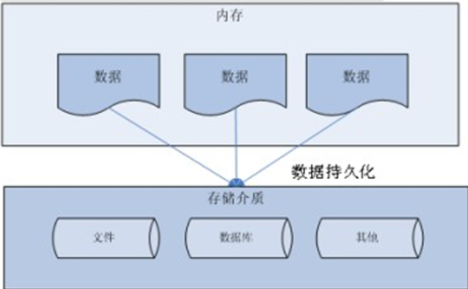

### 1.2 Java中的数据存储技术

- JDBC直接访问数据库，也是java访问数据库的基石，其他几种技术只是更好的封装了JDBC
- JDO(Java Data Object)技术
- 第三方O/R工具，例如Hibernate,MyBatis

### 1.3 JDBC介绍

- JDBC(Java Database Connectivity)是一个独立于特定数据库管理系统、通用的sql数据库存取和操作的公共接口，也就是所谓的面向接口编程
- JDBC的目标是使Java程序员使用JDBC可以连接任何提供了JDBC驱动程序的数据库系统，这样就使得程序员无需对待特定的数据库系统的特点有过多的了解，从而大大简化和加快了开发过程。
- 使用JDBC，Java程序访问数据库时是这样的：
  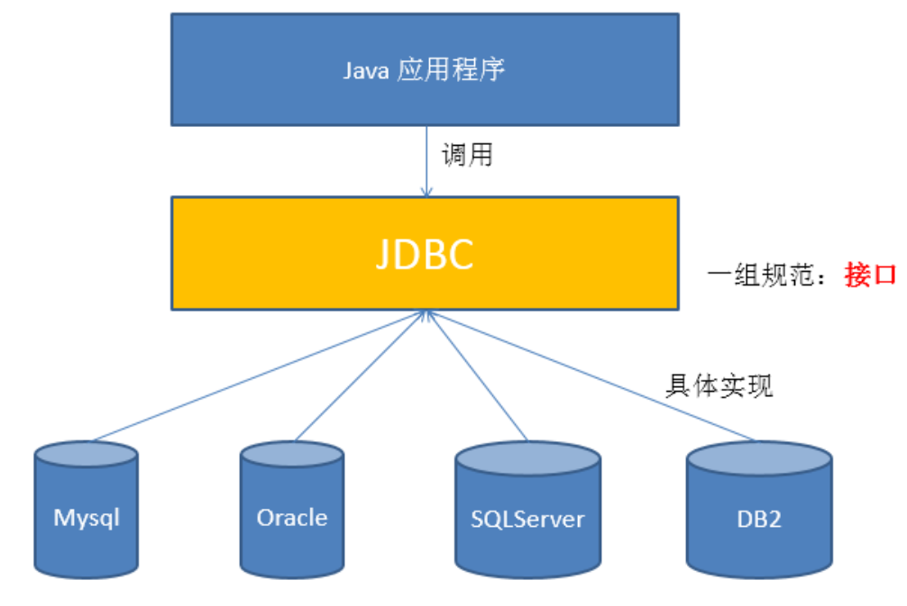
- 总结：
  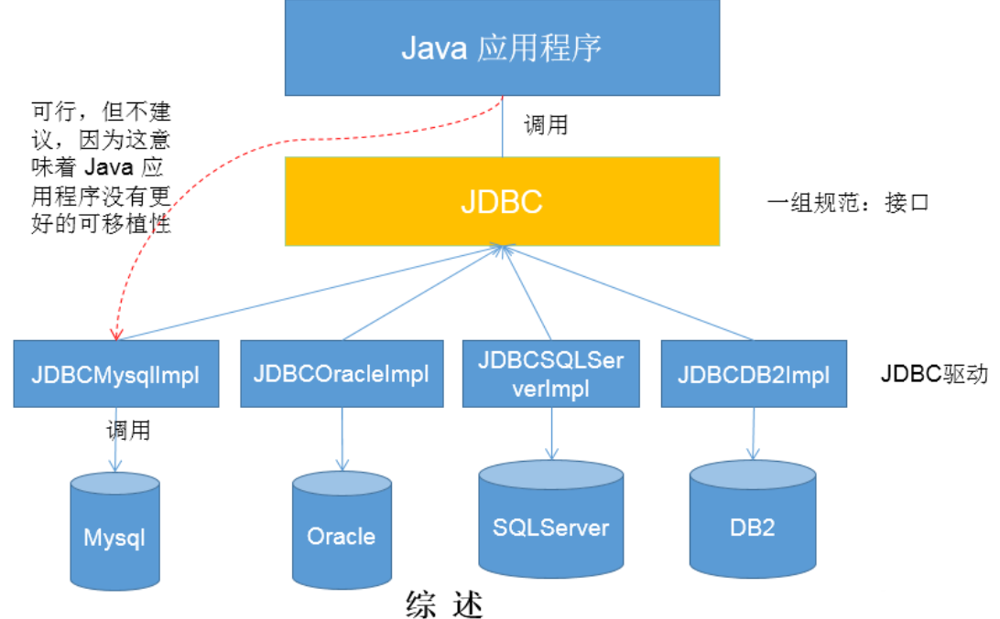

### 1.4 JDBC体系结构

- JDBC接口 包括两个层次
  - 面向应用的API，抽象接口，供应用程序开发人员使用（连接数据库，执行Sql语句，获得结果）。
  - 面向数据库的API   Java Driver API 供开发商开发数据库驱动程序用

### 1.5 JDBC程序编写步骤

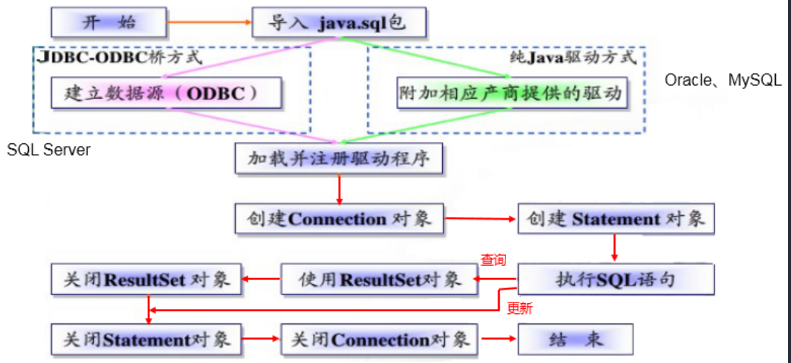
总结来说就是：

1. 先导入java.sql包
2. 加载驱动
3. 创建Connection对象
4. 创建Statement对象(preparedStatement代替了Statement)
5. 执行Sql语句
6. 后续操作

## 第二章：获取数据库连接

### 2.1 Driver接口实现类

#### 2.1.1 Driver接口介绍

- java.sql.Driver接口是所有JDBC驱动程序需要实现的接口。这个接口是提供给数据库厂商使用的，不同数据库厂商提供了不同的的实现。
- mysql的驱动： com.mysql.jdbc.Drvier(mysql8.0使用com.mysql.cj.jdbc.Driver)
- 在idea中导入驱动程序：
  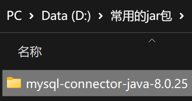
  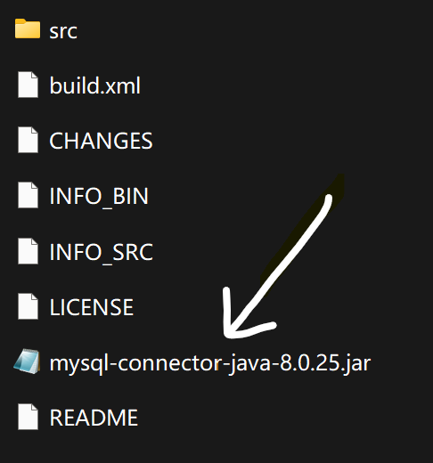
- 可以专门在Java工程下的src路径里新建一个lib文件夹，用于存放jar包
  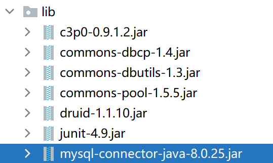
- 右键jar包，然后点击最下方的 Add as Library
  

#### 2.1.2 加载与注册JDBC驱动

- 加载JDBC驱动需要调用Class类的静态方法forName() 向其传递JDBC驱动的类名
  如： Class.forName("com.mysql.cj.jdbc.Driver");

### 2.2 URL

- JDBC URL用于表示一个被注册的驱动程序，驱动程序管理器通过这个URL选择正确的驱动程序，从而建立到数据库的连接。
- JDBC URL的标准由三部分组成，各个部分之间用冒号分隔。
  - 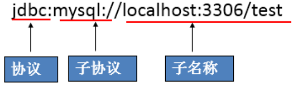
  - 但是在新版中要加入 ?rewriteBatchedStatements=true
  - 如图：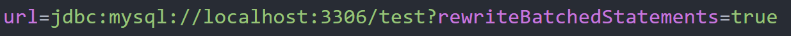

### 2.3 用户名和密码

- user和password可以用属性名=属性值的方式表示
- 如图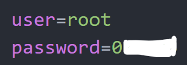

### 2.4 连接方式举例

一共有五种连接方式，前4种仅作了解，最后一种较为重要

#### 2.4.1 连接方式一

```java
    //方式一
    @Test
    public void testConnection1() throws SQLException {
        //获取Driver实现类对象
        Driver driver = new com.mysql.jdbc.Driver();

        //jdbc:mysql：协议
        //localhost:ip地址
        //3306默认的mysql的端口号
        //test：test数据库
        String url = "jdbc:mysql://localhost:3306/test?useUnicode=true&characterEncoding=utf8";

        //将用户名密码封装在Properties中
        Properties info = new Properties();
        info.setProperty("user", "root");
        info.setProperty("password", "010203");

        Connection conn = driver.connect(url, info);

        System.out.println(conn);

    }
```

这种方式已经被淘汰了，至少idea这样报的,而且使用了第三方的API，会影响java的可移植性。

#### 2.4.2 连接方式二

```java
    //方式二   对方式一的迭代      在以下的程序中不出现第三方api，使用程序具有更好的可移植性
    @Test
    public void testConnection2() throws ClassNotFoundException, InstantiationException, IllegalAccessException, SQLException {
        //获取Driver实现类对象     使用反射实现
        Class clazz = Class.forName("com.mysql.jdbc.Driver");
        Driver driver = (Driver) clazz.newInstance();

        //提供要连接的数据库
        String url = "jdbc:mysql://localhost:3306/test?useUnicode=true&characterEncoding=utf8";

        //提供连接需要的用户名和密码
        Properties info = new Properties();
        info.setProperty("user", "root");
        info.setProperty("password", "010203");

        //获取连接
        Connection conn = driver.connect(url, info);

        System.out.println(conn);

    }
```

使用反射实例化Driver，而不在代码中显式使用第三方API

#### 2.4.3 连接方式三

```java
    //方式三   使用DriverManager替换Driver
    @Test
    public void testConnetion3() throws ClassNotFoundException, InstantiationException, IllegalAccessException, SQLException {

        //获取Driver的实现类对象
        Class clazz = Class.forName("com.mysql.jdbc.Driver");
        Driver driver = (Driver) clazz.newInstance();

        //提供另外三个连接的基本信息
        String url = "jdbc:mysql://localhost:3306/test";
        String user = "root";
        String password = "010203";

        //注册驱动
        DriverManager.registerDriver(driver);

        //获取连接
        Connection conn = DriverManager.getConnection(url, user, password);
        System.out.println(conn);
    }
```

使用DriverManager实现数据库的连接

#### 2.4.3 连接方式四

```java
    //方式四           对方式三的优化     可以只是加载驱动，不用显示的注册驱动了
    @Test
    public void testConnetion4() throws ClassNotFoundException, InstantiationException, IllegalAccessException, SQLException {

        //1.提供另外三个连接的基本信息
        String url = "jdbc:mysql://localhost:3306/test";
        String user = "root";
        String password = "010203";

        //2.加载Driver
        Class.forName("com.mysql.cj.jdbc.Driver");
        //相较于方式三，可以省略以下的操作
//        Driver driver = (Driver) clazz.newInstance();
//        //注册驱动
//        DriverManager.registerDriver(driver);
        //为什么可以省略上述操作呢：     在mysql的Driver实现类中，声明了如下操作
        /*
            static {
                try {
                    DriverManager.registerDriver(new Driver());
                } catch (SQLException var1) {
                    throw new RuntimeException("Can't register driver!");
                }
            }
         */

        //3.获取连接
        Connection conn = DriverManager.getConnection(url, user, password);
        System.out.println(conn);
    }
```

不用显示的注册驱动了，因为在DriverManager的源码种已经存在静态代码块，实现了驱动的注册。

#### 2.3.5 连接方式五 重点

```java
    //最终版：      将数据库连接需要的4个基本信息声明在配置文件中，通过读取该配置文件的方式，获取连接
    //实现了数据与代码的分离，解耦
    //如果需要修改配置文件基本信息，可以避免程序重新打包
    @Test
    public void getConnection5() throws IOException, ClassNotFoundException, SQLException {

        //读取配置文件中的4个基本信息
	//ConnectionTest.class获取该类的对象 .getClassLoader()获取类加载器 后面的事获取资源
        InputStream is = ConnectionTest.class.getClassLoader().getResourceAsStream("jdbc.properties");
        Properties pros = new Properties();
        pros.load(is);

        //读取配置信息
        String user = pros.getProperty("user");
        String password = pros.getProperty("password");
        String url = pros.getProperty("url");
        String driverClass = pros.getProperty("driverClass");

        //加载驱动
        Class.forName(driverClass);

        //获取连接
        Connection conn = DriverManager.getConnection(url, user, password);
        System.out.println(conn);

    }
```

配置文件：jdbc.properties

```properties
user=root
password=010203
url=jdbc:mysql://localhost:3306/test?rewriteBatchedStatements=true
driverClass=com.mysql.cj.jdbc.Driver
```

流程大概就是先把配置文件以输入流的方式输入，然后获取配置文件中的信息(用getProperties())，配置文件中有user和password，以及url和driverClass，然后加载驱动         Class.forName(driverClass); 再获取链接就行了

使用配置文件的好处：

- 实现了代码和数据的分离，如果需要修改配置信息，直接在配置文件中修改，不需要深入代码
- 如果修改了配置信息，省去重新编译的过程

## 第三章：使用PreparedStatement实现CRUD操作

CRUD，增删改查 C-Create R-Retrieve U-Update D-Delete

### 3.1 操作和访问数据库

- 数据库连接被用于向数据库服务器发送命令和Sql语句，并接收数据库服务器返回的结果。其实一个数据库连接就是一个Socket连接
- 在java.sql包种有三个接口发分别定义了对数据库的调用的不同方式
  - Statement：用于执行静态SQL语句并返回它所生成结果的对象
  - PreparedStatement：Sql语句被预编译并存储在此对象中，可以使用此对象多次高效地执行该语句。
  - CallableStatement 用于执行SQL存储过程(这个好像用不到)
    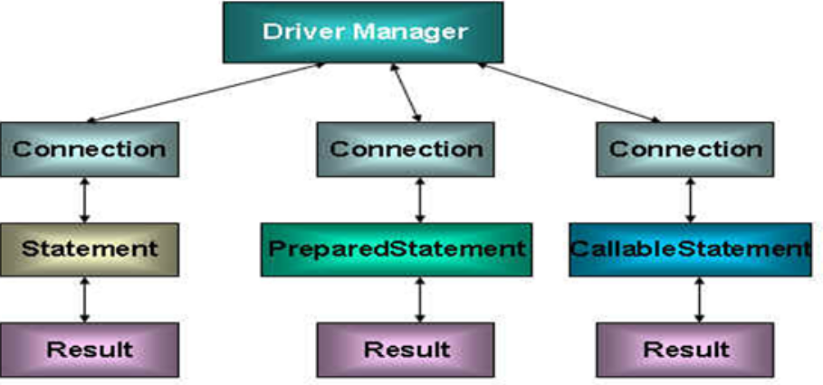

### 3.2 使用Statement操作数据表的弊端

- 存在拼串问题
- 存在SQL注入问题
  具体怎么拼串怎么注入就不写了，知道有这个问题就行，想看的话就去看那个课件哈哈哈

总结：
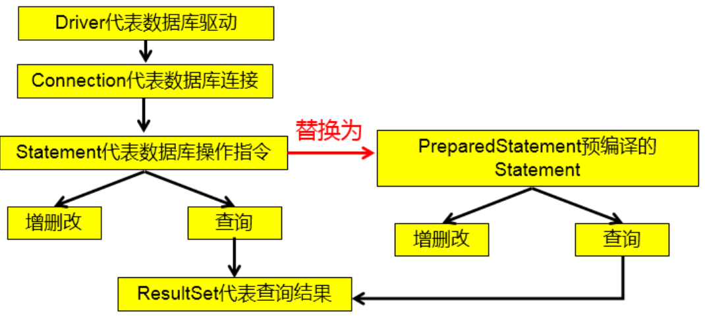

### 3.3 PreparedStatement的使用

#### 3.3.1 PreparedStatement介绍

- 可以通过调用Connection对象的preparedStatement(String sql) 方法获取 PreparedStatement对象
- PreparedStatement接口是Statement的子接口，它表示一条预编译过的SQL语句
- PreparedStatement对象所代表的SQL语句中的参数用？表示，调用PreparedStatement对象的setXxx()方法来设置这些参数，有两个参数，第一个参数是设置的Sql语句中的参数的索引，就是？的索引，从一开始，第二个是设置的SQL语句中的参数的值

#### 3.3.2 PreParedStatement vs Statement

- 代码的可读性和可维护性
- PreparedStatement能最大可能提高性能
  - DBServer会对预编译语句提供性能优化。因为预编译语句有可能被重复调用，所以sql语句在被DBServe的编译器编译后的执行代码被缓存下来，那么下次调用时只要是可能相同的预编译语句就不需要编译，只要将参数直接传入编译过的语句执行代码中就会得到执行
  - 在Statement语句中，即使是相同的操作但因为数据内容不一样，所以整个语句本身不能匹配，没有缓存语句的意义，事实是没有数据库会对普通语句编译后的执行代码缓存，这样没执行一次都要对传入的语句编译一次
- PreparedStatement可以防止Sql注入

#### 3.3.3 Java与SQL对应数据类型

| Java类型           | SQL类型                  |
| ------------------ | ------------------------ |
| boolean            | BIT                      |
| byte               | TINYINT                  |
| short              | SMALLINT                 |
| int                | INTEGER                  |
| long               | BIGINT                   |
| String             | CHAR,VARCHAR,LONGVARCHAR |
| byte   array       | BINARY  ,    VAR BINARY  |
| java.sql.Date      | DATE                     |
| java.sql.Time      | TIME                     |
| java.sql.Timestamp | TIMESTAMP                |

好吧，这个是直接复制粘贴的，这个表格一个一个打，也太难受了吧

#### 3.3.4 使用PreparedStatement实现增删改操作

```java
    //通用的增上改操作
    public void update(String sql, Object... args) {
        Connection conn = null;
        PreparedStatement ps = null;
        try {
//        sql当中占位符的个数应该与可变形参个个数相同
            //获取连接
            conn = JDBCUtils.getConnection();
            //预编译SQL语句
            ps = conn.prepareStatement(sql);

            //填充占位符
            for (int i = 0; i < args.length; i++) {
                ps.setObject(i + 1, args[i]);      //小心参数声明错误，0开始的，所以要 i+1
            }

            //执行
            ps.execute();
        } catch (Exception e) {
            e.printStackTrace();
        } finally {
            //关闭资源
            JDBCUtils.closeResource(conn, ps);
        }
    }
```

#### 3.3.5 使用PreparedStatement实现查询操作

```java
 public <T> T getInstance(Class<T> clazz, String sql, Object... args) {
        Connection conn = null;
        PreparedStatement ps = null;
        ResultSet rs = null;
        try {
            //获取数据库连接，毕竟关于数据库的操作都要先建立连接
            conn = JDBCUtils.getConnection();
            //预编译SQL语句，得到PreparedStatement对象
            ps = conn.prepareStatement(sql);
            //填充占位符
            for (int i = 0; i < args.length; i++) {
                ps.setObject(i + 1, args[i]);
            }
            //执行executeQuery() 得到查询结果
            rs = ps.executeQuery();
            //获取结果集的元数据
            ResultSetMetaData rsmd = rs.getMetaData();
            //通过ResultSetMetaData获取结果集中的列数
            int columnCount = rsmd.getColumnCount();

            if (rs.next()) {
                T t = clazz.newInstance();
                //处理结果集中一行数据中的每一列
                for (int i = 0; i < columnCount; i++) {
                    //获取列值
                    Object columnValue = rs.getObject(i + 1);


                    //获取每个列的列名
                    String columnLabel = rsmd.getColumnLabel(i + 1);


                    //给cust对象指定的某个属性，赋值为columnValue       通过反射
                    Field field = clazz.getDeclaredField(columnLabel);
                    field.setAccessible(true);
                    field.set(t, columnValue);

                }

                return t;
            }
        } catch (Exception e) {
            e.printStackTrace();
        } finally {
            JDBCUtils.closeResource(conn, ps, rs);
        }

        return null;
    }
```

使用PreparedStatement实现的查询操作可以替换Statement实现的查询操作，解决Statement拼串和SQL注入的问题

### 3.4 ResultSet与ResuletSetMetaData

#### 3.4.1 ResultSet

- 查询需要调用PreparedStatement的executeQuery()方法，查询结果是一个Result对象
- Result对象以逻辑表格的形式封装了执行数据库操作的结果集，ResultSet接口由数据库厂商提供实现
- ResultSet返回的实际上就是一张数据表，有一个指针指向数据表的第一条记录的前面
- ResultSet对象维护了一个指向当前数据行的游标，初始的时候，游标在第一行之前，可以通过ResultSet对象的next()方法移动到下一行，调用next()方法检查下一行是否有效，若有效，该方法返回True，且指针下移，相当于Iterator对象的hasNext()和next()方法的结合体     说实话我都忘了这个对象是啥了
- 每当指针指向一行时，可以通过调用getXxx(int index) 或 getXxx(int columnName)获取每一列的值
  - 例如 getInt(1)和getString("name")
  - 注意：Java与数据库交互涉及到的相关Java API中的索引都从1开始
- ResultSet接口常用方法
  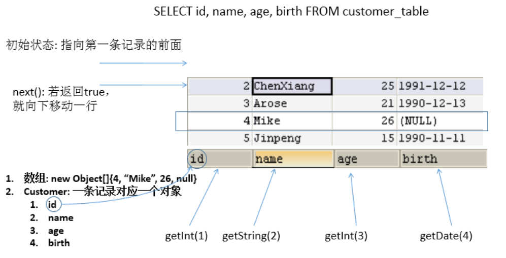

#### 3.4.2 ResultSetMetaData

- 可用于获取关于Result对象中列的类型和属性信息的对象
- ResultSetMetaData meta = rs.getMetaData();
  - getColumnName(int column) 获取指定列的名称
  - getColumnLabel(int column) 获取指定列的别名
  - getColumnCount()  返回当前ResultSet对象中的列数
  - getColumnTypeName(int column) 检索指定列的数据库特定的类型名称
  - getColumnDisplaySize(int column)  指示指定列的最大标准宽度，以字符为单位
  - isNullable(int column)    指示指定列中的值是否可以为Null
  - isAutoIncrement(int column) 指定是否自动为指定列进行编号，这样这些列仍然是只读的
    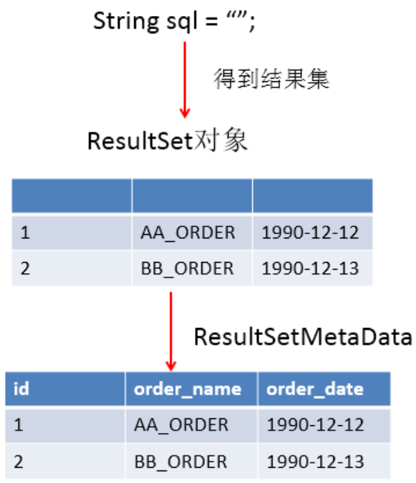

所以使用ResultSetMetaData就是为了获取ResultSet结果集中的具有某一列的信息

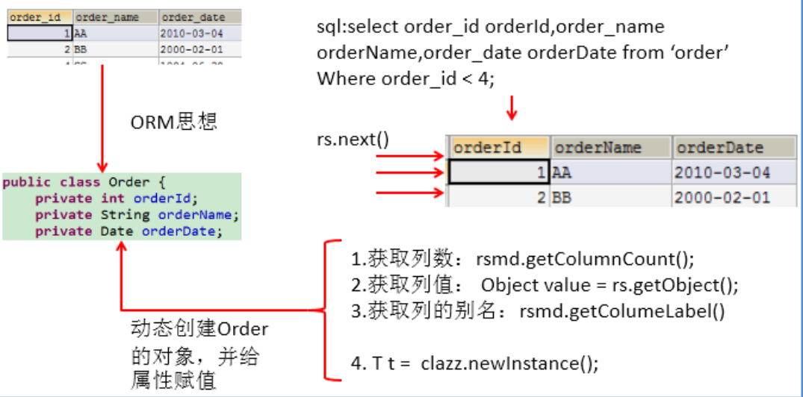

### 3.5 资源的释放

- 释放ResultSet,Statement,Connection
- 数据库连接是否非常稀有的资源，用完后必须马上释放，如果Connection不能及时正确的关闭将导致系统宕机，Connection的使用原则是**尽量晚创建，尽量早释放。**
- 可以在finally中关闭，保证即使其他代码出现异常，资源也一定能被关闭。

### 3.6 JDBC API小结

- 两种思想
  - 面向接口编程的思想
  - ORM思想(Object relational mapping)
    - 一个数据表对应一个java类
    - 表中的一条记录对应Java类的一个对象
    - 表中的一个字段对应java类的一个属性
- 两种技术
  - JDBC结果集的元数据    ResultSetMetaData
    - 获取列数 getColumnCount()
    - 获取列的别名 getColumnLabel()
  - 通过反射，创建指定类的对象，获取指定的属性并赋值

## 第4章 操作BLOB类型字段

### 4.1 MySQL BLOB类型

- MySQL中，BLOB是一个二进制大型对象，是一个可以存储大量数据的容器，它能容纳不同大小的数据
- 插入BLOB类型的数据必须使用PreparedStatement，因为BLOB类型的数据无法使用字符串拼接而成
- MySQL的四种BLOB类型，区别在于存储的最大信息量
  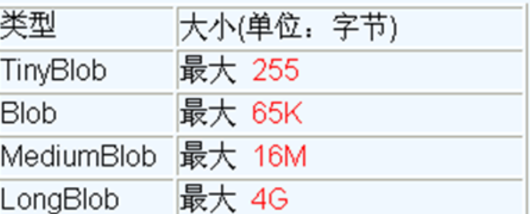
- 实际使用中根据需要存入的数据大小定义不同的BLOB类型
- 需要注意的是，如果存储的文件过大，数据库的性能会下降
- 如果在指定列相关的BLOB类型以后，还报错 xxx too large，那么就在MySQL的安装目录下，找到my.ini文件加上如下的配置参数：max_allowed_packet=16M，重启MySQL服务

### 4.2 向数据表中插入大数据类型

？不会真的有人在数据库中存图片吧，不会吧不会吧，跳过跳过！

## 第五章 批量插入

### 5.1 批量执行SQL语句

当需要成批插入或者更新记录时们可以采用Java的批量更新机制，这一机制允许多条语句一次性提交给数据库批量处理，通常情况下比单独提交处理更有效率

JDBC的批量处理语句包括下面三个方法：

- addBatch(String)  添加需要批量处理的SQL语句或者是参数
- executeBatch()    执行批量处理语句
- clearBatch        清空缓存的数据
  通常我们会遇到两种批量执行SQL语句的情况
- 多条SQL语句的批量处理
- 一个SQL语句的批量传参

### 5.2 高效的批量插入

可以使用Statement进行操作，但是效率很低
所以直接演示使用PreparedStatement进行操作

*你可能会问为什么直接就“插入方式四了” 因为前三种都没有这一种效率高，所以跳过啦*

```java
 //    批量插入方式四
    @Test
    public void testInsert3() {
        Connection conn = null;
        PreparedStatement ps = null;
        try {
            conn = JDBCUtils.getConnection();

//            设置不允许自动提交数据
            conn.setAutoCommit(false);

            String sql = "insert into goods(name) values(?)";
            ps = conn.prepareStatement(sql);
            for (int i = 0; i <= 1000000; i++) {      //20000条数据，花费34s  ------  1.1s
//                1000000:      12s     ----- 9s
                ps.setObject(1, "name_" + i);

//                1.“攒”sql
                ps.addBatch();
                if (i % 500 == 0) {
//                    攒够500，执行
                    ps.executeBatch();
//                清空Batch
                    ps.clearBatch();
                }

            }

//            在这时统一提交
            conn.commit();
        } catch (Exception e) {
            throw new RuntimeException(e);
        } finally {

            JDBCUtils.closeResource(conn, ps);
        }


    }
```

大体上提高效率的操作就是：

- 使用PreparedStatement
- 控制提交数据的时机，在所有数据执行完毕后统一提交
- 攒SQL语句，攒够一定数目，统一执行

## 第六章：数据库事务

### 6.1 数据库事务介绍

- 事务，是用户定义的一个数据库操作序列，这些操作要么全做，要么全不做，是一个不可分割的工作单位
- 在关系数据库中，一个事务可以是一条SQL语句，一组SQL语句或整个程序
- Commit 事务正常结束，提交事务的所有操作，事务中所有对数据库的更新永久生效
- Rollback 事务异常终止，事务运行时发生了故障，不能继续执行，回滚事务的所有更新操作

### 6.2 JDBC事务处理

- 事务一旦提交，就不可回滚
- **数据什么时候会提交？**
  - **当一个连接对象被创建时**，默认情况下是自动提交事务：就是每次执行一个SQL语句时，如果执行成功，就会像数据库自动提交，而不能回滚。
  - **关闭数据库连接**，数据就会自动的提交，如果多个操作，每个操作使用的是自己单独的连接，则无法保证事务，即同一个事务的多个操作必须在同一个连接下
- JDBC程序中为了让多个SQL语句作为一个事务执行
  - 调用Connection对象的setAutoCommit(false) 以取消自动提交事务
  - 在所有的SQL语句都成功执行后，调用commit()方法提交事务
  - 在出现异常时，调用rollback() 方法回滚事务
    若此时Connection没有被关闭，还可能被重复使用，则需要恢复其自动提交状态，setAutoCommit(true)尤其是在使用数据库连接池技术时，执行close()方法前，建议恢复自动提交状态

*案例：用户AA向用户BB转账100元*

```java
@Test
    public void testUpdate() {


        String sql1 = "update user_table set balance = balance - 100 where user = ?";
        update(sql1, "AA");
//      模拟网络异常
        System.out.println(10 / 0);


        String sql2 = "update user_table set balance = balance + 100 where user = ?";
        update(sql2, "BB");

        System.out.println("转账成功");

    }
```

如果执行这个代码，由于在“模拟网络异常”这个地方程序就中断了，而此时AA的钱已经减少了100，但BB的钱因为没有执行到update语句，所以并没有执行，这就导致数据出现错误

想要解决这种问题，需要使用事务

```java
    @Test
    public void testUpdateWithTx() {
        Connection conn = null;
        try {
            conn = JDBCUtils.getConnection();
            System.out.println(conn.getAutoCommit());

//            1 取消数据的自动提交
            conn.setAutoCommit(false);

            String sql1 = "update user_table set balance = balance - 100 where user = ?";
            update(conn, sql1, "AA");
//      模拟网络异常
            System.out.println(10 / 0);


            String sql2 = "update user_table set balance = balance + 100 where user = ?";
            update(conn, sql2, "BB");

            System.out.println("转账成功");

//            2     提交数据
            conn.commit();
        } catch (Exception e) {
            e.printStackTrace();
//            3     出现异常就回滚数据
            try {
                conn.rollback();
            } catch (SQLException ex) {
                e.printStackTrace();
            }
        } finally {

            try {
//                修改其为自动提交数据
//                主要针对使用数据库连接池使用，这里并用不到
                conn.setAutoCommit(true);
            } catch (SQLException e) {
                e.printStackTrace();
            }

            JDBCUtils.closeResource(conn, null);
        }

    }
```

此时，使用的update方法更改为：

```java
 //通用的增删改操作      version 2.0     考虑到事务
    public int update(Connection conn, String sql, Object... args) {
        PreparedStatement ps = null;
        try {
//        sql当中占位符的个数应该与可变形参个个数相同
            ps = conn.prepareStatement(sql);

            //填充占位符
            for (int i = 0; i < args.length; i++) {
                ps.setObject(i + 1, args[i]);      //小心参数声明错误
            }

            //执行
            return ps.executeUpdate();
        } catch (Exception e) {
            e.printStackTrace();
        } finally {
            //关闭资源
            JDBCUtils.closeResource(null, ps);
        }

        return 0;
    }
```

### 6.3事务的ACID属性

1. **原子性(Atomicity)**：事务是数据库的逻辑工作单位，事务中包括的操作要么都做，要么都不做
2. **一致性(Consistency)**：事务执行的结果必须是使数据库从一个一致性状态变到另一个一致性状态
3. **隔离性(Isolation)**：一个事务的执行不能被其他事务干扰
4. **持续性(Durability)**：一个事务一旦提交，它对数据库中数据的改变就是永久性的永久性的,接下来的其他操作或故障不应该对其执行的结果有任何影响

### 6.3.1 数据库的并发问题

- *并发操作带来的数据不一致行*
  - **脏读**: 对于两个事务 T1, T2, T1 读取了已经被 T2 更新但还**没有被提交**的字段。之后, 若 T2 回滚, T1读取的内容就是临时且无效的。
  - **不可重复读**: 对于两个事务T1, T2, T1 读取了一个字段, 然后 T2 **更新**了该字段。之后, T1再次读取同一个字段, 值就不同了。
  - **幻读**: 对于两个事务T1, T2, T1 从一个表中读取了一个字段, 然后 T2 在该表中**插入**了一些新的行。之后, 如果 T1 再次读取同一个表, 就会多出几行。
- **数据库事务的隔离性**：数据库系统必须具有隔离并发运行各个事务的能力，使它们不会相互影响，避免各种并发问题
- 一个事务与其他事务隔离的程度称为隔离级别，数据库规定了多种事务隔离级别，不同隔离级别对应不同的干扰程度，隔离级别越高，数据一致性就越好，但并发性越弱。

#### 6.3.2 四种隔离级别

- 数据库提供的4种事务隔离级别
  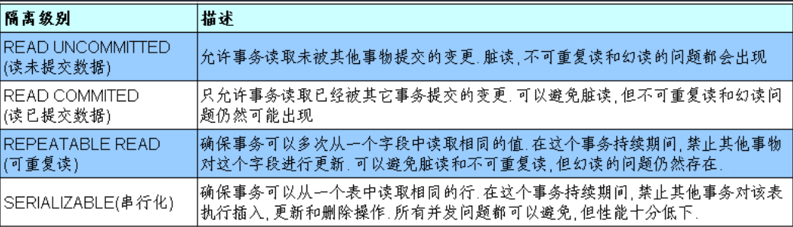
  MySQL支持4种事务隔离级别，默认为REPEATABLE READ

#### 6.3.3 在MySQL种设置隔离级别

- 每启动一个mysql程序，就会得到一个单独的数据库连接，每个数据库连接都有一个全局变量 @@transaction_isolation,表示当前的事务隔离级别
  -查看当前的隔离级别：

```sql
select @@transaction_isolation;
```

-设置当前MySQL连接的隔离级别：

```sql
set  transaction isolation level REPEATABLE READ;
```

- 设置数据库系统的全局的隔离级别

```sql
set global transaction isolation level read committed;
```

- 在Java代码种设置隔离级别：

```java
conn.setTransactionIsolation(Connection.TRANSACTION_READ_COMMITTED);
```

## 第七章：DAO及相关实现类

- DAO: Data Access Object访问数据信息的类和接口，包括了对数据的CRUD操作，而不包含任何业务相关的信息。有时也成为BaseDAO
- 作用:为了实现功能的模块化，更有利于代码的维护和升级
- 下面是代码，这个我当时写了一部分，但是由于未知错误，导致一直报错，那就没办法了啊，只能用人家写好的代码了
  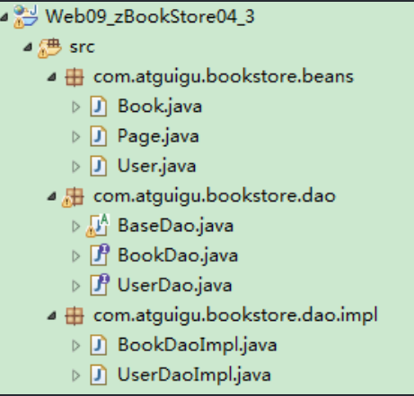
- 层次结构
  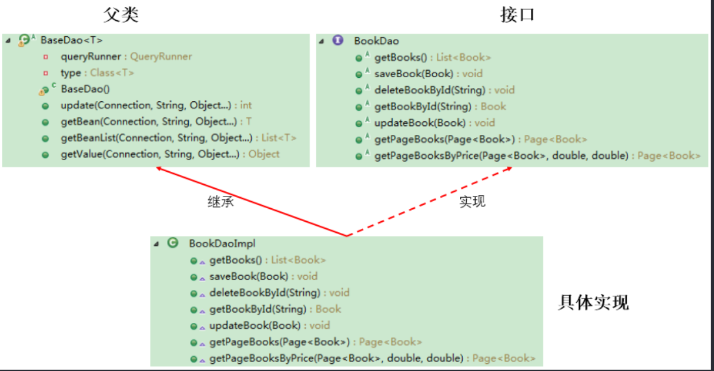

### **BaseDAO.java**

```java
package com.atguigu.bookstore.dao;

import java.lang.reflect.ParameterizedType;
import java.lang.reflect.Type;
import java.sql.Connection;
import java.sql.SQLException;
import java.util.List;

import org.apache.commons.dbutils.QueryRunner;
import org.apache.commons.dbutils.handlers.BeanHandler;
import org.apache.commons.dbutils.handlers.BeanListHandler;
import org.apache.commons.dbutils.handlers.ScalarHandler;


/**
 * 定义一个用来被继承的对数据库进行基本操作的Dao
 * 
 * @author HanYanBing
 *
 * @param <T>
 */
public abstract class BaseDao<T> {
	private QueryRunner queryRunner = new QueryRunner();
	// 定义一个变量来接收泛型的类型
	private Class<T> type;

	// 获取T的Class对象，获取泛型的类型，泛型是在被子类继承时才确定
	public BaseDao() {
		// 获取子类的类型
		Class clazz = this.getClass();
		// 获取父类的类型
		// getGenericSuperclass()用来获取当前类的父类的类型
		// ParameterizedType表示的是带泛型的类型
		ParameterizedType parameterizedType = (ParameterizedType) clazz.getGenericSuperclass();
		// 获取具体的泛型类型 getActualTypeArguments获取具体的泛型的类型
		// 这个方法会返回一个Type的数组
		Type[] types = parameterizedType.getActualTypeArguments();
		// 获取具体的泛型的类型·
		this.type = (Class<T>) types[0];
	}

	/**
	 * 通用的增删改操作
	 * 
	 * @param sql
	 * @param params
	 * @return
	 */
	public int update(Connection conn,String sql, Object... params) {
		int count = 0;
		try {
			count = queryRunner.update(conn, sql, params);
		} catch (SQLException e) {
			e.printStackTrace();
		} 
		return count;
	}

	/**
	 * 获取一个对象
	 * 
	 * @param sql
	 * @param params
	 * @return
	 */
	public T getBean(Connection conn,String sql, Object... params) {
		T t = null;
		try {
			t = queryRunner.query(conn, sql, new BeanHandler<T>(type), params);
		} catch (SQLException e) {
			e.printStackTrace();
		} 
		return t;
	}

	/**
	 * 获取所有对象
	 * 
	 * @param sql
	 * @param params
	 * @return
	 */
	public List<T> getBeanList(Connection conn,String sql, Object... params) {
		List<T> list = null;
		try {
			list = queryRunner.query(conn, sql, new BeanListHandler<T>(type), params);
		} catch (SQLException e) {
			e.printStackTrace();
		} 
		return list;
	}

	/**
	 * 获取一个但一值得方法，专门用来执行像 select count(*)...这样的sql语句
	 * 
	 * @param sql
	 * @param params
	 * @return
	 */
	public Object getValue(Connection conn,String sql, Object... params) {
		Object count = null;
		try {
			// 调用queryRunner的query方法获取一个单一的值
			count = queryRunner.query(conn, sql, new ScalarHandler<>(), params);
		} catch (SQLException e) {
			e.printStackTrace();
		} 
		return count;
	}
}
```

### **BookDAO.java**

```java
package com.atguigu.bookstore.dao;

import java.sql.Connection;
import java.util.List;

import com.atguigu.bookstore.beans.Book;
import com.atguigu.bookstore.beans.Page;

public interface BookDao {

	/**
	 * 从数据库中查询出所有的记录
	 * 
	 * @return
	 */
	List<Book> getBooks(Connection conn);

	/**
	 * 向数据库中插入一条记录
	 * 
	 * @param book
	 */
	void saveBook(Connection conn,Book book);

	/**
	 * 从数据库中根据图书的id删除一条记录
	 * 
	 * @param bookId
	 */
	void deleteBookById(Connection conn,String bookId);

	/**
	 * 根据图书的id从数据库中查询出一条记录
	 * 
	 * @param bookId
	 * @return
	 */
	Book getBookById(Connection conn,String bookId);

	/**
	 * 根据图书的id从数据库中更新一条记录
	 * 
	 * @param book
	 */
	void updateBook(Connection conn,Book book);

	/**
	 * 获取带分页的图书信息
	 * 
	 * @param page：是只包含了用户输入的pageNo属性的page对象
	 * @return 返回的Page对象是包含了所有属性的Page对象
	 */
	Page<Book> getPageBooks(Connection conn,Page<Book> page);

	/**
	 * 获取带分页和价格范围的图书信息
	 * 
	 * @param page：是只包含了用户输入的pageNo属性的page对象
	 * @return 返回的Page对象是包含了所有属性的Page对象
	 */
	Page<Book> getPageBooksByPrice(Connection conn,Page<Book> page, double minPrice, double maxPrice);

}
```

### **BookDaoImpl.java**

```java
package com.atguigu.bookstore.dao.impl;

import java.sql.Connection;
import java.util.List;

import com.atguigu.bookstore.beans.Book;
import com.atguigu.bookstore.beans.Page;
import com.atguigu.bookstore.dao.BaseDao;
import com.atguigu.bookstore.dao.BookDao;

public class BookDaoImpl extends BaseDao<Book> implements BookDao {

	@Override
	public List<Book> getBooks(Connection conn) {
		// 调用BaseDao中得到一个List的方法
		List<Book> beanList = null;
		// 写sql语句
		String sql = "select id,title,author,price,sales,stock,img_path imgPath from books";
		beanList = getBeanList(conn,sql);
		return beanList;
	}

	@Override
	public void saveBook(Connection conn,Book book) {
		// 写sql语句
		String sql = "insert into books(title,author,price,sales,stock,img_path) values(?,?,?,?,?,?)";
		// 调用BaseDao中通用的增删改的方法
		update(conn,sql, book.getTitle(), book.getAuthor(), book.getPrice(), book.getSales(), book.getStock(),book.getImgPath());
	}

	@Override
	public void deleteBookById(Connection conn,String bookId) {
		// 写sql语句
		String sql = "DELETE FROM books WHERE id = ?";
		// 调用BaseDao中通用增删改的方法
		update(conn,sql, bookId);

	}

	@Override
	public Book getBookById(Connection conn,String bookId) {
		// 调用BaseDao中获取一个对象的方法
		Book book = null;
		// 写sql语句
		String sql = "select id,title,author,price,sales,stock,img_path imgPath from books where id = ?";
		book = getBean(conn,sql, bookId);
		return book;
	}

	@Override
	public void updateBook(Connection conn,Book book) {
		// 写sql语句
		String sql = "update books set title = ? , author = ? , price = ? , sales = ? , stock = ? where id = ?";
		// 调用BaseDao中通用的增删改的方法
		update(conn,sql, book.getTitle(), book.getAuthor(), book.getPrice(), book.getSales(), book.getStock(), book.getId());
	}

	@Override
	public Page<Book> getPageBooks(Connection conn,Page<Book> page) {
		// 获取数据库中图书的总记录数
		String sql = "select count(*) from books";
		// 调用BaseDao中获取一个单一值的方法
		long totalRecord = (long) getValue(conn,sql);
		// 将总记录数设置都page对象中
		page.setTotalRecord((int) totalRecord);

		// 获取当前页中的记录存放的List
		String sql2 = "select id,title,author,price,sales,stock,img_path imgPath from books limit ?,?";
		// 调用BaseDao中获取一个集合的方法
		List<Book> beanList = getBeanList(conn,sql2, (page.getPageNo() - 1) * Page.PAGE_SIZE, Page.PAGE_SIZE);
		// 将这个List设置到page对象中
		page.setList(beanList);
		return page;
	}

	@Override
	public Page<Book> getPageBooksByPrice(Connection conn,Page<Book> page, double minPrice, double maxPrice) {
		// 获取数据库中图书的总记录数
		String sql = "select count(*) from books where price between ? and ?";
		// 调用BaseDao中获取一个单一值的方法
		long totalRecord = (long) getValue(conn,sql,minPrice,maxPrice);
		// 将总记录数设置都page对象中
		page.setTotalRecord((int) totalRecord);

		// 获取当前页中的记录存放的List
		String sql2 = "select id,title,author,price,sales,stock,img_path imgPath from books where price between ? and ? limit ?,?";
		// 调用BaseDao中获取一个集合的方法
		List<Book> beanList = getBeanList(conn,sql2, minPrice , maxPrice , (page.getPageNo() - 1) * Page.PAGE_SIZE, Page.PAGE_SIZE);
		// 将这个List设置到page对象中
		page.setList(beanList);

		return page;
	}

}
```

### **UserDaoImpl.java**

```java
package com.atguigu.bookstore.dao.impl;

import java.sql.Connection;
import java.util.List;

import com.atguigu.bookstore.beans.Book;
import com.atguigu.bookstore.beans.Page;
import com.atguigu.bookstore.dao.BaseDao;
import com.atguigu.bookstore.dao.BookDao;

public class BookDaoImpl extends BaseDao<Book> implements BookDao {

	@Override
	public List<Book> getBooks(Connection conn) {
		// 调用BaseDao中得到一个List的方法
		List<Book> beanList = null;
		// 写sql语句
		String sql = "select id,title,author,price,sales,stock,img_path imgPath from books";
		beanList = getBeanList(conn,sql);
		return beanList;
	}

	@Override
	public void saveBook(Connection conn,Book book) {
		// 写sql语句
		String sql = "insert into books(title,author,price,sales,stock,img_path) values(?,?,?,?,?,?)";
		// 调用BaseDao中通用的增删改的方法
		update(conn,sql, book.getTitle(), book.getAuthor(), book.getPrice(), book.getSales(), book.getStock(),book.getImgPath());
	}

	@Override
	public void deleteBookById(Connection conn,String bookId) {
		// 写sql语句
		String sql = "DELETE FROM books WHERE id = ?";
		// 调用BaseDao中通用增删改的方法
		update(conn,sql, bookId);

	}

	@Override
	public Book getBookById(Connection conn,String bookId) {
		// 调用BaseDao中获取一个对象的方法
		Book book = null;
		// 写sql语句
		String sql = "select id,title,author,price,sales,stock,img_path imgPath from books where id = ?";
		book = getBean(conn,sql, bookId);
		return book;
	}

	@Override
	public void updateBook(Connection conn,Book book) {
		// 写sql语句
		String sql = "update books set title = ? , author = ? , price = ? , sales = ? , stock = ? where id = ?";
		// 调用BaseDao中通用的增删改的方法
		update(conn,sql, book.getTitle(), book.getAuthor(), book.getPrice(), book.getSales(), book.getStock(), book.getId());
	}

	@Override
	public Page<Book> getPageBooks(Connection conn,Page<Book> page) {
		// 获取数据库中图书的总记录数
		String sql = "select count(*) from books";
		// 调用BaseDao中获取一个单一值的方法
		long totalRecord = (long) getValue(conn,sql);
		// 将总记录数设置都page对象中
		page.setTotalRecord((int) totalRecord);

		// 获取当前页中的记录存放的List
		String sql2 = "select id,title,author,price,sales,stock,img_path imgPath from books limit ?,?";
		// 调用BaseDao中获取一个集合的方法
		List<Book> beanList = getBeanList(conn,sql2, (page.getPageNo() - 1) * Page.PAGE_SIZE, Page.PAGE_SIZE);
		// 将这个List设置到page对象中
		page.setList(beanList);
		return page;
	}

	@Override
	public Page<Book> getPageBooksByPrice(Connection conn,Page<Book> page, double minPrice, double maxPrice) {
		// 获取数据库中图书的总记录数
		String sql = "select count(*) from books where price between ? and ?";
		// 调用BaseDao中获取一个单一值的方法
		long totalRecord = (long) getValue(conn,sql,minPrice,maxPrice);
		// 将总记录数设置都page对象中
		page.setTotalRecord((int) totalRecord);

		// 获取当前页中的记录存放的List
		String sql2 = "select id,title,author,price,sales,stock,img_path imgPath from books where price between ? and ? limit ?,?";
		// 调用BaseDao中获取一个集合的方法
		List<Book> beanList = getBeanList(conn,sql2, minPrice , maxPrice , (page.getPageNo() - 1) * Page.PAGE_SIZE, Page.PAGE_SIZE);
		// 将这个List设置到page对象中
		page.setList(beanList);

		return page;
	}

}
```

### **Book.java**

```java
package com.atguigu.bookstore.beans;
/**
 * 图书类
 * @author songhongkang
 *
 */
public class Book {

	private Integer id;
	private String title; // 书名
	private String author; // 作者
	private double price; // 价格
	private Integer sales; // 销量
	private Integer stock; // 库存
	private String imgPath = "static/img/default.jpg"; // 封面图片的路径
	//构造器，get()，set()，toString()方法略
}
```

### **Page.java**

```java
package com.atguigu.bookstore.beans;

import java.util.List;
/**
 * 页码类
 * @author songhongkang
 *
 */
public class Page<T> {

	private List<T> list; // 每页查到的记录存放的集合
	public static final int PAGE_SIZE = 4; // 每页显示的记录数
	private int pageNo; // 当前页
//	private int totalPageNo; // 总页数，通过计算得到
	private int totalRecord; // 总记录数，通过查询数据库得到
}
```

### **User.java**

```java
package com.atguigu.bookstore.beans;
/**
 * 用户类
 * @author songhongkang
 *
 */
public class User {

	private Integer id;
	private String username;
	private String password;
	private String email;
}
```

## 第八章：数据库连接池

这玩意就跟线程池差不多，虽然你线程池也学的不咋样哈哈哈哈艹

### 8.1 JDBC数据库连接池的必要性

- 如若开发基于数据库的web程序时，传统的模式基本是按照：
  - 在主程序(servlet\beans)建立数据库连接
  - 进行sql操作
  - 断开数据库连接
- 这种开发存在以下问题：
  - 普通的JDBC数据库连接使用DriverManager来获取，每次向数据库建立连接的时候都要将Connection加载到内存中，再验证用户名和密码，需要连接就申请一个，执行完就断开，会导致数据库连接资源并没有得到很好的重复利用。
  - 对于每一次数据库连接，使用完都要断开，否则，若程序出现异常而未能关闭，将会导致数据库系统中的内存泄露，最终将导致重启数据库。
  - **这种开发不能控制被创建额连接对象数**

### 8.2 数据库连接池技术

- 为解决传统开发中的数据库连接问题，可以采用数据库连接池技术。
- **数据库连接池的基本思想**：为数据库连接池建立一个“缓冲池”，预先在缓冲池中放入一定数量的连接，当需要建立数据库连接时，只需要从“缓冲池”中取出一个，使用完毕之后再放回去。
- 数据库连接池负责分配，管理和释放数据库连接，它**允许应用程序重复使用一个现有的数据库连接，**而不是重新建立一个。
- 数据库连接池在初始化时将创建一定数量的数据库链接放到连接池中，这些数据库连接的数量是由最小数据库连接数来设定的，当应用程序向连接池请求的连接数超过最大连接数时，这些请求将被加入**等待**队列中
- 数据库连接池技术的优点
  1. 资源重用
  2. 更快的系统反应速度
  3. 新的资源分配手段
  4. 统一的连接管理，避免数据库连接泄露

### 8.3 多种开源的数据库连接池

- JDBC 的数据库连接池使用 javax.sql.DataSource来表示，DataSource 只是一个接口
  - DBCP 是Apache提供的数据库连接池。tomcat服务器自带DBCP数据库连接池，速度快但是存在BUG
  - C3P0 是一个开源组织提供的，速度慢但稳定性还可以
  - Druid 是阿里提供的数据库连接池，取以上精华，去其糟粕而成，主要用这个。
- DataSource 用来太DriverManager 来获取 Connection，获取速度快，同时可以大幅度提高数据库访问速度。
- 注意：
  - 数据源和数据库连接不同，数据源无需创建多个，它是生成数据库连接的工厂，因此整个应用只需要一个数据源即可
  - 当数据库访问结束后，程序还是像以前一样关闭数据库连接：conn.close()；但是并非关闭物理连接，而是释放了该连接，归还给了数据库连接池

*C3P0以及DBCP略过*

#### 8.3.1 Druid 德鲁伊 数据库连接池

```java
package com.atguigu.druid;

import java.sql.Connection;
import java.util.Properties;

import javax.sql.DataSource;

import com.alibaba.druid.pool.DruidDataSourceFactory;

public class TestDruid {
	public static void main(String[] args) throws Exception {
		Properties pro = new Properties();		 pro.load(TestDruid.class.getClassLoader().getResourceAsStream("druid.properties"));
		DataSource ds = DruidDataSourceFactory.createDataSource(pro);
		Connection conn = ds.getConnection();
		System.out.println(conn);
	}
}
```

需要的配置文件：

```properties
url=jdbc:mysql://localhost:3306/test
username=root
password=010203
driverClassName=com.mysql.cj.jdbc.Driver
```

## 第9章 Apache-DBUtils实现CRUD操作

### 9.1 Apache-DBUtils简介

- commons-dbutils是开源工具类库
- 

### 9.2 主要API的使用

#### 9.2.1 DBUtils

- DbUtils ：提供如关闭连接、装载JDBC驱动程序等常规工作的工具类，里面的所有方法都是静态的。主要方法如下：
  - **public static void close(…) throws java.sql.SQLException**：　DbUtils类提供了三个重载的关闭方法。这些方法检查所提供的参数是不是NULL，如果不是的话，它们就关闭Connection、Statement和ResultSet。
  - public static void closeQuietly(…): 这一类方法不仅能在Connection、Statement和ResultSet为NULL情况下避免关闭，还能隐藏一些在程序中抛出的SQLEeception。
  - public static void commitAndClose(Connection conn)throws SQLException： 用来提交连接的事务，然后关闭连接
  - public static void commitAndCloseQuietly(Connection conn)： 用来提交连接，然后关闭连接，并且在关闭连接时不抛出SQL异常。
  - public static void rollback(Connection conn)throws SQLException：允许conn为null，因为方法内部做了判断
  - public static void rollbackAndClose(Connection conn)throws SQLException
  - rollbackAndCloseQuietly(Connection)
  - public static boolean loadDriver(java.lang.String driverClassName)：这一方装载并注册JDBC驱动程序，如果成功就返回true。使用该方法，你不需要捕捉这个异常ClassNotFoundException。

#### 9.2.2 QueryRunner类

- 该类简化了SQL查询，它与ResultSetHandler组成在一起使用可以完成大部门的数据库操作。
- QueryRunner类提供了两个构造器：

  - 默认的构造器
  - 需要一个 javax.sql.DataSource 来作参数的构造器
- QueryRunner类的主要方法：

  - **更新**
    - public int update(Connection conn, String sql, Object... params) throws SQLException:用来执行一个更新（插入、更新或删除）操作。
    - ......
  - **插入**
    - public `<T>` T insert(Connection conn,String sql,ResultSetHandler `<T>` rsh, Object... params) throws SQLException：只支持INSERT语句，其中 rsh - The handler used to create the result object from the ResultSet of auto-generated keys.  返回值: An object generated by the handler.即自动生成的键值
    - ....
  - **批处理**
    - public int[] batch(Connection conn,String sql,Object[][] params)throws SQLException： INSERT, UPDATE, or DELETE语句
    - public `<T>` T insertBatch(Connection conn,String sql,ResultSetHandler `<T>` rsh,Object[][] params)throws SQLException：只支持INSERT语句
    - .....
  - **查询**
    - public Object query(Connection conn, String sql, ResultSetHandler rsh,Object... params) throws SQLException：执行一个查询操作，在这个查询中，对象数组中的每个元素值被用来作为查询语句的置换参数。该方法会自行处理 PreparedStatement 和 ResultSet 的创建和关闭。
    - ......
- 测试

```java
    //    测试插入
    @Test
    public void testInset() {
        Connection conn = null;
        try {
            QueryRunner runner = new QueryRunner();

            conn = JDBCUtils.getConnection();
            String sql = "insert into customers(name,email,birth)values(?,?,?)";
            int insertCount = runner.update(conn, sql, "鸡哥", "ikun@163.com", "2000-10-10");
            System.out.println("添加了" + insertCount + "条数据");
        } catch (Exception e) {
            e.printStackTrace();
        } finally {
            JDBCUtils.closeResource(conn, null);
        }


    }
```

#### 9.2.3 ResultSetHandler接口及实现类

- 该接口用于处理 java.sql.ResultSet,将数据按照要求转换为另一种形式
- 接口的主要实现类：

  - ArrayHandler：把结果集中的第一行数据转成对象数组。
  - ArrayListHandler：把结果集中的每一行数据都转成一个数组，再存放到List中。
  - **BeanHandler：**将结果集中的第一行数据封装到一个对应的JavaBean实例中。
  - **BeanListHandler：**将结果集中的每一行数据都封装到一个对应的JavaBean实例中，存放到List里。
  - ColumnListHandler：将结果集中某一列的数据存放到List中。
  - KeyedHandler(name)：将结果集中的每一行数据都封装到一个Map里，再把这些map再存到一个map里，其key为指定的key。
  - **MapHandler：**将结果集中的第一行数据封装到一个Map里，key是列名，value就是对应的值。
  - **MapListHandler：**将结果集中的每一行数据都封装到一个Map里，然后再存放到List
  - **ScalarHandler：**查询单个值对象
- 测试

```java
//    测试查询          此时用的是 BeanHander是ResultSetHandler接口的实现类，用于封装表中的一条记录

    @Test
    public void testQuery1() {
        Connection conn = null;
        try {
            QueryRunner runner = new QueryRunner();

            conn = JDBCUtils.getConnection();

            String sql = "select id,name,email,birth from customers where id = ?";
            BeanHandler<Customer> handler = new BeanHandler<>(Customer.class);
            Customer cust = runner.query(conn, sql, handler, 24);
            System.out.println(cust);
        } catch (Exception e) {
            e.printStackTrace();
        } finally {
            JDBCUtils.closeResource(conn, null);
        }


    }

```java
   /*
            BeanListHandler 是ResultSetHandler接口的实现类用于分装表中的多条记录构成的集合
     */
    @Test
    public void testQuery2() {
        Connection conn = null;
        try {
            QueryRunner runner = new QueryRunner();

            conn = JDBCUtils.getConnection();

            String sql = "select id,name,email,birth from customers where id < ?";
            BeanListHandler<Customer> handler = new BeanListHandler<>(Customer.class);
            List<Customer> list = runner.query(conn, sql, handler, 24);
//        for (Customer customer : list) {
//            System.out.println(customer);
//        }
            list.forEach(System.out::println);
        } catch (Exception e) {
            e.printStackTrace();
        } finally {
            JDBCUtils.closeResource(conn, null);
        }

    }
```

```java
/*
 * 如何查询类似于最大的，最小的，平均的，总和，个数相关的数据，
 * 使用ScalarHandler
 * 
 */
@Test
public void testQueryValue() throws Exception{
	QueryRunner runner = new QueryRunner();

	Connection conn = JDBCUtils.getConnection3();

	//测试一：
//	String sql = "select count(*) from customers where id < ?";
//	ScalarHandler handler = new ScalarHandler();
//	long count = (long) runner.query(conn, sql, handler, 20);
//	System.out.println(count);

	//测试二：
	String sql = "select max(birth) from customers";
	ScalarHandler handler = new ScalarHandler();
	Date birth = (Date) runner.query(conn, sql, handler);
	System.out.println(birth);

	JDBCUtils.closeResource(conn, null);
}
```

以上测试用到的Bean

```java
package com.zzmr3.bean;

import java.sql.Date;

/*
 * ORM编程思想  （object relational mapping）
 * 一个数据表对应一个java类
 * 表中的一条记录对应java类的一个对象
 * 表中的一个字段对应java类的一个属性
 * 
 */
public class Customer {

	private int id;
	private String name;
	private String email;
	private Date birth;
	public Customer() {
		super();
	}
	public Customer(int id, String name, String email, Date birth) {
		super();
		this.id = id;
		this.name = name;
		this.email = email;
		this.birth = birth;
	}
	public int getId() {
		return id;
	}
	public void setId(int id) {
		this.id = id;
	}
	public String getName() {
		return name;
	}
	public void setName(String name) {
		this.name = name;
	}
	public String getEmail() {
		return email;
	}
	public void setEmail(String email) {
		this.email = email;
	}
	public Date getBirth() {
		return birth;
	}
	public void setBirth(Date birth) {
		this.birth = birth;
	}
	@Override
	public String toString() {
		return "Customer [id=" + id + ", name=" + name + ", email=" + email + ", birth=" + birth + "]";
	}
}
```

## JDBC总结

```java
总结
@Test
public void testUpdateWithTx() {

	Connection conn = null;
	try {
		//1.获取连接的操作（
		//① 手写的连接：JDBCUtils.getConnection();
		//② 使用数据库连接池：C3P0;DBCP;Druid
		//2.对数据表进行一系列CRUD操作
		//① 使用PreparedStatement实现通用的增删改、查询操作（version 1.0 \ version 2.0)
//version2.0的增删改public void update(Connection conn,String sql,Object ... args){}
//version2.0的查询 public <T> T getInstance(Connection conn,Class<T> clazz,String sql,Object ... args){}
		//② 使用dbutils提供的jar包中提供的QueryRunner类

		//提交数据
		conn.commit();


	} catch (Exception e) {
		e.printStackTrace();


		try {
			//回滚数据
			conn.rollback();
		} catch (SQLException e1) {
			e1.printStackTrace();
		}

	}finally{
		//3.关闭连接等操作
		//① JDBCUtils.closeResource();
		//② 使用dbutils提供的jar包中提供的DbUtils类提供了关闭的相关操作

	}
}
```