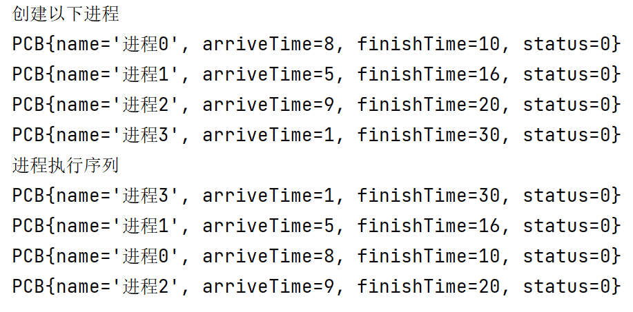

**主要写一些注意事项**

# 集合

创建一个泛型为某类的集合(用PCB表示),以PCB类中的某一个属性进行排序,可以使用**Collections.sort()**

>根据PCB的arriveTime属性进行升序

代码演示:
```java
System.out.println("创建以下进程");
        //创建进程
        PCB pcb0 = new PCB("进程0", 8, 10);
        PCB pcb1 = new PCB("进程1", 5, 16);
        PCB pcb2 = new PCB("进程2", 9, 20);
        PCB pcb3 = new PCB("进程3", 1, 30);

        List<PCB> list = new ArrayList<>();
        list.add(pcb0);
        list.add(pcb1);
        list.add(pcb2);
        list.add(pcb3);

        //排序前
        for (int i = 0; i < list.size(); i++) {
            System.out.println(list.get(i));
        }


        /**
         * 根据到达时间进行升序排列
         */
        Collections.sort(list, new Comparator<PCB>() {
            @Override
            public int compare(PCB o1, PCB o2) {
                return o1.getArriveTime() - o2.getArriveTime();
            }
        });


        System.out.println("进程执行序列");
        //排序后
        for (PCB pcb : list) {
            System.out.println(pcb);
        }
```

看结果:

<!--  -->

此时就可以根据类中的属性进行排序了

>关键词: 比较器

# 二维数组
二维数组啥的都忘了
害
或者说根本就没学好

a[i][j] 表示什么?表示第i行第j列,而不是x=i,y=j
不是坐标轴啊

