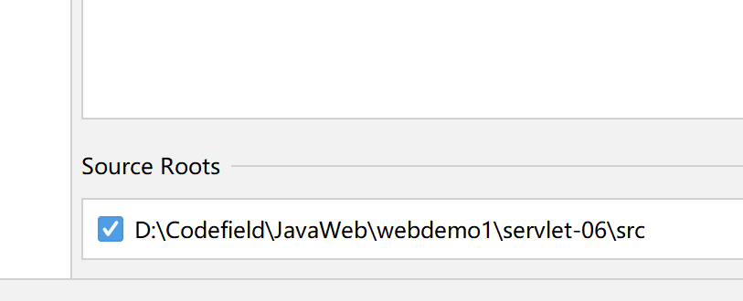
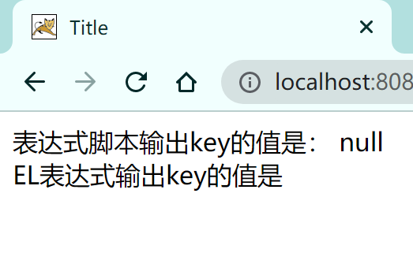
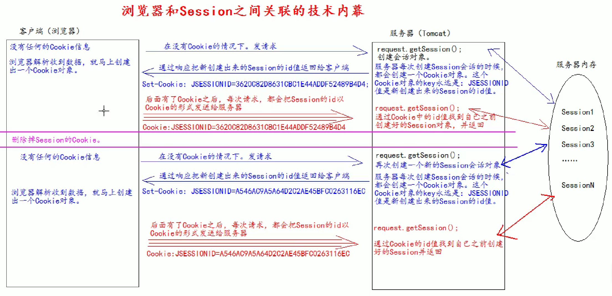
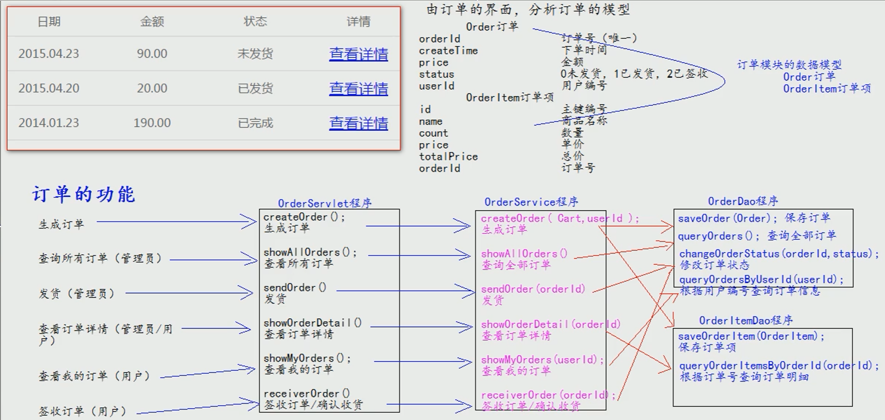

## JavaWeb

- 2022年8月2日19点36分
- 寒假已经学过H5和CSS了，这一次算是复习，所以不打算从头开始学了，只学几个特殊的标签

## 前端部分

### VS Code相关说明

- 现在已经不能使用"!"加回车直接生成html的主体了，要使用html:5+回车

### HTML

#### 标签

- 居中里面的元素可以用 align="center"
- bgcolor是背景颜色属性，onclick表示点击事件，不多都是已经淘汰的东西了
- alert()是js语言提供的一个警告框函数，接收任意参数然后返回(弹窗形式)
- a标签中target="" ,_self代表当前网页,_blank代表新页面

1. 表格标签：table

   - 行    tr
   - 列    td      表头列用    th
   - table标签内可调整border和width以及cellspacing以及cellpadding，但已全部淘汰

```html
<table border="1" width="400" cellspacing="0" cellpadding="4">
        <tr>
            <th>姓名</th>
            <th>门派</th>
            <th>绝技</th>
        </tr>
        <tr align="center">
            <td>无名氏</td>
            <td>华山派</td>
            <td>未知</td>
        </tr>
    </table>
```

    
2. rowpan以及colspan，用于合并单元格，rowpan代表一个行向下占几行，colspan代表向右占几列
3. 表单 from
   -input标签，若是文本框，则必须有name，此文本框的信息才会发送到服务器

- 密码要把type写成password，同样要指定name
- get和post

4. 框架 frameset-已经过时了，仅作了解

*标签就那几个东西，讲的很快*

### CSS

- 好家伙，这老师准备一天说完CSS和JS，那今天可有的看了
- 2022年8月3日08点38分

#### CSS基础

- 标签选择器：

  ```css
  标签 {
    内容
  }
  ```
- 类选择器

  ```css
  .类名 {

  }
  ```
- id选择器

  ```css
  #id {

  }
  ```

  - 组合选择器

  ```css
  .类名, #id {

  }
  ```
- 大盒子在页面居中: margin: 0 auto;
- 在CSS样式中，.表示class，也就是类，而直接标签名会选中此页面的所有标签，# 为ID样式
- id属性尽量唯一
- 样式可以组合，标签和标签，标签和类，类和类·····
- CSS从位置上的分类

  - 嵌入式    *在标签内部添加style*
  - 内部样式  *在HTML中写在Style里的CSS*
  - 外部样式  *外部文件*

#### 盒子模型

说白了这些标签或者是样式,这个老师都是轻描淡写,因为重头戏在后面,这些都是前端的基础部分,而我们主要学的是后端开发。

- margin 的属性

  - 一个属性,上下左右统一
  - 两个属性,上下,左右
  - 三个属性,上,左右,下
  - 四个属性为 **上右下左**
- ie和chrome对盒子宽度的解释:

  - ie:宽度即为width宽度
  - chrome中,宽度为width加上左右边框+padding
  - 当然这些也都不重要,了解一下就行

#### CSS布局

这部分记得是CSS里比较难的部分了

- position:absolute 绝对定位
- position:relative 相对定位,相对父容器
  -引出浮动 float
- 轻描淡写,算咯,直接学JS吧

### JavaScript

#### JavaScript基础

- 客户端脚本语言
- js是一门弱类型语言,变量的数据类型由后面赋的值的类型决定
- 弱类型,就是类型可变.
- 强类型就是定义变量的时候,类型已确定,而且不可变
- true:非零的数值,非空字符串,非空对象
- false:零,空字符串,null,undefined
- 在html文件中引入js文件

```html
  <script type="text/javascript" src="1.js"></script>
```

- script标签可以引入js代码,也可以直接定义js代码,但是只能二选一,不能同时使用两个功能
- javascript的变量类型

  - 数值类型 number 所有跟数值有关的都用number
  - 字符串类型 string
  - 对象类型 object
  - 布尔类型 boolean
  - 函数类型 function
- javascript的特殊值

  - undefined  未定义   所有js变量未赋予初始值时,默认值都是undefined
  - null        空值
  - NAN         全称: Not a number 非数字,非数值
    - ```javascript
        var a = 12;
        var b = "abc"
        alert(a*b);
      ```

      
- javascript定义变量的格式

  - var 变量名;
  - var 变量名 = 值;
- typeof() 可以将变量类型返回
  如下,"false"是非空字符串,所以代表true

```javascript
    if("false"){
            alert("true");
        }else{
            alert("false");
    }
```

- 比较运算

  - 等于 ==         等于是简单的做字面值的比较
  - 全等于 ===      除了做字面值的比较之外,还会比较两个变量的数据类型
  - ```javascript
    var a = "12";
    var b = 12;
    alert(a==b); //ture
    alert(a===b);  //false
    ```
- 在javascript中,所有的变量都可以作为一个boolean类型的变量使用

  - null,undefined,""(空串),都为假,其他都为真
- && 且运算

  - 当表达式全为真时,返回最后一个表达式的值
  - 当表达式中有一个为假时,返回第一个为假的表达式的值
- || 或运算

  - 当表达式全为假时,返回最后一个表达式的值
  - 只要有一个表达式为真,就会返回第一个为真的表达式的值
- JavaScript语言中,只要我们通过数组下标赋值,那么最大的下标,就会自动的给数组做扩容

```javaScript
        var arr = [];   //定义一个控数值
        // alert(arr.length)   //返回数组长度，和java一样
        arr[0] = 12;
        alert(arr[0]);    // 1

        arr[2] = "abc";
        alert(arr.length);  //3
  
        alert(arr[1])   //undefined   未赋值,的确啊,这个值的确没赋值

```

#### 函数

- 第一种函数声明方式:

```JavaScript
function fun() {
            alert("无参函数被调用了");
        }

        // fun();

        function fun2(a, b) {
            alert("有参函数fun2被调用了 a= " + a + ", b= " + b);
        }

        // fun2(12,"abc");

        function sum(num1, num2) {
            var result = num1 + num2;
            return result;
        }

        alert(sum(100, 150));
```

- 第二种定义方式:
  var 函数名 = function(形参列表){函数体}
  其实和第一种没什么区别

```JavaSCript
        var fun = function () {
            alert("无参函数")
        }
        // fun();

        var fun2 = function (a,b){
            alert("有参函数 a="+a+", b= "+b);
        }
        // fun2(1,2);

        var fun3 = function (num1,num2){
            return num1+num2;
        }
        alert(fun3(100,150));
```

- 函数重载 在JavaScript中是不允许重载的,在JS中,函数重载会直接干掉上一次的定义.
  - 函数中的arguments隐形参数(只在function函数内),就是在function函数中不需要定义,但却可以直接用来获取所有参数的变量,就叫做隐形参数
  - 隐形参数特别像java中可变长参数一样,可变长参数其实是一个数组,JS中的隐形参数也跟java中的可变长参数一样.操作类似数组

```JavaScript
  function fun() {
            alert(arguments.length);    //查看参数个数
            alert("无参构造");
        }
        fun(); //0
        fun(1,2,3) //3
```

  以及这样用:

```JavaScript
        //    需求，编写一个函数，用于计算所有参数相加的和并返回
        function sum(num1, num2) {
            var result = 0;
            for (var i = 0; i < arguments.length; i++) {
                if (typeof (arguments[i]) == "number") {
                    result += arguments[i];
                }
            }
            return result;
        }

        alert(sum(1, 2, 3, 4, "abc", 5, 6, 7, 8, 9));
```

#### 对象

Object形式的自定义对象

- var 变量名 = new Object();  //对象实例(空对象)
- 变量名.属性值 = 值            //定义一个属性
- 变量名.函数名 = function    //定义一个函数

对象的访问

- 变量名.属性名/函数名();

```JavaScript
    var obj = new Object();
    // alert(typeof(obj))
    obj.name = "华仔";
    obj.age = 18;
    obj.fun = function(){
      alert("姓名"+this.name+"年龄"+this.age);
    }
    // 对象的访问
    // alert(obj.name)
    obj.fun();
```

{}花括号形式的自定义对象
var 变量名 = {};  //空对象

var 变量名 = {
  属性名:值,    //定义一个属性,逗号隔开
  属性名:值,     //定义一个属性
  函数名:function(){}   //定义一个函数
}

#### 事件

1. 常用事件:

- onload  加载完成事件    页面加载完成之后,常用于做页面js代码初始化操作
- onclick 单击事件        常用于按钮的点击响应操作
- onblur  失去焦点事件     常用于输入框失去焦点后验证其内容输入是否合法
- onchange 内容发生改变事件   常用于下拉列表和输入框内容发生改变后操作
- onsubmit 表达提交事件     常用于表单提交前,验证所有表单是否合法

2. 事件的注册(静态注册/动态注册)

- 时间的注册其实就是告诉浏览器,当事件响应后,要执行哪些操作代码,叫事件注册/绑定
- 静态注册:通过HTML标签属性直接赋予事件响应后的代码
- 动态注册:先通过js代码得到标签的dom对象,再通过dom对象.事件名 = function,这种形式赋予事件响应后的代码
  - 动态注册步骤:
    1.获取标签对象
    2.标签对象.事件名=function(){}

3. 注册onload事件代码:

```html
<!DOCTYPE html>
<html lang="en">
<head>
    <meta charset="UTF-8">
    <title>Title</title>
    <script type="text/javascript">
        <!--    onload事件的方法-->
        function onloadFun() {
            alert("静态注册onload事件，所有代码")
        }
        //  onload事件固定写法
        window.onload = function () {
            alert("动态注册的onload事件")
        }

    </script>
</head>
<!--静态注册onload事件-->
<!--onload事件是浏览器解析完页面之后自动触发的事件-->
<!--<body onload="onloadFun()">-->
<body>

</body>
</html>
```

4. 注册onclick事件的代码:

```html
<!DOCTYPE html>
<html lang="en">
<head>
    <meta charset="UTF-8">
    <title>Title</title>
    <script type="text/javascript">
        function onclickFun() {
            alert("静态注册onclick事件")
        }

        //  动态注册onclick事件
        window.onclick = function () {
            //  获取标签对象
            /*
            document  是JavaScript语言提供的一个对象（文档） 表示整个页面getElementById()通过id属性获取标签对象
             */
            var btnObj = document.getElementById("btn01")
            //  通过标签对象.事件名 = function
            btnObj.onclick = function () {
                alert("动态注册onclick事件")
            }
        }

    </script>
</head>
<body>
<!--静态注册onclick事件-->
<button onclick="onclickFun()">按钮一</button>
<button id="btn01">按钮二</button>
</body>
</html>
```

5. 注册onblur失去焦点事件的代码

```html
<!DOCTYPE html>
<html lang="en">
<head>
    <meta charset="UTF-8">
    <title>Title</title>
    <script type="text/javascript">
        // 静态注册失去焦点事件
        function onblurFun() {
            //console是控制台，是由JavaScript语言提供，专门用来向浏览器的控制器打印输出，用于测试使用
            //log是打印的方法
            console.log("静态注册失去焦点事件");
        }

        //    动态注册onblur事件
        window.onblur = function () {
            //    1获取标签对象
            var passwordObj = document.getElementById("password")
            //    2通过标签对象.事件名 = function()
            passwordObj.onblur = function () {
                console.log("动态注册失去焦点事件");
            }
        }

    </script>
</head>
<body>
用户名：<input type="text" onblur="onblurFun()"><br>
用户密码：<input type="password" id="password"><br>
</body>
</html>
```

6. onchange代码:

```html
<!DOCTYPE html>
<html lang="en">
<head>
    <meta charset="UTF-8">
    <title>Title</title>
    <script type="text/javascript">
        function onchangeFun() {
            alert("女神已经改变了")
        }

        window.onload = function () {
            var sobj = document.getElementById("s1");
            sobj.onchange = function () {
                alert("男生已经改变了");
            }
        }

    </script>
</head>
<body>
选择女神：
<!--静态注册onchange事件-->
<select onchange="onchangeFun()">
    <option value="">女神1</option>
    <option value="">女神2</option>
    <option value="">女神3</option>
    <option value="">女神4</option>
</select>
选择男神：
<select id="s1">
    <option value="">男神1</option>
    <option value="">男神2</option>
    <option value="">男神3</option>
    <option value="">男神4</option>
</select>
</body>
</html>
```

onsubmit没写...

#### 正则表达式

- \w 元字符用于查找单词字符(单词字符包含a-z A-Z 0-9 以及下划线字符)
  
  
  
  

小案例:匹配用户名是否合法

```html
<!DOCTYPE html>
<html lang="en">
<head>
    <meta charset="UTF-8">
    <title>Title</title>
</head>
<script type="text/javascript">
    function onclickFun() {
        //    当我们要操作一个标签时，一定要先获取这个标签对象
        var usernameobj = document.getElementById("username");
        // alert(usernameobj);     就是dom对象
        // alert(usernameobj.id)
        var usrnameText = usernameobj.value;
        //如何验证字符串符合某些规则，需要使用正则表达式
        var patt = /^\w{5,12}$/;

        var usernameSpanObj = document.getElementById("usernamespan");
        // innerHTML 表示起始标签和接收标签的内容     这个属性可读可写


        //test()方法用于测试某个字符串是不是匹配规则
        if (patt.test(usrnameText)) {
            // alert("用户名合法");
            // usernameSpanObj.innerHTML = "用户名合法";
            usernameSpanObj.innerHTML = "";
        } else {
            // alert("用户名不合法");
            // usernameSpanObj.innerHTML = "用户名不合法";
            usernameSpanObj.innerHTML = "";
        }
    }
</script>
<body>

<!--需求：当用户点击了校验按钮，要获取输出框内的内容，验证其是否合法-->
<!--验证的规则是必须有字母数字下划线组成，并且长度是5-12位-->


用户名：<input type="text" id="username">
<span id="usernamespan" style="color: red">
<!--    -->
<!--    -->
</span>
<button onclick="onclickFun()">校验</button>
</body>
</html>
```


#### Document对象

1. Document它管理了所有的Html文档内容
2. document它是一种树结构的文档,有层级关系
3. 它让我们把所有的标签 都 对象化
4. 我们可以通过document访问所有的标签对象

Document对象中的方法

- document.getElementById(elementId)  通过标签的id属性查找标签dom对象,elementId是标签的id属性值
- document.getElementsByName(elementName) 通过标签的name属性查找标签dom对象,elementName是标签的id属性值
- document.getElementByTagName(tagName) 通过标签名查找标签dom对象.tagName是标签名
- document.createElement(tagName)   通过给定的标签名,创建一个标签对象,tagName是要创建的标签名

document.getElementsByName()代码:

```html
<!DOCTYPE html>
<html lang="en">
<head>
    <meta charset="UTF-8">
    <title>Title</title>
    <script type="text/javascript">
        function checkAll() {
            //全选
            //让所有复选框都选中
            //    集合中每个元素都是dom对象
            //checked表示复选框的状态，可读可写
            var hobbies = document.getElementsByName("hobby");
            for (var i = 0; i < hobbies.length; i++) {
                hobbies[i].checked = true;
            }
            // hobbies[0].checked = true;
            // alert(hobbies.length);
        }

        function checkNo() {
            //全不选
            var hobbies = document.getElementsByName("hobby");
            for (var i = 0; i < hobbies.length; i++) {
                hobbies[i].checked = false;
            }
        }

        function checkReverse() {
            //反选
            var hobbies = document.getElementsByName("hobby");
            for (var i = 0; i < hobbies.length; i++) {
                hobbies[i].checked = !hobbies[i].checked;
            }
        }
    </script>
</head>
<body>
兴趣爱好：
<input type="checkbox" name="hobby" value="cpp">C++
<input type="checkbox" name="hobby" value="java">Java
<input type="checkbox" name="hobby" value="js">JavaScript
<br>
<button onclick="checkAll()">全选</button>
<button onclick="checkNo()">全不选</button>
<button onclick="checkReverse()">反选</button>
</body>
</html>
```


document.getElementsByTagName();的代码

```html
<!DOCTYPE html>
<html lang="en">
<head>
    <meta charset="UTF-8">
    <title>Title</title>
    <script type="text/javascript">
        function checkAll() {
            var inputs = document.getElementsByTagName("input");
            for (var i = 0; i < inputs.length; i++) {
                inputs[i].checked = true;
            }
        }

    </script>
</head>
<body>
兴趣爱好：
<input type="checkbox" value="cpp">C++
<input type="checkbox" value="java">Java
<input type="checkbox" value="js">JavaScript
<br>
<button onclick="checkAll()">全选</button>
</body>
</html>
```

**注意**
document对象的三个方法,如果有id,优先使用getElementById
如果没有id属性,则优先使用getElementsByName方式进行查询
最后再按getElementsByTagName进行查询
以上三个方法,一定要在页面加载完成之后执行,才能查询到标签对象

#### 节点的常用属性和方法

节点就是标签对象

- getElementsByTagName()  用于获取当前节点的指定标签孩子节点
- appendChild(oChildNode) oChildNode是要添加的孩子节点

方法演示:

```html
<!DOCTYPE html>
<html>
<head>
    <meta charset="UTF-8">
    <title>dom查询</title>
    <link rel="stylesheet" type="text/css" href="style/css.css"/>
    <script type="text/javascript">
        window.onload = function () {
            //1.查找#bj节点
            document.getElementById("btn01").onclick = function () {
                var bgObj = document.getElementById("bj");
                alert(bgObj.innerHTML);
            }
            //2.查找所有li节点
            var btn02Ele = document.getElementById("btn02");
            btn02Ele.onclick = function () {
                var lis = document.getElementsByTagName("li");
                alert(lis.length);
            };
            //3.查找name=gender的所有节点
            var btn03Ele = document.getElementById("btn03");
            btn03Ele.onclick = function () {
                var genders = document.getElementsByName("gender");
                alert(genders.length);
            };
            //4.查找#city下所有li节点
            var btn04Ele = document.getElementById("btn04");
            btn04Ele.onclick = function () {
                //	获取id为city的节点
                //	通过city节点 getElementsByTagName按标签名查子节点
                var lis = document.getElementById("city").getElementsByTagName("li");
                alert(lis.length)
            };
            //5.返回#city的所有子节点
            var btn05Ele = document.getElementById("btn05");
            btn05Ele.onclick = function () {
                //	获取id为city的节点
                //	通过city获取所有子节点
                alert(document.getElementById("city").childNodes.length);
            };
            //6.返回#phone的第一个子节点
            var btn06Ele = document.getElementById("btn06");
            btn06Ele.onclick = function () {
                //	查找id为phone的节点
                alert(document.getElementById("phone").firstChild.innerHTML);
            };
            //7.返回#bj的父节点
            var btn07Ele = document.getElementById("btn07");
            btn07Ele.onclick = function () {
            //    查找id为bj的节点
                var bjObj = document.getElementById("bj");
            //    bj节点获取父节点
                alert(bjObj.parentNode.innerHTML);
            };
            //8.返回#android的前一个兄弟节点
            var btn08Ele = document.getElementById("btn08");
            btn08Ele.onclick = function () {
            //获取id为android节点
            //    通过android节点获取前面兄弟节点
                alert(document.getElementById("android").previousSibling.innerHTML);
            };
            //9.读取#username的value属性值
            var btn09Ele = document.getElementById("btn09");
            btn09Ele.onclick = function () {
                alert(document.getElementById("username").value);
            };
            //10.设置#username的value属性值
            var btn10Ele = document.getElementById("btn10");
            btn10Ele.onclick = function () {
                document.getElementById("username").value = "国哥真帅";
            };
            //11.返回#bj的文本值
            var btn11Ele = document.getElementById("btn11");
            btn11Ele.onclick = function () {
                // alert(document.getElementById("bj").innerHTML)
                alert(document.getElementById("bj").innerText)
            //  HTML是内容，Text是文本
            };
        };
    </script>
</head>
<body>
<div id="total">
    <div class="inner">
        <p>
            你喜欢哪个城市?
        </p>

        <ul id="city">
            <li id="bj">北京</li>
            <li>上海</li>
            <li>东京</li>
            <li>首尔</li>
        </ul>

        <br>
        <br>

        <p>
            你喜欢哪款单机游戏?
        </p>

        <ul id="game">
            <li id="rl">红警</li>
            <li>实况</li>
            <li>极品飞车</li>
            <li>魔兽</li>
        </ul>

        <br/>
        <br/>

        <p>
            你手机的操作系统是?
        </p>

        <ul id="phone"><li>IOS</li><li id="android">Android</li>
            <li>Windows Phone</li>
        </ul>
    </div>

    <div class="inner">
        gender:
        <input type="radio" name="gender" value="male"/>
        Male
        <input type="radio" name="gender" value="female"/>
        Female
        <br>
        <br>
        name:
        <input type="text" name="name" id="username" value="abcde"/>
    </div>
</div>
<div id="btnList">
    <div>
        <button id="btn01">查找#bj节点</button>
    </div>
    <div>
        <button id="btn02">查找所有li节点</button>
    </div>
    <div>
        <button id="btn03">查找name=gender的所有节点</button>
    </div>
    <div>
        <button id="btn04">查找#city下所有li节点</button>
    </div>
    <div>
        <button id="btn05">返回#city的所有子节点</button>
    </div>
    <div>
        <button id="btn06">返回#phone的第一个子节点</button>
    </div>
    <div>
        <button id="btn07">返回#bj的父节点</button>
    </div>
    <div>
        <button id="btn08">返回#android的前一个兄弟节点</button>
    </div>
    <div>
        <button id="btn09">返回#username的value属性值</button>
    </div>
    <div>
        <button id="btn10">设置#username的value属性值</button>
    </div>
    <div>
        <button id="btn11">返回#bj的文本值</button>
    </div>
</div>
</body>
</html>
```

createElement和appendChild

```html
<!DOCTYPE html>
<html lang="en">
<head>
    <meta charset="UTF-8">
    <title>Title</title>

    <script type="text/javascript">

        window.onload = function () {
            <!--    现在需要通过js代码来创建标签 并显示在页面上-->
            //标签的内容

            var divObj = document.createElement("div");      //在内存中，<div></div>


            // divObj.innerHTML = "嗯嗯嗯";       //有内容了。但还是在内存中
            var textNodeObj = document.createTextNode("enenenen");      //有一个文本节点对象
            divObj.appendChild(textNodeObj);  
            document.body.appendChild(divObj);
        }


    </script>

</head>
<body>

</body>
</html>
```

### JQuery

- JQuery是什么? 顾名思义,JQuery就是JS和Query的结合,它是辅助JavaScript开发的js类库
- JQuery核心思想?  write less,do more 它实现了很多浏览器的兼容问题
- JQuery演示HelloWorld

```HTML
<!DOCTYPE html PUBLIC "-//W3C//DTD HTML 4.01 Transitional//EN" "http://www.w3.org/TR/html4/loose.dtd">
<html>
<head>
<meta http-equiv="Content-Type" content="text/html; charset=UTF-8">
<title>Insert title here</title>

	<script type="text/javascript" src="../script/jquery-1.7.2.js"></script>
	<script type="text/javascript">
		$(function (){	//表示页面加载完成之后，相当于onload事件
			var btnObj = document.getElementById("btnId");
			var $btnObj = $("#btnId");	//表示按id查询标签对象
			$btnObj.click(function (){	//绑上单击事件
				alert("JQuery 的单击事件")
			})
		});
	</script>
</head>
<body>

	<button id="btnId">SayHello</button>

</body>
</html>
```

问:

- 使用JQuery一定要引入JQuery库吗     必须
- JQuery中的$是什么                 是一个函数
- 怎么为按钮添加点击响应函数的?
  - 使用JQuery查询到标签对象
  - 使用标签对象.click(function(){});
- 美元符号是 JQuery的核心函数,能完成JQuery的很多功能,$()就是调用$这个函数,当传入的参数不同时,实现的效果也不同
  1. 传入参数为 [函数] 时,表示页面加载完成之后,相当于window.onload = function();
  2. 传入参数为 [HTML字符串时] 会对我们创建这个HTML标签对象
  3. 传入参数为[选择器字符串] 时,$("#id属性值");  id选择器,根据id查询标签对象    $("标签名") 标签名选择器,根据指定的标签名查询标签对象
     $(".class属性值"); 类选择器,可以根据class属性查询标签对象
  4. 传入参数为[Dom对象]  会把这个DOM对象转化为JQuery对象
- JQuery对象的实质是什么?   是DOM对象的数组 + JQuery提供的一系列功能函数
- JQuery对象和DOM对象使用区别 JQuery对象不能使用DOM对象的属性和方法,DOM对象也不能使用JQuery对象的属性和方法
- DOM对象和JQuery对象互换

1. DOM对象转换为JQuery对象
   - 现有DOM对象
   - $(DOM对象)就可以转化为JQuery对象
2. JQuery对象转化为DOM对象
   - 现有JQuery对象
   - JQuery对象[下标]取出相应的DOM对象

#### JQuery基本选择器:

```html
<!DOCTYPE HTML PUBLIC "-//W3C//DTD HTML 4.01//EN" "http://www.w3.org/TR/html4/strict.dtd">
<html>
	<head>
		<meta http-equiv="Content-Type" content="text/html; charset=UTF-8">
		<title>Untitled Document</title>
		<style type="text/css">
			div, span, p {
			    width: 140px;
			    height: 140px;
			    margin: 5px;
			    background: #aaa;
			    border: #000 1px solid;
			    float: left;
			    font-size: 17px;
			    font-family: Verdana;
			}

			div.mini {
			    width: 55px;
			    height: 55px;
			    background-color: #aaa;
			    font-size: 12px;
			}

			div.hide {
			    display: none;
			}
		</style>
		<script type="text/javascript" src="../script/jquery-1.7.2.js"></script>
		<script type="text/javascript">


				$(function (){
					//1.选择 id 为 one 的元素 "background-color","#bbffaa"
					$("#btn1").click(function (){
						//	css方法可以设置和获取样式
						$("#one").css("background-color","#bfa");
					});

					//2.选择 class 为 mini 的所有元素
					$("#btn2").click(function (){
						$(".mini").css("background-color","#bfa");
					});

					//3.选择 元素名是 div 的所有元素
					$("#btn3").click(function (){
						$("div").css("background-color","#bfa");
					});


					//4.选择所有的元素
					$("#btn4").click(function (){
						$("*").css("background-color","#bfa");
					});

					//5.选择所有的 span 元素和id为two的元素
					$("#btn5").click(function (){
						$("span,#two").css("background-color","#bfa");
					})
				})

		</script>
	</head>
	<body>
<!-- 	<div>
		<h1>基本选择器</h1>
	</div>	 -->
		<input type="button" value="选择 id 为 one 的元素" id="btn1" />
		<input type="button" value="选择 class 为 mini 的所有元素" id="btn2" />
		<input type="button" value="选择 元素名是 div 的所有元素" id="btn3" />
		<input type="button" value="选择 所有的元素" id="btn4" />
		<input type="button" value="选择 所有的 span 元素和id为two的元素" id="btn5" />

		<br>
		<div class="one" id="one">
			id 为 one,class 为 one 的div
			<div class="mini">class为mini</div>
		</div>
		<div class="one" id="two" title="test">
			id为two,class为one,title为test的div
			<div class="mini" title="other">class为mini,title为other</div>
			<div class="mini" title="test">class为mini,title为test</div>
		</div>
		<div class="one">
			<div class="mini">class为mini</div>
			<div class="mini">class为mini</div>
			<div class="mini">class为mini</div>
			<div class="mini"></div>
		</div>
		<div class="one">
			<div class="mini">class为mini</div>
			<div class="mini">class为mini</div>
			<div class="mini">class为mini</div>
			<div class="mini" title="tesst">class为mini,title为tesst</div>
		</div>
		<div style="display:none;" class="none">style的display为"none"的div</div>
		<div class="hide">class为"hide"的div</div>
		<div>
			包含input的type为"hidden"的div<input type="hidden" size="8">
		</div>
		<span class="one" id="span">^^span元素^^</span>
	</body>
</html>
```

#### JQuery层级选择器:

```html
<!DOCTYPE HTML PUBLIC "-//W3C//DTD HTML 4.01//EN" "http://www.w3.org/TR/html4/strict.dtd">
<html>
	<head>
		<meta http-equiv="Content-Type" content="text/html; charset=UTF-8">
		<title>Untitled Document</title>
		<style type="text/css">
			div, span, p {
			    width: 140px;
			    height: 140px;
			    margin: 5px;
			    background: #aaa;
			    border: #000 1px solid;
			    float: left;
			    font-size: 17px;
			    font-family: Verdana;
			}

			div.mini {
			    width: 55px;
			    height: 55px;
			    background-color: #aaa;
			    font-size: 12px;
			}

			div.hide {
			    display: none;
			}
		</style>
		<script type="text/javascript" src="../script/jquery-1.7.2.js"></script>
		<script type="text/javascript">
			$(document).ready(function(){
				//1.选择 body 内的所有 div 元素 
				$("#btn1").click(function(){
					$("body div").css("background", "#bbffaa");
				});

				//2.在 body 内, 选择div子元素  
				$("#btn2").click(function(){
					$("body>div").css("background", "#bbffaa");
				});

				//3.选择 id 为 one 的下一个 div 元素 
				$("#btn3").click(function(){
					$("#one+div").css("background", "#bbffaa");
				});

				//4.选择 id 为 two 的元素后面的所有 div 兄弟元素
				$("#btn4").click(function(){
					$("#two~div").css("background", "#bbffaa");
				});
			});
		</script>
	</head>
	<body>

<!-- 	<div>
		<h1>层级选择器:根据元素的层级关系选择元素</h1>
		ancestor descendant  ：
		parent > child 		   ：
		prev + next 		   ：
		prev ~ siblings 	   ：
	</div>	 -->
		<input type="button" value="选择 body 内的所有 div 元素" id="btn1" />
		<input type="button" value="在 body 内, 选择div子元素" id="btn2" />
		<input type="button" value="选择 id 为 one 的下一个 div 元素" id="btn3" />
		<input type="button" value="选择 id 为 two 的元素后面的所有 div 兄弟元素" id="btn4" />
		<br><br>
		<div class="one" id="one">
			id 为 one,class 为 one 的div
			<div class="mini">class为mini</div>
		</div>
		<div class="one" id="two" title="test">
			id为two,class为one,title为test的div
			<div class="mini" title="other">class为mini,title为other</div>
			<div class="mini" title="test">class为mini,title为test</div>
		</div>
		<div class="one">
			<div class="mini">class为mini</div>
			<div class="mini">class为mini</div>
			<div class="mini">class为mini</div>
			<div class="mini"></div>
		</div>
		<div class="one">
			<div class="mini">class为mini</div>
			<div class="mini">class为mini</div>
			<div class="mini">class为mini</div>
			<div class="mini" title="tesst">class为mini,title为tesst</div>
		</div>
		<div style="display:none;" class="none">style的display为"none"的div</div>
		<div class="hide">class为"hide"的div</div>
		<div>
			包含input的type为"hidden"的div<input type="hidden" size="8">
		</div>
		<span id="span">^^span元素^^</span>
	</body>
</html>
```

#### JQuery基本的过滤选择器

```html
<!DOCTYPE HTML PUBLIC "-//W3C//DTD HTML 4.01//EN" "http://www.w3.org/TR/html4/strict.dtd">
<html>
	<head>
		<meta http-equiv="Content-Type" content="text/html; charset=UTF-8">
		<title>Untitled Document</title>
		<style type="text/css">
			div, span, p {
			    width: 140px;
			    height: 140px;
			    margin: 5px;
			    background: #aaa;
			    border: #000 1px solid;
			    float: left;
			    font-size: 17px;
			    font-family: Verdana;
			}

			div.mini {
			    width: 55px;
			    height: 55px;
			    background-color: #aaa;
			    font-size: 12px;
			}

			div.hide {
			    display: none;
			}
		</style>
		<script type="text/javascript" src="../script/jquery-1.7.2.js"></script>
		<script type="text/javascript">
			$(document).ready(function(){
				function anmateIt(){
					$("#mover").slideToggle("slow", anmateIt);
				}
				anmateIt();
			});

			$(document).ready(function(){
				//1.选择第一个 div 元素  
				$("#btn1").click(function(){
					$("div:first").css("background", "#bbffaa");
				});

				//2.选择最后一个 div 元素
				$("#btn2").click(function(){
					$("div:last").css("background", "#bbffaa");
				});

				//3.选择class不为 one 的所有 div 元素
				$("#btn3").click(function(){
					$("div:not(.one)").css("background", "#bbffaa");
				});

				//4.选择索引值为偶数的 div 元素
				$("#btn4").click(function(){
					$("div:even").css("background", "#bbffaa");
				});

				//5.选择索引值为奇数的 div 元素
				$("#btn5").click(function(){
					$("div:odd").css("background", "#bbffaa");
				});

				//6.选择索引值为大于 3 的 div 元素
				$("#btn6").click(function(){
					$("div:gt(3)").css("background", "#bbffaa");
				});

				//7.选择索引值为等于 3 的 div 元素
				$("#btn7").click(function(){
					$("div:eq(3)").css("background", "#bbffaa");
				});

				//8.选择索引值为小于 3 的 div 元素
				$("#btn8").click(function(){
					$("div:lt(3)").css("background", "#bbffaa");
				});

				//9.选择所有的标题元素
				$("#btn9").click(function(){
					$(":header").css("background", "#bbffaa");
				});

				//10.选择当前正在执行动画的所有元素
				$("#btn10").click(function(){
					$(":animated").css("background", "#bbffaa");
				});
				//11.选择没有执行动画的最后一个div
				$("#btn11").click(function(){
					$("div:not(:animated):last").css("background", "#bbffaa");
				});
			});
		</script>
	</head>
	<body>
<!-- 	<div>
	:first 
	:last 
	:not(selector) 
	:even 
	:odd 
	:eq(index)		 
	:gt(index) 
	:lt(index) 
	:header 
	:animated 
	</div> -->
		<input type="button" value="选择第一个 div 元素" id="btn1" />
		<input type="button" value="选择最后一个 div 元素" id="btn2" />
		<input type="button" value="选择class不为 one 的所有 div 元素" id="btn3" />
		<input type="button" value="选择索引值为偶数的 div 元素" id="btn4" />
		<input type="button" value="选择索引值为奇数的 div 元素" id="btn5" />
		<input type="button" value="选择索引值为大于 3 的 div 元素" id="btn6" />
		<input type="button" value="选择索引值为等于 3 的 div 元素" id="btn7" />
		<input type="button" value="选择索引值为小于 3 的 div 元素" id="btn8" />
		<input type="button" value="选择所有的标题元素" id="btn9" />
		<input type="button" value="选择当前正在执行动画的所有元素" id="btn10" />
		<input type="button" value="选择没有执行动画的最后一个div" id="btn11" />

		<h3>基本选择器.</h3>
		<br><br>
		<div class="one" id="one">
			id 为 one,class 为 one 的div
			<div class="mini">class为mini</div>
		</div>
		<div class="one" id="two" title="test">
			id为two,class为one,title为test的div
			<div class="mini" title="other">class为mini,title为other</div>
			<div class="mini" title="test">class为mini,title为test</div>
		</div>
		<div class="one">
			<div class="mini">class为mini</div>
			<div class="mini">class为mini</div>
			<div class="mini">class为mini</div>
			<div class="mini"></div>
		</div>
		<div class="one">
			<div class="mini">class为mini</div>
			<div class="mini">class为mini</div>
			<div class="mini">class为mini</div>
			<div class="mini" title="tesst">class为mini,title为tesst</div>
		</div>
		<div style="display:none;" class="none">style的display为"none"的div</div>
		<div class="hide">class为"hide"的div</div>
		<div>
			包含input的type为"hidden"的div<input type="hidden" size="8">
		</div>
		<div id="mover">正在执行动画的div元素.</div>
	</body>
</html>
```

#### JQuery属性操作

- html()    它可以设置和获取起始标签和结束标签中的内容,跟dom属性innerHTML 一样
- text()    它可以设置和获取起始标签和结束标签中的文本.跟dom属性innerText 一样
- val       它可以设置和获取单项的value属性值,跟value一样,还可以设置多个表单项的选中状态

```javaScript
$(function () {
            //  不传参数，是获取，传递参数是设置
            //   alert($("div").html());//获取
            //   $("div").html("<h1>我是div标签中的标题 1 </h1>")//设置

            //不传参数，是获取
            // alert($("div").text());
            //  设置
            //   $("div").text("<h1>我是div标签中的标题 1 </h1>");

            $("button").click(function () {
                // alert($("#username").val());
                $("#username").val("超级程序员");
            });
        });
```

- attr()        可以设置和获取属性的值,不推荐操作checked,readOnly,selected,disabled
- prop()        可以设置和获取属性的值,只推荐操作checked,readOnly,selected,disabled
- appendTo()    a.appendTo(b) 把a插入b子元素末尾，成为最后一个子元素
- prependTo()   a.prependTo(b) 把a插入到b所有子元素前面，成为第一个子元素

*好多内容啊，一个一个记下来根本不可能，还是好好听好好做吧，毕竟以后要用的话还是学Vue的*

#### JQuery的CSS操作

- addClass()        添加样式
- removeClass()     删除样式
- toggleClass()     有就删除, 没有就添加样式
- offset()          获取和设置元素的坐标

#### JQuery动画

- show()        将隐藏的元素显示
- hide()        将可见的元素隐藏
- toggle()      可见就隐藏,不可见就显示
  以上函数都可以添加参数,第一个参数是动画持续时长,以毫秒为单位
  第二个参数是动画的回调函数(就是动画完成后自动调用的函数)

淡入淡出动画

- fadeIn()      淡入
- fadeOut()     淡出
- fadeTo()      在指定时长内,慢慢的将透明度修改到指定值(0不可见,1完全可见)
- fadeToggle()  淡入/淡出切换

#### JQuery事件

```html
$(function(){});和window.onload = function(){}的区别
```

1. 它们触发的顺序?
   - JQuery页面加载完成之后先执行
   - 原生js的页面加载完成之后
2. 分别在什么时候触发?
   - JQuery的页面加载完成之后是浏览器的内核解析完页面的标签创建好DOM对象之后就会马上执行
   - 原生js的页面加载完成之后,除了要等浏览器内核解析完页面的标签创建好DOM对象,还要等标签显示时需要的内容加载完成
3. 执行次数?
   - 原生js的页面加载完成之后,只会执行最后一次的赋值函数.
   - JQuery会按照注册的顺序全部执行

#### JQuery中其他的事务处理方法

- click()  可以绑定单击事件,以及触发单击事件
- mouseover()   鼠标移入事件
- mouseout()    鼠标移出事件
- bind()        可以给元素一次性绑定一个或多个事件(空格隔开)
- one()         使用上和bind一样,但是one()方法绑定的事件只能相应一次
- unbind()      跟bind方法相反的操作,解除事件的绑定
- live()        用来绑定事件,它可以用来绑定选择器匹配的所有元素的事件,哪怕这个元素是后面创建出来的也有效

## 书城项目第一阶段

### 代码

这个阶段就写了一部分代码,全是Jquery,其他都是人家写好的.

```html
<script type="text/javascript">
        //页面加载完成之后
        $(function () {

            //给注册绑定单击事件
            $("#sub_btn").click(function (){
                //用户名，密码，必须有字母，数字下划线，并且长度为5-12位
                //获取用户名输入框的内容
                var usernameText = $("#username").val();
                //创建正则表达式对象
                var usernamePatt = /^\w{5,12}$/;
                //使用test方法验证
                if(!usernamePatt.test(usernameText)){
                    //提示用户结果
                    $("span.errorMsg").text("用户名不合法");
                    return false;
                }


                //密码，必须有字母，数字下划线，并且长度为5-12位
                //获取密码输入框的内容
                var passwordText = $("#password").val();
                //创建正则表达式对象
                var passwordPatt = /^\w{5,12}$/;
                //使用test方法验证
                if(!passwordPatt.test(passwordText)){
                    //提示用户结果
                    $("span.errorMsg").text("密码不合法");
                    return false;
                }

                //验证确认密码
                //获取确认密码的内容
                var repwdText = $("#repwd").val();
                //和密码比较
                if(repwdText!=passwordText){
                    //提示用户
                    $("span.errorMsg").text("两次密码不一致");
                    return false;
                }

                //邮箱验证  xxxx@xxx.com
                //获取邮箱内容
                var emailText = $("#email").val();
                //创建正则表达式对象
                var emailPatt = /^[a-z\d]+(\.[a-z\d]+)*@([\da-z](-[\da-z])?)+(\.{1,2}[a-z]+)+$/;
                //使用test方法验证是否合法
                if(!emailPatt.test(emailText)){
                    //提示用户
                    $("span.errorMsg").text("邮箱格式不合法");
                    return false;
                }

                //验证码

                //去点验证码前后空格


                var codeText = $("#code").val();

                var codeText = $.trim(codeText);

                if(codeText == null || codeText == ""){
                    $("span.errorMsg").text("验证码不能为空");
                    return false;
                }


                $("span.errorMsg").text("");

            });

        });


    </script>
```

## XML

- 什么是XML?
  xml是扩展的标记性语言
- XML的作用?
  xml的主要作用有:
  1. 用来保存数据,而且这些数据具有自我描述性
  2. 还可以作为项目或者模块的配置文件
  3. 还可以作为网络传输数据的格式(JSON现在为主)

XML基本格式:

```xml
<?xml version="1.0" encoding="utf-8" ?>
<!--
<?xml version="1.0" encoding="utf-8" ?>
    以上内容是xml文件的声明
-->
<books>
    <book sn="SN123">
        <name>时间简史</name>
        <author>霍金</author>
        <price>75</price>
    </book>
    <book sn="SN1234">
        <name>Java从入门到放弃</name>
        <author>沙老师</author>
        <price>9.9</price>
    </book>
</books>
```

- XML中所有元素须有关闭标签,也就是闭合*
- *XML标签对大小写敏感*
- *XML文档必须有根元素*
- *文本区域(CDATA区) 可以告诉xml解析器,CDATA区域内的文本只是纯文本,不需要xml语法解析        `<![CDATA[内容]]]>`

### XML操作

```java
    @Test
    public void test1() throws DocumentException {
//        创建一个SaxReader,去读取xml配置文件，生成Document对象
        SAXReader saxReader = new SAXReader();

        Document document = saxReader.read("src/books.xml");

        System.out.println(document);
    }
```

Book类

```java
package com.zzmr.pojo;

import java.math.BigDecimal;

public class Book {
    private String sn;
    private String name;
    private Double price;
    private String author;

    public Book() {
    }

    public Book(String sn, String name, Double price, String author) {
        this.sn = sn;
        this.name = name;
        this.price = price;
        this.author = author;
    }

    public String getSn() {
        return sn;
    }

    public void setSn(String sn) {
        this.sn = sn;
    }

    public String getName() {
        return name;
    }

    public void setName(String name) {
        this.name = name;
    }

    public Double getPrice() {
        return price;
    }

    public void setPrice(Double price) {
        this.price = price;
    }

    public String getAuthor() {
        return author;
    }

    public void setAuthor(String author) {
        this.author = author;
    }
    @Override
    public String toString() {
        return "Book{" +
                "sn='" + sn + '\'' +
                ", name='" + name + '\'' +
                ", price=" + price +
                ", author='" + author + '\'' +
                '}';
    }
}
```

使用XML文件生成Book类

```java
    //    读取books.xml文件生成Book类
    @Test
    public void test2() throws DocumentException {
//        读取book.xml文件
        SAXReader reader = new SAXReader();
//        在Junit测试中，相对路径是从模块名开始算
        Document document = reader.read("src/books.xml");
//        通过文档对象获取根元素
        Element rootElement = document.getRootElement();
//        System.out.println(rootElement);
//        通过根元素获取book标签对象
//        element()和elements() 都是通过标签名查找子元素
        List<Element> books = rootElement.elements("book");
//        遍历处理每个book标签转化为Book类
        for (Element book : books) {
//            asXML 把标签对象转化为标签字符串
            Element nameElement = book.element("name");
//            getText();    可以获取这个标签中的文本内容
            String nameText = nameElement.getText();

//            直接获取指定标签名的文本内容
            String priceText = book.elementText("price");
            String authorText = book.elementText("author");
            String snValue = book.attributeValue("sn");

            System.out.println(new Book(snValue, nameText, Double.parseDouble(priceText), authorText));
        }

    }
```

## 后端部分

- 什么是JavaWeb?
  JavaWeb是指:所有通过Java语言编写的可以通过浏览器访问的程序的总称
  JavaWeb是基于请求和相应开发的

### CS/BS

- CS 客户端服务器模式
  - 优点：充分利用客户端资源，减少服务器端的压力
  - 缺点：需要安装，升级维护成本高
- BS 浏览器服务器模式
  - 优点：不需要安装，维护成本较低
  - 缺点：所有的计算和存取任务都是在服务器端，服务端和客户端需要频繁的数据通信，从而网络负荷较重

### Tomcat


此时要配置环境，用的还是之前JDK配置的那个，已经配置过就不需要在配置了

在bin文件夹里找到start.bat,双击打开，若显示

则证明已经配置好了

打开浏览器访问http://localhost:8080/


- tomcat配置文件
  conf-server.xml
  
  默认是8080,若这么写,每次访问时都要加入8080,改成80就可以不用写端口号
- Tomcat配置虚拟目录

  - 虚拟目录的作用:可以在发布任意目录下的项目

```xml
    <Context path="/my" docBase="d:/my"/>
```

- 在server.xml中最下面的Host标签内,添加Context标签,path是虚拟路径,docBase是物理路径
- Tomcat配置虚拟主机
  

#### 手动部署项目

说白了就是在webapps里面新建一个项目(文件夹),然后新建一个文件夹"WEB-INF",再将整个项目拷进改文件夹

就像我在这样,然后就可以了
因为这个是局域网,你又没买服务器,所以别人是连不上你的网站的,在局域网之内都是可以的
访问http://localhost:8080/baidu/index.html
换成我的IP是http://192.168.123.142:8080/baidu/index.html, 若在手机访问,访问上面这个就可以了.

第二种部署方式：
找到conf目录下的Catalina/localhost,在里面建立一个xml文件
里面输入:       path是项目名称,写什么都可以,docBase是工程路径

```xml
<Context path="/abc" docBase="D:\java_instal\book" />
```

当我们在浏览器地址栏中输入访问地址如下：
http://localhost:8080       没有工程名时，默认访问的是ROOT工程

当我们在浏览器地址栏中输入访问地址如下：
http://localhost:8080/工程名        没有资源名，默认访问该路径下的index.html文件

**当然以后肯定是用IDEA,而不是手动部署了**
现在问题是什么？是IDEA集成的Tomcat只有企业版有，我这社区版是没有的，虽然社区版可以装插件来实现，但是这个很麻烦，而且没有好的教程，看了几个都是啥东西嘛····

- 现在这么搞吧，把idea社区版删了，下一个企业版idea试试。
  
- 已经下载好了IDEA企业版，也申请了教育优惠，不知道啥时候能收到，但有一个月的试用期，先用着在说。

#### IDEA中部署tomcat

后来学的,这种方法还是跟着老师学吧


第四步还是挺重要的

1. 新建项目 - 新建模块modules
2. 右键modules - Add Frameworks Support - WebApplication
3. File - Project Structure
   
4. 创建artifact - 部署包
   

在部署项目前需要打开这个选项,最好是改个名字,名字改成和模块名一样


如果报错
Error during artifact deployment. See server log for details.
那就在这里


添加上就能打开了

#### 问题

- 如果报404，则可能是html文件出问题，比如文件名不对，导致资源找不到
- *难搞啊，这个老师用的DAO和数据库都是人家之前弄好的，我这边啥都没有，JDBC是跟着宋红康老师学的，根本没有Fruit这个DAO，就算给我DAO了，我又没有其他的包，还要一个一个导，甚至还不知道导什么包，包在哪···自学这个东西，是真的麻烦，我现在是知道为什么人家要报班了，自学能力不强的人还是真的需要报班的。*
- *我也不知道怎么办了，颓废一下午了  2022年8月4日16点39分*
- 学习，学个屁，哈哈哈哈哈哈啊哈哈哈哈
- 真实了，学习学个屁,打算怎么办?我不知道啊,硬学的话,能学个什么名堂,不知道
- 暂停一下吧，尚硅谷的课先放一放，我感觉黑马的课还是可以看一看的，要不就继续跟着看，感觉是没问题的，而且黑马的课还有其他内容。
- 我妥协了，
- 又热有烦躁，我真是服了啊，害，环境搞了半天都搞不好，之前搞好了现在又废了，删了删了，重来

### Servlet

#### Servlet介绍

- Servlet是JavaEE规范之一,规范就是接口
- Servlet是JavaWeb三大组件之一(Servlet程序,Filter过滤器,Listener监视器)
- Servlet是运行在服务器上的一个java小程序,**可以接收客户端发送来的请求,并响应数据给客户端**

#### 手动实现Servlet程序

1. 编写一个类去实现Servlet接口
2. 实现service方法,处理请求并相应数据
3. 到web.xml中配置servlet程序的访问地址

在web.xml中配置Servlet

```xml
<?xml version="1.0" encoding="UTF-8"?>
<web-app xmlns="http://xmlns.jcp.org/xml/ns/javaee"
         xmlns:xsi="http://www.w3.org/2001/XMLSchema-instance"
         xsi:schemaLocation="http://xmlns.jcp.org/xml/ns/javaee http://xmlns.jcp.org/xml/ns/javaee/web-app_4_0.xsd"
         version="4.0">


<!--    servlet标签给Tomcat配置Servlet程序-->
    <servlet>
<!--        servlet-name 给servlet程序起一个别名，一般别名是类名-->
        <servlet-name>HelloServlet</servlet-name>
<!--        servlet-class是全类名-->
        <servlet-class>com.zzmr.servlet.HelloServlet</servlet-class>
    </servlet>

<!--    servlet-mapping是给servlet程序配置访问地址-->
    <servlet-mapping>
<!--        servlet-name 是告诉服务器，我当前配置的地址给哪个Servlet程序使用-->
        <servlet-name>HelloServlet</servlet-name>
<!--        url-pattern 配置访问地址
            /  斜杠在服务器解析的时候，表示地址为http://ip:port/工程路径
                /hello      表示地址为 http://ip:port/工程路径/hello
-->
        <url-pattern>/hello</url-pattern>
    </servlet-mapping>
</web-app>
```

常见的错误：

- 地址区没有加斜杠/
  
- servlet配置不存在
  
- servlet标签的全类名配置错误
  

#### **SerVlet执行过程**


#### Servlet生命周期

1. 执行Servlet构造器方法
2. 执行init初始化方法
   *(1,2步是在第一次访问的时候创建Servlet程序会调用)*
3. 执行service方法
   *(每次访问都会调用)*
4. 执行destroy销毁方法
   *(在web工程停止时调用)*

#### GET/POST

在service方法中区分GET和POST请求

```java
    public void service(ServletRequest servletRequest, ServletResponse servletResponse) throws ServletException, IOException {
        //service方法是专门用于处理和访问
        System.out.println("3 service === Hello Servlet 被访问了");

//        类型转换，因为HttpServletRequest对象有getMethod方法
        HttpServletRequest httpServletRequest = (HttpServletRequest) servletRequest;
//        获取请求的方式
        String method = httpServletRequest.getMethod();

//        System.out.println(method);

        if ("GET".equals(method)) {
            System.out.println("get请求");
        } else if("POST".equals(method)){
            System.out.println("post请求");
        }


    }
```

但是一般get或post操作中会有大量代码,所以可以使用函数代替

```java

        //替代掉上面的if语句
        if ("GET".equals(method)) {
            doGet();
        } else if ("POST".equals(method)) {
            doPost();
        }

    //    做get请求的操作
    public void doGet() {
//        代表大量代码
        System.out.println("get请求");
        System.out.println("get请求");
        System.out.println("get请求");
        System.out.println("get请求");
    }

    //    做post请求的操作
    public void doPost() {
//        代表大量代码
        System.out.println("post请求");
        System.out.println("post请求");
        System.out.println("post请求");
        System.out.println("post请求");
    }
```

通过继承HttpServlet实现Servlet程序
一般开发中不使用继承Servlet接口的形式,而是使用继承HttpServlet类的方式去实现Servlet程序

1. 编写一个类去继承HttpServlet
2. 根据业务需要重写doGet或doPost方法
3. 到web.xml中配置Servlet程序的访问路径

```java
public class HelloServlet1 extends HttpServlet {

    /*
    在get请求时被调用
     */
    @Override
    protected void doGet(HttpServletRequest req, HttpServletResponse resp) throws ServletException, IOException {
        System.out.println("hellServlet2 的doGet方法");
    }
    /*
        在post请求时被调用
     */
    @Override
    protected void doPost(HttpServletRequest req, HttpServletResponse resp) throws ServletException, IOException {
        System.out.println("hellServlet2 的doPost方法");
    }
```

去web.xml文件中配置访问路径

```xml
    <servlet>
        <servlet-name>HelloServlet1</servlet-name>
        <servlet-class>com.zzmr.servlet.HelloServlet1</servlet-class>
    </servlet>
    <servlet-mapping>
        <servlet-name>HelloServlet1</servlet-name>
        <url-pattern>/hello1</url-pattern>
    </servlet-mapping>
```

但在开发中是使用IDEA创建Servlet程序的
问题：若在项目中new-里面找不到servlet怎么办
首先添加依赖-找到tomcat里面的lib-servlet-api.jar

在facts里面勾选：

此时就可以创建Servlet程序了


创建方式：

点击完OK,会自动创建一个类

以及在web.xml中自动添加:

此时再加入 `<servlet-mapping>`标签就行了,可以减少代码量

#### **Servlet类的继承**


Servlet接口,只是负责定义Servlet程序的访问规范
GeneriServlet类实现了Servlet接口,做了很多空实现
并持有一个ServletConfig类的使用,并对ServletConfig的使用做了一些方法
HttpServlet抽取类实现了service()方法,并实现了请求分发处理
String method = req.getMethod();--> 一个是GET,一个是POST,然后分别调用doGet和doPost方法(负责抛异常,说不支持请求/get/post),如下图

而我们自己写的自定义的Servlet程序是根据业务需要去重写doGet或doPost方法即可

#### ServletConfig类

顾名思义:ServletConfig类是Servlet程序的配置信息类
ServletConfig类的三大作用:

- 可以获取Servlet程序的别名-servlet-name的值
- 可以获取初始化参数init-param
- 可以获取ServletContext对象

代码:
首先要更改web.xml中的配置信息

```xml
    <servlet>
<!--        servlet-name 给servlet程序起一个别名，一般别名是类名-->
        <servlet-name>HelloServlet</servlet-name>
<!--        servlet-class是全类名-->
        <servlet-class>com.zzmr.servlet.HelloServlet</servlet-class>

<!--        init-param是初始化参数-->
        <init-param>
<!--            参数名-->
            <param-name>username</param-name>
<!--            是参数值-->
            <param-value>root</param-value>
        </init-param>
  
        <init-param>
            <param-name>url</param-name>
            <param-value>jdbc:mysql://localhost:3306/test</param-value>
        </init-param>

    </servlet>
```

```java
    @Override
    public void init(ServletConfig servletConfig) throws ServletException {
        System.out.println("2 init初始化方法");

//                - 可以获取Servlet程序的别名-servlet-name的值
        System.out.println("HelloServlet程序的别名是:"+servletConfig.getServletName());
//                - 可以获取初始化参数init-param
        System.out.println("初始化参数username的值是"+servletConfig.getInitParameter("username"));

        System.out.println("初始化参数url的值是"+servletConfig.getInitParameter("url"));
//                - 可以获取ServletContext对象
        System.out.println(servletConfig.getServletContext());
    }
```

**Servlet程序和ServletConfig对象都是Tomcat负责创建,我们负责使用,Servlet程序默认是第一次访问的时候创建,ServletConfig是每个Servlet程序创建时,就创建的一个对应的ServletConfig对象**

#### ServletContext类

- 什么是ServletContext？

  1. Servlet是一个接口，它表示Servlet上下文对象
  2. 一个web工程,只有一个ServletContext对象实例
  3. ServletContext对象是一个域对象
     什么是域对象? 是可以像Map一样存取数据的对象,叫域对象,这里的域指的是存取数据的操作范围
- ServletContext类的四个作用

  1. 获取web.xml中配置的上下文参数context-param
  2. 获取当前的工程路径,格式:/工程名路径
  3. 获取工程部署后在服务器硬盘上的绝对路径
  4. ServletContext是在web工程部署启动时创建,在web工程停止的时候销毁

```java
ServletContext context = getServletConfig().getServletContext();
        String username = context.getInitParameter("username");
        System.out.println("context-param 参数username的值是"+username);
        System.out.println("context-param 参数password的值是"+context.getInitParameter("password"));

//        2. 获取当前的工程路径,格式:/工程名路径
        System.out.println("当前工程路径"+context.getContextPath());

//        3. 获取工程部署后在服务器硬盘上的绝对路径

        /*
        / 被服务器解析地址为http:ip:port/工程名/
         */

        System.out.println("工程部署的路径是"+context.getRealPath("/"));
```


以下路径是IDEA整合Tomcat之后,Tomcat被拷贝的一些副本内容
工程部署的路径是D:\Codefield\JavaWeb\webdemo1\out\artifacts\servlet_06_war_exploded


#### HTTP协议

所谓HTTP协议,就是指客户端和服务器之间通信时,发送数据时,要遵守的规则,叫HTTP协议

- GET请求

  1. 请求行
     - 请求方式  GET
     - 请求的资源路径   [+?+请求参数]
     - 请求协议的版本号      HTTP/1.1
  2. 请求头
     - key:value     组成  不同的键值对,表示不同的含义
- POST请求

  1. 请求行
     - 请求方式  PSOT
     - 请求的资源路径   [+?+请求参数]
     - 请求协议的版本号      HTTP/1.1
  2. 请求头
     - key:value 不同的请求头有不同的含义
  3. 请求体
     - 发送给服务器的数据

*哪些是GET请求,哪些是POST请求?*
GET请求有:
    1. form 标签 method="get"
    2. a标签
    3. link标签引入css
    4. Script标签引入js文件
    5. img标签引入图片
    6. iframe 引入html页面
    7. 在浏览器地址栏中输入地址后敲回车

POST请求有:
    1. 1. form 标签 method="post"

**响应的HTTP协议格式**

1. 响应行
   - 响应的协议和版本号    HTTP/1.1
   - 响应状态码                200
   - 响应状态描述             ok
2. 响应头
   - key : value
     **空行**
3. 响应体   就是回传给客户端的数据

**这些东西计算机网络都学过了,没必要重新记,毕竟概念性的东西,真正用的时候还是有不同的理解**

#### HttpServletRequest类

- HttpServletRequest类有什么作用？
  每次只要有请求进入Tomcat服务器，Tomcat服务器就会把请求过来的HTTP协议信息解析好封装到Request对象,然后传递到service方法(doGet和doPost)中给我们使用,我们可以通过HttpServletRequest对象,获取到所有请求信息
- HttpServletRequest类的常用方法

  - getRequestURI()       获取请求的资源路径
  - getRequestURL()       获取请求的统一资源定位符(绝对路径)
  - getRemoteHost()       获取客户端的IP地址
  - getHeader()           获取请求头
  - getParameter()        获取请求的参数
  - getParameterValues()  获取请求的参数(多个值的时候使用)
  - getMethod()           获取请求的方式
  - setAttribute(key,value)        设置域数据
  - getAttribute(key)        获取域数据
  - getRequestDispatcher()    获取请求转发对象

```java
    @Override
    protected void doGet(HttpServletRequest req, HttpServletResponse resp) throws ServletException, IOException {
//                - getRequestURI()       获取请求的资源路径
        System.out.println("URI = " + req.getRequestURI());
//                - getRequestURL()       获取请求的统一资源定位符(绝对路径)
        System.out.println("URL = " + req.getRequestURL());
//                - getRemoteHost()       获取客户端的IP地址
        System.out.println("客户端IP地址 = " + req.getRemoteHost());
//                - getHeader()           获取请求头
        System.out.println("请求头User-Agent = " + req.getHeader("User-Agent"));
//                - getMethod()           获取请求的方式
        System.out.println("请求的方式 = " + req.getMethod());
    }
```

getParameter()从表单接收数据,打印至控制台
*html*

```html
<!DOCTYPE html>
<html lang="en">
<head>
    <meta charset="UTF-8">
    <title>Title</title>
</head>
<body>
<form action="http://localhost:8080/servlet_07/parameterServlet" method="get">
    用户名：<input type="text" name="username"><br>
    密码：<input type="password" name="password"><br>
    兴趣爱好：<input type="checkbox" name="hobby" value="cpp">C++
    兴趣爱好：<input type="checkbox" name="hobby" value="java">Java
    兴趣爱好：<input type="checkbox" name="hobby" value="c#">C# <br>
    <input type="submit">
</form>
</body>
</html>
```

用于接收参数的类:

```java
package com.zzmr.servlet;

import javax.servlet.ServletException;
import javax.servlet.http.HttpServlet;
import javax.servlet.http.HttpServletRequest;
import javax.servlet.http.HttpServletResponse;
import java.io.IOException;

public class ParameterServlet extends HttpServlet {

    @Override
    protected void doGet(HttpServletRequest req, HttpServletResponse resp) throws ServletException, IOException {
//        获取请求的参数
        String username = req.getParameter("username");
        String password = req.getParameter("password");
        String hobby = req.getParameter("hobby");

        System.out.println("用户名：" + username);
        System.out.println("密码：" + password);
        System.out.println("兴趣爱好：" + hobby);
    }
}
```

web.xml配置文件:

```xml
    <servlet>
        <servlet-name>ParameterServlet</servlet-name>
        <servlet-class>com.zzmr.servlet.ParameterServlet</servlet-class>
    </servlet>
    <servlet-mapping>
        <servlet-name>ParameterServlet</servlet-name>
        <url-pattern>/parameterServlet</url-pattern>
    </servlet-mapping>
```

在输入表单提交后

可得:


**但由于此时用的是getParameter(),只能获取一个数据,所以如果在多选框多选,那也只能得到一个数据(第一个)**

更改为getParameterValue() 后

```java
        String[] hobby = req.getParameterValues("hobby");

        System.out.println("用户名：" + username);
        System.out.println("密码：" + password);
        System.out.println("兴趣爱好：" + Arrays.asList(hobby));
```


但POST请求如果在文本框中输入中文可能会乱码


此时要加入一个一行语句:     必须在获取请求参数之前调用

```java
//        设置请求体的字符集为UTF-8从而解决Post请求中文乱码的情况
        req.setCharacterEncoding("UTF-8");
```

此时再去输入:


#### 请求和转发

**请求转发是指:服务器收到请求后,从一个资源跳转到另一个资源的操作叫请求转发**

代码:

1. Servlet1

```java
    @Override
    protected void doGet(HttpServletRequest req, HttpServletResponse resp) throws ServletException, IOException {
//        获取请求的参数
        String username = req.getParameter("username");
        System.out.println("在Servlet1中查看参数" + username);

//        给材料盖章，并传递给Servlet2去查看
        req.setAttribute("key1","柜台1的章");

//        问路：Servlet2怎么走
        RequestDispatcher requestDispatcher = req.getRequestDispatcher("/servlet2");

//      走向Servlet2
        requestDispatcher.forward(req,resp);
    }
```

2. Servlet2

```java
    @Override
    protected void doGet(HttpServletRequest req, HttpServletResponse resp) throws ServletException, IOException {
//        查看请求参数
        String username = req.getParameter("username");
        System.out.println("在Servlet2中查看参数" + username);

//        查看柜台一是否有盖章
        Object key1 = req.getAttribute("key1");
        System.out.println("柜台一是否有章：" + key1);

//        处理自己的业务
        System.out.println("Servlet2 处理自己的业务");
    }
```

**在链接的最后记得加上 "?"以及参数**

得到:


**请求转发的特点**

1. 浏览器地址没有变化
2. 他们是一次请求
3. 他们共享Request域中的数据
4. 可以转发到WEB-INF目录下

#### base标签的作用

base标签设置页面的相对路径工作时参照的地址 herf 属性就是参数的地址值

#### HttpServletResponse类

1. 作用：HttpServletResponse类和HttpServletRequest类一样,Tomcat服务器都会创建一个Response对象传递给Servlet程序去使用,HttpServletRequest表示请求过来的信息,HttpServletResponse表示所有响应的信息,我们如果需要设置返回给客户端的信息,都可以通过HttpServletResponse对象来进行设置
2. 两个输入流的说明

- 字节流    getOutputStream()       常用于下载(传递二进制数据)
- 字符流    getWriter()             常用于回传字符(常用)

**两个流同时只能使用一个**
如果同时使用:


3. 如何往客户端回传数据:
   要求:往客户端回传字符串 数据
   解决中文乱码:

```java
        PrintWriter writer = response.getWriter();
        writer.write("response's国歌很帅 content!!!");
```

默认字符集:ISO-8859-1

```java
        response.setCharacterEncoding("UTF-8");//设置服务器返回字符集
        //        通过响应头，设置浏览器也使用UTF-8字符集
        response.setHeader("Content-Type", "text/html; charset=UTF-8");

//        这一行代码，会设置服务器和客户端都使用UTF-8字符集，还设置了响应头
//        但是一定要在获取流对象之前调用
        response.setContentType("text/html; charset=UTF-8");
```

#### 请求重定向

请求重定向是指客户端给服务器发请求,然后服务器告诉客户端说,我给你一些地址,你去新地址访问,叫请求重定向(因为之前的地址可能被废弃).

```java
package com.zzmr.servlet;

import javax.servlet.*;
import javax.servlet.http.*;
import java.io.IOException;

public class Response1 extends HttpServlet {
    @Override
    protected void doGet(HttpServletRequest request, HttpServletResponse response) throws ServletException, IOException {
        System.out.println("曾到此一游 Response1");

//        设置响应状态码，表示重定向（已搬迁）
        response.setStatus(302);

//        设置响应头，说明新的地址在哪里
        response.setHeader("Location", "http://localhost:8080/servlet_07/response2");

    }

    @Override
    protected void doPost(HttpServletRequest request, HttpServletResponse response) throws ServletException, IOException {

    }
}
```

```java
package com.zzmr.servlet;

import javax.servlet.*;
import javax.servlet.http.*;
import java.io.IOException;

public class Response2 extends HttpServlet {
    @Override
    protected void doGet(HttpServletRequest request, HttpServletResponse response) throws ServletException, IOException {

        response.getWriter().write("response2's result!");
    }

}
```


**请求重定向的特点**

1. 浏览器的地址会发生变化
2. 两次请求
3. 不能共享Request域中的数据
4. 不能访问Web-INF中的资源
5. 可以访问工程外的资源

**请求重定向的另一种方法(推荐使用)**
一行代码,不需要置302

```java
        response.sendRedirect("http://localhost:8080/servlet_07/response2");
```

## 书城项目第二阶段

用户注册和登录

**JavaEE项目的三层架构**

分层的目的是解耦,解耦是降低代码的耦合度,方便项目后期的维护和升级
web层: com.zzmr.web/servlet/controller
service层  com.zzmr.service     Service接口包,
           com.zzmr.service.impl    Service接口实现类
dao持久层   com.zzmr.dao            Dao接口包
            com.zzmr.dao.impl       Dao接口实现类
实体Bean对象    com.zzmr.pojo/entify/domain/bean       JavaBean类
测试包      com.zzmr.test/junit
工具类      com.zzmr.utils

### 创建表

创建用户模块,也就是书城所需要的数据和表

```sql
DROP DATABASE IF EXISTS book;

CREATE DATABASE book;

use book;

CREATE TABLE t_user(
id int PRIMARY KEY auto_increment,
username VARCHAR(20) not NULL UNIQUE,
`password` VARCHAR(32) not NULL,
email VARCHAR(200) 
); 

INSERT INTO t_user(username,`password`,email)VALUES
('admin','admin','admin@zzmr.com');

SELECT * FROM t_user;
```


### 编写JavaBean

编写数据库表对应的JavaBean对象
属性值一些,idea自动生成就是好用

```java
package com.zzmr.pojo;

public class User {
    private Integer id;
    private String username;
    private String password;
    private String email;

    public User(Integer id, String username, String password, String email) {
        this.id = id;
        this.username = username;
        this.password = password;
        this.email = email;
    }

    public Integer getId() {
        return id;
    }

    @Override
    public String toString() {
        return "User{" +
                "id=" + id +
                ", username='" + username + '\'' +
                ", password='" + password + '\'' +
                ", email='" + email + '\'' +
                '}';
    }

    public void setId(Integer id) {
        this.id = id;
    }

    public String getUsername() {
        return username;
    }

    public void setUsername(String username) {
        this.username = username;
    }

    public String getPassword() {
        return password;
    }

    public void setPassword(String password) {
        this.password = password;
    }

    public String getEmail() {
        return email;
    }

    public void setEmail(String email) {
        this.email = email;
    }

    public User() {
    }
}
```


### 编写工具类JDBCUtils

问题:如果出现dataSource.getConnection()无法调用,显示无这个方法,那就是用错方法了,删了重打一遍.

JdbcUtils.java

```java
package com.zzmr.utils;

import com.alibaba.druid.pool.DruidDataSource;
import com.alibaba.druid.pool.DruidDataSourceFactory;

import javax.sql.DataSource;
import java.io.InputStream;
import java.sql.Connection;
import java.sql.SQLException;
import java.util.Properties;


//获取数据库连接池中的连接
public class JdbcUtils {

    private static DruidDataSource dataSource;

    static {


        try {
            Properties properties = new Properties();
//            读取jdbc.properties属性配置文件
            InputStream is = JdbcUtils.class.getClassLoader().getResourceAsStream("Jdbc.properties");
//            从流中加载数据
            properties.load(is);
//            创建数据库连接池
            dataSource = (DruidDataSource) DruidDataSourceFactory.createDataSource(properties);


        } catch (Exception e) {
            e.printStackTrace();
        }

    }


    //    如果返回null，说明获取连接失败，有值就是获取连接成功
    public static Connection getConnection() {
        Connection conn = null;
        try {
            conn = dataSource.getConnection();
        } catch (Exception e) {
            e.printStackTrace();
        }

        return conn;
    }


    //    关闭连接，放回数据库连接池
    public static void close(Connection conn) {
        if (conn != null) {
            try {
                conn.close();
            } catch (SQLException e) {
                e.printStackTrace();
            }
        }
    }
}
```

### 编写BaseDao

BaseDao.java

```java
package com.zzmr.dao.impl;

import com.zzmr.utils.JdbcUtils;
import org.apache.commons.dbutils.QueryRunner;
import org.apache.commons.dbutils.handlers.BeanHandler;
import org.apache.commons.dbutils.handlers.BeanListHandler;
import org.apache.commons.dbutils.handlers.ScalarHandler;

import java.sql.Connection;
import java.sql.SQLException;
import java.util.List;

public abstract class BaseDao {

    //    使用DbUtils操作数据库
    private QueryRunner queryRunner = new QueryRunner();


    //      用于执行insert/update/delete
//    如果返回-1 说明执行失败     返回其他就表示影响的行数
    public int update(String sql, Object... args) {

        Connection connection = JdbcUtils.getConnection();
        try {
            queryRunner.update(connection, sql, args);
        } catch (SQLException e) {
            e.printStackTrace();
        } finally {
            JdbcUtils.close(connection);
        }
        return -1;
    }


    /**
     * 查询返回一个JavaBean的Sql语句
     *
     * @param type 返回的对象类型
     * @param sql  执行的Sql语句
     * @param args sql对应的参数值
     * @param <T>  返回类型的泛型
     * @return
     */
    public <T> T queryForOne(Class<T> type, String sql, Object... args) {
        Connection connection = JdbcUtils.getConnection();
        try {
            return queryRunner.query(connection, sql, new BeanHandler<T>(type), args);
        } catch (SQLException e) {
            e.printStackTrace();
        } finally {
            JdbcUtils.close(connection);
        }
        return null;
    }

    /**
     * 查询返回多个JavaBean的Sql语句
     *
     * @param type 返回的对象类型
     * @param sql  执行的Sql语句
     * @param args sql对应的参数值
     * @param <T>  返回类型的泛型
     * @return
     */
    public <T> List<T> queryForList(Class<T> type, String sql, Object... args) {
        Connection connection = JdbcUtils.getConnection();
        try {
            return queryRunner.query(connection, sql, new BeanListHandler<>(type), args);
        } catch (SQLException e) {
            e.printStackTrace();
        } finally {
            JdbcUtils.close(connection);
        }
        return null;
    }


    /**
     * 执行返回一行一列的sql语句
     *
     * @param sql  执行的sql
     * @param args sql对应的参数值
     * @return
     */
    public Object queryForSingleValue(String sql, Object... args) {
        Connection connection = JdbcUtils.getConnection();

        try {
            return queryRunner.query(connection, sql, new ScalarHandler(), args);
        } catch (Exception e) {
            e.printStackTrace();
        } finally {
            JdbcUtils.close(connection);
        }
        return null;
    }

}
```

### 编写UserDao

UserDao.java

```java
package com.zzmr.dao;

import com.zzmr.pojo.User;

public interface UserDao {


    /**
     * 根据用户名查询用户信息
     *
     * @param username 用户名
     * @return 如果返回null，说明没有用户，
     */
    public User queryUserByUsername(String username);


    /**
     * 根据用户名和密码查询用户信息
     * @param username
     * @param password
     * @return  如果返回null，说明用户名或密码错误
     */
    public User queryUserByUsernameAndPassword(String username, String password);

    /**
     * 保存用户信息
     *
     * @param user
     * @return  返回-1表示操作失败，其他是sql语句影响的行数
     */
    public int saveUser(User user);


}
```

UserDaoImpl.java

```java
package com.zzmr.dao.impl;

import com.zzmr.dao.UserDao;
import com.zzmr.pojo.User;

public class UserDaoImpl extends BaseDao implements UserDao {
    @Override
    public User queryUserByUsername(String username) {
        String sql = "select id,username,password,email from t_user where username = ?";
        return queryForOne(User.class, sql, username);
    }

    @Override
    public User queryUserByUsernameAndPassword(String username, String password) {
        String sql = "select id,username,password,email from t_user where username = ? and password = ?";
        return queryForOne(User.class, sql, username, password);
    }

    @Override
    public int saveUser(User user) {
        String sql = "insert into t_user(username,password,email)values(?,?,?)";
        return update(sql, user.getUsername(), user.getPassword(), user.getEmail());
    }
}
```

UserDaoTest.java

```java
package com.zzmr.test;

import com.zzmr.dao.UserDao;
import com.zzmr.dao.impl.UserDaoImpl;
import com.zzmr.pojo.User;
import org.junit.Test;

import static org.junit.Assert.*;

public class UserDaoTest {
    UserDao userDao = new UserDaoImpl();

    @Test
    public void queryUserByUsername() {
        if (userDao.queryUserByUsername("admin") == null) {
            System.out.println("用户名可用");
        } else {
            System.out.println("用户名已存在");
        }
    }

    @Test
    public void queryUserByUsernameAndPassword() {
        if(userDao.queryUserByUsernameAndPassword("admin","admi") == null){
            System.out.println("用户名或密码错误，登陆失败");
        }else {
            System.out.println("查询成功");
        }
    }

    @Test
    public void saveUser() {

        System.out.println(userDao.saveUser(
                new User(null,"zzmr","123456","zzmr@gmail.com")
        ));
    }
}
```

### 编写UserService

UserService.java

```java
package com.zzmr.service;

import com.zzmr.pojo.User;

public interface UserService {

    /**
     * 注册用户
     *
     * @param user
     */
    public void registUser(User user);

    /**
     * 登录
     *
     * @param user
     * @return    如果返回null，说明登录失败，返回有值，是登录成功
     */
    public User login(User user);

    /**
     * 检查用户名是否可用，返回true表示用户名存在，返回false表示用户可用
     *
     * @param username
     * @return
     */
    public boolean existsUsername(String username);
}
```

UserServiceImpl.java

```java
package com.zzmr.service.impl;

import com.zzmr.dao.UserDao;
import com.zzmr.dao.impl.UserDaoImpl;
import com.zzmr.pojo.User;
import com.zzmr.service.UserService;

public class UserServiceImpl implements UserService {

    private UserDao userDao = new UserDaoImpl();

    @Override
    public void registUser(User user) {
        userDao.saveUser(user);
    }

    @Override
    public User login(User user) {
        return userDao.queryUserByUsernameAndPassword(user.getUsername(), user.getPassword());
    }

    @Override
    public boolean existsUsername(String username) {
        if (userDao.queryUserByUsername(username) == null) {
//            等于null，表示可用
            return false;
        }
        return true;
    }
}
```

UserServiceTest.java

```java
package com.zzmr.test;

import com.zzmr.pojo.User;
import com.zzmr.service.UserService;
import com.zzmr.service.impl.UserServiceImpl;
import org.junit.Test;

import static org.junit.Assert.*;

public class UserServiceTest {

    UserService userService = new UserServiceImpl();

    @Test
    public void registUser() {
        userService.registUser(new User(null, "bbj168", "666666", "bbj168@zzmr.com"));
        userService.registUser(new User(null, "abc168", "666666", "abc168@zzmr.com"));
    }

    @Test
    public void login() {
        System.out.println(userService.login(new User(null,"zzmr","123456","null")));
    }

    @Test
    public void existsUsername() {
        if(userService.existsUsername("z1zmr")){
            System.out.println("用户名已存在");
        }else {
            System.out.println("用户名可用");
        }
    }
}
```

### RegistServlet.java

```java
package com.zzmr.web;

import com.zzmr.pojo.User;
import com.zzmr.service.UserService;
import com.zzmr.service.impl.UserServiceImpl;

import javax.servlet.ServletException;
import javax.servlet.http.HttpServlet;
import javax.servlet.http.HttpServletRequest;
import javax.servlet.http.HttpServletResponse;
import java.io.IOException;

public class RegistServlet extends HttpServlet {

    private UserService userService = new UserServiceImpl();

    @Override
    protected void doPost(HttpServletRequest req, HttpServletResponse resp) throws ServletException, IOException {
//      1  获取请求的参数
        String username = req.getParameter("username");
        String password = req.getParameter("password");
        String eamil = req.getParameter("email");
        String code = req.getParameter("code");

//       2   检验验证码是否正确       写死，要求验证码为abcde
        if ("abcde".equalsIgnoreCase(code)) {

//            成功，检查用户名是否可用
            if (userService.existsUsername(username)) {
                //                不可用
                System.out.println("用户名已存在");
//                跳回注册页面
                req.getRequestDispatcher("/pages/user/regist.html").forward(req, resp);

            } else {
//                可用
                userService.registUser(new User(null, username, password, eamil));
//                跳转到注册成功
                req.getRequestDispatcher("/pages/user/regist_success.html").forward(req, resp);

            }

        } else {

            System.out.println("验证码" + code + "错误");
            req.getRequestDispatcher("/pages/user/regist.html").forward(req, resp);
        }
    }
}
```

问题：点完注册可能会报500，这个时候可能是JUtils中的Properties文件写的有问题，把输入流改成绝对路径：            FileInputStream is = new FileInputStream("D:\\Codefield\\JavaWeb\\webdemo1\\book\\src\\jdbc.properties");
就可以了。

### LoginServlet

LoginServlet.java

```java
package com.zzmr.web;

import com.zzmr.pojo.User;
import com.zzmr.service.UserService;
import com.zzmr.service.impl.UserServiceImpl;

import javax.servlet.ServletException;
import javax.servlet.http.HttpServlet;
import javax.servlet.http.HttpServletRequest;
import javax.servlet.http.HttpServletResponse;
import java.io.IOException;

public class LoginServlet extends HttpServlet {

    private UserService userService = new UserServiceImpl();

    @Override
    protected void doPost(HttpServletRequest req, HttpServletResponse resp) throws ServletException, IOException {
        //获取请求的参数
        String username = req.getParameter("username");
        String password = req.getParameter("password");

        //    调用userService.Login()     登录处理事务
        User loginUser = userService.login(new User(null, username, password, null));
        if (loginUser == null) {
            //    如果等于null，说明登录失败   跳回登陆页面
            req.getRequestDispatcher("/pages/user/login.html").forward(req, resp);
        } else {
            //    成功        跳至login_success页面
            req.getRequestDispatcher("/pages/user/login_success.html").forward(req, resp);
        }
    }
}
```

*这其中还更改了HTML文件(regist和login)页面中的信息,因为还没有学到框架,所以现在用的是base标签和相对路径,以后学了框架,就该用绝对路径了.

## JSP

什么是JSP?  java server pages Java服务器页面
JSP的主要作用就是代替Servlet程序回传html页面的数据
因为Servlet程序回传html页面的数据是一件非常繁琐的事情,开发成本和维护成本都极高

**在web目录下创建JSP**
JSP如何访问?
JSP页面和html页面一样, 都是存放web目录下,访问也是根访问html页面一样

JSP页面的本质是什么?
JSP页面本质上是一个Servlet程序
当我们第一次访问jsp页面时,Tomcat服务器会帮我们把jsp页面翻译成一个java源文件,并且对它进行编译成为.class文件

JSP头部的page指令
jsp的page指令可以修改jsp页面中的一些重要的属性或者是行为

```jsp
<%@ page contentType="text/html;charset=UTF-8" pageEncoding="UTF-8" language="java" %>
```

1. language     表示jsp翻译后是什么语言文件,暂时只支持java
2. contentType      表示jsp返回的数据类型是什么也是源码中resp.setContentType()参数值
3. pageEncoding     表示当前jsp页面文件的本身的字符集
4. import属性         根java源代码中一样,用于导包,导类
   *下面两个属性是给out输出流用的*
5. autoFlush    设置当out输出流缓冲区满了之后,是否自动刷新缓冲区,默认值是true
6. buffer       设置out缓冲区的大小,默认是8kb
   "========================"
7. errorPage        设置当jsp页面运行时出错自动跳转到的错误页面路径
8. isErrorPage      设置当前jsp页面是否是错误提示页面,默认是false,如果是true,可以获取异常信息
9. session          设置访问当前jsp页面,是否会创建HttpSession对象,默认是true
10. extends         设置jsp翻译出来的java类默认继承谁

### JSP的常用脚本

1. 声明脚本
   生命脚本的格式是:       <%! 声明java代码 %>
   作用: 可以给JSP翻译出来的java类定义属性和方法甚至是静态代码块,内部类等

```jsp
<%--1.声明类的属性--%>
<%!
    private Integer id;
    private String name;
    private static Map<String, Object> map;
%>

<%--声明静态 代码块--%>
<%!
    static {
        map = new HashMap<String, Object>();
        map.put("key1", "value1");
        map.put("key2", "value2");
        map.put("key3", "value3");
    }
%>

<%--声明类的方法--%>
<%!
    public int abc() {
        return 12;
    }
%>

<%--生成内部类--%>
<%!
    public static class A{
        private Integer id = 12;
        private String abc = "abc";
    }
%>
```

2. 表达式脚本(常用)
   表达式脚本的格式是:<%=表达式%>
   作用:在jsp页面上输出数据

```jsp
<%--输出整型--%>
<%=12 %> <br>
<%--输出浮点--%>
<%=12.12 %> <br>
<%--输出字符串--%>
<%="字符串" %> <br>
<%--输出对象--%>
<%=map %>
```

表达式脚本的特点:
    1. 所有的表达式脚本都会被翻译到_jspService()方法中
    2. 表达式脚本都会被翻译为out.print()输出到页面上
    3. 由于表达式脚本翻译的内容都在_jspService()方法中,所以_jspService()方法中的对象都可以直接使用
    4. 表达式脚本中的表达式不能以分号结束

3. 代码脚本
   代码脚本的格式:
   <%
   java 语句
   %>
   代码脚本的作用是:可以在jsp页面中,编写我们自己的需要的功能(写的是java语句)

```jsp
<%--if语句--%>
<%
    int i = 12;
    if (i == 13) {
        System.out.println("国哥好帅！！！");
    } else {
        System.out.println("国哥又骗人");
    }
%>
<%--for循环--%>
<%
    for (int j = 0; j < 10; j++) {
        System.out.println(j);
    }
%>

<%--翻译后的java文件中_jspService()中的代码都可以写--%>
<%
    String username = request.getParameter("username");
    System.out.println("用户名请求的参数是" + username);
%>
```

代码脚本的特点:
    1. 代码脚本翻译之后都在_jspService()中
    2. 代码脚本由于翻译到_jspService()方法中,所以在_jspService方法中所有现有对象都可以直接使用
    3. 代码脚本还可以由多个代码脚本快组合完成一个完整的java语句

**JSP中三种注释**
html注册,和普通的html注释一样
java注释也一样
jsp注释可以注掉所有元素

**JSP的九大内置对象**

- request       请求对象
- response      响应对象
- pageContext   jsp的上下文对象
- session       会话对象
- application   ServletContext对象
- config        ServletConfig对象
- out           jsp输出流对象
- page          指向当前jsp的对象
- exception     异常对象

**jsp四大域对象**
四大域对象是:

- pageContext(PageContextImpl类)        当前jsp页面范围内有效
- Request(HttpServletRequest类)         一次请求内有效
- session(HttpSession类)                一个会话内有效(打开浏览器访问服务器,直到关闭浏览器)
- application(ServletContext类)         整个web工程范围内都有效(只要web工程不停止,数据都在)

域对象是可以像map一样存取数据的,四个域对象功能一样,不同的是它们对数据的存取范围

```html
<%--
  Created by IntelliJ IDEA.
  User: uhai
  Date: 2022/8/13
  Time: 10:42
  To change this template use File | Settings | File Templates.
--%>
<%@ page contentType="text/html;charset=UTF-8" language="java" %>
<html>
<head>
    <title>Title</title>
</head>
<body>
<h1>scope.jsp页面</h1>
<%--        往四个域中都存放数据--%>
    <%
        pageContext.setAttribute("key","pageContext");
        request.setAttribute("key","request");
        session.setAttribute("key","session");
        application.setAttribute("key","application");
    %>
        pageContext域是否有数据：<%=pageContext.getAttribute("key")%><br>
        request域是否有数据：<%=request.getAttribute("key")%><br>
        session域是否有数据：<%=session.getAttribute("key")%><br>
        application域是否有数据：<%=application.getAttribute("key")%><br>
    <%
        request.getRequestDispatcher("/scope2.jsp").forward(request,response);
    %>
</body>
</html>
```

```html
<%--
  Created by IntelliJ IDEA.
  User: uhai
  Date: 2022/8/13
  Time: 10:42
  To change this template use File | Settings | File Templates.
--%>
<%@ page contentType="text/html;charset=UTF-8" language="java" %>
<html>
<head>
    <title>Title</title>
</head>
<body>
<h1>scope2.jsp页面</h1>
        pageContext域是否有数据：<%=pageContext.getAttribute("key")%><br>
        request域是否有数据：<%=request.getAttribute("key")%><br>
        session域是否有数据：<%=session.getAttribute("key")%><br>
        application域是否有数据：<%=application.getAttribute("key")%><br>
</body>
</html>
```

虽然四个域对象都可以存取数据,但在使用上是有优先顺序的
顺序:从小到大范围的顺序
pageContext ------> request -------> session -------> application

**JSP中的out输出和response.getWriter输出区别**

response表示响应,经常用于设置返回给客户端的内容(输出)
out也是用户做输出


由于jsp翻译之后,底层源代码都是out来进行输出的,所以一般情况下我们在jsp页面中统一使用out来进行输出,避免打乱页面输出内容的顺序

out.write() 输出字符串没有问题
out.print() 输出任意字符串都没有问题(转换为字符串后调用write输出)

深入源码,浅出结论,可以统一使用out.print() 来进行输出

**静态包含:**

```jsp
<%--
  Created by IntelliJ IDEA.
  User: uhai
  Date: 2022/8/13
  Time: 20:32
  To change this template use File | Settings | File Templates.
--%>
<%@ page contentType="text/html;charset=UTF-8" language="java" %>
<html>
<head>
    <title>Title</title>
</head>
<body>
头部信息 <br>
主题信息 <br>
<%--    静态包含  file属性指定要包含的jsp路径--%>
<%@ include file="/include/footer.jsp" %>
</body>
</html>
```

```jsp
<%--
  Created by IntelliJ IDEA.
  User: uhai
  Date: 2022/8/13
  Time: 20:33
  To change this template use File | Settings | File Templates.
--%>
<%@ page contentType="text/html;charset=UTF-8" language="java" %>
<html>
<head>
    <title>Title</title>
</head>
<body>
脚页信息 <br>
改一下
</body>
</html>
```

静态包含的特点：

1. 静态包含不会翻译被包含的jsp页面
2. 静态包含其实是把被包含的jsp页面的代码拷贝到包含的位置执行输出

**动态包含**

```jsp
<%--这是动态包含
    page是指定要包含的jsp页面的路径
    动态包含也可以像静态包含一样，把被包含的内容执行输出到包含位置
--%>
<jsp:include page="/include/footer.jsp">
    <jsp:param name="username" value="bbj"/>
    <jsp:param name="password" value="root"/>
</jsp:include>
```

动态包含的特点:

1. 动态包含会把包含的jsp页面也翻译成为java代码
2. 动态包含底层代码使用如下代码去调用被包含的jsp页面执行输出JspRuntimeLibrary.include(request,response,"/include/footer.jsp",out,false);
3. 动态包含还可以传递参数
   *开发中绝大多数是使用静态包含的*

**jsp标签转发**

```jsp
<%--<jsp:forward page=""></jsp:forward>     功能就是请求转发
page设置路径
--%>
<jsp:forward page="/scope2.jsp"></jsp:forward>
```

Listener监听器
Listener监听器它是JavaWeb的三大组件之一,JavaWeb的三大组件分别是Servlet程序,Filter过滤器,Listener监听器
Listener它是JavaEE的规范,就是接口
监听器的作用是:监听某种事物的变化,通过回调函数,反馈给客户(程序)去做一些相应处理

ServletContextListener监听器
ServletContextListener可以监听ServletContext对象的创建和销毁
ServletContext对象在web工程启动时创建,在web工程停止时销毁
监听到创建和销毁之后,都会分别调用ServletContextListener监听器的方法反馈
两个方法:
如何使用ServletContextListener监听器听ServletContext对象

1. 编写一个类实现ServletContextListener
2. 实现其两个回调方法
3. 到web.xml中配置监听器

```java
package com.zzmr.listener;

import javax.servlet.ServletContextEvent;
import javax.servlet.ServletContextListener;

public class MyServletContextListenerImp implements ServletContextListener {
    @Override
    public void contextInitialized(ServletContextEvent sce) {
        System.out.println("ServletContext对象被创建了");
    }

    @Override
    public void contextDestroyed(ServletContextEvent sce) {
        System.out.println("ServletContext被销毁了");
    }
}
```

```xml
    <listener>
        <listener-class>com.zzmr.listener.MyServletContextListenerImp</listener-class>
    </listener>
```

### JSP总结

哈哈哈哈我说实话了,这个拼代码太麻烦了,而且以后还是不用,代码的可读性太低了,看看就好,应用的话还是算了

## EL表达式

### EL表达式概要

什么是EL表达式?作用?

1. EL表达式的全称:Expression Language 是表达式语言
2. 有什么作用? EL表达式主要是替代jsp页面中的表达式脚本在jsp页面中进行数据的数据,因为EL表达式在输出数据的时候,要比jsp表达式脚本要简洁很多

```jsp
    <%
        request.setAttribute("key","值");
    %>
    表达式脚本输出key的值是：  <%=request.getAttribute("key1")%><br>
    EL表达式输出key的值是   ${key1}
```


EL表达式在空值时不会输出null,当给普通用户看时更容易接受

**EL表达式搜索域数据的顺序**
EL表达式主要是在jsp页面中输出数据
主要是输出域对象中的数据
**当4个域中都有相同的key的数据的时候,EL表达式会按照四个域的从小到大的顺序去进行搜索,找到就输出
pageContext-request-session-application

### EL表达式输出

EL表达式输出Bean的普通属性,数组属性,List集合属性,map集合属性

```jsp
<%@ page import="com.zzmr.pojo.Person" %>
<%@ page import="java.util.*" %><%--
  Created by IntelliJ IDEA.
  User: uhai
  Date: 2022/8/14
  Time: 15:27
  To change this template use File | Settings | File Templates.
--%>
<%@ page contentType="text/html;charset=UTF-8" language="java" %>
<html>
<head>
    <title>Title</title>
</head>
<body>
    <%
        Person person = new Person();
        person.setName("国哥好帅");
        person.setPhones(new String[]{"110","120","119"});
        List<String> cites = new ArrayList<>();
        cites.add("北京");
        cites.add("上海");
        cites.add("深圳");
        person.setCites(cites);
        Map<String,Object>map = new HashMap<>();
        map.put("key1","value1");
        map.put("key2","value2");
        map.put("key3","value3");
        person.setMap(map);
        pageContext.setAttribute("person",person);
    %>


    输出Person：   ${ person } <br>
    输出Person的name属性：    ${ person.name }<br>
    输出Person的phones数组属性   ${ person.phones[0] }<br>
    输出Person的cites集合中元素值   ${ person.cites } <br>
    输出Person的cites集合中个别元素值   ${ person.cites[1] } <br>
    输出Person的map集合   ${ person.map.key1 } <br>
</body>
</html>
```

这里不是直接获取Person类中的属性，而是通过属性对应的get方法发来获取的

**EL表达式的11个隐含对象**
EL表达式中11个隐含对象，是EL表达式中自己定义的，可以直接使用

1. pageContext      pageContextImpl     它可以获取jsp中的九大内置对象

```jsp
<%--
  Created by IntelliJ IDEA.
  User: uhai
  Date: 2022/8/14
  Time: 21:10
  To change this template use File | Settings | File Templates.
--%>
<%@ page contentType="text/html;charset=UTF-8" language="java" %>
<html>
<head>
    <title>Title</title>
</head>
<body>
<%--  ${pageContext.servletConfig}--%>

<%--  request.getScheme()它可以获取请求的协议
request.getServerName() 获取服务器ip或域名
request.getServerPort() 获取服务器端口号
request.getContextPath()  获取工程路径
request.getMethod() 获取请求方法
request.getRemoteHost()   获取客户端ip地址
session.getId()   获取会话的id编号
--%>
<%--  <%=request.getScheme()%>  <br>--%>
<%=session.getId()%>  <br>


<%
  pageContext.setAttribute("req","request");
//  就可以替换到pageContext.request了，企业开发的技巧
%>

  1. 协议 ${req.scheme}  <br>
  2. 服务器ip ${pageContext.request.serverName } <br>
  3. 服务器端口号 ${pageContext.request.serverPort} <br>
  4. 获取工程路径 ${pageContext.request.contextPath} <br>
  5. 获取请求方法 ${ pageContext.request.method} <br>
  6. 获取客户端ip地址 ${pageContext.request.remoteHost} <br>
  7. 获取会话的id编号 ${pageContext.session.id} <br>

</body>
</html>
```


2. pageScope        Map<String,Object>  它可以获取pageContext域中的数据
3. requestScope     Map<String,Object>  它可以获取Request域中的对象
4. sessionScope     Map<String,Object>  它可以获取Session域中的数据
5. applicationScope Map<String,Object>  它可以获取ServletContext域中的数据

```jsp
<%--
  Created by IntelliJ IDEA.
  User: uhai
  Date: 2022/8/14
  Time: 21:04
  To change this template use File | Settings | File Templates.
--%>
<%@ page contentType="text/html;charset=UTF-8" language="java" %>
<html>
<head>
    <title>Title</title>
</head>
<body>
<%
    pageContext.setAttribute("key1","pageContext1");
    pageContext.setAttribute("key2","pageContext2");
    request.setAttribute("key2","requset");
    session.setAttribute("key2","session");
    application.setAttribute("key2","application");
%>
${requestScope.key2}
${applicationScope.key2}
</body>
</html>
```

6. param            Map<String,String>  它可以获取请求参数的值
7. paramValues      Map<String,String[]> 它可以获取请求参数的值,获取多个值的时候使用

```jsp
输出请求参数username的值 ${param.username} <br>
输出请求参数password的值 ${param.password} <br>

输出请求参数username的值 ${paramValues.username[0]}
输出请求参数hobby的值 ${paramValues.hobby[0]}
输出请求参数hobby的值 ${paramValues.hobby[1]}
```


8. header           Map<String,String>   它可以获取请求头的信息
9. headerValues     Map<String,String[]>    它可以获取请求头的信息,可以获取多个值的情况

```jsp
输出请求头【User-Agent】  ${header["User-Agent"]} <br>
输出请求头【Connection】  ${header["Connection"]} <br>
输出请求头【User-Agent】  ${headerValues["User-Agent"][0]} <br>
```

10. cookie          Map<String,Cookie>   它可以获取当前请求的Cookie信息

```jsp

获取cookie的名称 ${cookie.JSESSIONID.name} <br>
获取cookie的值 ${cookie.JSESSIONID.value} <br>
```

11. initParam       Map<String,String>      它可以获取在web.xml中配置的 `<context-param>`上下文参数

```jsp
输出上下文中的内容   ${initParam.url}
```

## JSTL标签库

JSTL标签库全称是 JSP Standard Tag Library JSP标准标签库,是一个不断完善的开放源代码的JSP标签库,
EL表达式主要是为了替换JSP中的表达式脚本,而标签库主要是为了替换代码脚本,这样使整个JSP页面变得更加整洁

**使用步骤**

1. 先导入JSTL标签库的jar包
2. 使用taglib指令引入标签库

```jsp
<%@ taglib prefix="c" uri="http://java.sun.com/jsp/jstl/core" %>
<%--
  Created by IntelliJ IDEA.
  User: uhai
  Date: 2022/8/15
  Time: 9:42
  To change this template use File | Settings | File Templates.
--%>
<%@ page contentType="text/html;charset=UTF-8" language="java" %>
<html>
<head>
    <title>Title</title>
</head>
<body>

<%--
        <c:set/>    作用：set标签可以往域中保存数据
        域对象.setAttribute();
        scope属性 设置保存到哪个域    page表示pageContext(默认）  request表示request域
        session表示Session域，application表示ServletContext域
        var 属性设置的key是多少
        value是多少
--%>
保存之前：${requestScope.abc}<br>
<c:set scope="request" var="abc" value="abcValue"/>
保存之后：${requestScope.abc}<br>
<hr>

<%--
        <c:if />
        if标签用于做if判断
        test属性表示判断的条件  （使用El表达式输出）

--%>
<c:if test="${12==12}">
    <h1>12等于12</h1>
</c:if>

<hr>

<%--<c:choose>  <c:when test="">

作用：多路判断，跟switch case default接近
choose标签开始选择判断，when标签表示每一种判断情况
test属性表示当前判断情况的值
otherwise表示剩下的情况

注意：1.标签中不能使用html注释  要使用jsp标签
     2.when标签的父标签一定要是choose标签

<c:otherwise>--%>

<%
    request.setAttribute("height", 198);
%>
<c:choose>
    <c:when test="${requestScope.height>190}">
        <h2>小巨人</h2>
    </c:when>
    <c:when test="${requestScope.height>180}">
        <h2>很高</h2>
    </c:when>
    <c:when test="${requestScope.height>170}">
        <h2>还可以</h2>
    </c:when>
    <c:otherwise>
        <h2>剩下小于170的情况</h2>
    </c:otherwise>
</c:choose>

</body>
</html>
```

```jsp
<%@ page import="java.util.Map" %>
<%@ page import="java.util.HashMap" %>
<%@ page import="java.util.List" %>
<%@ page import="com.zzmr.pojo.Student" %>
<%@ page import="java.util.ArrayList" %>
<%@ taglib prefix="c" uri="http://java.sun.com/jsp/jstl/core" %>
<%--
  Created by IntelliJ IDEA.
  User: uhai
  Date: 2022/8/15
  Time: 10:55
  To change this template use File | Settings | File Templates.
--%>
<%@ page contentType="text/html;charset=UTF-8" language="java" %>
<html>
<head>
    <title>Title</title>
</head>
<body>
<%--遍历1-10，输出
begin属性设置开始的索引， end设置结束的索引
var属性表示循环的变量   也是当前正在遍历的数据
--%>
<c:forEach begin="1" end="10" var="i">
    ${i}
</c:forEach>

<hr>
<%--遍历Object数组
items表示遍历的数据源，便利的集合
var表示当前遍历到的数据
--%>

<%
    request.setAttribute("arr", new String[]{"110", "120", "119"});
%>

<c:forEach items="${requestScope.arr}" var="item">
    ${item} <br>
</c:forEach>

<hr>
<%
    Map<String, Object> map = new HashMap<>();
    map.put("key1", "value1");
    map.put("key2", "value2");
    map.put("key3", "value3");
    //for (Map.Entry<String,Object> entry:map.entrySet()){}
    request.setAttribute("map", map);
%>

<c:forEach items="${requestScope.map}" var="entry">
    <h1>${entry.value}</h1>
</c:forEach>

<hr>

<%--遍历一个集合，list，List中存放Student类，有属性，编号，用户   名，密码，  年龄， 电话信息--%>
<%
    List<Student> studentList = new ArrayList<>();
    for (int i = 1; i <= 10; i++) {
        studentList.add(new Student(i, "username" + i, "pass" + i, 18 + i, "phone" + i));
    }
    request.setAttribute("stus",studentList);
%>
<table>
    <tr>
        <th>编号</th>
        <th>用户名</th>
        <th>密码</th>
        <th>年龄</th>
        <th>电话</th>
        <th>操作</th>
    </tr>


<%--    items表示遍历的集合
        var表示遍历的数据
        begin表示遍历的开始索引
        end表示结束的索引
        step 属性表示遍历的步长值
        for(int i = 0;i<10;i++}
        varStatus   表示当前遍历到的数据的状态
--%>


<c:forEach begin="2" end="7" step="2"  varStatus="status" items="${requestScope.stus}" var="stu">
    <tr>
        <td>${stu.id}</td>
        <td>${stu.username}</td>
        <td>${stu.password}</td>
        <td>${stu.age}</td>
        <td>${stu.phone}</td>
        <td>删除、修改</td>
        <td>${status}</td>
    </tr>

</c:forEach>
</table>

</body>
</html>
```

## 文件的上传和下载

文件的上传和下载是非常常见的功能,很多的系统/软件都经常使用到文件的上传和下载
比如QQ头像,邮箱附件

### 文件的上传

1. 要有一个form标签,method=post请求
2. form标签的encType属性值必须为multipart/form-data值
3. 在form标签中使用input type=file添加上上传的文件
4. 编写服务器代码(Servlet)接受处理上传的数据
   encType=multipart/form-data表示提交的数据,以多段(每一个表单项一个数据段)的形式进行拼接,然后以二进制流的形式发送给服务器
   文件上传的http协议的说明
   

Commons-fileupload.jar常用API介绍

1. 导入jar包
   
   commons-fileupload.jar和common-io.jar中我们常用哪些类?
   ServletFileUpload类,用于解析上传的数据
   FileItem 表示每个表单项

- boolean ServletFileUpload.isMultipartContent(HttpServletRequest request);         判断当前上传的数据是否是多段的格式
- public List `<FileItem>` parseRequest(HttpServletRequest request)  解析上传的数据
- boolean FileItem.isFormField()        判断当前表单项是否是普通表单项还是上传的文件类型        true表示普通类型的表单项 false表示上传的文件类型
- String FileItem.getFieldName()        获取表单项的name属性值
- String FileItem.getString()       获取当前表单项的值
- String FileItem.getName()     获取上传的文件名
- void FileItem.write(File)     将上传的文件写到参数file所指向的磁盘位置

upload.jsp:

```jsp
<%--
  Created by IntelliJ IDEA.
  User: uhai
  Date: 2022/8/15
  Time: 18:34
  To change this template use File | Settings | File Templates.
--%>
<%@ page contentType="text/html;charset=UTF-8" language="java" %>
<html>
<head>
    <title>Title</title>
</head>
<body>
<form action="http://localhost:8080/EL_JSTL/uploadServlet" method="post" enctype="multipart/form-data">
    用户名: <input type="text" name="username"> <br>
    头像： <input type="file" name="photo"> <br>
    <input type="submit" value="上传">
</form>
</body>
</html>
```

```java
package com.zzmr.servlet;


import org.apache.commons.fileupload.FileItem;
import org.apache.commons.fileupload.FileItemFactory;
import org.apache.commons.fileupload.FileUploadException;
import org.apache.commons.fileupload.disk.DiskFileItemFactory;
import org.apache.commons.fileupload.servlet.ServletFileUpload;

import javax.servlet.ServletException;
import javax.servlet.ServletInputStream;
import javax.servlet.http.HttpServlet;
import javax.servlet.http.HttpServletRequest;
import javax.servlet.http.HttpServletResponse;
import java.io.File;
import java.io.IOException;
import java.util.List;

public class UploadServlet extends HttpServlet {
    /**
     * 用于处理上传的数据
     *
     * @param req  an {@link HttpServletRequest} object that
     *             contains the request the client has made
     *             of the servlet
     * @param resp an {@link HttpServletResponse} object that
     *             contains the response the servlet sends
     *             to the client
     * @throws ServletException
     * @throws IOException
     */
    @Override
    protected void doPost(HttpServletRequest req, HttpServletResponse resp) throws ServletException, IOException {

        //    1 判断上传的数据是否是多段的数据 只有是多段的数据才是文件上传的
        if (ServletFileUpload.isMultipartContent(req)) {

            //创建FileItemFactory工厂实现类
            FileItemFactory FileItemFactory = new DiskFileItemFactory();
            //创建用于解析上传数据的工具类     ServletFileUpload
            ServletFileUpload servletFileUpload = new ServletFileUpload(FileItemFactory);
            //解析上传的数据得到每一个表单项
            try {
                List<FileItem> list = servletFileUpload.parseRequest(req);

                //循环判断每一个表单项是普通类型，还是上传的文件
                for (FileItem fileItem : list) {

                    if (fileItem.isFormField()) {
                        //    普通表单项
                        System.out.println("表单项的name属性值" + fileItem.getFieldName());
                        //参数UTF-8，解决乱码问题
                        System.out.println("表单项的value属性值" + fileItem.getString("UTF-8"));
                    } else {
                        //      上传的文件
                        System.out.println("表单项的name属性值" + fileItem.getFieldName());
                        System.out.println("上传的文件名：" + fileItem.getName());

                        fileItem.write(new File("D:\\photo\\" + fileItem.getName()));

                    }
                }

            } catch (Exception e) {
                e.printStackTrace();
            }
        }
    }
}
```

### 文件的下载


```java
package com.zzmr.servlet;

import org.apache.commons.io.IOUtils;
import sun.misc.BASE64Encoder;

import javax.servlet.Servlet;
import javax.servlet.ServletContext;
import javax.servlet.ServletException;
import javax.servlet.http.HttpServlet;
import javax.servlet.http.HttpServletRequest;
import javax.servlet.http.HttpServletResponse;
import java.io.IOException;
import java.io.InputStream;
import java.io.OutputStream;
import java.io.UnsupportedEncodingException;
import java.net.URLEncoder;

public class Download extends HttpServlet {


    @Override
    protected void doGet(HttpServletRequest req, HttpServletResponse resp) throws ServletException, IOException {
        //    获取要下载的文件名
        String downloadFileName = "11.png";

        //    读取要下载的文件内容    通过ServletContext对象可以获取
        ServletContext servletContext = getServletContext();
        //获取要下载的文件类型
        String mimeType = servletContext.getMimeType("/file/" + downloadFileName);
        System.out.println("下载的文件类型" + mimeType);
        //    在回传之前，通过响应头告诉客户端返回的数据类型
        resp.setContentType(mimeType);

        //    还要告诉客户端收到的数据是用于下载使用（还是使用响应头）
        // Content-Disposition 表示收到的数据怎么处理
        //  attachment表示附件的意思   表示下载使用
        //  fileName= 表示指定下载的文件名
        // URL编码是把汉字转化为%xx%xx的格式

        if (req.getHeader("User-Agent").contains("Firefox")) {
            //配置火狐      使用Base64编码
            resp.setHeader("Content-Disposition", "attachment;filename==?UTF-8?B?" + new BASE64Encoder().encode("汉字.png".getBytes("UTF-8")) + "?=");
        } else {
            resp.setHeader("Content-Disposition", "attachment;filename=" + URLEncoder.encode("汉字.png", "UTF-8"));
        }

        /**
         * 斜杠被服务器解析表示地址：http://ip:port/工程名/ 映射到 代码的web目录
         */
        InputStream resourceAsStream = servletContext.getResourceAsStream("/file/" + downloadFileName);
        //获取相应的输出流
        OutputStream outputStream = resp.getOutputStream();
        //      把下载的文件内容回传给客户端
        //读取输入流中全部的数据，复制给输出流，输出给客户端
        IOUtils.copy(resourceAsStream, outputStream);


    }
}

```

只要访问
http://localhost:8080/EL_JSTL/download，就可以将照片下载到本地

火狐浏览器Base64编码问题


## 书城项目第三阶段

1. 页面jsp动态化
   1. 在html页面顶添加page指令
   2. 修改文件的后缀为.jsp
   3. 使用IDEA搜索替换.html为.jsp

**改了一堆东西啊,全部都动态化.....先慢慢看吧**

### BaseServlet的抽取

在实际开发中,一个模块一般只使用一个Servlet程序
思路:


UserServlet.java用于替换LoginServlet.java和RegistServlet.java

```java
package com.zzmr.web;

import com.zzmr.pojo.User;
import com.zzmr.service.UserService;
import com.zzmr.service.impl.UserServiceImpl;

import javax.servlet.ServletException;
import javax.servlet.http.HttpServlet;
import javax.servlet.http.HttpServletRequest;
import javax.servlet.http.HttpServletResponse;
import java.io.IOException;

public class UserServlet extends HttpServlet {

    private UserService userService = new UserServiceImpl();

    /**
     * 处理登录的功能
     *
     * @param req
     * @param resp
     * @throws ServletException
     * @throws IOException
     */
    protected void login(HttpServletRequest req, HttpServletResponse resp) throws ServletException, IOException {
        //获取请求的参数
        String username = req.getParameter("username");
        String password = req.getParameter("password");

        //    调用userService.Login()     登录处理事务
        User loginUser = userService.login(new User(null, username, password, null));
        if (loginUser == null) {

            //                把错误信息 ，和回显的表单项信息，保存到Request域中
            req.setAttribute("msg", "用户名或密码错误");
            req.setAttribute("username", username);

            //    如果等于null，说明登录失败   跳回登陆页面
            req.getRequestDispatcher("/pages/user/login.jsp").forward(req, resp);
        } else {
            //    成功        跳至login_success页面
            req.getRequestDispatcher("/pages/user/login_success.jsp").forward(req, resp);
        }
    }

    /**
     * 处理注册的代码
     *
     * @param req
     * @param resp
     * @throws ServletException
     * @throws IOException
     */
    protected void regist(HttpServletRequest req, HttpServletResponse resp) throws ServletException, IOException {
//      1  获取请求的参数
        String username = req.getParameter("username");
        String password = req.getParameter("password");
        String email = req.getParameter("email");
        String code = req.getParameter("code");

//       2   检验验证码是否正确       写死，要求验证码为abcde
        if ("abcde".equalsIgnoreCase(code)) {

//            成功，检查用户名是否可用
            if (userService.existsUsername(username)) {

                //                不可用
                //System.out.println("用户名已存在");


                //把回传信息，保存到Request域中
                req.setAttribute("msg", "用户名已存在");
                req.setAttribute("username", username);
                req.setAttribute("email", email);

//                跳回注册页面
                req.getRequestDispatcher("/pages/user/regist.jsp").forward(req, resp);

            } else {
//                可用
                userService.registUser(new User(null, username, password, email));
//                跳转到注册成功
                req.getRequestDispatcher("/pages/user/regist_success.jsp").forward(req, resp);

            }

        } else {

            //把回传信息，保存到Request域中
            req.setAttribute("msg", "验证码错误");
            req.setAttribute("username", username);
            req.setAttribute("email", email);

            //System.out.println("验证码" + code + "错误");
            req.getRequestDispatcher("/pages/user/regist.jsp").forward(req, resp);
        }
    }

    protected void doPost(HttpServletRequest req, HttpServletResponse resp) throws ServletException, IOException {
        String action = req.getParameter("action");

        try {
            //获取action业务鉴别字符串，获取相关  的业务，方法反射对象
            Method method = this.getClass().getDeclaredMethod(action, HttpServletRequest.class, HttpServletResponse.class);

            //调用目标业务方法
            method.invoke(this,req,resp);

        } catch (Exception e) {
            e.printStackTrace();
        }
    }
}
```

上面使用反射替代了if.else的结构
思路：


BaseServlet.java

```java
package com.zzmr.web;

import javax.servlet.ServletException;
import javax.servlet.http.HttpServlet;
import javax.servlet.http.HttpServletRequest;
import javax.servlet.http.HttpServletResponse;
import java.io.IOException;
import java.lang.reflect.Method;

public abstract class BaseServlet extends HttpServlet {
    protected void doPost(HttpServletRequest req, HttpServletResponse resp) throws ServletException, IOException {
        String action = req.getParameter("action");

        try {
            //获取action业务鉴别字符串，获取相关  的业务，方法反射对象
            Method method = this.getClass().getDeclaredMethod(action, HttpServletRequest.class, HttpServletResponse.class);

            //调用目标业务方法
            method.invoke(this, req, resp);

        } catch (Exception e) {
            e.printStackTrace();
        }
    }
}
```

**数据的封装和抽取BeanUtils的使用**
BeanUtils工具类,它可以一次性的把所有请求的参数注入到JavaBean中

1. BeanUtils它不是jdk的类,而是第三方的工具类,所以需要导包
2. 使用BeanUtils类方法实现注入

WebUtils.java

```java
package com.zzmr.utils;

import com.zzmr.pojo.User;
import org.apache.commons.beanutils.BeanUtils;

import javax.servlet.http.HttpServletRequest;
import java.util.Map;

public class WebUtils {

    /**
     * 把Map中的值注入到对应的JavaBean属性中
     * @param value
     * @param bean
     * Dao层
     * Service层
     * Web层     耦合度高
     */
    public static <T> T CopyParamToBean(Map value, T bean){
        try {
            System.out.println("注入之前:"+bean);
            /**
             * 把所有的请求的参数都注入到user对象中
             */
            BeanUtils.populate(bean,value);
            System.out.println("注入之后:"+bean);
        } catch (Exception e) {
            e.printStackTrace();
        }
        return bean;
    }
}
```

修改过后的UserServlet.java

```java
package com.zzmr.web;

import com.zzmr.pojo.User;
import com.zzmr.service.UserService;
import com.zzmr.service.impl.UserServiceImpl;
import com.zzmr.test.UserServletTest;
import com.zzmr.utils.WebUtils;
import org.apache.commons.beanutils.BeanUtils;

import javax.servlet.ServletException;
import javax.servlet.http.HttpServlet;
import javax.servlet.http.HttpServletRequest;
import javax.servlet.http.HttpServletResponse;
import java.io.IOException;
import java.lang.reflect.InvocationTargetException;
import java.lang.reflect.Method;

public class UserServlet extends BaseServlet {

    private UserService userService = new UserServiceImpl();

    /**
     * 处理登录的功能
     *
     * @param req
     * @param resp
     * @throws ServletException
     * @throws IOException
     */
    protected void login(HttpServletRequest req, HttpServletResponse resp) throws ServletException, IOException {
        //获取请求的参数
        String username = req.getParameter("username");
        String password = req.getParameter("password");

        //    调用userService.Login()     登录处理事务
        User loginUser = userService.login(new User(null, username, password, null));
        if (loginUser == null) {

            //                把错误信息 ，和回显的表单项信息，保存到Request域中
            req.setAttribute("msg", "用户名或密码错误");
            req.setAttribute("username", username);

            //    如果等于null，说明登录失败   跳回登陆页面
            req.getRequestDispatcher("/pages/user/login.jsp").forward(req, resp);
        } else {
            //    成功        跳至login_success页面
            req.getRequestDispatcher("/pages/user/login_success.jsp").forward(req, resp);
        }
    }

    /**
     * 处理注册的代码
     *
     * @param req
     * @param resp
     * @throws ServletException
     * @throws IOException
     */
    protected void regist(HttpServletRequest req, HttpServletResponse resp) throws ServletException, IOException {
//      1  获取请求的参数
        String username = req.getParameter("username");
        String password = req.getParameter("password");
        String email = req.getParameter("email");
        String code = req.getParameter("code");


        User user = WebUtils.CopyParamToBean(req.getParameterMap(), new User());

//       2   检验验证码是否正确       写死，要求验证码为abcde
        if ("abcde".equalsIgnoreCase(code)) {

//            成功，检查用户名是否可用
            if (userService.existsUsername(username)) {

                //                不可用
                //System.out.println("用户名已存在");


                //把回传信息，保存到Request域中
                req.setAttribute("msg", "用户名已存在");
                req.setAttribute("username", username);
                req.setAttribute("email", email);

//                跳回注册页面
                req.getRequestDispatcher("/pages/user/regist.jsp").forward(req, resp);

            } else {
//                可用
                userService.registUser(new User(null, username, password, email));
//                跳转到注册成功
                req.getRequestDispatcher("/pages/user/regist_success.jsp").forward(req, resp);

            }

        } else {

            //把回传信息，保存到Request域中
            req.setAttribute("msg", "验证码错误");
            req.setAttribute("username", username);
            req.setAttribute("email", email);

            //System.out.println("验证码" + code + "错误");
            req.getRequestDispatcher("/pages/user/regist.jsp").forward(req, resp);
        }
    }
}
```

## 书城项目第四阶段

使用EL表达式修改表单回显

```jsp
<%--     <%=request.getAttribute("msg") == null ? "请输入用户名和密码" : request.getAttribute("msg")%>--%>
${ empty requestScope.msg ? "请输入用户名和密码":requestScope.msg}
```

各种替换罢了,没什么难点,主要就是EL表达式的应用,因为EL表达式在空的时候显示空串,所以更加简单

## 书城项目第五阶段-图书模块

### MVC概念

MVC 全称:Model模型,View视图,Controller控制器

MVC 最早出现在JavaEE三层结构中的Web层,它可以有效地指导Web层的代码如何有效分离,单独工作.

- View视图:只负责数据和界面的显示,不接受任何与显示数据无关的代码,便于程序员和美工的分工合作--JSP/HTML
- Controller控制器,只负责数据接收请求,调用业务层的代码处理请求,然后派发页面,是一个"调度者"的角色----Servlet.转到某个页面,或者是重定向到某个页面
- Model模型:将与业务逻辑相关的数据封装为具体的JavaBean类,其中不掺杂任何与数据处理相关的代码---JavaBean/domain/entity

**MVC是一种思想**
MVC的理念是将软件代码拆分成为组件,单独开发,组合使用**(目的还是为了解耦合)**

### 图书模块

#### 图书模块的数据库表

```sql
CREATE TABLE t_book (
	id INT PRIMARY KEY auto_increment,
	`name` VARCHAR (100),
	price DECIMAL (11, 2),
	author VARCHAR (100),
	sales INT,
	stock INT,
	img_path VARCHAR (200)
);

## 插入初始化测试数据
INSERT INTO t_book (
	`id`,
	`name`,
	`author`,
	`price`,
	`sales`,
	`stock`,
	`img_path`
)
VALUES
	(
		NULL,
		'java从入门到放弃',
		'国哥',
		80,
		9999,
		9,
		'static/img/default.jpg'
	);

INSERT INTO t_book (
	`id`,
	`name`,
	`author`,
	`price`,
	`sales`,
	`stock`,
	`img_path`
)
VALUES
	(
		NULL,
		'数据结构与算法',
		'严敏君',
		78.5,
		6,
		13,
		'static/img/default.jpg'
	);

INSERT INTO t_book (
	`id`,
	`name`,
	`author`,
	`price`,
	`sales`,
	`stock`,
	`img_path`
)
VALUES
	(
		NULL,
		'怎样拐跑别人的媳妇',
		'龙伍',
		68,
		99999,
		52,
		'static/img/default.jpg'
	);

INSERT INTO t_book (
	`id`,
	`name`,
	`author`,
	`price`,
	`sales`,
	`stock`,
	`img_path`
)
VALUES
	(
		NULL,
		'木虚肉盖饭',
		'小胖',
		16,
		1000,
		50,
		'static/img/default.jpg'
	);

INSERT INTO t_book (
	`id`,
	`name`,
	`author`,
	`price`,
	`sales`,
	`stock`,
	`img_path`
)
VALUES
	(
		NULL,
		'C++编程思想',
		'刚哥',
		45.5,
		14,
		95,
		'static/img/default.jpg'
	);

INSERT INTO t_book (
	`id`,
	`name`,
	`author`,
	`price`,
	`sales`,
	`stock`,
	`img_path`
)
VALUES
	(
		NULL,
		'蛋炒饭',
		'周星星',
		9.9,
		12,
		53,
		'static/img/default.jpg'
	);

INSERT INTO t_book (
	`id`,
	`name`,
	`author`,
	`price`,
	`sales`,
	`stock`,
	`img_path`
)
VALUES
	(
		NULL,
		'赌神',
		'龙伍',
		66.5,
		125,
		535,
		'static/img/default.jpg'
	);

INSERT INTO t_book (
	`id`,
	`name`,
	`author`,
	`price`,
	`sales`,
	`stock`,
	`img_path`
)
VALUES
	(
		NULL,
		'Java编程思想',
		'阳哥',
		99.5,
		47,
		36,
		'static/img/default.jpg'
	);

INSERT INTO t_book (
	`id`,
	`name`,
	`author`,
	`price`,
	`sales`,
	`stock`,
	`img_path`
)
VALUES
	(
		NULL,
		'JavaScript从入门到精通',
		'婷姐',
		9.9,
		85,
		95,
		'static/img/default.jpg'
	);

INSERT INTO t_book (
	`id`,
	`name`,
	`author`,
	`price`,
	`sales`,
	`stock`,
	`img_path`
)
VALUES
	(
		NULL,
		'cocos2d-x游戏编程入门',
		'国哥',
		49,
		52,
		62,
		'static/img/default.jpg'
	);

INSERT INTO t_book (
	`id`,
	`name`,
	`author`,
	`price`,
	`sales`,
	`stock`,
	`img_path`
)
VALUES
	(
		NULL,
		'C语言程序设计',
		'谭浩强',
		28,
		52,
		74,
		'static/img/default.jpg'
	);

INSERT INTO t_book (
	`id`,
	`name`,
	`author`,
	`price`,
	`sales`,
	`stock`,
	`img_path`
)
VALUES
	(
		NULL,
		'Lua语言程序设计',
		'雷丰阳',
		51.5,
		48,
		82,
		'static/img/default.jpg'
	);

INSERT INTO t_book (
	`id`,
	`name`,
	`author`,
	`price`,
	`sales`,
	`stock`,
	`img_path`
)
VALUES
	(
		NULL,
		'西游记',
		'罗贯中',
		12,
		19,
		9999,
		'static/img/default.jpg'
	);

INSERT INTO t_book (
	`id`,
	`name`,
	`author`,
	`price`,
	`sales`,
	`stock`,
	`img_path`
)
VALUES
	(
		NULL,
		'水浒传',
		'华仔',
		33.05,
		22,
		88,
		'static/img/default.jpg'
	);

INSERT INTO t_book (
	`id`,
	`name`,
	`author`,
	`price`,
	`sales`,
	`stock`,
	`img_path`
)
VALUES
	(
		NULL,
		'操作系统原理',
		'刘优',
		133.05,
		122,
		188,
		'static/img/default.jpg'
	);

INSERT INTO t_book (
	`id`,
	`name`,
	`author`,
	`price`,
	`sales`,
	`stock`,
	`img_path`
)
VALUES
	(
		NULL,
		'数据结构 java版',
		'封大神',
		173.15,
		21,
		81,
		'static/img/default.jpg'
	);

INSERT INTO t_book (
	`id`,
	`name`,
	`author`,
	`price`,
	`sales`,
	`stock`,
	`img_path`
)
VALUES
	(
		NULL,
		'UNIX高级环境编程',
		'乐天',
		99.15,
		210,
		810,
		'static/img/default.jpg'
	);

INSERT INTO t_book (
	`id`,
	`name`,
	`author`,
	`price`,
	`sales`,
	`stock`,
	`img_path`
)
VALUES
	(
		NULL,
		'javaScript高级编程',
		'国哥',
		69.15,
		210,
		810,
		'static/img/default.jpg'
	);

INSERT INTO t_book (
	`id`,
	`name`,
	`author`,
	`price`,
	`sales`,
	`stock`,
	`img_path`
)
VALUES
	(
		NULL,
		'大话设计模式',
		'国哥',
		89.15,
		20,
		10,
		'static/img/default.jpg'
	);

INSERT INTO t_book (
	`id`,
	`name`,
	`author`,
	`price`,
	`sales`,
	`stock`,
	`img_path`
)
VALUES
	(
		NULL,
		'人月神话',
		'刚哥',
		88.15,
		20,
		80,
		'static/img/default.jpg'
	);


## 查看表的内容
SELECT id,`name`,author,price,sales,stock,img_path from t_book;
```

#### 编写图书模块的JavaBean

Book.java

```java
package com.zzmr.pojo;

import java.math.BigDecimal;

public class Book {
    private Integer id;
    private String name;
    private String author;
    private BigDecimal price;
    private Integer sales;
    private Integer stock;
    private String imgPath = "static/img/default.jpg";

    @Override
    public String toString() {
        return "Book{" +
                "id=" + id +
                ", name='" + name + '\'' +
                ", author='" + author + '\'' +
                ", price=" + price +
                ", sales=" + sales +
                ", stock=" + stock +
                ", imgPath='" + imgPath + '\'' +
                '}';
    }

    public Integer getId() {
        return id;
    }

    public void setId(Integer id) {
        this.id = id;
    }

    public String getName() {
        return name;
    }

    public void setName(String name) {
        this.name = name;
    }

    public String getAuthor() {
        return author;
    }

    public void setAuthor(String author) {
        this.author = author;
    }

    public BigDecimal getPrice() {
        return price;
    }

    public void setPrice(BigDecimal price) {
        this.price = price;
    }

    public Integer getSales() {
        return sales;
    }

    public void setSales(Integer sales) {
        this.sales = sales;
    }

    public Integer getStock() {
        return stock;
    }

    public void setStock(Integer stock) {
        this.stock = stock;
    }

    public String getImgPath() {
        return imgPath;
    }

    public void setImgPath(String imgPath) {
        if (imgPath != null && "".equals(imgPath)) {
            this.imgPath = imgPath;
        }
    }

    public Book() {
    }

    public Book(Integer id, String name, String author, BigDecimal price, Integer sales, Integer stock, String imgPath) {
        this.id = id;
        this.name = name;
        this.author = author;
        this.price = price;
        this.sales = sales;
        this.stock = stock;
        //要求给定的图书封面不能为空
        if (imgPath != null && "".equals(imgPath)) {
            this.imgPath = imgPath;
        }
    }
}
```

#### 编写图书模块的Dao和测试Dao

接口 BookDao.java

```java
package com.zzmr.dao;

import com.zzmr.pojo.Book;

import java.util.List;

public interface BookDao {
    public int addBook(Book book);

    public int deleteBookById(Integer id);

    public int updateBook(Book book);

    public Book queryBookById(Integer id);

    public List<Book> queryBooks();
}
```

实现类 BookDaoImpl.java

```java
package com.zzmr.dao.impl;

import com.zzmr.dao.BookDao;
import com.zzmr.pojo.Book;

import java.util.List;

public class BookDaoImpl extends BaseDao implements BookDao {
    @Override
    public int addBook(Book book) {
        String sql = "insert into t_book(`name`,`author`,`price`,`sales`,`stock`,`img_path`) values(?,?,?,?,?,?)";
        return update(sql, book.getName(), book.getAuthor(), book.getPrice(), book.getSales(), book.getStock(), book.getImgPath());
    }

    @Override
    public int deleteBookById(Integer id) {
        String sql = "delete form t_book where id = ?";
        return update(sql, id);
    }

    @Override
    public int updateBook(Book book) {
        String sql = "update t_book set `name`=?,`author`=?,`price`=?,`sales`=?,`stock`=?,`img_path`=? where id = ?";
        return update(sql, book.getName(), book.getAuthor(), book.getPrice(), book.getSales(), book.getStock(), book.getImgPath(), book.getId());
    }

    @Override
    public Book queryBookById(Integer id) {
        String sql = "select `id`,`name`,`author`,`price`,`sales`,`stock`,`img_path` imgPath from t_book where id = ?";
        return queryForOne(Book.class,sql,id);
    }

    @Override
    public List<Book> queryBooks() {
        String sql = "select `id`,`name`,`author`,`price`,`sales`,`stock`,`img_path` imgPath from t_book";
        return queryForList(Book.class,sql);

    }
}
```

测试类 BookDaoTest.java

```java
package com.zzmr.test;

import com.zzmr.dao.BookDao;
import com.zzmr.dao.impl.BookDaoImpl;
import com.zzmr.pojo.Book;
import org.junit.Test;

import java.math.BigDecimal;

import static org.junit.Assert.*;

public class BookDaoTest {

    private BookDao bookDao = new BookDaoImpl();

    @Test
    public void addBook() {
        bookDao.addBook(new Book(null,"国哥为什么这么帅","19119",new BigDecimal(9999),11000,0,null));
    }

    @Test
    public void deleteBookById() {
    }

    @Test
    public void updateBook() {
        bookDao.updateBook(new Book(21,"大家都可以这么帅","国哥",new BigDecimal(9999),11000,0,null));
    }

    @Test
    public void queryBookById() {
        System.out.println(bookDao.queryBookById(21));
    }

    @Test
    public void queryBooks() {
        for (Book queryBook : bookDao.queryBooks()) {
            System.out.println(queryBook);
        }
    }
}
```

#### 编写图书模块的Service和测试Service

接口:BookService.java

```java
package com.zzmr.dao;

import com.zzmr.pojo.Book;

import java.util.List;

public interface BookService {
    public void addBook(Book book);

    public void deleteBookById(Integer id);

    public void updateBook(Book book);

    public Book queryBookById(Integer id);

    public List<Book> queryBooks();
}
```

BookServiceImpl.java

```java
package com.zzmr.dao.impl;

import com.zzmr.dao.BookDao;
import com.zzmr.dao.BookService;
import com.zzmr.pojo.Book;

import java.util.List;

public class BookServiceImpl implements BookService {

    private BookDao bookDao = new BookDaoImpl();

    @Override
    public void addBook(Book book) {
        bookDao.addBook(book);
    }

    @Override
    public void deleteBookById(Integer id) {
        bookDao.deleteBookById(id);
    }

    @Override
    public void updateBook(Book book) {
        bookDao.updateBook(book);
    }

    @Override
    public Book queryBookById(Integer id) {
        return bookDao.queryBookById(id);
    }

    @Override
    public List<Book> queryBooks() {
        return bookDao.queryBooks();
    }
}
```

测试类:BookServiceTest.java

```java
package com.zzmr.test;

import com.zzmr.dao.BookService;
import com.zzmr.dao.impl.BookServiceImpl;
import com.zzmr.pojo.Book;
import org.junit.Test;

import java.math.BigDecimal;

import static org.junit.Assert.*;

public class BookServiceTest {

    private BookService bookService = new BookServiceImpl();

    @Test
    public void addBook() {
        bookService.addBook(new Book(null, "国哥在手，天下我有", "1125", new BigDecimal(100000), 100000, 0, null));
    }

    @Test
    public void deleteBookById() {
        bookService.deleteBookById(22);
    }

    @Test
    public void updateBook() {
        bookService.updateBook(new Book(22, "国哥在手，已经改过", "1125", new BigDecimal(100000), 100000, 10, null));
    }

    @Test
    public void queryBookById() {
        System.out.println(bookService.queryBookById(22));
    }

    @Test
    public void queryBooks() {
        for (Book queryBook : bookService.queryBooks()) {
            System.out.println(queryBook);
        }
    }
}
```

#### 编写图书模块的Web层,和页面联调测试

**如果访问jsp无法直接得到数据,那么可以让程序先访问Servlet程序,再转发**


中间也遇到好多问题,一定要注意路径


### 图书分页

这里在将思路:
挺好的,后买你要开始写代码了,手疼....


*好多代码啊好多代码啊好多代码啊，而且改动了好多,改的最多的就是地址,地址这东西真是烦啊,这么多,这么烦害，加油,快看完了! 一个阶段写完了，我也不知道写了都是什么，就很离谱*


道阻且长

## Cookie

### 什么是Cookie

- Cookie翻译过来是饼干的意思
- Cookie是服务器通知客户端保存键值对的一种技术
- 客户端有了Cookie后，每次请求都放送给服务器
- 每个Cookie大小不能超过4KB

### 如何创建Cookie

```java
    protected void createCookie(HttpServletRequest req, HttpServletResponse resp) throws ServletException, IOException {
    //    1创建Cookie对象
        Cookie cookie = new Cookie("key1","value1");
    //    2通知客户端保存cookie
        resp.addCookie(cookie);

        resp.getWriter().write("Cookie创建成功");
    }
```


### 服务器如何获取Cookie

服务器获取客户端的Cookie只需要一行代码:
req.getCookies()

不知道为什么1099端口号被占用了
导致现在Tomcat运行不了
我改成1091了

封装了一个查找Cookie的方法

```java
package com.zzmr.utils;

import javax.servlet.http.Cookie;

public class CookieUtils {

    /**
     * 查找指定名称的Cookie对象
     *
     * @param name
     * @param cookies
     * @return
     */
    public static Cookie findCookie(String name, Cookie[] cookies) {
        if (name == null || cookies == null || cookies.length == 0) {
            return null;
        }

        for (Cookie cookie : cookies) {
            if (name.equals(cookie.getName())) {
                return cookie;
            }
        }

        return null;
    }

}
```

后面使用到时可以直接调用:

```java
        Cookie iWantCookie = CookieUtils.findCookie("key9",cookies);
        //如果Cookie！=null，说明赋过值，也就是找到了Cookie
        if (iWantCookie != null) {
            resp.getWriter().write("找到了需要的Cookie");
        }else {
            resp.getWriter().write("未找到需要的Cookie");
        }
```

### Cookie值的修改

**1. 方案一**
    1. 先创建一个需要修改的同名的Cookie对象
    2. 在构造器,同时赋予新的Cookie值
    3. 调用resp.addCookie(Cookie);

```java
            Cookie cookie = new Cookie("key1", "new Value1");
        //3. 调用resp.addCookie(Cookie);  通知客户端保存修改
        resp.addCookie(cookie);

        resp.getWriter().write("key1的Cookie已经修改好");
```

如图


**2. 方案二**
    1. 先查找到需要修改的Cookie对象
    2. 调用setValue()方法赋予新的Cookie值
    3. 调用resp.addCookie()通知客户端保存修改

```java
        //方案二
        //1. 先查找到需要修改的Cookie对象
        Cookie cookie = CookieUtils.findCookie("key2",req.getCookies());

        if(cookie!=null){
            //2. 调用setValue()方法赋予新的Cookie值
            cookie.setValue("new Value2");
            //3. 调用resp.addCookie()通知客户端保存修改
            resp.addCookie(cookie);
        }
```

**注意**
Cookie不支持的字符:


### 如何查看Cookie

很简单的啦


### Cookie的生命控制

Cookie的生命控制是如何管理Cookie什么时候被销毁(删除)
最大生存空间:
setMaxAge()

- 正数:表示在指定的秒数后过期
- 负数:表示浏览器一关,Cookie就会被删除(默认值是-1)
- 0表示马上删除Cookie

```java
    protected void life3600(HttpServletRequest req, HttpServletResponse resp) throws ServletException, IOException {
        Cookie cookie = new Cookie("life3600","life3600");
        cookie.setMaxAge(60*60);    //设置Cookie一小时后删除
        resp.addCookie(cookie);
        resp.getWriter().write("已经创建了一个存活一小时的Cookie");

    }
    protected void deleteNow(HttpServletRequest req, HttpServletResponse resp) throws ServletException, IOException {

    //    先找到要删除的对象
        Cookie cookie = CookieUtils.findCookie("key3",req.getCookies());
        if(cookie!=null){
            //    调用setMaxAge() 方法
            cookie.setMaxAge(0);    //表示马上删除，不需要等待浏览器关闭
            //    调用response.addCookie(cookie)
            resp.addCookie(cookie);

            resp.getWriter().write("key3的Cookie已经被删除");
        }

    }
  
    protected void dafaultLife(HttpServletRequest req, HttpServletResponse resp) throws ServletException, IOException {

        Cookie cookie = new Cookie("defaultLife","defaultLife");
        cookie.setMaxAge(-1);   //设置存活时间
        resp.addCookie(cookie);


    }
```

### Cookie有效路径Path的设置

Cookie的path属性可以有效地过滤哪些Cookie可以发送给服务器,那些不发
path属性是通过请求的地址进行有效地过滤的
CookieA         path=/工程路径
CookieB         path=/工程路径
请求地址如下:http://ip:port/工程路径/a.html
CookieA 发送
CookieB 不发送
http://ip:port/工程路径/abc/a.html
CookieA 发送
CookieB 发送

```java
    protected void testPath(HttpServletRequest req, HttpServletResponse resp) throws ServletException, IOException {
        Cookie cookie = new Cookie("path1", "path1");
        //req.getContextPath() 得到工程路径
        cookie.setPath(req.getContextPath() + "/abc");    //  /工程路径/abc
        resp.addCookie(cookie);
        resp.getWriter().write("创建了一个带有path路径的Cookie");

    }
```


### Cookie练习

Cookie练习--免输入用户名登录


```java
public class LoginServlet extends HttpServlet {
    @Override
    protected void doGet(HttpServletRequest req, HttpServletResponse resp) throws ServletException, IOException {
        String username = req.getParameter("username");
        String password = req.getParameter("password");

        if ("zzmr123".equals(username) && "123456".equals(password)) {
            //    成功
            Cookie cookie = new Cookie("username", username);
            cookie.setMaxAge(60 * 60 * 24 * 7);   //当前Cookie一周内有效
            resp.addCookie(cookie);
            System.out.println("登陆 成功");
        } else {
            //    失败
            System.out.println("登陆 失败");
        }
    }
}
```

```html
<%--
  Created by IntelliJ IDEA.
  User: uhai
  Date: 2022/8/18
  Time: 12:23
  To change this template use File | Settings | File Templates.
--%>
<%@ page contentType="text/html;charset=UTF-8" language="java" %>
<html>
<head>
    <title>Title</title>
</head>
<body>

<form action="http://localhost:8080/cookie_session/loginServlet" method="get">
    用户名：<input type="text" name="username" value="${cookie.username.value}" > <br>
    密码：<input type="password" name="password" id="" > <br>
    <input type="submit" value="登录">
</form>
</body>
</html>
```

## Session会话

### 什么是Session

1. Session就是一个接口(HttpSession)
2. Session是会话,它是用来维护一个客户端和服务器之间关联的一种技术
3. 每个客户端都有自己的Session会话
4. Session会话中,我们经常用来保存用户登录之后的信息

### 如何创建Session和获取

如何创建Session和获取(id号,是否为新)
如何创建和获取Session,他们的API是一样的
request.getSession()    第一次调用是创建Session会话,之后调用都是获取前面创建好的Session会话对象

isNew(); 判断到底是不是创建出来的(新的)     true表示新的,false表示之前创建的
每个会话都有一个身份号码,也就是id值,而且这个ID是唯一的
getId()得到Session的会话ID值

SessionServlet.java

```java
package com.zzmr.servlet;

import javax.servlet.ServletException;
import javax.servlet.http.HttpServletRequest;
import javax.servlet.http.HttpServletResponse;
import javax.servlet.http.HttpSession;
import java.io.IOException;

public class SessionServlet extends BaseServlet {

    protected void createGetSession(HttpServletRequest req, HttpServletResponse resp) throws ServletException, IOException {
        //创建和获取Session对象
        HttpSession session = req.getSession();
        //判断当前Session会话是否是新创建出来的
        boolean isNew = session.isNew();
        //获取Session会话的id
        String id = session.getId();

        resp.getWriter().write("得到的Session，他的id是" + id + "<br>");
        resp.getWriter().write("这个Session是否是新创建的" + isNew + "<br>");

    }
}
```

### Session域数据的存取

```java
    /**
     * 往Session中保存数据
     *
     * @param req
     * @param resp
     * @throws ServletException
     * @throws IOException
     */
    protected void setAttribute(HttpServletRequest req, HttpServletResponse resp) throws ServletException, IOException {
        req.getSession().setAttribute("key1", "value1");
        resp.getWriter().write("已经往Session中保存了数据");
    }

    /**
     * 获取Session域中的数据
     *
     * @param req
     * @param resp
     * @throws ServletException
     * @throws IOException
     */
    protected void getAttribute(HttpServletRequest req, HttpServletResponse resp) throws ServletException, IOException {
        Object attribute = req.getSession().getAttribute("key1");
        resp.getWriter().write("从Session中获取出Key1的数据时：" + attribute);
    }
```

### Session生命存取周期

public void setMaxinactiveInterval(int interval)    设置Session超时时间(以秒为单位),超过指定的时长,Session就会被销毁
    值为正数时,设定Session的超时时长
    值为负数时,表示永不超时(极少使用)

public int getMaxinactiveInterval(int interval)    获取Session的超时时间

public void invalidate()    让当前Session会话马上超时无效

Session默认的超时时长是多少?
1800s也就是30分钟

为什么是30分钟?
因为在Tomcat服务器默认配置中就是30分钟

它就表示当前Tomcat服务器下所有的Session超时配置默认时长为30分钟

**如果想要把Web工程的默认超时时长为其他时长,可以在自己的web.xml配置文件中做以上相同的配置即可

```xml
<!--    表示当前web工程，创建出来的所有Session默认是20分钟 超时时长-->
    <session-config>
        <session-timeout>20</session-timeout>
    </session-config>
```

**如果想修改个别的超时时长,就需要上面的set方法**
Session的超时指的是客户端两次请求的最大间隔时长


```java
    protected void defaultLine(HttpServletRequest req, HttpServletResponse resp) throws ServletException, IOException {
        //获取了Session默认的超时时长
        int maxInactiveInterval = req.getSession().getMaxInactiveInterval();

        resp.getWriter().write("Session的默认超时时长为：" + maxInactiveInterval + "秒");
    }
```

```java
    protected void deleteNow(HttpServletRequest req, HttpServletResponse resp) throws ServletException, IOException {
    //    先获取Session对象
        HttpSession session = req.getSession();
        //设置当前Session3秒后超时
        session.invalidate();
        resp.getWriter().write("Session已经设置为无效  ---- invalidate方法");

    }
```

### 浏览器和Session之间的关联的技术内幕

Session技术底层其实是基于Cookie技术来实现的


## 项目第六阶段

### 登录:显示用户名

*如果长时间未启动过book,出现打不开的情况,请检查是否是数据库服务没开的原因*

```html
    <div>
        <%--				如果用户还没有登录，显示	登录和注册的菜单--%>
        <c:if test="${empty sessionScope.user}">
			<a href="pages/user/login.jsp">登录</a> |
			<a href="pages/user/regist.jsp">注册</a>   
        </c:if>
        <%--				如果已经登陆，则显示登录成功之后的信息--%>
        <c:if test="${not empty sessionScope.user}">
			<span>欢迎<span class="um_span">${sessionScope.user.username}</span>光临尚硅谷书城</span>
			<a href="pages/order/order.jsp">我的订单</a>
			<a href="index.jsp">注销</a>  
        </c:if>

        <a href="pages/cart/cart.jsp">购物车</a>
        <a href="pages/manager/manager.jsp">后台管理</a>
    </div>
```

### 登录:注销用户

1. 销毁Session中用户登录的信息(或者销毁Session)
2. 重定向到首页(或者是登录页面)

```java
    /**
     * 注销
     * @param req
     * @param resp
     * @throws ServletException
     * @throws IOException
     */
    protected void loginout(HttpServletRequest req, HttpServletResponse resp) throws ServletException, IOException {
        //1. 销毁Session中用户登录的信息(或者销毁Session)
        req.getSession().invalidate();
        //2. 重定向到首页(或者是登录页面)
        resp.sendRedirect(req.getContextPath());

    }
```

```html
<a href="userServlet?action=loginout">注销</a>  
```

### 验证码

表单重复提交之--- 验证码
表单重复提交有三种常见的情况
    1. 提交完表单,服务器请求转发来进行页面跳转,这个时候,用户按下功能键F5,就会发起最后一次请求,造成表单重复提交问题      **解决方法:使用重定向来进行跳转**
    2. 用户正常提交服务器,但是由于网络延迟等原因,迟迟未收到服务器响应,这个时候,用户以为提交失败,就会着急,然后多点了几次提交操作,也会造成重复提交
    3. 用户正常提交服务器,服务器也没有延迟,但是提交完成后,用户回退浏览器,重新提交,也会造成重复提交

所以2.3两种情况就需要使用验证码来解决
验证码解决表单重复提交的底层原理:


### 谷歌Kaptcha图片验证码

如何使用:
    1. 导入Kaprcha的jar包   kaptcha-2.3.2.jar
    2. 在web.xml中配置用于生成验证码的Servlet程序

```xml
    <servlet>
        <servlet-name>KaptchaServlet</servlet-name>
        <servlet-class>com.google.code.kaptcha.servlet.KaptchaServlet</servlet-class>
    </servlet>
    <servlet-mapping>
        <servlet-name>KaptchaServlet</servlet-name>
        <url-pattern>/kaptcha.jpg</url-pattern>
    </servlet-mapping>
```

    3. 在表单中使用img标签去显示验证码图片并使用

```html
<form action="http://localhost:8080/tmp/registServlet" method="get">
    用户名：<input type="text" name="username"> <br>
    验证码：<input type="text" style="width: 50px" name="code">
    <br>
    <input type="submit" value="登录"> <br>
</form>
```

    4. 在服务器获取谷歌生成的验证码和客户端发送过来的进行比较.

```java
        //获取Session中的验证码
        String token = (String) req.getSession().getAttribute(KAPTCHA_SESSION_KEY);
        //获取后马上删除验证码
        req.getSession().removeAttribute(KAPTCHA_SESSION_KEY);
```

## 项目第七阶段

**项目第六阶段:购物车**


```java
        for (Map.Entry<Integer, CartItem> entry : items.entrySet()) {
            totalCount += entry.getValue().getCount();
        }
```

从哪买，回哪去

```java
resp.sendRedirect(req.getHeader("Referer"));
```

**修改购物车的信息**


*中间好多是没有写，大部分都是改的之前的代码*

后面就是大头了,关于订单的一看就很复杂

### 订单模块的分析:



### 订单模块的实现

#### 创建订单模块的数据库表

```sql
USE book;

CREATE table t_order(
order_id VARCHAR(50) PRIMARY KEY,
create_time datetime,
price DECIMAL(11,2),
`status` int,
user_id int,
FOREIGN KEY (user_id) REFERENCES t_user(id)
);

CREATE table t_order_time(
`id` int PRIMARY key auto_increment,
`name` VARCHAR(100),
count int,
price DECIMAL(11,2),
total_price DECIMAL(11,2),
order_id VARCHAR(50),
FOREIGN KEY (order_id) REFERENCES t_order(order_id)
);
```

#### 创建订单模块的数据模型

OrderItem.java:

```java
package com.zzmr.pojo;

import java.math.BigDecimal;

public class OrderItem {
    private Integer id;
    private String name;
    private Integer count;
    private BigDecimal price;
    private BigDecimal totalPrice;
    private String orderId;

    @Override
    public String toString() {
        return "OrderItem{" +
                "id=" + id +
                ", name='" + name + '\'' +
                ", count=" + count +
                ", price=" + price +
                ", totalPrice=" + totalPrice +
                ", orderId='" + orderId + '\'' +
                '}';
    }

    public Integer getId() {
        return id;
    }

    public void setId(Integer id) {
        this.id = id;
    }

    public String getName() {
        return name;
    }

    public void setName(String name) {
        this.name = name;
    }

    public Integer getCount() {
        return count;
    }

    public void setCount(Integer count) {
        this.count = count;
    }

    public BigDecimal getPrice() {
        return price;
    }

    public void setPrice(BigDecimal price) {
        this.price = price;
    }

    public BigDecimal getTotalPrice() {
        return totalPrice;
    }

    public void setTotalPrice(BigDecimal totalPrice) {
        this.totalPrice = totalPrice;
    }

    public String getOrderId() {
        return orderId;
    }

    public void setOrderId(String orderId) {
        this.orderId = orderId;
    }

    public OrderItem() {
    }

    public OrderItem(Integer id, String name, Integer count, BigDecimal price, BigDecimal totalPrice, String orderId) {
        this.id = id;
        this.name = name;
        this.count = count;
        this.price = price;
        this.totalPrice = totalPrice;
        this.orderId = orderId;
    }
}
```

Order.java:

```java
package com.zzmr.pojo;

import java.math.BigDecimal;
import java.util.Date;

public class Order {

    private String orderId;
    private Date createTime;
    private BigDecimal price;
    //0表示未发货，1表示已发货，2表示已签收
    private Integer status = 0;
    private Integer userId;

    @Override
    public String toString() {
        return "Order{" +
                "orderId='" + orderId + '\'' +
                ", createTime=" + createTime +
                ", price=" + price +
                ", status=" + status +
                ", userId=" + userId +
                '}';
    }

    public Order() {
    }

    public Order(String orderId, Date createTime, BigDecimal price, Integer status, Integer userId) {
        this.orderId = orderId;
        this.createTime = createTime;
        this.price = price;
        this.status = status;
        this.userId = userId;
    }

    public String getOrderId() {
        return orderId;
    }

    public void setOrderId(String orderId) {
        this.orderId = orderId;
    }

    public Date getCreateTime() {
        return createTime;
    }

    public void setCreateTime(Date createTime) {
        this.createTime = createTime;
    }

    public BigDecimal getPrice() {
        return price;
    }

    public void setPrice(BigDecimal price) {
        this.price = price;
    }

    public Integer getStatus() {
        return status;
    }

    public void setStatus(Integer status) {
        this.status = status;
    }

    public Integer getUserId() {
        return userId;
    }

    public void setUserId(Integer userId) {
        this.userId = userId;
    }
}
```

#### 编写订单模块的Dao程序和测试

OrderDao.java

```java
package com.zzmr.dao;

import com.zzmr.pojo.Order;

public interface OrderDao {

    public int saveOrder(Order order);

}
```

OrderItemDao.java

```java
package com.zzmr.dao;

import com.zzmr.pojo.OrderItem;

public interface OrderItemDao {
    public int saveOrderItem(OrderItem orderItem);
}
```

OrderDaoImpl.java

```java
package com.zzmr.dao.impl;

import com.zzmr.dao.OrderDao;
import com.zzmr.pojo.Order;

public class OrderDaoImpl extends BaseDao implements OrderDao {
    @Override
    public int saveOrder(Order order) {
        String sql = "insert into t_order(`order_id`,create_time,price,`status`,user_id) values(?,?,?,?,?);";

        return update(sql, order.getOrderId(), order.getCreateTime(), order.getPrice(), order.getStatus(), order.getUserId());
    }
}
```

OrderItemDaoImpl.java

```java
package com.zzmr.dao.impl;

import com.zzmr.dao.OrderItemDao;
import com.zzmr.pojo.Order;
import com.zzmr.pojo.OrderItem;

public class OrderItemDaoImpl extends BaseDao implements OrderItemDao {


    @Override
    public int saveOrderItem(OrderItem orderItem) {
        String sql = "insert into t_order_item(`name`,`count`,`price`,`total_price`,`order_id`) values(?,?,?,?,?);";
        return update(sql, orderItem.getName(), orderItem.getCount(), orderItem.getPrice(), orderItem.getTotalPrice(), orderItem.getOrderId());
    }
}
```

**好了,这个阶段的项目已经做完了,代码的话,不太好写,所以也不放在笔记里面了**

## Filter过滤器

1. Filter过滤器是JavaWeb的三大组件之一,三大组件分别是:Servlet程序,Listener监听器,Filter过滤器
2. Filter过滤器它是JavaEE规范,也就是接口.
3. Filter过滤器它的作用是:**拦截请求**,过滤响应.

**拦截请求**常见的应用:
    - 权限检查
    - 日记操作
    - 事务管理
    - .......

### Filter初体验

*要求在Web工程下,有一个admin目录,这个admin目录下的所有资源(html页面,jpg图片,jsp文件)都必须是用户登陆之后才允许访问的*

思考:根据之前学习的内容---- 用户登录之后都会把信息保存到Session域中,所以要检查用户是否登录,可以判断Session中是否包含有用户登录的信息即可!
*这种方案,仅仅只能用在jsp页面中*

```jsp
    <%
      Object user = session.getAttribute("user");

      //如果等于null，说明还没有登陆，
      if(user==null){
          request.getRequestDispatcher("/login.jsp").forward(request,response);
          return;
      }

    %>
```


```xml
    <!--    Filter标签用于配置一个Filter过滤器-->
    <filter>
        <!--        给filter起一个别名-->
        <filter-name>AdminFilter</filter-name>
        <!--        配置filter全类名-->
        <filter-class>com.zzmr.filter.AdminFilter</filter-class>
    </filter>
    <!--    filter-mapping配置Filter过滤器的拦截路径-->
    <filter-mapping>
        <!--   filter-name表示当前的拦截路径给Filter使用     -->
        <filter-name>AdminFilter</filter-name>
        <!--        配置拦截路径  /表示请求地址为 http://ip:port/工程名  映射到web目录-->
<!--        /admin/*        表示http://ip:port/工程名/admin/*-->
        <url-pattern>/addmin/*</url-pattern>
    </filter-mapping>
```

Filter拦截器的使用步骤:

1. 编写一个类去实现Filter接口
2. 实现过滤方法doFilter
3. web.xml中配置Filter拦截路径

### Filter的生命周期

Filter的生命周期包含几个方法

1. 构造器方法
2. init初始化方法
   - 1,2步在web工程启动时执行(Filter已经创建)
3. doFilter过滤方法
   - 每次拦截到请求就会执行
4. destroy销毁方法
   - 停止web工程时会执行

### FilterConfig类

FilterConfig类      它是Filter过滤器的配置文件
Tomcat每次创建Filter的时候,也会同时创建一个FilterConfig类,这里包含了Filter配置文件的配置信息
FilterConfig类的作用是:

1. 获取Filter的名称 filter-name的内容
2. 获取在Filter中配置的 init-param初始化参数
3. 获取ServletContext对象

```java
    @Override
    public void init(FilterConfig filterConfig) throws ServletException {
        System.out.println("2. init初始化方法   init(FilterConfig filterConfig)");

        //1. 获取Filter的名称 filter-name的内容
        System.out.println("filter-name的值是"+filterConfig.getFilterName());
        //2. 获取在Filter中配置的 init-param初始化参数
        System.out.println("初始化username的值是："+filterConfig.getInitParameter("username"));
        System.out.println("初始化url的值是："+filterConfig.getInitParameter("url"));
        //3. 获取ServletContext对象
        System.out.println(filterConfig.getServletContext());

    }
```

### FilterChain 过滤器链

FilterChain 就是多个过滤器如何一起工作


**在多个Filter过滤器执行的时候,他们执行的优先顺序,是由他们在web.xml中从上到下配置的顺序路径决定的**
**多个Filter过滤器执行的特点**

1. 所有Filter和目标资源默认都执行在同一个线程中
2. 多个Filter共同执行的时候,它们都使用同一个Request对象

### Filter的拦截路径

- 精确匹配
  表示请求地址为 http://ip:port/工程路径/target.jsp

```xml
        <url-pattern>/target.jsp</url-pattern>
```

- 目录匹配
  表示请求地址必须为:http://ip:port/工程路径/admin/*

```xml
        <url-pattern>/admin/*</url-pattern>
```

- 后缀名匹配
  表示请求地址必须以.html结尾才会拦截到

```xml
        <url-pattern>*.html</url-pattern>

        <url-pattern>*.do</url-pattern>
        <!-- 表示结尾必须是.do结尾 -->

        <url-pattern>*.action</url-pattern>
        <!-- 表示结尾必须是以.action结尾 -->
```

Filter过滤器只关心请求的地址是否匹配,不关心请求的资源是否存在

## 书层第八阶段

1. 使用Filter过滤器拦截/pages/manager/所有内容,实现权限检查

ManagerFilter.java用于拦截未登录用户进入后台管理页面

```java
package com.zzmr.filter;

import javax.servlet.*;
import javax.servlet.http.HttpServletRequest;
import java.io.IOException;

public class ManagerFilter implements Filter {
    @Override
    public void init(FilterConfig filterConfig) throws ServletException {

    }

    @Override
    public void doFilter(ServletRequest request, ServletResponse response, FilterChain chain) throws IOException, ServletException {
        //    拦截
        HttpServletRequest httpServletRequest = (HttpServletRequest) request;
        Object user = httpServletRequest.getSession().getAttribute("user");
        if (user == null) {
            httpServletRequest.getRequestDispatcher("/pages/user/login.jsp").forward(request, response);
        }else{
            //放行
            chain.doFilter(request,response);
        }
    }

    @Override
    public void destroy() {

    }
}
```

```xml
    <filter>
        <filter-name>ManagerFilter</filter-name>
        <filter-class>com.zzmr.filter.ManagerFilter</filter-class>
    </filter>
    <filter-mapping>
        <filter-name>ManagerFilter</filter-name>
        <url-pattern>/pages/manager/*</url-pattern>
        <!-- 如果不写下面这个,用户很可能会从servlet方面进入后台,加上这个语句,就可以拦截Servlet程序 -->
        <url-pattern>/manager/bookServlet</url-pattern>
    </filter-mapping>
```

2. 使用Filter和ThreadLocal组合管理事务

**TheadLocal的使用**
TheadLocal可以解决多线程的数据安全问题
**它可以给当前线程关联一个数据(可以是普通变量,可以是对象,也可以是数组,集合)**
ThreadLocal的特点:

1. ThreadLocal可以为当前线程关联一个数据(它可以像Map一样存取数据,key为当前线程)
2. 每个ThreadLocal只能为当前线程关联一个数据,如果想为当前线程关联多个数据,就需要使用多个ThreadLocal对象实例
3. 每个ThreadLocal对象实例定义的时候,一般都是static类型
4. ThreadLocal中保存的数据,在线程销毁后,会由JVM自动释放

代码有些乱,就不写了

**回顾JDBC事务管理**


又对之前的JDBCUtils进行了更改..

**使用Filter过滤器统一给所有的Service方法都加上try-catch来进行实现的管理**


**将所有异常都交给Tomcat去友好的展示**
在web.xml中我们可以通过错误页面配置来进行管理

```xml
    <error-page>
        <!--        error是错误类型-->
        <error-code>404</error-code>
        <!--        location标签表示要跳转的页面-->
        <location>/pages/error/error404.jsp</location>
    </error-page>
```

## JSON

JSON是一种轻量级的数据交换格式
轻量级指的是跟xml作比较
数据交换是指客户端和服务器之间的业务数据的传递格式

### JSON基础

#### JSON的定义

json是由键值对组成，并且由花括号包围，每个键由引号引起来    键和值之间使用冒号进行分隔
多组键值对之间进行逗号进行分割

```json
        // json的定义
        var jsonObj = {
            "key1": 12,
            "key2": "abc",
            "key3": true,
            "key4": [11, "arr", false],
            "key5": {
                "key5_1": 551,
                "key5_2": "key5_2_value"
            },
            "key6": [{
                "key6_1_1": 6611,
                "key6_1_2": "key6_1_2_value"
            }, {
                "key6_2_1": 6621,
                "key6_2_2": "key6_2_2_value"
            }]
        };
```

#### JSON的访问

JSON本身是一个对象,JSON中的key我们可以理解为是对象中的一个属性
JSON中的key访问就跟访问对象属性一样,json对象.key

```js
        // json的访问
        // alert(jsonObj.key1);
        // alert(jsonObj.key4);    //得到数组[11,"arr",false]

        //使用数组值的遍历
        // for (var i = 0;i<jsonObj.key4.length;i++){
        //     alert(jsonObj.key4[i]);
        // }

        // alert(jsonObj.key5.key5_1);
        // alert(jsonObj.key5.key5_2);

        // alert(jsonObj.key6)  得到json数组
            //取出来每一个元素都是json对象
            var jsonItem = jsonObj.key6[0];
            alert(jsonItem.key6_1_1);//6611
            alert(jsonItem.key6_1_2);
```

#### json的两个常用方法

json的存在有两种形式

1. 对象的形式，我们叫它json对象。
2. 是字符串的形式存在,叫json字符串
   *一般我们要操作JSON中的数据时,需要JSON对象的格式,一般我们要在客户端和服务器之间进行数据交换的时候使用JSON字符串*
   JSON.stringify()   把JSON对象转化为JSON字符串
   JSON.parse()       把JSON   字符串转化为JSON对象

```js
        // json对象转字符串

        //把JSON对象转化为JSON字符
        var jsonObjString = JSON.stringify(jsonObj);    //特别像Java中对象的toString
        // alert(jsonObjString);

        // json字符串转json对象
    //    把JSON字符串转化为JSON对象
        var jsonObj2 = JSON.parse(jsonObjString);
        alert(jsonObj2.key1)//12
        alert(jsonObj2.key2)//abc
```

### JSON在java中的使用

**JavaBean和Json之间的转换**

```java
    //    javaBean 和 Json的互转
    @Test
    public void test1() {
        Person person = new Person(1, "灼灼某人");

        //创建Gson对象实例
        Gson gson = new Gson();

        //toJson方法可以把Java对象转化为json字符串
        String personJsonString = gson.toJson(person);
        System.out.println(personJsonString);

        //fromJson  把JSON字符串转化为Json对象
        //第一个参数是Json字符串，第二个参数是转化回去的Java类型
        Person person1 = gson.fromJson(personJsonString, Person.class);
        System.out.println(person1);

    }
```

List集合和Json之间的转化

```java
//    List 和 json的互转
    @Test
    public void test2(){
        List<Person> personList = new ArrayList<>();
        personList.add(new Person(1,"灼灼"));
        personList.add(new Person(2,"某人"));

        //创建Gson对象实例
        Gson gson = new Gson();
        //把List转化为Json字符串
        String personListJsonString = gson.toJson(personList);
        System.out.println(personListJsonString);

        List<Person> list = gson.fromJson(personListJsonString, new PersonListType().getType());
        System.out.println(list);
        Person person = list.get(0);
        System.out.println(person);
  
    }
```

只有写了下面这个类继承TypeToken才可以使用上面的fromJson方法转化对象集合

```java
package com.zzmr.json;

import com.google.gson.reflect.TypeToken;
import com.zzmr.pojo.Person;

import java.util.ArrayList;

public class PersonListType extends TypeToken<ArrayList<Person>> {

}
```

map和json的互转

```java
    //    map和json的互转
    @Test
    public void test3() {
        Map<Integer, Person> personMap = new HashMap<>();

        personMap.put(1, new Person(1, "灼灼某人"));
        personMap.put(2, new Person(1, "某人"));

        Gson gson = new Gson();

        //把Map可转化为Json字符串
        String personMapJsonString = gson.toJson(personMap);
        System.out.println(personMapJsonString);

        //Map<Integer, Person> personMap2 = gson.fromJson(personMapJsonString,new PersonMapType().getType());
        Map<Integer, Person> personMap2 = gson.fromJson(personMapJsonString, new TypeToken<HashMap<Integer, Person>>(){}.getType());

        System.out.println(personMap2);

        Person p = personMap2.get(1);
        System.out.println(p);

    }
```

使用匿名内部类,可以节约资源占用(少创建一个类)

## AJAX请求

### 什么是AJAX请求

Asynchronous Javascript And XML (异步JavaScript和XML) 是一种创建交互式网页应用的网页开发技术
ajax是一种浏览器浏览器通过js异步发起请求,局部更新页面的技术

### 原生AJAX请求示例

```html
<!DOCTYPE html PUBLIC "-//W3C//DTD HTML 4.01 Transitional//EN" "http://www.w3.org/TR/html4/loose.dtd">
<html>
<head>
    <meta http-equiv="pragma" content="no-cache"/>
    <meta http-equiv="cache-control" content="no-cache"/>
    <meta http-equiv="Expires" content="0"/>
    <meta http-equiv="Content-Type" content="text/html; charset=UTF-8">
    <title>Insert title here</title>
    <script type="text/javascript">
        function ajaxRequest() {	//在这里使用JavaScript语言发起Ajax请求，访问服务器AjaxServlet中javaScriptAjax方法
// 				1、我们首先要创建XMLHttpRequest 
            var xmlhttprequest = new XMLHttpRequest();
// 				2、调用open方法设置请求参数
            xmlhttprequest.open("GET", "http://localhost:8080/json_ajax_i18n/ajaxServlet?action=javaScriptAjax", true);
            // 			4、在send方法前绑定onreadystatechange事件，处理请求完成后的操作。
            xmlhttprequest.onreadystatechange = function () {


                var jsonObj = JSON.parse(xmlhttprequest.responseText);

                if (xmlhttprequest.readyState == 4 && xmlhttprequest.status == 200) {
                    //把响应的数据显示在页面上
                    document.getElementById("div01").innerHTML = "编号：" + jsonObj.id + "姓名:" + jsonObj.name;
                }
            }

// 				3、调用send方法发送请求
            xmlhttprequest.send();

        }
    </script>
</head>
<body>
<button onclick="ajaxRequest()">ajax request</button>
<div id="div01">
</div>
</body>
</html>
```

```java
package com.zzmr.servlet;

import com.google.gson.Gson;
import com.zzmr.pojo.Person;

import javax.servlet.ServletException;
import javax.servlet.http.HttpServletRequest;
import javax.servlet.http.HttpServletResponse;
import java.io.IOException;

public class AjaxServlet extends BaseServlet {

    protected void javaScriptAjax(HttpServletRequest req, HttpServletResponse resp) throws ServletException, IOException {
        System.out.println("Ajax请求过来了");
        Person person = new Person(1,"灼灼");

    //    Json格式的字符串
        Gson gson = new Gson();
        String personJsonString = gson.toJson(person);

        resp.getWriter().write(personJsonString);


    }
}
```

**Ajax请求的局部更新，浏览器地址栏不会发生变化，局部更新不会舍弃原来页面的内容**

### JQuery中的Ajax请求

$.ajax方法

- url       表示请求的地址
- type      表示请求的类型GET/POST
- data      表示发送给服务器的数据
  - name=value&name=value
  - {key:value}
- success   请求响应,相应的回调函数
- dataType  响应的数据类型
  - 常用的数据类型由 text 表示纯文本
  - xml 表示XML数据
  - json 表示JSON对象

\$.get方法和$.post方法

- url       请求的url地址
- data      发送的数据
- callback  成功的回调函数
- type      返回的数据类型

```js
            // ajax请求
            $("#ajaxBtn").click(function () {
                $.ajax({
                    url: "http://localhost:8080/json_ajax_i18n/ajaxServlet",
                    data: "action=JQueryAjax",
                    type: "GET",
                    success: function (data) {
                        // alert("服务器返回的数据是：" + data)

                        // var jsonObj = JSON.parse(data);


                        $("#msg").html("ajax  编号  " + data.id + ", 姓名：" + data.name);
                    },
                    dataType: "json"
                });
            });

            // ajax--get请求
            $("#getBtn").click(function () {
                $.get("http://localhost:8080/json_ajax_i18n/ajaxServlet", "action=JQueryGet", function (data) {
                    $("#msg").html(" get 编号  " + data.id + ", 姓名：" + data.name);
                }, "json");

            });

            // ajax--post请求
            $("#postBtn").click(function () {
                $.post("http://localhost:8080/json_ajax_i18n/ajaxServlet", "action=JQueryPost", function (data) {
                    $("#msg").html(" post 编号  " + data.id + ", 姓名：" + data.name);
                }, "json");

            });
```

$.getJson方法

- url       请求的url地址
- data      发送给服务器的数据
- callback  成功的回调函数

```js
            // ajax--getJson请求
            $("#getJSONBtn").click(function () {
                // 调用
                $.getJSON("http://localhost:8080/json_ajax_i18n/ajaxServlet","action=JQueryGetJson",function (data){
                    $("#msg").html(" getJson   编号  " + data.id + ", 姓名：" + data.name);
                })
            });
```

表单序列化serialize()
serialize()  可以把表单中所有表单项的内容都获取到,并以name=value的形式进行拼接

```js
            // ajax请求
            $("#submit").click(function () {
                // 把参数序列化

                alert($("#form01").serialize());

                $.getJSON("http://localhost:8080/json_ajax_i18n/ajaxServlet", "action=JQuerySerialize&" + $("#form01").serialize(), function (data) {
                    $("#msg").html(" JQuerySerialize 编号  " + data.id + ", 姓名：" + data.name);
                })
            });
```

## 书城项目第九阶段

### 使用AJAX验证用户名是否可用


```js
            $("#username").blur(function () {
                //    1 获取用户名
                var username = this.value;

                $.getJSON("http://localhost:8080/book/userServlet", "action=ajaxExistsUsername&username=" + username, function (data) {
                    if(data.existUsername){
                        $("span.errorMsg").text("用户名已存在");
                    }else{
                        $("span.errorMsg").text("用户名可用");
                    }
                })
            })
```

### 使用AJAX修改把商品添加到购物车

!!!!!
害
实现的不完美
添加完书,不会自动刷新,需要手动刷新才能看到添加的信息....
location.reload();  //不刷新不出结果，所以我加了个这个 自动刷新，？ 好像没问题，就这么办吧

后面国际化听听就好了

2022年8月20日 20点40分
看完了,终于看完了,嗯,道阻且长。
