# Maven

笑了,早上兴致勃勃的打开了MyBatis的视频准备开始干,才看几集就发现人家用了Maven,我都没有学过啊,配置什么的都没有学过,所以还是先学Maven的基本操作吧
加油
2022年8月21日 12点03分

所以Maven就是更加方便的管理jar包的工具?
不对,Maven还可以作为构建管理工具

## 构建

Java项目开发过程中,构建指的是使用**原材料生产产品**的过程

- 原材料
  - Java源代码
  - 基于HTML的Thymeleaf文件
  - 图片
  - 配置文件
  - ......
- 产品
  - 一个可以在服务器上运行的项目

**构建过程的主要环节**

- 清理:删除上一次构建的结果,为下一次构建做好准备
- 编译:Java源程序编译成.class字节码文件
- 测试:运行提前准备好的测试程序
- 报告:针对刚才测试的结果生成一个全面的信息
- 打包
  - Java工程:jar包
  - Web工程:war包
- 安装:把一个Maven工程经过打包操作生成的jar包或war包安装到Maven仓库
- 部署:将准备好的jar包或war包部署到服务器上运行
  - 部署jar包: 把一个jar包部署到Nexus私服服务器上
  - 部署war包:借助相关的Maven插件(cargo),将war包部署到Tomcat服务器上

### 依赖及工作机制

如果A工程里面用到了B工程的类,接口,配置文件等等这样的资源,那么我们就可以说A依赖B

Maven的工作机制:
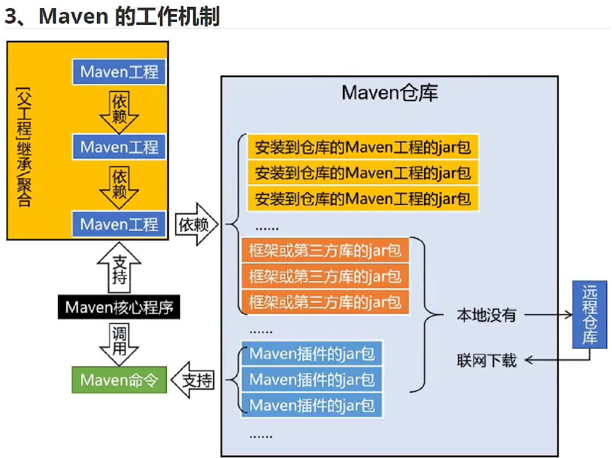

## 下载配置

官网:https://maven.apache.org/

目录:
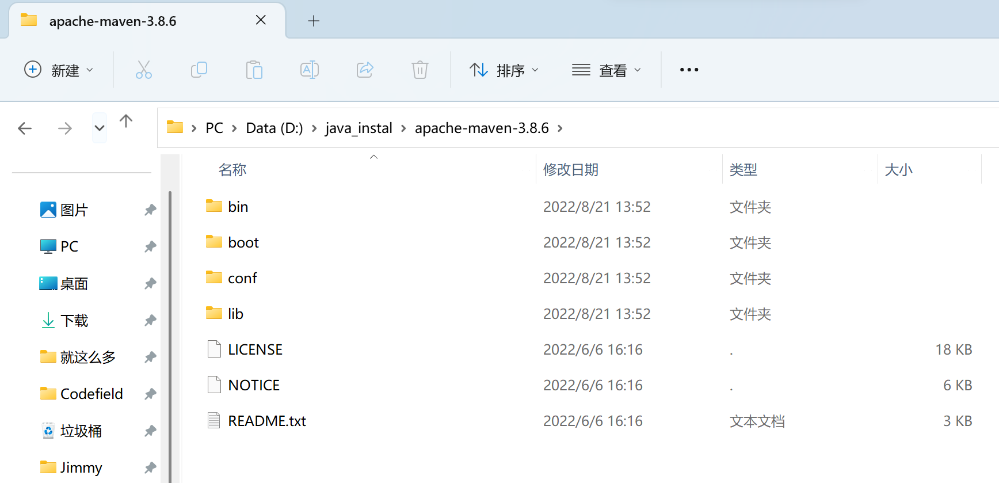

配置本地仓库的路径:
在  D:\java_instal\apache-maven-3.8.6\conf\settings.xml

```xml
  <!-- localRepository
   | The path to the local repository maven will use to store artifacts.
   |
   | Default: ${user.home}/.m2/repository
  <localRepository>/path/to/local/repo</localRepository>
  -->
  <!-- 配置Maven本地仓库 -->
  <!-- 这个目录可以等执行构建命令时由Maven创建 -->
  <localRepository>d:\maven-repo</localRepository>
```

小插曲,买了个小拓展坞,typec转vga和hdmi,家里这个老显示器,但也不老,1600X900的分辨率,19.5英寸,这个PPI还是挺高的,接近1920X1080的24寸显示器,等过几天买回来试试吧,好用的话就可以组双屏了!!!

**配置阿里云提供的镜像仓库**

Maven下载jar包默认访问境外的*中央仓库*,改成阿里云提供的镜像仓库,访问国内网站,可以让Maven下载jar包的时候速度更快
**配置方式**
将下面mirror标签整体复制到setting.xml文件的mirros标签的内部

```xml
    <mirror> 
          <id>nexus-aliyun</id> 
          <mirrorOf>central</mirrorOf> 
          <name>Nexus aliyun</name> 
          <url>http://maven.aliyun.com/nexus/content/groups/public</url> 
    </mirror>
```

配置Maven工程的基础JDK版本,如果按照默认运行,Java工程使用的默认JDK版本是1.5,而我们熟悉和常用的是JDK1.8版本,修改配置方式是:将profile标签整个复制到settings.xml文件的profiles标签内

```xml
  <profile> 
      <id>jdk-1.8</id> 
      <activation> 
      <activeByDefault>true</activeByDefault> 
      <jdk>1.8</jdk> 
      </activation> 
  <properties> 
        <maven.compiler.source>1.8</maven.compiler.source> 
        <maven.compiler.target>1.8</maven.compiler.target> 
        <maven.compiler.compilerVersion>1.8</maven.compiler.compilerVersion> 
  </properties> 
  </profile>
```

然后就要检查一下环境变量了
这个没问题,当时Tomcat都可以用
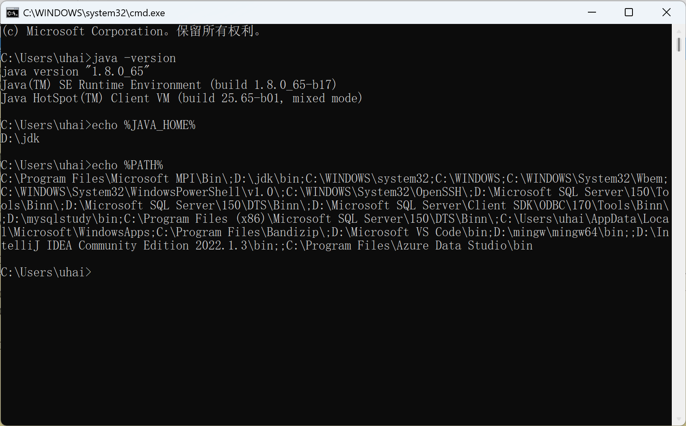

然后就是配置MAVEN_HOME
路径:D:\java_instal\apache-maven-3.8.6
就跟配置JAVA_HOME一样,放到bin目录的前一个目录
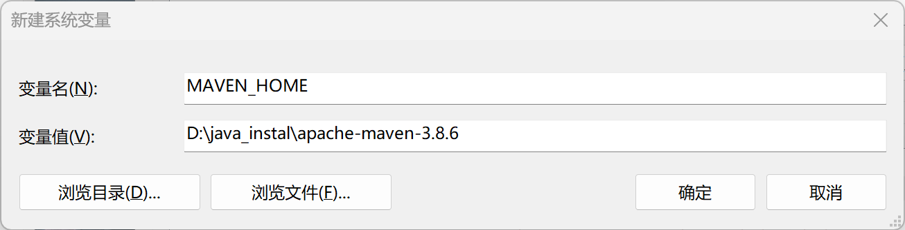
然后看PATH,像JAVA_HOME的PATH就是
%JAVA_HOME%\bin
而MAVEN的就是
%MAVEN_HOME%\bin
配置成功:
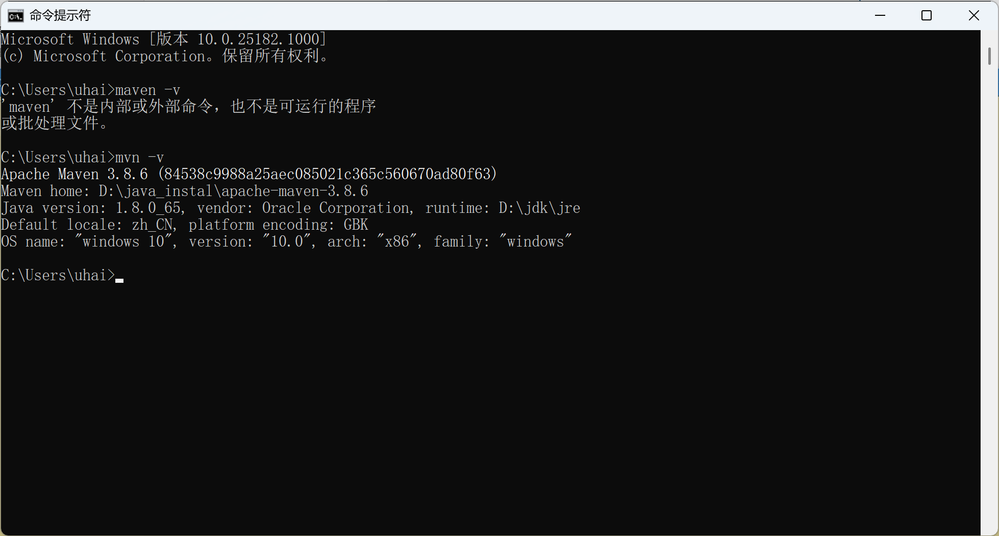

## 创建Maven工程

**根据坐标创建Maven工程**

### 向量说明

使用三个[向量]在[Maven的仓库]中唯一的定位到一个jar包

- groupld       公司或组织的id
- artifactid    一个项目或者是项目中的一个模块的id
- version       版本号

三个向量的取值方式

- groupld:公司或组织域名的倒序,通常也会加上项目名称
  - 例如: com.zzmr.maven
- artifactld:模块的名称,将来作为Maven工程的工程名
- version:模块的版本号,根据自己的需要设定
  - 例如:SNAPSHOT表示快照版本,正在迭代过程中,不稳定的版本
  - 例如: RELEASE表示正式版本

**坐标和仓库中jar包的存储路径之间的对应关系

```xml
<groupId>javax.servlet</groupId> 
<artifactId>servlet-api</artifactId> 
<version>2.5</version>
```

上述坐标对应的jar包在Maven本地仓库中的位置:
Maven本地仓库根目录\javax\servlet\servlet-api\2.5\servlet-api-2.5.jar

### 具体操作

1. 创建目录作为后面操作的工作空间
   创建了一个：D:\maven-workspace\spaceVideo
2. 在命令窗口中打开该目录
3. 使用命令生成Maven工程

运行 mvn archetype:generate命令

- mvn 主命令
  下面是子命令：
- archetype 插件
- generate 目标

### 调整

Maven默认生成的工程,对junit依赖的是较低的3.8.1版本,我们可以改成较适合的4.12版本
D:\maven-workspace\spaceVideo\pro01-maven-java 目录下的pom.xml
改成4.12即可,随后还可以删除自动生成的App.java和AppTest.java

```xml
  <dependencies>
    <dependency>
      <groupId>junit</groupId>
      <artifactId>junit</artifactId>
      <version>4.12</version>
      <scope>test</scope>
    </dependency>
  </dependencies>
```

pom.xml的基本介绍

```xml
<!-- project  根标签 表示对当前工程进行配置,管理 -->
<project xmlns="http://maven.apache.org/POM/4.0.0" xmlns:xsi="http://www.w3.org/2001/XMLSchema-instance"
  xsi:schemaLocation="http://maven.apache.org/POM/4.0.0 http://maven.apache.org/xsd/maven-4.0.0.xsd">
  
  <!-- modelVersion 标签,从Maven 2 开始就固定是4.0.0 -->
  <!-- 代表当前pom.xml所采用的标签结构 -->
  <modelVersion>4.0.0</modelVersion>

  <!-- 坐标信息 -->
  <!-- groupId标签:坐标向量之一,代表公司或组织开发的某一个项目 -->
  <groupId>com.zzmr.maven</groupId>

<!-- artifactId 标签:坐标向量之一,代表项目下的某一个模块 -->
  <artifactId>pro01-maven-java</artifactId>

  <!-- version 标签:坐标向量之一,代表当前模块的版本 -->
  <version>1.0-SNAPSHOT</version>

  <!-- packaging 标签: 打包方式 -->
  <!-- 默认是jar包,取值为war,就是打war包,说明这是一个war工程,还有一个是pom 说明这个工程是用来管理其他工程的工程 -->
  <packaging>jar</packaging>

  <name>pro01-maven-java</name>
  <url>http://maven.apache.org</url>

<!-- properties 在Maven中定义属性值 -->
  <properties>
  <!-- 在构建过程中读取源码时使用的字符集 -->
    <project.build.sourceEncoding>UTF-8</project.build.sourceEncoding>
  </properties>

<!-- dependencies 标签 配置具体依赖信息 可以包含多个dependency -->
  <dependencies>
  <!-- dependency 标签,用于配置一个具体的依赖信息 -->
    <dependency>
    <!-- 坐标信息:导入哪个jar包,就配置它的坐标信息即可 -->
      <groupId>junit</groupId>
      <artifactId>junit</artifactId>
      <version>4.12</version>
      <!-- scope 标签: 配置当前依赖的范围 -->
      <scope>test</scope>
    </dependency>
  </dependencies>
</project>
```

### Maven核心概念POM

含义:
POM: Project Object Model 项目对象模型 和POM类似的事 DOM(Document Object Model) 文档对象模型,它们都是模型化思想的具体体现

模型化思想
POM表示将工程抽象为一个模型,再用程序中的对象来描述这个模型,这样我们就可以用程序来管理项目了,我们在开发过程中,最基本的做法就是将现实生活中的事物抽象为模型,然后封装模型相关的数据作为一个对象,这样就可以在程序中计算与现实事务相关的数据

**约定目录结构的意义**
Maven为了让构建过程能够尽可能自动化完成,所以必须约定目录结构的作用,例如:Maven执行编译操作,必须先去Java原程序目录读取Java源代码,然后执行编译,最后把编译结果存放在target目录

**约定大于配置**

### 执行Maven的构建命令

1. 要求
   运行Maven中和构建操作相关的命令时，必须进入到pom.xml,否则会看到:

```
The goal you specified requires a project to execute but there is no POM in this directory
```

*mvn -v命令和构建无关*

2. 清理操作
   mvn clean
   效果: 删除target目录
3. 编译操作

- 主程序编译: mvn compile
- 测试程序编译: mvn test-compile
- 主体程序编译结果存放的目录: target/classes
- 测试程序编译结果存放的目录: target/test-classes

执行mvn compile 一直报错,所以把下面的东西注掉,就好了

```xml
<scope>test</scope>
```

执行下面的 mvn test-compile一直报错
在dependencies中加入依赖:

```xml
<dependency>
        <groupId>org.apache.geronimo.specs</groupId>
        <artifactId>geronimo-servlet_2.4_spec</artifactId>
        <version>1.1.1</version>
        <scope>provided</scope>
</dependency>
```

删除操作倒是没什么问题,真是起了个大怪

4. 测试操作
   mvn test
   测试的报告存放的目录: target/surefire-reports
   直接执行mvn test 会自动构建的(mvn compile)
5. 打包操作
   mvn package
   打包的结果: jar包,存放的目录:target
   同样也会先测试,再打包
6. 安装操作
   mvn install
   安装完成后得到:d:\maven-repo\com\zzmr\maven\pro01-maven-java\1.0-SNAPSHOT\pro01-maven-java-1.0-SNAPSHOT.jar

```xml
  <!-- 坐标信息 -->
  <!-- 在本地仓库中安装后对应的路径 -->
  <!-- d:\maven-repo\com\zzmr\maven\pro01-maven-java\1.0-SNAPSHOT\pro01-maven-java-1.0-SNAPSHOT.jar -->
  <!-- groupId标签:坐标向量之一,代表公司或组织开发的某一个项目 -->
  <groupId>com.zzmr.maven</groupId>

<!-- artifactId 标签:坐标向量之一,代表项目下的某一个模块 -->
  <artifactId>pro01-maven-java</artifactId>

  <!-- version 标签:坐标向量之一,代表当前模块的版本 -->
  <version>1.0-SNAPSHOT</version>
```

## 创建Maven版的Web工程

复制过来的一直错误:The goal you specified requires a project to execute but there is no POM in this directory
所以我手打了一遍
mvn archetype:generate -DarchetypeGroupId=org.apache.maven.archetypes -DarchetypeArtifactId=maven-archetype-webapp -DarchetypeVersion=1.4
就好了
创建好的:
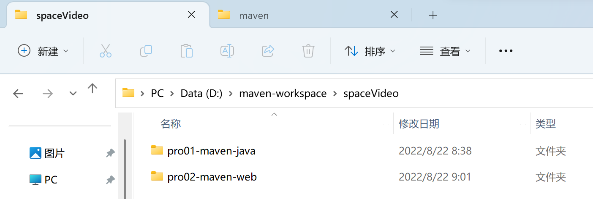

### 创建java类

HelloeServlet.java

```java
package com.zzmr.maven; 
import javax.servlet.http.HttpServlet; 
import javax.servlet.http.HttpServletRequest; 
import javax.servlet.http.HttpServletResponse; 
import javax.servlet.ServletException; 
import java.io.IOException; 
public class HelloServlet extends HttpServlet{ 
    protected void doGet(HttpServletRequest request, HttpServletResponse response) throws ServletException, IOException { 
        response.getWriter().write("hello maven web"); 
    } 
}
```

web.xml

```xml
      <servlet-name>helloServlet</servlet-name> 
      <servlet-class>com.zzmr.maven.HelloServlet</servlet-class> 
  </servlet> 
  <servlet-mapping> 
      <servlet-name>helloServlet</servlet-name> 
      <url-pattern>/helloServlet</url-pattern> 
  </servlet-mapping>
```

index.jsp

```html
<html> 
    <body> 
        <h2>Hello World!</h2> 
        <a href="helloServlet">Access Servlet</a> 
    </body> 
</html>
```

**编译**
此时直接执行mvn compile会报错,显示无法找到类
所以要先配置对servlet-api.jar包的依赖

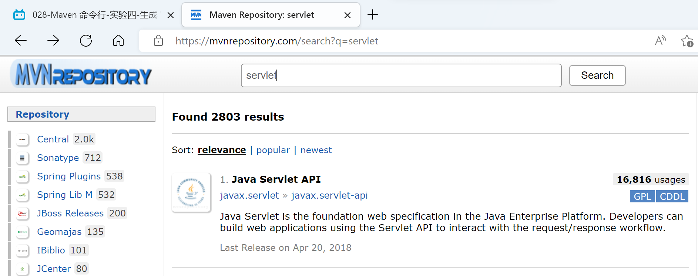
到https://mvnrepository.com/下载servelt-api.jar

```xml
      <!-- https://mvnrepository.com/artifact/javax.servlet/javax.servlet-api -->
  <dependency>
      <groupId>javax.servlet</groupId>
      <artifactId>javax.servlet-api</artifactId>
      <version>3.1.0</version>
      <scope>provided</scope>
  </dependency>
```

此时执行mvn compile可以执行成功
然后执行 mvn clean package即可打war包

此时会有:pro02-maven-web-1.0-SNAPSHOT
还有一个pro02-maven-web-1.0-SNAPSHOT.war
将这两个任意一个放到Tomcat的webapp页面即可
建议放pro02-maven-web-1.0-SNAPSHOT,因为就算放war包,依然是需要解压的

然后打开Tomcat就可以了
打开后去浏览器执行  http://localhost:8080/demo/index.jsp
此时Servlet程序已正常运行

## 让Web工程依赖Java工程

1. 观念
   明确一个意识:从来只有Web工程依赖Java工程,没有反过来Java工程依赖Web工程.本质上来说,Web工程依赖的Java工程其实就是Web工程里导入jar包,最终java工程会变化曾jar包,放在Web工程的WEB-INF/lib目录下
2. 操作
   在pro02-maven-web工程的pom.xml中,找到dependences标签,在dependencies标签中坐如下配置

```xml
  <!-- 配置对Java工程pro01-maven-java的依赖 --> 
  <!-- 具体的配置方式：在dependency标签内使用坐标实现依赖 --> 
  <dependency> 
      <!-- 通过指定被依赖工程的坐标完成依赖 -->
      <groupId>com.zzmr.maven</groupId> 
      <artifactId>pro01-maven-java</artifactId> 
      <version>1.0-SNAPSHOT</version> 
      <scope>compiler</scope>
  </dependency>
```

新建:
src-test-java-com-zzmr-maven
然后将原Java项目的测试类复制到web-test下
然后执行命令  mvn test
奇怪的是这次竟然没有报错,上次执行该命令,如果不把scope标签注释掉,是会报错的

测试成功也证明,这个依赖是成功的

**打包**
mvn package
通过查看war包内的结构,我们看到被Web工程以来的Java工程确实是会变成Web工程的WEB-INF/lib目录下的jar包
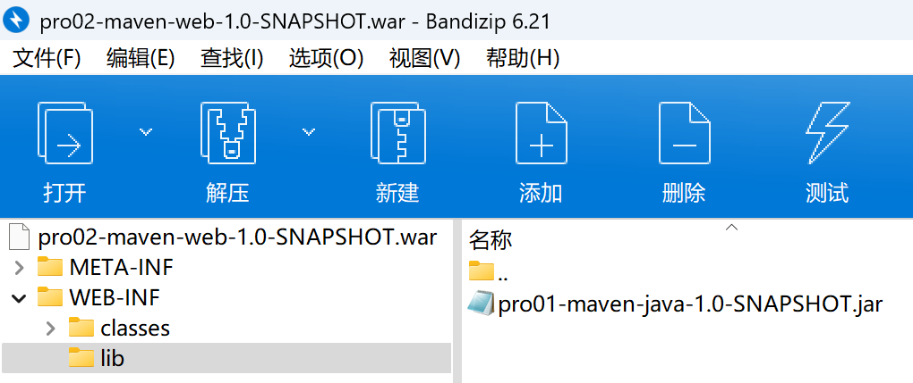

查看依赖:
mvn dependency:list
还有树形结构
mvn dependency:tree

### 测试依赖的范围

1. 依赖范围
   标签的位置: dependencies/dependence/scope
   标签可选值: compile/test/provided/system/runtime/import
   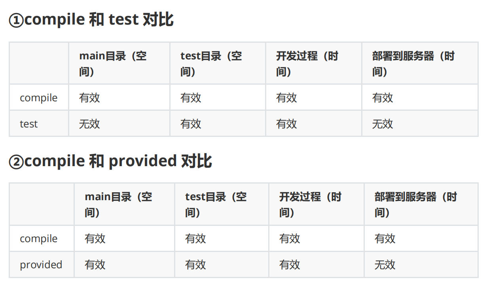

还测试吗,又报错了....
妈的全报错,真是日了狗

**结论**

- compile 通常使用的第三方框架的jar包这样的项目实际运行时真正要用到的jar包都是以compile范围进行依赖的,比如SSM框架所需jar包
- test 测试过程中使用jar包,以test范围依赖进来,比如junit
- provided 在开发过程中需要用到的服务器上的jar包通常以provided范围依赖进来,比如servlet-api,jsp-api,而这个范围的jar包之所以不参与部署,就是避免和服务器上已有的同类jar包产生冲突,同时减轻服务器的负担,说白了就是"服务器已经有了,你就别带了"

## 测试依赖的传递性

使用compile范围依赖spring-core

```xml
    <!-- 以compile范围导入spring-core依赖,测试依赖的传递性 -->
    <!-- https://mvnrepository.com/artifact/org.springframework/spring-core --> 
    <dependency> 
        <groupId>org.springframework</groupId> 
        <artifactId>spring-core</artifactId> 
        <version>4.0.0.RELEASE</version> 
    </dependency>
```

执行 mvn dependency:tree
即可得到,说明已经成功依赖spring-core的jar包

```
[INFO] --- maven-dependency-plugin:2.8:tree (default-cli) @ pro01-maven-java ---
[INFO] com.zzmr.maven:pro01-maven-java:jar:1.0-SNAPSHOT
[INFO] +- junit:junit:jar:4.12:compile
[INFO] |  \- org.hamcrest:hamcrest-core:jar:1.3:compile
[INFO] +- org.apache.geronimo.specs:geronimo-servlet_2.4_spec:jar:1.1.1:provided
[INFO] \- org.springframework:spring-core:jar:4.0.0.RELEASE:compile
[INFO]    \- commons-logging:commons-logging:jar:1.1.1:compile
```

执行 mvn dependency:list
可得到

```xml
[INFO] The following files have been resolved:
[INFO]    org.apache.geronimo.specs:geronimo-servlet_2.4_spec:jar:1.1.1:provided
[INFO]    org.springframework:spring-core:jar:4.0.0.RELEASE:compile
[INFO]    commons-logging:commons-logging:jar:1.1.1:compile
[INFO]    org.hamcrest:hamcrest-core:jar:1.3:compile
[INFO]    junit:junit:jar:4.12:compile
```

在本地仓库中即可找到:D:\maven-repo\org\springframework\spring-core\4.0.0.RELEASE
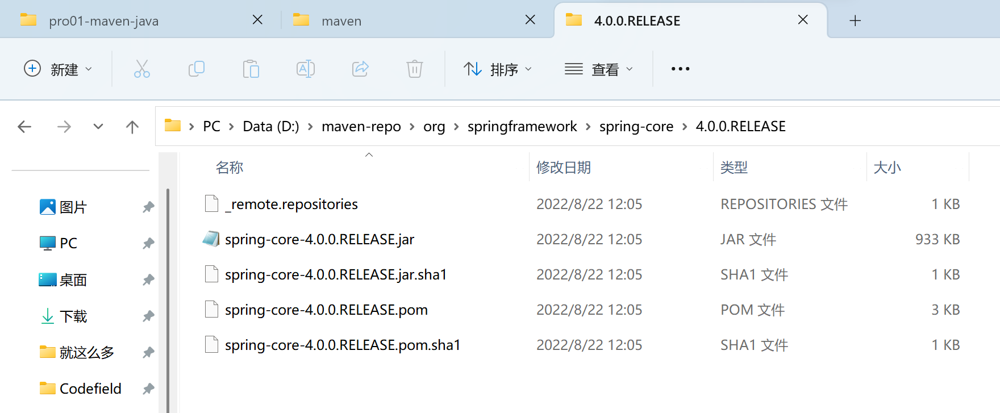

## 测试依赖的排除

```xml
<dependency> 
        <groupId>com.atguigu.maven</groupId> 
        <artifactId>pro01-maven-java</artifactId> 
        <version>1.0-SNAPSHOT</version> 
        <scope>compile</scope> 
        <!-- 使用excludes标签配置依赖的排除 --> 
        <exclusions> 
                <!-- 在exclude标签中配置一个具体的排除 --> 
                <exclusion>
                    <!-- 指定要排除的依赖的坐标（不需要写version） --> 
                    <groupId>commons-logging</groupId> 
                    <artifactId>commons-logging</artifactId> 
                </exclusion> 
        </exclusions> 
</dependency>
```

## 继承

Maven工程之间，A工程继承B工程
本质上是A工程的pom.xml中的配置继承了B工程中的pom.xml的配置

继承的作用: 在父工程中统一管理项目中的依赖信息,具体来说似乎管理依赖信息的版本

创建父工程 pro03-maven-parent
只有打包方式为pom的Maven工程能够管理其他Maven工程,打包方式为pom的Maven工程中不写业务代码,他是专门管理其他Maven工程的工程

创建:mvn archetype:generate

```
Choose a number or apply filter (format: [groupId:]artifactId, case sensitive contains): 7:
Define value for property 'groupId': com.zzmr.maven
Define value for property 'artifactId': pro03-maven-parent
Define value for property 'version' 1.0-SNAPSHOT: :
Define value for property 'package' com.zzmr.maven: :
Confirm properties configuration:
groupId: com.zzmr.maven
artifactId: pro03-maven-parent
version: 1.0-SNAPSHOT
package: com.zzmr.maven
 Y: :
```

**创建模块工程**
模块工程类似于IDEA中的module,所以需要进入pro03-maven-parent工程的根目录,然后运行mvn archetype:generate 命令来创建模块工程

创建好多个子模块后
在父工程的pom.xml中会有如下变化

```xml
  <modules>  
      <module>pro04-maven-module</module>
      <module>pro05-maven-module</module>
      <module>pro06-maven-module</module>
  </modules>
```

在子工程中,会自动添加

```xml
  <parent>
  <!-- 通过指定父工程的坐标找到父工程 -->
    <groupId>com.zzmr.maven</groupId>
    <artifactId>pro03-maven-parent</artifactId>
    <version>1.0-SNAPSHOT</version>
  </parent>
```

子工程的坐标特点:

```xml
  <!-- 子工程 groupId,version 如果和父工程一样,就可以省略 -->
  <!-- <groupId>com.zzmr.maven</groupId> -->
  <artifactId>pro04-maven-module</artifactId>
  <!-- <version>1.0-SNAPSHOT</version> -->
```

```xml
  <!-- 注意：即使在父工程配置了对依赖的管理，子工程需要使用具体哪一个依赖还是要明确配置 -->
    <dependency>
      <groupId>org.springframework</groupId>
      <artifactId>spring-core</artifactId>
      <!-- 版本号就不用写了，直接用父工程的 -->
      <!-- 如果写了,而且和父工程版本号不一致,那么就会覆盖掉父工程的设置 -->
      <!-- <version>4.0.0.RELEASE</version> -->
    </dependency>
```

此时,在父工程该一下,子工程全部就改了,当然子工程的[version]版本要删掉

更方便的方法:

```xml
  <properties>
    <project.build.sourceEncoding>UTF-8</project.build.sourceEncoding>
    <!-- 创建我们自定义的属性标签 -->
    <!-- 标签名:属性名 -->
    <!-- 标签值:属性值 -->
    <!-- 用${zzmr.spring.version}引用即可 -->
    <zzmr.spring.version>4.1.0.RELEASE</zzmr.spring.version>
  </properties>


  <!-- 引用时: -->
  <dependency>
        <groupId>org.springframework</groupId>
        <artifactId>spring-core</artifactId>
        <version>${zzmr.spring.version}</version>
  </dependency>

```

可实现完全一样的效果,当要修改版本时,只需要更改zzmr.spring.version的值即可

**聚合**
部分组成整体
好处:一键执行Maven命令:很多构建命令都可以在总工程中一键执行.
4依赖5,5依赖6
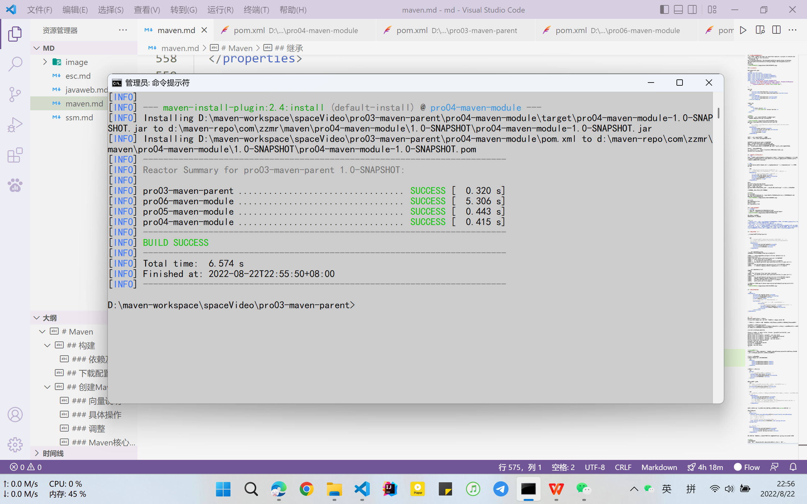
千万不要有循环依赖的情况

## IDEA集成MAVEN

*终于等到你*
基础配置:
直接新建项目:
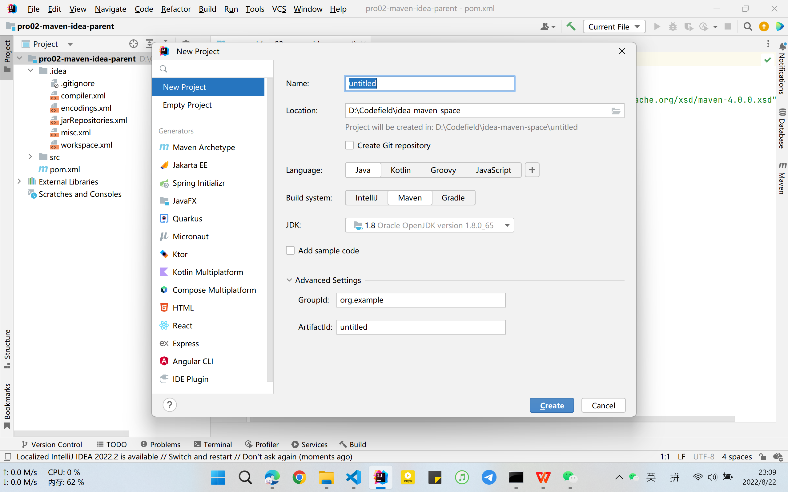
说实话还是idea方便
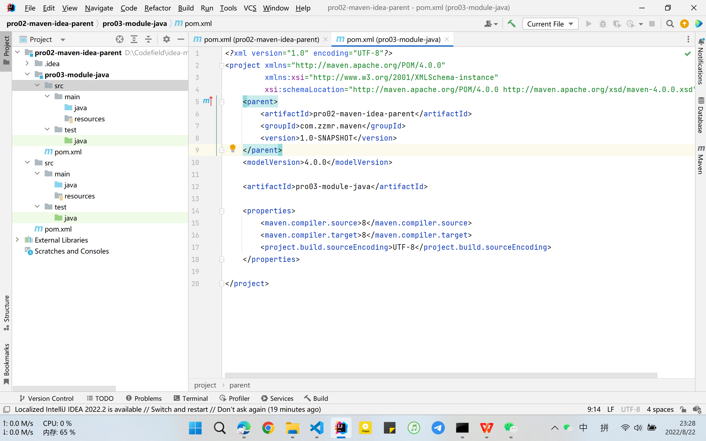

这也太太太好用了,想用什么命令直接双击
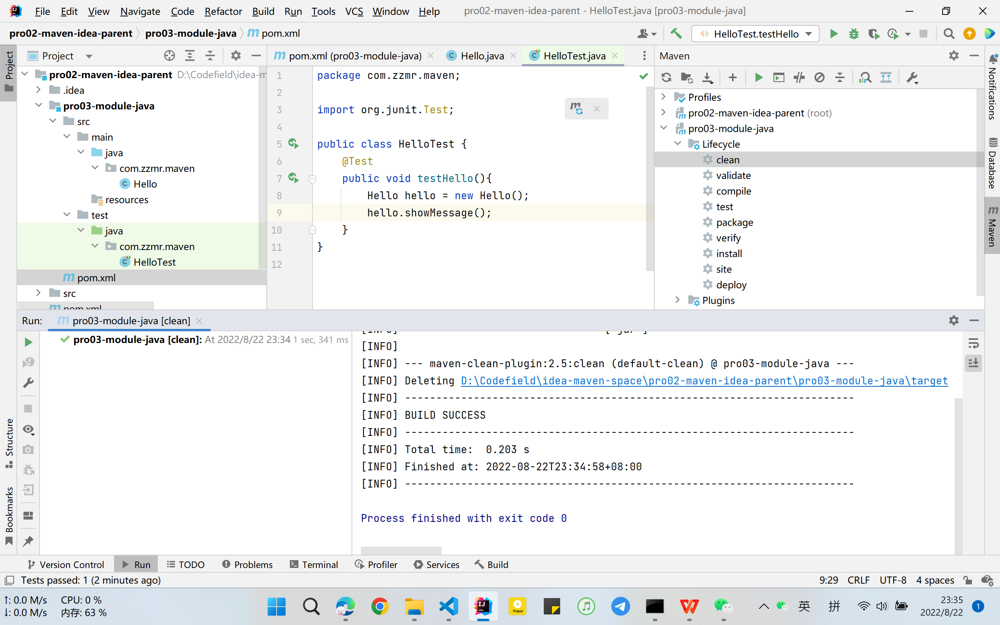

- -D 表示后面要附加命令的参数,字幕D和后面的参数是紧挨着的,中间没有任何其他字符
- maven.test.skip=true 表示在执行命令的过程中跳过测试
- mvn clean install -Dmaven.test.skip=true
  要去tools里更改默认的命令窗口-改成cmd即可用以上命令
  2022年8月22日 23点53分
  *睡觉了*

直接install是不行的
会报：webxml attribute is required (or pre-existing WEB-INF/web.xml if executing in update mode)
因为web.xml的目录不一样
此时,加上下面的代码即可

```xml
 <properties>
        <failOnMissingWebXml>false</failOnMissingWebXml>
 </properties>
```

好短啊,就一点东西
2022年8月23日 03点09分
后面的东西也没必要学了,下面就要开始干SSM,冲!
