2022年12月19日 09点36分
正式开始

# SpringBoot

## 基础入门

### SpringBoot简介

**SpringBoot可以整合Spring家族的其他框架**
记住这个应该就行了

> 为什么要使用SpringBoot?
> 能快速创建出生产级别的Spring应用

> SpringBoot的优点

- 创建独立Spring应用
- 内嵌web服务器
- 自动starter依赖,简化构建配置
- 自动配置Spring以及第三方功能
- 提供生产级别的监控,健康检查及外部化配置
- 无代码生成,无需编写XML

**starter:这个是真的牛逼啊,之前写一个模块就要导一堆的jar包(pom里面),现在要是写一个web应用,只需要导入一个web的jar包就可以了**

还有自动配置Spring以及第三方功能,现在就成了:项目创建好,直接开发业务逻辑,不用写太多的配置文件,各种整合的内容

> SpringBoot是整合Spring技术栈的一站式框架
> SpringBoot是简化Spring技术栈的快速开发脚手架

SpringBoot的缺点

1. 人称版本帝,迭代快,需要时刻关注变化
2. 封装太深,内部原理复杂,不容易精通

#### 时代背景

**微服务**

- 微服务是一种架构风格
- 每个服务运行在自己的进程内,也就是可独立部署和升级
- 服务之间使用轻量级HTTP交互
- 服务围绕业务功能拆分
- 可以由全自动部署机制独立部署
- 去中心化,服务自治,服务可以使用不同的语言,不同的存储技术

**分布式**
分布式的困难:

- 远程调用
- 服务发现
- 负载均衡
- 服务容错
- 配置管理
- 服务监控
- 链路追踪
- 日志管理

分布式的解决
**SpringBoot+SpringCloud**

这SpringBoot现在已经更新到3了,老师讲的是2,刚才百度了一下
发现3的Java版本已经更新到17了,这谁敢用

### SpringBoot入门

先说前提啊:老师用的是2.3.4.RELEASE
但是现在阿里云的镜像里已经没有这个jar包了,所以我用的是2.4.13

#### 入门案例

需求:浏览器发哦是那个/hello请求,响应Hello,SpringBoot2

卧槽,太强了吧,这也太强了吧

下面看步骤:

1. 导入依赖

```xml
<?xml version="1.0" encoding="UTF-8"?>
<project xmlns="http://maven.apache.org/POM/4.0.0"
         xmlns:xsi="http://www.w3.org/2001/XMLSchema-instance"
         xsi:schemaLocation="http://maven.apache.org/POM/4.0.0 http://maven.apache.org/xsd/maven-4.0.0.xsd">
    <modelVersion>4.0.0</modelVersion>

    <groupId>com.zzmr</groupId>
    <artifactId>boot-01-helloworld</artifactId>
    <version>1.0-SNAPSHOT</version>

    <properties>
        <maven.compiler.source>8</maven.compiler.source>
        <maven.compiler.target>8</maven.compiler.target>
        <project.build.sourceEncoding>UTF-8</project.build.sourceEncoding>
    </properties>

    <parent>
        <groupId>org.springframework.boot</groupId>
        <artifactId>spring-boot-starter-parent</artifactId>
        <version>2.4.13</version>
    </parent>

    <dependencies>
        <dependency>
            <groupId>org.springframework.boot</groupId>
            <artifactId>spring-boot-starter-web</artifactId>
        </dependency>
    </dependencies>

</project>
```

2. 先写一个主类,这个类负责运行项目
   要加上@SpringBootApplication注解

```java
package com.zzmr.boot;

import org.springframework.boot.SpringApplication;
import org.springframework.boot.autoconfigure.SpringBootApplication;

/**
 * @SpringBootApplication 这是一个SpringBoot应用, 标注的类也叫主程序类
 */
@SpringBootApplication
public class MainApplication {
    public static void main(String[] args) {
        SpringApplication.run(MainApplication.class, args);
    }
}
```

3. 写处理请求的类
   这里要注意使用的是@RestController注解,是给浏览器写回一个数据,而不是跳转页面

```java
package com.zzmr.boot.controller;

import org.springframework.stereotype.Controller;
import org.springframework.web.bind.annotation.GetMapping;
import org.springframework.web.bind.annotation.RequestMapping;
import org.springframework.web.bind.annotation.ResponseBody;
import org.springframework.web.bind.annotation.RestController;

// 这个注解，是标识这个类中的所有方法都是给浏览器写回一个数据，而不是跳转页面
/*@ResponseBody
@Controller*/
//   @RestController 这个注解可以代替上面两个注解
@RestController
public class HelloController {

    @RequestMapping("/hello")
    public String handle01() {
        return "Hello, SpringBoot 2!";
    }

}
```

然后,牛逼的地方来了,直接运行主方法
然后在浏览器访问http://localhost:8080/hello直接得到:

<!-- 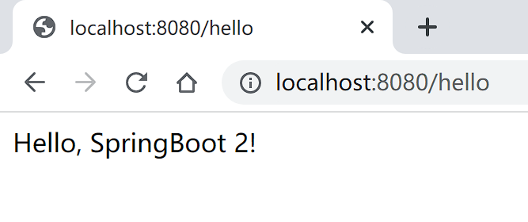 -->


这相当于省略了什么?省略了配置web.xml,省略了配置SpringMVC的配置文件,省略了配置tomcat,甚至连页面都没写
牛逼

**application.properties**
这个是用来干什么的?它可以用来配置很多东西
甚至tomcat的端口号都可以用它来配置
server.port=8888
此时,端口号就改成8888了

<!--  -->


它能修改哪些内容?[点我查看](https://docs.spring.io/spring-boot/docs/2.4.13/reference/html/appendix-application-properties.html#common-application-properties)

还有一个打包的插件

```xml
    <build>
        <plugins>
            <plugin>
                <groupId>org.springframework.boot</groupId>
                <artifactId>spring-boot-maven-plugin</artifactId>
                <version>${project.parent.version}</version>
            </plugin>
        </plugins>
    </build>
```

**甚至可以将web工程打包成可执行的jar包,然后在cmd里执行java -jar boot-01-helloworld-1.0-SNAPSHOT.jar,就可以在浏览器直接访问**

真就,依赖一导,其他几乎都不用操心了

注意:

#### 了解自动配置原理

###### SpringBoot特点

**1.1 依赖管理**

- 父项目做依赖管理
  > 什么意思呢,就是这个spring-boot-starter-parent,就是父项目,然后它管理了后面用到的依赖的版本
  >

```xml
    <parent>
        <groupId>org.springframework.boot</groupId>
        <artifactId>spring-boot-starter-parent</artifactId>
        <version>2.4.13</version>
    </parent>
```

    就直接可以在后面添加依赖的时候,不用写版本号

```xml
    <dependencies>
        <dependency>
            <groupId>org.springframework.boot</groupId>
            <artifactId>spring-boot-starter-web</artifactId>
        </dependency>
    </dependencies>
```

    这个项目的父项目:

```xml
  <parent>
    <groupId>org.springframework.boot</groupId>
    <artifactId>spring-boot-dependencies</artifactId>
    <version>2.4.13</version>
  </parent>
```

    再点进去,就会发现这个项目的properties标签中有很多很多的版本信息,几乎声明了所有开发中常用的jar的版本号(也叫自动版本仲裁机制)

<!-- 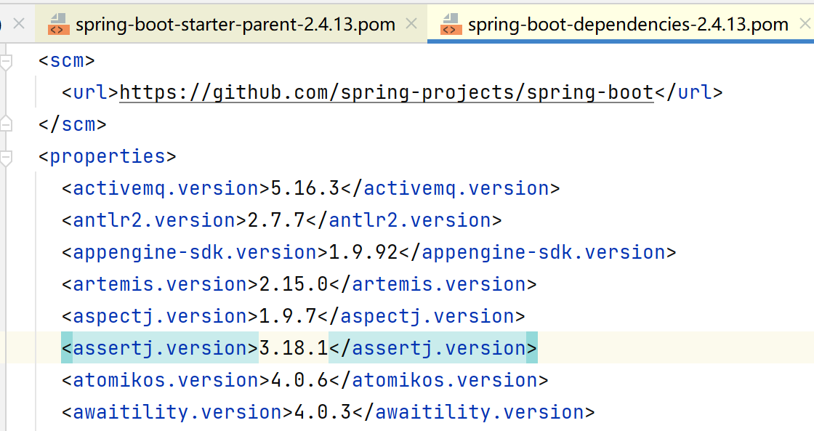 -->


- 开发导入starter场景启动器
  > 什么是starter呢?
  > 在以后的开发中,会遇到很多的spring-boot-starter-*,\*表示某种场景
  > 那么只要引入starter,那这个场景下常规所需要的依赖全部会自动导入
  > 比如这个spring-boot-starter-web,点进去就会发现,它引入了大部分web所需要的依赖,这里其实是使用了**maven的特性:依赖的传递性**
  > 那\*有哪些呢,[点击查看](https://docs.spring.io/spring-boot/docs/2.4.13/reference/html/using-spring-boot.html#using-boot-starter)
  >
- 无需关注版本号,自动版本仲裁
  > 引入依赖默认都可以不写版本
  > 引入非版本仲裁的jar,要写版本号(就是dependencies中没有的依赖)
  >
- 可以修改版本号
  > 修改版本号只需要properties标签中添加上某个依赖的版本号即可
  > 比如要更改mysql的版本为5.1.43
  > 此时在properties标签中添加mysql.version,然后刷新,即可完成修改
  > **如何知道要修改的key呢?要去spring-boot-dependencies中搜索
  >

```xml
       <mysql.version>5.1.43</mysql.version>
```

**1.2 自动配置**

- 自动配好Tomcat
  - 引入tomcat依赖
  - 配置tomcat

```xml
    <dependency>
      <groupId>org.springframework.boot</groupId>
      <artifactId>spring-boot-starter-tomcat</artifactId>
      <version>2.4.13</version>
      <scope>compile</scope>
    </dependency>
```

- 自动配好SpringMVC

  - 引入SpringMVC全套组件
  - 自动配好了SpringMVC常用组件(功能)
- 自动配好Web常用功能,如字符编码问题

  - SpringBoot帮我们配置好了所有web开发的常见场景
- 默认的包结构

  - 之前要指定controller包啊什么包什么包在什么地方,进行扫描
  - 而现在,**主程序所在包以及下面的所有子包里面的组件都会被默认扫描进来**

  <!-- - 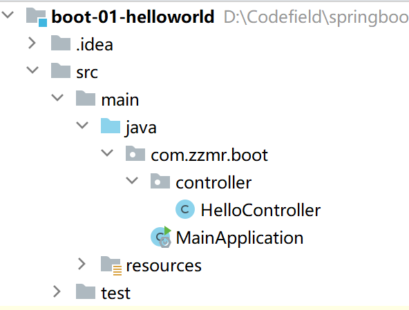 -->

  - 
  - 要注意啊,只有放在主程序所在包以及子包里面才能被默认扫描出来,但是如果想自定义扫描的位置呢?,就要在@SpringBootApplication注解中添加scanBasePackages属性了:@SpringBootApplication(scanBasePackages = "com.zzmr")
  - 当然还有另一个注解:@ComponentScan(),这个注解就是专门用于扫描包的,叫做包扫,这个以后学,现在不能直接用
  - 而一个@SpringBootApplication就相当于

  ```java
      @SpringBootConfiguration
      @EnableAutoConfiguration
      @ComponentScan("包")
  ```
- 各种配置拥有默认值

  - 默认配置都是映射到MultipartProperties
  - 配置文件的值最终被绑定到每个类上,这个类会在容器中创建对象
- 按需加载所有自动配置项

  - 非常多的starter
  - 引入了哪些场景,这个场景的自动配置就会开启
  - SpringBoot所有的自动配置功能都在spring-boot-autoconfigure包里面
- .....

### 容器功能

#### 组件添加

###### 1. @Configuration

之前都是在Spring的配置文件中设置bean标签,在bean标签中设置组件
而现在是创建配置类

```java
package com.zzmr.boot.config;

import com.zzmr.boot.bean.Pet;
import com.zzmr.boot.bean.User;
import org.springframework.context.annotation.Bean;
import org.springframework.context.annotation.Configuration;

@Configuration(proxyBeanMethods = false) // 告诉SpringBoot这是一个配置类，等同于配置文件
// 配置类中里面使用@Bean标注在上方给容器注册组件，默认也是单例模式（单实例）
// proxyBeanMethods：代理bean的方法
// Full（proxyBeanMethods = true），  就是如果调用了，Springboot就会检查容器中是否存在
// lite（proxyBeanMethods = false）  为false，不会去检查是否存在
public class MyConfig {

    /**
     * 外部无论对这个配置类中这个组件注册方法调用多少次，获取的都是之前注册容器中的单实例
     * @return
     */
    @Bean //给容器中添加组件，以方法名作为组件的id，返回类型就是组件类型，返回的值，就是组件在容器中的实例
    public User user01(){
        return new User("zhangsan",18);
    }

    @Bean("tom")
    public Pet tomcatPet(){
        return new Pet("tomcat");
    }

}

```

这时可以获取ioc容器,然后打印一些容器里的组件名称

```java
    public static void main(String[] args) {
        //SpringApplication.run(MainApplication.class, args);

    //    1. 返回我们IOC容器
        ConfigurableApplicationContext run = SpringApplication.run(MainApplication.class,args);

    //    2. 查看容器里面的组件
        String[] names = run.getBeanDefinitionNames();
        for (String name : names) {
            System.out.println(name);
        }

    //    3. 从容器中获取组件

    }
```

即可得到这两个组件,要注意的是,SpringApplication.run(MainApplication.class, args)的返回值就是IOC容器

<!-- 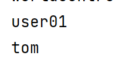 -->


而且,配置类里面使用@Bean注解注册的组件,默认也是单例的

```java
    //    3. 从容器中获取组件
        Pet tom01 = run.getBean("tom", Pet.class);
        Pet tom02 = run.getBean("tom", Pet.class);
        //判断是不是单例模式，如果是，则下面输出true
        System.out.println("组件"+(tom01==tom02));
```

会输出true

**而且配置类也是容器中的一个组件**

**Full模式与Lite模式**

- 配置类组件之间无依赖关系用Lite模式(proxyBeanMethods = false),加速容器启动过程,减少判断
- 配置类组件之间有依赖关系,方法会被调用得到之前单实例组件,用Full模式(proxyBeanMethods = true)

###### 2. @Import

@Import({User.class, DBHelper.class})
给容器中自动创建出这两个类型的组件,默认组建的名字就是全类名

###### 3. @Conditional

条件装配:满足Conditional指定的条件,则进行组件注入

这个注解有很多子注解?是这样叫吗

比如    @ConditionalOnBean(name = "tom")
先把tom的Bean给注释掉,让ioc容器中不存在tom组件

```java
    @ConditionalOnBean(name = "tom")
    @Bean //给容器中添加组件，以方法名作为组件的id，返回类型就是组件类型，返回的值，就是组件在容器中的实例
    public User user01(){
        return new User("zhangsan",18);
    }

    //@Bean("tom")
    public Pet tomcatPet(){
        return new Pet("tomcat");
    }
```

这时,如果容器中没有名称为tom的组件,则user01也不会创建

```java
        boolean tom = run.containsBean("tom");
        System.out.println("容器中tom组件 " + tom);
        System.out.println("user01:"+run.containsBean("user01"));
```

加上@ConditionalOnBean(name = "tom")之后,两个输出的都是false

#### 原生配置文件引入

**1. @ImportResource**

什么意思呢,就比如之前用的都是xml文件配置的bean
现在想在SpringBoot中继续使用,是不能直接拿来使用的
可以使用@ImportResource注解
@ImportResource("classpath:bean.xml")
这样就可以导入原来配置文件中的bean了

#### 配置绑定

如何使用Java读取到properties文件中的内容,并且把它封装到JavaBean中,以供随时使用

> 说个题外话,这个tester68,我还以为没有ins键呢,原来fn+del就是了,所以我现在想用快捷键来生成一些东西,就可以用alt+fn+del

**方式一**

可以用一个类来接收properties的值
比如properties中的是:

```properties
server.port=8888

spring.servlet.multipart.max-file-size=10MB

mycar.band=BTD
mycar.price=100000
```

此时,可以用一个类:

```java
package com.zzmr.boot.bean;

import org.springframework.boot.context.properties.ConfigurationProperties;
import org.springframework.stereotype.Component;

/**
 * 只有在容器中的组件才会拥有SpringBoot提供的功能
 */
@Component
@ConfigurationProperties(prefix = "mycar")
public class Car {
    private String band;
    private Integer price;

    public Car(String band, Integer price) {
        this.band = band;
        this.price = price;
    }

    public Car() {
    }

    @Override
    public String toString() {
        return "Car{" +
                "band='" + band + '\'' +
                ", price=" + price +
                '}';
    }

    public String getBand() {
        return band;
    }

    public void setBand(String band) {
        this.band = band;
    }

    public Integer getPrice() {
        return price;
    }

    public void setPrice(Integer price) {
        this.price = price;
    }
}
```

加上@Component
@ConfigurationProperties(prefix = "mycar")
这两个注解,prefix的值就是properties文件中要识别的数据的前缀
比如上面是mycar.band=BYD,那根据这个注解,就可以找到这条数据,并将点后面的属性跟类中的属性进行比较,如果相等,则赋值

```java
    @Autowired
    Car car;

    @RequestMapping("/car")
    public Car car(){
        return car;
    }
```

此时就能在前端页面得到数据

<!-- 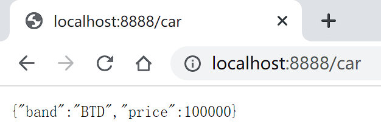 -->


还有第二种方式

**方式二**

需要在配置类中加上@EnableConfigurationProperties注解
作用:

- 开启Car配置绑定功能
- 把Car这个组件自动注册到容器中
  和第一种方法的区别就是不用写@Component注解了

### 自动配置原理入门

#### 引导加载自动配置类

在主程序类上添加的@SpringBootApplication注解,相当于

```java
@SpringBootConfiguration
@EnableAutoConfiguration
@ComponentScan(excludeFilters = { @Filter(type = FilterType.CUSTOM, classes = TypeExcludeFilter.class),
		@Filter(type = FilterType.CUSTOM, classes = AutoConfigurationExcludeFilter.class) })
```

的组合

- @SpringBootConfiguration
  代表当前是个配置类
- @ComponentScan
  指定扫描哪些,Spring注解,
- @EnableAutoConfiguration

```java
@AutoConfigurationPackage
@Import(AutoConfigurationImportSelector.class)
public @interface EnableAutoConfiguration {}
```

> @AutoConfigurationPackage,自动配置包

```java
@Import(AutoConfigurationPackages.Registrar.class)  // 给容器中导入一个组件
public @interface AutoConfigurationPackage {}
// 利用Registrar给容器中导入一系列的组件
// 将指定的一个包下的所有组件导入进来?MainApplication所在包下
```

> @Import(AutoConfigurationImportSelector.class)

```java
getAutoConfigurationEntry(annotationMetadata);
1. 利用这个方法,给容器中批量导入一些组件
2. 调用List<String> configurations = getCandidateConfigurations(annotationMetadata, attributes);获取所有需要导入容器中的配置类
3. 利用工厂加载 Map<String, List<String>> loadSpringFactories(ClassLoader classLoader) {} 得到所有的组件
4. 从 META-INF/spring.factories`位置来加载一个文件
    默认扫描我们当前系统里面所有 `META-INF/spring.factories`位置的文件
    spring-boot-autoconfigure-2.3.4.RELEASE.jar`包里面也有 `META-INF/spring.factories`
```

<!-- 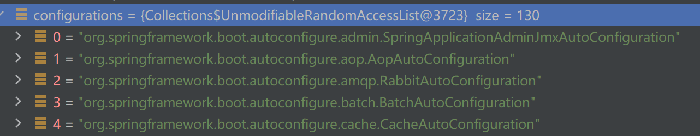 -->


```xml
文件里面写死了,SpringBoot一启动,就要给容器中加载的所有配置类
虽然这些场景的所有自动配置启动的时候默认全部加载,但是xxxxAutoConfiguration按照条件装配规则(@Conditional),最终会按需配置
```

#### 自动配置流程

以 `DispatcherServletAutoConfiguration`的内部类 `DispatcherServletConfiguration`为例子:

```java
@Bean
@ConditionalOnBean(MultipartResolver.class)  //容器中有这个类型组件
@ConditionalOnMissingBean(name = DispatcherServlet.MULTIPART_RESOLVER_BEAN_NAME) //容器中没有这个名字 multipartResolver 的组件
public MultipartResolver multipartResolver(MultipartResolver resolver) {
	//给@Bean标注的方法传入了对象参数，这个参数的值就会从容器中找。
	//SpringMVC multipartResolver。防止有些用户配置的文件上传解析器不符合规范
	// Detect if the user has created a MultipartResolver but named it incorrectly
	return resolver;//给容器中加入了文件上传解析器；
}
```

SpringBoot默认会在底层配好所有的组件，但是**如果用户自己配置了以用户的优先**。

**总结**：

- SpringBoot先加载所有的自动配置类  xxxxxAutoConfiguration
- 每个自动配置类按照条件进行生效，默认都会绑定配置文件指定的值。（xxxxProperties里面读取，xxxProperties和配置文件进行了绑定）
- 生效的配置类就会给容器中装配很多组件
- 只要容器中有这些组件，相当于这些功能就有了
- 定制化配置
  - 用户直接自己@Bean替换底层的组件
  - 用户去看这个组件是获取的配置文件什么值就去修改。

**xxxxxAutoConfiguration ---> 组件 ---> xxxxProperties里面拿值  ----> application.properties**

#### 最佳实践

- 引入场景依赖
  - https://docs.spring.io/spring-boot/docs/2.4.13/reference/html/using-spring-boot.html#using-boot-starter
- 查看自动配置了哪些(选做)
  - 自己分析,引入场景对应的自动配置一般都生效
  - 在配置文件中写上:debug=true,此时运行项目,控制台会打印用到的配置类和没用到的配置类,Negative matches都是不生效的,Postive matches都是生效的配置
- 是否需要修改
  - 参照文档修改配置项
    - https://docs.spring.io/spring-boot/docs/2.4.13/reference/html/appendix-application-properties.html#common-application-properties
    - 自己分析,xxxxProperties绑定了配置文件的哪些
  - 自定义加入或者替换组件
    - @Bean,@Component
  - 自定义@Customizer
  - .....

### 开发小技巧

#### Lombok

简化JavaBean开发,之前浩南给我说这个了,当时是不会弄,没想到这里竟然会教

使用步骤:

1. 引入依赖:

```xml
        <dependency>
            <groupId>org.projectlombok</groupId>
            <artifactId>lombok</artifactId>
        </dependency>
```

2. 搜索安装lombok插件

<!-- 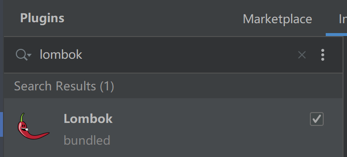 -->


3. 使用

```java
/**
 * 测试lombok
 */
@Data // get和set方法 ，但是其中也包括了toString方法
@ToString
@AllArgsConstructor//使用所有参数生成有参构造器
@NoArgsConstructor// 无参构造器
@EqualsAndHashCode
public class Lom {
    private String name;
    private Integer age;
}
```

使用以上的注解标识到bean类上就行了

**还有一个重要的使用是@Slf4j,然后可以在方法中直接log.info("请求进来了....");将内容写入到日志文件中**

#### dev.tools

依赖:

```xml
    <dependency>
        <groupId>org.springframework.boot</groupId>
        <artifactId>spring-boot-devtools</artifactId>
        <optional>true</optional>
    </dependency>
```

配置完,按ctrl+F9,可以实现重新编译项目
不过我说实话现阶段用处不大,而且这个好像很吃内存...

#### Spring Initailizr

项目初始化向导,这个玩意牛逼啊

<!-- 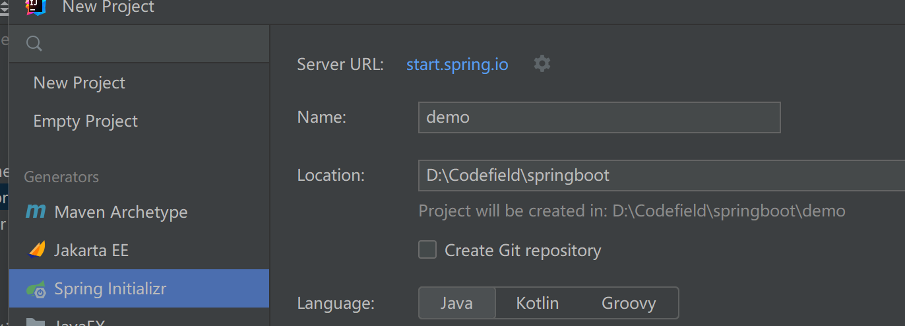 -->

在新建项目的地方选择Spring Initailizr,然后输入一些内容,项目就自动创建好了,里面的配置基本都是写好的


非常非常全:

<!-- 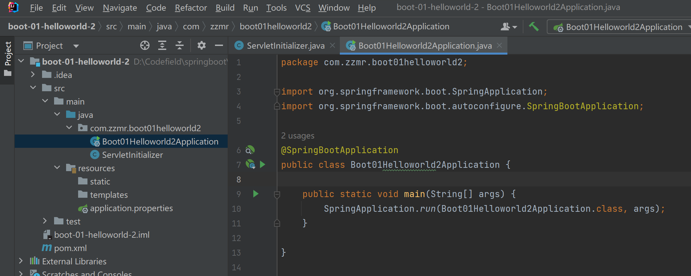 -->


不过要注意SpringBoot的版本,这个里面默认最低只有2.7了,不过可以创建好项目之后去pom里面更改

## 核心功能

### 配置文件-yaml

上次接触这个配置文件还是在博客里面,Hexo的大部分配置文件都是yaml

**基础语法**

- key: value; kv之间有空格
- 大小写敏感
- 使用缩进表示层级关系
- 缩进不允许使用tab,只允许空格
- 缩进的空格数不重要,只要相同层级的元素左对齐即可
- '#'表示注释
- "与""表示字符串内容,会被转义/不转义

示例:

```yml
person:
  userName: zhangsan
  boss: true
  birth: 2019/12/9
  age: 18
  #  interests: [篮球,足球]
  interests:
    - 篮球
    - 足球
  animal: [ 阿猫，阿狗 ]
  #  score:
  #    english: 80
  #    math: 89
  score: { english: 80,math: 90 }
  salary:
    - 9999.99
    - 9999.98
  pet:
    name: 阿狗
    weight: 99.99
  allPets:
    sick:
      - { name: 阿狗,weight: 99.99 }
      - name: 阿毛
        weight: 88.88
      - name: 阿虫
        weight: 77.77
    health:
      - { name: 阿yi,weight: 99.99 }
      - { name: 阿er,weight: 99.99 }
```

两个bean类

```java
Person.java
package com.zzmr.boot01helloworld2.bean;

import lombok.AllArgsConstructor;
import lombok.Data;
import lombok.NoArgsConstructor;
import org.springframework.boot.context.properties.ConfigurationProperties;
import org.springframework.stereotype.Component;

import java.util.Date;
import java.util.List;
import java.util.Map;
import java.util.Set;

@ConfigurationProperties(prefix = "person")
@Component
@Data
@AllArgsConstructor
@NoArgsConstructor
public class Person {
    private String userName;
    private Boolean boss;
    private Date birth;
    private Integer age;
    private Pet pet;
    private String[] interests;
    private List<String> animal;
    private Map<String, Object> score;
    private Set<Double> salary;
    private Map<String, List<Pet>> allPets;
}

Pet.java
package com.zzmr.boot01helloworld2.bean;

import lombok.AllArgsConstructor;
import lombok.Data;
import lombok.NoArgsConstructor;

@Data
@NoArgsConstructor
@AllArgsConstructor
public class Pet {
    private String name;
    private Double weight;
}

```

测试类:

```java
package com.zzmr.boot01helloworld2.controller;

import com.zzmr.boot01helloworld2.bean.Person;
import org.springframework.beans.factory.annotation.Autowired;
import org.springframework.web.bind.annotation.RequestMapping;
import org.springframework.web.bind.annotation.RestController;

@RestController
public class HelloController {

    @Autowired
    Person person;

    @RequestMapping("/person")
    public Person person(){
        return person;
    }

}
```

此时访问进行访问

<!-- 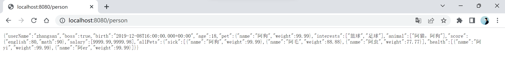 -->


以后都是推荐使用yaml进行配置了

**要注意的就是单引号和双引号的使用**
单引号会将\n作为字符串输出,  双引号会将\n作为换行输出
**双引号不会转义,单引号会转义,转义是什么?是表示原来的字面意思**
或者说**单引号会输出普通字符串,而双引号会输出它原本的意思**

但是你有没有发现,直接在yml里面写自己配的bean的时候,是没有任何提示的,要想有提示怎么办?
加上这个依赖:

```xml
        <dependency>
            <groupId>org.springframework.boot</groupId>
            <artifactId>spring-boot-configuration-processor</artifactId>
            <optional>true</optional>
        </dependency>
```

然后重启项目

但是要注意的一点是,默认打包时会把spring-boot-configuration-processor也打入到包中,但是这个依赖只是编写项目时要用的,项目在实际运行时是不需要的,所以可以用这个插件,在打包时不将spring-boot-configuration-processor打进包里,让其只在编码的时候有用

```xml
<build>
    <plugins>
        <plugin>
            <groupId>org.springframework.boot</groupId>
            <artifactId>spring-boot-maven-plugin</artifactId>
            <configuration>
                <excludes>
                    <exclude>
                        <groupId>org.springframework.boot</groupId>
                        <artifactId>spring-boot-configuration-processor</artifactId>
                    </exclude>
                </excludes>
            </configuration>
        </plugin>
    </plugins>
</build>
```

但是我现在这个版本的SpringBoot(2.4.3),好像不配置也不会将spring-boot-configuration-processor打包进去,当才去看没找到
好像2.4.2就解决了

### Web开发

进入正题?
[点击查看Web开发官方文档](https://docs.spring.io/spring-boot/docs/2.4.13/reference/html/spring-boot-features.html#boot-features-spring-mvc)

### 简单功能分析

#### 静态资源访问

还是先创建项目,咱们试试直接用2.7.6?也就是默认最低的哪个版本?
试试吧,可能会向下兼容
静态资源官方文档[Static Content](https://docs.spring.io/spring-boot/docs/2.4.13/reference/html/spring-boot-features.html#boot-features-spring-mvc-static-content)

**静态资源目录:**
类路径下:called /static (or /public or /resources or /META-INF/resources)
此时,创建这些路径,然后在里面放上静态资源(图片)作为测试

<!-- 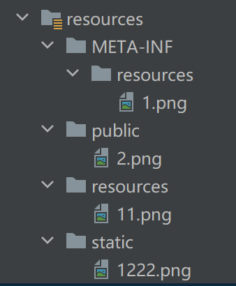 -->


此时直接在浏览器能访问到的(根路径/+静态资源名)

<!-- 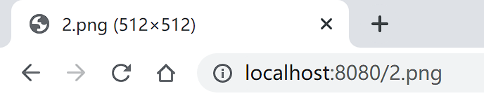 -->


**原理: 静态映射/\*\***,请求进来,先去找Controller,看能不能处理,如果能处理,就由Controller处理,如果不能处理,又会交给静态资源处理,静态资源就回去上面那几个目录寻找资源,如果静态资源也找不到,就会报404

#### 静态资源访问前缀

以后的开发对于访问静态资源都会用到访问前缀
需要在yml中配置

```yml
spring:
  mvc:
    static-path-pattern: /res/**
```

当前项目+static-path-pattern+静态资源名=回去静态资源文件夹下找

<!-- 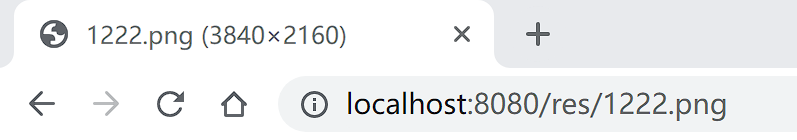 -->


**静态资源的默认路径也是可以改的**
但是我感觉没必要,至少现在没必要

#### 欢迎页支持和favicon网页图标

- 静态资源路径下 index.html
  - 可以配置静态资源路径
  - 但是不可以配置静态资源的访问前缀,否则导致index.html不能被默认访问
    直接将index.html放入static下面,然后浏览器访问localhost:8080/就可以访问到index.html

<!-- 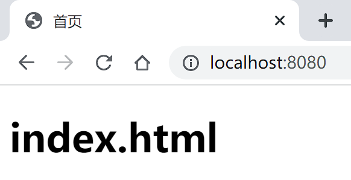 -->


- 编写一个cntroller能处理/index

**favicon网页图标**
直接将一个叫favicon.ico的图片放到static目录下即可
这功能用处不大吧...

#### 静态资源配置原理

- SpringBoot启动默认加载xxxAutoConfiguration类(自动配置类)
- SpringMVC功能的自动配置类 WebMvcAutoConfiguration生效

```java
@AutoConfiguration(after = { DispatcherServletAutoConfiguration.class, TaskExecutionAutoConfiguration.class,
		ValidationAutoConfiguration.class })
@ConditionalOnWebApplication(type = Type.SERVLET)
@ConditionalOnClass({ Servlet.class, DispatcherServlet.class, WebMvcConfigurer.class })
@ConditionalOnMissingBean(WebMvcConfigurationSupport.class)
@AutoConfigureOrder(Ordered.HIGHEST_PRECEDENCE + 10)
public class WebMvcAutoConfiguration {}
```

- 给容器中配置了什么

```java
	@Configuration(proxyBeanMethods = false)
	@Import(EnableWebMvcConfiguration.class)
	@EnableConfigurationProperties({ WebMvcProperties.class, WebProperties.class })
	@Order(0)
	public static class WebMvcAutoConfigurationAdapter implements WebMvcConfigurer, ServletContextAware {}
```

- 配置文件的相关属性和xxx进行了绑定,WebMvcProperties==spring.mvc,WebProperties==spring.web(这里又和老师讲的不太一样了,这里的WebProperties代替了之前的ResrouceProperties,spring.web也代替了spring.resources)

> 配置类只有一个有参构造器

```java
        //有参构造器所有参数的值都会从容器中确定
		public WebMvcAutoConfigurationAdapter(WebProperties webProperties, WebMvcProperties mvcProperties,
				ListableBeanFactory beanFactory, ObjectProvider<HttpMessageConverters> messageConvertersProvider,
				ObjectProvider<ResourceHandlerRegistrationCustomizer> resourceHandlerRegistrationCustomizerProvider,
				ObjectProvider<DispatcherServletPath> dispatcherServletPath,
				ObjectProvider<ServletRegistrationBean<?>> servletRegistrations) {
			this.resourceProperties = webProperties.getResources();
			this.mvcProperties = mvcProperties;
			this.beanFactory = beanFactory;
			this.messageConvertersProvider = messageConvertersProvider;
			this.resourceHandlerRegistrationCustomizer = resourceHandlerRegistrationCustomizerProvider.getIfAvailable();
			this.dispatcherServletPath = dispatcherServletPath;
			this.servletRegistrations = servletRegistrations;
			this.mvcProperties.checkConfiguration();
		}
```

**资源处理的默认规则**

```java
...
public class WebMvcAutoConfiguration {
    ...
	public static class EnableWebMvcConfiguration extends DelegatingWebMvcConfiguration implements ResourceLoaderAware {
        ...
		@Override
		protected void addResourceHandlers(ResourceHandlerRegistry registry) {
			super.addResourceHandlers(registry);
			if (!this.resourceProperties.isAddMappings()) {
				logger.debug("Default resource handling disabled");
				return;
			}
			ServletContext servletContext = getServletContext();
			addResourceHandler(registry, "/webjars/**", "classpath:/META-INF/resources/webjars/");
			addResourceHandler(registry, this.mvcProperties.getStaticPathPattern(), (registration) -> {
				registration.addResourceLocations(this.resourceProperties.getStaticLocations());
				if (servletContext != null) {
					registration.addResourceLocations(new ServletContextResource(servletContext, SERVLET_LOCATION));
				}
			});
		}
        ...
  
    }
    ...
}
```

可以配置禁止所有静态资源规则

```yml
spring:
  web:
    resources:
      add-mappings: false
```

新版的要在web下,老版的还是

```yaml
spring:
  resources:  
    add-mappings: false   #禁用所有静态资源规则
```

### 请求参数处理

#### 请求映射

- @xxxMapping
- Rest风格支持(使用Http请求方式动词来表示对资源的操作,这个在mvc里已经学过了,就是查询GET,修改PUT,删除DELETE,添加POST,然后请求的路径都是/user)

但是需要手动开启

```yml
spring:
  mvc:
    hiddenmethod:
      filter:
        enabled: true
```

**简单测试**

```html

<form action="/user" method="get">
    <input value="REST-GET" type="submit">
</form>

<form action="/user" method="post">
    <input value="REST-POST" type="submit">
</form>

<form action="/user" method="post">
    <input type="hidden" name="_method" value="PUT">
    <input value="REST-PUT" type="submit">
</form>

<form action="/user" method="post">
    <input type="hidden" name="_method" value="DELETE">
    <input value="REST-DELETE" type="submit">
</form>
```

控制器方法

```java
 @GetMapping("/user")
//@RequestMapping(value = "/user",method = RequestMethod.GET)
    public String getUser(){
        return "GET-张三";
    }

    @PostMapping("/user")
//@RequestMapping(value = "/user",method = RequestMethod.POST)
    public String saveUser(){
        return "POST-张三";
    }

    @PutMapping("/user")
//@RequestMapping(value = "/user",method = RequestMethod.PUT)
    public String putUser(){
        return "PUT-张三";
    }

    @DeleteMapping("/user")
//@RequestMapping(value = "/user",method = RequestMethod.DELETE)
    public String deleteUser(){
        return "DELETE-张三";
    }
```

此时就可以使用REST风格了
那原理又是什么?

- 表单提交会带上_method=PUT(DELETE)
- 请求过来被HiddenHttpMethodFilter拦截
  - 请求是否正常,是否为post请求
    - 获取到_method的值(其中是PUT或者是DELETE)
    - 兼容PUT,DELETE,和PATCH(这个没学过)
    - 原生request(post),一个包装模式requestWrapper重写了getMethod方法,返回的是传入的值
    - 过滤器链放行的时候用wrapper,以后的方法调用getMethod是调用的requestWrapper的
      其实就是过滤POST请求,然后判断是哪个请求,然后返回
      **REST使用客户端工具**
      比如使用POSTMAN直接发送PUT请求,这时就不会走上面的流程(**无需Filter**),而是直接就发送过来PUT或者DELETE了
      话说我还没用过POSTMAN,下一个看看吧
      下了,也注册了,用的google邮箱注册的

> 改变默认的_method
> 说实话为什么改这个?

不过要改的话也很简单:

```java
package com.zzmr.boot.config;

import org.springframework.context.annotation.Bean;
import org.springframework.context.annotation.Configuration;
import org.springframework.web.filter.HiddenHttpMethodFilter;

@Configuration(proxyBeanMethods = false)
public class WebConfig {

    @Bean
    public HiddenHttpMethodFilter hiddenHttpMethodFilter(){
        HiddenHttpMethodFilter hiddenHttpMethodFilter = new HiddenHttpMethodFilter();
        hiddenHttpMethodFilter.setMethodParam("_m");
        return hiddenHttpMethodFilter;
    }

}
```

创建这个配置类就行了,然后在setMethodParam()里面写上自定义的名字

##### 请求映射原理

<!-- 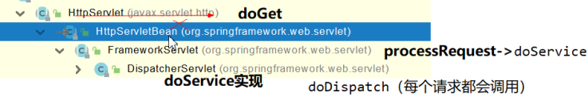 -->


SpringMVC功能分析都从org.springframework.web.servlet.DispatcherServlet->doDispatch()

```java
protected void doDispatch(HttpServletRequest request, HttpServletResponse response) throws Exception {
		HttpServletRequest processedRequest = request;
		HandlerExecutionChain mappedHandler = null;
		boolean multipartRequestParsed = false;

		WebAsyncManager asyncManager = WebAsyncUtils.getAsyncManager(request);

		try {
			ModelAndView mv = null;
			Exception dispatchException = null;

			try {
				processedRequest = checkMultipart(request);
				multipartRequestParsed = (processedRequest != request);

                // 找到当前请求使用哪个Handler(Controller的方法)处理
				// Determine handler for the current request.
				mappedHandler = getHandler(processedRequest);
...
```

进入getHandler方法,会先获取所有的HandlerMapping(处理器映射)

<!-- 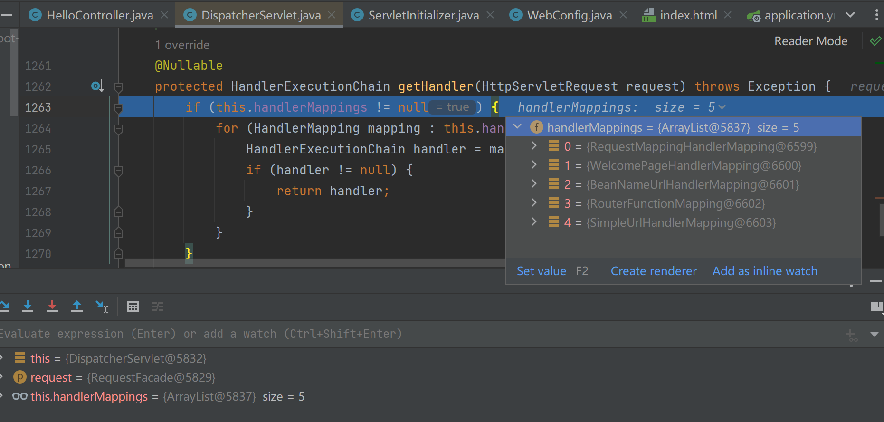 -->


一共五个
RequestMappingHandlerMapping: 保存了所有@RequestMapping和handler的映射规则(项目一启动,就会扫描controller然后保存控制器方法)
看,在执行增强for循环时,第一个就是RequestMappingHandlerMapping,然后打开mapping

<!-- 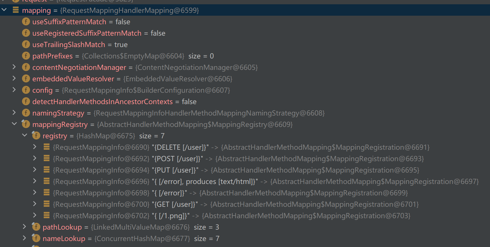 -->


**就会发现所有的控制器方法都在里面**
一步步进入

<!-- 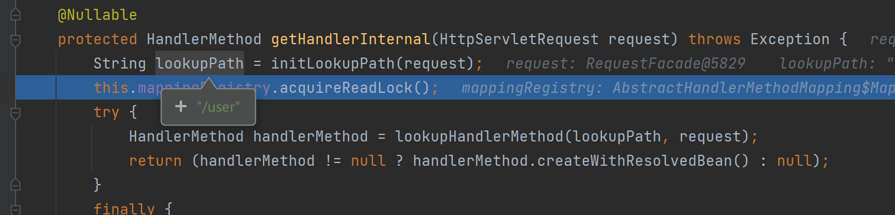 -->


先根据url找,会找到四个

<!-- 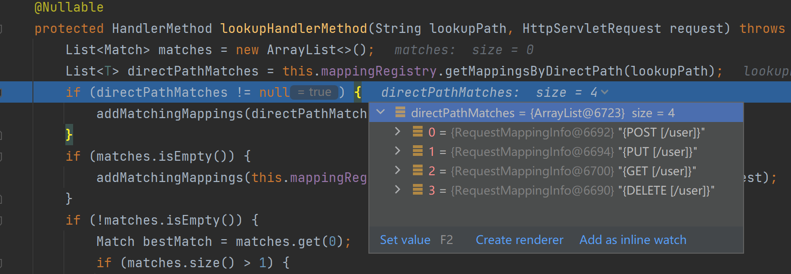 -->


找出最合适的

<!-- 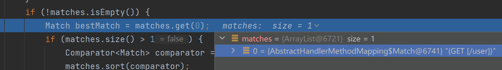 -->


总结就是所有的请求映射都在HandlerMapping中

- SpringBoot自动配置欢迎页的HandlerMapping,访问/能访问到index.html
- SpringBoot自动配置了默认的RequestMappingHandlerMapping
- 请求进来,挨个尝试所有的HandlerMapping看是否有请求信息
  - 如果有就找到这个请求对应的handler
  - 如果没有就是下一个HandlerMapping
- 我们需要一些自定义的映射处理,我们也可以自己给容器中放HandlerMapping,自定义HandlerMapping

hahahha
看了好几集，一点笔记都没有写，一会一块写吧

#### 各种注解

```java
package com.zzmr.boot.controller;

import org.springframework.web.bind.annotation.*;

import javax.servlet.http.Cookie;
import java.util.HashMap;
import java.util.List;
import java.util.Map;

@RestController
public class ParameterTestController {

    @GetMapping("/car/{id}/owner/{username}")
    public Map<String, Object> getCar(@PathVariable("id") Integer id,
                                      @PathVariable("username") String name,
                                      @PathVariable Map<String, String> pv,
                                      @RequestHeader("User-Agent") String userAgent,
                                      @RequestHeader Map<String, String> header,
                                      @RequestParam("age") Integer age,
                                      @RequestParam("inters") List<String> inters,
                                      @RequestParam Map<String, String> params,
                                      @CookieValue("Idea-6d070b92") String cookie,
                                      @CookieValue("Idea-6d070b92") Cookie cookie1) {
        Map<String, Object> map = new HashMap<>();
/*        map.put("id", id);
        map.put("name", name);
        map.put("pv", pv);
        map.put("useAgent", userAgent);
        map.put("headers", header);*/

        map.put("age", age);
        map.put("inters", inters);
        map.put("params", params);
        map.put("cookie", cookie);
        System.out.println(cookie1.getName() + "====" + cookie1.getValue());
        return map;
    }


    @PostMapping("/save")
    public Map postMethod(@RequestBody String content) {
        Map<String, Object> map = new HashMap<>();
        map.put("content", content);
        return map;
    }


    // /cars/sell;low=34;brand=byd,audi,yd
    // SpringBoot是默认禁用掉了矩阵变量的功能
    // 手动开启： 原理：对于路径的处理，UrlPathHelper进行解析
    // removeSemicolonContent（移除分号内容）支持矩阵变量
    @GetMapping("/cars/sell")
    public Map carsSell(@MatrixVariable("low") Integer low,
                        @MatrixVariable("brand") List<String> brand) {
        Map<String, Object> map = new HashMap<>();
        map.put("low",low);
        map.put("brand",brand);
        return map;
    }

}
```

看看就好,毕竟之前学mvc都已经讲过了
主要就是@PathVariable
@RequestHeader
@RequestParam这些注解不加参数,是会默认获取所有内容的,所以还是要注意以下
至于下面的矩阵变量,我这边连测试都不成功
就不尝试了

开启矩阵变量的两种方法

1. 用配置类实现WebMvcConfigurer接口,然后重写configurePathMatch方法

```java
package com.zzmr.boot.config;

import org.springframework.context.annotation.Bean;
import org.springframework.context.annotation.Configuration;
import org.springframework.web.filter.HiddenHttpMethodFilter;
import org.springframework.web.servlet.config.annotation.PathMatchConfigurer;
import org.springframework.web.servlet.config.annotation.WebMvcConfigurer;
import org.springframework.web.util.UrlPathHelper;

@Configuration(proxyBeanMethods = false)
public class WebConfig implements WebMvcConfigurer {
    @Override
    public void configurePathMatch(PathMatchConfigurer configurer) {
        UrlPathHelper urlPathHelper = new UrlPathHelper();
        // set为false，矩阵变量才能生效
        urlPathHelper.setRemoveSemicolonContent(false);
        configurer.setUrlPathHelper(urlPathHelper);
    }
}
```

2. 直接写一个WebMvcConfigurer方法

```java
package com.zzmr.boot.config;

import org.springframework.context.annotation.Bean;
import org.springframework.context.annotation.Configuration;
import org.springframework.web.filter.HiddenHttpMethodFilter;
import org.springframework.web.servlet.config.annotation.PathMatchConfigurer;
import org.springframework.web.servlet.config.annotation.WebMvcConfigurer;
import org.springframework.web.util.UrlPathHelper;

@Configuration(proxyBeanMethods = false)
public class WebConfig {


    @Bean
    public WebMvcConfigurer webMvcConfigurer(){
        return new WebMvcConfigurer() {
            @Override
            public void configurePathMatch(PathMatchConfigurer configurer) {
                UrlPathHelper urlPathHelper = new UrlPathHelper();
                urlPathHelper.setRemoveSemicolonContent(false);
                configurer.setUrlPathHelper(urlPathHelper);
            }
        };
    }
}
```

#### 请求处理-源码分析

没看错吧,32-42全是源码分析
这不把人看死了
怎么办,先看看评论吧
看吧,反正这个源码早晚都要看,不如先看一遍,然后等到后面需要加深理解,就再来看一遍

- HandlerMapping中找到能处理请求的Handler(Controller.method)
- 为当前Handler找一个适配器HandlerAdapter: RequestMappingHandlerAdapter

**HandlerAdapter**

<!-- 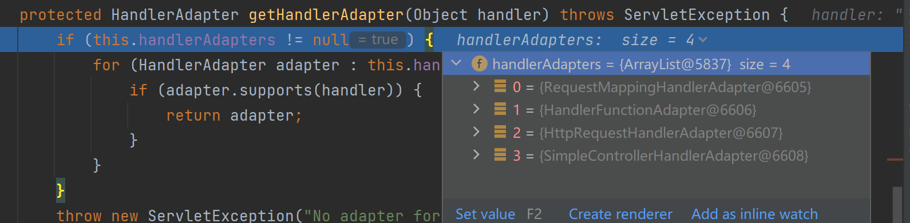 -->


0. 支持方法上标注@RequestMapping

1. 支持函数式编程
   xxxxx

**执行目标方法**

```java
	// Actually invoke the handler.
    // DispatcherServlet-doDispatch
	mv = ha.handle(processedRequest, response, mappedHandler.getHandler());
```

怎么执行的呢

```java
			mav = invokeHandlerMethod(request, response, handlerMethod); //执行目标方法


            //ServletinvocableHandlerMethod
            Object returnValue = invokeForRequest(webRequest, mavController,provideArgs);
            // 会跳转到写的控制器方法执行
            // 获取方法的参数值
            Object[] args = getMethodArgumentValues(request,mavContainer,providedArgs)
```

**参数解析器**-确定将要执行的目标方法的每一个参数的值是什么

SpringMVC目标方法能写多少种参数类型,取决于参数解析器

* 当前解析器是否支持解析这种参数
* 支持就调用resolveArgument

<!-- 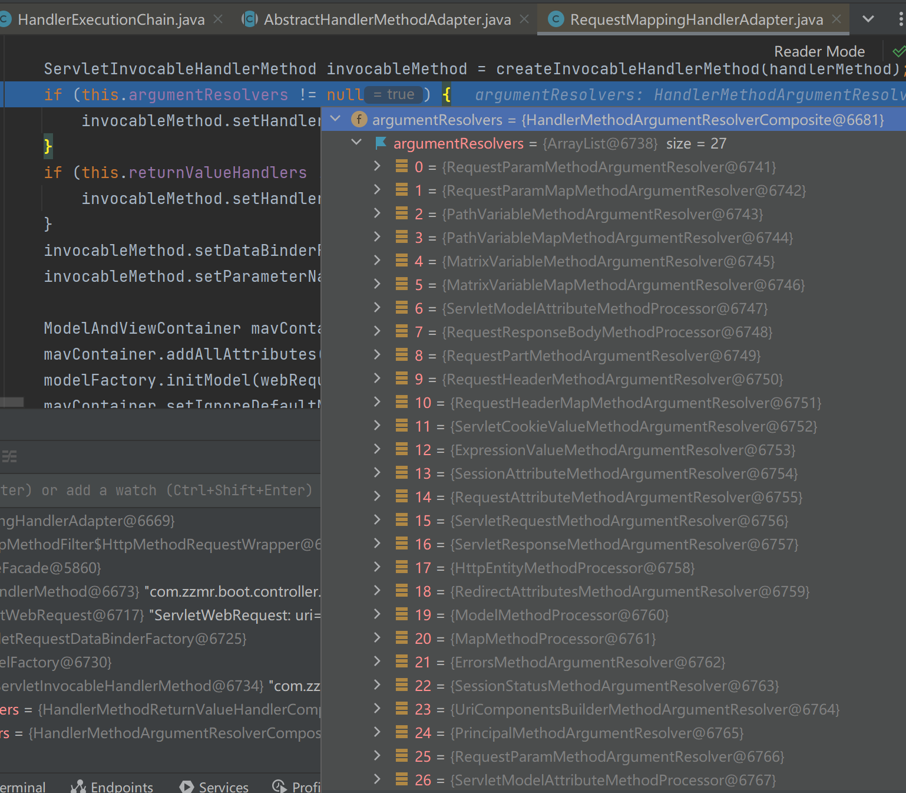 -->


这个可执行的方法,就是目标方法

<!-- 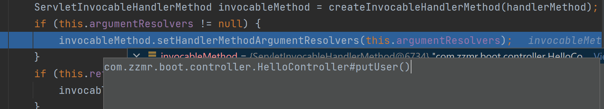 -->


**如何确定目标方法每一个参数的值**

```java

=======InvocableHandlerMethod.java======

protected Object[] getMethodArgumentValues(NativeWebRequest request, @Nullable ModelAndViewContainer mavContainer,
			Object... providedArgs) throws Exception {

		MethodParameter[] parameters = getMethodParameters();
		if (ObjectUtils.isEmpty(parameters)) {
			return EMPTY_ARGS;
		}

		Object[] args = new Object[parameters.length];
		for (int i = 0; i < parameters.length; i++) {
			MethodParameter parameter = parameters[i];
			parameter.initParameterNameDiscovery(this.parameterNameDiscoverer);
			args[i] = findProvidedArgument(parameter, providedArgs);
			if (args[i] != null) {
				continue;
			}
			if (!this.resolvers.supportsParameter(parameter)) {
				throw new IllegalStateException(formatArgumentError(parameter, "No suitable resolver"));
			}
			try {
				args[i] = this.resolvers.resolveArgument(parameter, mavContainer, request, this.dataBinderFactory);
			}
			catch (Exception ex) {
				// Leave stack trace for later, exception may actually be resolved and handled...
				if (logger.isDebugEnabled()) {
					String exMsg = ex.getMessage();
					if (exMsg != null && !exMsg.contains(parameter.getExecutable().toGenericString())) {
						logger.debug(formatArgumentError(parameter, exMsg));
					}
				}
				throw ex;
			}
		}
		return args;
	}
```

**挨个判断所有参数解析器哪个支持解析这个参数**
听的是个鸡巴
听得一愣一愣的

**不听了,直接跳吧,跳到42集,这32-42就等我看完后面的再重新看**

## 视图解析与模板引擎

### Thymeleaf

又是Thymeleaf,这次能深入了解一下了吧
之前mvc都是看看怎么用
并没有系统的学这个东西,但是我感觉这个视频也不会深入讲这个东西,可能也只是教怎么用

命名空间:
xmlns:th="http://www.thymeleaf.org"

先看看吧
首先引入依赖

```xml
        <dependency>
            <groupId>org.springframework.boot</groupId>
            <artifactId>spring-boot-starter-thymeleaf</artifactId>
        </dependency>
```

thymeleaf已经自动配置好了

```java
@AutoConfiguration(after = { WebMvcAutoConfiguration.class, WebFluxAutoConfiguration.class })
@EnableConfigurationProperties(ThymeleafProperties.class)
@ConditionalOnClass({ TemplateMode.class, SpringTemplateEngine.class })
@Import({ TemplateEngineConfigurations.ReactiveTemplateEngineConfiguration.class,
		TemplateEngineConfigurations.DefaultTemplateEngineConfiguration.class })
public class ThymeleafAutoConfiguration {}
```

自动配好的策略

1. 所有的thymeleaf的配置值都在ThymeleafProperties
2. 配置好了**SpringTemplateEngine**
3. 配好了ThymeleafViewResolver
4. 我们只需要直接开发页面

```java
    public static final String DEFAULT_PREFIX = "classpath:/templates/";

	public static final String DEFAULT_SUFFIX = ".html";
```

使用上应该没什么难的,毕竟之前mvc都用了一些了
现在问题就是,源码那部分没看,会不会影响后面的学习?
看评论说好像没啥事
那就先继续看吧

### Web实验-后台管理系统

离谱,SpringBoot版本现在最低已经变成2.7.7了

现在在干什么?
只是把那个前端的页面跟后端实现交互,写一些控制层啥的
没什么重要的

感觉这块笔记的话也没什么写的

要是想看直接去项目里面看吧

下面看原理

#### 视图解析原理流程

1. 目标方法处理过程中,所有数据都会被放在ModelAndViewContainer里面,包括数据和视图地址
2. **方法的参数是一个自定义类型对象(从参数中确定的)**,把他重新放在ModelAndViewContainer中
3. 任何目标方法执行完成以后都会返回ModelAndView(数据和视图地址)
4. processDispatchResult处理派发结果(决定页面如何响应)
   1. render(mv,request,response);进行页面渲染
      1. 根据方法的String返回值得到View对象(定义了页面的渲染逻辑)

         1. 所有的视图解析器尝试是否能够根据当前返回值得到View对象
         2. 得到了redirect:main.html---->Thymeleaf new RedirectView()
         3. ContentNegotiationViewResolver里面包含了下面所有的视图解析器,内部还是利用下面所有的视图解析器得到视图对象
         4. view.render(mv.getModelInternal(),request,response); 视图对象调用自定义的render进行页面渲染工作
            - RedirectView如何渲染(重定向到一个页面)
              1. 获取目标url地址
              2. response.sendRedirect(encodedURL);

         <!-- 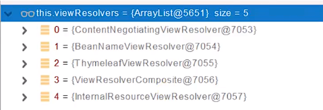 -->

         

总结:
视图解析

- 返回值以forward开始: new InternalResourceView(forwardUrl);-->转发 request.getRequestDispatcher(path).forward(request,response);
- 返回值以redirect开始: new RedirectView();---->render就是重定向
- 返回值是普通字符串 new ThymeleafView()--->

也可以自定义视图解析器+自定义视图

## 拦截器

### Handlerinterceptor接口

这都是之前mvc里学过的内容了

看看代码吧

**拦截器:**

```java
package com.zzmr.admin.interceptor;

import lombok.extern.slf4j.Slf4j;
import org.springframework.web.method.HandlerMethod;
import org.springframework.web.servlet.HandlerInterceptor;
import org.springframework.web.servlet.ModelAndView;

import javax.servlet.http.HttpServletRequest;
import javax.servlet.http.HttpServletResponse;
import javax.servlet.http.HttpSession;

/**
 * 拦截器：做登录检查
 * 1. 配置好拦截器要拦截哪些请求
 * 2. 把这些配置放在容器中
 *
 */
@Slf4j
public class LoginInterceptor implements HandlerInterceptor {
    /**
     * 目标犯法执行之前
     * @param request current HTTP request
     * @param response current HTTP response
     * @param handler chosen handler to execute, for type and/or instance evaluation
     * @return
     * @throws Exception
     */
    @Override
    public boolean preHandle(HttpServletRequest request, HttpServletResponse response, Object handler) throws Exception {

        String requestURI = request.getRequestURI();
        log.info("拦截的请求路径是{}",requestURI);

        // 登陆检查
        HttpSession session = request.getSession();
        Object loginUser = session.getAttribute("loginUser");
        if (loginUser!=null){
            return true;
        }
        // 拦截住了，表示未登录，跳转到登录页面
        request.setAttribute("msg","请先登录");
        request.getRequestDispatcher("/").forward(request,response);
        return false;
    }

    /**
     * 目标方法执行之后
     * @param request current HTTP request
     * @param response current HTTP response
     * @param handler the handler (or {@link HandlerMethod}) that started asynchronous
     * execution, for type and/or instance examination
     * @param modelAndView the {@code ModelAndView} that the handler returned
     * (can also be {@code null})
     * @throws Exception
     */
    @Override
    public void postHandle(HttpServletRequest request, HttpServletResponse response, Object handler, ModelAndView modelAndView) throws Exception {
        HandlerInterceptor.super.postHandle(request, response, handler, modelAndView);
    }

    /**
     * 页面渲染完成之后
     * @param request current HTTP request
     * @param response current HTTP response
     * @param handler the handler (or {@link HandlerMethod}) that started asynchronous
     * execution, for type and/or instance examination
     * @param ex any exception thrown on handler execution, if any; this does not
     * include exceptions that have been handled through an exception resolver
     * @throws Exception
     */
    @Override
    public void afterCompletion(HttpServletRequest request, HttpServletResponse response, Object handler, Exception ex) throws Exception {
        HandlerInterceptor.super.afterCompletion(request, response, handler, ex);
    }
}
```

将拦截器注册到容器中:

```java
package com.zzmr.admin.config;


import com.zzmr.admin.interceptor.LoginInterceptor;
import org.springframework.context.annotation.Configuration;
import org.springframework.web.servlet.config.annotation.InterceptorRegistry;
import org.springframework.web.servlet.config.annotation.WebMvcConfigurer;

@Configuration
public class AdminWebConfig implements WebMvcConfigurer {

    /**
     * 1. 编写一个拦截器实现HandlerInterceptor接口
     * 2. 拦截器注册到容器中（实现WebMvcConfigurer）
     * 指定拦截规则，要放行静态资源的访问
     */

    @Override
    public void addInterceptors(InterceptorRegistry registry) {
        registry.addInterceptor(new LoginInterceptor())
                .addPathPatterns("/**") // 所有的请求都被拦截，包括静态资源的访问
                //第一种办法，把所有静态资源的访问路径（前目录）都加到exclude里面
                .excludePathPatterns("/", "/login","/css/**","/fonts/**","/images/**","/js/**");
    }
}
```

要注意静态资源的放行

### 拦截器原理

1. 根据当前请求,找到HandlerExecutionChain可以处理请求的handler以及handler的所有拦截器
2. 先来顺序执行 所有拦截器preHandle方法
   1. 如果当前拦截器preHandler返回为true,则执行下一个拦截器的preHandle
   2. 如果当前拦截器返回为false,直接 倒叙执行所有已执行了preHandle()的拦截器的afterCompletion();
3. 如果任何一个拦截器返回false,直接跳出不执行目标方法
4. 所有拦截器都返回True,执行目标方法
5. 倒叙执行所有拦截器的postHandle方法
6. 前面的步骤有任何异常都会直接触发afterCompletion
7. 页面成功渲染完成以后,也会倒叙触发afterCompletion

<!-- 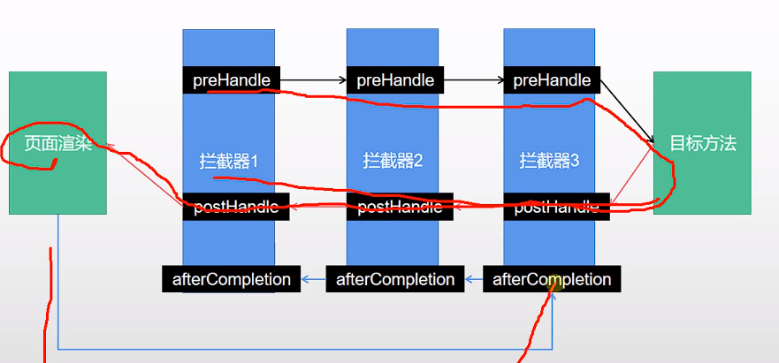 -->


## 文件上传

### 文件上传实现

如何接受表单中的提交的文件?
直接用@RequestPart()注解,然后用MultipartFile或者MultipartFile[] 来接收即可
然后复制文件到某个地方的话,用transferTo()方法,在里面new上一个File就可以了

```java
package com.zzmr.admin.controller;

import lombok.extern.slf4j.Slf4j;
import org.springframework.stereotype.Controller;
import org.springframework.web.bind.annotation.*;
import org.springframework.web.multipart.MultipartFile;

import java.io.File;
import java.io.IOException;

/**
 * 文件上传测试
 */
@Controller
@Slf4j
public class FormTestController {

    @GetMapping("/form_layouts")
    public String form_layouts() {
        return "form/form_layouts";
    }


    /**
     * 自动封装上传的文件
     *
     * @param email
     * @param username
     * @param headImg
     * @param photos
     * @return
     */
    @PostMapping("/upload")
    public String upload(@RequestParam("email") String email,
                         @RequestParam("username") String username,
                         @RequestPart("headerImg") MultipartFile headImg,
                         @RequestPart("photos") MultipartFile[] photos) throws IOException {

        log.info("上传的信息：email={},username={},headerImg={},photos={}",
                email, username, headImg.getSize(), photos.length);


        if (!headImg.isEmpty()) {
            //不为空，保存到文件服务器，OSS服务器，这里简单来写，直接存到项目的目录里
            String originalFilename = headImg.getOriginalFilename();
            headImg.transferTo(
                    new File("D:\\Codefield\\springboot\\boot-05-web-admin\\src\\main\\resources\\file\\avatar\\" + originalFilename));
        }

        if (photos.length > 0) {
            for (MultipartFile photo : photos) {
                if (!photo.isEmpty()) {
                    String originalFilename = photo.getOriginalFilename();
                    photo.transferTo(new File("D:\\Codefield\\springboot\\boot-05-web-admin\\src\\main\\resources\\file\\lifePhoto\\" + originalFilename));
                }
            }
        }
        return "main";
    }

}
```

```html
<form role="form" th:action="@{/upload}" method="post" enctype="multipart/form-data">
                            <div class="form-group">
                                <label for="exampleInputEmail1">邮箱label>
                                <input type="email" name="email" class="form-control" id="exampleInputEmail1" placeholder="Enter email">
                            </div>
                            <div class="form-group">
                                <label for="exampleInputPassword1">名字</label>
                                <input type="text" name="username" class="form-control" id="exampleInputPassword1" placeholder="Password">
                            </div>
                            <div class="form-group">
                                <label for="exampleInputFile">头像</label>
                                <input type="file" name="headerImg" id="exampleInputFile">
                            </div>
                            <div class="form-group">
                                <label for="exampleInputFile">生活照</label>
                                <input type="file" name="photos" multiple>
                            </div>
                            <div class="checkbox">
                                <label>
                                    <input type="checkbox"> Check me out
                                </label>
                            </div>
                            <button type="submit" class="btn btn-primary">Submit</button>
                        </form>
```

**整体还是很简单的,需要注意的就是在多文件上传的地方:``<input type="file" name="photos" multiple>``,要用multiple来表示**

### 文件上传原理

文件上传的自动配置使用了MultipartAutoConfiguration--MultipartProperties

```java
@ConfigurationProperties(prefix = "spring.servlet.multipart", ignoreUnknownFields = false)
public class MultipartProperties {}
```

也可以看出,在配置文件中更改spring.servlet.multipart就可以更改文件上传的一些参数,比如文件上传的最大的大小

- 自动配置好了**StandardServletMultipartResolver** [文件上传解析器]
- 原理步骤

  1. 请求进来使用文件上传解析器判断(isMultipart)并封装(resolveMultipart)(返回MultipartHttpServletRequest)文件上传请求

  <!-- 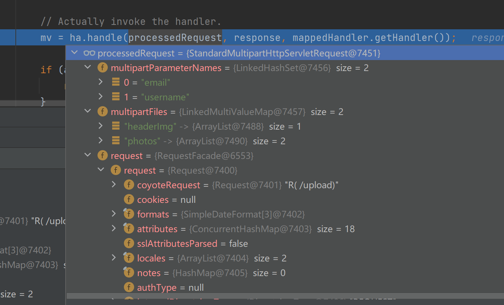 -->

  
  2. 参数解析器来解析请求中的文件内容,封装成MultipartFile
  3. 将request中文件信息封装为一个Map

**FileCopyUtils 实现文件流的拷贝**
    `<!--  -->`
    

## 异常处理

### 异常处理实现

**默认规则**：

- 默认情况下，Spring Boot提供 `/error`处理所有错误的映射
- 机器客户端，它将生成JSON响应，其中包含错误，HTTP状态和异常消息的详细信息。对于浏览器客户端，响应一个“ whitelabel”错误视图(就是那个Whitelabel Error Page页面)，以HTML格式呈现相同的数据
  *机器客户端,比如postman*

```json
{
    "timestamp": "2022-12-24T11:53:47.024+00:00",
    "status": 404,
    "error": "Not Found",
    "message": "No message available",
    "path": "/jkhjkghjk"
}
```

- 要对其进行自定义，添加 `View`解析为 `error`
- 要完全替换默认行为，可以实现 `ErrorController `并注册该类型的Bean定义，或添加 `ErrorAttributes类型的组件`以使用现有机制但替换其内容。
- `/templates/error/`下的4xx，5xx页面会被自动解析

<!-- 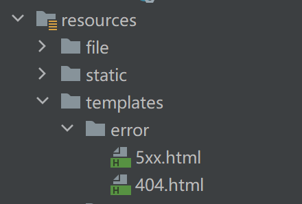 -->


**这时所有的404和5xx都有自定义的页面了**

而且可以给这些页面回写数据
比如在5xx页面中

```html
        <section class="error-wrapper text-center">
            <h1></h1>
            <h2>OOOPS!!!</h2>
            <h3 th:text="${message}">Something went wrong.</h3>
            <p class="nrml-txt" th:text="${trace}">Why not try refreshing you page? Or you can <a href="#">contact our support</a> if the problem persists.</p>
            <a class="back-btn" th:href="@{/main.html}"> Back To Home</a>
        </section>
```

这时可以收到json中的信息,用于回写

<!-- 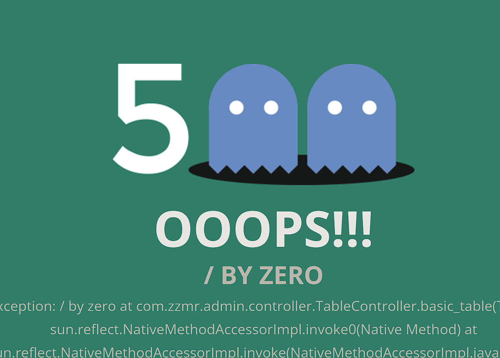 -->


### 异常处理原理

1. 自动配置
   有没有发现,这个异常处理甚至什么都不用写,把页面放进去就行了,这是怎么配置的?

- **ErrorMvcAutoConfiguration**自动配置异常处理规则

  - 容器中的组件 类型:DefaultErrorAttributes-->组件id:errorAttributes
    - public class **DefaultErrorAttributes** implements **ErrorAttributes, HandlerExceptionResolver**, Ordered {}
    - DefaultErrorAttributes: 定义错误页面中可以包含哪些数据

  ```java
  @Override
  public Map<String, Object> getErrorAttributes(WebRequest webRequest, ErrorAttributeOptions options) {
  	Map<String, Object> errorAttributes = getErrorAttributes(webRequest, options.isIncluded(Include.STACK_TRACE));
  	if (!options.isIncluded(Include.EXCEPTION)) {
  		errorAttributes.remove("exception");
  	}
  	if (!options.isIncluded(Include.STACK_TRACE)) {
  		errorAttributes.remove("trace");
  	}
  	if (!options.isIncluded(Include.MESSAGE) && errorAttributes.get("message") != null) {
  		errorAttributes.remove("message");
  	}
  	if (!options.isIncluded(Include.BINDING_ERRORS)) {
  		errorAttributes.remove("errors");
  	}
  	return errorAttributes;
  }

  // 一堆呢
  	private Map<String, Object> getErrorAttributes(WebRequest webRequest, boolean includeStackTrace) {
  	Map<String, Object> errorAttributes = new LinkedHashMap<>();
  	errorAttributes.put("timestamp", new Date());
  	addStatus(errorAttributes, webRequest);
  	addErrorDetails(errorAttributes, webRequest, includeStackTrace);
  	addPath(errorAttributes, webRequest);
  	return errorAttributes;
  }

  private void addStatus(Map<String, Object> errorAttributes, RequestAttributes requestAttributes) {
  	Integer status = getAttribute(requestAttributes, RequestDispatcher.ERROR_STATUS_CODE);
  	if (status == null) {
  		errorAttributes.put("status", 999);
  		errorAttributes.put("error", "None");
  		return;
  	}
  	errorAttributes.put("status", status);
  	try {
  		errorAttributes.put("error", HttpStatus.valueOf(status).getReasonPhrase());
  	}
  	catch (Exception ex) {
  		// Unable to obtain a reason
  		errorAttributes.put("error", "Http Status " + status);
  	}
  }

  ```

  - 容器中的组件 类型:BasicErrorController-->组件id:basicErrorController(json+白页 适配响应)
    - 处理默认/error路径的请求;页面响应**new ModelAndView("error", model);**
    - 容器中有View->id是error
    - 容器中放组件 BeanNameViewResolver(视图解析器);按照返回的视图名作为组件id去容器中找View对象
  - 容器中的组件 类型DefaultErrorViewResolver-->组件id:conventionErrorViewResolver
    - 如果发生错误,会以HTTP的状态码作为视图页地址(viewName),找到真正的页面
    - error/404,5xx.html

  ```java
  	static {
  	Map<Series, String> views = new EnumMap<>(Series.class);
  	views.put(Series.CLIENT_ERROR, "4xx");
  	views.put(Series.SERVER_ERROR, "5xx");
  	SERIES_VIEWS = Collections.unmodifiableMap(views);
  }

  // 这也就解释了为什么放在error目录下的错误视图会被自动解析
  	private ModelAndView resolve(String viewName, Map<String, Object> model) {
  	String errorViewName = "error/" + viewName;
  	TemplateAvailabilityProvider provider = this.templateAvailabilityProviders.getProvider(errorViewName,
  			this.applicationContext);
  	if (provider != null) {
  		return new ModelAndView(errorViewName, model);
  	}
  	return resolveResource(errorViewName, model);
  }
  ```

```java
        @RequestMapping(produces = MediaType.TEXT_HTML_VALUE)
	public ModelAndView errorHtml(HttpServletRequest request, HttpServletResponse response) {
		HttpStatus status = getStatus(request);
		Map<String, Object> model = Collections
				.unmodifiableMap(getErrorAttributes(request, getErrorAttributeOptions(request, MediaType.TEXT_HTML)));
		response.setStatus(status.value());
		ModelAndView modelAndView = resolveErrorView(request, response, status, model);
		return (modelAndView != null) ? modelAndView : new ModelAndView("error", model);
	}

	@RequestMapping
	public ResponseEntity<Map<String, Object>> error(HttpServletRequest request) {
		HttpStatus status = getStatus(request);
		if (status == HttpStatus.NO_CONTENT) {
			return new ResponseEntity<>(status);
		}
		Map<String, Object> body = getErrorAttributes(request, getErrorAttributeOptions(request, MediaType.ALL));
		return new ResponseEntity<>(body, status);
	}
```

**如果想要返回页面;就会找error视图(StaticView)(默认是一个白页)**

### 定制错误处理逻辑

- 自定义错误页

  - error/404.html,error/5xx/html,有精确的错误状态吗页面就匹配精确,没有就找4xx.html,如果都没有就出发白页
- @ControllerAdvice+@ExceptionHanlder处理全局异常; ExceptionHandlerExceptionResolver 支持的
- @ResponseStatus+自定义异常; 底层是ResponseStatusExceptionResolver,把responseStatus注解的信息组装成ModelAndView返回;底层调用response.sendError(statusCode,resolvedReason) tomcat发送的/error
- Spring底层的异常,如参数类型转换异常DefaultHandlerExceptionResolver处理框架底层的异常

  - response.sendError(HttpServletResponse.SC_BAD_REQUEST,ex.getMessage());
- 自定义实现HandlerExceptionResolver处理异常

```java
    package com.zzmr.admin.exception;

import org.springframework.core.Ordered;
import org.springframework.core.annotation.Order;
import org.springframework.stereotype.Component;
import org.springframework.web.servlet.HandlerExceptionResolver;
import org.springframework.web.servlet.ModelAndView;

import javax.servlet.http.HttpServletRequest;
import javax.servlet.http.HttpServletResponse;
import java.io.IOException;

@Order(value = Ordered.HIGHEST_PRECEDENCE) // 优先级，数字越小优先级越高
@Component
public class CustomerHandlerExceptionResolver implements HandlerExceptionResolver {
    @Override
    public ModelAndView resolveException(HttpServletRequest request, HttpServletResponse response, Object handler, Exception ex) {
        try {
            response.sendError(511,"我不喜欢的错误");
        } catch (IOException e) {
            e.printStackTrace();
        }
        return new ModelAndView();
    }
}
```

- ErrorViewResolver实现自定义处理异常
  - response.sendError,error请求就会转给controller
  - 你的异常没有任何人能处理,也是交给tomcat处理,error请求就会转给controller
  - basicErrorController要去的页面地址 是ErrorViewResolver

### 异常处理步骤流程

1. 执行目标方法,目标方法运行期间,有任何异常都会被catch;而且标志当前请求结束,并且用				dispatchException = ex处理
2. 进入视图解析流程(页面渲染) processDispatchResult(processedRequest, response, mappedHandler, mv, dispatchException);
3. **mv = processHandlerException(request, response, handler, exception);**;处理handler发生的异常,会返回一个mv

   1. 遍历所有的handlerExceptionResolvers,看谁能处理当前异常(**HandlerExceptionResolver**处理器异常解析器)
   2. 系统默认的异常解析器:

   <!-- 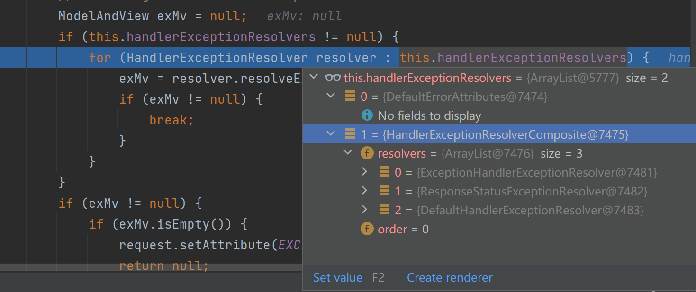 -->

   3. 
      轮到第二个处理,里面有3个解析器

      <!-- 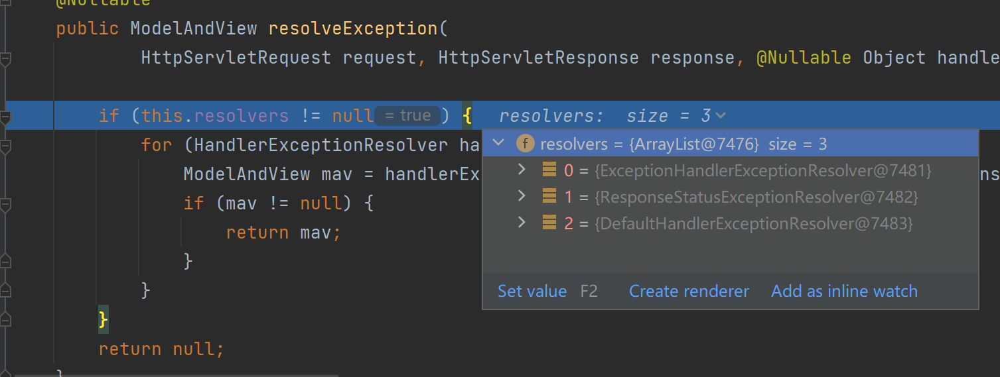 -->

      

      1. DefaultErrorAttributes 先来处理异常,把异常信息保存到request域中,并且返回null
      2. 默认没有任何组件能处理异常,所以异常会被抛出
      3. 如果没有任何组件能处理,最终底层会再发送一个/error请求,会被底层的BasicErrorController处理
      4. 解析错误视图,遍历所有的errorViewResolver,看谁能解析
      5. 默认的DefaultErrorViewResovler,作用就是把响应状态码作为错误页地址:error/5xx.html
      6. 模板引擎最终响应这个页面:error/500.html

## Web原生组件注入(Servlet,Filter,Listener)

### 1. 使用Servlet API

**1. 写一个Servlet,继承HttpServlet,然后添加@WebServlet(urlPatterns = "/my")注解**

```java
package com.zzmr.admin.servlet;

import javax.servlet.ServletException;
import javax.servlet.annotation.WebServlet;
import javax.servlet.http.HttpServlet;
import javax.servlet.http.HttpServletRequest;
import javax.servlet.http.HttpServletResponse;
import java.io.IOException;

@WebServlet(urlPatterns = "/my")
public class MyServlet extends HttpServlet {
    @Override
    protected void doGet(HttpServletRequest req, HttpServletResponse resp) throws ServletException, IOException {
        resp.getWriter().write("6");
    }
}
```

只这样写是不行的,需要在主方法类中加上@**ServletComponentScan**(basePackages = "com.zzmr.admin.servlet")注解,也就是扫描某个包

```java
package com.zzmr.admin;

import org.springframework.boot.SpringApplication;
import org.springframework.boot.autoconfigure.SpringBootApplication;
import org.springframework.boot.web.servlet.ServletComponentScan;

@SpringBootApplication
@ServletComponentScan(basePackages = "com.zzmr.admin.servlet")
public class Boot05WebAdminApplication {

    public static void main(String[] args) {
        SpringApplication.run(Boot05WebAdminApplication.class, args);
    }

}
```

**效果:直接响应,不经过Spring的拦截器处理**

还有Filter和Listener

**Filter.java**

```java
package com.zzmr.admin.servlet;

import lombok.extern.slf4j.Slf4j;

import javax.servlet.*;
import javax.servlet.annotation.WebFilter;
import java.io.IOException;

@Slf4j
@WebFilter(urlPatterns = {"/css/*", "/images/*"})
public class MyFilter implements Filter {
    @Override
    public void init(FilterConfig filterConfig) throws ServletException {
        log.info("Filter初始化完成");
    }

    @Override
    public void doFilter(ServletRequest request, ServletResponse response, FilterChain chain) throws IOException, ServletException {
        log.info("MyFilter工作");
        chain.doFilter(request, response);
    }

    @Override
    public void destroy() {
        log.info("Filter已销毁");
    }
}
```

**Listener**

```java
package com.zzmr.admin.servlet;

import lombok.extern.slf4j.Slf4j;

import javax.servlet.ServletContextEvent;
import javax.servlet.ServletContextListener;
import javax.servlet.annotation.WebListener;

@WebListener
@Slf4j
public class MyServletContextListener implements ServletContextListener {
    @Override
    public void contextInitialized(ServletContextEvent sce) {
      log.info("MyServletContextListener监听到项目初始化完成");
    }

    @Override
    public void contextDestroyed(ServletContextEvent sce) {
        log.info("监听到项目的销毁");
    }
}
```

> **都是加上对应的WebXXX注解,然后给主方法类加上那个扫描的注解就行了**
> 也是推荐使用的

> 扩展:DispatcherServlet如何注册进来

- 容器中自动配置了DispatcherServlet属性绑定到WebMvcProperties,对应的配置文件配置项是:spring.mvc
- 通过ServletRegistrationBean`<DispatcherServlet>`把DispathcerServlet配置进来
- 默认映射的是/路径

Tomcat-Servlet
多个Servlet都能处理同一层路径,就会遵守精确优选原则
A: /my/
B: /my/1

<!-- 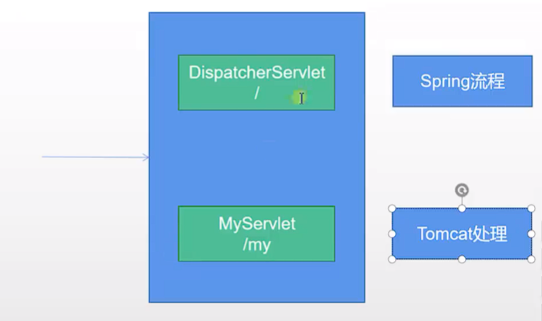 -->


**简单点说就是,系统会自动匹配最佳的,或者说最长最佳的tomcat中有/my/1,那发送/my/1就会来到tomcat,如果发送的是/my,那就会来到DispathcerServlet这里**

### 2. 使用RegistrationBean

[官方文档](https://docs.spring.io/spring-boot/docs/2.4.13/reference/html/spring-boot-features.html#boot-features-embedded-container-application-context)

> you can use the **ServletRegistrationBean**, **FilterRegistrationBean**, and **ServletListenerRegistrationBean** classes for complete control.

这时,Servlet,Filter以及Listener的类上就不用写WebXXX了
直接写一个类:

```java
package com.zzmr.admin.servlet;

import org.springframework.boot.web.servlet.FilterRegistrationBean;
import org.springframework.boot.web.servlet.ServletListenerRegistrationBean;
import org.springframework.boot.web.servlet.ServletRegistrationBean;
import org.springframework.context.annotation.Bean;
import org.springframework.context.annotation.Configuration;
import java.util.Arrays;


@Configuration(proxyBeanMethods = true)// 保证依赖的组件始终是单实例的
public class MyRegistryConfig {

    @Bean
    public ServletRegistrationBean myServlet() {
        MyServlet myServlet = new MyServlet();
        return new ServletRegistrationBean(myServlet, "/my", "/my2");
    }


    @Bean
    public FilterRegistrationBean myFilter() {
        MyFilter myFilter = new MyFilter();
        //return new FilterRegistrationBean(myFilter,myServlet());
        FilterRegistrationBean filterRegistrationBean = new FilterRegistrationBean(myFilter);
        filterRegistrationBean.setUrlPatterns(Arrays.asList("/my", "/css/*"));
        return filterRegistrationBean;
    }

    @Bean
    public ServletListenerRegistrationBean myListener(){
        MyServletContextListener myServletContextListener = new MyServletContextListener();
        return new ServletListenerRegistrationBean(myServletContextListener);
    }

}
```

> **为什么自己写的原生Servlet不经过拦截器拦截?**

## 嵌入式Servlet容器

### 1. 切换嵌入式Servlet容器

[官方文档](https://docs.spring.io/spring-boot/docs/2.4.13/reference/html/spring-boot-features.html#boot-features-embedded-container-application-context)

> 就是,你有没有发现,现在都不用在项目里面配置tomcat了,又是改什么启动的浏览器,改上下文,改实例,一堆东西,现在全都配置好了,都不需要更改,这就是内嵌的Servlet容器,或者说是服务器,这个服务器是可以切换的.

- 默认支持的webServer
  - Tomcat,Jetty,or Undertow
  - ServletWebServerApplicationContext 容器启动寻找ServletWebServerFactory并引导创建服务器
- 切换服务器

修改依赖,排除tomcat的依赖,添加undertow的依赖,然后就可以直接启动项目了

```xml
<!--        下面两个dependency是暂时修改的-->
        <dependency>
            <groupId>org.springframework.boot</groupId>
            <artifactId>spring-boot-starter-web</artifactId>

            <exclusions>
                <exclusion>
                    <groupId>org.springframework.boot</groupId>
                    <artifactId>spring-boot-starter-tomcat</artifactId>
                </exclusion>
            </exclusions>

        </dependency>

        <dependency>
            <groupId>org.springframework.boot</groupId>
            <artifactId>spring-boot-starter-undertow</artifactId>
        </dependency>
```

- 原理

  - SpringBoot应用启动发现当前是Web应用,web场景包-导入tomcat
  - web应用会创建一个web版的ioc容器**ServletWebServerApplicationContext**
  - ServletWebServerApplicationContext 启动的时候寻找ServletWebServerFactory(Servlet的web服务器工厂--->Servlet的web服务器)
  - SpringBoot底层默认有很多的WebServer工厂
  - TomcatServletWebServerFactoryJettyServletWebServerFactoryUndertowServletWebServerFactory
  - 底层直接会有一个自动配置类**ServletWebServerFactoryAutoConfiguration**
  - ServletWebServerFactoryAutoConfiguration导入了ServletWebServerFactoryConfiguration
  - ServletWebServerFactoryConfiguration配置类 根据动态判断系统中到底导入了哪个Web服务器的包(默认是web-starter导入tomcat包) 容器中就有**TomcatServletWebServerFactory**
  - TomcatServletWebServerFactory创建Tomcat服务器并启动
  - 内嵌服务器,就是手动把启动服务器的代码调用(tomcat核心jar包存在)

  ```java
  	static class EmbeddedTomcat {

  	@Bean
  	TomcatServletWebServerFactory tomcatServletWebServerFactory(
  			ObjectProvider<TomcatConnectorCustomizer> connectorCustomizers,
  			ObjectProvider<TomcatContextCustomizer> contextCustomizers,
  			ObjectProvider<TomcatProtocolHandlerCustomizer<?>> protocolHandlerCustomizers) {
  		TomcatServletWebServerFactory factory = new TomcatServletWebServerFactory();
  		factory.getTomcatConnectorCustomizers()
  				.addAll(connectorCustomizers.orderedStream().collect(Collectors.toList()));
  		factory.getTomcatContextCustomizers()
  				.addAll(contextCustomizers.orderedStream().collect(Collectors.toList()));
  		factory.getTomcatProtocolHandlerCustomizers()
  				.addAll(protocolHandlerCustomizers.orderedStream().collect(Collectors.toList()));
  		return factory;
  	}

  }

  /**
   * Nested configuration if Jetty is being used.
   */
  @Configuration(proxyBeanMethods = false)
  @ConditionalOnClass({ Servlet.class, Server.class, Loader.class, WebAppContext.class })
  @ConditionalOnMissingBean(value = ServletWebServerFactory.class, search = SearchStrategy.CURRENT)
  static class EmbeddedJetty {

  	@Bean
  	JettyServletWebServerFactory JettyServletWebServerFactory(
  			ObjectProvider<JettyServerCustomizer> serverCustomizers) {
  		JettyServletWebServerFactory factory = new JettyServletWebServerFactory();
  		factory.getServerCustomizers().addAll(serverCustomizers.orderedStream().collect(Collectors.toList()));
  		return factory;
  	}

  }

  /**
   * Nested configuration if Undertow is being used.
   */
  @Configuration(proxyBeanMethods = false)
  @ConditionalOnClass({ Servlet.class, Undertow.class, SslClientAuthMode.class })
  @ConditionalOnMissingBean(value = ServletWebServerFactory.class, search = SearchStrategy.CURRENT)
  static class EmbeddedUndertow {

  	@Bean
  	UndertowServletWebServerFactory undertowServletWebServerFactory(
  			ObjectProvider<UndertowDeploymentInfoCustomizer> deploymentInfoCustomizers,
  			ObjectProvider<UndertowBuilderCustomizer> builderCustomizers) {
  		UndertowServletWebServerFactory factory = new UndertowServletWebServerFactory();
  		factory.getDeploymentInfoCustomizers()
  				.addAll(deploymentInfoCustomizers.orderedStream().collect(Collectors.toList()));
  		factory.getBuilderCustomizers().addAll(builderCustomizers.orderedStream().collect(Collectors.toList()));
  		return factory;
  	}

  	@Bean
  	UndertowServletWebServerFactoryCustomizer undertowServletWebServerFactoryCustomizer(
  			ServerProperties serverProperties) {
  		return new UndertowServletWebServerFactoryCustomizer(serverProperties);
  	}

  }
  ```

### 2. 定制Servlet容器

- 实现WebServerFactoryCustomizer\<ConfigurableServletWebServerFactory\>
  - 把配置文件的值和ServletWebServerFactory 进行绑定
- 修改配置文件server.xxx
  - server.port=8080
- 直接自定义ConfigurableServletWebServerFactory(**很帅**)

> **xxxxCustomizer:定制化器,可以改变xxx的默认规则**

## 定制化原理

### 定制化的常见方式

- 修改配置文件
- xxxxCustomizer;
- 编写自定义的配置类 xxxConfiguration + @Bean替换,增加容器中默认组件;视图解析器
- web应用实现WebMvcConfigurer即可定制化web功能

```java
@Configuration
public class AdminWebConfig implements WebMvcConfigurer {}
```

- `@EnableWebMvc` + `WebMvcConfigurer` — `@Bean`  可以全面接管SpringMVC，所有规则全部自己重新配置； 实现定制和扩展功能（**高级功能，初学者退避三舍**）。
  - 原理：
    1. `WebMvcAutoConfiguration`默认的SpringMVC的自动配置功能类，如静态资源、欢迎页等。
    2. 一旦使用 `@EnableWebMvc` ，会 `@Import(DelegatingWebMvcConfiguration.class)`。
    3. `DelegatingWebMvcConfiguration`的作用，只保证SpringMVC最基本的使用
       - 把所有系统中的 `WebMvcConfigurer`拿过来，所有功能的定制都是这些 `WebMvcConfigurer`合起来一起生效。
       - 自动配置了一些非常底层的组件，如 `RequestMappingHandlerMapping`，这些组件依赖的组件都是从容器中获取如。
       - `public class DelegatingWebMvcConfiguration extends WebMvcConfigurationSupport`。
    4. `WebMvcAutoConfiguration`里面的配置要能生效必须  `@ConditionalOnMissingBean(WebMvcConfigurationSupport.class)`。
    5. @EnableWebMvc 导致了WebMvcAutoConfiguration  没有生效。

### 原理分析套路

**场景starter-xxxAutoConfiguration-导入xxx组件-绑定xxxProperties--绑定配置文件项**

> 6天,看到这了

## 数据访问

### 1. 数据源的自动配置

1. 先导入jdbc场景

```xml
        <dependency>
            <groupId>org.springframework.boot</groupId>
            <artifactId>spring-boot-starter-data-jdbc</artifactId>
        </dependency>
```

<!-- 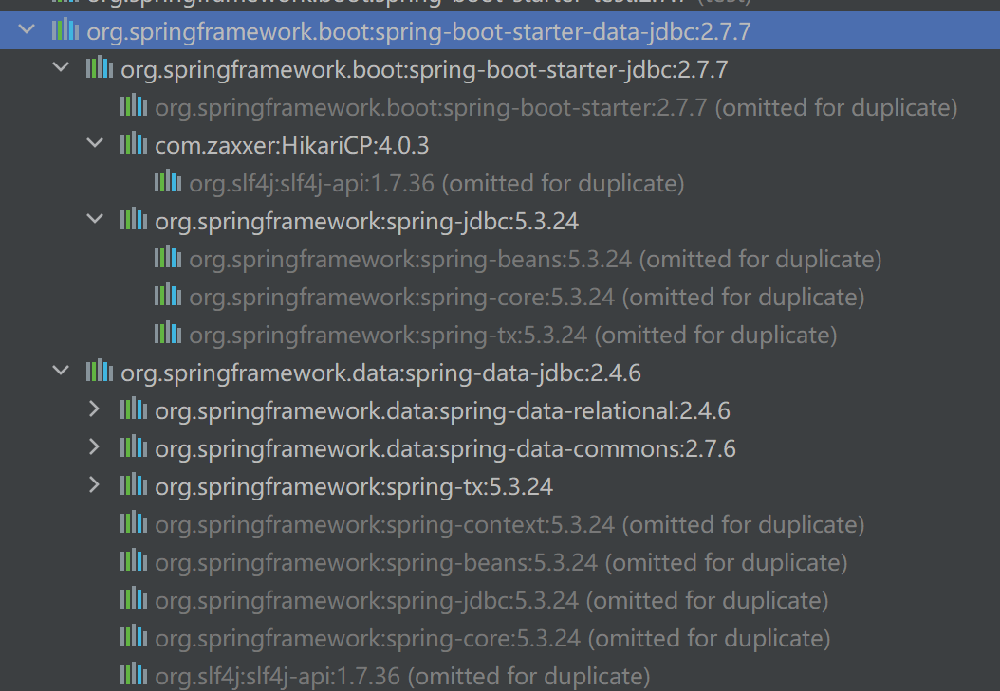 -->


2. 数据库驱动没导,为什么呢?
因为SpringBoot不知道要使用哪个数据库,所以我们要使用哪个数据库,就导入哪个驱动就行了
SpringBoot有mysql的版本仲裁(数据库的版本要和驱动版本相同),默认都是8.xx了,我装的也是mysql8,

```xml
        <dependency>
            <groupId>mysql</groupId>
            <artifactId>mysql-connector-java</artifactId>
        </dependency>
```

如果想改的话,两种办法

1. `<version>`5.xxx`</version>`
2. 重新声明(maven属性的就近优先原则)

```xml
    <properties>
        <java.version>1.8</java.version>
<!--        <mysql.version>5.1.49</mysql.version>-->
    </properties>
```

**分析自动配置**

1. 自动配置的类

   - DataSourceAutoConfiguration 数据源的自动配置
     - 修改数据源相关的配置:spring.datasource
     - 数据库连接池的配置,是自己容器中没有DataSource才自动配置的
     - 底层配置好的连接池是HikariDataSource

   ```java
       	@Configuration(proxyBeanMethods = false)
   @Conditional(PooledDataSourceCondition.class)
   @ConditionalOnMissingBean({ DataSource.class, XADataSource.class })
   @Import({ DataSourceConfiguration.Hikari.class, DataSourceConfiguration.Tomcat.class,
   		DataSourceConfiguration.Dbcp2.class, DataSourceConfiguration.OracleUcp.class,
   		DataSourceConfiguration.Generic.class, DataSourceJmxConfiguration.class })
   protected static class PooledDataSourceConfiguration {

   }
   ```

   - DataSourceTransactionManagerAutoConfiguration 事务管理器的自动配置
   - JdbcTemplateAutoConfiguration: JdbcTemplate的自动配置,之前学spring用过这个东西,也挺好用

**修改配置项**

```yml
spring:
  datasource:
    url: jdbc:mysql://localhost:3306/db_account?serverTimezone=UTC
    username: root
    password: "010203"
    driver-class-name: com.mysql.cj.jdbc.Driver
```

为什么?密码不加双引号,就一直错误

然后测试一下

```java
package com.zzmr.admin;

import lombok.extern.slf4j.Slf4j;
import org.junit.jupiter.api.Test;
import org.springframework.beans.factory.annotation.Autowired;
import org.springframework.boot.test.context.SpringBootTest;
import org.springframework.jdbc.core.JdbcTemplate;


@SpringBootTest
@Slf4j
class Boot05WebAdminApplicationTests {

    @Autowired
    JdbcTemplate jdbcTemplate;

    @Test
    void contextLoads() {
        Long aLong = jdbcTemplate.queryForObject("select count(*) from account_tbl",Long.class);
        log.info("记录总数{}",aLong);
    }

}
```

没问题啊没问题

### 2. 使用Druid数据源

#### 自定义整合

[官方网址](https://github.com/alibaba/druid)

1. 引入依赖:

```xml
        <dependency>
            <groupId>com.alibaba</groupId>
            <artifactId>druid</artifactId>
            <version>1.2.5</version>
        </dependency>
```

2. 创建配置类

```java
package com.zzmr.admin.config;

import com.alibaba.druid.pool.DruidDataSource;
import org.springframework.boot.context.properties.ConfigurationProperties;
import org.springframework.context.annotation.Bean;
import org.springframework.context.annotation.Configuration;

import javax.sql.DataSource;

@Configuration
public class MyDataSourceConfig {

    // 默认的自动配置是：判断容器中没有数据源才会配置：ConditionalOnMissingBean(DataSource.class)
    @Bean
    @ConfigurationProperties("spring.datasource")
    public DataSource dataSource() {
        DruidDataSource dataSource = new DruidDataSource();
        return  dataSource;
    }

}
```

因为配置文件中已经有各个属性了,所以直接绑定配置项就行了,在yml配置文件中关于数据源的配置项就是spring.datasource

##### 开启监控功能

这个还真没接触过
可以监控sql的一些内容

<!-- 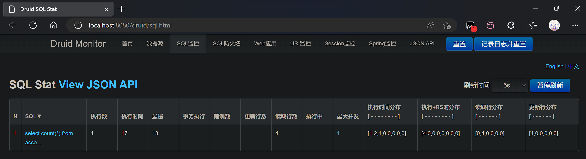 -->


使用步骤:

1. 开启监控功能
   在配置druid数据源的地方给set一个stat

```java
        // 加入监控功能
        dataSource.setFilters("stat");
```

2. 配置监控功能

```java
    /**
     * 配置Druid的监控页功能
     *
     * @return
     */
    @Bean
    public ServletRegistrationBean StatViewServlet() {
        StatViewServlet statViewServlet = new StatViewServlet();
        ServletRegistrationBean<StatViewServlet> registrationBean =
                new ServletRegistrationBean<>(statViewServlet, "/druid/*");
        return registrationBean;
    }
```

3. 直接来使用就行了
   访问localhost:8080/druid/index.html

配置WebStatFilter

```java
    /**
     * WebStatFilter 用于采集web-jdbc关联监控的数据
     */
    @Bean
    public FilterRegistrationBean WebStatFilter() {
        WebStatFilter webStatFilter = new WebStatFilter();
        FilterRegistrationBean<WebStatFilter> filterRegistrationBean = new FilterRegistrationBean<>(webStatFilter);
        filterRegistrationBean.setUrlPatterns(Arrays.asList("/*"));
        filterRegistrationBean.addInitParameter("exclusions", "*.js,*.gif,*.jpg,*.png,*.css,*.ico,/druid/*");
        return filterRegistrationBean;
    }
```

还有配置防火墙

```java
        dataSource.setFilters("stat,wall");
```

只需要在setFilters里面加上wall就可以了

**给监控页配置账号和密码**

```java
    /**
     * 配置Druid的监控页功能
     *
     * @return
     */
    @Bean
    public ServletRegistrationBean StatViewServlet() {
        StatViewServlet statViewServlet = new StatViewServlet();
        ServletRegistrationBean<StatViewServlet> registrationBean =
                new ServletRegistrationBean<>(statViewServlet, "/druid/*");
        registrationBean.addInitParameter("loginUsername", "admin");
        registrationBean.addInitParameter("loginPassword", "010203");
        return registrationBean;
    }
```

只需要在registrationBean中add就行了

?还有优化的写法,其实我感觉这样写也没有多麻烦啊哈哈哈哈艹

#### druid数据源stater整合方式

这种才是以后以后用的方式啊哈哈哈哈艹

前面全都注掉,然后在pom.xml中把druid的依赖也注掉

加上:

```xml
        <dependency>
            <groupId>com.alibaba</groupId>
            <artifactId>druid-spring-boot-starter</artifactId>
            <version>1.1.17</version>
        </dependency>
```

**分析自动配置**

- 扩展配置项: spring.datasource.druid
  @Import({
- DruidSpringAopConfiguration.class,    监控SpringBean的,配置项:spring.datasouce.druid.aop-patterns
- DruidStatViewServletConfiguration.class,   监控页的配置 spring.datasource.druid.stat-view-servlet,默认开启
- DruidWebStatFilterConfiguration.class, web监控配置, 配置项:spring.datasource.druid.web-stat-filter  默认开启
- DruidFilterConfiguration.class   所有Druid自己的filter的配置
  })

```java
    private static final String FILTER_STAT_PREFIX = "spring.datasource.druid.filter.stat";
    private static final String FILTER_CONFIG_PREFIX = "spring.datasource.druid.filter.config";
    private static final String FILTER_ENCODING_PREFIX = "spring.datasource.druid.filter.encoding";
    private static final String FILTER_SLF4J_PREFIX = "spring.datasource.druid.filter.slf4j";
    private static final String FILTER_LOG4J_PREFIX = "spring.datasource.druid.filter.log4j";
    private static final String FILTER_LOG4J2_PREFIX = "spring.datasource.druid.filter.log4j2";
    private static final String FILTER_COMMONS_LOG_PREFIX = "spring.datasource.druid.filter.commons-log";
    private static final String FILTER_WALL_PREFIX = "spring.datasource.druid.filter.wall";
    private static final String FILTER_WALL_CONFIG_PREFIX = FILTER_WALL_PREFIX + ".config";
```

```yml
spring:
  datasource:
    url: jdbc:mysql://localhost:3306/db_account?serverTimezone=UTC
    username: root
    password: "010203"
    driver-class-name: com.mysql.cj.jdbc.Driver

    druid:
      filters: stat,wall  #底层开启功能 stat表示sql监控，wall表示防火墙
      aop-patterns: com.zzmr.admin.*   #监控SpringBean
      stat-view-servlet:  # 配置监控页功能
        enabled: true
        login-username: admin
        login-password: '010203'
        reset-enable: false

      web-stat-filter: # 监控web
        enabled: true
        url-pattern: /*
        exclusions: '*.js,*.gif,*.jpg,*.png,*.css,*.ico,/druid/*'


      filter:
        stat:  # 对上面filters里面的stat详细的配置
          slow-sql-millis: 1000
          log-slow-sql: true
          enabled: true
        wall:
          enabled: true
          config:
            drop-table-allow: false
```

配置文件如上
[参考链接](https://github.com/alibaba/druid/tree/master/druid-spring-boot-starter)

### 整合MyBatis操作

不容易啊,终于看到整合MyBatis了

1. 引入starter

```xml
        <dependency>
            <groupId>org.mybatis.spring.boot</groupId>
            <artifactId>mybatis-spring-boot-starter</artifactId>
            <version>2.1.4</version>
        </dependency>
```

引入成功:

<!-- 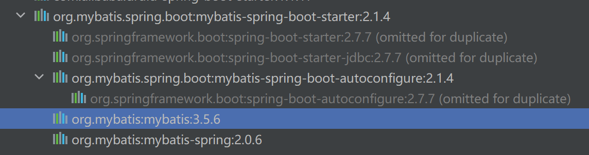 -->


#### 配置模式

- 全局配置模式
- SqlSessionFactory  自动配置好了
- SqlSession         自动配置了SqlSessionTemplate组合了SqlSession
- Mapper             只要写的操作MyBatis的接口标注了@Mapper注解,就会被自动扫描进来

```java
@EnableConfigurationProperties(MybatisProperties.class) // MyBatis配置项绑定类
@AutoConfigureAfter({ DataSourceAutoConfiguration.class, MybatisLanguageDriverAutoConfiguration.class })
public class MybatisAutoConfiguration{}
```

MyBatisProperties.class

```java
@ConfigurationProperties(prefix = MybatisProperties.MYBATIS_PREFIX)
public class MybatisProperties {

  public static final String MYBATIS_PREFIX = "mybatis";}
```

所以得出,可以修改配置文件中mybatis开始的所有;

**配置MyBatis的规则**

```yml
#配置MyBatis的规则
mybatis:
  config-location: classpath:mybatis/mybatis-config.xml # 全局配置文件位置
  mapper-locations: classpath:mybatis/mapper/*.xml # sql映射文件位置
```

具体使用还是和之前一样
先是写mapper接口的映射文件

```xml
<?xml version="1.0" encoding="UTF-8" ?> <!DOCTYPE mapper PUBLIC "-//mybatis.org//DTD Mapper 3.0//EN"
        "http://mybatis.org/dtd/mybatis-3-mapper.dtd">

<mapper namespace="com.zzmr.admin.mapper.AccountMapper">
<!--    public Account getAcct(Long id);-->
    <select id="getAcct" resultType="com.zzmr.admin.bean.Account">
        select * from account_tbl where user_id = #{id}
    </select>
</mapper>
```

然后直接调用接口就行了

这里的全局配置文件还是可以用的,比如可以在里面加上驼峰的映射

```xml
    <settings>
        <!--        将下划线映射为驼峰-->
        <setting name="mapUnderscoreToCamelCase" value="true"/>
    </settings>
```

配置private Configuration configuration; mybatis.configuration 下面的所有,就是相当于改mybatis的全局配置文件中的值

所以这个驼峰映射,也可以在yml中配置:

```yml
#配置MyBatis的规则
mybatis:
  config-location: classpath:mybatis/mybatis-config.xml
  mapper-locations: classpath:mybatis/mapper/*.xml
  configuration:
    map-underscore-to-camel-case: true
```

最后两句就是
然后就报错了..

<!-- 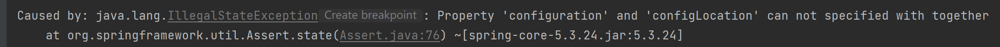 -->


意思就是,全局配置文件和这个configuration配置项是不能同时存在的
所以,如果想要使用yml的方式,就需要把上面的config-location注掉,如:

```yml
#配置MyBatis的规则
mybatis:
#   config-location: classpath:mybatis/mybatis-config.xml
   y: classpath:mybatis/mapper/*.xml
  configuration:
    map-underscore-to-camel-case: true
```

所以,**可以不写配置文件,全局配置文件的内容全部放在configuration下**
这是最重要的.以后都用不到配置文件了

> 几步走

- 导入mybatis官方starter
- 编写mapper接口,标注@Mapper
- 编写sql映射文件并绑定mapper接口
- 在application.yml中指定Mapper配置文件的位置,**以及(指定全局配置文件的信息,但是不常用了)配置mybatis.configuration,配置之前全局配置文件的内容**

#### 注解模式

纯注解配置MyBatis

```java
package com.zzmr.admin.mapper;

import com.zzmr.admin.bean.City;
import org.apache.ibatis.annotations.Mapper;
import org.apache.ibatis.annotations.Select;

@Mapper
public interface CityMapper {

    @Select("select * from city where id = #{id")
    public City getById(Long id);

}
```

这直接连mapper文件都省去了

测试:

```java
    @Autowired
    CityService cityService;

    @GetMapping("/city")
    @ResponseBody
    public City getCityById(@RequestParam("id") Long id){
        return cityService.getById(id);
    }
```

也没有问题

#### 混合模式

以后应该是混合模式比较多吧

就是混合到一块啊,互不影响

```java
package com.zzmr.admin.mapper;

import com.zzmr.admin.bean.City;
import org.apache.ibatis.annotations.Mapper;
import org.apache.ibatis.annotations.Select;

@Mapper
public interface CityMapper {

    @Select("select * from city where id = #{id}")
    public City getById(Long id);

    public void insert(City city);

}
```

然后insert方法就是使用的xml

```xml
<?xml version="1.0" encoding="UTF-8" ?> <!DOCTYPE mapper PUBLIC "-//mybatis.org//DTD Mapper 3.0//EN"
        "http://mybatis.org/dtd/mybatis-3-mapper.dtd">

<mapper namespace="com.zzmr.admin.mapper.CityMapper">

<!--    public void insert(City city);-->
    <insert id="insert" keyProperty="id" useGeneratedKeys="true">
        insert into city(`name`,`state`,`country`) values(#{name},#{state},#{country})
    </insert>
  
</mapper>
```

也是一样能使用的

**那要是就是要用注解怎么办?**

```java
    @Insert("insert into city(`name`,`state`,`country`) values(#{name},#{state},#{country})")
    @Options(useGeneratedKeys = true,keyProperty = "id")
    public void insert(City city);
```

有一个@Options注解,就是用来放上面注解的属性的

> **整合MyBatis的最佳实战**

- 引入mybatis-stater
- 配置application.yaml中,指定mapper-location位置即可
- 编写mapper接口,并标注@Mapper注解
- 简单方法直接注解方式
- 复杂方法编写mapper.xml进行绑定映射

**还有一个@MapperScan()注解,用于扫描mapper接口,有了这个注解,就不需要在每个mapper接口上写上@Mapper注解了**

**@MapperScan("com.zzmr.admin.mapper")**

### 整合MyBatis-Plus完成CRUD

还没学过MyBatis-Plus哎
MyBatis-Plus(简称MP)是一个MyBatis的增强工具,在MyBatis的基础上只做增强不做改变,为简化开发,提高效率而生
[官方文档](https://www.baomidou.com/pages/24112f/)

**安装一个MyBatisX插件**,直接搜就行了

#### 整合及使用

**引入依赖**

```xml
        <dependency>
            <groupId>com.baomidou</groupId>
            <artifactId>mybatis-plus-boot-starter</artifactId>
            <version>3.4.1</version>
        </dependency>
```

> 自动配置
> MybatisPlusAutoConfiguration配置类,MybatisPlusProperties配置项绑定

```java
     String MYBATIS_PLUS = "mybatis-plus";
```

所以配置mybatis-plus的内容都是在配置文件中修改mybatis-plus:xxx

- SqlSessionFactory自动配置好了,底层是容器中默认的数据源
- mapperLocations自动配置好了,有默认值: classpath*:/mapper/**/*.xml 任意包的类路径下的所有
  mapper文件夹下任意路径下的所有xml都是sql映射文件,建议以后sql映射文件,放在mapper下
- 容器中也自动配置好了有SqlSessionTemplate
- @Mapper 标注的接口也会被自动扫描,建议直接使用@MapperScan("com.xxx.mapper")批量扫描包
  不是,上一集还是不推荐来着哈哈哈哈
  无所谓,人家说是就是啥

```java
    @Bean
    @ConditionalOnMissingBean
    public SqlSessionFactory sqlSessionFactory(DataSource dataSource) throws Exception {
    }
```

**优点**

- 只需要我们的Mapper继承BaseMapper就可以拥有CRUD能力

> Talk is cheap. Show me the code.

注意一点,就是MyBatis-Plus默认的是bean类的全部属性都要求在数据库中,如果不是一一对应的就会报错
此时可以使用    @TableField(exist = false)来指定某些属性不是数据库中的列

```java
package com.zzmr.admin.bean;

import com.baomidou.mybatisplus.annotation.TableField;
import lombok.AllArgsConstructor;
import lombok.Data;
import lombok.EqualsAndHashCode;
import lombok.NoArgsConstructor;

@Data
@NoArgsConstructor
@AllArgsConstructor
@EqualsAndHashCode
public class User {

    /**
     * 所有属性都应该在数据库中
     * 使用@TableField(exist = false)来排除某些属性
     */

    @TableField(exist = false)
    private String userName;
    @TableField(exist = false)
    private String password;


    // 以下是数据库字段
    private Long id;
    private String name;
    private Integer age;
    private String email;
}
```

**还有表名和类名不一致的情况,使用@TableName()指定表名就行了**

?
这个MyBatis也太强了吧
现在连Service都不怎么用写了
直接让Service接口继承IService`<User>`

```java
package com.zzmr.admin.service;

import com.baomidou.mybatisplus.extension.service.IService;
import com.zzmr.admin.bean.User;

public interface UserService extends IService<User> {
}
```

然后在实现类里:

```java
package com.zzmr.admin.service.impl;

import com.baomidou.mybatisplus.extension.service.impl.ServiceImpl;
import com.zzmr.admin.bean.User;
import com.zzmr.admin.mapper.UserMapper;
import com.zzmr.admin.service.UserService;
import org.springframework.stereotype.Service;

@Service
public class UserServiceImpl extends ServiceImpl<UserMapper, User> implements UserService {

}
```

那这个Service就有了很多方法:

<!-- 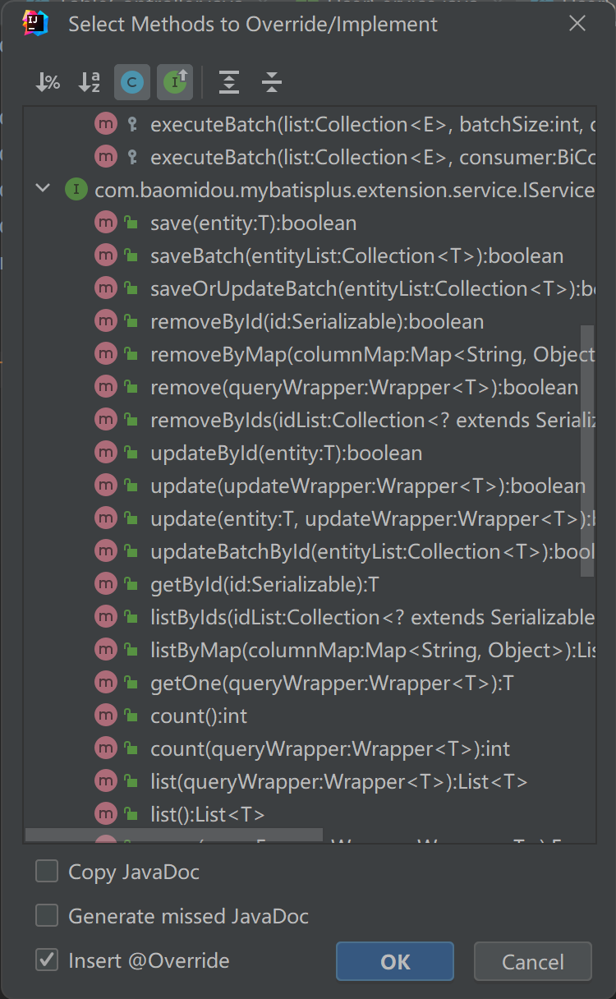 -->


然后想获取全部用户数据:

```java
        List<User> list = userService.list();
        model.addAttribute("users", list);
```

list()就是获取全部的数据
然后就能去到了,这也太强了

这里又写了一遍分页
但是用的方法更牛逼

还是先来控制器方法,用于返回dynamic_table页面的数据

```java
    @GetMapping("/dynamic_table")
    public String dynamic_table(Model model,@RequestParam(value = "pn",defaultValue = "1") Integer pn) {
        // 表格内容的遍历
/*        List<User> users = Arrays.asList(new User("张三", "123456"),
                new User("李四", "234567"),
                new User("王五", "345678"),
                new User("赵六", "456789"));
        model.addAttribute("users", users);

        if(users.size()>3){
            throw new UserTooManyException();
        }*/

        // 从数据库中查出user表的用户进行展示

        List<User> list = userService.list();
        //model.addAttribute("users", list);

        // 分页查询的数据
        Page<User> userPage = new Page<>(pn, 2);
        // 分页查询的结果
        Page<User> page = userService.page(userPage, null);

/*        long current = page.getCurrent();
        long pages = page.getPages();
        long total = page.getTotal();*/

        model.addAttribute("page",page);

        return "table/dynamic_table";
    }
```

dynamic_table.html中的重要内容

```html
<table class="display table table-bordered table-striped" id="dynamic-table">
                                    <thead>
                                    <tr>
                                        <th>#</th>
                                        <th>id</th>
                                        <th>name</th>
                                        <th>age</th>
                                        <th>email</th>
                                        <th>操作</th>
                                    </tr>
                                    </thead>
                                    <tbody>
                                    <tr class="gradeX" th:each="user,stat : ${page.records}">
                                        <td th:text="${stat.count}"></td>
                                        <td th:text="${user.id}"></td>
                                        <td th:text="${user.name}"></td>
                                        <td th:text="${user.age}"></td>
                                        <td th:text="${user.email}"></td>
                                        <td>X</td>
                                    </tr>
                                    </tbody>
                                    <tfoot>
                                    </tfoot>
                                </table>
                                <div class="row">
                                    <div class="col-lg-6">
                                        <div class="dataTables_info" id="editable-sample_info">当前第
                                            [[${page.current}]] 页 总计 [[${page.pages}]] 页
                                            共 [[${page.total}]] 条记录
                                        </div>
                                    </div>
                                    <div class="col-lg-6">
                                        <div class="dataTables_paginate paging_bootstrap pagination">
                                            <ul>
                                                <li class="prev disabled"><a href="#">← Prev</a></li>
                                                <li th:class="${num == page.current?'active':''}"
                                                    th:each="num:${#numbers.sequence(1,page.pages)}">
                                                    <a th:href="@{/dynamic_table(pn=${num})}">[[${num}]]</a>
                                                </li>
                                                <li class="next"><a href="#">Next → </a></li>
                                            </ul>
                                        </div>
                                    </div>
                                </div>
```

重要的是那三个li标签
之前都没这样写过
是真的厉害

当然还有开启分页功能的配置类:

```java
package com.zzmr.admin.config;

import com.baomidou.mybatisplus.extension.plugins.MybatisPlusInterceptor;
import com.baomidou.mybatisplus.extension.plugins.inner.PaginationInnerInterceptor;
import org.springframework.context.annotation.Bean;
import org.springframework.context.annotation.Configuration;

@Configuration
public class MyBatisConfig {

    @Bean
    public MybatisPlusInterceptor mybatisPlusInterceptor() {
        MybatisPlusInterceptor mybatisPlusInterceptor = new MybatisPlusInterceptor();

        // 这是分页拦截器
        PaginationInnerInterceptor paginationInnerInterceptor = new PaginationInnerInterceptor();
        paginationInnerInterceptor.setOverflow(true);
        paginationInnerInterceptor.setMaxLimit(500L);
        mybatisPlusInterceptor.addInnerInterceptor(paginationInnerInterceptor);
        return mybatisPlusInterceptor;
    }

}
```

**删除操作**

```java
    @GetMapping("/user/delete/{id}")
    public String deleteUser(@PathVariable("id") Long id){
        userService.removeById(id);
        return "redirect:/dynamic_table";
    }
```

也是直接调用方法了,service和mapper都不用写东西

然后页面

```html
              <td>
                    <a th:href="@{/user/delete/{id}(id=${user.id})}" class="btn btn-danger btn-sm" type="button">删除</a>
              </td>
```

其实这个写法我感觉复杂了
以前的写法,直接拼接请求路径

```html
    <a th:href="@{'/user/delete/'+${user.id}}" class="btn btn-danger btn-sm"
```

但是想删除的同时返回原来的那一页怎么办?之前都是删除完返回第一页
可以将pn(页号)也拼接到路径中

```html
    <a th:href="@{'/user/delete/'+${user.id}+'?pn='+${page.current}}" class="btn btn-danger btn-sm"
```

然后控制器方法也要修改

```java
    @GetMapping("/user/delete/{id}")
    public String deleteUser(@PathVariable("id") Long id,
                             @RequestParam(value = "pn", defaultValue = "1") Integer pn,
                             RedirectAttributes ra) {
        userService.removeById(id);
        ra.addAttribute("pn",pn);
        return "redirect:/dynamic_table";
    }
```

**RedirectAttributes 可以将指定的参数拼接到重定向的路径后面**

然后
然后就结束了

redis也没学啊,不管了,先看着

### NoSQL

> Redis 是一个开源（BSD许可）的，内存中的数据结构存储系统，它可以用作数据库、缓存和消息中间件。 它支持多种类型的数据结构，如 字符串（strings）， 散列（hashes）， 列表（lists）， 集合（sets）， 有序集合（sorted sets） 与范围查询， bitmaps， hyperloglogs 和 地理空间（geospatial） 索引半径查询。 Redis 内置了 复制（replication），LUA脚本（Lua scripting）， LRU驱动事件（LRU eviction），事务（transactions） 和不同级别的 磁盘持久化（persistence）， 并通过 Redis哨兵（Sentinel）和自动 分区（Cluster）提供高可用性（high availability）。
> [redis官网](http://redis.cn/)

要不,就先看着?

引入场景:

```xml
        <dependency>
            <groupId>org.springframework.boot</groupId>
            <artifactId>spring-boot-starter-data-redis</artifactId>
        </dependency>
```

自动配置

- RedisAutoConfiguration 自动配置类  RedisProperties 属性类--->spring.redis.xxx是对reids的配置
- 连接工厂是准备好的-LettuceConnectionConfiguration,JedisConnectionConfiguration两个
- 自动注入了RedisTemplate<Object,Object> xxxTemplate;
- 自动注入了StringRedisTemplate,k和v都是String
- key:value
- 底层只要使用RedisTemplate和StringRedisTemplate就可以操作redis

**环境搭建**

- 购买一个redis云数据库,按量付费
- 申请redis的公网连接地址
  ?不行啊,买不了经典网络的,申请不了公网连接
  算了,这一块随便听听吧,等后面把redis学完再说

## 单元测试

Spring Boot 2.2.0 版本开始引入 JUnit 5 作为单元测试默认库

[JUnit 5官方文档](https://junit.org/junit5/docs/current/user-guide/#writing-tests-annotations)

作为最新版本的JUnit框架，JUnit5与之前版本的JUnit框架有很大的不同。由三个不同子项目的几个不同模块组成。

**JUnit 5 = JUnit Platform + JUnit Jupiter + JUnit Vintage**

- **JUnit Platform**: Junit Platform是在JVM上启动测试框架的基础，不仅支持Junit自制的测试引擎，其他测试引擎也都可以接入。
- **JUnit Jupiter**: JUnit Jupiter提供了JUnit5的新的编程模型，是JUnit5新特性的核心。内部包含了一个**测试引擎**，用于在Junit Platform上运行。
- **JUnit Vintage**: 由于JUint已经发展多年，为了照顾老的项目，JUnit Vintage提供了兼容JUnit4.x，JUnit3.x的测试引擎。

**注意**：

- SpringBoot 2.4 以上版本移除了默认对 Vintage 的依赖。如果需要兼容JUnit4需要自行引入（不能使用JUnit4的功能 @Test）
- JUnit 5’s Vintage已经从 `spring-boot-starter-test`从移除。如果需要继续兼容Junit4需要自行引入Vintage依赖：

```xml
<dependency>
    <groupId>org.junit.vintage</groupId>
    <artifactId>junit-vintage-engine</artifactId>
    <scope>test</scope>
    <exclusions>
        <exclusion>
            <groupId>org.hamcrest</groupId>
            <artifactId>hamcrest-core</artifactId>
        </exclusion>
    </exclusions>
</dependency>
```

现在使用,就是直接加一个@SpringBootTest注解,然后跟以前一样写测试方法就行了

而依赖,默认也是配好的

```xml
        <dependency>
            <groupId>org.springframework.boot</groupId>
            <artifactId>spring-boot-starter-test</artifactId>
            <scope>test</scope>
        </dependency>
```

### Junit5 注解

1. @DisplayName("xxx")  为测试类或者测试方法设置展示名称
   标注在方法上(也可以标注在类上) 然后这个测试方法就有了名字:

<!-- 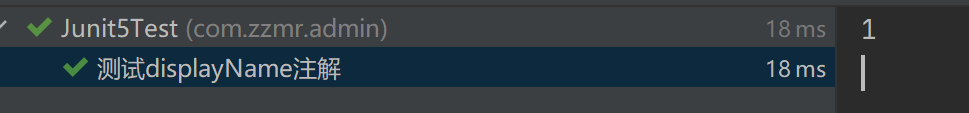 -->


```java
    @DisplayName("测试displayName注解")
    @Test
    void testDisplayName(){
        System.out.println(1);
    }
```

2. @BeforeEach  表示在每个单元测试之前执行
   标注了这个注解,那么测试其他方法的时候,它就会先执行

<!-- 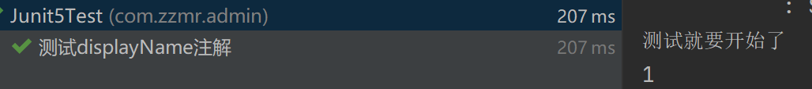 -->


```java
    @BeforeEach
    void testBeforeEach(){
        System.out.println("测试就要开始了");
    }
```

3. @AfterEach  在每个测试方法结束之后执行

```java
    @AfterEach
    void testAfterEach() {
        System.out.println("测试就要结束了");
    }
```

4. @BeforeAll和@AfterAll
   类中所有的测试方法都执行开始或者结束时执行

```java
    @BeforeAll
    static void testBeforeAll() {
        System.out.println("所有测试就要开始了");
    }

    @AfterAll
    static void testAfterAll() {
        System.out.println("所有测试就要结束了");
    }
```

5. @Timeout

```java
    /**
     * 规定方法超时时间，超出时间，测试抛出异常
     * @throws InterruptedException
     */
    @Test
    @Timeout(value = 500,unit = TimeUnit.MICROSECONDS)
    void testTimeout() throws InterruptedException {
        Thread.sleep(500);
    }
```

6. @RepeatedTest

```java
    @RepeatedTest(5)
    @Test
    void test3(){
        System.out.println(5);
    }
```

### 断言(assertions)

断言(assertions)时测试方法中的核心部分,用来对测试需要满足的条件进行验证,**这些断言方法都是org.junit.jupiter.api.Assertions的静态方法**,Junit5内置的断言可以分成如下几个类别:
检察业务逻辑返回的数据是否合理
**所有的测试运行结束以后,会有一个详细的测试报告**

#### 1. 简单断言

用来对单个值进行简单的验证,如:

<!-- 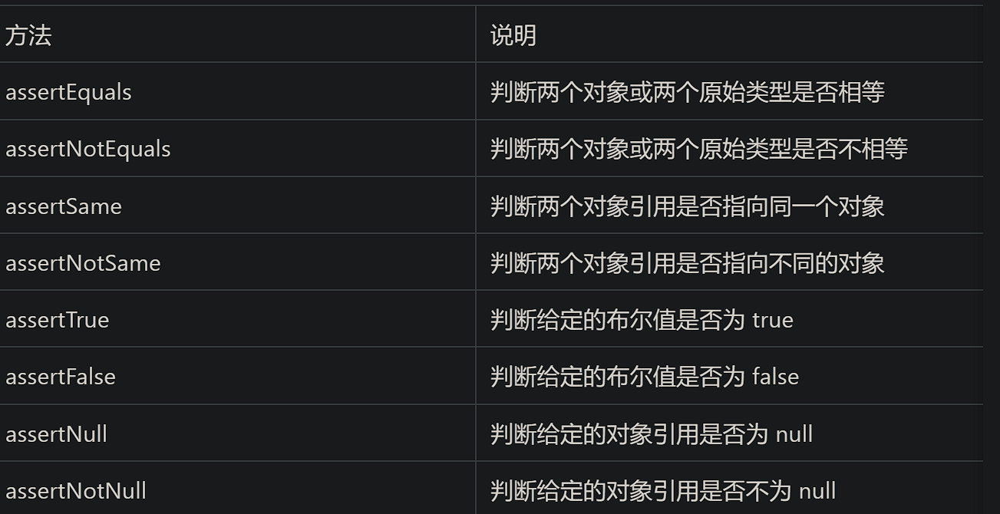 -->


- **assertEquals(expected,actual,String)**,判断值是否相等,第一个参数是期望的值,第二个是实际的值

```java
    @DisplayName("测试简单断言")
    @Test
    void testSimpleAssertions() {
        int cal = cal(3, 3);
        // 判定相等
        assertEquals(5, cal,"业务逻辑计算失败");
    }

    int cal(int i, int j) {
        return i + j;
    }
```

如果相等,没问题,如果不等,则会提示自定义的信息

<!-- 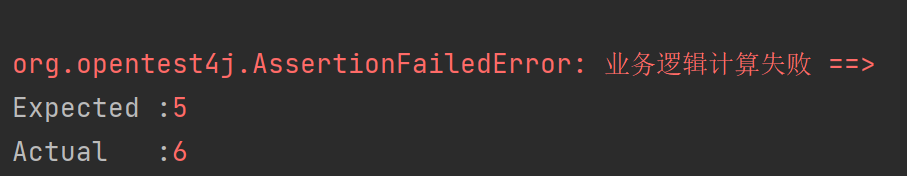 -->


- **assertSame(obj1,obj2,String)**,判断两个对象是否相同

```java
        Object obj1 = new Object();
        Object obj2 = new Object();
        assertSame(obj1, obj2, "两个对象不一样");
```

结果:

<!-- 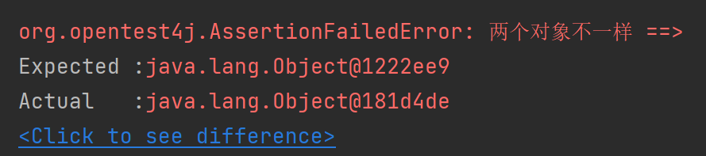 -->


> **注意,断言的情况下,前面的断言失败,后面的断言就不会再执行了**

#### 2. 数组断言

通过assertArrayEquals方法来判断两个对象或原始类型的数组是否相等

```java
    @Test
    @DisplayName("array assertion")
    public void array() {
        assertArrayEquals(new int[]{1, 2}, new int[]{2, 1},"数组内容不相等");
    }
```

<!-- 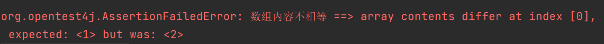 -->


#### 3. 组合断言

```java
    @Test
    @DisplayName("组合断言")
    void all() {
        /**
         * 所有断言全部成功
         */
        assertAll("test",
                () -> assertTrue(false,"结果不为true"),
                ()-> assertEquals(1,2,"结果不相等"));
    }
```

#### 4. 异常断言

```java
    @Test
    @DisplayName("异常断言")
    void testException() {
        assertThrows(ArithmeticException.class,
                () -> {
                    int i = 10 / 1;
                }, "业务逻辑居然正常运行");
    }
```

这个比较怪,前面的是期望出现异常,如果没有出现异常,就会报错
出现了异常,就没问题

<!-- 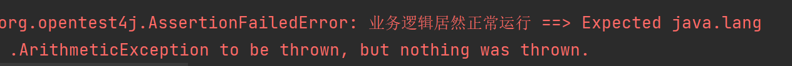 -->


#### 5. 超时断言

```java
@Test
@DisplayName("超时测试")
public void timeoutTest() {
    //如果测试方法时间超过1s将会异常
    Assertions.assertTimeout(Duration.ofMillis(1000), () -> Thread.sleep(500));
}
```

#### 6. 快速失败

```java
    @Test
    @DisplayName("快速失败")
    void testFail(){
        //
        if (2==2){
            fail("测试失败");
        }
    }
```

绷不住了
哈哈哈哈哈哈

### 前置条件(assumptions)

Junit5中的前置条件(assumptions[假设])类似断言,不同之处在于**不满足的断言会使得测试方法失败,而不满足的前置条件只会使得测试方法的执行终止,前置条件可以看成是测试方法执行的前提,当该前提不满足时,就没有继续执行的必要**

```java
    /**
     * 测试前置条件
     */
    @Test
    @DisplayName("测试前置条件")
    void testAssumptions() {
        Assumptions.assumeTrue(false, "结果不是true");
        System.out.println("11111");
    }
```

### 嵌套测试

```java
package com.zzmr.admin;

import org.junit.jupiter.api.BeforeEach;
import org.junit.jupiter.api.DisplayName;
import org.junit.jupiter.api.Nested;
import org.junit.jupiter.api.Test;

import java.util.EmptyStackException;
import java.util.Stack;

import static org.junit.jupiter.api.Assertions.*;

@DisplayName("A stack")
class TestingAStackDemo {

    Stack<Object> stack;

    @Test
    @DisplayName("is instantiated with new Stack()")
    void isInstantiatedWithNew() {
        new Stack<>();
        // 嵌套测试情况下，外层的Test不能驱动内层的Before(After)Each/All之类的方法提交/之后运行
        // 但是内层的可以驱动外层的
        assertNull(stack);
    }

    @Nested
    @DisplayName("when new")
    class WhenNew {

        @BeforeEach
        void createNewStack() {
            stack = new Stack<>();
        }

        @Test
        @DisplayName("is empty")
        void isEmpty() {
            assertTrue(stack.isEmpty());
        }

        @Test
        @DisplayName("throws EmptyStackException when popped")
        void throwsExceptionWhenPopped() {
            assertThrows(EmptyStackException.class, stack::pop);
        }

        @Test
        @DisplayName("throws EmptyStackException when peeked")
        void throwsExceptionWhenPeeked() {
            assertThrows(EmptyStackException.class, stack::peek);
        }

        @Nested
        @DisplayName("after pushing an element")
        class AfterPushing {

            String anElement = "an element";

            @BeforeEach
            void pushAnElement() {
                stack.push(anElement);
            }

            @Test
            @DisplayName("it is no longer empty")
            void isNotEmpty() {
                assertFalse(stack.isEmpty());
            }

            @Test
            @DisplayName("returns the element when popped and is empty")
            void returnElementWhenPopped() {
                assertEquals(anElement, stack.pop());
                assertTrue(stack.isEmpty());
            }

            @Test
            @DisplayName("returns the element when peeked but remains not empty")
            void returnElementWhenPeeked() {
                assertEquals(anElement, stack.peek());
                assertFalse(stack.isEmpty());
            }
        }
    }
}
```

### 参数化测试

参数化测试时Junit5很重要的一个新特性,它使得用不同的参数多次运行测试成为了可能,也为我们的单元测试带来许多便利

利用@ValueSource等注解,指定入参,我们将可以使用不同的参数进行多次单元测试,而不需要每新增一个参数就新增一个单元测试,省却了很多冗余代码

- @ValueSource:为参数化测试指定入参来源,支持八大基础类型以及String类型Class类型
- @NullSource:表示为参数化测试提供一个null的入参
- @EnumSource:表示为参数化测试提供一个枚举入参
- @CsvFileSource:表示读取指定CSV文件内容作为参数化测试入参
- @MethodSource:表示读取指定方法的反沪指作为参数化测试入参(注意方法返回需要是一个流)

@ValueSource测试用例

```java
    @ParameterizedTest
    @DisplayName("参数化测试")
    @ValueSource(ints = {1, 2, 3, 4, 5})
    void testParameterized(int i) {
        System.out.println(i);
    }
```

测试结果:

<!-- 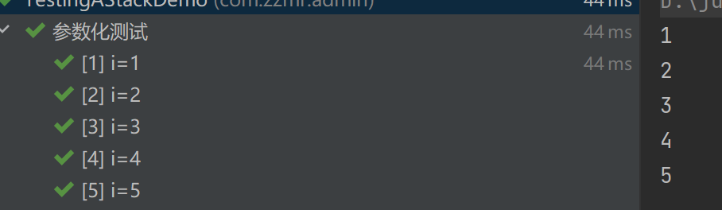 -->


还有@MethodSource

```java
    @ParameterizedTest
    @DisplayName("参数化测试2")
    @MethodSource("stringStreamProvider")
    void testParameterized2(String i) {
        System.out.println(i);
    }

    static Stream<String> stringStreamProvider() {
        return Stream.of("apple", "banana");
    }
```

## 指标监控

没听过的名词

### 1. SpringBoot Actuatot

#### 简介

未来每一个微服务在云上部署以后,我们都需要对其进行监控,追踪,审计,控制等,SpringBoot就抽取了Actuator场景,使得我们每个微服务快速引用即可获得生产级别的应用监控,审计等功能

#### 使用

引入场景

```xml
        <dependency>
            <groupId>org.springframework.boot</groupId>
            <artifactId>spring-boot-starter-actuator</artifactId>
        </dependency>
```

访问http://localhost:8080/actuator/**

有关actuator的配置:

```yml
#    management 是所有actuator的配置
#    manggement.endpoint.端口名.xxx 对某个端点的具体配置
management:
  endpoints:
    enabled-by-default: true #默认开启所有监控端点
    web:
      exposure:
        include: '*'  # 以web方式暴露所有端点
```

暴露所有的端点后,就可以在浏览器访问了,测试bean

<!-- 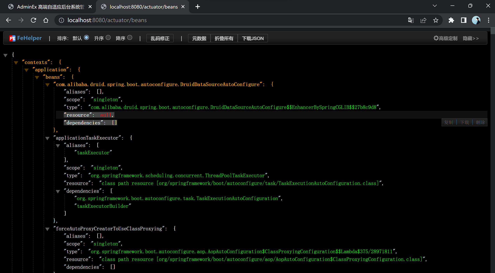 -->


具体有哪些可以访问[点击查看官方文档](https://docs.spring.io/spring-boot/docs/2.4.13/reference/html/production-ready-features.html#production-ready-endpoints-exposing-endpoints)

最常用的:http://localhost:8080/actuator/metrics
然后呢,想访问具体的某一项
就可以在后面拼上路径
http://localhost:8080/actuator/metrics/jvm.buffer.memory.used

<!-- 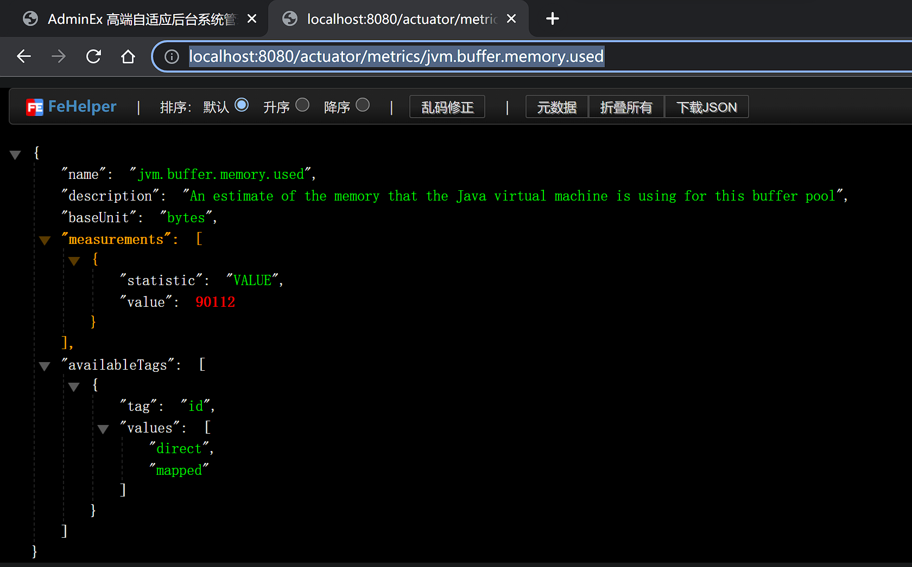 -->


#### Actuator Endpoint

1. 最常用的端点

- **Health** :监控状况
- **Metrics** :运行时指标
- **Loggers** :日志记录

**Health Endpoint**
健康检查端点,我们一般用于在云平台,平台会定时的检查应用的健康状况,我们就需要Health Endpoint可以为平台返回当前应用的一些列组件健康状况的集合
重要的几点:

- health endpoint 返回的结果,应该是一系列健康检查后的一个汇总报告
- 很多的健康检查默认已经自动配置好了,比如:数据库,redis等
- 可以很容易的添加自定义的健康检查机制

但是我们直接访问,只会返回一个up/down
那怎么显示详细信息呢?

```yml
  endpoint:
    health:
      show-details: always
```

配置上这个

<!-- 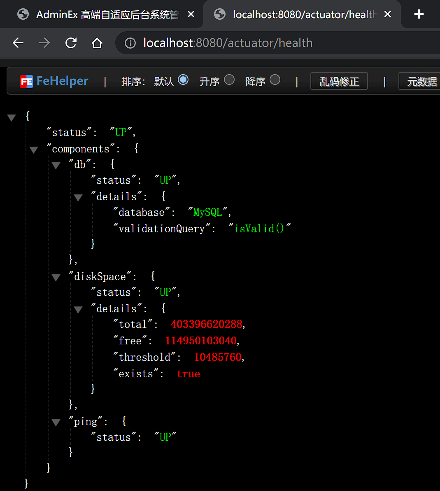 -->


**Metrics Endpoint**
提供详细的,层级的,空间指标信息,这些信息可以被pull(主动推送)或者push(被动获取)方式得到

- 通过Metrics对接多种监控系统
- 简化核心Metrics开发
- 添加自定义Metrics或者扩展已有的Metrics

> 但是,开启所有的端点,可能会不太安全
> 所以可以默认关闭所有的端点
> 需要哪些再开

```yml
#    management 是所有actuator的配置
management:
  endpoints:
    enabled-by-default: false #默认开启所有监控端点
    web:
      exposure:
        include: '*'  # 以web方式暴露所有端点

  endpoint:
    health:
      show-details: always
      enabled: true
    info:
      enabled: true
    beans:
      enabled: true
    metrics:
      enabled: true
```

就比如这样,在每个端点里加上enabled: true就行了

<!-- 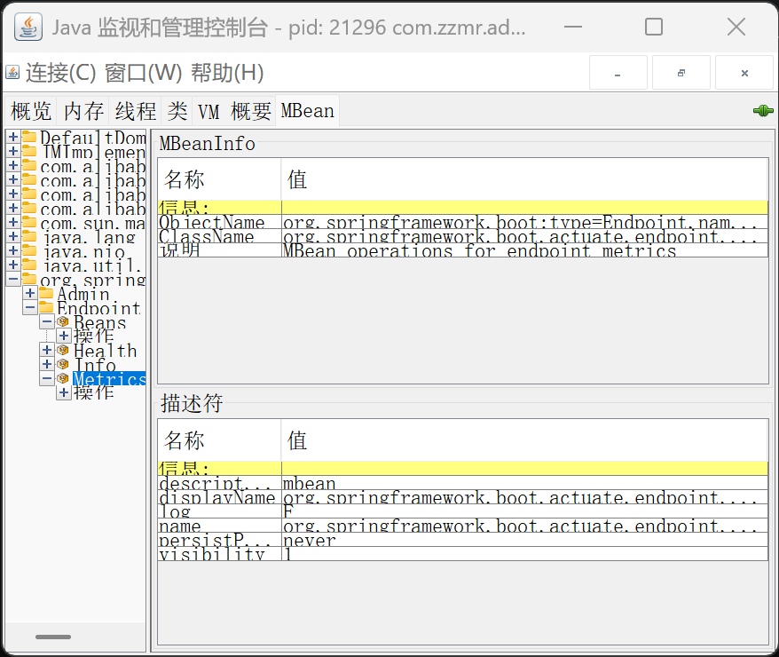 -->


#### 定制Endpoint

**定制Health信息**

写一个配置类:

```java
package com.zzmr.admin.health;

import org.springframework.boot.actuate.health.AbstractHealthIndicator;
import org.springframework.boot.actuate.health.Health;
import org.springframework.boot.actuate.health.Status;
import org.springframework.stereotype.Component;

import java.util.HashMap;
import java.util.Map;

@Component
public class MyComHealthIndicator extends AbstractHealthIndicator {

    /**
     * 编写真实的检查方法
     *
     * @param builder
     * @throws Exception
     */
    @Override
    protected void doHealthCheck(Health.Builder builder) throws Exception {
        // mongodb 获取链接进行测试

        Map<String, Object> map = new HashMap<>();
        // 检查完成
        if (1 == 1) {
            //builder.up();  // 健康
            builder.status(Status.UP);
            map.put("count", 1);
            map.put("ms", 100);
        } else {
            //builder.down();  // 不健康
            builder.status(Status.OUT_OF_SERVICE);
            map.put("err", "连接超时");
            map.put("ms",3000);
        }


        builder.withDetail("code",100).withDetails(map);


    }
}
```

此时再查看health,就能看到myCom

<!-- 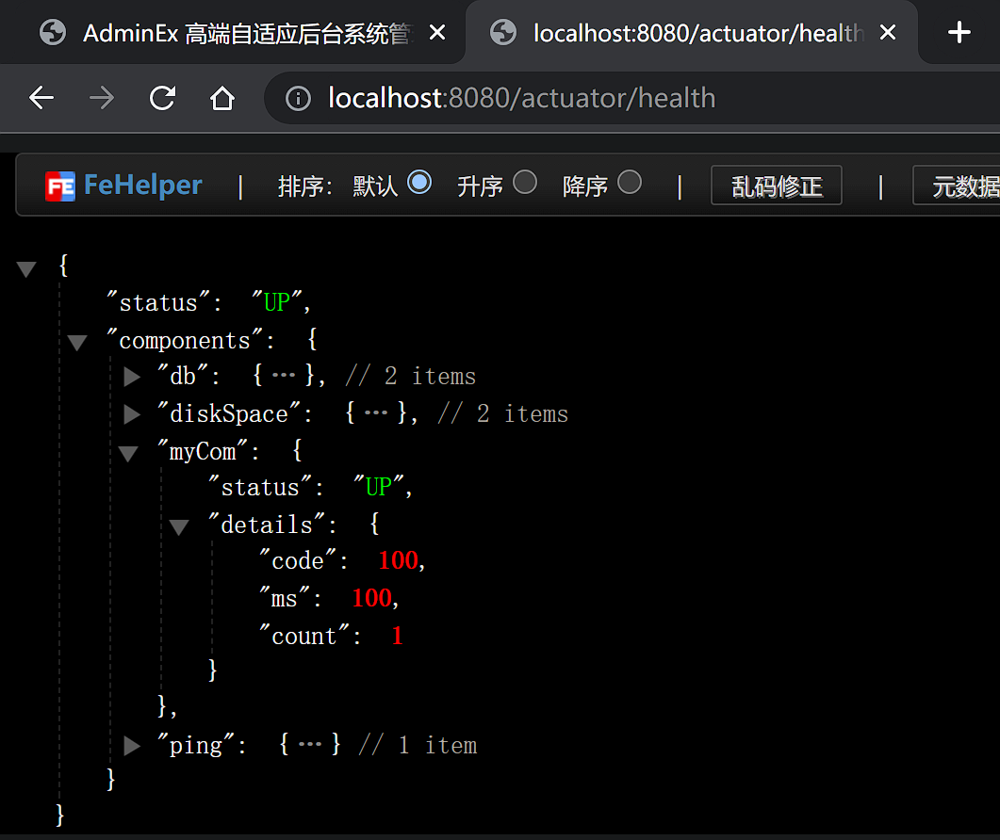 -->


**定制info信息**

```java
package com.zzmr.admin.acutator.info;

import org.springframework.boot.actuate.info.Info;
import org.springframework.boot.actuate.info.InfoContributor;
import org.springframework.stereotype.Component;

import java.util.Collections;

@Component
public class AppInfoInfoContributor implements InfoContributor {

    /**
     * 自己构建info信息
     */
    @Override
    public void contribute(Info.Builder builder) {
        builder.withDetail("msg", "你好").withDetail("hello", "zzmr")
                .withDetails(Collections.singletonMap("world", "666"));
    }
}
```

也可以修改配置文件,但是不出来

```yml
# 下面的不生效，可能是版本更新给修改了
#info:
#  appName: boot-admin
#  appVersion: 1.0.0
#  mavenProjectName: @project.artifactId@
#  mavenProjectVersion: @project.version@
```

**定制Metrics信息**
定制了个啥
哈哈哈哈艹

自定义端点:

```java
package com.zzmr.admin.acutator.endpoint;

import org.springframework.boot.actuate.endpoint.annotation.Endpoint;
import org.springframework.boot.actuate.endpoint.annotation.ReadOperation;
import org.springframework.boot.actuate.endpoint.annotation.WriteOperation;
import org.springframework.stereotype.Component;

import java.util.Collections;
import java.util.Map;

@Component
@Endpoint(id = "myservice")
public class MyServiceEndPoint {
    @ReadOperation
    public Map getDockerInfo(){
        // 端点的读操作
        return Collections.singletonMap("dockInfo","docker started...");
    }

    @WriteOperation
    public void stop(){
        System.out.println("docker stopper...");
    }
}
```

这个自定义的断电不参与配置文件中的开启或者关闭

#### 可视化

竟然新建了一个项目
只选中了web一个场景
导入了一个场景:

```xml
        <dependency>
            <groupId>de.codecentric</groupId>
            <artifactId>spring-boot-admin-starter-server</artifactId>
            <version>2.7.9</version>
        </dependency>
```

给主方法类上加上一个注解:@EnableAdminServer

```java
package com.zzmr.boot;

import de.codecentric.boot.admin.server.config.EnableAdminServer;
import org.springframework.boot.SpringApplication;
import org.springframework.boot.autoconfigure.SpringBootApplication;

@SpringBootApplication
@EnableAdminServer
public class Boot05AdminserverApplication {

    public static void main(String[] args) {
        SpringApplication.run(Boot05AdminserverApplication.class, args);
    }

}
```

然后,就直接运行项目
访问http://localhost:8888/applications
就行了

哦,这个新建的项目属于是一个服务器,专门用于监控

然后又回到原来的项目
此时导入依赖

```xml
        <dependency>
            <groupId>de.codecentric</groupId>
            <artifactId>spring-boot-admin-starter-client</artifactId>
            <version>2.7.9</version>
        </dependency>
```

这个属于是客户端依赖:client

然后到配置文件中:

```yml
  boot:
    admin:
      client:
        url: http://localhost:8888
        instance:
          prefer-ip: true
```

就是指定要发送到哪个url里(服务器在哪)

**记得要开启那个全部端点**

<!-- 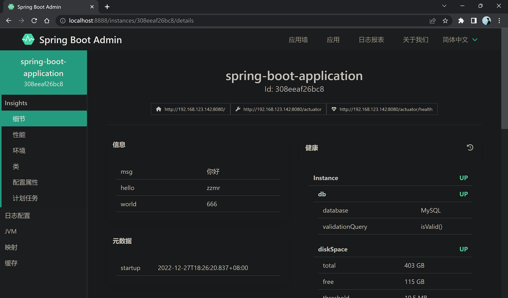 -->


## 原理解析

到最后了,看看能不能今天晚上就看完(2022年12月27日 18点33分)

### Profile功能

为了方便多环境适配,springboot简化了profile功能

说白了就是写多套配置文件,生产环境一套,开发环境一套,切换的时候比较方便,不用一个一个改
[官方文档](https://docs.spring.io/spring-boot/docs/2.4.13/reference/html/spring-boot-features.html#boot-features-profiles)

#### application-profile功能

具体实现:

创建一个项目,然后创建一个controller

```java
package com.example.boot.controller;

import org.springframework.beans.factory.annotation.Value;
import org.springframework.web.bind.annotation.GetMapping;
import org.springframework.web.bind.annotation.RestController;

@RestController
public class HelloController {

    @Value("${person.name:李四}")
    private String name;


    @GetMapping("/")
    public String hello() {
        return "hello " + name;
    }

}
```

实现的功能就是,name从配置文件中取,@Value("${person.name:李四}"),就代表从配置文件中取,没有值的话,就用默认值李四

然后写两个配置文件:

<!-- 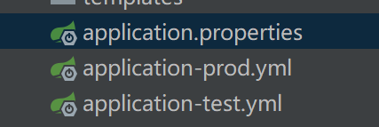 -->


application-prod.yml(生产环境的配置文件)

```yml
person:
  name: prod-张三
```

application-test.yml(测试环境的配置文件)

```yml
person:
  name: test-张三
```

这时,直接访问/会提示是李四,因为是使用的默认值

如果在properties中更改为:spring.profiles.active=prod
就代表使用prod生产环境的配置文件
同理
spring.profiles.active=test就是使用测试环境的配置文件

> 规则
> 默认配置与环境配置同时生效,同名配置项,profile配置优先

而激活指定环境,要么在配置文件中写spring.profiles.active=xxx
要么使用命令行,使用命令行时 java -jar xxxx.jar --spring.profile.active=xxx
这时也可以指定配置文件
**命令行甚至能修改配置文件的任意值,命令行优先**

#### @Profile条件装配功能

比如一个配置类,在方法上注明@Profile("xxx"),就代表该环境下这个方法才生效

```java
package com.example.boot.config;

import com.example.boot.bean.Color;
import org.springframework.context.annotation.Bean;
import org.springframework.context.annotation.Configuration;
import org.springframework.context.annotation.Profile;

@Configuration
public class MyConfig {

    @Profile("prod")
    @Bean
    public Color red() {
        return new Color();
    }

    @Profile("test")
    @Bean
    public Color green() {
        return new Color();
    }

}
```

可以标注在类上,比如这个Boss类,就是测试环境下生效

```java
package com.example.boot.bean;

import lombok.Data;
import org.springframework.boot.context.properties.ConfigurationProperties;
import org.springframework.context.annotation.Profile;
import org.springframework.stereotype.Component;

@Profile("test")  //  测试环境下才生效
@Component
@Data
@ConfigurationProperties("person")
public class Boss implements Person{

    private String name;

    private Integer age;

}
```

这个worker就是生产环境下才生效

```java
package com.example.boot.bean;

import lombok.Data;
import org.springframework.boot.context.properties.ConfigurationProperties;
import org.springframework.context.annotation.Profile;
import org.springframework.stereotype.Component;

@Profile("prod")  // 指定，prod时，下面的才生效
@Data
@ConfigurationProperties("person")
@Component
public class Worker implements Person {

    private String name;

    private Integer age;


}
```

#### Profile分组功能

暂时用不到

### 外部化配置

也是暂时用不大的内容

这几天阳了
不在状态,原本早该结束了
害

### 自定义starter

**一个场景启动器,里面是不含源码的,里面只是标识这个启动器有哪些依赖**

<!-- 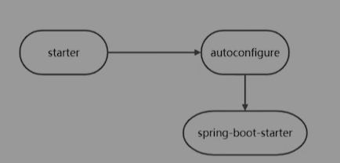 -->


笑死
问题是这个笔记是真不多知道怎么该怎么记

把视频链接放着吧
[自定义starter细节](https://www.bilibili.com/video/BV19K4y1L7MT?p=83&vd_source=5815ab19beeaab6a8ea7a561cba20233)

### SpringBoot启动原理

1. 创建SpringApplication
   1. 保存一些信息
   2. 判定当前应用的类型,ClassUtils,Servlet
   3. bootstrappers 初始启动引导器(List `<Bootstrpper>` )去spring.factories文件中找
      - org.springframework.boot,Bootstrapper
   4. 找ApplicationContextInitializer;也是去spring.factories找 ApplicationContextInitialize
      - List<ApplicationContextInitialize<?>> initializers
   5. 找ApplicationListener;应用监听器,去spring.factories找ApplicationListener
      - List<ApplicationListener<?>> listeners
2. 运行SpringApplicaiton
    - StopWatch(新版没有这个了，是直接计时的)
    - 记录应用的启动时间
    - 创建引导上下文(Context环境) createBootstrapContext()
        - 获得到所有之前的bootstrappers挨个执行initialize()来完成对引导启动器上下文环境设置
    - 让当前应用进入headless模式,java.awt.headless
    - **获取所有的RunListener(运行监听器)**,为了方便所有Listener进行事件绑定
        - getSpringFactoriesInstances去spring.factories找 **SpringApplicationRunListener**.class
        - 遍历SpringApplicationRunListener调用starting方法
        - 相当于通知所有感兴趣系统正在启动过程的人,项目正在starting
    - 事到如今,我终于知道args是什么了,原来是命令行传入的参数
    - 保存命令行参数:ApplicationArguments
    - 准备环境prepareEnvironment()
        - 返回或者创建基础信息StandardServletEnvironment
        - 配置环境信息对象
            - 读取所有配置源的配置属性值
        - 绑定环境信息
        - 监听器调用environmentPrepared,通知所有的监听器当前环境主备完成
    - 创建IOC容器(createApplicationContext())
        - 根据项目类型(servlet)创建容器
        - 当前会创建AnnotationConfigServletWebServerApplicationContext()
    - 准备ApplicationContext IOC容器的基本信息 prepareContext()
        - 保存环境信息
        - IOC容器的后置处理流程
        - 应用初始化器applyInitializers()
            - 遍历所有的ApplicationContextInitializer,调用initialize,来对ioc容器进行初始化扩展功能
            - 遍历所有的Listener调用contextPrepared,EvenPublishRunListener 通知所有的监听器 contextPrepared
        - 所有的监听器调用contextLoaded 通知所有的监听器 contextPrepared
    - 刷新IOC容器 refreshContext
        - 创建容器中的所有组件
    - 容器刷新完成后afterRefresh
    - 所有监听器调用listeners.started(context) 通知所有的监听器started
    - 调用所有的runners callRunners()
        - 获取容器中的ApplicationRunner
        - 获取容器中的CommandLineRunner
        - 合并所有runner并且按照@Order进行排队
        - 遍历所有的runner,调用run方法
    - 如果以上有异常
        - 调用Listener的failed
    - 调用所有监听器的running方法 listeners.running(context)   通知所有的监听器 running
    - running如果有问题,继续通知failed,调用Listener的failed;通知所有的监听器failed


好了
结束了

但没完全结束
>**纸上得来终觉浅，绝知此事要躬行**
2022年12月30日 11点57分
