# SSM

**2022年8月21日 10点42分**
加油
Spring+SpringMVC+Mybatis
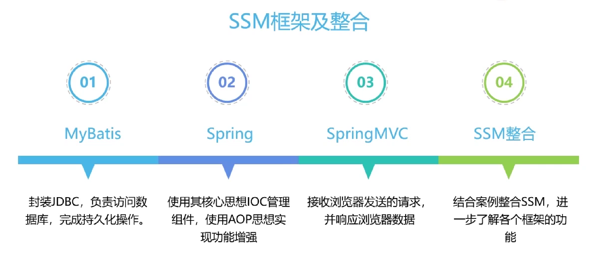

## MyBatis

### 1.MyBatis简介

#### 1.1 MyBatis历史

MyBatis最初是Apache的一个开源项目iBatis,后来更名为MyBatis
iBatis一词来源于"internet"和"abatis"的组合,是一个基于Java的持久层框架,iBatis提供的持久层框架包括SQL Maps和Data Access Objects(DAO)

#### 1.2 MyBatis特性

1. MyBatis是支持定制化SQL,存储过程以及高级映射的优秀持久层框架
2. MyBatis避免了几乎所有的JDBC代码和手动设置参数以及获取结果集
3. MyBatis可以使用简单的XML或注解用于配置和原始映射,将接口和Java的pojo(Plain Old Java Objects 普通的Java对象) 映射成数据库中的记录
4. MyBatis是一个半自动的ORM(Object Relation Mapping) 框架

#### 1.3 MyBatis下载

https://github.com/mybatis/mybatis-3
链接在这,打开官网就可以下,已经存到阿里云盘了
DNS污染搞得我这电脑根本打不开GitHub,还必须用手机打开...

#### 1.4 和其他持久化层技术对比

- JDBC
  - SQL夹杂在Java代码中耦合度高,导致硬编码内伤
  - 维护不易且实际开发需求中SQL有变化,频繁修改的情况多见
  - 代码冗长,开发效率低
- Hibernate和JPA
  - 操作简单,开发效率高
  - 程序中的长难复杂SQL需要绕过框架
  - 内部自动生产的SQL,不容易做特殊优化
  - 基于全映射的全自动框架,大量字段的POJO进行部分映射时比较困难
  - 反射操作太多,导致数据库性能下降
- MyBatis
  - 轻量级,性能出色
  - **SQL和Java编码分开**,功能边界清晰,Java代码专注业务,SQL语句专注数据
  - 开发效率略逊于Hibernate,但是完全能够接受

### 2. 搭建MyBatis

**注意事项**
我还是用Mysql 8 吧,毕竟一直用的都是8
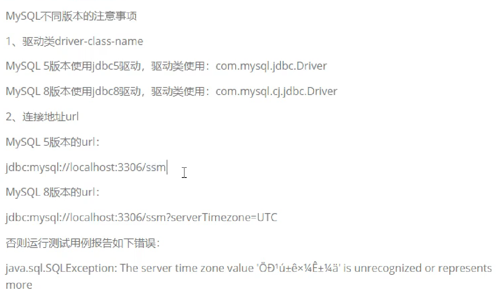
阿哲,发先学这个要有Maven基础啊,我都没学过Maven,不说了,先去学Maven了

2022年8月23日 03点24分
我回来了！
虽然是三更半夜哈哈哈
暂时没问题：
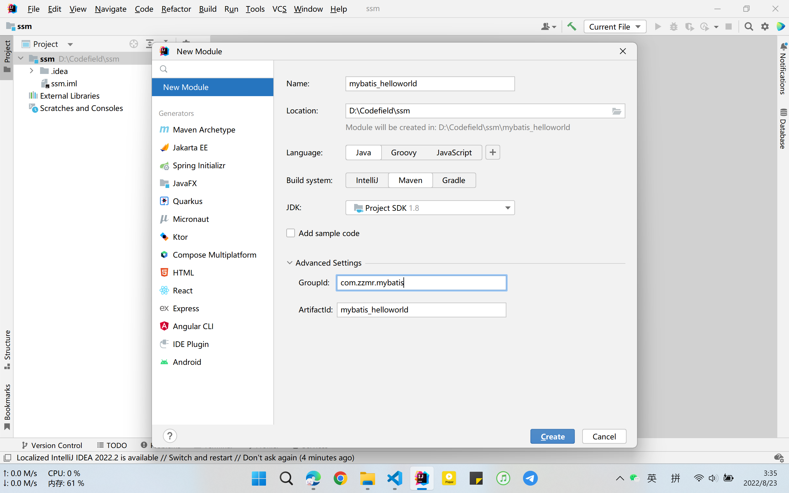
点一下右上角的M()就可以下载jar包
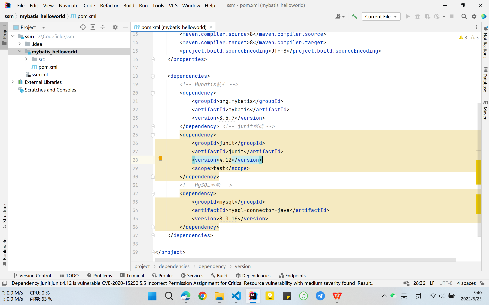

**建表是用软件建的**:
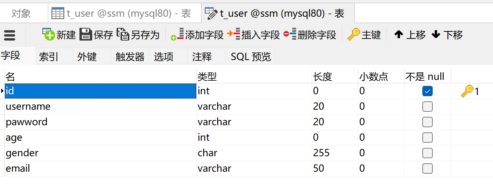

<!--  -->

ssm库建了,t_user表建了,都是用图形化界面建的,效率比命令行高啊
com.zzmr.mybatis.pojo.User.java类也建好了
嗯

#### 创建MyBatis的核心配置文件

习惯上命名为mybatis-config.xml这个文件名仅仅是建议,并非强制要求.将来整合Spring之后,这个配置文件可以省略,所以无关紧要.
核心配置文件主要用于配置连接数据库的环境以及MyBatis的全局配置信息
核心配置文件存放的位置是src/main/resources

```xml
<?xml version="1.0" encoding="UTF-8" ?> <!DOCTYPE configuration PUBLIC "-//mybatis.org//DTD Config 3.0//EN"
        "http://mybatis.org/dtd/mybatis-3-config.dtd">
<configuration> <!--设置连接数据库的环境-->


<!-- 配置连接数据库的环境-->
    <environments default="development">
        <environment id="development">
            <transactionManager type="JDBC"/>
            <dataSource type="POOLED">
                <property name="driver" value="com.mysql.cj.jdbc.Driver"/>
                <property name="url" value="jdbc:mysql://localhost:3306/ssm?serverTimezone=UTC"/>
                <property name="username" value="root"/>
                <property name="password" value="010203"/>
            </dataSource>
        </environment>
    </environments> <!--引入映射文件-->

<!--    引入mybatis的映射文件-->
<!-- 在下面写着呢 -->
    <mappers>
        <mapper resource="mappers/UserMapper.xml"/>
    </mappers>
</configuration>
```

#### 创建mapper接口

Mybatis中的mapper接口相当于以前的dao,但是区别在于,mapper仅仅是接口,我们不需要提供实现类

```java
package com.zzmr.mybatis.mapper;


public interface UserMapper {

    int insertUser();

}
```

#### 创建MyBatis的映射文件

相关概念:ORM(Object Relationship Mapping)对象关系映射

- 对象: Java的实体类对象
- 关系:关系型数据库
- 映射:二者之间的对应关系

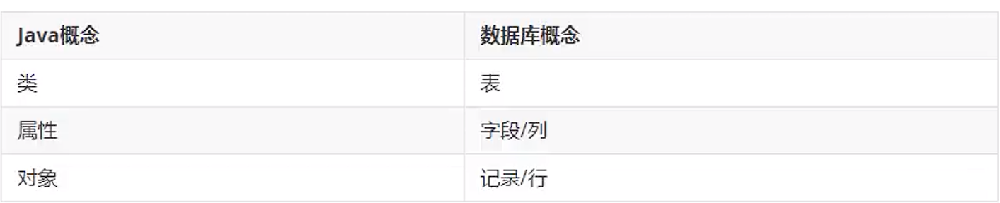

<!--  -->

UserMapper.xml

```xml
<?xml version="1.0" encoding="UTF-8" ?> <!DOCTYPE mapper PUBLIC "-//mybatis.org//DTD Mapper 3.0//EN"
        "http://mybatis.org/dtd/mybatis-3-mapper.dtd">

<mapper namespace="com.zzmr.mybatis.mapper.UserMapper">


    <!--
            mapper接口和映射文件要保证两个一致
            1. mapper接口的全类名和映射文件的namespace一致
            2，mapper接口中的方法名要和映射文件的sql的id保持一致
    -->


    <!--int insertUser();-->
    <insert id="insertUser">
        insert into t_user values (null,'admin','123456',23,'男','123456@qq.com')
    </insert>
</mapper>
```

#### 测试

```java
package com.zzmr.mybatis.test;

import com.zzmr.mybatis.mapper.UserMapper;
import com.zzmr.mybatis.pojo.User;
import org.apache.ibatis.io.Resources;
import org.apache.ibatis.session.SqlSession;
import org.apache.ibatis.session.SqlSessionFactory;
import org.apache.ibatis.session.SqlSessionFactoryBuilder;
import org.junit.Test;

import java.io.IOException;
import java.io.InputStream;

public class MyBatisTest {

    @Test
    public void testInsert() throws IOException {

        //    获取核心配置文件的输入流
        InputStream is = Resources.getResourceAsStream("mybatis-config.xml");
        //    获取SqlSessionFactoryBuilder对象
        SqlSessionFactoryBuilder sqlSessionFactoryBuilder = new SqlSessionFactoryBuilder();
        //    获取SqlSessionFactory对象
        SqlSessionFactory sqlSessionFactory = sqlSessionFactoryBuilder.build(is);
        //    获取sql会话对象SqlSession   是MyBatis提供的操作数据库的对象
        //SqlSession sqlSession = sqlSessionFactory.openSession();
        //有参设置，填true，即可实现自动提交，不用写   sqlSession.commit();
        SqlSession sqlSession = sqlSessionFactory.openSession(true);


        //    获取UserMapper的代理实现对象
        //      常用的方法
        UserMapper mapper = sqlSession.getMapper(UserMapper.class);
        //    调用mapper接口中的方法，实现添加用户信息的功能
        int result = mapper.insertUser();

        //提供sql以及语句的唯一标识找到sql并执行    唯一标识：namespace.sqlId
        //不常用的方法
        //int result = sqlSession.insert("com.zzmr.mybatis.mapper.UserMapper.insertUser");

        System.out.println("结果：" + result);
        //提交事务
        //sqlSession.commit();

        //开启自动提交就行了

        //关闭sqlSession
        sqlSession.close();
    }

}

```

得到结果:
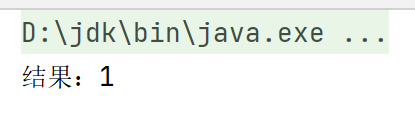

**截断表跟清空表不一样，如果有自增的id属性，截断表会重置该id，而清空表不会**

添加log4j依赖：
在pom.xml中添加:

```xml
        <!-- log4j日志 -->
        <dependency>
            <groupId>log4j</groupId>
            <artifactId>log4j</artifactId>
            <version>1.2.17</version>
        </dependency>
```

然后再resources中新建:log4j.xml

```xml
<?xml version="1.0" encoding="UTF-8" ?> <!DOCTYPE log4j:configuration SYSTEM "log4j.dtd">
<log4j:configuration xmlns:log4j="http://jakarta.apache.org/log4j/">
    <appender name="STDOUT" class="org.apache.log4j.ConsoleAppender">
        <param name="Encoding" value="UTF-8"/>
        <layout class="org.apache.log4j.PatternLayout">
            <param name="ConversionPattern" value="%-5p %d{MM-dd HH:mm:ss,SSS} %m (%F:%L) \n"/>
        </layout>
    </appender>
    <logger name="java.sql">
        <level value="debug"/>
    </logger>
    <logger name="org.apache.ibatis">
        <level value="info"/>
    </logger>
    <root>
        <level value="debug"/>
        <appender-ref ref="STDOUT"/>
    </root>
</log4j:configuration>
```

笑死,全屏截图,会把副屏的内容也截进去
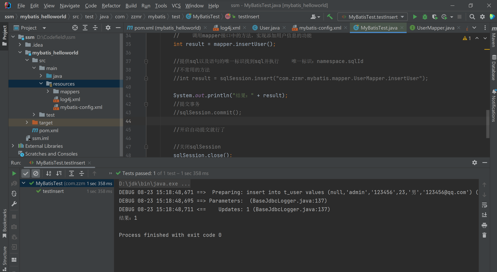

log4j日志的级别:
**FATAL(致命)>ERROR(错误)>WARN(警告)>INFO(信息)>DEBUG(调试)
从左到右打印的内容越来越详细**

**修改和删除用户的功能**

#### 创建SqlSessionUtil工具类

```java
package com.zzmr.mybatis.utils;

import org.apache.ibatis.io.Resources;
import org.apache.ibatis.session.SqlSession;
import org.apache.ibatis.session.SqlSessionFactory;
import org.apache.ibatis.session.SqlSessionFactoryBuilder;

import java.io.IOException;
import java.io.InputStream;

public class SqlSessionUtil {


    public static SqlSession getSqlSession() {
        SqlSession sqlSession = null;
        //    获取核心配置文件的输入流
        try {
            InputStream is = Resources.getResourceAsStream("mybatis-config.xml");
            //    获取SqlSessionFactoryBuilder对象
            SqlSessionFactoryBuilder sqlSessionFactoryBuilder = new SqlSessionFactoryBuilder();
            //    获取SqlSessionFactory
            SqlSessionFactory sqlSessionFactory = sqlSessionFactoryBuilder.build(is);
            //    获取SqlSession对象
            //    设置自动提交
            sqlSession = sqlSessionFactory.openSession(true);
            //

        } catch (IOException e) {
            e.printStackTrace();
        }
        return sqlSession;
    }
}
```

过程是什么?
先去创建SqlSession,然后去创建接口,再去UserMapper.xml中添加Sql语句
最后在测试类里实现

在接口中添加字段:

```java
    /**
     * 修改用户信息
     */
    void updateUser();
```

然后在UserMapper.xml中配置:

```xml
<!--    void updateUser();-->
    <update id="updateUser">
        update t_user set username='root',password='123' where id = 3;
    </update>
```

因为目前没有学到后面的东西,现在的sql语句都是写死的

然后在测试类中测试即可

```java
    @Test
    public void testUpdate(){
        //获取SqlSession
        SqlSession sqlSession = SqlSessionUtil.getSqlSession();

        UserMapper mapper = sqlSession.getMapper(UserMapper.class);
        mapper.updateUser();
        sqlSession.close();
    }
```

很简单,删除操作自己写的:

1. 首先是接口

```java
    /**
     * 删除用户
     */
    void deleteUser();
```

2. UserMapper.xml

```xml
<!--    void deleteUser();-->
    <delete id="deleteUser">
        delete from t_user where id = 4;
    </delete>
```

3. test

```java
    @Test
    public void testDelete(){
    //    获取SqlSession
        SqlSession sqlSession = SqlSessionUtil.getSqlSession();

        UserMapper mapper = sqlSession.getMapper(UserMapper.class);
        mapper.deleteUser();
        SqlSession.close();
    }
```

**测试查询功能**

1. 查询一条数据
   首先是接口

```java

    /**
     * 根据Id查询 用户信息
     * @return 是User对象
     */
    User getUserById();
```

其次是UserMapper.xml

```xml
<!--    User getUserById();-->
<!--    resultType 设置结果集类型，既查询的数据要转化为的java类型-->
<!--    resultMap： 自定义映射，处理多对一或一对多的映射关系 -->
    <select id="getUserById" resultType="com.zzmr.mybatis.pojo.User">
        select * from t_user where id = 1;
    </select>
```

然后是测试:

```java
    @Test
    public void testGetUserById() {
        SqlSession sqlSession = SqlSessionUtil.getSqlSession();

        UserMapper mapper = sqlSession.getMapper(UserMapper.class);
        User user = mapper.getUserById();
        System.out.println(user);

    }
```

控制台输出结果:

```
DEBUG 08-23 16:22:11,371 ==>  Preparing: select * from t_user where id = 1; (BaseJdbcLogger.java:137) 
DEBUG 08-23 16:22:11,393 ==> Parameters:  (BaseJdbcLogger.java:137) 
DEBUG 08-23 16:22:11,412 <==      Total: 1 (BaseJdbcLogger.java:137) 
User{id=1, username='admin', password='123456', age=23, gender='男', email='123456@qq.com'}
```

2. 查询多条数据

接口:

```java
    /**
     * 查询所有用户信息
     * @return
     */
    List<User> getAllUser();
```

UserMapper.xml

```xml
<!--    List<User> getAllUser();-->
    <select id="getAllUser" resultType="com.zzmr.mybatis.pojo.User">
        select *
        from t_user;
    </select>
```

test

```java
    @Test
    public void testGetAllUser() {
        SqlSession sqlSession = SqlSessionUtil.getSqlSession();

        UserMapper mapper = sqlSession.getMapper(UserMapper.class);

        List<User> allUser = mapper.getAllUser();
        allUser.forEach(System.out::println);
        sqlSession.close();

    }
```

得到表中的全部数据:

```
DEBUG 08-23 16:30:34,972 ==>  Preparing: select * from t_user; (BaseJdbcLogger.java:137) 
DEBUG 08-23 16:30:34,994 ==> Parameters:  (BaseJdbcLogger.java:137) 
DEBUG 08-23 16:30:35,016 <==      Total: 3 (BaseJdbcLogger.java:137) 
User{id=1, username='admin', password='123456', age=23, gender='男', email='123456@qq.com'}
User{id=2, username='admin', password='123456', age=23, gender='男', email='123456@qq.com'}
User{id=5, username='zzmr', password='123456', age=23, gender='男', email='123456@qq.com'}
```

#### 核心配置文件

```xml
<?xml version="1.0" encoding="UTF-8" ?> <!DOCTYPE configuration PUBLIC "-//mybatis.org//DTD Config 3.0//EN"
        "http://mybatis.org/dtd/mybatis-3-config.dtd">
<configuration> <!--设置连接数据库的环境-->


<!--    引入properties文件，此后就可在当前文件中使用${key} 来访问 value -->
    <properties resource="jdbc.properties">

    </properties>

<!-- 配置连接数据库的环境-->
<!--  environments : 配置连接数据库的环境
      属性：
      default 设置默认使用的环境的id
-->
    <environments default="development">
<!--     environment 设置一个具体的连接数据库的环境
         属性：
         id  设置环境的唯一标识，不能重复
   -->
        <environment id="development">

<!--            transactionManager 设置事务管理器
                属性
                type 设置事务管理的方式
                type="JDBC/MANAGED"
                JDBC:表示使用 JDBC中原生的事务管理方式
                MANAGED:表示 被管理，例如 Spring
-->
            <transactionManager type="JDBC"/>
<!--    dataSource 设置数据源
        属性
        type  设置数据源的类型
        type=POOLED\UNPOOLED\JNDI
        POOLED 表示使用数据库连接池
        UNPOOLED 表示不使用数据库连接池
        JNDI    表示使用上下文中的数据源（了解）
-->
            <dataSource type="POOLED">
                <property name="driver" value="${jdbc.driver}"/>
                <property name="url" value="${jdbc.url}"/>
                <property name="username" value="${jdbc.username}"/>
                <property name="password" value="${jdbc.password}"/>
            </dataSource>
        </environment>

        <environment id="test">
            <transactionManager type="JDBC"/>
            <dataSource type="POOLED">
                <property name="driver" value="com.mysql.cj.jdbc.Driver"/>
                <property name="url" value="jdbc:mysql://localhost:3306/ssm?serverTimezone=UTC"/>
                <property name="username" value="root"/>
                <property name="password" value="010203"/>
            </dataSource>
        </environment>
    </environments>


<!--    引入mybatis的映射文件-->
    <mappers>
        <mapper resource="mappers/UserMapper.xml"/>
    </mappers>
</configuration>
```

在resources目录下新建 jdbc.properties

```properties
jdbc.driver=com.mysql.cj.jdbc.Driver
jdbc.url=jdbc:mysql://localhost:3306/ssm?serverTimezone=UTC
jdbc.username=root
jdbc.password=010203
```

最终版的mybatis-config.xml

```xml
<?xml version="1.0" encoding="UTF-8" ?> <!DOCTYPE configuration PUBLIC "-//mybatis.org//DTD Config 3.0//EN"
        "http://mybatis.org/dtd/mybatis-3-config.dtd">
<configuration> <!--设置连接数据库的环境-->


    <!--    MyBtatis 核心配置文件中的标签必须要按照指定的顺序配置-->
    <!--    The content of element type "configuration" must match
    "(properties?,settings?,typeAliases?,typeHandlers?,objectFactory?,
    objectWrapperFactory?,reflectorFactory?,plugins?,environments?,databaseIdProvider?,mappers?)"-->


    <!--    引入properties文件，此后就可在当前文件中使用${key} 来访问 value -->
    <properties resource="jdbc.properties"/>


<!--    设置类型别名：即为某个具体的类型，设置一个别名
在MyBatis的范围中就可以使用别名表示一个具体的类型
        -->
    <typeAliases>
<!--        type 设置需要起别名的类型
alias   设置某个类型的别名
-->
<!--        <typeAlias type="com.zzmr.mybatis.pojo.User" alias="abc"></typeAlias>-->
<!--        如果不写，系统会自动生成别名，也就是类名，且不区分大小写-->
<!--        <typeAlias type="com.zzmr.mybatis.pojo.User"></typeAlias>-->
<!--    通过包设置类型别名，指定包下所有的类拥有默认的别名    -->
        <package name="com.zzmr.mybatis.pojo"/>
    </typeAliases>


    <!-- 配置连接数据库的环境-->
    <!--  environments : 配置连接数据库的环境
          属性：
          default 设置默认使用的环境的id
    -->
    <environments default="development">
        <!--     environment 设置一个具体的连接数据库的环境
                 属性：
                 id  设置环境的唯一标识，不能重复
           -->
        <environment id="development">

            <!--            transactionManager 设置事务管理器
                            属性
                            type 设置事务管理的方式
                            type="JDBC/MANAGED"
                            JDBC:表示使用 JDBC中原生的事务管理方式
                            MANAGED:表示 被管理，例如 Spring
            -->
            <transactionManager type="JDBC"/>
            <!--    dataSource 设置数据源
                    属性
                    type  设置数据源的类型
                    type=POOLED\UNPOOLED\JNDI
                    POOLED 表示使用数据库连接池
                    UNPOOLED 表示不使用数据库连接池
                    JNDI    表示使用上下文中的数据源（了解）
            -->
            <dataSource type="POOLED">
                <property name="driver" value="${jdbc.driver}"/>
                <property name="url" value="${jdbc.url}"/>
                <property name="username" value="${jdbc.username}"/>
                <property name="password" value="${jdbc.password}"/>
            </dataSource>
        </environment>

        <environment id="test">
            <transactionManager type="JDBC"/>
            <dataSource type="POOLED">
                <property name="driver" value="com.mysql.cj.jdbc.Driver"/>
                <property name="url" value="jdbc:mysql://localhost:3306/ssm?serverTimezone=UTC"/>
                <property name="username" value="root"/>
                <property name="password" value="010203"/>
            </dataSource>
        </environment>
    </environments>


    <!--    引入mybatis的映射文件-->
    <mappers>
<!--        <mapper resource="mappers/UserMapper.xml"/>-->
<!--        以包的方式引入映射文件，但是必须满足两个条件
            1. mapper接口和映射文件所在的包必须一致
            2. mapper接口的名字和映射文件的名字必须一致
-->
        <package name="com.zzmr.mybatis.mapper"/>
    </mappers>
</configuration>
```

#### 在idea中能够创建mybatis核心配置文件和映射文件的模板

就是搞个模板啦，没什么难的 mybatis-config
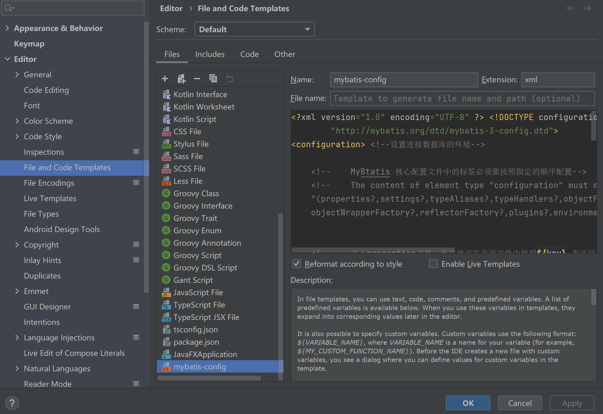
就这样，然后就是把

```xml
    <typeAliases>
        <package name=""/>
    </typeAliases>

    <!--    引入mybatis的映射文件-->
    <mappers>
        <package name=""/>
    </mappers>

```

就这两个标签,空出来,因为后面的应用不可能完全一样的.

还有这个mybatis-mapper  该空的就空

```xml
<?xml version="1.0" encoding="UTF-8" ?> <!DOCTYPE mapper PUBLIC "-//mybatis.org//DTD Mapper 3.0//EN"
        "http://mybatis.org/dtd/mybatis-3-mapper.dtd">

<mapper namespace="">
  
</mapper>
```

说实话到目前为止还没有什么难得

下面使用模板搭建MyBatis框架

很简单,没难度
后面就开始深入了

### MyBatis获取参数值的两种方式

MyBatis获取参数的两种形式  ${}和#{}
${}本质上就是字符串的拼接,#{}的本质就是占位符赋值
${}使用字符串拼接的方式拼接sql,若为字符串类型或日期类型的字段进行赋值时,需要手动加单引号;但是#{}使用占位符赋值的方式拼接sql,此时为字符串类型或日期类型的字符案进行赋值时,可以自动添加单引号

#### 单个字面量类型的参数

若mapper接口中的方法参数为单个的字面量类型,此时可以使用${}和#{}以任意的名称获取参数的值,注意${}需要手动单引号

UserMapper.xml

```xml
<?xml version="1.0" encoding="UTF-8" ?> <!DOCTYPE mapper PUBLIC "-//mybatis.org//DTD Mapper 3.0//EN"
        "http://mybatis.org/dtd/mybatis-3-mapper.dtd">

<mapper namespace="com.zzmr.mybatis.mapper.UserMapper">

<!--        User getUserByUsername(String username);-->
<!--    select * from t_user where username = #{username}-->
    <select id="getUserByUsername" resultType="User">
        select * from t_user where username = '${username}'
    </select>
</mapper>
```

测试

```java
    @Test
    public void testGetUserByUsername(){
        SqlSession sqlSession = SqlSessionUtil.getSqlSession();

        UserMapper mapper = sqlSession.getMapper(UserMapper.class);
        User user = mapper.getUserByUsername("admin");
        System.out.println(user);
    }
```

**还有什么多个字面量类型的参数/map集合类型的参数/实体类类型的参数/使用@Param表示参数,都在下面最终版里面了**
最终版：
UserMapper.java

```java
package com.zzmr.mybatis.mapper;

import com.zzmr.mybatis.pojo.User;
import org.apache.ibatis.annotations.Param;

import java.util.Map;


/**
 * MyBatis获取参数值的两种方式  #{}  ${}
 * <p>
 * 一  若mapper接口方法的参数为单个的字面量类型
 * 此时可以通过上面两种方式以任意的内容获取参数值，一定要注意${}的单引号问题
 * <p>
 * 二  若mapper接口方法的参数为多个的字面量类型
 * 此时MyBatis会将参数放在map集合中，以两种方式存储数据
 * 1.  arg0,arg1...为键  以参数为值
 * 2.  param1 ,param2....   为键，以参数为值
 * 因此，只需要通过#{}和${}访问map集合的键 就可以获取相对应的值
 * <p>
 * 三  若map接口的参数为一个map集合类型的参数
 * 只需要通过#{}和${}访问map集合的键 就可以获取相对应的值
 * <p>
 * 四  若mapper接口方法的参数为实体类类型的参数
 * 只需要通过#{}和${}访问实体类中的属性名，就可以获取相对应的属性值
 * <p>
 * 五  可以在mapper接口方法的参数上设置@param注解
 * 此时MyBatis将会将这些参数放在map中，以两种方式进行存储
 * 1. 以@Param注解的value属性值为键，以参数为值
 * 2. 以param1，param2... 为键，以参数为值
 *
 *
 * 其实重要就时实体类型的参数    还有就是注解
 */

public interface UserMapper {

    /**
     * 根据用户名查询用户信息
     */
    User getUserByUsername(String username);


    /**
     * 验证登录
     *
     * @param username
     * @param password
     * @return
     */
    User checkLogin(String username, String password);


    /**
     * 验证的路（以map集合作为参数）
     *
     * @param map
     * @return
     */
    User checkLoginByMap(Map<String, Object> map);


    /**
     * 添加用户信息的功能
     *
     * @param user
     */
    void insertUser(User user);

    /**
     * 验证登录，使用@param注解
     *
     * @param username
     * @param password
     * @return
     */
    User checkLoginByParam(@Param("username") String username, @Param("password") String password);

}
```

UserMapper.xml

```xml
<?xml version="1.0" encoding="UTF-8" ?> <!DOCTYPE mapper PUBLIC "-//mybatis.org//DTD Mapper 3.0//EN"
        "http://mybatis.org/dtd/mybatis-3-mapper.dtd">

<mapper namespace="com.zzmr.mybatis.mapper.UserMapper">

<!--        User getUserByUsername(String username);-->
<!--    select * from t_user where username = #{username}-->
    <select id="getUserByUsername" resultType="User">
        select * from t_user where username = '${username}'
    </select>


<!--    User checkLogin(String username,String password);-->
<!--            select * from t_user where username = #{arg0} and password = #{arg1}-->
    <select id="checkLogin" resultType="User">
      <!--  select * from t_user where username = #{param1} and password = #{param2}    -->
        select * from t_user where username = '${arg0}' and password = '${arg1}'
    </select>

<!--     User checkLoginByMap(Map<String, Object> map);   -->
<!--    select * from t_user where username = #{username} and password = #{password}-->
    <select id="checkLoginByMap" resultType="User">
        select * from t_user where username = '${username}' and password = '${password}'
    </select>


<!--    void insertUser(User user);-->
    <insert id="insertUser">
        insert into t_user values (null,#{username},#{password},#{age},#{gender},#{email})
    </insert>


<!--    User checkLoginByParam(@Param("username") String username, @Param("password") String password);-->
    <select id="checkLoginByParam" resultType="User">
        select *
        from t_user where username = #{param1} and password = #{param2};
    </select>

</mapper>
```

还有测试类:

```java
package com.zzmr.mybatis.test;

import com.zzmr.mybatis.mapper.UserMapper;
import com.zzmr.mybatis.pojo.User;
import com.zzmr.mybatis.utils.SqlSessionUtil;
import org.apache.ibatis.session.SqlSession;
import org.junit.Test;

import java.util.HashMap;
import java.util.Map;

public class ParameterTest {
    @Test
    public void testGetUserByUsername() {
        SqlSession sqlSession = SqlSessionUtil.getSqlSession();

        UserMapper mapper = sqlSession.getMapper(UserMapper.class);
        User user = mapper.getUserByUsername("admin");
        System.out.println(user);
    }

    @Test
    public void testCheckLogin() {
        SqlSession sqlSession = SqlSessionUtil.getSqlSession();

        UserMapper mapper = sqlSession.getMapper(UserMapper.class);
        User user = mapper.checkLogin("admin", "123456");
        System.out.println(user);
    }


    @Test
    public void testCheckLoginByMap() {
        SqlSession sqlSession = SqlSessionUtil.getSqlSession();

        UserMapper mapper = sqlSession.getMapper(UserMapper.class);
        Map<String, Object> map = new HashMap<>();
        map.put("username", "admin");
        map.put("password", "123456");
        User user = mapper.checkLoginByMap(map);
        System.out.println(user);
    }

    @Test
    public void testInsertUser() {
        SqlSession sqlSession = SqlSessionUtil.getSqlSession();

        UserMapper mapper = sqlSession.getMapper(UserMapper.class);
        Map<String, Object> map = new HashMap<>();
        User user = new User(null,"zzmr","123456",33,"女","123@163.com");
        mapper.insertUser(user);
    }


    @Test
    public void testCheckLoginByParam() {
        SqlSession sqlSession = SqlSessionUtil.getSqlSession();

        UserMapper mapper = sqlSession.getMapper(UserMapper.class);
        User user = mapper.checkLoginByParam("admin","123456");
        System.out.println(user);
    }
}
```

后面可能还会在这里面加,但是目前来说已经很重要了,是值得写进来的

### MyBatis的各种查询功能

好家伙，笔记全写代码中了
看看代码吧

#### 接口 SelectMapper.java

```java
package com.zzmr.mybatis.mapper;

import com.zzmr.mybatis.pojo.User;
import org.apache.ibatis.annotations.MapKey;
import org.apache.ibatis.annotations.Param;

import java.util.List;
import java.util.Map;

public interface SelectMapper {


    /**
     * 若sql语句查询的结果为多条时，一定不能以实体类类型作为方法的返回值，否则会抛出异常   TooManyResultsException
     * 若结果只有一条，可以以实体类类型，或list集合类型作为方法的返回值
     */


    /**
     * 根据id查询用户信息
     *
     * @param id
     * @return
     */
    User getUserById(@Param("id") Integer id);


    /**
     * 查询所有的用户信息
     *
     * @return
     */
    List<User> getAllUser();

    /**
     * 查询用户的总数量
     *
     * @return
     */
    Integer getCount();


    /**
     * 根据id查询用户信息 并转化为map集合
     *
     * @param id
     * @return
     */
    Map<String, Object> getUserByIdToMap(@Param("id") Integer id);


    /**
     * 查询全部用户数据转化成map集合
     * 套娃，因为如果只是Map，每个查询结果的返回值都是Map，就会出现TooManyResultsException的异常
     * 若查询的数据有多条时，并且要将每条数据转换为map集合
     * 此时有两种解决方案：
     * 1    将mapper接口方法的返回值设置成泛型是map的list集合 （用得较多）
     * List<Map<String, Object>> getUserToMap();
     * 结果：
     * {password=123456, gender=男, id=1, age=10, email=1231@163.com, username=admin}
     * {password=123456, gender=女, id=2, age=33, email=123@163.com, username=zzmr}
     * {password=123456242334, id=3, username=zzmr1}
     *
     *
     * 2    可以将每条数据转换的map集合放在一个大的map中，但是必须要通过@MapKey注解
     * 将查询的某个字段的值作为大的map的键
     * @MapKey("id")
     * Map<String, Object> getUserToMap();
     * {1={password=123456, gender=男, id=1, age=10, email=1231@163.com, username=admin},
     * 2={password=123456, gender=女, id=2, age=33, email=123@163.com, username=zzmr},
     * 3={password=123456242334, id=3, username=zzmr1}}
     * @return
     */
    List<Map<String, Object>> getUserToMap();
    //@MapKey("id")
    //Map<String, Object> getUserToMap();
}
```

#### SelectMapper.xml

```xml
<?xml version="1.0" encoding="UTF-8" ?> <!DOCTYPE mapper PUBLIC "-//mybatis.org//DTD Mapper 3.0//EN"
        "http://mybatis.org/dtd/mybatis-3-mapper.dtd">

<mapper namespace="com.zzmr.mybatis.mapper.SelectMapper">


<!--    User getUserById(@Param("id") Integer id);-->
    <select id="getUserById" resultType="User">
        select * from t_user where id = #{id};
    </select>

<!--    List<User> getAllUser();-->
    <select id="getAllUser" resultType="User">
        select *
        from t_user;
    </select>

<!--        Integer getCount();-->
<!--    MyBatis 中为java中常用的类型设置了类型别名
        Integer ： Integer
        int ； int_integer
        Map : map
        String : string
-->
    <select id="getCount" resultType="int">
        select count(*) from t_user;
    </select>


<!--    Map<String,Object> getUserByIdToMap(@Param("id") Integer id);-->
    <select id="getUserByIdToMap" resultType="map">
        select * from t_user where id = #{id};
    </select>

<!--    Map<String,Object> getUserToMap();-->
    <select id="getUserToMap" resultType="map">
        select * from t_user;
    </select>

</mapper>
```

#### 测试类 SelectMapperTest.java

```java
package com.zzmr.mybatis.test;

import com.zzmr.mybatis.mapper.SelectMapper;
import com.zzmr.mybatis.pojo.User;
import com.zzmr.mybatis.utils.SqlSessionUtil;
import org.apache.ibatis.session.SqlSession;
import org.junit.Test;

import java.util.List;
import java.util.Map;

public class SelectMapperTest {

    @Test
    public void testGetUserById() {
        SqlSession sqlSession = SqlSessionUtil.getSqlSession();
        SelectMapper mapper = sqlSession.getMapper(SelectMapper.class);
        User user = mapper.getUserById(2);
        System.out.println(user);
    }


    @Test
    public void testGetAllUser() {
        SqlSession sqlSession = SqlSessionUtil.getSqlSession();
        SelectMapper mapper = sqlSession.getMapper(SelectMapper.class);

        List<User> allUser = mapper.getAllUser();
        allUser.forEach(System.out::println);

    }

    @Test
    public void testGetCount() {
        SqlSession sqlSession = SqlSessionUtil.getSqlSession();
        SelectMapper mapper = sqlSession.getMapper(SelectMapper.class);

        Integer count = mapper.getCount();
        System.out.println(count);
    }


    @Test
    public void testGetUserByIdToMap() {
        SqlSession sqlSession = SqlSessionUtil.getSqlSession();
        SelectMapper mapper = sqlSession.getMapper(SelectMapper.class);

        Map<String, Object> user = mapper.getUserByIdToMap(3);

        //{password=123456, gender=女, id=2, age=33, email=123@163.com, username=zzmr}
        //如果值为空，则不会输出
        //{password=123456242334, id=3, username=zzmr1}
        System.out.println(user);
    }


    @Test
    public void testGetUserToMap() {
        SqlSession sqlSession = SqlSessionUtil.getSqlSession();
        SelectMapper mapper = sqlSession.getMapper(SelectMapper.class);

        //TooManyResultsException
        //改成list<map>就行了
        List<Map<String, Object>> userList = mapper.getUserToMap();
        //使用注解解决map的键重复问题
        //Map<String, Object> user = mapper.getUserToMap();
        //{1={password=123456, gender=男, id=1, age=10, email=1231@163.com, username=admin},
        // 2={password=123456, gender=女, id=2, age=33, email=123@163.com, username=zzmr},
        // 3={password=123456242334, id=3, username=zzmr1}}


        //System.out.println(user);

        for (Map<String, Object> map : userList) {
            System.out.println(map);
        }
    }

}
```

### 特殊SQL的执行

*到模糊查询了*
**哎嘿嘿，代码来咯**

#### SpecialSQLMapper.java

```java
package com.zzmr.mybatis.mapper;

import com.zzmr.mybatis.pojo.User;
import org.apache.ibatis.annotations.Param;

import java.util.List;

public interface SpecialSQLMapper {


    /**
     * 通过用户名模糊查询用户信息
     * @return
     */
    List<User> getUserByLike(@Param("mohu") String mohu);


    /**
     * 批量删除的功能
     * @param ids
     */
    void deleteMoreUser(@Param("ids") String ids);


    /**
     * 动态设置表名查询用户信息
     * @param tableName
     * @return
     */
    List<User> getUserList(@Param("tableName") String tableName);


    /**
     * 添加用户信息并获取自增的主键
     * @param user
     */
    void insertUser(User user);
}
```

#### SpecialSQLMapper.xml

```xml
<?xml version="1.0" encoding="UTF-8" ?> <!DOCTYPE mapper PUBLIC "-//mybatis.org//DTD Mapper 3.0//EN"
        "http://mybatis.org/dtd/mybatis-3-mapper.dtd">

<mapper namespace="com.zzmr.mybatis.mapper.SpecialSQLMapper">


<!--    List<User> getUserByLike();-->
<!--        第一种方式        select * from t_user where username like '%${mohu}%'-->
<!--    第二种方式select * from t_user where username like concat('%', #{mohu},'%');-->
        <select id="getUserByLike" resultType="User">
            select * from t_user where username like "%"#{mohu}"%";
        </select>


<!--    void deleteMoreUser(@Param("ids") String ids);-->
        <delete id="deleteMoreUser">
            delete from t_user where id in (${ids})
        </delete>
  
  
<!--        List<User> getUserList(@Param("table") String tableName);-->
        <select id="getUserList" resultType="User">
            select *
            from ${tableName};
        </select>

<!--    void insertUser(User user);-->
<!--
        useGeneratedKeys    表示当前添加功能使用自增的主键
        keyProperties        将添加的数据的自增主键为实体类型的参数的属性赋值
-->

        <insert id="insertUser" useGeneratedKeys="true" keyProperty="id">
            insert into t_user values(null,#{username},#{password},#{age},#{gender},#{email});
        </insert>
</mapper>
```

#### 测试类 SpecialSQLMapperTest.java

```java
package com.zzmr.mybatis.test;

import com.zzmr.mybatis.mapper.SpecialSQLMapper;
import com.zzmr.mybatis.pojo.User;
import com.zzmr.mybatis.utils.SqlSessionUtil;
import org.apache.ibatis.session.SqlSession;
import org.junit.Test;

import java.util.List;

public class SpecialSQLMapperTest {

    @Test
    public void testSpecialSQLMapper(){
        SqlSession sqlSession = SqlSessionUtil.getSqlSession();

        SpecialSQLMapper mapper = sqlSession.getMapper(SpecialSQLMapper.class);
        List<User> users = mapper.getUserByLike("zz");
        for (User user : users) {
            System.out.println(user);
        }
    }


    @Test
    public void testDeleteMoreUser(){
        SqlSession sqlSession = SqlSessionUtil.getSqlSession();
        SpecialSQLMapper mapper = sqlSession.getMapper(SpecialSQLMapper.class);
        mapper.deleteMoreUser("12,15");
    }


    @Test
    public void testGetUserList(){
        SqlSession sqlSession = SqlSessionUtil.getSqlSession();
        SpecialSQLMapper mapper = sqlSession.getMapper(SpecialSQLMapper.class);
        List<User> t_user = mapper.getUserList("t_user");
        t_user.forEach(System.out::println);
    }


    @Test
    public void testInsertUser(){
        SqlSession sqlSession = SqlSessionUtil.getSqlSession();
        SpecialSQLMapper mapper = sqlSession.getMapper(SpecialSQLMapper.class);
        User user = new User(null,"xiaom11in2312g","9121",23,"男","231@13.com");
        mapper.insertUser(user);
        System.out.println(user);
    }
}
```

### 搭建MyBatis框架

将下划线映射为驼峰解决Java属性和MySql数据库中的字段名不一致的情况
全局映射:

```xml
    <settings>
<!--        将下划线映射为驼峰-->
        <setting name="mapUnderscoreToCamelCase" value="true"/>
    </settings>
```

#### 自定义映射

一堆代码即将来袭

##### Emp.java

```java
package com.zzmr.mybatis.pojo;

public class Emp {
    private Integer empId;
    private String empName;
    private Integer age;
    private String gender;

    private Dept dept;

    @Override
    public String toString() {
        return "Emp{" +
                "empId=" + empId +
                ", empName='" + empName + '\'' +
                ", age=" + age +
                ", gender='" + gender + '\'' +
                ", dept=" + dept +
                '}';
    }

    public Dept getDept() {
        return dept;
    }

    public void setDept(Dept dept) {
        this.dept = dept;
    }

    public Integer getEmpId() {
        return empId;
    }

    public void setEmpId(Integer empId) {
        this.empId = empId;
    }

    public String getEmpName() {
        return empName;
    }

    public void setEmpName(String empName) {
        this.empName = empName;
    }

    public Integer getAge() {
        return age;
    }

    public void setAge(Integer age) {
        this.age = age;
    }

    public String getGender() {
        return gender;
    }

    public void setGender(String gender) {
        this.gender = gender;
    }

    public Emp() {
    }

    public Emp(Integer empId, String empName, Integer age, String gender) {
        this.empId = empId;
        this.empName = empName;
        this.age = age;
        this.gender = gender;
    }
}
```

##### Dept.java

```java
package com.zzmr.mybatis.pojo;

import java.util.List;

public class Dept {
    private Integer deptId;
    private String deptName;

    private List<Emp> emps;

    @Override
    public String toString() {
        return "Dept{" +
                "deptId=" + deptId +
                ", deptName='" + deptName + '\'' +
                ", emps=" + emps +
                '}';
    }

    public List<Emp> getEmps() {
        return emps;
    }

    public void setEmps(List<Emp> emps) {
        this.emps = emps;
    }

    public Integer getDeptId() {
        return deptId;
    }

    public void setDeptId(Integer deptId) {
        this.deptId = deptId;
    }

    public String getDeptName() {
        return deptName;
    }

    public void setDeptName(String deptName) {
        this.deptName = deptName;
    }

    public Dept() {
    }

    public Dept(Integer deptId, String deptName) {
        this.deptId = deptId;
        this.deptName = deptName;
    }
}
```

##### EmpMapper.xml

```xml
<?xml version="1.0" encoding="UTF-8" ?> <!DOCTYPE mapper PUBLIC "-//mybatis.org//DTD Mapper 3.0//EN"
        "http://mybatis.org/dtd/mybatis-3-mapper.dtd">

<mapper namespace="com.zzmr.mybatis.mapper.EmpMapper">

<!--    Emp getEmpByEmpId(@Param("empId") Integer empId);-->
<!--    字段名和属性名不一致的情况，如何处理映射关系
        1. 为查询的字段设置别名，和Java中的属性名保持一致

        2. 当字段符合MySql的要求，使用的是下划线_ 而属性名符合Java的要求，使用驼峰
        此时都是符合规则的，可以在MyBatis的核心配置文件中设置一个全局配置，可以自动将下划线映射为驼峰
        emp_id  映射为  empId
        emp_name 映射为  empName


        3. 使用resultMap自定义映射处理
        处理多对一的映射关系
        1。 级联

        2. association

        3. 分步查询


        处理一对多的映射关系：
        1. collection


        2， 分布查询


-->

<!--  resultMap  设置自定义的映射关系
      id  唯一标识
      type  处理映射关系的实体类的类型
      常用的标签
      id    处理主键和实体类中实现的元素关系
      result  处理普通字段和实体类中属性的映射关系
      column    设置映射关系中字段名，必须是Sql查询出的某个字段
      property  设置映射关系中的属性的属性名，必须是处理的实体类类型中的属性名
      association 处理多对一的映射关系（处理实体类类型的属性）
      collection 处理一对多的映射关系（处理集合类型的属性）
-->

    <resultMap id="empResultMap" type="Emp">
        <id column="emp_id" property="empId"></id>
        <result column="emp_name" property="empName"></result>
        <result column="age" property="age"></result>
        <result column="gender" property="gender"></result>
    </resultMap>

    <select id="getEmpByEmpId" resultMap="empResultMap">
        select * from t_emp where emp_id = #{empId};
    </select>


    <select id="getEmpByEmpIdOld" resultType="Emp">
        <!--  select emp_id empId,emp_name empName ,age,gender from t_emp where emp_id = #{empId};  -->
        select * from t_emp where emp_id = #{empId};
    </select>


    <resultMap id="empAndDeptResultMapOne" type="Emp">
        <id column="emp_id" property="empId"></id>
        <result column="emp_name" property="empName"></result>
        <result column="age" property="age"></result>
        <result column="gender" property="gender"></result>
        <result column="dept_id" property="dept.deptId"></result>
        <result column="dept_name" property="dept.deptName"></result>
    </resultMap>


    <resultMap id="empAndDeptResultMap" type="Emp">
        <id column="emp_id" property="empId"></id>
        <result column="emp_name" property="empName"></result>
        <result column="age" property="age"></result>
        <result column="gender" property="gender"></result>
<!--        处理多对一的映射关系（处理实体类类型的属性）
            property 设置需要处理映射关系的属性的属性名
            javaType  设置要处理的属性的类型
                -->
        <association property="dept" javaType="Dept">
            <id column="dept_id" property="deptId"></id>
            <result column="dept_name" property="deptName"></result>
        </association>
    </resultMap>

<!--    Emp getEmpAndDeptByEmpId(@Param("empId") Integer empId);-->
    <select id="getEmpAndDeptByEmpId" resultMap="empAndDeptResultMap">
        select t_emp.*,t_dept.*
        from t_emp left join t_dept on t_emp.dept_id = t_dept.dept_id
        WHERE t_emp.emp_id = #{empId};
    </select>


    <resultMap id="empAndDeptByStepResultMap" type="Emp">
        <id column="emp_id" property="empId"></id>
        <result column="emp_name" property="empName"></result>
        <result column="age" property="age"></result>
        <result column="gender" property="gender"></result>
<!--        property  设置需要处理映射关系的属性的属性名
            select    设置分步查询的sql的唯一标识
            column    将查询出的某个字段作为 分步查询的sql条件
            fetchType  在开启了延迟加载的环境中，通过该属性设置当前的分步查询是否使用延迟加载
            fetchType   eager立即加载       lazy延迟加载
-->
        <association property="dept" fetchType="eager"
                     select="com.zzmr.mybatis.mapper.DeptMapper.getEmpAndDeptByStepTwo"
                     column="dept_id"></association>
    </resultMap>


<!--    Emp getEmpAndDeptByStepOne(@Param("empId") Integer empId);-->
     <select id="getEmpAndDeptByStepOne" resultMap="empAndDeptByStepResultMap">
         select *
         from t_emp
         where emp_id = #{empId};
     </select>


<!--    List<Emp> getDeptAndEmpByStepTwo(@Param("deptId") Integer deptId);-->
    <select id="getDeptAndEmpByStepTwo" resultType="Emp">
        select * from t_emp where dept_id = #{deptId};
    </select>


</mapper>
```

##### DeptMapper.xml

```xml
<?xml version="1.0" encoding="UTF-8" ?> <!DOCTYPE mapper PUBLIC "-//mybatis.org//DTD Mapper 3.0//EN"
        "http://mybatis.org/dtd/mybatis-3-mapper.dtd">

<mapper namespace="com.zzmr.mybatis.mapper.EmpMapper">

<!--    Emp getEmpByEmpId(@Param("empId") Integer empId);-->
<!--    字段名和属性名不一致的情况，如何处理映射关系
        1. 为查询的字段设置别名，和Java中的属性名保持一致

        2. 当字段符合MySql的要求，使用的是下划线_ 而属性名符合Java的要求，使用驼峰
        此时都是符合规则的，可以在MyBatis的核心配置文件中设置一个全局配置，可以自动将下划线映射为驼峰
        emp_id  映射为  empId
        emp_name 映射为  empName


        3. 使用resultMap自定义映射处理
        处理多对一的映射关系
        1。 级联

        2. association

        3. 分步查询


        处理一对多的映射关系：
        1. collection


        2， 分布查询


-->

<!--  resultMap  设置自定义的映射关系
      id  唯一标识
      type  处理映射关系的实体类的类型
      常用的标签
      id    处理主键和实体类中实现的元素关系
      result  处理普通字段和实体类中属性的映射关系
      column    设置映射关系中字段名，必须是Sql查询出的某个字段
      property  设置映射关系中的属性的属性名，必须是处理的实体类类型中的属性名
      association 处理多对一的映射关系（处理实体类类型的属性）
      collection 处理一对多的映射关系（处理集合类型的属性）
-->

    <resultMap id="empResultMap" type="Emp">
        <id column="emp_id" property="empId"></id>
        <result column="emp_name" property="empName"></result>
        <result column="age" property="age"></result>
        <result column="gender" property="gender"></result>
    </resultMap>

    <select id="getEmpByEmpId" resultMap="empResultMap">
        select * from t_emp where emp_id = #{empId};
    </select>


    <select id="getEmpByEmpIdOld" resultType="Emp">
        <!--  select emp_id empId,emp_name empName ,age,gender from t_emp where emp_id = #{empId};  -->
        select * from t_emp where emp_id = #{empId};
    </select>


    <resultMap id="empAndDeptResultMapOne" type="Emp">
        <id column="emp_id" property="empId"></id>
        <result column="emp_name" property="empName"></result>
        <result column="age" property="age"></result>
        <result column="gender" property="gender"></result>
        <result column="dept_id" property="dept.deptId"></result>
        <result column="dept_name" property="dept.deptName"></result>
    </resultMap>


    <resultMap id="empAndDeptResultMap" type="Emp">
        <id column="emp_id" property="empId"></id>
        <result column="emp_name" property="empName"></result>
        <result column="age" property="age"></result>
        <result column="gender" property="gender"></result>
<!--        处理多对一的映射关系（处理实体类类型的属性）
            property 设置需要处理映射关系的属性的属性名
            javaType  设置要处理的属性的类型
                -->
        <association property="dept" javaType="Dept">
            <id column="dept_id" property="deptId"></id>
            <result column="dept_name" property="deptName"></result>
        </association>
    </resultMap>

<!--    Emp getEmpAndDeptByEmpId(@Param("empId") Integer empId);-->
    <select id="getEmpAndDeptByEmpId" resultMap="empAndDeptResultMap">
        select t_emp.*,t_dept.*
        from t_emp left join t_dept on t_emp.dept_id = t_dept.dept_id
        WHERE t_emp.emp_id = #{empId};
    </select>


    <resultMap id="empAndDeptByStepResultMap" type="Emp">
        <id column="emp_id" property="empId"></id>
        <result column="emp_name" property="empName"></result>
        <result column="age" property="age"></result>
        <result column="gender" property="gender"></result>
<!--        property  设置需要处理映射关系的属性的属性名
            select    设置分步查询的sql的唯一标识
            column    将查询出的某个字段作为 分步查询的sql条件
            fetchType  在开启了延迟加载的环境中，通过该属性设置当前的分步查询是否使用延迟加载
            fetchType   eager立即加载       lazy延迟加载
-->
        <association property="dept" fetchType="eager"
                     select="com.zzmr.mybatis.mapper.DeptMapper.getEmpAndDeptByStepTwo"
                     column="dept_id"></association>
    </resultMap>


<!--    Emp getEmpAndDeptByStepOne(@Param("empId") Integer empId);-->
     <select id="getEmpAndDeptByStepOne" resultMap="empAndDeptByStepResultMap">
         select *
         from t_emp
         where emp_id = #{empId};
     </select>


<!--    List<Emp> getDeptAndEmpByStepTwo(@Param("deptId") Integer deptId);-->
    <select id="getDeptAndEmpByStepTwo" resultType="Emp">
        select * from t_emp where dept_id = #{deptId};
    </select>


</mapper>
```

##### DeptMapper.java

```java
package com.zzmr.mybatis.mapper;

import com.zzmr.mybatis.pojo.Dept;
import org.apache.ibatis.annotations.Param;

public interface DeptMapper {


    /**
     * 通过分步查询查询员工以及所对应的部门信息的第二步
     * @return
     */
    Dept getEmpAndDeptByStepTwo(@Param("deptId") Integer deptId);


    /**
     * 查询部门以及部门中的员工信息
     * @param deptId
     * @return
     */
    Dept getDeptAndEmpByDeptId(@Param("deptId") Integer deptId);


    /**
     * 通过分步查询查询部门以及部门中的员工信息的第一步
     * @param deptId
     * @return
     */
    Dept getDeptAndEmpByStepOne(@Param("deptId") Integer deptId);

}
```

##### EmpMapper.xml

```java
package com.zzmr.mybatis.mapper;

import com.zzmr.mybatis.pojo.Emp;
import org.apache.ibatis.annotations.Param;

import java.util.List;

public interface EmpMapper {

    /**
     * 根据id查询员工信息
     * @param empId
     * @return
     */
    Emp getEmpByEmpId(@Param("empId") Integer empId);


    /**
     * 获取员工以及所对应的部门信息
     * @param empId
     * @return
     */
    Emp getEmpAndDeptByEmpId(@Param("empId") Integer empId);


    /**
     * 通过分布查询查询员工以及对应的部门信息
     * @param empId
     * @return
     */
    Emp getEmpAndDeptByStepOne(@Param("empId") Integer empId);


    /**
     * 通过分步查询查询部门以及部门中的员工信息的第二步
     * @param deptId
     * @return
     */
    List<Emp> getDeptAndEmpByStepTwo(@Param("deptId") Integer deptId);

}
```

##### 测试

```java
import com.zzmr.mybatis.mapper.DeptMapper;
import com.zzmr.mybatis.mapper.EmpMapper;
import com.zzmr.mybatis.pojo.Dept;
import com.zzmr.mybatis.pojo.Emp;
import com.zzmr.mybatis.utils.SqlSessionUtil;
import org.apache.ibatis.session.SqlSession;
import org.junit.Test;

public class ResultMapTest {
    @Test
    public void testGetEmpByEmpId() {
        SqlSession sqlSession = SqlSessionUtil.getSqlSession();
        EmpMapper mapper = sqlSession.getMapper(EmpMapper.class);
        Emp emp = mapper.getEmpByEmpId(1);
        System.out.println(emp);

    }

    @Test
    public void testGetEmpAndDeptByEmpId() {
        SqlSession sqlSession = SqlSessionUtil.getSqlSession();
        EmpMapper mapper = sqlSession.getMapper(EmpMapper.class);
        Emp emp = mapper.getEmpAndDeptByEmpId(1);
        System.out.println(emp);

    }

    @Test
    public void testGetEmpAndDeptByStep() {
        SqlSession sqlSession = SqlSessionUtil.getSqlSession();
        EmpMapper mapper = sqlSession.getMapper(EmpMapper.class);
        Emp emp = mapper.getEmpAndDeptByStepOne(2);
        System.out.println(emp.getEmpName());

    }


    @Test
    public void testGetDeptAndEmpByDeptId() {
        SqlSession sqlSession = SqlSessionUtil.getSqlSession();
        DeptMapper mapper = sqlSession.getMapper(DeptMapper.class);
        Dept dept = mapper.getDeptAndEmpByDeptId(1);
        System.out.println(dept);

    }

    @Test
    public void testGetDeptAndEmpByStep() {
        SqlSession sqlSession = SqlSessionUtil.getSqlSession();
        DeptMapper mapper = sqlSession.getMapper(DeptMapper.class);
        Dept dept = mapper.getDeptAndEmpByStepOne(1);
        System.out.println(dept.getDeptName());
    }

}
```

分步查询的优点：可以实现延迟加载
但是必须站在核心配置文件中设置全局配置信息  lazyLoadingEnabled 延迟加载的全局开关，当开启时，所有关联的对象都会延迟加载
aggressiveLazyLoading ： 当开启时，任何方法的调用都会加载该对象的所有属性，否则，每个属性会按需加载
此时就可以实现按需加载，获取的数据是什么，就只会执行相应的sql，此时可通过association和collection中的fetchType属性设置当前的分步查询是否使用延迟加载  fetchType = "lazy"(延迟加载) eager(立即加载)

```xml
<!--        开启延迟加载-->
        <setting name="lazyLoadingEnabled" value="true"/>
<!--        按需加载-->
        <setting name="aggressiveLazyLoading" value="false"/>
```

### 动态SQL

MyBatis框架的动态SQL技术是一种根据特定条件动态拼装SQL语句的功能,它存在的意义是为了解决拼接SQL语句字符串时的痛点问题

#### 基本标签

**if**

```xml
<!--    List<Emp> getEmpByCondition(Emp emp);-->
    <select id="getEmpByCondition" resultType="Emp">
        select * from t_emp where
        <if test="empName != null and empName != ''">
            emp_name = #{empName}
        </if>
        <if test="age != null and age != ''">
            and age = #{age}
        </if>
        <if test="gender != null and gender != ''">
            and gender = #{gender}
        </if>
    </select>
```

这种写法是有问题的,当empName是空时,后台执行的SQL语句就成了:

```sql
select * from t_emp where and age = ? and gender = ? 
```

很显然,sql语法是有问题的,where后面不能直接跟and
当后面所有的条件都为空时:

```java
        Emp emp = new Emp(null, "", null, "");
```

此时就会发生:

```sql
 select * from t_emp where
```

没错,多了一个where,因为where写死在上面了,所以还需要改进:

**方法一:**
改写:

```xml
<!--    List<Emp> getEmpByCondition(Emp emp);-->
    <select id="getEmpByCondition" resultType="Emp">
        select * from t_emp where 1=1
        <if test="empName != null and empName != ''">
            and emp_name = #{empName}
        </if>
        <if test="age != null and age != ''">
            and age = #{age}
        </if>
        <if test="gender != null and gender != ''">
            and gender = #{gender}
        </if>
    </select>
```

**此时在where后面加上一个恒成立的表达式1=1后面每个if都加上and,就能解决上面出现的问题,因为当下面的语句都不执行时,where1=1会让sql继续正确执行,而当下面第一个条件为空时,因为where后面已经有一个条件了,所以直接跟第二个条件的and是没问题的,也不会影响SQL查询的结果.**

**方法二:**
使用where标签

```xml
<!--    List<Emp> getEmpByCondition(Emp emp);-->
    <select id="getEmpByCondition" resultType="Emp">
        select * from t_emp
        <where>
            <if test="empName != null and empName != ''">
                emp_name = #{empName}
            </if>
            <if test="age != null and age != ''">
                and age = #{age}
            </if>
            <if test="gender != null and gender != ''">
                and gender = #{gender}
            </if>
        </where>
    </select>
```

where标签的作用:

- 会给下面的if自动生成where关键字
- 可以将多余的and去掉,比如第一个条件为空时,可以将第二个条件的and给去掉
- 如果下方的if都不成立,此时不会生成where关键字
- 注意,where标签不能去掉条件后的and
  **同样可以解决上面出现的问题**

但是如果将条件前的and换到条件后

```xml
    <!--    List<Emp> getEmpByCondition(Emp emp);-->
    <select id="getEmpByCondition" resultType="Emp">
        select * from t_emp
        <trim prefix="where" suffixOverrides="and">
            <if test="empName != null and empName != ''">
                emp_name = #{empName} and
            </if>
            <if test="age != null and age != ''">
                age = #{age} and
            </if>
            <if test="gender != null and gender != ''">
                gender = #{gender}
            </if>
        </trim>
    </select>
```

这时就要使用trim标签了,trim标签可以在条件前添加关键字,在条件后删除关键字,比如上面就是使用trim来实现在条件前添加where ,以及在条件后删除多余的and

choose,when,otherwise标签

```xml
<!--    List<Emp> getEmpByChoose(Emp emp);-->
    <select id="getEmpByChoose" resultType="Emp">
        select * from t_emp
        <where>
            <choose>
                <when test="empName!=null and empName != ''">
                    emp_name = #{empName}
                </when>
                <when test="age!=null and age!=''">
                    age = #{age}
                </when>
                <when test="gender!=null and gender != ''">
                    gender = #{gender}
                </when>

            </choose>
        </where>
    </select>
```

这个标签用的不多,后面逆向工程可能会涉及到
它跟switch不太一样,但是像java中的if..else结构

**forEach**

实现批量添加的操作：

```xml
<!--    void insertMoreEmp(@Param("emps") List<Emp> emps);-->
    <insert id="insertMoreEmp">
        insert into t_emp values
        <foreach collection="emps" item="emp" separator=",">
            (null,#{emp.empName},#{emp.age},#{emp.gender},null)
        </foreach>
    </insert>
```

```java
    @Test
    public void testInsertMoreEmp() {
        SqlSession sqlSession = SqlSessionUtil.getSqlSession();
        DynamicSQLMapper mapper = sqlSession.getMapper(DynamicSQLMapper.class);
        Emp emp1 = new Emp(null, "zzmr1",20 , "男");
        Emp emp2 = new Emp(null, "zzmr2",20 , "女");
        Emp emp3 = new Emp(null, "zzmr3",20 , "女");
        List<Emp> emps = Arrays.asList(emp1, emp2, emp3);
        mapper.insertMoreEmp(emps);
    }
```

实现批量删除的操作：

```xml
<!--    void deleteMoreEmp(@Param("empIds") Integer[] empIds);-->
    <!--    delete from t_emp where emp_id in-->
    <!--            <foreach collection="empIds" item="empId" separator="," open="(" close=")">-->
    <!--                #{empId}-->
    <!--            </foreach>-->
    <delete id="deleteMoreEmp">
                delete from t_emp where 
                <foreach collection="empIds" item="empId" separator="or">
                    emp_id = #{empId}
                </foreach>
    </delete>
```

```java
    @Test
    public void testDeleteMoreEmp() {
        SqlSession sqlSession = SqlSessionUtil.getSqlSession();
        DynamicSQLMapper mapper = sqlSession.getMapper(DynamicSQLMapper.class);
        Integer[] emps = new Integer[]{3,4};
        mapper.deleteMoreEmp(emps);
    }
```

这个还是挺好用的

```
             5 foreach
                 collection     设置循环的数组或集合
                 item           用一个字符串表示数组或集合中的每一个数据
                 separator      设置每次循环的数据之间的分隔符
                 open           循环的所有内容以什么开始
                 close          循环的所有内容以什么结束
```

**sql**标签

```xml
    <sql id="empColumns">
        emp_id,emp_name,age,gender,dept_id
    </sql>


    <!--    List<Emp> getEmpByCondition(Emp emp);-->
    <select id="getEmpByCondition" resultType="Emp">
        select <include refid="empColumns"></include> from t_emp
        <trim prefix="where" suffixOverrides="and">
            <if test="empName != null and empName != ''">
                emp_name = #{empName} and
            </if>
            <if test="age != null and age != ''">
                age = #{age} and
            </if>
            <if test="gender != null and gender != ''">
                gender = #{gender}
            </if>
        </trim>
    </select>
```

创建一个sql标签,里面放上字段,一般是一个表的字段,在用到的时候直接用include引用,避免使用*的情况,因为 星号会影响效率

#### 动态SQL总结

```xml
<?xml version="1.0" encoding="UTF-8" ?> <!DOCTYPE mapper PUBLIC "-//mybatis.org//DTD Mapper 3.0//EN"
        "http://mybatis.org/dtd/mybatis-3-mapper.dtd">

<mapper namespace="com.zzmr.mybatis.mapper.DynamicSQLMapper">

    <!--
             动态SQL
             1 if 通过test属性中的表达式判断标签中的内容是否有效（是否会拼接到sql中）
             2 where标签
                 a 若where标签中有条件成立，会自动生成where关键字
                 b 会自动将where标签中内容前多余的and去掉,但是其内容后多余的and无法去掉
                 c 若where标签中没有任何一个条件成立，则where没有任何功能
             3 trim
                 prefix，suffix  在标签中内容前/后面添加指定内容
                 prefixOverrides,suffixOverriders 在标签中内容前/后面去掉指定内容
             4 choose when  otherwise
                 相当于java中的if..else if..else
                 跟switch不太一样
                 when至少设置一个，otherwise最多设置一个
             5 foreach
                 collection     设置循环的数组或集合
                 item           用一个字符串表示数组或集合中的每一个数据
                 separator      设置每次循环的数据之间的分隔符
                 open           循环的所有内容以什么开始
                 close          循环的所有内容以什么结束
             6 sql 片段
                 可以记录一段sql，在需要的地方使用include标签进行引用


     -->


    <sql id="empColumns">
        emp_id,emp_name,age,gender,dept_id
    </sql>


    <!--    List<Emp> getEmpByCondition(Emp emp);-->
    <select id="getEmpByCondition" resultType="Emp">
        select <include refid="empColumns"></include> from t_emp
        <trim prefix="where" suffixOverrides="and">
            <if test="empName != null and empName != ''">
                emp_name = #{empName} and
            </if>
            <if test="age != null and age != ''">
                age = #{age} and
            </if>
            <if test="gender != null and gender != ''">
                gender = #{gender}
            </if>
        </trim>
    </select>


<!--    List<Emp> getEmpByCondition(Emp emp);-->
    <select id="getEmpByConditionTwo" resultType="Emp">
        select * from t_emp
        <where>
            <if test="empName != null and empName != ''">
                emp_name = #{empName}
            </if>
            <if test="age != null and age != ''">
                and age = #{age}
            </if>
            <if test="gender != null and gender != ''">
                and gender = #{gender}
            </if>
        </where>
    </select>

    <!--    List<Emp> getEmpByCondition(Emp emp);-->
    <select id="getEmpByConditionOne" resultType="Emp">
        select * from t_emp where 1=1
        <if test="empName != null and empName != ''">
            and emp_name = #{empName}
        </if>
        <if test="age != null and age != ''">
            and age = #{age}
        </if>
        <if test="gender != null and gender != ''">
            and gender = #{gender}
        </if>
    </select>


<!--    List<Emp> getEmpByChoose(Emp emp);-->
    <select id="getEmpByChoose" resultType="Emp">
        select * from t_emp
        <where>
            <choose>
                <when test="empName!=null and empName != ''">
                    emp_name = #{empName}
                </when>
                <when test="age!=null and age!=''">
                    age = #{age}
                </when>
                <when test="gender!=null and gender != ''">
                    gender = #{gender}
                </when>

            </choose>
        </where>
    </select>


<!--    void insertMoreEmp(@Param("emps") List<Emp> emps);-->
    <insert id="insertMoreEmp">
        insert into t_emp values
        <foreach collection="emps" item="emp" separator=",">
            (null,#{emp.empName},#{emp.age},#{emp.gender},null)
        </foreach>
    </insert>


<!--    void deleteMoreEmp(@Param("empIds") Integer[] empIds);-->
    <!--    delete from t_emp where emp_id in-->
    <!--            <foreach collection="empIds" item="empId" separator="," open="(" close=")">-->
    <!--                #{empId}-->
    <!--            </foreach>-->
    <delete id="deleteMoreEmp">
                delete from t_emp where 
                <foreach collection="empIds" item="empId" separator="or">
                    emp_id = #{empId}
                </foreach>
    </delete>

</mapper>
```

### MyBatis的缓存

#### MyBatis的一级缓存

一节缓存是SqlSession级别的,通过同一个SqlSession查询的数据会被缓存,下次查询相同的数据,就会从缓存中直接获取,不会从数据库重新访问
使一级缓存失效的四种情况:

1. 不同的SqlSession对应的不同的一级缓存
2. 同一个SqlSession但是查询条件不同
3. 同一个SqlSession两次查询期间执行了任何一次增删改操作
4. 同一个SqlSession两次查询期间手动清理了缓存
   测试的方式:

```java
    @Test
    public void testGetEmpById(){
        SqlSession sqlSession1 = SqlSessionUtil.getSqlSession();
        CacheMapper mapper1 = sqlSession1.getMapper(CacheMapper.class);
        Emp emp1 = mapper1.getEmpById(1);
        System.out.println(emp1);

        sqlSession1.clearCache();
        //mapper1.insertEmp(new Emp(null,"zzmr",12,"男"));


        Emp emp2 = mapper1.getEmpById(1);
        System.out.println(emp2);


        //SqlSession sqlSession2 = SqlSessionUtil.getSqlSession();
        //CacheMapper mapper2 = sqlSession2.getMapper(CacheMapper.class);
        //Emp emp3 = mapper2.getEmpById(1);
        //System.out.println(emp3);
    }
```

#### MyBatis的二级缓存

二级缓存是SqlSessionFactory级别,通过同一个SqlSessionfactory创建的SqlSession查询的结果会被缓存,此后若再次执行相同的查询语句,结果就会从缓存中获取
二级缓存开启的条件:

- 在核心配置文件中,着这全局配置属性cacheEnabled="true" 默认为true,不需要设置
- 在映射文件中设置 `<cache/>`
- 二级缓存必须在SqlSession关闭或提交之后有效
- 查询的数据所转换的实体类类型必须实现序列化的接口
  使二级缓存失效的情况
  两次查询之间执行了任意的增上改,会使一级和二级缓存同时失效

```java
    @Test
    public void testCache() throws IOException {
        InputStream is = Resources.getResourceAsStream("mybatis-config.xml");
        SqlSessionFactory sqlSessionFactory = new SqlSessionFactoryBuilder().build(is);
        SqlSession sqlSession1 = sqlSessionFactory.openSession(true);
        CacheMapper mapper1 = sqlSession1.getMapper(CacheMapper.class);
        Emp emp1 = mapper1.getEmpById(1);
        System.out.println(emp1);
        sqlSession1.close();
        SqlSession sqlSession2 = sqlSessionFactory.openSession(true);
        CacheMapper mapper2 = sqlSession2.getMapper(CacheMapper.class);
        Emp emp2 = mapper2.getEmpById(1);
        System.out.println(emp2);
        sqlSession2.close();
    }
```

*二级缓存的相关配置*
在mapper配置文件中添加的cache标签可以设置一些属性
但是只是了解一哈

MyBatis缓存查询的顺序
先查询二级缓存，因为二级缓存中可能会有其他程序已经查出来的数据，可以拿来直接使用
如果二级缓存没有命中，再查询一级缓存
如果一级缓存也灭有命中，则查询数据库
SqlSession关闭之后，一级缓存中的数据会写入二级缓存

#### 整合第三方缓存EHCache

需要添加依赖:
笑死,不写这个了,反正只是了解,实现的方式不一样,配置起来也比较麻烦
实现的效果是和原生的没有区别的,
所以,了解一下啦

### MyBatis逆向工程

正向工程:先创建Java实体类,由框架负责根据实体类生成数据库表,Hibernate是支持正向工程的
逆向工程:先创建数据库表,由框架负责根据数据库表,反向生成如下资源:

- Java实体类
- Mapper接口
- Mapper映射文件
  这才是好东西啊!!!!!

卧槽
配置完,小手点几下
几百行的代码就自己出来了!!!!

配置文件写一哈,以后用到了直接拷贝:

#### generatorConfig.xml

```xml
<?xml version="1.0" encoding="UTF-8"?> <!DOCTYPE generatorConfiguration PUBLIC
        "-//mybatis.org//DTD MyBatis Generator Configuration 1.0//EN"
        "http://mybatis.org/dtd/mybatis-generator-config_1_0.dtd">
<generatorConfiguration>
    <!-- targetRuntime: 执行生成的逆向工程的版本
                MyBatis3Simple: 生成基本的CRUD（清新简洁版）
                MyBatis3: 生成带条件的CRUD（奢华尊享版） -->
    <context id="DB2Tables" targetRuntime="MyBatis3">
        <!-- 数据库的连接信息 -->
        <jdbcConnection driverClass="com.mysql.cj.jdbc.Driver"
                        connectionURL="jdbc:mysql://localhost:3306/ssm? serverTimezone=UTC"
                        userId="root"
                        password="010203"></jdbcConnection>
        <!-- javaBean的生成策略-->
        <javaModelGenerator targetPackage="com.zzmr.mybatis.pojo" targetProject=".\src\main\java">
            <property name="enableSubPackages" value="true"/>
            <property name="trimStrings" value="true"/>
        </javaModelGenerator>
        <!-- SQL映射文件的生成策略 -->
        <sqlMapGenerator targetPackage="com.zzmr.mybatis.mapper" targetProject=".\src\main\resources">
            <property name="enableSubPackages" value="true"/>
        </sqlMapGenerator>
        <!-- Mapper接口的生成策略 -->
        <javaClientGenerator type="XMLMAPPER" targetPackage="com.zzmr.mybatis.mapper"
                             targetProject=".\src\main\java">
            <property name="enableSubPackages" value="true"/>
        </javaClientGenerator>
        <!-- 逆向分析的表 -->
        <!-- tableName设置为*号，可以对应所有表，此时不写domainObjectName -->
        <!-- domainObjectName属性指定生成出来的实体类的类名 -->
        <table tableName="t_emp" domainObjectName="Emp"/>
        <table tableName="t_dept" domainObjectName="Dept"/>
    </context>
</generatorConfiguration>
```

#### pom.xml

```xml
<?xml version="1.0" encoding="UTF-8"?>
<project xmlns="http://maven.apache.org/POM/4.0.0"
         xmlns:xsi="http://www.w3.org/2001/XMLSchema-instance"
         xsi:schemaLocation="http://maven.apache.org/POM/4.0.0 http://maven.apache.org/xsd/maven-4.0.0.xsd">
    <modelVersion>4.0.0</modelVersion>

    <groupId>com.zzmr.mybatis</groupId>
    <artifactId>mybatis_mbg</artifactId>
    <version>1.0-SNAPSHOT</version>
    <packaging>jar</packaging>

    <!-- 依赖MyBatis核心包 -->

    <properties>
        <maven.compiler.source>8</maven.compiler.source>
        <maven.compiler.target>8</maven.compiler.target>
        <project.build.sourceEncoding>UTF-8</project.build.sourceEncoding>
    </properties>


    <dependencies>
        <dependency>
            <groupId>org.mybatis</groupId>
            <artifactId>mybatis</artifactId>
            <version>3.5.7</version>
        </dependency>
        <!-- junit测试 -->
        <dependency>
            <groupId>junit</groupId>
            <artifactId>junit</artifactId>
            <version>4.12</version>
            <scope>test</scope>
        </dependency>
        <!-- log4j日志 -->
        <dependency>
            <groupId>log4j</groupId>
            <artifactId>log4j</artifactId>
            <version>1.2.17</version>
        </dependency>
        <dependency>
            <groupId>mysql</groupId>
            <artifactId>mysql-connector-java</artifactId>
            <version>8.0.16</version>
        </dependency>
    </dependencies>
    <!-- 控制Maven在构建过程中相关配置 -->
    <build>
        <!-- 构建过程中用到的插件 -->
        <plugins>
            <!-- 具体插件，逆向工程的操作是以构建过程中插件形式出现的 -->
            <plugin>
                <groupId>org.mybatis.generator</groupId>
                <artifactId>mybatis-generator-maven-plugin</artifactId>
                <version>1.3.0</version>
                <!-- 插件的依赖 -->
                <dependencies>
                    <!-- 逆向工程的核心依赖 -->
                    <dependency>
                        <groupId>org.mybatis.generator</groupId>
                        <artifactId>mybatis-generator-core</artifactId>
                        <version>1.3.2</version>
                    </dependency>
                    <!-- MySQL驱动 -->
                    <dependency>
                        <groupId>mysql</groupId>
                        <artifactId>mysql-connector-java</artifactId>
                        <version>8.0.16</version>
                    </dependency>
                </dependencies>
            </plugin>
        </plugins>
    </build>

</project>
```

然后是测试,简单测试一下,对于单表来说,这个插件已经完成了所有的增上改查的功能了

#### MBGTest.java

```java
package com.zzmr.mybatis.test;

import com.zzmr.mybatis.mapper.EmpMapper;
import com.zzmr.mybatis.pojo.Emp;
import com.zzmr.mybatis.pojo.EmpExample;
import com.zzmr.mybatis.utils.SqlSessionUtil;
import org.apache.ibatis.session.SqlSession;
import org.junit.Test;

import java.util.List;

public class MBGTest {
    @Test
    public void testMBG(){
        SqlSession sqlSession = SqlSessionUtil.getSqlSession();
        EmpMapper mapper = sqlSession.getMapper(EmpMapper.class);
        //根据id查询数据
        //Emp emp = mapper.selectByPrimaryKey(1);
        //System.out.println(emp);


        /**
         * 根据条件查，但是没有条件，所以是查所有的数据，好耶
         */
        //List<Emp> emps = mapper.selectByExample(null);
        //emps.forEach(System.out::println);

        //根据条件查询数据
/*        EmpExample example = new EmpExample();
        example.createCriteria().andEmpNameEqualTo("张三").andAgeGreaterThanOrEqualTo(20);
        example.or().andGenderEqualTo("男");
        List<Emp> emps = mapper.selectByExample(example);
        emps.forEach(System.out::println);*/


        Emp emp = new Emp(8,"灼灼某人1",null,"男");
        //测试普通修改的方法
        //mapper.updateByPrimaryKey(emp);
        //测试选择性修改
        mapper.updateByPrimaryKeySelective(emp);
    }
}
```

### 分页插件

分页的基本操作:
    limit index,pageSize
    index       当前页的起始索引  (pageNum-1)*pageSize
    pageSize    每页显示的条数
    pageNum     当前页的页码
    count       总记录数
    totalPage   总页数
    prePage: 上一页的页码
    nextPage: 下一页的页码
    isFirstPage/isLastPage: 是否存在上一页/下一页
    hasPreviousPage/hasNextPage: 是否存在上一页/下一页
    navigatePages: 导航分页的页码数
    navigatepageNums: 导航分页的页码[1,2,3,4,5]
    totalPage count/pageSize
    if(count%pageSize!=0){
        totalPage += 1;
    }
    pageSize = 4 ,pageNum = 1 ,index = 0  limit 0,4
    pageSize = 4 ,pageNum = 3 ,index = pageSize*(pageNum-1)  limit 8,4
    pageSize = 4 ,pageNum = 6 ,index = 20           limit 20,4

分页插件使用步骤:

1. 添加依赖

```xml
        <dependency>
            <groupId>com.github.pagehelper</groupId>
            <artifactId>pagehelper</artifactId>
            <version>5.2.0</version>
        </dependency>
```

2. 配置分页插件

```xml
    <plugins>
        <plugin interceptor="com.github.pagehelper.PageInterceptor"></plugin>
    </plugins>
```

```java
package com.zzmr.mybatis.test;

import com.github.pagehelper.Page;
import com.github.pagehelper.PageHelper;
import com.github.pagehelper.PageInfo;
import com.zzmr.mybatis.mapper.EmpMapper;
import com.zzmr.mybatis.pojo.Emp;
import com.zzmr.mybatis.utils.SqlSessionUtil;
import org.apache.ibatis.session.SqlSession;
import org.junit.Test;

import java.util.List;

public class PageTest {

    @Test
    public void testPage() {
        SqlSession sqlSession = SqlSessionUtil.getSqlSession();
        EmpMapper mapper = sqlSession.getMapper(EmpMapper.class);

        //查询功能之间开启分页功能
        Page<Object> page = PageHelper.startPage(5, 4);
        List<Emp> emps = mapper.selectByExample(null);
        //查询功能之后可获取分页相关的所有数据
        PageInfo<Emp> pageInfo = new PageInfo<>(emps, 5);
        emps.forEach(System.out::println);
        System.out.println(pageInfo);
        /*PageInfo{
        pageNum=1, pageSize=4, size=4,
        startRow=1, endRow=4, total=30,
        pages=8,
        list=Page{count=true, pageNum=1, pageSize=4, startRow=0, endRow=4, total=30, pages=8,
        reasonable=false, pageSizeZero=false}[Emp{empId=1, empName='af', age=null, gender='null',
        deptId=null}, Emp{empId=2, empName='af', age=null, gender='null', deptId=null},
        Emp{empId=3, empName='as', age=null, gender='null', deptId=null}, Emp{empId=4,
        empName='a', age=null, gender='null', deptId=null}],
        prePage=0, nextPage=2,isFirstPage=true,
        isLastPage=false, hasPreviousPage=false,
        hasNextPage=true,navigatePages=5,
        navigateFirstPage=1, navigateLastPage=5, navigatepageNums=[1, 2, 3, 4, 5]}

         */

    }

}
```

太几把好用了!!!
2022年8月25日 22点20分
MyBatis告一段落....

## Spring

Spring官网地址:https://spring.io/
Spring是最受欢迎的企业级Java应用程序开发框架,数以百万级的来自世界各地的开发人员使用Spring框架来创建性能好,易于测试,可重用的代码
Spring是轻量级的框架,其基础版本只有2MB左右的大小
Spring框架的核心是可以用于开发任何Java应用程序,但是再JavaEE平台上构建web应用程序是需要扩展的,Spring框架的目标是使J2EE开发变得更容易使用,通过启用基于POJO编程模型来促进良好的编程实践

### Spring家族

项目列表:https://spring.io/projects

Spring Framework
Spring基础框架,可以视为Spring基础设置,基本上任何其他Spring项目都是以Spring Framework为基础的.

### IOC容器

IOC思想：  Inversion of Control     翻译过来就是反转控制

1. 获取资源的传统方式
   在应用程序中的组件需要获取资源时,传统的方法是组件**主动**的从容器中获取所需要的此资源,在这样的模式下开发人员人员往往需要直到在具体容器中特定资源的获取方式,增加了学习成本,同时降低了开发效率
2. 反转控制方式获取资源
   反转控制的思想完全颠覆了应用程序组件获取资源的传统方式:反转了资源的获取方向:改由容器主动的将资源推送给需要的组件,开发人员不需要知道容器时如何创建资源对象的,只需要提供接受资源的方式即可,极大地降低了学习成本,提高了开发的效率,这种行为成为查询的**被动**形式
3. DI
   DI : Dependency Injection 翻译过来是依赖注入
   DI是IOC的另一种表述方式:即组件以一下预先定义好的方式(例如setter方法)接受来自于容器的资源注入,相对于IOC而言,这种表示更直接
   所以结论是IOC就是一种反转控制的思想,而DI是对于IOC的一种具体实现

#### IOC容器在Spring中的实现

Spring的IOC容器就是IOC思想的一个落地的产品实现,IOC容器中管理的组件也叫bean,在创建之前,首先需要创建IOC容器,Spring提供了IOC容器的两种实现方式

1. BeanFactroy
   这时IOC容器的基本实现,是Spring内部使用的接口,面向Spring本身,不提供给发开人员使用
2. ApplicationContext
   BeanFactroy的子接口,提供了更多高级特性,面向Spring的使用者,几乎所有场合都是用ApplicaytionContext而不是底层的BeanFactroy
3. ApplicationContext的主要实现类:

添加依赖:pom.xml

```xml

    <dependencies>
        <!-- 基于Maven依赖传递性，导入spring-context依赖即可导入当前所需所有jar包 -->
        <dependency>
            <groupId>org.springframework</groupId>
            <artifactId>spring-context</artifactId>
            <version>5.3.1</version>
        </dependency>
        <!-- junit测试 -->
        <dependency>
            <groupId>junit</groupId>
            <artifactId>junit</artifactId>
            <version>4.12</version>
            <scope>test</scope>
        </dependency>
    </dependencies>
```

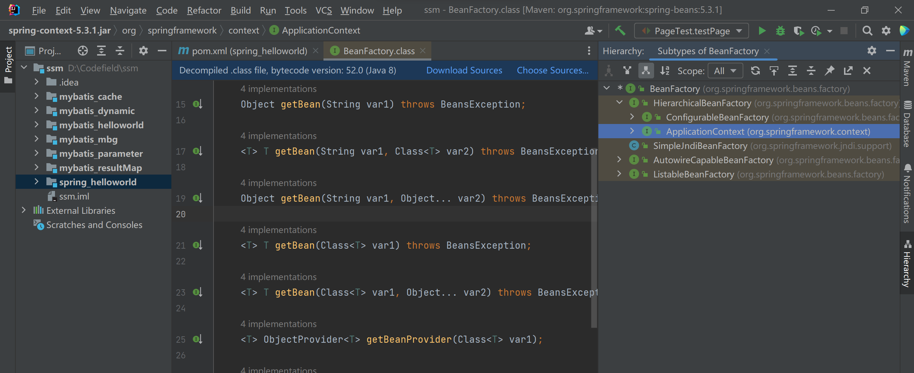

#### 基于XML管理bean

applicationContext.xml  Spring的配置文件

```xml
<?xml version="1.0" encoding="UTF-8"?>
<beans xmlns="http://www.springframework.org/schema/beans"
       xmlns:xsi="http://www.w3.org/2001/XMLSchema-instance"
       xsi:schemaLocation="http://www.springframework.org/schema/beans http://www.springframework.org/schema/beans/spring-beans.xsd">
<!--    bean: 配置一个bean对象  将对象交给IOC容器管理
        属性：
        id bean的唯一标识，不能重复
        class 设置bean对象所对应的类型
-->
    <bean id="helloworld" class="com.zzmr.spring.pojo.HelloWorld"></bean>
</beans>
```

测试类:

```java
package com.zzmr.spring.test;

import com.zzmr.spring.pojo.HelloWorld;
import org.junit.Test;
import org.springframework.context.ApplicationContext;
import org.springframework.context.support.ClassPathXmlApplicationContext;

public class HelloWorldTest {
    @Test
    public void testHelloWorld(){
    //            获取IOC容器
        ApplicationContext ioc = new ClassPathXmlApplicationContext("applicationContext.xml");
    //    获取IOC容器中的bean对象
        HelloWorld helloworld = (HelloWorld) ioc.getBean("helloworld");
        helloworld.sayHello();
    }
}
```

4. 注意: 当根据类型获取bean时,要求IOC容器中指定类型的bean有且只能有一个
5. 扩展

- 如果组件类实现了接口,根据接口类型可以获取bean,前提是bean唯一
- 但如果一个接口有多个实现类,这些实现类都配置了bean,根据接口类型就不能获取bean了,因为bean不唯一

6. 根据类型来获取bean时,在满足bean唯一性的前提下,其实只是看:对象instanceof指定的类型的返回结果,只要返回的是true,就可以认定为和类型匹配,能够获取到

```java
package com.zzmr.spring.test;

import com.zzmr.spring.pojo.Student;
import org.junit.Test;
import org.springframework.context.ApplicationContext;
import org.springframework.context.support.ClassPathXmlApplicationContext;

public class IOCByXMLTest {

    /**
     * 获取bean的三种方式：
     * 1，根据bean的id获取
     * 2. 根据bean的类型
     * 注意： 根据类型获取bean时，要求IOC容器中有且只有一个类型匹配的bean
     * 若没有任何一个类型匹配的bean，此时抛出异常  NoSuchBeanDefinitionException
     * 若有多个类型匹配的bean，此时抛出异常  NoUniqueBeanDefinitionException
     * 3.根据bean的id和类型获取
     * 即通过bean的类型，bean所继承的类的类型，bean所实现的接口的类型都可以获取bean
     *
     *
     */

    @Test
    public void testIOC() {
        //获取IOC容器
        ApplicationContext ioc = new ClassPathXmlApplicationContext("spring-ioc.xml");
        //获取bean
        //Student studentOne = (Student) ioc.getBean("studentOne");
        //Student studentOne = ioc.getBean(Student.class);

        Student studentOne = ioc.getBean("studentOne", Student.class);
        System.out.println(studentOne);
    }
}
```

#### 依赖注入之setter注入

怎么写？

```xml
    <bean id="studentTwo" class="com.zzmr.spring.pojo.Student">
<!--        property    通过成员变量的set方法进行赋值
            name        设置需要复制的属性名（和set方法有关）
            value       设置为属性所赋的值
-->
        <property name="sid" value="1001"></property>
        <property name="sname" value="张三"></property>
        <property name="age" value="23"></property>
        <property name="gender" value="男"></property>
    </bean>
```

```java
    @Test
    public void testDI() {
        //获取IOC容器
        ApplicationContext ioc = new ClassPathXmlApplicationContext("spring-ioc.xml");
        Student student = ioc.getBean("studentTwo", Student.class);
        System.out.println(student);
    }
```

也不难,嗯

#### 依赖注入之构造器注入

```xml
    <bean id="studentThree" class="com.zzmr.spring.pojo.Student">
        <constructor-arg value="1002"></constructor-arg>
        <constructor-arg value="李四"></constructor-arg>
        <constructor-arg value="女"></constructor-arg>
        <constructor-arg value="24" name="score"></constructor-arg>
    </bean>
```

```java
    @Test
    public void testDI() {
        //获取IOC容器
        ApplicationContext ioc = new ClassPathXmlApplicationContext("spring-ioc.xml");
        Student student = ioc.getBean("studentThree", Student.class);
        System.out.println(student);
    }
```

这个用的不多,后面用setter会比较多

#### 特殊值处理:

```xml
    <bean id="studentFour" class="com.zzmr.spring.pojo.Student">
        <property name="sid" value="1003"></property>
<!--
        < : <
        > : >
        CDATA 节 其中的内容会原样解析
        CDATA节是xml中一个特殊的标签

-->
<!--        <property name="sname" value="<王五>"></property>-->
        <property name="sname">
            <value><![CDATA[<王五>]]></value>
        </property>
        <property name="gender">
            <null />
        </property>
    </bean>
```

CDATA节自动生成快捷键: 大写CD,回车,注意:CDATA是xml中的一个特殊的标签,不能写在属性里面

为类类型的属性值赋值

```xml
    <bean id="studentFive" class="com.zzmr.spring.pojo.Student">
        <property name="sid" value="1004"></property>
        <property name="sname" value="赵六"></property>
        <property name="age" value="14"></property>
        <property name="gender" value="男"></property>
<!--        ref 引用IOC容器中的某个bean的id-->
        <property name="clazz" ref="clazzOne"></property>
    </bean>
    <bean id="clazzOne" class="com.zzmr.spring.pojo.Clazz">
        <property name="cid" value="1111"></property>
        <property name="cname" value="三年二班"></property>
    </bean>
```

使用内部bean

```xml
    <bean id="studentFive" class="com.zzmr.spring.pojo.Student">
        <property name="sid" value="1004"></property>
        <property name="sname" value="赵六"></property>
        <property name="age" value="14"></property>
        <property name="gender" value="男"></property>
<!--        ref 引用IOC容器中的某个bean的id-->
<!--        <property name="clazz" ref="clazzOne"></property>-->
<!--        级联方式，要保证提前为clazz属性赋值或者实例化-->
<!--        <property name="clazz.cid" value="2222"></property>-->
<!--        <property name="clazz.cname" value="灼灼某人版"></property>-->
        <property name="clazz">
<!--            内部bean，只能在当前bean的内部使用，不能直接通过ioc获取-->
            <bean id="clazzInner" class="com.zzmr.spring.pojo.Clazz">
                        <property name="cid" value="2222"></property>
                        <property name="cname" value="灼灼某人版"></property>
            </bean>
        </property>
    </bean>
    <bean id="clazzOne" class="com.zzmr.spring.pojo.Clazz">
        <property name="cid" value="1111"></property>
        <property name="cname" value="三年二班"></property>
    </bean>
```

内部bean只能在当前bean的内部使用，不能直接通过ioc获取

好多啊:

```xml
<?xml version="1.0" encoding="UTF-8"?>
<beans xmlns="http://www.springframework.org/schema/beans"
       xmlns:xsi="http://www.w3.org/2001/XMLSchema-instance" xmlns:util="http://www.springframework.org/schema/util"
       xmlns:utils="http://www.springframework.org/schema/util"
       xsi:schemaLocation="http://www.springframework.org/schema/beans http://www.springframework.org/schema/beans/spring-beans.xsd http://www.springframework.org/schema/util https://www.springframework.org/schema/util/spring-util.xsd">
    <bean id="studentOne" class="com.zzmr.spring.pojo.Student"></bean>

    <bean id="studentTwo" class="com.zzmr.spring.pojo.Student">
        <!--        property    通过成员变量的set方法进行赋值
                    name        设置需要复制的属性名（和set方法有关）
                    value       设置为属性所赋的值
        -->
        <property name="sid" value="1001"></property>
        <property name="sname" value="张三"></property>
        <property name="age" value="23"></property>
        <property name="gender" value="男"></property>
    </bean>
    <bean id="studentThree" class="com.zzmr.spring.pojo.Student">
        <constructor-arg value="1002"></constructor-arg>
        <constructor-arg value="李四"></constructor-arg>
        <constructor-arg value="女"></constructor-arg>
        <constructor-arg value="24" name="score"></constructor-arg>
    </bean>

    <bean id="studentFour" class="com.zzmr.spring.pojo.Student">
        <property name="sid" value="1003"></property>
        <!--
                < : <
                > : >
                CDATA 节 其中的内容会原样解析
                CDATA节是xml中一个特殊的标签

        -->
        <!--        <property name="sname" value="<王五>"></property>-->
        <property name="sname">
            <value><![CDATA[<王五>]]></value>
        </property>
        <property name="gender">
            <null/>
        </property>
    </bean>


    <bean id="studentFive" class="com.zzmr.spring.pojo.Student">
        <property name="sid" value="1004"></property>
        <property name="sname" value="赵六"></property>
        <property name="age" value="14"></property>
        <property name="gender" value="男"></property>
        <!--        ref 引用IOC容器中的某个bean的id-->
        <!--        <property name="clazz" ref="clazzOne"></property>-->
        <!--        级联方式，要保证提前为clazz属性赋值或者实例化-->
        <!--        <property name="clazz.cid" value="2222"></property>-->
        <!--        <property name="clazz.cname" value="灼灼某人版"></property>-->
        <property name="clazz">
            <!--            内部bean，只能在当前bean的内部使用，不能直接通过ioc获取-->
            <bean id="clazzInner" class="com.zzmr.spring.pojo.Clazz">
                <property name="cid" value="2222"></property>
                <property name="cname" value="灼灼某人版"></property>
            </bean>
        </property>
        <property name="hobby">
            <array>
                <value>抽烟</value>
                <value>喝酒</value>
                <value>烫头</value>
            </array>
        </property>
<!--        <property name="teacherMap">-->
<!--            <map>-->
<!--                <entry key="10084" value-ref="teacherOne"></entry>-->
<!--                <entry key="100844" value-ref="teacherTwo"></entry>-->
<!--            </map>-->
<!--        </property>-->
        <property name="teacherMap" ref="teacherMap"></property>
    </bean>
    <bean id="clazzOne" class="com.zzmr.spring.pojo.Clazz">
        <property name="cid" value="1111"></property>
        <property name="cname" value="三年二班"></property>
        <property name="students" ref="studentList"></property>
        <!--        <property name="students">-->
        <!--            <list>-->
        <!--                <ref bean="studentOne"></ref>-->
        <!--                <ref bean="studentTwo"></ref>-->
        <!--                <ref bean="studentThree"></ref>-->
        <!--            </list>-->
        <!--        </property>-->
    </bean>

    <bean id="teacherOne" class="com.zzmr.spring.pojo.Teacher">
        <property name="tid" value="10084"></property>
        <property name="tname" value="10085"></property>
    </bean>
    <bean id="teacherTwo" class="com.zzmr.spring.pojo.Teacher">
        <property name="tid" value="100844"></property>
        <property name="tname" value="100855"></property>
    </bean>

    <!--    配置一个集合类型的bean，需要使用util的约束-->
    <util:list id="studentList">
        <ref bean="studentOne"></ref>
        <ref bean="studentTwo"></ref>
        <ref bean="studentThree"></ref>
    </util:list>

    <utils:map id="teacherMap">
        <entry key="10084" value-ref="teacherOne"></entry>
        <entry key="100844" value-ref="teacherTwo"></entry>
    </utils:map>

    <bean id="studentSix" class="com.zzmr.spring.pojo.Student"
          p:sid="1005" p:sname="小明" p:teacherMap-ref="teacherMap">
    </bean>

</beans>
```

#### Spring管理数据源

**Spring管理数据源和引入外部属性文件**

引入数据库连接组件

```java
jdbc.driver=com.mysql.cj.jdbc.Driver
jdbc.url=jdbc:mysql://localhost:3306/ssm?serverTimezone=UTC
jdbc.username=root
jdbc.password=010203
```

```xml
<!--    引入jdbc.properties 之后就可以通过${key} 的方式访问value-->
    <context:property-placeholder location="jdbc.properties"></context:property-placeholder>

    <bean id="dataSource" class="com.alibaba.druid.pool.DruidDataSource">
        <property name="driverClassName" value="${jdbc.driver}"></property>
        <property name="url" value="${jdbc.url}"></property>
        <property name="username" value="${jdbc.username}"></property>
        <property name="password" value="${jdbc.password}"></property>
    </bean>
```

#### bean的作用域

在Spring中可以通过配置bean标签的scope属性来指定bean的作用域范围,各取值含义参见下表
singleton默认 在IOC容器中,这个bean的对象始终为单实例    在IOC容器初始化时创建对象
prototype 这个bean在IOC容器中有多个实例                 在获取bean时创建对象

```xml
<!--
        scope 设置bean的作用域
        scope=singleton||prototype
        singleton 表示获取该bean所对应哪个的对象都是一个===单例===用的比较多
        protoType   表示获取该bean所对应的对象都不是同一个====多例
-->

<!--    <bean id="student" class="com.zzmr.spring.pojo.Student" scope="singleton">-->
    <bean id="student" class="com.zzmr.spring.pojo.Student" scope="prototype">
        <property name="sid" value="2009124101"></property>
        <property name="sname" value="杨晋"></property>
    </bean>
```

```java
    @Test
    public void testScope(){
        ApplicationContext ioc = new ClassPathXmlApplicationContext("spring-scope.xml");
        Student student1 = ioc.getBean(Student.class);
        Student student2 = ioc.getBean(Student.class);
        //System.out.println(student1.equals(student2));
        System.out.println(student1==student2);
    }
```

#### bean的生命周期

具体的生命周期过程

- bean对象创建(调用无参构造器)
- 给bean对象设置属性
- bean对象初始化之前操作(由bean的后置处理器负责)
- bean对象初始化(需要在配置bean时指定初始化方法)
- bean对象初始化之后操作(由bean的后置处理器负责)
- bean对象就绪可以使用
- bean对象销毁(需在配置bean时指定销毁方法)
- IOC容器关闭

```java
public class LifeCycleTest {
    /**
     * 1.实例化
     * 2.依赖注入
     * 3.初始化    需要通过bean中的 init-method属性指定初始化的方法
     * 4.IOC容器关闭时，销毁    需要bean中的 destroy-method属性指定销毁方法
     */

    @Test
    public void test(){
        // ConfigurableApplicationContext是 ApplicationContext 的子接口，其中扩展了刷新和关闭容器的方法
        ConfigurableApplicationContext ioc = new ClassPathXmlApplicationContext("spring-lifecycle.xml");
        User user = ioc.getBean(User.class);
        System.out.println(user);
        ioc.close();
    }
```

```xml
    <bean id="user" class="com.zzmr.spring.pojo.User" init-method="initMethod" destroy-method="destroyMethod">
        <property name="id" value="1"></property>
        <property name="username" value="admin"></property>
        <property name="password" value="010203"></property>
        <property name="age" value="20"></property>
    </bean>
```

其中User.java中有方法：

```java
    public void initMethod(){
        System.out.println("生命周期3：初始化");
    }
    public void destroyMethod(){
        System.out.println("生命周期4：销毁");
    }
```

了解一下：

```java
package com.zzmr.spring.test;

import com.zzmr.spring.pojo.User;
import org.junit.Test;
import org.springframework.context.ApplicationContext;
import org.springframework.context.ConfigurableApplicationContext;
import org.springframework.context.support.ClassPathXmlApplicationContext;

public class LifeCycleTest {
    /**
     * 1.实例化
     * 2.依赖注入
     * 3.后置处理器的postProcessBeforeInitialization
     * 4.初始化    需要通过bean中的 init-method属性指定初始化的方法
     * 5.后置处理器的postProcessAfterInitialization
     * 6.IOC容器关闭时，销毁    需要bean中的 destroy-method属性指定销毁方法
     * bean的后置处理器会在生命周期的初始化前后添加额外的操作
     * 需要实现BeanPostProcessor接口且配置到IOC容器中
     * 且对IOC容器中所有的bean都会执行
     *
     * 注意：若bean 的作用域为单例时，生命周期的前三个步骤会在获取IOC容器时执行
     *      若bean 的作用域为多例时，生命周期的三个步骤会在获取bean时执行
     */

    @Test
    public void test(){
        // ConfigurableApplicationContext是 ApplicationContext 的子接口，其中扩展了刷新和关闭容器的方法
        ConfigurableApplicationContext ioc = new ClassPathXmlApplicationContext("spring-lifecycle.xml");
        User user = ioc.getBean(User.class);
        System.out.println(user);
        ioc.close();
    }
}
```

将后置处理器配置到IOC容器中

```xml
    <bean id="myBeanPostProcessor" class="com.zzmr.spring.process.MyBeanPostProcessor"></bean>
```

```java
package com.zzmr.spring.process;

import org.springframework.beans.BeansException;
import org.springframework.beans.factory.config.BeanPostProcessor;

public class MyBeanPostProcessor implements BeanPostProcessor {

    @Override
    public Object postProcessBeforeInitialization(Object bean, String beanName) throws BeansException {
        //此方法在bean的生命周期初始化之前执行
        System.out.println("MyBeanPostProcessor---->后置处理器的postProcessBeforeInitialization");
        return bean;
    }

    @Override
    public Object postProcessAfterInitialization(Object bean, String beanName) throws BeansException {
        //此方法在bean的生命周期初始化之后执行
        System.out.println("MyBeanPostProcessor---->后置处理器的postProcessAfterInitialization");
        return bean;
    }
}
```

#### FactoryBean

FactoryBean是Spring提供的一种整合第三方框架的常用机制,和普通的bean不同,配置一个FactoryBean类型的bean,在获取bean的时候得到的并不是class属性中配置的这个类的对象,而是getObject()方法的返回值,通过这种机制,Spring可以帮我们把复杂组件创建的详细过程和繁琐细节都屏蔽起来,只把最简洁的使用界面展示给我们.
**将来整合MyBatis时,Spring就是通过FactoryBean机制来我们创建SqlSessionFactroy对象的**

```java
package com.zzmr.spring.factory;

import com.zzmr.spring.pojo.User;
import org.springframework.beans.factory.FactoryBean;


/**
 * FactoryBean是一个接口，需要创建一个类实现该接口
 * 其中有三个方法
 * getObject()  提供一个对象交给IOC容器管理
 * getObjectType()  设置所提供对象的类型
 * isSingleton()    所提供的对象是否单例
 * 当把FactoryBean的实现类配置为bean时，会将当前类中getObject()  方法所返回的对象交给IOC容器管理
 */
public class UserFactoryBean implements FactoryBean<User> {

    @Override
    public User getObject() throws Exception {
        return new User();
    }

    @Override
    public Class<?> getObjectType() {
        return User.class;
    }
}
```

```xml
    <bean class="com.zzmr.spring.factory.UserFactoryBean"/>
```

```java
    @Test
    public void testFactoryBean(){
        ApplicationContext ioc = new ClassPathXmlApplicationContext("spring-factory.xml");
        User user = ioc.getBean(User.class);
        System.out.println(user);
    }
```

#### 基于xml的自动装配

自动装配:根据指定的策略,在IOC容器中匹配某一个bean,自动为指定的bean中所依赖的类类型或接口属性赋值

```java
package com.zzmr.spring.test;

import com.zzmr.spring.controller.UserController;
import org.junit.Test;
import org.springframework.context.ApplicationContext;
import org.springframework.context.support.ClassPathXmlApplicationContext;

public class AutowireByXMLTest {

    /**
     * 自动装配：
     * 根据指定的策略  在ioc容器中陪陪某个bean，自动为bean中的类类型的属性或接口类型的属性赋值
     * <p>
     * 可以通过bean标签中的autowire属性设置自动装配的策略
     * no，default 表示不装配，即bean中的属性不会自动匹配某个bean为属性赋值，此时属性使用默认值
     * byType 根据要复制的属性的类型，在IOC容器中匹配某个bean为属性赋值
     * 注意：
     * 若通过类型没有找到任何一个类型匹配的bean，此时不装配，属性使用默认值
     * 若通过类型找到了多个类型匹配的bean，此时会抛出异常：noUniqueBeanDefinitionException
     * 总结：当使用byType实现自动装配时，IOC容器中有且只有一个类型匹配的bean能够为属性赋值
     * <p>
     * byName（一般用不到）
     * 将要赋值的属性的属性名作为ibean的id在IOC容器中匹配某个bean，为属性赋值
     * 当类型匹配的bean有多个时，此时可以使用byName实现自动装配
     */


    @Test
    public void testAutowire() {
        ApplicationContext ioc = new ClassPathXmlApplicationContext("spring-autowire-xml.xml");
        UserController userController = ioc.getBean(UserController.class);
        userController.saveUser();
    }
}
```

```xml
<?xml version="1.0" encoding="UTF-8"?>
<beans xmlns="http://www.springframework.org/schema/beans"
       xmlns:xsi="http://www.w3.org/2001/XMLSchema-instance"
       xsi:schemaLocation="http://www.springframework.org/schema/beans http://www.springframework.org/schema/beans/spring-beans.xsd">

    <bean id="userController" class="com.zzmr.spring.controller.UserController" autowire="byName">
<!--        <property name="userService" ref="userService"></property>-->
    </bean>

    <bean id="userService" class="com.zzmr.spring.service.impl.UserServiceImpl" autowire="byName">
<!--        <property name="userDao" ref="userDao"></property>-->
    </bean>

    <bean id="userDao" class="com.zzmr.spring.dao.impl.UserDaoImpl"></bean>

</beans>
```

但是后期开发用的还是基于注解管理bean也是挺多的,同样很重要

#### 基于注解管理bean

**注解**
和xml配置文件一样,注解本身并不能执行,注解本身仅仅是做一个标记,具体的功能是框架检测到注解标记的位置,然后针对这个位置按照注解标记的功能来执行具体操作
本质上,所有一切的操作都是Java代码来完成的,XML和注解只是告诉框架中的Java代码如何执行

##### 扫描

```xml
<?xml version="1.0" encoding="UTF-8"?>
<beans xmlns="http://www.springframework.org/schema/beans"
       xmlns:xsi="http://www.w3.org/2001/XMLSchema-instance"
       xmlns:context="http://www.springframework.org/schema/context"
       xsi:schemaLocation="http://www.springframework.org/schema/beans http://www.springframework.org/schema/beans/spring-beans.xsd http://www.springframework.org/schema/context https://www.springframework.org/schema/context/spring-context.xsd">

    <!--
            context:exclude-filter  排除扫描的方式
            type        设置排除扫描的方式
            type="annotation"       根据注解的类型进行排除，expression需要设置派出的注解的全类名
            type="assignable"       根据类的类型进行排除，expression需要设置派出的类的全类名

            context:include-filter  包含扫描
            注意： 需要在 context:component-scan 标签中设置属性 use-default-filters="false"
            use-default-filters="true" 所设置的包下所有的类都需要扫描，此时可以使用排除扫描       默认情况
            use-default-filters="false" 所设置的包下所有的类都不需要扫描，此时可以使用包含扫描
    -->

<!--    扫描组件-->
    <context:component-scan base-package="com.zzmr.spring"></context:component-scan>
    <!--    <context:component-scan base-package="com.zzmr.spring" use-default-filters="false">-->
<!--<!–        <context:exclude-filter type="annotation" expression="org.springframework.stereotype.Controller"/>–>-->
<!--<!–        <context:exclude-filter type="assignable" expression="com.zzmr.spring.controller.UserController"/>–>-->
<!--<!–        只扫描控制层组件–>-->
<!--        <context:include-filter type="annotation" expression="org.springframework.stereotype.Controller"/>-->
<!--    </context:component-scan>-->
  

</beans>
```

测试：

```java
    @Test
    public void test() {
        ApplicationContext ioc = new ClassPathXmlApplicationContext("spring-ioc-annotation.xml");
        UserController userController = ioc.getBean(UserController.class);
        System.out.println(userController);
        UserService userService = ioc.getBean(UserService.class);
        System.out.println(userService);
        UserDao userDao = ioc.getBean(UserDao.class);
        System.out.println(userDao);

    }
```

了解最重要,最常用的就是给属性直接加注解

##### 基于注解的自动装配

```java
package com.zzmr.spring.test;

import com.zzmr.spring.controller.UserController;
import com.zzmr.spring.dao.UserDao;
import com.zzmr.spring.service.UserService;
import org.junit.Test;
import org.springframework.context.ApplicationContext;
import org.springframework.context.support.ClassPathXmlApplicationContext;

public class IOCByAnnotationTest {

    /**
     * @Component   将类标识为普通组件
     * @Controller  将类表示为控制层组件
     * @Service     将类表示为业务层组件
     * @Respository 将类表示为持久层组件
     *
     *
     * 通过注解+扫描所配置的bean的id，默认值为类的小驼峰 即类名的首字母为小写的结果
     * 可以通过表示组建的注解的value属性值设置bean的自定义的id
     *
     * @Autowired 实现自动装配功能的注解
     * 1. @Autowired注解能够表示的位置
     * 标识在成员变量上，此时不需要设置成员变量的set方法
     * 标识在set方法上
     * 标识在为当前成员变量欺负值得有参构造上
     *
     * 2.@Autowired注解的原理
     * a.默认通过byType的方式，在IOC容器中通过类型匹配某个bean为属性赋值
     * b.若有多个类型匹配的bean，此时会自动转换为byName的方式实现自动装配的效果
     * 即将要赋值的属性的属性名作为bean的id匹配某个bean为属性赋值
     * c.若byType和byName的方式搜无法实现自动装配，即IOC容器中有多个类型匹配的bean
     * 且这些bean的id和要赋值的属性的属性名都不一致，此时会抛出异常，NoUniqueBeanDefinitionException
     * d.此时可以在要赋值的属性上，添加一个注解Qualifier
     * 通过该注解的value的属性值，指定某个bean的id，将这个bean为属性赋值
     *
     * 注意：若IOC容器中没有任何一个类型匹配的bean，此时抛出异常；NoSuchBeanDefinitionException
     * 在@Autowired注解中有个属性required，默认值为true，要求必须完成自动装配
     * 可以将required设置为false 此时能装配则装配，无法装配则使用属性的默认值
     *
     * 但是，没有这么多特殊情况的，最常用的方法还是给成员变量添加注解
     *
     */

    @Test
    public void test() {
        ApplicationContext ioc = new ClassPathXmlApplicationContext("spring-ioc-annotation.xml");
        UserController userController = ioc.getBean("userController",UserController.class);
        //System.out.println(userController);
        //UserService userService = ioc.getBean("userServiceImpl",UserService.class);
        //System.out.println(userService);
        //UserDao userDao = ioc.getBean("userDaoImpl",UserDao.class);
        //System.out.println(userDao);

        userController.saveUser();
    }
}
```

```xml
<?xml version="1.0" encoding="UTF-8"?>
<beans xmlns="http://www.springframework.org/schema/beans"
       xmlns:xsi="http://www.w3.org/2001/XMLSchema-instance"
       xmlns:context="http://www.springframework.org/schema/context"
       xsi:schemaLocation="http://www.springframework.org/schema/beans http://www.springframework.org/schema/beans/spring-beans.xsd http://www.springframework.org/schema/context https://www.springframework.org/schema/context/spring-context.xsd">

    <!--
            context:exclude-filter  排除扫描的方式
            type        设置排除扫描的方式
            type="annotation"       根据注解的类型进行排除，expression需要设置派出的注解的全类名
            type="assignable"       根据类的类型进行排除，expression需要设置派出的类的全类名

            context:include-filter  包含扫描
            注意： 需要在 context:component-scan 标签中设置属性 use-default-filters="false"
            use-default-filters="true" 所设置的包下所有的类都需要扫描，此时可以使用排除扫描       默认情况
            use-default-filters="false" 所设置的包下所有的类都不需要扫描，此时可以使用包含扫描
    -->

<!--    扫描组件-->
    <context:component-scan base-package="com.zzmr.spring"></context:component-scan>
    <!--    <context:component-scan base-package="com.zzmr.spring" use-default-filters="false">-->
<!--<!–        <context:exclude-filter type="annotation" expression="org.springframework.stereotype.Controller"/>–>-->
<!--<!–        <context:exclude-filter type="assignable" expression="com.zzmr.spring.controller.UserController"/>–>-->
<!--<!–        只扫描控制层组件–>-->
<!--        <context:include-filter type="annotation" expression="org.springframework.stereotype.Controller"/>-->
<!--    </context:component-scan>-->

    <bean id="userService" class="com.zzmr.spring.service.impl.UserServiceImpl"></bean>
    <bean id="userDao" class="com.zzmr.spring.dao.impl.UserDaoImpl"></bean>


</beans>
```

### AOP

#### 场景模拟

需要模拟啊,那就放进来:

```java
package com.zzmr.spring.proxy;

public class CalculatorImpl implements Calculator {
    @Override
    public int add(int i, int j) {
        System.out.println("日志，方法：add 参数：" + i + "," + j);
        int result = i + j;
        System.out.println("方法内部：result:" + result);
        System.out.println("日志，方法：add 结果："+result);
        return result;
    }

    @Override
    public int sub(int i, int j) {
        System.out.println("日志，方法：sub 参数：" + i + "," + j);
        int result = i - j;
        System.out.println("方法内部：result:" + result);
        System.out.println("日志，方法：sub 结果："+result);
        return result;
    }

    @Override
    public int mul(int i, int j) {
        System.out.println("日志，方法：mul 参数：" + i + "," + j);
        int result = i * j;
        System.out.println("方法内部：result:" + result);
        System.out.println("日志，方法：mul 结果："+result);
        return result;
    }

    @Override
    public int div(int i, int j) {
        System.out.println("日志，方法：div 参数：" + i + "," + j);
        int result = i / j;
        System.out.println("方法内部：result:" + result);
        System.out.println("日志，方法：div 结果："+result);
        return result;
    }
}
```

1. 现有代码缺陷
   针对带日志功能的实现类,我们发现有如下缺陷
   - 导致程序员在开发核心功能是分散了精力
   - 附加功能分散在各个业务功能方法中,不利于统一维护
2. 解决思路
   - 解决这两个问题,核心就是:解耦,我们需要把附加功能从业务功能代码中抽取出来
3. 困难
   - 解决问题的困难:要抽取的代码在方法内部,靠以前把子类中的重复代码抽取到父类的方式没法解决,所以需要引入新的技术

#### 代理模式

概念: 二十三种设计模式中的一种,属于结构型模式,它的作用就是通过提供一个代理类,让我们在调用目标方法时,不再是直接对目标方法进行调用,而是通过代理类间接调用,让不属于目标方法核心逻辑的代码从目标方法中剥离出来---解耦,调用目标方法时先调用代理对象的方法,减少对目标方法的调用和打扰,同时让附加功能能够集中在一起也有利于统一维护

相关术语

- 代理  将非核心逻辑剥离出来以后,封装这些非核心逻辑的类,对象,方法
- 目标  被代理"套用"了非核心逻辑代码的类,对象,方法

#### 静态代理

创建接口：

```java
package com.zzmr.spring.proxy;

public interface Calculator {
    int add(int i, int j);

    int sub(int i, int j);

    int mul(int i, int j);

    int div(int i, int j);
}
```

创建实现类:

```java
package com.zzmr.spring.proxy;

public class CalculatorImpl implements Calculator {
    @Override
    public int add(int i, int j) {
        int result = i + j;
        System.out.println("方法内部：result:" + result);
        return result;
    }

    @Override
    public int sub(int i, int j) {
        int result = i - j;
        System.out.println("方法内部：result:" + result);
        return result;
    }

    @Override
    public int mul(int i, int j) {
        int result = i * j;
        System.out.println("方法内部：result:" + result);
        return result;
    }

    @Override
    public int div(int i, int j) {
        int result = i / j;
        System.out.println("方法内部：result:" + result);
        return result;
    }
}
```

创建静态代理实现类

```java
package com.zzmr.spring.proxy;

/**
 *
 */


public class CalculatorStaticProxy implements Calculator {

    private CalculatorImpl target;

    public CalculatorStaticProxy(CalculatorImpl target) {
        this.target = target;
    }

    @Override
    public int add(int i, int j) {
        int result = 0;
        try {
            System.out.println("日志，方法：add，参数" + i + "," + j);
            result = target.add(i, j);
            System.out.println("日志，方法：add，结果" + result);
        } catch (Exception e) {
            e.printStackTrace();
        } finally {
        }
        return result;
    }

    @Override
    public int sub(int i, int j) {
        System.out.println("日志，方法：sub，参数" + i + "," + j);
        int result = target.sub(i, j);
        System.out.println("日志，方法：sub，结果" + result);
        return result;
    }

    @Override
    public int mul(int i, int j) {
        System.out.println("日志，方法：mul，参数" + i + "," + j);
        int result = target.mul(i, j);
        System.out.println("日志，方法：mul，结果" + result);
        return result;
    }

    @Override
    public int div(int i, int j) {
        System.out.println("日志，方法：div，参数" + i + "," + j);
        int result = target.div(i, j);
        System.out.println("日志，方法：div，结果" + result);
        return result;
    }
}
```

测试:

```java
package com.zzmr.spring.proxy;

import org.junit.Test;

public class ProxyTest {
    @Test
    public void testProxy(){
        CalculatorStaticProxy proxy = new CalculatorStaticProxy(new CalculatorImpl());
        proxy.add(1,2);
    }
}
```

此时就可以打印出

```
日志，方法：add，参数1,2
方法内部：result:3
日志，方法：add，结果3
```

实现类中并没有上下两行代码,但是输出结果却包含了这两行代码,就是通过代理实现的

```
静态代理确实实现了解耦,但是由于代码都写死了,完全不具备任何的灵活性,就拿日志功能来说,将来其他地方也需要附加日志,那还得再声明更多个静态代理类,那就产生了大量重复的代码,日志功能还是分散的,没有统一管理
提出进一步的需求,将日志功能集中到一个代理类中,将来有任何日志需求,都通过这一个代理类来实现,这就需要使用动态代理技术了
```

#### 动态代理

动态生成

```java
package com.zzmr.spring.proxy;

import java.lang.reflect.InvocationHandler;
import java.lang.reflect.InvocationTargetException;
import java.lang.reflect.Method;
import java.lang.reflect.Proxy;
import java.util.Arrays;

public class ProxyFactory {

    private Object target;

    public ProxyFactory(Object target) {
        this.target = target;
    }


    public Object getProxy() {
        /**
         * ClassLoader loader,      指定加载动态生成的代理类的类加载器
         * Class[] interfaces,      获取目标对象实现的所有接口的class对象的数组
         * InvocationHandler h      设置代理类中的抽象方法如何重写
         * @return
         */
        ClassLoader classLoader = this.getClass().getClassLoader();
        Class<?>[] interfaces = target.getClass().getInterfaces();
        InvocationHandler h = new InvocationHandler() {
            @Override
            public Object invoke(Object proxy, Method method, Object[] args) throws Throwable {
                Object result = null;
                try {
                    System.out.println("日志，方法：" + method.getName() + ", 参数" + Arrays.toString(args));
                    // proxy  变表示代理对象，method 表示要执行的方法，args表示要执行的方法的参数列表
                    result = method.invoke(target, args);
                    System.out.println("日志，方法：" + method.getName() + ", 结果" + result);
                } catch (Exception e) {
                    e.printStackTrace();
                    System.out.println("日志，方法：" + method.getName() + ", 异常" + e);
                }finally {
                    System.out.println("日志，方法：" + method.getName() + ", 方法执行完毕");
                }
                return result;
            }
        };
        return Proxy.newProxyInstance(classLoader, interfaces, h);
    }

}
```

```java
     * 动态代理有两种
     * 1. jdk动态代理   要求必须有接口，最终生成的代理类和目标类实现相同的接口
     * 在com.sun.proxy包下，类名叫$proxy2
     * 2. cglib动态代理 最终生成的代理类，汇集成目标类，并且和目标类在相同的包下
     */

    @Test
    public void testProxy(){
        //CalculatorStaticProxy proxy = new CalculatorStaticProxy(new CalculatorImpl());
        //proxy.add(1,2);

        ProxyFactory proxyFactory = new ProxyFactory(new CalculatorImpl());
        Calculator proxy = (Calculator) proxyFactory.getProxy();
        proxy.add(1,2);
        System.out.println("++=====++++====");
        proxy.sub(2,1);
        System.out.println("++=====++++====");
        proxy.div(1,0);


    }
```

动态代理以后也不会是自己手写的,学这个是便于理解AOP

#### AOP概念

AOP(Aspect Oriented Programming 是一种设计思想,是软件设计领域中的面向切面编程,它是面向对象编程的一种补充和完善,它以通过预编译方式和运行期动态代理方式实现在不修改源代码的情况下给程序动态统一添加额外功能的一种技术)

##### 相关术语

1. 横切关注点
   从每个方法中抽取出来的同一类非核心业务,在同一个项目中,我们可以使用多个横切关注点对相关方法进行多个不同方面的增强
   这个概念不是语法层面天然存在的,而是根据附加功能的逻辑上的需要:有是个附加功能,就有是个横切关注点
2. 通知
   每个横切关注点上要做的事情都需要写一个方法来实现,这样的方法就叫通知方法
   - 前置通知:在被代理的目标方法**前**执行
   - 返回通知:在被代理的目标方法**成功结束**后执行(寿终正寝)
   - 异常通知:在被代理的目标方法**异常结束**后执行(死于非命)
   - 后置通知:在被代理的目标方法**最终结束**后执行(盖棺定论)
   - 环绕通知:使用try...catch...finally结构围绕**整个**被代理的目标方法,包括上面四种通知对应的所有位置
     各通知的执行顺序
     - Spring版本5.3.x以前
       - 前置通知
       - 目标操作
       - 后置通知
       - 返回通知或异常通知
     - Spring版本5.3.x以后
       - 前置通知
       - 目标操作
       - 返回通知或异常通知
       - 后置通知
3. 切面
   封装通知方法的类
4. 目标
   被代理的目标对象
5. 代理
   向目标对象应用通知之后创建的代理对象
6. 连接点
   这也是一个纯逻辑概念,不是语法定义的
   把方法排成一排,每个横切位置看成x轴方向,把方法从上到下执行的顺序看成y轴,x轴和y轴的交叉点就是连接点
7. 切入点
   定位连接点的方式
   每个类的方法中都包含多个连接点,所以连接点是类中客观存在的事物(从逻辑上来说)
   如果把连接点看作数据库中的记录,那么切入点就是查询记录的SQL语句
   Spring的AOP技术可以通过切入点定位到特定的连接点
   切点通过org,springframework.aop.Pointcu接口进行描述,它使用类和方法作为连接点的查询条件

##### 作用

- 简化代码:把方法中固定位置的重复的代码抽取出来,让被抽取的方法更专注于自己的核心功能,提高内聚性
- 代码增强,把特定的功能封装到切面类中,看哪里有需要,就往上套,被套用了切面逻辑的方法就被切面给增强了

#### 基于注解的AOP

- 动态代理(InvocationHandler) JDK原生的实现方式,需要被代理的目标类必须实现接口,因为这个技术要求代理对象和目标对象实现同样的接口(兄弟两个拜把子模式)
- cglib 通过继承被代理的目标类(认干爹模式)实现代理,所以不需要目标类实现接口
- Aspectj 本质上是静态代理,将代理逻辑织入被代理的目标类编译得到的字节码文件,所以最终效果是动态的,weaver就是织入器,Spring只是借用了AspectJ中的注解

```java
package com.zzmr.spring.aop.annotation;

import org.aspectj.lang.JoinPoint;
import org.aspectj.lang.ProceedingJoinPoint;
import org.aspectj.lang.Signature;
import org.aspectj.lang.annotation.*;
import org.springframework.stereotype.Component;

import java.util.Arrays;

/**
 * 1 切面中需要通过指定的注解将方法标识为通知方法
 *
 * @Before 前置通知，在目标对象方法执行之前执行
 * @After 后置通知，在目标对象方法的finally子句中执行
 * @AfterRetruning 返回通知，在目标对象方法返回值之后执行
 * @AfterThrowing 异常通知 在目标对象方法的catch子句执行
 * <p>
 * <p>
 * 2 切入点表达式：设置在标识通知的value属性中
 * "execution(public int com.zzmr.spring.aop.annotation.CalculatorImpl.add(int,int))"
 * "execution(* com.zzmr.spring.aop.annotation.CalculatorImpl.*(..))"
 * 第一个*表示任意的访问修饰符和返回值类型
 * 第二个*表示类中任意的方法
 * ..表示任意的参数列表
 * 类的地方也可以用*表示，包下所有的类
 * <p>
 * <p>
 * 3 重用切入点表达式
 * @Pointcut声明一个公共的切入点表达式 //切入点表达式的重用
 * @Pointcut("execution(* com.zzmr.spring.aop.annotation.CalculatorImpl.*(..))")
 * private void pointCut(){}
 * 使用方式：
 * @Before("pointCut()") 4 获取连接点的信息
 *
 * 4 获取连接点信息
 * 在通知方法的参数位置，设置JoinPoint类型的参数，就可以获取连接点所对应方发的信息
 * //获取连接点所对应方法的签名信息
 * Signature signature = joinPoint.getSignature();
 * //获取连接点所对应方法的参数
 * Object[] args = joinPoint.getArgs();
 *
 * 5 切面的优先级
 * 可以通过@Order注解的value属性设置优先级，默认值是Integer的最大值
 * 属性值越小，优先级越高
 */

@Component
@Aspect //将当前组件标识为切面
public class LoggerAspect {

    //切入点表达式的重用
    @Pointcut("execution(* com.zzmr.spring.aop.annotation.CalculatorImpl.*(..))")
    public void pointCut() {
    }

    //@Before("execution(public int com.zzmr.spring.aop.annotation.CalculatorImpl.add(int,int))")
    //@Before("execution(* com.zzmr.spring.aop.annotation.*.*(..))")
    @Before("pointCut()")
    public void beforeAdviceMethod(JoinPoint joinPoint) {
        //获取连接点所对应方法的签名信息
        Signature signature = joinPoint.getSignature();
        //获取连接点所对应方法的参数
        Object[] args = joinPoint.getArgs();
        System.out.println("LoggerAspect 方法," + signature.getName() + "参数：" + Arrays.toString(args));
    }

    @After("pointCut()")
    public void afterAdviceMethod(JoinPoint joinPoint) {
        //获取连接点所对应方法的签名信息
        Signature signature = joinPoint.getSignature();
        System.out.println("LoggerAspect，方法：" + signature.getName() + "执行完毕");
    }

    //要想在返回通知中获取目标对象方法的返回值，只需要通过@AfterReturning注解的returning属性
    //就可以将通知啊方法的某个参数指定为接收目标对象方法的返回值的参数
    @AfterReturning(value = "pointCut()", returning = "result")
    public void afterReturningAdviceMethod(JoinPoint joinPoint, Object result) {
        Signature signature = joinPoint.getSignature();
        System.out.println("LoggerAspect，方法：" + signature.getName() + ",结果：" + result);
    }


    /**
     * 在异常通知中若要获取目标对象方法的异常
     * 只需要通过AfterThrowing注解的throwing属性
     * 就可以将通知方法的某个参数指定为接受目标对象方法出现的异常的参数
     * @param joinPoint
     * @param ex
     */

    @AfterThrowing(value = "pointCut()", throwing = "ex")
    public void afterThrowingAdviceMethod(JoinPoint joinPoint, Throwable ex) {
        //获取连接点所对应方法的签名信息
        Signature signature = joinPoint.getSignature();
        System.out.println("LoggerAspect 方法" + signature.getName() + "异常：" + ex);
    }

    @Around("pointCut()")
    //环绕通知的方法一定要和目标对象方法的返回值一致
    public Object aroundAdviceMethod(ProceedingJoinPoint joinPoint){
        Object result = null;
        try {
            System.out.println("环绕通知--->前置通知的位置");
            //表示目标对象方法的执行
            result = joinPoint.proceed();
            System.out.println("环绕通知--->返回通知的位置");
        } catch (Throwable e) {
            e.printStackTrace();
            System.out.println("环绕通知--->异常通知的位置");
        }finally {
            System.out.println("环绕通知--->后置通知的位置");
        }

        return result;

    }

}
```

```java
package com.zzmr.spring.aop.annotation;


import org.aspectj.lang.annotation.Aspect;
import org.aspectj.lang.annotation.Before;
import org.springframework.core.annotation.Order;
import org.springframework.stereotype.Component;

@Component
@Aspect
@Order(1)
public class ValidateAspect {

    //@Before("execution(* com.zzmr.spring.aop.annotation.CalculatorImpl.*(..))")
    @Before("com.zzmr.spring.aop.annotation.LoggerAspect.pointCut()")
    public void beforeMethod(){
        System.out.println("ValidateAspect-->前置通知");
    }

}
```

### 声明式事务

Spring框架对JDBC进行封装,使用JdbcTemplate方便实现对数据库操作

使用JdbcTemplate实现增删改查
这个不是重点，我们只是测试一下，毕竟以后用的还是MyBatis的多

```java
package com.zzmr.spring.test;

import org.junit.Test;
import org.junit.runner.RunWith;
import org.springframework.beans.factory.annotation.Autowired;
import org.springframework.jdbc.core.JdbcTemplate;
import org.springframework.test.context.ContextConfiguration;
import org.springframework.test.context.junit4.SpringJUnit4ClassRunner;

//指定当前测试类在Spring的测试环境中执行  此时就可以通过注入的方式直接获取IOC容器中的bean
@RunWith(SpringJUnit4ClassRunner.class)
//设置当前Spring测试环境的配置文件
@ContextConfiguration("classpath:spring-jdbc.xml")
public class JdbcTemplateTest {

    @Autowired
    private JdbcTemplate jdbcTemplate;

    @Test
    public void testInsert(){
        String sql = "insert into t_user values(null,?,?,?,?,?)";
        jdbcTemplate.update(sql,"root","123",23,"男","123@con.com");
    }

    @Test
    public void testUpdate(){
        String sql = "update t_user set username = ? where username = ?";
        jdbcTemplate.update(sql,"zzmr1","zzmr");
    }

    @Test
    public void testDelete(){
        String sql = "delete from t_user where username = ?";
        jdbcTemplate.update(sql,"zzmr1");
    }

        @Test
    public void testGetUserById(){
        String sql = "select * from t_user where id = ?";
        User user = jdbcTemplate.queryForObject(sql, new BeanPropertyRowMapper<>(User.class),2);
        System.out.println(user);
    }

    @Test
    public void testGetAllUser(){
        String sql = "select * from t_user";
        List<User> query = jdbcTemplate.query(sql, new BeanPropertyRowMapper<>(User.class));
        query.forEach(System.out::println);
    }

    @Test
    public void testGetCount(){
        String sql = "select count(*) from t_user";
        Integer count = jdbcTemplate.queryForObject(sql, Integer.class);
        System.out.println(count);
    }
}
```

编程式的实现方式存在缺陷：

- 细节没有被屏蔽，具体操作过程中，所有细节都需要程序员自己来完成，比较繁琐
- 代码复用性不高，如果没有有效抽取出来，每次实现功能都需要自己编写代码，代码就没有得到复用

#### 声明式事务

既然事务控制的代码有规律可循，代码的结构基本是确定的，所以框架就可以将固定模式的代码抽取出来，进行相关的封装
封装起来后，我们只需要在配置文件中进行简单的配置即可完成操作

- 好处1：提高开发效率
- 好处2：消除了冗余代码
- 好处3：框架会综合考虑相关领域中在实际开发环境下有可能遇到的各种问题，进行了健壮性，性能等各个方面的优化
  所以，我们可以总结下面两个概念
- 编程式：自己写代码实现功能
- 声明式：通过配置让框架实现功能

#### 基于注解的声明式事务

tx-annotation.xml

```xml
<?xml version="1.0" encoding="UTF-8"?>
<beans xmlns="http://www.springframework.org/schema/beans"
       xmlns:xsi="http://www.w3.org/2001/XMLSchema-instance"
       xmlns:context="http://www.springframework.org/schema/context" xmlns:tx="http://www.springframework.org/schema/tx"
       xsi:schemaLocation="http://www.springframework.org/schema/beans http://www.springframework.org/schema/beans/spring-beans.xsd http://www.springframework.org/schema/context https://www.springframework.org/schema/context/spring-context.xsd http://www.springframework.org/schema/tx http://www.springframework.org/schema/tx/spring-tx.xsd">

<!--    扫描组件-->
    <context:component-scan base-package="com.zzmr.spring"></context:component-scan>

<!--    引入jdbc.properties-->
    <context:property-placeholder location="classpath:jdbc.properties"/>

    <bean id="dataSource" class="com.alibaba.druid.pool.DruidDataSource">
        <property name="driverClassName" value="${jdbc.driver}"></property>
        <property name="url" value="${jdbc.url}"></property>
        <property name="username" value="${jdbc.username}"></property>
        <property name="password" value="${jdbc.password}"></property>
    </bean>

    <bean class="org.springframework.jdbc.core.JdbcTemplate">
        <property name="dataSource" ref="dataSource"></property>
    </bean>

<!--    配置事务管理器-->
    <bean id="transactionManager" class="org.springframework.jdbc.datasource.DataSourceTransactionManager">
        <property name="dataSource" ref="dataSource"></property>
    </bean>


<!--    开启事务的注解驱动
        将使用@Transactional注解所表示的方法或类中所有的方法使用事务进行管理
        transaction-manager 设置事务管理器的id
        若事务管理器的bean的id为默认的transactionManager。就可以不用写
-->
    <tx:annotation-driven transaction-manager="transactionManager"/>

</beans>
```

BookController.java

```java
package com.zzmr.spring.controller;

import com.zzmr.spring.service.BookService;
import org.springframework.beans.factory.annotation.Autowired;
import org.springframework.stereotype.Controller;

@Controller
public class BookController {
    @Autowired
    private BookService bookService;

    public void buyBook(Integer userId,Integer bookId){
        bookService.buyBook(userId,bookId);
    }
}
```

BookService.java

```java
package com.zzmr.spring.service;

public interface BookService {
    /**
     * 买书
     * @param userId
     * @param bookId
     */
    void buyBook(Integer userId, Integer bookId);
}
```

BookServiceImpl.java

```java
package com.zzmr.spring.service.impl;

import com.zzmr.spring.dao.BookDao;
import com.zzmr.spring.service.BookService;
import org.springframework.beans.factory.annotation.Autowired;
import org.springframework.stereotype.Service;
import org.springframework.transaction.annotation.Transactional;

import java.util.concurrent.TimeUnit;


@Service
public class BookServiceImpl implements BookService {

    @Autowired
    private BookDao bookDao;
    @Override
    @Transactional(
            //readOnly = true
            timeout = 3
    )
    public void buyBook(Integer userId, Integer bookId) {
        try {
            TimeUnit.SECONDS.sleep(5);
        }catch (Exception e){
            e.printStackTrace();
        }
    //    查询图书的价格
        Integer price = bookDao.getPriceByBookId(bookId);
    //    更新图书的库存
        bookDao.updateStock(bookId);
    //    更新用户的余额
        bookDao.updateBalance(userId,price);
    }
}
```

BookDao.java

```java
package com.zzmr.spring.dao;

public interface BookDao {
    /**
     * 根据图书id查询图书的价格
     *
     * @param bookId
     * @return
     */
    Integer getPriceByBookId(Integer bookId);

    /**
     * 更新图书的库存
     *
     * @param bookId
     */
    void updateStock(Integer bookId);

    /**
     * 更新用户的余额
     *
     * @param userId
     * @param price
     */
    void updateBalance(Integer userId, Integer price);
}
```

BookDaoImpl.java

```java
package com.zzmr.spring.dao.impl;

import com.zzmr.spring.dao.BookDao;
import org.springframework.beans.factory.annotation.Autowired;
import org.springframework.jdbc.core.JdbcTemplate;
import org.springframework.stereotype.Repository;

@Repository
public class BookDaoImpl implements BookDao {


    @Autowired
    private JdbcTemplate jdbcTemplate;

    @Override
    public Integer getPriceByBookId(Integer bookId) {
        String sql = "select price from t_book where book_id = ?";
        return jdbcTemplate.queryForObject(sql,Integer.class,bookId);
    }


    @Override
    public void updateStock(Integer bookId) {
        String sql = "update t_book set stock = stock-1 where book_id = ?";
        jdbcTemplate.update(sql,bookId);

    }


    @Override
    public void updateBalance(Integer userId, Integer price) {
        String sql = "update t_user set balance = balance- ?  where user_id = ?";
        jdbcTemplate.update(sql,price,userId);
    }
}

```

测试类：

```java
package com.zzmr.spring.test;

import com.zzmr.spring.controller.BookController;
import org.junit.Test;
import org.junit.runner.RunWith;
import org.springframework.beans.factory.annotation.Autowired;
import org.springframework.test.context.ContextConfiguration;
import org.springframework.test.context.junit4.SpringJUnit4ClassRunner;

/**
 * 声明式事务的配置步骤
 * 1. 在Spring的配置文件中配置事务管理器
 * 2. 开启事务的注解驱动
 * 在需要被事务管理的方法上添加@Transactional注解，该方法就会被事务管理
 * @Transactional注解标识的位置
 * 1. 标识在方法上
 * 2. 标识在类上，则类中所有的方法都会被事务管理
 *
 */


@RunWith(SpringJUnit4ClassRunner.class)
@ContextConfiguration("classpath:tx-annotation.xml")
public class TxByAnnotationTest {

    @Autowired
    private BookController bookController;

    @Test
    public void testBuyBook(){
        bookController.buyBook(1,1);
    }

}
```

2022年9月1日 16点42分
Spring已讲完，剩下Spring MVC了
加油

## SpringMVC

MVC是一种软件架构的思想，将软件按照模型、视图、控制器来划分

- M Model，模型层，指工程中的JavaBean，作用是处理数据
  JavaBean分为两类
  - 一类称为实体类Bean：专门存储业务数据的，如Student、User等
  - 一类称为业务处理Bean：指Service或Dao对象，专门用于处理业务逻辑和数据访问
- V View，视图层，指工程中的html或jsp等页面，作用是与用户进行交互，展示数据
- C Controller，控制层，指工程中的servlet，作用是接受请求和响应浏览器

### SpringMVC介绍

SpringMVC是Spring的一个后续产品，是Spring的一个子项目
SpringMVC是Spring为表述层开发提供的一整套完备的解决方案，在表数层框架历经Strust，WebWork，Strust2等诸多产品的历代更迭之后，目前业界普遍选择了SpringMVC作为JavaEE项目表述层开发的**首选方案**
三层架构分为表述层、业务逻辑层、数据访问层，表述层表示前台页面和后台servlet

*这玩意封装了servelt，万变不离其中啊*

- **Spring家族原生产品**，与IOC容器等基础设施无缝对接
- **基于原生的servlet**，通过了功能强大的前端控制器DispatcherServelt，对请求和响应进行统一处理
- 表述层各细分领域需要解决的问题全方位覆盖，提供**全面解决方案**
- **代码清新简洁**，大幅提升开发效率
- 内部组件化程度高，可插拔是组件**即插即用**，想要什么功能配置相应组件即可
- **性能卓著**，尤其适合现代大型，超大型互联网项目要求

### 配置SpringMVC

pom.xml

```xml
<?xml version="1.0" encoding="UTF-8"?>
<project xmlns="http://maven.apache.org/POM/4.0.0"
         xmlns:xsi="http://www.w3.org/2001/XMLSchema-instance"
         xsi:schemaLocation="http://maven.apache.org/POM/4.0.0 http://maven.apache.org/xsd/maven-4.0.0.xsd">
    <modelVersion>4.0.0</modelVersion>

    <groupId>com.zzmr</groupId>
    <artifactId>spring_mvc_helloworld</artifactId>
    <version>1.0-SNAPSHOT</version>
    <packaging>war</packaging>

    <properties>
        <maven.compiler.source>8</maven.compiler.source>
        <maven.compiler.target>8</maven.compiler.target>
        <project.build.sourceEncoding>UTF-8</project.build.sourceEncoding>
    </properties>

    <dependencies>
        <!-- SpringMVC -->
        <dependency>
            <groupId>org.springframework</groupId>
            <artifactId>spring-webmvc</artifactId>
            <version>5.3.1</version>
        </dependency>
        <!-- 日志 -->
        <dependency>
            <groupId>ch.qos.logback</groupId>
            <artifactId>logback-classic</artifactId>
            <version>1.2.3</version>
        </dependency>
        <!-- ServletAPI -->
        <dependency>
            <groupId>javax.servlet</groupId>
            <artifactId>javax.servlet-api</artifactId>
            <version>3.1.0</version>
            <scope>provided</scope>
        </dependency>
        <!-- Spring5和Thymeleaf整合包 -->
        <dependency>
            <groupId>org.thymeleaf</groupId>
            <artifactId>thymeleaf-spring5</artifactId>
            <version>3.0.12.RELEASE</version>
        </dependency>
    </dependencies>

</project>
```

web.xml

```xml
<?xml version="1.0" encoding="UTF-8"?>
<web-app xmlns="http://xmlns.jcp.org/xml/ns/javaee"
         xmlns:xsi="http://www.w3.org/2001/XMLSchema-instance"
         xsi:schemaLocation="http://xmlns.jcp.org/xml/ns/javaee http://xmlns.jcp.org/xml/ns/javaee/web-app_4_0.xsd"
         version="4.0">

    <!--    配置SpringMVC的前端控制器 DispatcherServlet

            url-pattern中 /和/*的区别
            /：匹配浏览器向服务器发送的所有请求（不包括.jsp）
            /* ：匹配浏览器向服务器发送的所有请求（包括.jsp）
    -->
    <servlet>
        <servlet-name>SpringMVC</servlet-name>
        <servlet-class>org.springframework.web.servlet.DispatcherServlet</servlet-class>
    </servlet>
    <servlet-mapping>
        <servlet-name>SpringMVC</servlet-name>
        <url-pattern>/</url-pattern>
    </servlet-mapping>


</web-app>
```

创建SpringMVC配置文件

```xml
<?xml version="1.0" encoding="UTF-8"?>
<beans xmlns="http://www.springframework.org/schema/beans"
       xmlns:xsi="http://www.w3.org/2001/XMLSchema-instance"
       xmlns:context="http://www.springframework.org/schema/context"
       xsi:schemaLocation="http://www.springframework.org/schema/beans http://www.springframework.org/schema/beans/spring-beans.xsd http://www.springframework.org/schema/context https://www.springframework.org/schema/context/spring-context.xsd">

<!--    <!–    扫描控制成组件–>-->
<!--    <context:component-scan base-package="com.zzmr.controller"></context:component-scan>-->
    <!-- 自动扫描包 -->
    <context:component-scan base-package="com.zzmr.controller"/>
    <!-- 配置Thymeleaf视图解析器 -->
    <bean id="viewResolver" class="org.thymeleaf.spring5.view.ThymeleafViewResolver">
        <property name="order" value="1"/>
        <property name="characterEncoding" value="UTF-8"/>
        <property name="templateEngine">
            <bean class="org.thymeleaf.spring5.SpringTemplateEngine">
                <property name="templateResolver">
                    <bean class="org.thymeleaf.spring5.templateresolver.SpringResourceTemplateResolver">
<!--                        index-->
                        <!-- 视图前缀 -->
                        <property name="prefix" value="/WEB-INF/templates/"/>
                        <!-- 视图后缀 -->
                        <property name="suffix" value=".html"/>
                        <property name="templateMode" value="HTML5"/>
                        <property name="characterEncoding" value="UTF-8"/>
                    </bean>
                </property>
            </bean>
        </property>
    </bean>

</beans>
```

配置web.xml

```xml
<?xml version="1.0" encoding="UTF-8"?>
<web-app xmlns="http://xmlns.jcp.org/xml/ns/javaee"
         xmlns:xsi="http://www.w3.org/2001/XMLSchema-instance"
         xsi:schemaLocation="http://xmlns.jcp.org/xml/ns/javaee http://xmlns.jcp.org/xml/ns/javaee/web-app_4_0.xsd"
         version="4.0">

    <!--    配置SpringMVC的前端控制器 DispatcherServlet
            SpringMVC的配置文件默认的位置和名称：
            位置：WEB-INF下
            名称：<servlet-name>-servlet.xml  当前配置文件下的配置文件名 SpringMVC-servlet.xml

            url-pattern中 /和/*的区别
            /：匹配浏览器向服务器发送的所有请求（不包括.jsp）
            /* ：匹配浏览器向服务器发送的所有请求（包括.jsp）
    -->
    <servlet>
        <servlet-name>SpringMVC</servlet-name>
        <servlet-class>org.springframework.web.servlet.DispatcherServlet</servlet-class>
    </servlet>
    <servlet-mapping>
        <servlet-name>SpringMVC</servlet-name>
        <url-pattern>/</url-pattern>
    </servlet-mapping>


</web-app>
```

编写Controller类

```java
package com.zzmr.controller;

import org.springframework.stereotype.Controller;
import org.springframework.web.bind.annotation.RequestMapping;

@Controller
public class HelloController {

    @RequestMapping("/")
    public String portal(){
        //将逻辑视图返回
        return "index";
    }

    @RequestMapping("/hello")
    public String hello(){
        return "success";
    }
}
```

浏览器发送请求,若请求地址符合前端控制器的url-pattern,该请求就会被前端控制器DispatcherServlet处理,前端控制器就会读取SpringMVC的核心配置文件,通过扫描组件找到控制器,将请求地址和控制器中@RequestMapping注解的value属性值进行匹配,若匹配成功,该注解所标识的控制器方法就是处理请求的方法.处理请求的方法需要返回一个字符串类型的视图名称,该视图名称会被视图解析器解析,加上前缀和后缀组成视图的路径,通过Thymeleaf对视图进行渲染,最终转发到视图所对应页面

### @RequsetMapping注解

@RequestMapping注解的作用就是将请求和处理请求的控制器方法关联起来,建立映射关系
SpringMVC接收到指定的请求,就回来找映射关系中对应的控制器方法来处理这个请求

#### @RequestMapping注解的位置及参数

- @RequestMapping标识一个类,设置映射请求的请求路径的初始信息
- @RequestMapping标识一个方法,设置映射请求路径的具体信息

```java
package com.zzmr.controller;

import org.springframework.stereotype.Controller;
import org.springframework.web.bind.annotation.RequestMapping;
import org.springframework.web.bind.annotation.RequestMethod;

/**
 * @RequestMapping注解标识的位置： - @RequestMapping标识一个类,设置映射请求的请求路径的初始信息
 * - @RequestMapping标识一个方法,设置映射请求路径的具体信息
 * @RequestMapping注解的value属性 作用： 通过请求的请求路径匹配请求
 * value属性是数组类型，即当前浏览器所发送的请求路径匹配value属性中的任何一个值
 * 则当前请求就会被注解所标识的方法进行处理
 * @RequestMapping注解的method属性 作用：通过请求的请求方式匹配请求
 * method属性是RequestMethod类型的数组
 * 即当前浏览器所发送请求的请求方式匹配method属性中的任何一种请求方式
 * 则当前请求就会被注解所标识的方法进行处理
 * <p>
 * 405 - Request method 'GET' not supported
 * 若浏览器所发送的请求的请求路径和@RequestMapping注解的value属性，但是请求方式不匹配，
 * 此时页面报错 405 - Request method 'xxx' not supported
 */

@Controller
//@RequestMapping("/test")
public class TestRequestMappingController {

    //此时控制器方法所匹配的请求的请求路径为/test/hello
    @RequestMapping(value = {"/hello", "/abc"},
            method = {RequestMethod.POST,RequestMethod.GET})
    public String hello() {
        return "success";
    }
}

```

**又出现请求方式了,记住一点就好,POST的情况:表单提交把提交方式改成了POST,或者其他手动更改成了POST,其余均是GET**

以下是测试用到的两个页面

```html
<!DOCTYPE html>
<html lang="en" xmlns:th="http://www.thymeleaf.org">
<head>
    <meta charset="UTF-8">
    <title>首页</title>
</head>
<body>
    <h1>index.html</h1>
    <a th:href="@{/hello}" href="">测试@RequestMapping注解标识的位置</a><br>
    <a th:href="@{/abc}">测试@RequestMapping注解的value属性</a><br>
    <form th:action="@{/hello}" method="post">
        <input type="submit" value="测试@RequestMapping注解的method属性">
    </form>
</body>
</html>
```

```html
<!DOCTYPE html>
<html lang="en" xmlns:th="http://www.thymeleaf.org">
<head>
    <meta charset="UTF-8">
    <title>首页</title>
</head>
<body>
  <h1>success.html</h1>
</body>
</html>
```

其他属性用的也不多，就不写了

#### SpringMVC支持ant风格的路径

```
? : 表示任意的单个字符
* : 表示任意的0个或多个字符
** ： 表示任意层数的任意目录
注意 : 在使用 ** 时，只能使用 /**/xxx的方式
```

```java
    @RequestMapping("/**/test/ant")
    public String testAnt(){
        return "success";
    }
```

#### SpringMVC支持路径中的占位符

原始方式：/deleteUser?id=1
rest方式: /user/delete/1
SpringMVC路径中的占位符常用于RESTful风格中，当请求路径中将某些数据通过路径的方式传输到服务器中，就可以在相应的@RequestMapping注解的value属性中通过占位符{xxx}表示传输的数据，在通过@PathVariable注解，将占位符所表示的数据赋值给控制器方法的形参

所有的代码都在这了

```java
package com.zzmr.controller;

import org.springframework.stereotype.Controller;
import org.springframework.web.bind.annotation.GetMapping;
import org.springframework.web.bind.annotation.PathVariable;
import org.springframework.web.bind.annotation.RequestMapping;
import org.springframework.web.bind.annotation.RequestMethod;

/**
 * 1. @RequestMapping注解标识的位置： - @RequestMapping标识一个类,设置映射请求的请求路径的初始信息
 * - @RequestMapping标识一个方法,设置映射请求路径的具体信息
 * 2. @RequestMapping注解的value属性 作用： 通过请求的请求路径匹配请求
 * value属性是数组类型，即当前浏览器所发送的请求路径匹配value属性中的任何一个值
 * 则当前请求就会被注解所标识的方法进行处理
 * 3. @RequestMapping注解的method属性 作用：通过请求的请求方式匹配请求
 * method属性是RequestMethod类型的数组
 * 即当前浏览器所发送请求的请求方式匹配method属性中的任何一种请求方式
 * 则当前请求就会被注解所标识的方法进行处理
 * <p>
 * 405 - Request method 'GET' not supported
 * 若浏览器所发送的请求的请求路径和@RequestMapping注解的value属性，但是请求方式不匹配，
 * 此时页面报错 405 - Request method 'xxx' not supported
 * <p>
 * 在@RequestMapping的基础上，结合请求方式的一些派生注解
 *
 * @GetMapping，@PostMapping，@DeleteMapping，@PutMapping 4. @RequestMapping注解的params属性
 * 作用：通过请求的请求参数匹配请求，即浏览器发送的请求的请求参数必须满足params属性的设置
 * params可以使用四种表达式
 * “params” 表示当前所匹配请求的请求参数中必须携带param参数
 * “!params” 表示当前所匹配请求的请求参数中不能携带param参数
 * “params=value” 表示当前所匹配请求的请求参数中必须携带param参数且值必须为value
 * “params!=value” 表示当前所匹配请求的请求参数中可以不携带param，若携带值一定不能是value
 * 若浏览器所发送的请求的请求路径和@RequestMapping注解value属性匹配，但是请求参数不匹配
 * 此时页面报错 400 --Parameter conditions "xxx" not met for actual request parameters
 * <p>
 * <p>
 * 5. @RequestMapping 注解的headers属性
 * 作用：通过请求的请求头信息匹配请求，即浏览器发送的请求的请求头信息必须满足headers属性的设置
 * 若浏览器所发送的请求的请求路径和@RequestMapping注解value属性匹配，但是请求头信息不匹配
 * 此时页面报404
 * <p>
 * 6. SpringMVC支持ant风格的路径
 * @RequestMapping注解的value属性值中设置一些特殊字符 ？ :任意的单个字符（不包括？）
 * * : 任意个数的任意字符，(不包括？和/)
 * ** : 任意层数的目录      注意使用方式： 只能将**写在双斜线中，它的前后不能有任何的其他字符
 *
 *
 * 7. @RequestMapping注解使用路径中的占位符
 * 传统： /deleteUser?id=1
 * rest：    /user/delete/1
 * 需要在@RequestMapping注解的value属性中所设置的路径中，使用{xxx}的方式表示路径中的数据
 * 在通过@PathVariable注解，将占位符所标识的值和控制器方法的形参进行绑定
 */

@Controller
//@RequestMapping("/test")
public class TestRequestMappingController {

    //此时控制器方法所匹配的请求的请求路径为/test/hello
    @RequestMapping(
            value = {"/hello", "/abc"},
            method = {RequestMethod.POST, RequestMethod.GET}

    )
    @GetMapping
    public String hello() {
        return "success";
    }

    @RequestMapping("/**/test/ant")
    public String testAnt() {
        return "success";
    }

    @RequestMapping("/test/rest/{username}/{id}")
    public String testRest(@PathVariable("id") Integer id, @PathVariable("username") String username) {
        System.out.println("id:" + id);
        System.out.println("username:" + username);
        return "success";
    }
}
```

```html
<!DOCTYPE html>
<html lang="en" xmlns:th="http://www.thymeleaf.org">
<head>
    <meta charset="UTF-8">
    <title>首页</title>
</head>
<body>
    <h1>index.html</h1>
    <a th:href="@{/hello}" href="">测试@RequestMapping注解标识的位置</a><br>
    <a th:href="@{/abc}">测试@RequestMapping注解的value属性</a><br>
    <form th:action="@{/hello}" method="post">
        <input type="submit" value="测试@RequestMapping注解的method属性">
    </form>
    <br>

    <a th:href="@{/aga/test/ant}">测试@RequestMapping注解支持ant风格路径</a>
    <br>
    <a th:href="@{/test/rest//admin/1}">测试@RequestMapping注解的value属性中的占位符</a>
</body>
</html>
```

### SpringMVC获取请求参数

#### 通过ServletAPI获取

```java
/**
 * 获取请求参数的方式
 * 1. 通过servletAPI获取
 * 只需要在控制器的形参位置设置HttpServletRequest类型的形参
 * 就可以在控制器方法中使用request对象获取请求参数
 */
    @RequestMapping("/param/servletAPI")
    public String getParamByServletAPI(HttpServletRequest request) {
        String username = request.getParameter("username");
        String password = request.getParameter("password");
        System.out.println("username:" + username + ",password:" + password);
        return "success";
    }
```

但是使用原生Servelt是没有必要的,毕竟都学了SpringMVC了,肯定会有更简单的方法来获取参数的.

```java
package com.zzmr.controller;


import com.zzmr.pojo.User;
import org.springframework.stereotype.Controller;
import org.springframework.web.bind.annotation.CookieValue;
import org.springframework.web.bind.annotation.RequestHeader;
import org.springframework.web.bind.annotation.RequestMapping;
import org.springframework.web.bind.annotation.RequestParam;

import javax.servlet.http.HttpServletRequest;
import javax.servlet.http.HttpSession;

/**
 * 获取请求参数的方式
 * 1. 通过servletAPI获取
 * 只需要在控制器的形参位置设置HttpServletRequest类型的形参
 * 就可以在控制器方法中使用request对象获取请求参数
 * <p>
 * 2. 通过控制器方法的形参获取
 * 只需要在控制器方法的形参位置设置一个形参，形参的名字和请求参数的名字一致即可
 * <p>
 * 3. @RequestParam 将请求参数和控制器方法的形参绑定
 *
 * @RequestParam注解的三个属性 value，required  defaultValue
 * value 设置和形参绑定的请求参数的名字
 * required 设置是否必须传输value所对应的请求参数
 * 默认值为true，标识value所对应的的请求参数必须传输，否则页面报错
 * 400 - Required String parameter 'xxx' is not present
 * 若设置为false，则表示value所对应的请求参数不是必须传输，若为传输，则形参值为null
 * defaultValue 设置当没有传输value所对应的请求参数时，为形参设置的默认值，此时和required属性值无关
 * <p>
 * 4. @RequestHeader  将请求头信息和控制器方法的形参绑定
 * <p>
 * 5. @CookieValue     将Cookie数据和控制器方法的形参绑定
 *
 * 6. 通过控制器方法的实体类类型的形参获取请求参数
 * 需要在控制器方法的形参位置设置实体类类型的形参，要保证实体类中的属性的属性名和请求参数的名字一致
 * 可以通过是一类类型的形参获取请求参数
 */


@Controller
public class TestParamController {

    @RequestMapping("/param/servletAPI")
    public String getParamByServletAPI(HttpServletRequest request) {
        HttpSession session = request.getSession();
        String username = request.getParameter("username");
        String password = request.getParameter("password");
        System.out.println("username:" + username + ",password:" + password);
        return "success";
    }

/*    @RequestMapping("/param")
    public String getParam(
            @RequestParam(value = "userName", required = false, defaultValue = "hello") String username,
            String password
    ) {
        System.out.println("username:" + username + ",password:" + password);

        return "success";
    }*/

    @RequestMapping("/param")
    public String getParam(
            @RequestParam(value = "userName", required = false, defaultValue = "hello") String username,
            String password,
            @RequestHeader(value = "referer") String referer,
            @CookieValue("JSESSIONID") String jsessionId
    ) {
        System.out.println("jsessionId:"+jsessionId);
        System.out.println("username:" + username + ",password:" + password);
        System.out.println("referer:" + referer);

        return "success";
    }


    @RequestMapping("/param/pojo")
    public String getParamByPojo(User user){
        System.out.println(user);
        return "success";
    }
}
```

```
小插曲
2022年9月4日 21点43分
这几天都在搞博客，使用Hexo框架以及Github pages 搭建的，算是了解了一点东西，但是用处不大吧···
这个网课还带继续看啊，虽然现在看的不太明白···
加油就好!
```

#### 解决获取请求参数的乱码问题

解决获取请求参数的乱码问题，可以使用SpringMVC提供的

在web.xml中配置Spring的编码过滤器
Tomcat7，如果不在server.xml中设置字符集的话，那GET和POST都是乱码(中文乱码)
Tomcat8，解决了GET请求乱码的问题，但是没有解决POST请求乱码，此时在web.xml中设置filter过滤器即可

```xml
<!--    配置Spring的编码过滤器 -->
    <filter>
        <filter-name>CharacterEncodingFilter</filter-name>
        <filter-class>org.springframework.web.filter.CharacterEncodingFilter</filter-class>
        <init-param>
            <param-name>encoding</param-name>
            <param-value>UTF-8</param-value>
        </init-param>
        <init-param>
            <param-name>forceEncoding</param-name>
            <param-value>true</param-value>
        </init-param>
    </filter>
    <filter-mapping>
        <filter-name>CharacterEncodingFilter</filter-name>
        <url-pattern>/*</url-pattern>
    </filter-mapping>
```

### 域对象共享数据

#### 使用ServletAPI向request域对象共享数据

这种还用写？就是之前的request.setAttribute("testScope","hello,serveltAPI");
这种形式，也是用不到的

#### 使用ModelAndView向request域对象共享数据

```java
package com.zzmr.controller;

import org.springframework.stereotype.Controller;
import org.springframework.ui.Model;
import org.springframework.ui.ModelMap;
import org.springframework.web.bind.annotation.RequestMapping;
import org.springframework.web.servlet.ModelAndView;

import javax.servlet.ServletContext;
import javax.servlet.http.HttpSession;
import java.util.Map;

/**
 * 向域对象共享数据
 * 1 通过ModelAndView向请求域共享数据
 * 使用ModelAndView可以使用其Model功能向请求域共享数据
 * 使用View功能设置逻辑视图，但是控制器方法一定要将ModelAndView作为方法的返回值
 * <p>
 * 2 使用Model向请求域共享数据
 * 3 使用ModelMap向请求域共享数据
 * 4 使用Map向请求域共享数据
 * 5 Model和ModelMap和Map的关系
 * 其实在底层，这些类型的形参最终都是通过BindingAwareModelMap创建的
 */

@Controller
public class TestScopeController {

    @RequestMapping("/test/mav")
    public ModelAndView testMAC() {

        /**
         * ModelAndView包含Model和View的功能
         * Model向请求域中共享数据
         * View 设置逻辑视图实现页面跳转
         */
        ModelAndView mav = new ModelAndView();
        //向请求域中共享数据
        mav.addObject("testRequestScope", "hello,ModelAndView");
        //设置逻辑视图
        mav.setViewName("success");
        return mav;
    }

    @RequestMapping("/test/model")
    public String testModel(Model model) {
        System.out.println(model.getClass().getName());
        //org.springframework.validation.support.BindingAwareModelMap
        model.addAttribute("testRequestScope", "hello,Model");
        return "success";
    }

    @RequestMapping("/test/modelMap")
    public String testModelMao(ModelMap modelMap) {
        System.out.println(modelMap.getClass().getName());
        //org.springframework.validation.support.BindingAwareModelMap
        modelMap.addAttribute("testRequestScope", "hello,ModelMap");
        return "success";
    }

    @RequestMapping("/test/map")
    public String testMap(Map<String, Object> map) {
        System.out.println(map.getClass().getName());
        //org.springframework.validation.support.BindingAwareModelMap
        map.put("testRequestScope", "hello,map");
        return "success";
    }

    @RequestMapping("/test/session")
    public String testSession(HttpSession session) {
        session.setAttribute("testSessionScope", "hello,session");
        return "success";
    }

    @RequestMapping("/test/application")
    public String testApplication(HttpSession session) {
        ServletContext servletContext = session.getServletContext();
        servletContext.setAttribute("testApplicationScope", "hello,application");
        return "success";
    }
}
```

网页文件：

```html
    <a th:href="@{/test/mav}">测试通过ModelAndView向请求域共享数据</a> <br>
    <a th:href="@{/test/model}">测试通过Model向请求域共享数据</a> <br>
    <a th:href="@{/test/modelMap}">测试通过ModelMap向请求域共享数据</a> <br>
    <a th:href="@{/test/map}">测试通过Map向请求域共享数据</a> <br>
    <a th:href="@{/test/session}">测试向会话域共享数据</a> <br>
    <a th:href="@{/test/application}">测试向应用域共享数据</a> <br>
```

跳转的网页：

```html
<h1>success.html</h1>
<p th:text="${testRequestScope}"></p>
<p th:text="${session.testSessionScope}"></p>
<p th:text="${application.testApplicationScope}"></p>
```

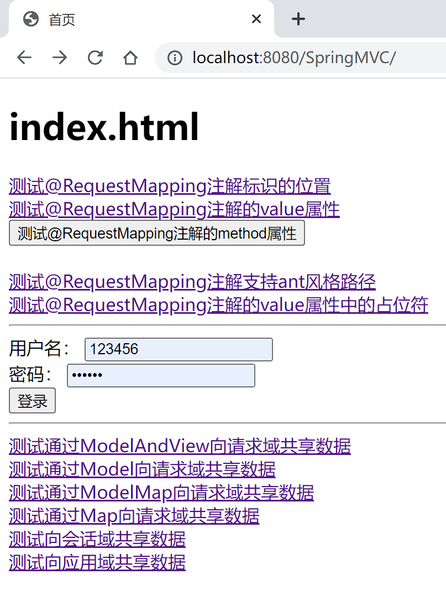

### SpringMVC的视图

SpringMVC中的视图是View接口，视图的作用是渲染数据，将模型Model中的数据展示给用户
SpringMVC视图的种类很多，默认有转发视图和重定向视图

#### ThymeleafView

当控制器方法中所设置的视图名称没有任何前缀时，此时的视图名称会被SpringMVC配置文件中所配置的视图解析器解析，视图名称拼接试图前缀和视图

```java
    @RequestMapping("/test/view/thymeleaf")
    public String testThymeleafView(){
        return "success";
    }
```

配置ThymeleafView视图

```xml
<bean id="viewResolver" class="org.thymeleaf.spring5.view.ThymeleafViewResolver">
        <property name="order" value="1"/>
        <property name="characterEncoding" value="UTF-8"/>
        <property name="templateEngine">
            <bean class="org.thymeleaf.spring5.SpringTemplateEngine">
                <property name="templateResolver">
                    <bean class="org.thymeleaf.spring5.templateresolver.SpringResourceTemplateResolver">
<!--                        index-->
                        <!-- 视图前缀 -->
                        <property name="prefix" value="/WEB-INF/templates/"/>
                        <!-- 视图后缀 -->
                        <property name="suffix" value=".html"/>
                        <property name="templateMode" value="HTML5"/>
                        <property name="characterEncoding" value="UTF-8"/>
                    </bean>
                </property>
            </bean>
        </property>
    </bean>
```

#### 重定向视图

```html
    <a th:href="@{/test/view/redirect}">测试SpringMVC的视图RedirectView</a><br>
```

使用 "redirect:\*\*\*"

```java
    @RequestMapping("/test/view/redirect")
    public String testRedDirectView(){
        return "redirect:/test/model";
    }
```

一般来说,使用转发视图时,使用Thymeleaf视图,使用重定向时,使用重定向视图,而访问页面失败时,就使用转发,访问成功就适用重定向

#### 视图控制器view-controller

当控制器方法中,仅仅用来实现页面跳转,即只需要设置视图名称时,可以将处理器方法使用view-controller标签进行表示

```html
<!--    开启mvc的注解驱动-->
<!--    -->
    <mvc:annotation-driven />
<!--    视图控制器：为当前的请求直接设置视图名称实现页面跳转
        若设置视图控制器，则只有视图控制器所设置的请求会被处理，其他的处理将全部404
        此时必须配置一个标签：    <mvc:annotation-driven />
 -->
    <mvc:view-controller path="/" view-name="index"></mvc:view-controller>
```

配置好这个,就不用单独写一个类来设置跳转了,但是要注意必须要加上"    <mvc:annotation-driven />"标签

### RESTful

RESTful简介
REST:Representation State Transfer 表现层资源状态转移

1. 资源
   - 资源是一种看待服务器的方式，即将服务器看作是由很多离散的资源组成
2. 资源的表述
   - 资源的表述是一段资源在某个特定时刻的状态的描述，可以在客户端-服务器端之间转移(交换)
3. 状态转移
   - 转台转移说的是:在客户端和服务器端之间转移(transfer)代表资源状态的表述,通过转移和操作资源的表述,来间接实现操作资源的目的

#### RESTful的实现

具体说,就是HTTP协议里面,四个表示操作方式的动词:GET,POST,PUT,DELETE
分别对应四种基本操作:获取,新建,更新,删除
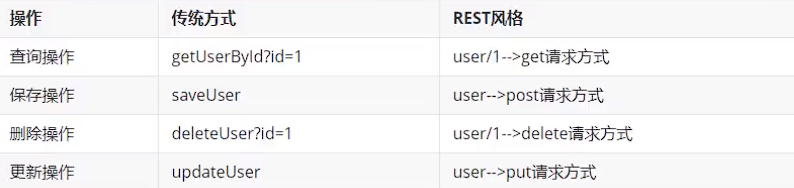

<!--  -->

REST风格提倡URL地址是用统一的风格设计,从前到后各个单词使用斜杠分开,不适用问好键值对方式携带请求参数,而是将要发送给服务器的数据作为URL地址的一部分,以保证整体风格的一致性

#### 代码

GET和POST都跟之前没什么区别
而PUT不能直接放在form表达中,因为form表单只有POST和GET两个参数
此时:

若要发送put和delete请求，需要在web.xml中配置一个过滤器：HiddenHttpMethodFilter
配置了过滤器之后，发送的请求要满足两个条件，才能将请求转化为put或delete

1. 当前请求必须为post
2. 当前请求必须传输请求参数_method  _method的值才是最终的请求方式

```html
<form th:action="@{/user}" method="post">
    <input type="hidden" name="_method" value="put">
    <input type="submit" value="修改用户信息">
</form>
```

```xml
<!--    设置请求方式的过滤器-->
    <filter>
        <filter-name>HiddenHttpMethodFilter</filter-name>
        <filter-class>org.springframework.web.filter.HiddenHttpMethodFilter</filter-class>
    </filter>
    <filter-mapping>
        <filter-name>HiddenHttpMethodFilter</filter-name>
        <url-pattern>/*</url-pattern>
    </filter-mapping>
```

此时就可以使用了

```java
    @RequestMapping(value = "/user",method = RequestMethod.PUT)
    public String updateUser(){
        System.out.println("修改用户信息===>  /user---->put");
        return "success";
    }
```

测试代码:

```html
<h1>index.html</h1>
<a th:href="@{/user}">查询所有的用户信息</a><br>
<a th:href="@{/user/1}">查询id为1的用户信息</a><br>

<form th:action="@{/user}" method="post">
    <input type="submit" value="添加用户信息">
</form>

<form th:action="@{/user}" method="post">
    <input type="hidden" name="_method" value="put">
    <input type="submit" value="修改用户信息">
</form>

<form th:action="@{/user/5}" method="post">
    <input type="hidden" name="_method" value="delete">
    <input type="submit" value="删除用户信息">
</form>
```

```java
package com.zzmr.controller;


import org.springframework.stereotype.Controller;
import org.springframework.web.bind.annotation.PathVariable;
import org.springframework.web.bind.annotation.RequestMapping;
import org.springframework.web.bind.annotation.RequestMethod;

/**
 * 实现查询所有的用户信息===>  /user---->get
 * 根据id查询用户信息===>  /user/1---->get
 * 添加用户信息===>  /user---->post
 * 修改用户信息===>  /user---->put
 * 删除用户信息===>  /user/1---->delete
 * <p>
 * <p>
 * 注意：浏览器目前只能发送get和post请求
 * 若要发送put和delete亲求，需要在web.xml中配置一个过滤器：HiddenHttpMethodFilter
 * 配置了过滤器之后，发送的请求要满足两个条件，才能将请求转化为put或delete
 * 1. 当前请求必须为post
 * 2. 当前请求必须传输请求参数_method  _method的值才是最终的请求方式
 */

@Controller
public class TestRestController {

    @RequestMapping(value = "/user", method = RequestMethod.GET)
    public String getAllUser() {
        System.out.println("实现查询所有的用户信息===>  /user---->get");
        return "success";
    }

    @RequestMapping(value = "/user/{id}", method = RequestMethod.GET)
    public String getUserById(@PathVariable("id") Integer id) {
        System.out.println("根据id查询用户信息===>  /user/" + id + "---->get");
        return "success";
    }

    @RequestMapping(value = "/user", method = RequestMethod.POST)
    public String insertUser() {
        System.out.println("添加用户信息===>  /user---->post");
        return "success";
    }

    @RequestMapping(value = "/user", method = RequestMethod.PUT)
    public String updateUser() {
        System.out.println("修改用户信息===>  /user---->put");
        return "success";
    }

    @RequestMapping(value = "/user/{id}", method = RequestMethod.DELETE)
    public String deleteUser(@PathVariable Integer id) {
        System.out.println("删除用户信息===>  /user/" + id + "---->delete");
        return "success";
    }

}
```

#### 派生注解

```java
    //@RequestMapping(value = "/user", method = RequestMethod.GET)
    @GetMapping("/user")
    public String getAllUser() {
        System.out.println("实现查询所有的用户信息===>  /user---->get");
        return "success";
    }

    //@RequestMapping(value = "/user/{id}", method = RequestMethod.GET)
    @GetMapping("/user/{id}")
    public String getUserById(@PathVariable("id") Integer id) {
        System.out.println("根据id查询用户信息===>  /user/" + id + "---->get");
        return "success";
    }

    //@RequestMapping(value = "/user", method = RequestMethod.POST)
    @PostMapping("/user")
    public String insertUser() {
        System.out.println("添加用户信息===>  /user---->post");
        return "success";
    }

    //@RequestMapping(value = "/user", method = RequestMethod.PUT)
    @PutMapping("/user")
    public String updateUser() {
        System.out.println("修改用户信息===>  /user---->put");
        return "success";
    }

    //@RequestMapping(value = "/user/{id}", method = RequestMethod.DELETE)
    @DeleteMapping("/user/{id}")
    public String deleteUser(@PathVariable Integer id) {
        System.out.println("删除用户信息===>  /user/" + id + "---->delete");
        return "success";
    }
```

### RESTful案例

```xml
 <!--
            配置默认Servlet处理静态资源
            当前工程的web.xml配置的前端控制器DispatcherServlet的url-pattern是/
            tomcat的web.xml配置的DefaultServlet的也是/
            此时浏览器发送的请求会优先被DispatcherServlet进行处理 但是DispatcherServlet无法处理静态资源
            若配置了     <mvc:default-servlet-handler /> 此时浏览器发送的请求都会被DefaultServlet处理
            若配置了        <mvc:default-servlet-handler /> 和      <mvc:annotation-driven/>
            浏览器发送的请求会先被Dispatcher处理，无法处理再交给DefaultServlet处理
    -->
    <mvc:default-servlet-handler />


    <!--    开启mvc的注解驱动-->
    <mvc:annotation-driven/>
    <!--    配置视图控制器-->
    <mvc:view-controller path="/" view-name="index"></mvc:view-controller>
```

引入了静态资源,但是之前配置的DispatcherServlet前端控制器无法解析静态资源,所以引入的静态资源就无法使用,可以配置上面的标签,但是还是要开启mvc的注解驱动才能用

*任重道远*

RESTful增删改查,这个还没用到数据库,只是模拟一下,到后面会整合SSM,到那时再详细的使用

```java
package com.zzmr.controller;

//import com.sun.deploy.nativesandbox.comm.Request;

import com.zzmr.dao.EmployeeDao;
import com.zzmr.pojo.Employee;
import org.springframework.beans.factory.annotation.Autowired;
import org.springframework.stereotype.Controller;
import org.springframework.stereotype.Repository;
import org.springframework.ui.Model;
import org.springframework.web.bind.annotation.PathVariable;
import org.springframework.web.bind.annotation.RequestMapping;
import org.springframework.web.bind.annotation.RequestMethod;

import java.util.Collection;


/**
 * 查询所有的员工信息----> /employee-->get
 * 跳转到添加页面----> /to/add-->get
 * 新增员工信息----> /employee-->post
 * 跳转到修改页面----> /employee/1-->get
 * 修改员工信息----> /employee-->put
 * 删除员工信息----> /employee-->delete
 */

@Controller
public class EmployeeController {

    @Autowired
    private EmployeeDao employeeDao;

    @RequestMapping(value = "/employee", method = RequestMethod.GET)
    public String getAllEmployee(Model model) {
        // 获取所有的员工信息
        Collection<Employee> allEmployee = employeeDao.getAll();
        //    将所有的员工信息在请求域中共享
        model.addAttribute("allEmployee", allEmployee);
        // 跳转到列表页面
        return "employee_list";
    }

    @RequestMapping(value = "/employee", method = RequestMethod.POST)
    public String addEmployee(Employee employee) {
        //    保存员工信息
        employeeDao.save(employee);
        //    重定向到列表功能：/employee
        return "redirect:/employee";
    }

    @RequestMapping(value = "/employee/{id}", method = RequestMethod.GET)
    public String toupdate(@PathVariable("id") Integer id, Model model) {
        //    根据id查询员工信息
        Employee employee = employeeDao.get(id);
        //    将员工信息共享到请求域中
        model.addAttribute("employee", employee);
        //    跳转到employee_update.html
        return "employee_update";
    }

    @RequestMapping(value = "/employee", method = RequestMethod.PUT)
    public String updateEmployee(Employee employee) {
        //    修改员工信息
        employeeDao.save(employee);
        //    重定向到列表页
        return "redirect:/employee";
    }

    @RequestMapping(value = "/employee/{id}", method = RequestMethod.DELETE)
    public String deleteEmployee(@PathVariable("id") Integer id){

    //    删除员工信息
        employeeDao.delete(id);
    //    重定向到列表页
        return "redirect:/employee";
    }
}
```

这里记住有用的东西

1. 重定向:

```
    return "redirect:/employee";
```

2. 将数据在请求域中共享
   - 在参数中加入Model model
     ``public String toupdate(@PathVariable("id") Integer id, Model model)``

### SpringMVC处理ajax请求

#### RequestBody获取json格式的请求参数

```html
<!DOCTYPE html>
<html lang="en" xmlns:th="http://www.thymeleaf.org">
<head>
    <meta charset="UTF-8">
    <title>首页</title>
</head>
<body>
<div id="app">
    <h1>index.html</h1>
    <input type="button" value="测试SpringMVC处理ajax" @click="testAjax()"><br>
    <input type="button" value="使用@RequestBody注解处理  Json格式的请求参数" @click="testRequestBody()"><br>

</div>
<script type="text/javascript" th:src="@{/js/vue.js}"></script>
<script type="text/javascript" th:src="@{/js/axios.min.js}"></script>
<script type="text/javascript">

    /**
     * axios({
     *     url: "",     //请求路径
     *     method: "",  //请求参数
     *     //以name=value&name=value的方式发送的请求参数
     *     //不管使用的请求方式是get还是post，请求参数都会被拼接到请求地址后
     *     //此种方式的请求参数可以通过request.getParameter()获取
     *     params: {},
     *     data: {} //以json格式发送的请求参数
     *     //请求参数会被请求报文的请求体中传输到服务器
     *     // 此种方式的请求参数不可以通过request.getParameter()获取
     *
     * }).then(response=>{
     *     console.log(response.data)
     * });
     */

    var vue = new Vue({
        el: "#app",
        methods: {
            testAjax() {
                axios.post(
                    "/SpringMVC/test/ajax?id=1001",
                    {username: "admin", password: "123456"}
                ).then(response => {
                    console.log(response.data);
                });
            },
            testRequestBody() {
                axios.post(
                    "/SpringMVC/test/RequestBody/json",
                    {username: "admin", password: "123456", age: 23, gender: "男"}
                ).then(response=>{
                    console.log(response.data);
                });
            }
        }

    });
</script>
</body>
</html>
```

```java
package com.zzmr.controller;


import com.zzmr.pojo.User;
import org.springframework.stereotype.Controller;
import org.springframework.web.bind.annotation.PathVariable;
import org.springframework.web.bind.annotation.RequestBody;
import org.springframework.web.bind.annotation.RequestMapping;

import javax.servlet.http.HttpServletResponse;
import java.io.IOException;
import java.util.Map;
import java.util.Objects;

/**
 * 1. @RequestBody 将请求体中的内容和控制器方法的形参进行绑定
 *
 * 2. 使用@requestBody注解，将json格式的请求参数转化为java对象
 * a> 导入jackson的依赖
 * b> 在SpringMVC配置文件中设置      <mvc:annotation-driven/>
 * c> 在处理请求的控制器方法的形参位置，直接设置json格式的请求参数要转换的java类型的形参，使用@requestBody注解标识即可
 */

@Controller
public class TestAjaxController {
    @RequestMapping("/test/ajax")
    public void testAjax(Integer id, @RequestBody String requestBody, HttpServletResponse response) throws IOException {
        System.out.println("id" + id);
        System.out.println("username" + requestBody);
        response.getWriter().write("hello,axios");
    }
    //
    ///**
    // * 转化为map集合
    // * @param map
    // * @param response
    // * @throws IOException
    // */
    @RequestMapping("/test/RequestBody/json")
    public void testRequestBody(@RequestBody Map<String, Object> map, HttpServletResponse response) throws IOException {
        System.out.println(map);
        response.getWriter().write("hello,RequestBody");
    }

    /**
     * 转化为java实体类
     * @param user
     * @param response
     * @throws IOException
     */
    //@RequestMapping("/test/RequestBody/json")
    public void testRequestBody(@RequestBody User user,HttpServletResponse response) throws IOException {
        System.out.println(user);
        response.getWriter().write("hello,RequestBody");
    }
}
```

以后请求方式基本上都是ajax,还有json,所以这是非常重要的,要记好@ResquestBody注解的用法
**有更简单的方法**

#### ResponseBody响应浏览器的json数据

```java
@RequestMapping("/test/ResponseBody")
    @ResponseBody
    public String testResponseBody() {
        return "success";
    }

    @RequestMapping("/test/ResponseBody/json")
    @ResponseBody
    public List<User> testResponseBodyJson() {
        User user1 = new User(1001, "admin", "123456", 21, "男");
        User user2 = new User(1001, "admin", "123456", 21, "男");
        User user3 = new User(1001, "admin", "123456", 21, "男");
        List<User> lsit = Arrays.asList(user1, user2, user3);
        return lsit;
    }
/*    public Map<String,Object> testResponseBodyJson() {
        User user1 = new User(1001, "admin", "123456", 21, "男");
        User user2 = new User(1001, "admin", "123456", 21, "男");
        User user3 = new User(1001, "admin", "123456", 21, "男");
        Map<String,Object> map = new HashMap<>();
        map.put("1001",user1);
        map.put("1002",user2);
        map.put("1003",user3);
        return map;
    }*/
/*    public User testResponseBodyJson() {
        User user = new User(1001, "admin", "123456", 21, "男");
        return user;
    }*/
```

非常方便

```html
    <a th:href="@{/test/ResponseBody}">测试@ResponseBody响应浏览器数据</a> <br>
    <input type="button" value="使用@ResponseBody注解响应Json格式的请求参数" @click="testResponseBody()"><br>
    =========================================
            testResponseBody() {
                axios.post("/SpringMVC/test/ResponseBody/json").then(response => {
                    console.log(response.data);
                });
            }
```

总之就是请求和响应的方法
到后面用到的时候会复习吧
继续看

#### @RestController注解

@RestController注解是SpringMVC提供的一个复合注解,标识在控制器的类上,就相当于为类添加了@Controller注解,并且为其中的每个方法添加了@ResponseBody注解

### 文件上传和下载

ResponseEntity用于控制器方法的返回值类型,该控制器方法的返回值就是响应到浏览器的响应报文
使用ResponseEntity实现下载文件的功能

#### 文件上传

这个代码属于是模板代码,以后用到直接拿就行

```java
package com.zzmr.controller;

import org.springframework.http.HttpHeaders;
import org.springframework.http.HttpStatus;
import org.springframework.http.ResponseEntity;
import org.springframework.stereotype.Controller;
import org.springframework.util.MultiValueMap;
import org.springframework.web.bind.annotation.RequestMapping;

import javax.servlet.ServletContext;
import javax.servlet.http.HttpSession;
import java.io.File;
import java.io.FileInputStream;
import java.io.IOException;
import java.io.InputStream;


/**
 * ResponseEntity 可以作为控制器方法的返回值，表示响应到浏览器的完整的响应报文
 */
@Controller
public class FileUpAndDownController {

    @RequestMapping("/test/down")
    public ResponseEntity<byte[]> testResponseEntity(HttpSession session) throws IOException {
        //获取ServletContext对象
        ServletContext servletContext = session.getServletContext();
        //获取服务器中文件的真实路径
        String realPath = servletContext.getRealPath("img");
        realPath = realPath + File.separator + "11.png";
        //创建输入流
        InputStream is = new FileInputStream(realPath);
        //创建字节数组        is.available()  获取输入流所对应文件的字节数
        byte[] bytes = new byte[is.available()];
        //将流读到字节数组中
        is.read(bytes);
        //创建HttpHeaders对象设置响应头信息
        MultiValueMap<String, String> headers = new HttpHeaders();
        //设置要下载方式以及下载文件的名字
        headers.add("Content-Disposition", "attachment;filename=11.png");
        //设置响应状态码
        HttpStatus statusCode = HttpStatus.OK;
        //创建ResponseEntity对象
        ResponseEntity<byte[]> responseEntity = new ResponseEntity<>(bytes, headers, statusCode);
        //关闭输入流
        is.close();
        return responseEntity;
    }


}
```

#### 文件下载

道理还是这个道理,没问题

1. 先是找到路径
2. 上传即可

这是上传的表单

```html
    <form th:action="@{/test/up}" method="post" enctype="multipart/form-data">
        头像<input type="file" name="photo"><br>
        <input type="submit" value="上传">
    </form>
```

```java
    @RequestMapping("/test/up")
    public String testup(MultipartFile photo, HttpSession httpSession) throws IOException {
        //获取上传文件的文件名
        String filename = photo.getOriginalFilename();
        //获取ServletContext对象
        ServletContext servletContext = httpSession.getServletContext();
        //获取当前工程下photo目录的真实路径
        String photoPath = servletContext.getRealPath("photo");
        //创建photoPath所对应的File对象
        File file = new File(photoPath);
        //判断file所对应的目录是否存在
        if (!file.exists()) {
            file.mkdir();
        }
        String fianlPath = photoPath + File.separator + filename;
        //上传文件
        photo.transferTo(new File(fianlPath));
        return "success";
    }
```

但是要进行配置
添加依赖

```xml
        <!-- https://mvnrepository.com/artifact/commons-fileupload/commons-fileupload -->
        <dependency>
            <groupId>commons-fileupload</groupId>
            <artifactId>commons-fileupload</artifactId>
            <version>1.3.1</version>
        </dependency>
```

**配置spring配置文件**
不然会报500

是通过id找到这个解析器的,而且id必须为multipartResolver

```xml
<!--    配置文件上传解析器-->
    <bean id="multipartResolver" class="org.springframework.web.multipart.commons.CommonsMultipartResolver">
<!--        <property name="defaultEncoding" value="UTF-8"></property>-->
    </bean>
```

#### 文件上传解决重名问题

思路就是先用String的lastindexOf方法把文件的后缀分割出来,然后再获取uuid,拼接到一块就OK了

```java
        String hzNamee = filename.substring(filename.lastIndexOf("."));
        //获取uuid
        String uuid = UUID.randomUUID().toString();
        //拼接一个新的文件名
        filename = uuid + hzNamee;
```

### 拦截器

**这一块了解一下就OK了**

#### 拦截器的配置

SpringMVC中的拦截控制器方法的执行
SpringMVC中的蓝机器需要实现HandlerInterceptor
SpringMVC的拦截器必须在SpringMVC的配置文件进行配置

在SpringMVC配置文件中配置拦截器

```xml
    <mvc:interceptors>
        <bean class="com.zzmr.interceptor.FirstInterceptor"/>
    </mvc:interceptors>
```

```java
package com.zzmr.interceptor;

import org.springframework.web.servlet.HandlerInterceptor;
import org.springframework.web.servlet.ModelAndView;

import javax.servlet.http.HttpServletRequest;
import javax.servlet.http.HttpServletResponse;

public class FirstInterceptor implements HandlerInterceptor {

    @Override
    public boolean preHandle(HttpServletRequest request, HttpServletResponse response, Object handler) throws Exception {
        System.out.println("FirstInterceptor--->preHandle");
        return true;
    }

    @Override
    public void postHandle(HttpServletRequest request, HttpServletResponse response, Object handler, ModelAndView modelAndView) throws Exception {
        System.out.println("FirstInterceptor--->postHandle");
    }

    @Override
    public void afterCompletion(HttpServletRequest request, HttpServletResponse response, Object handler, Exception ex) throws Exception {
        System.out.println("FirstInterceptor--->afterCompletion");
    }
}
```

preHandle方法的返回值就是是否放行的,true表示放行,false表示拦截

配置方式还有其他:

```xml
<!--    <bean id="firstInterceptor" class="com.zzmr.interceptor.FirstInterceptor"></bean>-->

    <mvc:interceptors>
<!--        bean和ref标签所配置的拦截器默认对DispatcherServlet处理的所有请求进行拦截-->
<!--        <bean class="com.zzmr.interceptor.FirstInterceptor"/>-->
<!--        <ref bean="firstInterceptor"></ref>-->
<!--        <ref bean="firstInterceptor"/>-->
        <mvc:interceptor>
<!--            配置需要拦截的请求路径  /**表示所有请求-->
            <mvc:mapping path="/**"/>
<!--            配置需要排除拦截的请求的请求路径-->
            <mvc:exclude-mapping path="/abc"/>
<!--            配置拦截器-->
            <ref bean="firstInterceptor"/>
        </mvc:interceptor>
    </mvc:interceptors>
```

而上面的mvc:interceptor标签是最精确的

#### 拦截器执行顺序

```java
package com.zzmr.interceptor;

import org.springframework.stereotype.Component;
import org.springframework.web.servlet.HandlerInterceptor;
import org.springframework.web.servlet.ModelAndView;

import javax.servlet.http.HttpServletRequest;
import javax.servlet.http.HttpServletResponse;

/**
 * 拦截器的三个方法
 * preHandle()  在控制器方法执行之前执行  其返回值表示对控制器方法的拦截（false）或放行（true）
 * postHandle()     在控制器方法执行之后执行
 * afterCompletion()    在控制器方法之后，且渲染视图完毕之后执行
 *
 *
 * 多个拦截器的执行顺序 和在SpringVC的配置文件中的配置的顺序有关
 * preHandle()  按照配置的顺序执行，而postHandle() 和 afterCompletion() 按照配置的逆序执行
 * 若拦截器中有某个拦截器的preHandle()返回值false
 * 拦截器的preHandle()返回false和它之前的拦截器的preHandle()都会执行
 * 所有的拦截器的postHandle()都不执行
 * 拦截器的preHandle()返回false之前的拦截器的afterCompletion会执行
 */

@Component
public class FirstInterceptor implements HandlerInterceptor {

    @Override
    public boolean preHandle(HttpServletRequest request, HttpServletResponse response, Object handler) throws Exception {
        System.out.println("FirstInterceptor--->preHandle");
        return true;
    }

    @Override
    public void postHandle(HttpServletRequest request, HttpServletResponse response, Object handler, ModelAndView modelAndView) throws Exception {
        System.out.println("FirstInterceptor--->postHandle");
    }

    @Override
    public void afterCompletion(HttpServletRequest request, HttpServletResponse response, Object handler, Exception ex) throws Exception {
        System.out.println("FirstInterceptor--->afterCompletion");
    }
}
```

### 异常处理

#### 基于配置的异常处理

SpringMVC提供了一个处理控制器方法执行过程中所出现的异常的接口:HandlerExceptionResolver和SimpleMappingExceptionResolver
HandlerExceptionResolver接口的实现类有:DefaultHandlerExceptionResolver和SimpleMappingExceptionResolver
SpringmVC提供了自定义的异常处理SimpleMappingExceptionResolver
使用方式如下:

**XML配置方式**

控制器方法:

```java
    @RequestMapping("/test/hello")
    public String testHello(){
        System.out.println(1/0);
        return "success";
    }
```

```xml
    <bean class="org.springframework.web.servlet.handler.SimpleMappingExceptionResolver">
        <property name="exceptionMappings">
            <props>
<!--                key设置要处理的异常 value设置出现该异常时，要跳转的页面所对应的逻辑视图-->
                <prop key="java.lang.ArithmeticException">error</prop>
            </props>
        </property>
<!--        设置共享在请求域中的异常信息的属性名-->
        <property name="exceptionAttribute" value="ex"></property>
    </bean>
```

非常简单,说的是配置起来啊
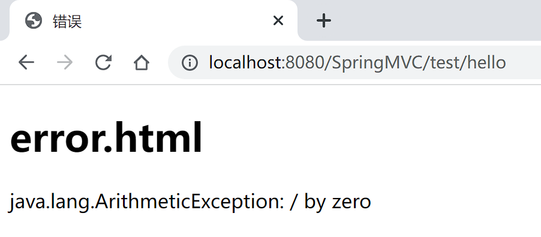

<!--  -->

**基于注解的配置方式**

异常处理组件:

```java
package com.zzmr.controller;

import org.springframework.ui.Model;
import org.springframework.web.bind.annotation.ControllerAdvice;
import org.springframework.web.bind.annotation.ExceptionHandler;
import org.springframework.web.servlet.ModelAndView;

//将当前类标识为异常处理的组件
@ControllerAdvice
public class ExceptionController {

    //设置要处理的异常信息
    @ExceptionHandler(ArithmeticException.class)
    public String handleException(Throwable ex, Model model) {
        //ex表示控制器方法所出现的异常
        model.addAttribute("ex",ex);
        return "error.html";
    }
}
```

### 注解配置SpringMVC

使用配置类和注解代替web.xml和SpringMVC配置文件的功能
**初学阶段,只会xml配置就可以了**

*但是以后用的最多的还是注解吧,大概应该可能是*

#### 创建初始化类,代替web.xml

感觉是清晰明了,毕竟是方法里面配置
里面都是数组,是因为以后的项目可能有多个配置文件/配置类
*WebConfig就是代替SpringMVC的配置文件的*

```java
package com.zzmr.config;

import org.springframework.web.filter.CharacterEncodingFilter;
import org.springframework.web.filter.HiddenHttpMethodFilter;
import org.springframework.web.servlet.support.AbstractAnnotationConfigDispatcherServletInitializer;

import javax.servlet.Filter;

//用于代替web.xml
public class WebInit extends AbstractAnnotationConfigDispatcherServletInitializer {


    @Override
    //设置一个配置类，代替Spring的配置文件
    protected Class<?>[] getRootConfigClasses() {
        return new Class[]{SpringConfig.class};
    }

    @Override
    //设置一个配置类，代替SpringMVC的配置文件
    protected Class<?>[] getServletConfigClasses() {
        return new Class[]{WebConfig.class};
    }

    @Override
    //设置SpringMVC的前端控制器DispatcherServlet的url-pattern
    protected String[] getServletMappings() {
        return new String[]{"/"};
    }

    @Override
    //设置当前的过滤器
    protected Filter[] getServletFilters() {
        //创建编码过滤器
        CharacterEncodingFilter characterEncodingFilter = new CharacterEncodingFilter();
        characterEncodingFilter.setEncoding("UTF-8");
        characterEncodingFilter.setForceEncoding(true);
        //创建处理请求方式的过滤器
        HiddenHttpMethodFilter hiddenHttpMethodFilter = new HiddenHttpMethodFilter();
        return new Filter[]{characterEncodingFilter,hiddenHttpMethodFilter};
    }
}
```

过滤器主要是两个

1. CharacterEncodingFilter
   1. setEncoding("UTF-8")
   2. setForceEncoding(true)
2. HiddenHttpMethodFilter
   - 这个不用设置什么属性

**最后把这两个过滤器return即可**

#### SpringMVC配置文件

```java
package com.zzmr.config;


import com.zzmr.interceptor.FirstInterceptor;
import org.springframework.context.annotation.Bean;
import org.springframework.context.annotation.ComponentScan;
import org.springframework.context.annotation.Configuration;
import org.springframework.web.context.ContextLoader;
import org.springframework.web.context.WebApplicationContext;
import org.springframework.web.multipart.commons.CommonsMultipartResolver;
import org.springframework.web.servlet.HandlerExceptionResolver;
import org.springframework.web.servlet.ViewResolver;
import org.springframework.web.servlet.config.annotation.*;
import org.springframework.web.servlet.handler.SimpleMappingExceptionResolver;
import org.thymeleaf.spring5.SpringTemplateEngine;
import org.thymeleaf.spring5.view.ThymeleafViewResolver;
import org.thymeleaf.templatemode.TemplateMode;
import org.thymeleaf.templateresolver.ITemplateResolver;
import org.thymeleaf.templateresolver.ServletContextTemplateResolver;

import java.util.List;
import java.util.Properties;

/**
 * 代替SpringMVC的配置文件
 * <p>
 * 扫描组件···视图解析器···默认的Servlet····
 * mvc的注解驱动···视图控制器····文件上传解析器···拦截器···异常解析器
 */

//将类标识为配置类
@Configuration
//扫描组件
@ComponentScan("com.zzmr.controller")
// 开启MVC的注解启动
@EnableWebMvc
public class WebConfig implements WebMvcConfigurer {


    @Override
    //处理静态资源
    public void configureDefaultServletHandling(DefaultServletHandlerConfigurer configurer) {
        configurer.enable();
    }

    @Override
    //配置视图解析器
    public void addViewControllers(ViewControllerRegistry registry) {
        registry.addViewController("/").setViewName("index");
    }

    //配置文件上传解析器
    //@Bean注解可以将标识的方法的返回值作为Bean进行管理 bean的id为方法的方法名
    @Bean
    public CommonsMultipartResolver multipartResolver() {
        return new CommonsMultipartResolver();
    }

    @Override
    //配置拦截器
    public void addInterceptors(InterceptorRegistry registry) {
        FirstInterceptor firstInterceptor = new FirstInterceptor();
        registry.addInterceptor(firstInterceptor).addPathPatterns("/**");
    }

    @Override
    //配置异常解析器
    public void configureHandlerExceptionResolvers(List<HandlerExceptionResolver> resolvers) {
        SimpleMappingExceptionResolver exceptionResolver = new SimpleMappingExceptionResolver();
        Properties prop = new Properties();
        prop.setProperty("java.lang.ArithmeticException", "error");
        exceptionResolver.setExceptionMappings(prop);
        exceptionResolver.setExceptionAttribute("ex");
        resolvers.add(exceptionResolver);
    }


    //配置生成模板解析器
    @Bean
    public ITemplateResolver templateResolver() {
        WebApplicationContext webApplicationContext = ContextLoader.getCurrentWebApplicationContext();
// ServletContextTemplateResolver需要一个ServletContext作为构造参数，可通过WebApplicationContext 的方法获得
        ServletContextTemplateResolver templateResolver = new ServletContextTemplateResolver(webApplicationContext.getServletContext());
        templateResolver.setPrefix("/WEB-INF/templates/");
        templateResolver.setSuffix(".html");
        templateResolver.setCharacterEncoding("UTF-8");
        templateResolver.setTemplateMode(TemplateMode.HTML);
        return templateResolver;
    }

    //生成模板引擎并为模板引擎注入模板解析器
    @Bean
    public SpringTemplateEngine templateEngine(ITemplateResolver templateResolver) {
        SpringTemplateEngine templateEngine = new SpringTemplateEngine();
        templateEngine.setTemplateResolver(templateResolver);
        return templateEngine;
    }

    //生成视图解析器并未解析器注入模板引擎
    @Bean
    public ViewResolver viewResolver(SpringTemplateEngine templateEngine) {
        ThymeleafViewResolver viewResolver = new ThymeleafViewResolver();
        viewResolver.setCharacterEncoding("UTF-8");
        viewResolver.setTemplateEngine(templateEngine);
        return viewResolver;
    }
}
```

这里面一堆东西

#### Spring配置文件

这个里面倒是没多少东西

```java
package com.zzmr.config;

import org.springframework.context.annotation.Configuration;

/**
 * 代替Spring的配置文件
 */

//将类标识为配置类
@Configuration
public class SpringConfig {
}
```

#### 拦截器

```java
package com.zzmr.interceptor;

import org.springframework.web.servlet.HandlerInterceptor;
import org.springframework.web.servlet.ModelAndView;

import javax.servlet.http.HttpServletRequest;
import javax.servlet.http.HttpServletResponse;

public class FirstInterceptor implements HandlerInterceptor {
    @Override
    public boolean preHandle(HttpServletRequest request, HttpServletResponse response, Object handler) throws Exception {
        return true;
    }

    @Override
    public void postHandle(HttpServletRequest request, HttpServletResponse response, Object handler, ModelAndView modelAndView) throws Exception {
        HandlerInterceptor.super.postHandle(request, response, handler, modelAndView);
    }

    @Override
    public void afterCompletion(HttpServletRequest request, HttpServletResponse response, Object handler, Exception ex) throws Exception {
        HandlerInterceptor.super.afterCompletion(request, response, handler, ex);
    }
}
```

### SpringMVC执行流程

#### SpringMVC常用组件

- DispathcerServlet: 前端控制器,不需要工程师开发,由框架提供
  作用: 统一处理请求和响应,整个流程控制的中心,由它调用其他组件处理用户的请求
- HandlerMapping: 处理器映射,不需要工程师开发,由框架提供
  作用: 根据请求的url.method等信息查找Handler,即控制器方法
- Handler: 处理器,需要工程师开发
  作用: 在DispathcerServlet的控制器Handler对具体的用户请求进行处理
- HandlerAdapter: 处理器适配器,不需要工程师开发,由框架提供
  作用:通过HandlerAdapter对处理器(控制器方法)进行执行
- ViewResovler: 视图解析器,不需要工程师开发,由框架提供
  作用: 进行视图解析,得到相应的视图,例如ThymeleafView InternalResourceView RedirectView
- View: 视图
  作用: 将模型数据通过页面展示给用户

感觉这些源码好难懂啊
.....

#### SpringMVC的执行流程

1. 用户向服务器发送请求,请求被SpringMVC前端控制器DispatcherServlet捕获
2. DispathcerServlet对请求URL进行解析,得到请求资源标识符(URI),判断请求URI对应的映射:
   - 不存在
     1. 再判断是否配置了mvc:default-servlet-handler
     2. 如果没有配置,则控制台报映射查找不到,客户端展示404错误
     3. 如果有配置,则访问目标资源(一般为静态资源,如js,css,html)找不到客户端也会展示404错误
   - 存在则执行下面的流程
     1. 根据该URI,调用HanlderMapping获得该Handler配置的所有相关的对象(包括Handler对象以及Handler对象对应的拦截器)最后以HandlerExecutionChain执行链对象的形式返回
     2. DispatcherServlet根据获得的Handler,选择一个合适的HandlerAdapter
     3. 如果成功获取HandlerAdapter,此时开始执行拦截器的preHandler()方法[正向]
     4. 提取Request中的模型数据,填充Handler入参,开始执行Handler(Controller)方法,处理请求,在填充Handler的入参过程中,根据配置,Spring将帮你做额外的工作:
        - HttpMessageConveter: 将请求消息(如json.xml等数据)转换成一个对象,将对象转换成指定的响应信息
        - 数据转换:对请求消息进行数据转换,如String转换成Integer,Double等
        - 数据格式化:对请求消息进行数据格式化,如将字符串转化成格式化数字或格式化日期等
        - 数据验证:验证数据的有效性(长度,格式等) 验证结果存储到BindingResult或Error中
     5. Handler执行完成后,向DispatcherServlet返回一个ModelAndView对象
     6. 此时将开始执行拦截器的postHandle()方法[逆向]
     7. 根据返回的ModelAndView(此时会判断是否存在异常,如果存在异常,则执行HandlerExceptionResovler进行异常处理)选择一个适合的ViewResover进行试图解析,根据Model和View来渲染视图
     8. 渲染视图完毕执行拦截器的afterCompletion()方法(逆向)
     9. 将渲染结果返回给客户端

## SSM整合

### ContextLoaderListener

Spring提供了监听器COntextLoaderListener,实现ServletContextListener接口,课监听ServletContext的状态,在web服务器的启动,读取Spring的配置文件,创建Spring的IOC容器,web应用中必须在web.xml中配置

配置文件:

```xml
<listener>
    <!--
        配置Spring的监听器，在服务器启动时加载Spring的配置文件
        Spring配置文件默认位置和名称：/WEB-INF/applicationContext.xml
        可通过上下文参数自定义Spring配置文件的位置和名称
    -->
    <listener-class>org.springframework.web.context.ContextLoaderListener</listener-class>
</listener>

<!--自定义Spring配置文件的位置和名称-->
<context-param>
    <param-name>contextConfigLocation</param-name>
    <param-value>classpath:spring.xml</param-value>
</context-param>
```

**下面测试这个监听器**

#### web.xml

```xml
<?xml version="1.0" encoding="UTF-8"?>
<web-app xmlns="http://xmlns.jcp.org/xml/ns/javaee"
         xmlns:xsi="http://www.w3.org/2001/XMLSchema-instance"
         xsi:schemaLocation="http://xmlns.jcp.org/xml/ns/javaee http://xmlns.jcp.org/xml/ns/javaee/web-app_4_0.xsd"
         version="4.0">
    <servlet>
        <servlet-name>SpringMVC</servlet-name>
        <servlet-class>org.springframework.web.servlet.DispatcherServlet</servlet-class>
        <init-param>
            <param-name>contextConfigLocation</param-name>
            <param-value>classpath:springmvc.xml</param-value>
        </init-param>
            <load-on-startup>1</load-on-startup>
    </servlet>
    <servlet-mapping>
        <servlet-name>SpringMVC</servlet-name>
        <url-pattern>/</url-pattern>
    </servlet-mapping>
    <listener>
<!--        在服务器启动时加载Spring的配置文件，获取IOC容器-->
        <listener-class>org.springframework.web.context.ContextLoaderListener</listener-class>
    </listener>
    <context-param>
        <param-name>contextConfigLocation</param-name>
        <param-value>classpath:spring.xml</param-value>
    </context-param>
</web-app>
```

#### springmvc.xml

```xml
<?xml version="1.0" encoding="UTF-8"?>
<beans xmlns="http://www.springframework.org/schema/beans"
       xmlns:xsi="http://www.w3.org/2001/XMLSchema-instance"
       xmlns:context="http://www.springframework.org/schema/context"
       xmlns:mvc="http://www.springframework.org/schema/mvc"
       xsi:schemaLocation="http://www.springframework.org/schema/beans http://www.springframework.org/schema/beans/spring-beans.xsd http://www.springframework.org/schema/context https://www.springframework.org/schema/context/spring-context.xsd http://www.springframework.org/schema/mvc https://www.springframework.org/schema/mvc/spring-mvc.xsd">

<!--    <!–    扫描控制成组件–>-->
<!--    <context:component-scan base-package="com.zzmr.controller"></context:component-scan>-->
    <!-- 自动扫描包 -->
    <context:component-scan base-package="com.zzmr.controller"/>
    <!-- 配置Thymeleaf视图解析器 -->
    <bean id="viewResolver" class="org.thymeleaf.spring5.view.ThymeleafViewResolver">
        <property name="order" value="1"/>
        <property name="characterEncoding" value="UTF-8"/>
        <property name="templateEngine">
            <bean class="org.thymeleaf.spring5.SpringTemplateEngine">
                <property name="templateResolver">
                    <bean class="org.thymeleaf.spring5.templateresolver.SpringResourceTemplateResolver">
<!--                        index-->
                        <!-- 视图前缀 -->
                        <property name="prefix" value="/WEB-INF/templates/"/>
                        <!-- 视图后缀 -->
                        <property name="suffix" value=".html"/>
                        <property name="templateMode" value="HTML5"/>
                        <property name="characterEncoding" value="UTF-8"/>
                    </bean>
                </property>
            </bean>
        </property>
    </bean>

    <mvc:annotation-driven/>
    <mvc:view-controller path="/" view-name="index"></mvc:view-controller>
</beans>
```

#### spring.xml

```xml
<?xml version="1.0" encoding="UTF-8"?>
<beans xmlns="http://www.springframework.org/schema/beans"
       xmlns:xsi="http://www.w3.org/2001/XMLSchema-instance"
       xmlns:context="http://www.springframework.org/schema/context"
       xsi:schemaLocation="http://www.springframework.org/schema/beans http://www.springframework.org/schema/beans/spring-beans.xsd http://www.springframework.org/schema/context https://www.springframework.org/schema/context/spring-context.xsd">

<!--    扫描组件-->
    <context:component-scan base-package="com.zzmr.service.impl"></context:component-scan>

</beans>
```

### SSM整合准备

#### pom.xml

```xml
<?xml version="1.0" encoding="UTF-8"?>
<project xmlns="http://maven.apache.org/POM/4.0.0"
         xmlns:xsi="http://www.w3.org/2001/XMLSchema-instance"
         xsi:schemaLocation="http://maven.apache.org/POM/4.0.0 http://maven.apache.org/xsd/maven-4.0.0.xsd">
    <modelVersion>4.0.0</modelVersion>

    <groupId>com.zzmr.ssm</groupId>
    <artifactId>ssm_last</artifactId>
    <version>1.0-SNAPSHOT</version>
    <packaging>war</packaging>

    <properties>
        <spring.version>5.3.1</spring.version>
    </properties>
    <dependencies>

        <dependency>
            <groupId>org.springframework</groupId>
            <artifactId>spring-context</artifactId>
            <version>${spring.version}</version>
        </dependency>

        <dependency>
            <groupId>org.springframework</groupId>
            <artifactId>spring-beans</artifactId>
            <version>${spring.version}</version>
        </dependency>

        <!--springmvc-->
        <dependency>
            <groupId>org.springframework</groupId>
            <artifactId>spring-web</artifactId>
            <version>${spring.version}</version>
        </dependency>

        <dependency>
            <groupId>org.springframework</groupId>
            <artifactId>spring-webmvc</artifactId>
            <version>${spring.version}</version>
        </dependency>

        <dependency>
            <groupId>org.springframework</groupId>
            <artifactId>spring-jdbc</artifactId>
            <version>${spring.version}</version>
        </dependency>

        <dependency>
            <groupId>org.springframework</groupId>
            <artifactId>spring-aspects</artifactId>
            <version>${spring.version}</version>
        </dependency>

        <dependency>
            <groupId>org.springframework</groupId>
            <artifactId>spring-test</artifactId>
            <version>${spring.version}</version>
        </dependency>

        <!-- Mybatis核心 -->
        <dependency>
            <groupId>org.mybatis</groupId>
            <artifactId>mybatis</artifactId>
            <version>3.5.7</version>
        </dependency>

        <!--mybatis和spring的整合包-->
        <dependency>
            <groupId>org.mybatis</groupId>
            <artifactId>mybatis-spring</artifactId>
            <version>2.0.6</version>
        </dependency>

        <!-- 连接池 -->
        <dependency>
            <groupId>com.alibaba</groupId>
            <artifactId>druid</artifactId>
            <version>1.2.5</version>
        </dependency>

        <!-- junit测试 -->
        <dependency>
            <groupId>junit</groupId>
            <artifactId>junit</artifactId>
            <version>4.12</version>
            <scope>test</scope>
        </dependency>

        <!-- MySQL驱动 -->
        <dependency>
            <groupId>mysql</groupId>
            <artifactId>mysql-connector-java</artifactId>
            <version>8.0.16</version>
        </dependency>

        <!-- log4j日志 -->
        <dependency>
            <groupId>log4j</groupId>
            <artifactId>log4j</artifactId>
            <version>1.2.17</version>
        </dependency>

        <!-- https://mvnrepository.com/artifact/com.github.pagehelper/pagehelper -->
        <dependency>
            <groupId>com.github.pagehelper</groupId>
            <artifactId>pagehelper</artifactId>
            <version>5.2.0</version>
        </dependency>

        <!-- 日志 -->
        <dependency>
            <groupId>ch.qos.logback</groupId>
            <artifactId>logback-classic</artifactId>
            <version>1.2.3</version>
        </dependency>

        <!-- ServletAPI -->
        <dependency>
            <groupId>javax.servlet</groupId>
            <artifactId>javax.servlet-api</artifactId>
            <version>3.1.0</version>
            <scope>provided</scope>
        </dependency>

        <dependency>
            <groupId>com.fasterxml.jackson.core</groupId>
            <artifactId>jackson-databind</artifactId>
            <version>2.12.1</version>
        </dependency>

        <dependency>
            <groupId>commons-fileupload</groupId>
            <artifactId>commons-fileupload</artifactId>
            <version>1.3.1</version>
        </dependency>

        <!-- Spring5和Thymeleaf整合包 -->
        <dependency>
            <groupId>org.thymeleaf</groupId>
            <artifactId>thymeleaf-spring5</artifactId>
            <version>3.0.12.RELEASE</version>
        </dependency>

    </dependencies>


</project>
```

#### web.xml

```xml
<?xml version="1.0" encoding="UTF-8"?>
<web-app xmlns="http://xmlns.jcp.org/xml/ns/javaee"
         xmlns:xsi="http://www.w3.org/2001/XMLSchema-instance"
         xsi:schemaLocation="http://xmlns.jcp.org/xml/ns/javaee http://xmlns.jcp.org/xml/ns/javaee/web-app_4_0.xsd"
         version="4.0">
<!--    配置Spring的编码控制器-->
    <filter>
        <filter-name>CharacterEncodingFilter</filter-name>
        <filter-class>org.springframework.web.filter.CharacterEncodingFilter</filter-class>
        <init-param>
            <param-name>encoding</param-name>
            <param-value>UTF-8</param-value>
        </init-param>
        <init-param>
            <param-name>forceEncoding</param-name>
            <param-value>true</param-value>
        </init-param>
    </filter>
    <filter-mapping>
        <filter-name>CharacterEncodingFilter</filter-name>
        <url-pattern>/*</url-pattern>
    </filter-mapping>

<!--    配置处理请求方式的过滤器-->
    <filter>
        <filter-name>HiddenHttpMethodFilter</filter-name>
        <filter-class>org.springframework.web.filter.HiddenHttpMethodFilter</filter-class>
    </filter>
    <filter-mapping>
        <filter-name>HiddenHttpMethodFilter</filter-name>
        <url-pattern>/*</url-pattern>
    </filter-mapping>

<!--    配置SpringMVC的前端控制器DispatcherServlet-->
    <servlet>
        <servlet-name>SpringMVC</servlet-name>
        <servlet-class>org.springframework.web.servlet.DispatcherServlet</servlet-class>
<!--        设置SpringMVC配置文件自定义的位置和名称-->
        <init-param>
            <param-name>contextConfigLocation</param-name>
            <param-value>classpath:springmvc.xml</param-value>
        </init-param>
<!--        将DispatcherServlet初始化时间提前到服务器启动时-->
        <load-on-startup>1</load-on-startup>
    </servlet>
    <servlet-mapping>
        <servlet-name>SpringMVC</servlet-name>
        <url-pattern>/</url-pattern>
    </servlet-mapping>

<!--    配置Spring的监听器   在服务器启动时加载Spring的配置文件-->
    <listener>
        <listener-class>org.springframework.web.context.ContextLoaderListener</listener-class>
    </listener>

<!--    设置Spring配置文件自定义的位置和名称-->
    <context-param>
        <param-name>contextConfigLocation</param-name>
        <param-value>classpath:spring.xml</param-value>
    </context-param>

</web-app>
```

#### sql

还是用的之前的ssm数据库,应该是之前分页的使用用的

```sql
CREATE TABLE `t_emp` (
`emp_id` int(11) NOT NULL AUTO_INCREMENT,
`emp_name` varchar(20) DEFAULT NULL,
`age` int(11) DEFAULT NULL,
`sex` char(1) DEFAULT NULL,
`email` varchar(50) DEFAULT NULL,
PRIMARY KEY (`emp_id`)
) ENGINE=InnoDB DEFAULT CHARSET=utf8
```

#### springmvc.xml

```xml
<?xml version="1.0" encoding="UTF-8"?>
<beans xmlns="http://www.springframework.org/schema/beans"
       xmlns:xsi="http://www.w3.org/2001/XMLSchema-instance"
       xmlns:context="http://www.springframework.org/schema/context"
       xmlns:mvc="http://www.springframework.org/schema/mvc"
       xsi:schemaLocation="http://www.springframework.org/schema/beans http://www.springframework.org/schema/beans/spring-beans.xsd http://www.springframework.org/schema/context https://www.springframework.org/schema/context/spring-context.xsd http://www.springframework.org/schema/mvc https://www.springframework.org/schema/mvc/spring-mvc.xsd">

<!--    扫描控制层组件-->
    <context:component-scan base-package="com.zzmr.ssm_last.controller"/>

<!--    配置视图解析器-->
    <bean id="viewResolver" class="org.thymeleaf.spring5.view.ThymeleafViewResolver">
        <property name="order" value="1"/>
        <property name="characterEncoding" value="UTF-8"/>
        <property name="templateEngine">
            <bean class="org.thymeleaf.spring5.SpringTemplateEngine">
                <property name="templateResolver">
                    <bean class="org.thymeleaf.spring5.templateresolver.SpringResourceTemplateResolver">
                        <!--                        index-->
                        <!-- 视图前缀 -->
                        <property name="prefix" value="/WEB-INF/templates/"/>
                        <!-- 视图后缀 -->
                        <property name="suffix" value=".html"/>
                        <property name="templateMode" value="HTML5"/>
                        <property name="characterEncoding" value="UTF-8"/>
                    </bean>
                </property>
            </bean>
        </property>
    </bean>

    <!--    配置默认的servlet处理静态资源-->
    <mvc:default-servlet-handler />

    <!-- 开启mvc的注解驱动 -->
    <mvc:annotation-driven/>

<!--    配置视图控制器-->
    <mvc:view-controller path="/" view-name="index"></mvc:view-controller>


<!--    配置文件上传解析器-->
    <bean id="multipartResolver" class="org.springframework.web.multipart.commons.CommonsMultipartResolver"/>

<!--  配置异常解析处理器  -->
<!--    <bean class="org.springframework.web.servlet.handler.SimpleMappingExceptionResolver"/>-->

</beans>
```

#### spring.xml

```xml
<?xml version="1.0" encoding="UTF-8"?>
<beans xmlns="http://www.springframework.org/schema/beans"
       xmlns:xsi="http://www.w3.org/2001/XMLSchema-instance"
       xmlns:context="http://www.springframework.org/schema/context"
       xsi:schemaLocation="http://www.springframework.org/schema/beans http://www.springframework.org/schema/beans/spring-beans.xsd http://www.springframework.org/schema/context https://www.springframework.org/schema/context/spring-context.xsd">

<!--    扫描组件-除了控制层-->
    <context:component-scan base-package="com.zzmr.ssm_last">
        <context:exclude-filter type="annotation" expression="org.springframework.stereotype.Controller"/>
    </context:component-scan>

<!--    引入jdbc.properties-->
    <context:property-placeholder location="classpath:jdbc.properties"></context:property-placeholder>

<!--    配置数据源-->
    <bean id="dateSource" class="com.alibaba.druid.pool.DruidDataSource">
        <property name="driverClassName" value="${jdbc.driver}"></property>
        <property name="url" value="${jdbc.url}"></property>
        <property name="username" value="${jdbc.username}"></property>
        <property name="password" value="${jdbc.password}"></property>
    </bean>

<!--    配置SqlSessionFactoryBean  可以直接在Spring的IOC中获取SqlSessionFactory对象-->
    <bean class="org.mybatis.spring.SqlSessionFactoryBean">
<!--        设置MyBatis的核心配置文件的路径-->
        <property name="configLocation" value="classpath:mybatis-config.xml"></property>
<!--        设置数据源-->
        <property name="dataSource" ref="dateSource"></property>
<!--设置 类型别名所对应的包-->
        <property name="typeAliasesPackage" value="com.zzmr.ssm_last.pojo"></property>
<!--    设置映射文件的路径，只有映射文件的包和mapper接口的包不一致时需要设置    -->
<!--        <property name="mapperLocations" value="classpath:mappers/*.xml"></property>-->
<!--        插件-->
<!--        <property name="plugins">-->
<!--            <array>-->
<!--                <bean class="com.github.pagehelper.PageInterceptor"></bean>-->
<!--            </array>-->
<!--        </property>-->
    </bean>

<!--    配置mapper接口的扫描，将指定包下所有的mapper接口，通过
SqlSession创建代理实现类对象，并将这些对象交给ioc容器管理-->
    <bean class="org.mybatis.spring.mapper.MapperScannerConfigurer">
        <property name="basePackage" value="com.zzmr.ssm_last.mapper"></property>
    </bean>

</beans>
```

好家伙,这就相当于Spring配置文件把MyBatis配置文件掏空了,MyBatis大部分配置项都可以用Speing中的bean标签代替

#### MyBatis-config.xml

```xml
<?xml version="1.0" encoding="UTF-8" ?> <!DOCTYPE configuration PUBLIC "-//mybatis.org//DTD Config 3.0//EN"
        "http://mybatis.org/dtd/mybatis-3-config.dtd">
<configuration> <!--设置连接数据库的环境-->

    <!--    MyBtatis 核心配置文件中的标签必须要按照指定的顺序配置-->
    <!--    The content of element type "configuration" must match
    "(properties?,settings?,typeAliases?,typeHandlers?,objectFactory?,
    objectWrapperFactory?,reflectorFactory?,plugins?,environments?,databaseIdProvider?,mappers?)"-->


<!--    <!–    引入properties文件，此后就可在当前文件中使用 来访问 value –>-->
<!--    <properties resource="jdbc.properties"/>-->

    <settings>
        <!--        将下划线映射为驼峰-->
        <setting name="mapUnderscoreToCamelCase" value="true"/>
    </settings>

    <!--    设置类型别名：即为某个具体的类型，设置一个别名
在MyBatis的范围中就可以使用别名表示一个具体的类型
        -->
<!--    <typeAliases>-->
<!--        <package name=""/>-->
<!--    </typeAliases>-->


<!--    <environments default="development">-->

<!--        <environment id="development">-->

<!--            <transactionManager type="JDBC"/>-->

<!--            <dataSource type="POOLED">-->
<!--                <property name="driver" value="${jdbc.driver}"/>-->
<!--                <property name="url" value="${jdbc.url}"/>-->
<!--                <property name="username" value="${jdbc.username}"/>-->
<!--                <property name="password" value="${jdbc.password}"/>-->
<!--            </dataSource>-->
<!--        </environment>-->

<!--    </environments>-->


    <!--    引入mybatis的映射文件-->
<!--    <mappers>-->
<!--        <package name=""/>-->
<!--    </mappers>-->

    <plugins>
<!--        配置分页插件-->
        <plugin interceptor="com.github.pagehelper.PageInterceptor"></plugin>
    </plugins>

</configuration>
```

#### log4j.xml

```xml
<?xml version="1.0" encoding="UTF-8" ?> <!DOCTYPE log4j:configuration SYSTEM "log4j.dtd">
<log4j:configuration xmlns:log4j="http://jakarta.apache.org/log4j/">
    <appender name="STDOUT" class="org.apache.log4j.ConsoleAppender">
        <param name="Encoding" value="UTF-8"/>
        <layout class="org.apache.log4j.PatternLayout">
            <param name="ConversionPattern" value="%-5p %d{MM-dd HH:mm:ss,SSS} %m (%F:%L) \n"/>
        </layout>
    </appender>
    <logger name="java.sql">
        <level value="debug"/>
    </logger>
    <logger name="org.apache.ibatis">
        <level value="info"/>
    </logger>
    <root>
        <level value="debug"/>
        <appender-ref ref="STDOUT"/>
    </root>
</log4j:configuration>
```

#### 出现问题

```
connection error (DruidDataSource.java:1846) 
java.sql.SQLException: validateConnection false
```

这个是Druid数据库连接池和Spring的版本不匹配
改成1.2.5即可

```xml
        <!-- 连接池 -->
        <dependency>
            <groupId>com.alibaba</groupId>
            <artifactId>druid</artifactId>
            <version>1.2.5</version>
        </dependency>
```

**没有样式**
看看是不是没有加ref属性....

```css
    <link rel="stylesheet" th:href="@{/static/css/index_work.css}">
```

写完了,2022年10月4日 17点54分
嗯

学是学完了,但是感觉和没学一样,而且web的东西又忘了的差不多了,离谱
那怎么办
看代码重工的教程再走一遍吧

## SSM整合-AIO

### Spring整合MyBatis

就是只能再敲一遍然后熟悉一下步骤了
导入依赖
但可能到后面会增加依赖,所以在这先放着,然后如果加了再更新就好了
**至于你要是问我pom.xml是哪里来的,这个是maven工程自带的配置文件,专门用于导入jar包的,一个文件管理该工程的所有jar包,不用手动导入了,啊,你不知道maven怎么用?请移步:[Maven使用指南](https://jimmy66886.github.io/2022/09/04/Maven%E4%BD%BF%E7%94%A8%E6%95%99%E7%A8%8B/)**

#### pom.xml

```xml
<?xml version="1.0" encoding="UTF-8"?>
<project xmlns="http://maven.apache.org/POM/4.0.0"
         xmlns:xsi="http://www.w3.org/2001/XMLSchema-instance"
         xsi:schemaLocation="http://maven.apache.org/POM/4.0.0 http://maven.apache.org/xsd/maven-4.0.0.xsd">
    <modelVersion>4.0.0</modelVersion>

    <groupId>com.zzmr.ssm_aio</groupId>
    <artifactId>ssm_aio</artifactId>
    <version>1.0-SNAPSHOT</version>
    <packaging>war</packaging>

    <properties>
        <maven.compiler.source>8</maven.compiler.source>
        <maven.compiler.target>8</maven.compiler.target>
        <project.build.sourceEncoding>UTF-8</project.build.sourceEncoding>
        <spring.version>5.3.1</spring.version>
    </properties>


    <dependencies>
        <!-- SpringMVC -->
        <dependency>
            <groupId>org.springframework</groupId>
            <artifactId>spring-webmvc</artifactId>
            <version>${spring.version}</version>
        </dependency>

        <!-- Spring 持久化层所需依赖 -->
        <dependency>
            <groupId>org.springframework</groupId>
            <artifactId>spring-orm</artifactId>
            <version>${spring.version}</version>
        </dependency>

        <!-- 日志 -->
        <dependency>
            <groupId>ch.qos.logback</groupId>
            <artifactId>logback-classic</artifactId>
            <version>1.2.3</version>
        </dependency>

        <!-- ServletAPI -->
        <dependency>
            <groupId>javax.servlet</groupId>
            <artifactId>javax.servlet-api</artifactId>
            <version>3.1.0</version>
            <scope>provided</scope>
        </dependency>

        <!-- Spring5和Thymeleaf整合包 -->
        <dependency>
            <groupId>org.thymeleaf</groupId>
            <artifactId>thymeleaf-spring5</artifactId>
            <version>3.0.12.RELEASE</version>
        </dependency>

        <!-- Mybatis 和 Spring 的整合包 -->
        <dependency>
            <groupId>org.mybatis</groupId>
            <artifactId>mybatis-spring</artifactId>
            <version>2.0.6</version>
        </dependency>

        <!-- Mybatis核心 -->
        <dependency>
            <groupId>org.mybatis</groupId>
            <artifactId>mybatis</artifactId>
            <version>3.5.7</version>
        </dependency>

        <!-- MySQL驱动 -->
        <dependency>
            <groupId>mysql</groupId>
            <artifactId>mysql-connector-java</artifactId>
            <version>5.1.3</version>
        </dependency>

        <!-- 数据源 -->
        <dependency>
            <groupId>com.alibaba</groupId>
            <artifactId>druid</artifactId>
            <version>1.0.31</version>
        </dependency>

        <!-- Spring 的测试功能 -->
        <dependency>
            <groupId>org.springframework</groupId>
            <artifactId>spring-test</artifactId>
            <version>${spring.version}</version>
        </dependency>

        <!-- junit4 -->
        <dependency>
            <groupId>junit</groupId>
            <artifactId>junit</artifactId>
            <version>4.12</version>
            <scope>test</scope>
        </dependency>

        <!-- Lombok -->
        <dependency>
            <groupId>org.projectlombok</groupId>
            <artifactId>lombok</artifactId>
            <version>1.18.12</version>
            <scope>provided</scope>
        </dependency>
    </dependencies>
</project>
```

#### 配置数据源

就是配置连接数据库的4个重要参数

1. user
2. password
3. url
4. driver
   用了properties可以让这几个参数和代码分开,会比直接在代码中放密码安全点
   基本上是固定格式,但是其中的dirver有另一种格式:
   最初学JDBC的时候不加cj是用不了的,到了这里又可以用了
   **url里面的ssm就是数据库名称**

```properties
jdbc.driver=com.mysql.cj.jdbc.Driver
```

```properties
    jdbc.user=root
    jdbc.password=010203
    jdbc.url=jdbc:mysql://localhost:3306/ssm?serverTimezone=UTC
    jdbc.driver=com.mysql.jdbc.Driver
```

#### log4j日志

这个是直接拷贝过来的,应该没什么区别,之前用的时候也是直接拷的

```xml
<?xml version="1.0" encoding="UTF-8" ?> <!DOCTYPE log4j:configuration SYSTEM "log4j.dtd">
<log4j:configuration xmlns:log4j="http://jakarta.apache.org/log4j/">
    <appender name="STDOUT" class="org.apache.log4j.ConsoleAppender">
        <param name="Encoding" value="UTF-8"/>
        <layout class="org.apache.log4j.PatternLayout">
            <param name="ConversionPattern" value="%-5p %d{MM-dd HH:mm:ss,SSS} %m (%F:%L) \n"/>
        </layout>
    </appender>
    <logger name="java.sql">
        <level value="debug"/>
    </logger>
    <logger name="org.apache.ibatis">
        <level value="info"/>
    </logger>
    <root>
        <level value="debug"/>
        <appender-ref ref="STDOUT"/>
    </root>
</log4j:configuration>
```

#### 创建Spring配置文件

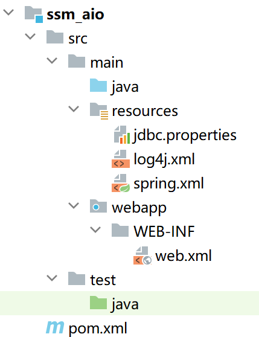

<!--  -->

先在spring的配置文件中加上这两个

```xml
    <!-- 加载外部属性文件 -->
    <context:property-placeholder location="classpath:jdbc.properties"/>

    <!-- 配置数据源 -->
    <bean id="druidDataSource" class="com.alibaba.druid.pool.DruidDataSource">
        <property name="username" value="${jdbc.user}"/>
        <property name="password" value="${jdbc.password}"/>
        <property name="driverClassName" value="${jdbc.driver}"/>
        <property name="url" value="${jdbc.url}"/>
    </bean>
```

写来写去,连测试都过不了,那还写个锤子
害
难搞
先停停吧,想一下下一步干什么,嗯
2022年10月5日
11点27分

## 结语

**相当于重新开始了,不要什么速度,这个学期能把SSM学完,学透彻,就OK,寒假做项目,只能这么搞了,你看你,都这个时候了,虽然看完了东西,但是却是一点都不会做项目,完全没有思路,前端的东西也不会写....害,做项目之前可能还要重学JS和VUE,这两个一学应该就问题不大了,嗯加油-2022年10月8日 14点16分**
