# SSM的思考

## MyBatis

重学的思考?

### SqlSessionUtil工具类

工具类是不可少的,而创建工具类的代码都是一样的,直接复制粘贴即可
*下面的是写的第一个测试类*,工具类在下面

```java
package com.zzmr.mybatis.test;

import com.zzmr.mybatis.mapper.UserMapper;
import com.zzmr.mybatis.pojo.User;
import org.apache.ibatis.io.Resources;
import org.apache.ibatis.session.SqlSession;
import org.apache.ibatis.session.SqlSessionFactory;
import org.apache.ibatis.session.SqlSessionFactoryBuilder;
import org.junit.Test;

import java.io.IOException;
import java.io.InputStream;

public class MyBatisTest {

    @Test
    public void testInsert() throws IOException {

        //    获取核心配置文件的输入流
        InputStream is = Resources.getResourceAsStream("mybatis-config.xml");
        //    获取SqlSessionFactoryBuilder对象
        SqlSessionFactoryBuilder sqlSessionFactoryBuilder = new SqlSessionFactoryBuilder();
        //    获取SqlSessionFactory对象
        SqlSessionFactory sqlSessionFactory = sqlSessionFactoryBuilder.build(is);
        //    获取sql会话对象SqlSession   是MyBatis提供的操作数据库的对象
        //SqlSession sqlSession = sqlSessionFactory.openSession();
        //有参设置，填true，即可实现自动提交，不用写   sqlSession.commit();
        SqlSession sqlSession = sqlSessionFactory.openSession(true);


        //    获取UserMapper的代理实现对象
        //      常用的方法
        UserMapper mapper = sqlSession.getMapper(UserMapper.class);
        //    调用mapper接口中的方法，实现添加用户信息的功能
        int result = mapper.insertUser();

        //提供sql以及语句的唯一标识找到sql并执行    唯一标识：namespace.sqlId
        //不常用的方法
        //int result = sqlSession.insert("com.zzmr.mybatis.mapper.UserMapper.insertUser");

        System.out.println("结果：" + result);
        //提交事务
        //sqlSession.commit();

        //开启自动提交就行了

        //关闭sqlSession
        sqlSession.close();
    }

}
```

嘿嘿嘿代码来咯

```java
package com.zzmr.mybatis.utils;

import org.apache.ibatis.io.Resources;
import org.apache.ibatis.session.SqlSession;
import org.apache.ibatis.session.SqlSessionFactory;
import org.apache.ibatis.session.SqlSessionFactoryBuilder;

import java.io.IOException;
import java.io.InputStream;

public class SqlSessionUtil {


    public static SqlSession getSqlSession() {
        SqlSession sqlSession = null;
        //    获取核心配置文件的输入流
        try {
            InputStream is = Resources.getResourceAsStream("mybatis-config.xml");
            //    获取SqlSessionFactoryBuilder对象
            SqlSessionFactoryBuilder sqlSessionFactoryBuilder = new SqlSessionFactoryBuilder();
            //    获取SqlSessionFactory
            SqlSessionFactory sqlSessionFactory = sqlSessionFactoryBuilder.build(is);
            //    获取SqlSession对象
            //    设置自动提交
            sqlSession = sqlSessionFactory.openSession(true);
            //

        } catch (IOException e) {
            e.printStackTrace();
        }
        return sqlSession;
    }
}
```

1. 先是创建输入流,要把mybatis的核心配置文件引入
   **InputStream is = Resources.getResourceAsStream("mybatis-config.xml");**
2. 获取SqlSessionFactoryBuilder对象
   最终目的是获取SqlSession对象,而这个SqlSessionFactoryBuilder,就相当于创建一个工厂的地基,有了这个地基,就可以创建SqlSessionFactory类,也就相当于创建Session的工厂
   **SqlSessionFactoryBuilder sqlSessionFactoryBuilder = new SqlSessionFactoryBuilder();**
3. 获取SqlSessionFactory类
   需要一提的就是这个地基需要有mybatis这个配置文件才能盖成工厂,所以要用build方法(传入is输入流)
   **SqlSessionFactory sqlSessionFactory = sqlSessionFactoryBuilder.build(is);**
4. 开启会话SqlSession
   方法名叫openSession,开启会话嘛,毕竟Session单词的意思就是会话,填true是因为里面的参数表示的是-是否开启自动提交事务,填了true,就可以少写一个sqlSession.commit()的语句
   **sqlSession = sqlSessionFactroy = sqlSessionFactroy.openSession(true)**

### 其他问题

至于MyBatis编写顺序:
先是写接口,再去写mapper,然后就可以测试了

还有就是要注意查询操作,有一个很重要的点:

```xml
<!--    User getUserById();-->
<!--    resultType 设置结果集类型，既查询的数据要转化为的java类型-->
<!--    resultMap： 自定义映射，处理多对一或一对多的映射关系 -->
    <select id="getUserById" resultType="com.zzmr.mybatis.pojo.User">
        select * from t_user where id = 1;
    </select>
```

简言之就是一般就用resultType
这个里面写的是全类名,但是配置以下----
就可以只写一个类名了,在MyBatis的核心配置文件中设置typeAliases标签,然后就可以在resultType中只写一个类名了

```xml
    <typeAliases>
<!--        type 设置需要起别名的类型
            alias   设置某个类型的别名
-->
<!--        <typeAlias type="com.zzmr.mybatis.pojo.User" alias="abc"></typeAlias>-->
<!--        如果不写，系统会自动生成别名，也就是类名，且不区分大小写-->
<!--        <typeAlias type="com.zzmr.mybatis.pojo.User"></typeAlias>-->
<!--    通过包设置类型别名，指定包下所有的类拥有默认的别名    -->
        <package name="com.zzmr.mybatis.pojo"/>
    </typeAliases>
```

哦对,一个很重要的问题:
MyBatis的核心配置文件中是有顺序的,要按照顺序来配置:

```
MyBatis 核心配置文件中的标签必须要按照指定的顺序配置
The content of element type "configuration" must match
"(properties?,settings?,typeAliases?,typeHandlers?,objectFactory?,
objectWrapperFactory?,reflectorFactory?,plugins?,environments?,databaseIdProvider?,mappers?)"
```

也就是说引入properties文件的配置要在typeAliases上面个,不然会报错

**有时候就很奇怪,就比如上面的typeAlias,比如说设置了别名abc,但是你只是改的一个地方的,剩下另一个resultType里面还是写的User,那即使只测一个方法,另一个还是会报错,要都改成abc才行,不过啊,还是直接在里面加一个package标签,name一设置,一个包就全部有别名了,多方便**

自己写了一遍Emp的,写是写出来了,现在就有一个问题,就是数据库中的字段名和java中的属性名忘了怎么设置对应的了,驼峰什么的,问题不大,后面继续看

还有个小细节就是,在打包后的映射文件和接口会在同一个目录下(当然前提是配置时mapper接口和映射文件所在的包必须一致才行,mapper接口的名字和映射文件的名字必须也是一致才行)
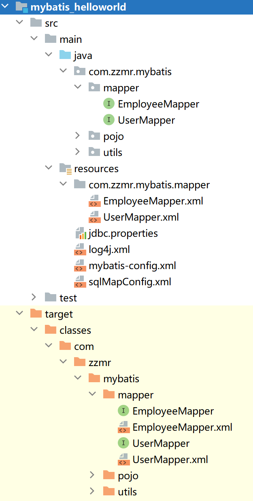

<!--  -->

做模板啥的没啥说的,再说以后大概率用不到MyBatis的配置文件(可能还会用,但是里面的内容会少得可怜)

### MyBatis获取参数

步骤就是:

1. 在方法上写上参数,比如根据用户名查询用户信息

```java
    User getUserByUsername(String username);
```

2. 在映射文件中,要以'${username}'或者#{}代替之前直接写的参数,${}本质上就是字符串的拼接,#{}就是占位符赋值,使用$时要注意手动加上双引号,使用#并不需要

```xml
<!--        User getUserByUsername(String username);-->
<!--    select * from t_user where username = #{username}-->
    <select id="getUserByUsername" resultType="User">
        select * from t_user where username = '${username}'
    </select>
```

**注意:若是单个字面量类型的参数,两个都可以,但还是建议用#{}**
明天见

#### 注意问题

1. 如果要是自己写的map集合,那获取的时候必须以自己设置的键获取,如果是直接放进去的数值,并没有自己建集合,那获取参数时只能使用arg0,arg1,或者param1,param2的方式获取
2. 以后还是用#{}比较多,但是某些特殊的情况,还是必须使用${}的
3. 如果是实体类类型的参数,就比如说:

```java
    @Test
    public void testInsertUser() {
        SqlSession sqlSession = SqlSessionUtil.getSqlSession();

        UserMapper mapper = sqlSession.getMapper(UserMapper.class);
        Map<String, Object> map = new HashMap<>();
        User user = new User(null, "zzmr1", "123456", 33, "女", "0123@163.com");
        mapper.insertUser(user);
    }
```

这种情况,那在映射文件中,就要写成这种形式,**可以通过实体类类型的属性名来获取属性值,属性名可不是简单的成员变量,而是set/get方法名去掉set/get剩下的内容(其实根成员变量区别不大)**

```xml
    <!--    void insertUser(User user);-->
    <insert id="insertUser">
        insert into t_user values (null,#{username},#{password},#{age},#{gender},#{email})
    </insert>
```

4. 还有注解的形式

```java
    /**
     * 使用注解
     * @return
     */
    User getUserByUserNameByParam(@Param("ffff") String username);
```

```xml
<!--    User getUserByUserNameByParam(@Param("username") String username);-->
    <select id="getUserByUserNameByParam" resultType="User">
        select * from t_user where username = #{ffff}
    </select>
```

这里获取参数的时候就是直接使用的Param注解里面的值(value) value是什么(ffff) 在映射文件中就以什么(ffff)获取

### 各种查询相关

**若sql语句查询的结果为多条时,一定不能以实体类类型作为方法的返回值,否则会出现TooManyResultsException异常,若结果只有一条,可以以实体类类型,也可以使用list集合作为方法的返回值**

**查询用户总数量**
接口:

```java
    /**
     * 查询用户的总数量
     *
     * @return
     */
    Integer getCount();
```

映射文件:
**重点就是类型别名,大差小不差 Integer可以写成int/INT/Integer/integer都行**
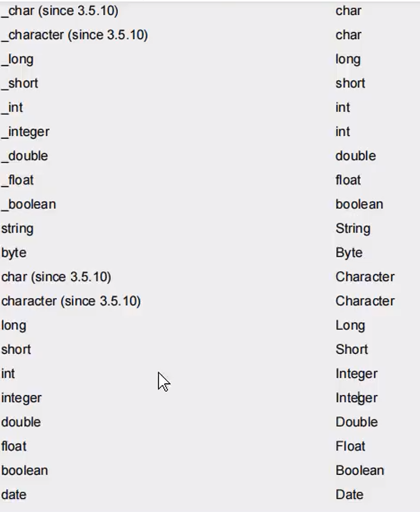

<!--  -->

```xml
<!--        Integer getCount();-->
<!--    MyBatis 中为java中常用的类型设置了类型别名
        Integer ： Integer
        int ； int_integer
        Map : map
        String : string
-->
    <select id="getCount" resultType="int">
        select count(*) from t_user;
    </select>
```

测试类:

```java
    @Test
    public void testGetCount() {
        SqlSession sqlSession = SqlSessionUtil.getSqlSession();
        SelectMapper mapper = sqlSession.getMapper(SelectMapper.class);

        Integer count = mapper.getCount();
        System.out.println(count);
    }
```

**查询结果为map**
以后的查询大都不会是一个实体类,经常使用map集合来作为返回值,若map集合中某一个值为空,那这个值并不会显示出来

这个List<Map<String,Object>>就很妙
用那什么@MapKey我是感觉没有这个方便
@MapKey相当于Map集合的套娃,可以将查询的每个map集合放在一个大的map集合中
以后用的多的还是将Map集合放在List集合中来实现

```java
    /**
     * 自己写的查询所有用户信息并返回为map
     */
    List<Map<String,Object>> getAllUserToMap();
```

```xml
<!--    List<Map<String,Object>> getAllUserToMap();-->
    <select id="getAllUserToMap" resultType="map">
        select * from t_user
    </select>
```

```java
    /**
     * 测试自己写的查询所有用户信息转化为map
     */
    @Test
    public void testGetAllUserToMap(){
        SqlSession sqlSession = SqlSessionUtil.getSqlSession();
        SelectMapper mapper = sqlSession.getMapper(SelectMapper.class);
        List<Map<String, Object>> alluser = mapper.getAllUserToMap();
        for (Map<String, Object> map : alluser) {
            System.out.println(map);
        }
    }
```

### 特殊查询

#### 模糊查询

虽然以后大部分情况都是使用#{}来实现,但是像模糊查询,还是可以使用${}的,但是用的也不多

```xml
<!--    这个时候用${}就要比#{}方便了-->
<!--    如果直接写成‘#{mohu}’ 因为#实际上是占位符赋值，相当于一个问好?,这时会被解析成'%?%',会被当成字符串的一部分-->
<!--                select * from t_user where username like '%${mohu}%'-->
<!--    select * from t_user where username like concat('%',#{mohu},'%')-->
<!--    这时由于我们设置了resultType，程序会调用set方法，而此时找不到赋值的地方，所以会报错-->
<!--    List<User> getUserByLikeByMe(@Param("mohu") String mohu);-->
        <select id="getUserByLikeByMe" resultType="User">
            select * from t_user where username like "%"#{mohu}"%"
        </select>
```

所以以后还是用这个比较多

```sql
select * from t_user where username like "%"#{mohu}"%"
```

#### 批量删除

这种情况就是要用${}了

```xml
<!--        void deleteByMe(@Param("ids") String ids);-->
    <delete id="deleteByMe">
        delete from t_user where id in (${ids})
    </delete>
```

如果用#{},因为是在()里,而()里是不能加单引号的,所以会报错,而使用${}就不会出问题
当然这不是唯一解,到后面学到foreach时会有其他方法

#### 动态设置表名

表名是不能加上单引号的
所以这里也只能使用$符

```xml
<!--    List<User> getUserListByMe(@Param("tableName") String tableName);-->
    <select id="getUserListByMe" resultType="User">
        select * from ${tableName}
    </select>
```

```java
    @Test
    public void testGetUserListByMe(){
        SqlSession sqlSession = SqlSessionUtil.getSqlSession();
        SpecialSQLMapper mapper = sqlSession.getMapper(SpecialSQLMapper.class);
        List<User> t_user = mapper.getUserListByMe("t_user");
        t_user.forEach(System.out::println);
    }
```

#### 获取自增的主键

```java
    /**
     * 插入User并返回主键值（id）
     * @param user
     */
    void insertUserByMe(User user);
```

useGeneratedKeys    表示当前添加功能使用自增的主键
keyProperties        将添加的数据的自增主键为实体类型的参数的属性赋值

```xml
<!--        void insertUserByMe(User user);-->
<!--    为什么不在写在返回值里？因为增上改的返回值固定的，都是受影响的行数-->
    <insert id="insertUserByMe" useGeneratedKeys="true" keyProperty="id">
        insert into t_user values (null,#{username},#{password},#{age},#{gender},#{email})
    </insert>
```

```java
    @Test
    public void testInsertByMe() {
        SqlSession sqlSession = SqlSessionUtil.getSqlSession();
        SpecialSQLMapper mapper = sqlSession.getMapper(SpecialSQLMapper.class);
        User user = new User(null, "张三", "010203", 23, "男", "121@qq.com");
        mapper.insertUserByMe(user);
        System.out.println(user.getId());
    }
```

此时就可以获取到user的id值:
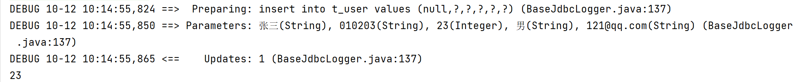

<!--  -->

### 自定义映射resultMap

这个就是设置那个驼峰映射
前面的测试都是把类的属性名写成跟Mysql列名一致了
而mysql中习惯以_为分割,Java中是驼峰
这时就要设置一个映射-在MyBatis核心配置文件中

```xml
 <settings>
<!--        将下划线映射为驼峰-->
        <setting name="mapUnderscoreToCamelCase" value="true"/>
    </settings>
```

这时新建两个表:t_emp和t_dept
t_emp里的字段:

1. emp_id
2. emp_name
3. age
4. gender
5. dept_id
   t_dept
6. dept_id
7. dept_name

**当字段名和属性名不一致时,如何处理映射关系**

1. 为查询的字段设置别名,和Java中的属性名保持一致(为什么设置别名和Java中的一致就行了呢?因为设置了别名,查询出的结果就会以别名的形式列出来,这时与Java类中的属性名一致,MyBatis就可以接收到MySql查询出的结果)
2. 当字段符合MySql的要求-使用的是下划线,而属性名符合Java的要求-使用驼峰
   此时可以在MyBatis的核心配置文件中设置一个全局配置,可以自动将下划线映射为驼峰

```xml
 <settings>
<!--        将下划线映射为驼峰-->
        <setting name="mapUnderscoreToCamelCase" value="true"/>
    </settings>
```

就是把emp_id 映射为empId
把emp_name映射为empName
以后用的多的应该就是这一种了,方便又好用
3. 使用resultMap自定义映射处理
两个属性:
id: 唯一标识
type: 处理映射关系的实体类的类型
常用的标签:
    id: 处理主键和实体类中实现的元素关系
    result: 处理普通字段和实体类中属性的映射关系
    column: 设置映射关系中字段名,必须是sql查询出的某个字段
    property: 设置映射关系中的属性的属性名,必须是处理的实体类类型中的属性名
    association: 处理多对一的映射关系(处理实体类类型的属性)
    collection: 处理一对多的映射关系(处理集合类型的属性)
虽然可以使用这种方法实现,但是我感觉好麻烦啊,比如:

```xml
    <resultMap id="empResultMap" type="Emp">
        <id column="emp_id" property="empId"></id>
        <result column="emp_name" property="empName"></result>
        <result column="age" property="age"></result>
        <result column="gender" property="gender"></result>
    </resultMap>

    <select id="getEmpByEmpId" resultMap="empResultMap">
        select * from t_emp where emp_id = #{empId};
    </select>
```

#### 多对一的映射情况

又是三种方式:

1. 直接使用resultMap处理

```xml
    <resultMap id="empAndDeptResultMapOne" type="Emp">
        <id column="emp_id" property="empId"></id>
        <result column="emp_name" property="empName"></result>
        <result column="age" property="age"></result>
        <result column="gender" property="gender"></result>
        <result column="dept_id" property="dept.deptId"></result>
        <result column="dept_name" property="dept.deptName"></result>
    </resultMap>
```

处理了每个字段以及Dept中的属性对应关系,这里要注意dept_name和dept.deptId这种对应关系

2. 使用association

```xml
    <resultMap id="empAndDeptResultMap" type="Emp">
        <id column="emp_id" property="empId"></id>
        <result column="emp_name" property="empName"></result>
        <result column="age" property="age"></result>
        <result column="gender" property="gender"></result>
<!--        处理多对一的映射关系（处理实体类类型的属性）
            property 设置需要处理映射关系的属性的属性名
            javaType  设置要处理的属性的类型
                -->
        <association property="dept" javaType="Dept">
            <id column="dept_id" property="deptId"></id>
            <result column="dept_name" property="deptName"></result>
        </association>
    </resultMap>
```

但是我说实话,这种实际上更麻烦了一点,但是比上一种看起来更清晰

3. 分步查询

```xml
    <resultMap id="empAndDeptByStepResultMap" type="Emp">
        <id column="emp_id" property="empId"></id>
        <result column="emp_name" property="empName"></result>
        <result column="age" property="age"></result>
        <result column="gender" property="gender"></result>
<!--        property  设置需要处理映射关系的属性的属性名
            select    设置分步查询的sql的唯一标识
            column    将查询出的某个字段作为 分步查询的sql条件
            fetchType  在开启了延迟加载的环境中，通过该属性设置当前的分步查询是否使用延迟加载
            fetchType   eager立即加载       lazy延迟加载
-->
        <association property="dept" fetchType="eager"
                     select="com.zzmr.mybatis.mapper.DeptMapper.getEmpAndDeptByStepTwo"
                     column="dept_id"></association>
    </resultMap>


<!--    Emp getEmpAndDeptByStepOne(@Param("empId") Integer empId);-->
     <select id="getEmpAndDeptByStepOne" resultMap="empAndDeptByStepResultMap">
         select *
         from t_emp
         where emp_id = #{empId};
     </select>

<!-- 注意,下面这个stepTwo是在DeptMapper里面 -->
<!--    Dept getEmpAndDeptByStepTwo(@Param("deptId") Integer deptId);-->
    <select id="getEmpAndDeptByStepTwo" resultType="Dept">
        select *
        from t_dept
        where dept_id = #{deptId};
    </select>
```

将两个sql关联在一起就是在association标签中的select属性中,要关联方法名
而column这个属性,是用来设置下一个查询的条件,比如这里把dept_id放进去,下一个查询就是用这里传过来的参数查询
**那就是,以后用到了来复制**

**但是问题也出现了,这个分步查询很明显比前面两种要麻烦很多,那它的优点是什么呢**
优点是**延迟加载**
开启延迟加载要在全局配置文件中的settings标签里(和驼峰映射是同一个地方)添加:

```xml
<!--        开启延迟加载-->
        <setting name="lazyLoadingEnabled" value="true"/>
<!--        按需加载-->
        <setting name="aggressiveLazyLoading" value="false"/>
```

设置了这两个标签后,就是全局配置了,而要想让某个分步查询还是立即加载的话,就可以**在association标签中设置fetchType属性**
设置fetchType="eager",就会立即加载
默认是lazy,就是延迟加载,**当然,使用这个标签的前提是设置了全局配置**

#### 一对多的映射情况

一对多没有级联,只有collection标签和分步查询
这里要注意collection标签中的ofType属性,要写上**集合存储的类型**
**collection标签实现方式**

```xml
    <resultMap id="deptAndEmpResultMap" type="Dept">
        <id column="dept_id" property="deptId"></id>
        <result column="dept_name" property="deptName"></result>
<!--        ofType  设置集合类型的属性中存储的数据的类型-->
        <collection property="emps" ofType="Emp">
            <id column="emp_id" property="empId"></id>
            <result column="emp_name" property="empName"></result>
            <result column="age" property="age"></result>
            <result column="gender" property="gender"></result>
        </collection>
    </resultMap>

<!--    Dept getDeptAndEmpByDeptId(@Param("deptId") Integer deptId);-->
    <select id="getDeptAndEmpByDeptId" resultMap="deptAndEmpResultMap">
        select *
        from t_dept LEFT JOIN t_emp on t_dept.dept_id = t_emp.dept_id 
        where t_dept.dept_id = #{deptId};
    </select>
```

**分布查询**
首先在部门mapper中写上第一步查询

```xml
    <resultMap id="deptAndEmpResultMapByStep" type="Dept">
        <id column="dept_id" property="deptId"></id>
        <result column="dept_name" property="deptName"></result>
        <collection property="emps"
                    select="com.zzmr.mybatis.mapper.EmpMapper.getDeptAndEmpByStepTwo"
                    column="dept_id">
        </collection>
    </resultMap>

  
<!--    Dept getDeptAndEmpByStepOne(@Param("deptId") Integer deptId);-->
    <select id="getDeptAndEmpByStepOne" resultMap="deptAndEmpResultMapByStep">
        select *
        from t_dept
        where dept_id = #{deptId};
    </select>
```

在员工mapper中写上第二步查询

```xml
<!--    List<Emp> getDeptAndEmpByStepTwoByMe(@Param("deptId") Integer deptId);-->
    <select id="getDeptAndEmpByStepTwoByMe" resultType="Emp">
        select * from t_emp where dept_id = #{deptId}
    </select>
```

**当然对应的接口中都要有相应的抽象方法**
ResultMap看完咯,还是挺有用的,但是以后不知道到底会以什么为开发基础
总结一句话,如果是多对一,那就是association,如果是一对多,那就是collection,当然不准确,理解就好
明天见!

### 动态Sql

就是根据特定条件去拼接Sql语句以实现某种效果

这里的主要问题就是Sql拼接时出现的bug,
比如如果直接使用where关键字写在最前面,而后面的条件全都是无效的,那就会导致多了一个where关键字,这时sql语句就错了
解决办法:

#### 使用where标签

就是会自动添加where关键字,如果后面的条件都不成立,则不会添加where关键字,还有去掉条件前的and关键字,**但是不能去掉后面的and**

```xml
<!--    List<Emp> getEmpByCondition(Emp emp);-->
    <select id="getEmpByCondition" resultType="Emp">
        select * from t_emp
        <where>
            <if test="empName != null and empName != ''">
                emp_name = #{empName}
            </if>
            <if test="age != null and age != ''">
                and age = #{age}
            </if>
            <if test="gender != null and gender != ''">
                and gender = #{gender}
            </if>
        </where>
    </select>
```

**那如果以后用的话,就用where标签吧,感觉trim挺麻烦的,哈哈哈哈艹,就是要注意,第一个if里面不能加上and,其他就没啥了**
但是trim标签还是要学的啊

#### trim标签

首先是trim标签的四个属性
prefix，suffix  在标签中内容前/后面添加指定内容
prefixOverrides,suffixOverriders 在标签中内容前/后面去掉指定内容
prefix 在标签中内容前添加指定内容:
比如说下面的,用trim标签代替where标签,

1. 使用prefix="where"给sql添加where关键字
2. 使用suffixOverrides="and"自动删除语句后多余的and

```xml
    <!--    List<Emp> getEmpByCondition(Emp emp);-->
    <select id="getEmpByCondition" resultType="Emp">
        select * from t_emp
        <trim prefix="where" suffixOverrides="and">
            <if test="empName != null and empName != ''">
                emp_name = #{empName} and
            </if>
            <if test="age != null and age != ''">
                age = #{age} and
            </if>
            <if test="gender != null and gender != ''">
                gender = #{gender}
            </if>
        </trim>
    </select>
```

#### choose,when,otherwise标签

用的不多,但是要看得明白
逆向工程里面自动生成的代码就会有很多的choose,when,otherwise
**跟if.else.if.else很像**
**when最少设置一个,otherwise最多设置一个**

若第一个when条件符合,那后面的情况都不会执行了

```xml
<!--    List<Emp> getEmpByChoose(Emp emp);-->
    <select id="getEmpByChoose" resultType="Emp">
        select * from t_emp
        <where>
            <choose>
                <when test="empName!=null and empName != ''">
                    emp_name = #{empName}
                </when>
                <when test="age!=null and age!=''">
                    age = #{age}
                </when>
                <when test="gender!=null and gender != ''">
                    gender = #{gender}
                </when>

            </choose>
        </where>
    </select>
```

比如这个,当测试里写上:

```java
    @Test
    public void testGetEmpByChoose() {
        SqlSession sqlSession = SqlSessionUtil.getSqlSession();
        DynamicSQLMapper mapper = sqlSession.getMapper(DynamicSQLMapper.class);
        Emp emp = new Emp(null, "张三",21 , "男");
        List<Emp> list = mapper.getEmpByChoose(emp);
        list.forEach(System.out::println);
    }
```

这时,因为第一个"张三"已经匹配上了,那后面的的21,还有"男"就没用了,因此现在执行完的结果是这样的,就算后面的不匹配(查询的是21,但实际上是20),也能查出来
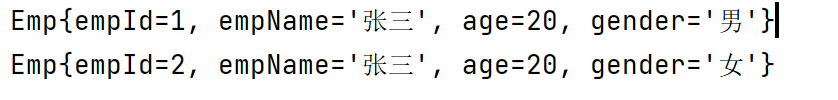

<!--  -->

#### forEach标签

这个标签还是很重要的,批量操作会用到
collection:传过来的集合,这里使用了@Param注解,所以可以直接写emps来获取传过来的集合,还是很方便的,所以以后还是要多用用@param注解
item,就是集合的每一项
这里不能直接使用empName,而是要用emp.empName,是因为这里并不是实体类,而是集合,循环的每一项是一个实体类,所以要用emp.empNanme
还有就是每个添加项是要用逗号分割的,这里不能直接在语句后面或者前面添加逗号,可以使用**separator属性**意为以什么字符分割

```xml
<!--    void insertMoreEmp(@Param("emps") List<Emp> emps);-->
    <insert id="insertMoreEmp">
        insert into t_emp values
        <foreach collection="emps" item="emp" separator=",">
            (null,#{emp.empName},#{emp.age},#{emp.gender},null)
        </foreach>
    </insert>
```

这里要注意使用了**Arrays.asList**方法,快速将一些项封装为一个集合

```java
    @Test
    public void testInsertMoreEmp() {
        SqlSession sqlSession = SqlSessionUtil.getSqlSession();
        DynamicSQLMapper mapper = sqlSession.getMapper(DynamicSQLMapper.class);
        Emp emp1 = new Emp(null, "zzmr1",20 , "男");
        Emp emp2 = new Emp(null, "zzmr2",20 , "女");
        Emp emp3 = new Emp(null, "zzmr3",20 , "女");
        List<Emp> emps = Arrays.asList(emp1, emp2, emp3);
        mapper.insertMoreEmp(emps);
    }
```

还有批量删除的操作
这里separator="or"是因为删除语句不可能使用逗号来分隔,语法不对,也不可能有人的id是这个又是那个,所以要用or来分隔,这都是mysql中学过的了,而且由于or是关键字,所以两边要有空格,这里separator会自动加空格

```xml
    <delete id="deleteMoreEmp">
                delete from t_emp where 
                <foreach collection="empIds" item="empId" separator="or">
                    emp_id = #{empId}
                </foreach>
    </delete>
```

```java
    @Test
    public void testDeleteMoreEmp() {
        SqlSession sqlSession = SqlSessionUtil.getSqlSession();
        DynamicSQLMapper mapper = sqlSession.getMapper(DynamicSQLMapper.class);
        Integer[] emps = new Integer[]{16,17};
        mapper.deleteMoreEmp(emps);
    }
```

还是非常方便的,只需要在Integer数组中写上要删除的id,就OK了
这里什么open还有close标签就不想用了,用in没有这样写方便

#### sql标签

还有一个标签叫sql标签
里面放上字段,一般是一个表的所有字段或者某些字段,用到的时候直接用include引入(如下操作)
还有就是使用*号会影响效率

```xml
    <sql id="empColumns">
        emp_id,emp_name,age,gender,dept_id
    </sql>


    <!--    List<Emp> getEmpByCondition(Emp emp);-->
    <select id="getEmpByCondition" resultType="Emp">
        select <include refid="empColumns"></include> from t_emp
        <trim prefix="where" suffixOverrides="and">
            <if test="empName != null and empName != ''">
                emp_name = #{empName} and
            </if>
            <if test="age != null and age != ''">
                age = #{age} and
            </if>
            <if test="gender != null and gender != ''">
                gender = #{gender}
            </if>
        </trim>
    </select>
```

这个已讲完,后面就是重头戏了,缓存记得之前学的时候都没听懂
什么一级缓存二级缓存

### 缓存

#### 一级缓存

一级缓存就是通过同一个SqlSession查询到的数据,如果使用同一个SqlSession查询数据,此时会从缓存中直接获取
**一级缓存是默认开启的**

**一级缓存失效的情况**

1. 不同的SqlSession对应不同的一级缓存
2. 同一个SqlSession但是查询条件不同
3. 同一个SqlSession两次查询期间执行了任何一次增删改操作
4. 同一个SqlSession两次查询期间手动清理了缓存

测试一
这样能测试第一个条件,mapper1对应sqlSession1,而mapper2对应sqlSession2,这时emp1和emp2会通过一条sql查出,emp3会通过另一条sql查出
而第二个条件也不能测试吧,查询条件都不同了,上一次的查询结果,这一次怎么可能用的到

```java
    @Test
    public void testCacheByMe(){
        SqlSession sqlSession1 = SqlSessionUtil.getSqlSession();

        SqlSession sqlSession2 = SqlSessionUtil.getSqlSession();

        CacheMapper mapper1 = sqlSession1.getMapper(CacheMapper.class);
        CacheMapper mapper2 = sqlSession2.getMapper(CacheMapper.class);

        Emp emp1 = mapper1.getEmpByIdByMe(1);
        System.out.println(emp1);
        Emp emp2 = mapper1.getEmpByIdByMe(1);
        System.out.println(emp2);

        Emp emp3 = mapper2.getEmpByIdByMe(1);
        System.out.println(emp3);
    }
```

*怎么感觉这块并不是很重要*

测试条件三
在进行增删改之后,一级缓存就失效了,查询相同的数据也是会重新查询

```java
    @Test
    public void testCacheByMe(){
        SqlSession sqlSession1 = SqlSessionUtil.getSqlSession();

        SqlSession sqlSession2 = SqlSessionUtil.getSqlSession();

        CacheMapper mapper1 = sqlSession1.getMapper(CacheMapper.class);
        CacheMapper mapper2 = sqlSession2.getMapper(CacheMapper.class);

        Emp emp1 = mapper1.getEmpByIdByMe(1);
        System.out.println(emp1);

        /**
         * 测试条件三，两次查询之间进行了增删改操作
         */
        mapper1.insertEmp(new Emp(null,"zzmr",12,"男"));

        Emp emp2 = mapper1.getEmpByIdByMe(1);
        System.out.println(emp2);

        //Emp emp3 = mapper2.getEmpByIdByMe(1);
        //System.out.println(emp3);
    }
```

测试条件4,**两次查询期间手动清理了缓存**,这个没啥说的吧,缓存都清理了,要重新查询也是很正常的

```java
    @Test
    public void testCacheByMe(){
        SqlSession sqlSession1 = SqlSessionUtil.getSqlSession();

        SqlSession sqlSession2 = SqlSessionUtil.getSqlSession();

        CacheMapper mapper1 = sqlSession1.getMapper(CacheMapper.class);
        CacheMapper mapper2 = sqlSession2.getMapper(CacheMapper.class);

        Emp emp1 = mapper1.getEmpByIdByMe(1);
        System.out.println(emp1);

        /**
         * 测试条件三，两次查询之间进行了增删改操作
         */
        //mapper1.insertEmp(new Emp(null,"zzmr",12,"男"));

        /**
         * 手动清理缓存，测试条件四
         */
        sqlSession1.clearCache();


        Emp emp2 = mapper1.getEmpByIdByMe(1);
        System.out.println(emp2);

        //Emp emp3 = mapper2.getEmpByIdByMe(1);
        //System.out.println(emp3);
    }
```

这可是要比笔记里写的清楚,每种测试都保留了,像笔记里我写的我都看不明白了
OK,下面看二级缓存!!!

#### 二级缓存

**二级缓存时SqlSessionFactory级别的**,通过同一个SqlSessionFactory创建的SqlSession查询的结果会被缓存,此后若查询相同的数据,结果就会从二级缓存中获取
二级缓存开启的条件:

1. 在核心配置文件中,设置全局配置属性cacheEnabled="true",默认为true,不需要设置
2. 在映射文件中设置 `<cache/>`
3. **二级缓存必须在SqlSession关闭或提交之后有效**
4. 查询的数据所转换的实体类类型必须实现序列化的接口

**使二级缓存失效的情况**
两次查询之间执行了任意的增删改,会使一级和二级缓存同时失效

*刚搜了一下,都说MyBatis的缓存不建议使用,一级还可以,但是二级是不推荐使用的*

```java
    @Test
    public void testCache() throws IOException {
        InputStream is = Resources.getResourceAsStream("mybatis-config.xml");
        SqlSessionFactory sqlSessionFactory = new SqlSessionFactoryBuilder().build(is);

        SqlSession sqlSession1 = sqlSessionFactory.openSession(true);
        CacheMapper mapper1 = sqlSession1.getMapper(CacheMapper.class);
        Emp emp1 = mapper1.getEmpById(1);
        System.out.println(emp1);

        /**
         * 验证二级缓存失效的情况
        */
        mapper1.insertEmp(new Emp(null,"zzmr",12,"男"));

        sqlSession1.close();

        SqlSession sqlSession2 = sqlSessionFactory.openSession(true);
        CacheMapper mapper2 = sqlSession2.getMapper(CacheMapper.class);
        Emp emp2 = mapper2.getEmpById(1);
        System.out.println(emp2);
        sqlSession2.close();
    }
```

这时就能验证二级缓存

但别忘了还有第4个条件,"查询的数据所转换的实体类类型必须实现序列化的接口"
这个是要让实体类实现Serializable接口,只需要在实体类后面加上就好了,其他都不用改

```java
    public class Emp implements Serializable
```

这时运行的日志里会有一个**Cache Hit Ratio**,也就是缓存命中率,只要不为零,那就是从缓存中获取的数据
**只有二级缓存才会输出缓存命中率**

**二级缓存相关配置**

1. evlction属性: 缓存回收策略,默认是LRU
   - LRU(Least Recently Used) 最近最少使用的:移除最长时间不被使用的对象
   - FiFO(First in First out) 先进先出:按对象进入缓存的顺序来移除它们
   - SOFT 软引用: 移除基于垃圾收集器状态的弱引用规则的对象
   - WEAK 弱引用: 更积极地移除基于垃圾收集器状态的弱引用规则的对象
2. flushinterval属性: 刷新间隔,单位毫秒,默认情况是不设置,也就是没有刷新间隔,缓存仅仅调用语句时刷新
3. size属性: 引用数目,正整数 代表缓存最多可以存储多少个对象,太大容易导致内存溢出
4. readOnly属性,只读,true/false
   - true 只读缓存,会给所有调用者返回缓存对象的相同实例,因此这些对象不能被修改,者提供了很重要的性能优势
   - false 读写缓存,会返回缓存对象的拷贝(通过序列化),这回满一下,但是安全,因此默认是false

**MyBatis缓存查询顺序**
先查二级缓存，因为二级缓存中可能会有其他程序已经查出来的数据，可以拿来直接使用
如果二级缓存没有命中，再查询一级缓存
如果一级缓存没有命中，则查数据库
**SqlSession关闭之后，一级缓存中的数据会写入二级缓存**

#### 整合第三方缓存

说实话感觉没用
依赖:

```xml
        <!-- Mybatis EHCache整合包 -->
        <dependency>
            <groupId>org.mybatis.caches</groupId>
            <artifactId>mybatis-ehcache</artifactId>
            <version>1.2.1</version>
        </dependency>

        <!-- slf4j日志门面的一个具体实现 -->
        <dependency>
            <groupId>ch.qos.logback</groupId>
            <artifactId>logback-classic</artifactId>
            <version>1.2.3</version>
        </dependency>
```

还有一个配置文件,同样放在resources目录下
必须叫ehcache.xml

```xml
<?xml version="1.0" encoding="utf-8" ?>
<ehcache xmlns:xsi="http://www.w3.org/2001/XMLSchema-instance"
         xsi:noNamespaceSchemaLocation="../config/ehcache.xsd">
    <!-- 磁盘保存路径 -->
    <diskStore path="D:\zzmr\ehcache"/>
    <defaultCache
            maxElementsInMemory="1000"
            maxElementsOnDisk="10000000"
            eternal="false"
            overflowToDisk="true"
            timeToIdleSeconds="120"
            timeToLiveSeconds="120"
            diskExpiryThreadIntervalSeconds="120"
            memoryStoreEvictionPolicy="LRU"></defaultCache>
</ehcache>
```

在mapper映射文件中加入

```xml
    <cache type="org.mybatis.caches.ehcache.EhcacheCache"/>
```

还有logback.xml日志配置文件

```xml
<?xml version="1.0" encoding="UTF-8"?>
<configuration debug="true">
    <!-- 指定日志输出的位置 -->
    <appender name="STDOUT" class="ch.qos.logback.core.ConsoleAppender">
        <encoder>
            <!-- 日志输出的格式 --> <!-- 按照顺序分别是： 时间、日志级别、线程名称、打印日志的类、日志主体内容、换行 -->
            <pattern>[%d{HH:mm:ss.SSS}] [%-5level] [%thread] [%logger] [%msg]%n</pattern>
        </encoder>
    </appender>
    <!-- 设置全局日志级别。日志级别按顺序分别是： DEBUG、INFO、WARN、ERROR -->
    <!-- 指定任何一个日志级别都只打印当前级别和后面级别的日志。 -->
    <root level="DEBUG">
        <!-- 指定打印日志的appender，这里通过“STDOUT”引用了前面配置的appender -->
        <appender-ref ref="STDOUT"/>
    </root>
    <!-- 根据特殊需求指定局部日志级别 -->
    <logger name="com.zzmr.mybatis.mapper" level="DEBUG"/>
</configuration>
```

**总结一句话,以后用缓存就用redis了,而这些用不到**

### 逆向工程

逆向工程:创建好数据表,然后再生成java类
这就是逆向工程
而正向工程是根据java类生成数据库的
?
看了一下之前写的东西,那是个啥啊,只把配置文件放进去了,其他啥都没写,怎么开启都不知道

#### 精简版

pom.xml

```xml
<dependencies>
        <dependency>
            <groupId>org.mybatis</groupId>
            <artifactId>mybatis</artifactId>
            <version>3.5.7</version>
        </dependency>
        <!-- junit测试 -->
        <dependency>
            <groupId>junit</groupId>
            <artifactId>junit</artifactId>
            <version>4.12</version>
            <scope>test</scope>
        </dependency>
        <!-- log4j日志 -->
        <dependency>
            <groupId>log4j</groupId>
            <artifactId>log4j</artifactId>
            <version>1.2.17</version>
        </dependency>
        <dependency>
            <groupId>mysql</groupId>
            <artifactId>mysql-connector-java</artifactId>
            <version>8.0.16</version>
        </dependency>
    </dependencies>


    <!-- 控制Maven在构建过程中相关配置 -->
    <build>
        <!-- 构建过程中用到的插件 -->
        <plugins>
            <!-- 具体插件，逆向工程的操作是以构建过程中插件形式出现的 -->
            <plugin>
                <groupId>org.mybatis.generator</groupId>
                <artifactId>mybatis-generator-maven-plugin</artifactId>
                <version>1.3.0</version>
                <!-- 插件的依赖 -->
                <dependencies>
                    <!-- 逆向工程的核心依赖 -->
                    <dependency>
                        <groupId>org.mybatis.generator</groupId>
                        <artifactId>mybatis-generator-core</artifactId>
                        <version>1.3.2</version>
                    </dependency>
                    <!-- MySQL驱动 -->
                    <dependency>
                        <groupId>mysql</groupId>
                        <artifactId>mysql-connector-java</artifactId>
                        <version>8.0.16</version>
                    </dependency>
                </dependencies>
            </plugin>
        </plugins>
    </build>
```

MyBatis的核心配置文件还是那几个,这玩意不影响逆向工程的配置,所以不用放里面了

generatorConfig.xml
逆向工程的必备配置文件,里面配置了几个很重要的项

```xml
<?xml version="1.0" encoding="UTF-8"?> <!DOCTYPE generatorConfiguration PUBLIC
        "-//mybatis.org//DTD MyBatis Generator Configuration 1.0//EN"
        "http://mybatis.org/dtd/mybatis-generator-config_1_0.dtd">
<generatorConfiguration>
    <!-- targetRuntime: 执行生成的逆向工程的版本
                MyBatis3Simple: 生成基本的CRUD（清新简洁版）
                MyBatis3: 生成带条件的CRUD（奢华尊享版） -->
    <context id="DB2Tables" targetRuntime="MyBatis3Simple">

        <!-- 数据库的连接信息 -->
        <jdbcConnection
                driverClass="com.mysql.cj.jdbc.Driver"
                connectionURL="jdbc:mysql://localhost:3306/ssm?serverTimezone=UTC"
                userId="root"
                password="010203">
        </jdbcConnection>

        <!-- javaBean的生成策略-->
        <!--    目标包和目标目录    -->
        <javaModelGenerator targetPackage="com.zzmr.mybatis.pojo" targetProject=".\src\main\java">
            <!--      enableSubPackages  是否能够使用子包，用于将 ‘点’ 译为下一级目录而不是目录的一部分      -->
            <property name="enableSubPackages" value="true"/>
            <!--      trimString    用于去掉字段前后的空格来生成对应的属性      -->
            <property name="trimStrings" value="true"/>
        </javaModelGenerator>

        <!-- SQL映射文件的生成策略 -->
        <sqlMapGenerator targetPackage="com.zzmr.mybatis.mapper" targetProject=".\src\main\resources">
            <property name="enableSubPackages" value="true"/>
        </sqlMapGenerator>

        <!-- Mapper接口的生成策略 -->
        <javaClientGenerator type="XMLMAPPER" targetPackage="com.zzmr.mybatis.mapper"
                             targetProject=".\src\main\java">
            <property name="enableSubPackages" value="true"/>
        </javaClientGenerator>

        <!-- 逆向分析的表 -->
        <!-- tableName设置为*号，可以对应所有表，此时不写domainObjectName -->
        <!-- domainObjectName属性指定生成出来的实体类的类名 -->
        <table tableName="t_emp" domainObjectName="Emp"/>
        <table tableName="t_dept" domainObjectName="Dept"/>

    </context>
</generatorConfiguration>
```

配置文件写好之后就可以跑起来了

**点击右上角的maven,找到该模块,点击Plugins,找到mybatis-generator**
双击执行
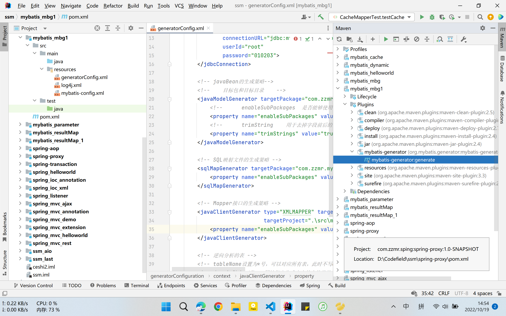

<!--  -->

然后代码就自动生成了
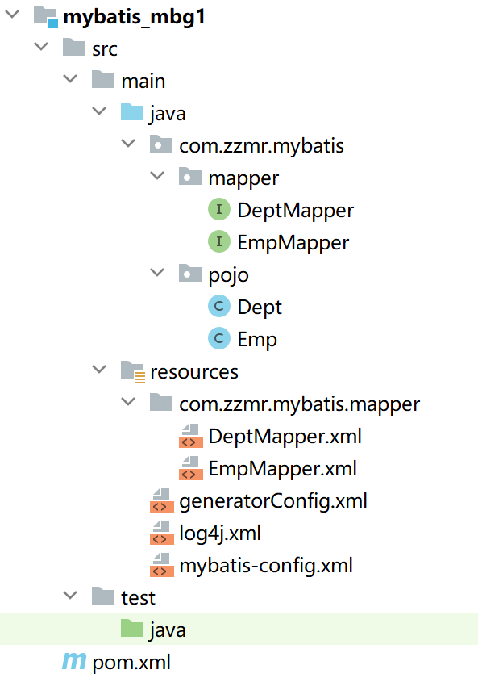

<!--  -->

然后我就是测试啊
测试selectAll方法,却发现输出的是地址,原来是**toString方法没有重写**
所以这个简洁版是不生成**toString方法吗**
卧槽,**有参构造**也没有自动生成,这个简洁版有点太简洁了啊

还真是
顺便把测试代码也放着

```java
import com.zzmr.mybatis.mapper.EmpMapper;
import com.zzmr.mybatis.pojo.Emp;
import com.zzmr.mybatis.utils.SqlSessionUtil;
import org.apache.ibatis.session.SqlSession;
import org.junit.Test;

import java.util.List;


public class SimpleTest {


    @Test
    public void testDeleteByPrimaryKey(){
        SqlSession sqlSession = SqlSessionUtil.getSqlSession();
        EmpMapper mapper = sqlSession.getMapper(EmpMapper.class);
        int i = mapper.deleteByPrimaryKey(22);
        System.out.println(i);
    }

    @Test
    public void testInsert(){
        SqlSession sqlSession = SqlSessionUtil.getSqlSession();
        EmpMapper mapper = sqlSession.getMapper(EmpMapper.class);
        Emp emp = new Emp(null,"zzmr",20,"男",1);
        int i = mapper.insert(emp);
        System.out.println(i);
    }

    @Test
    public void testSelectPrimaryKey(){
        SqlSession sqlSession = SqlSessionUtil.getSqlSession();
        EmpMapper mapper = sqlSession.getMapper(EmpMapper.class);
        Emp emp = mapper.selectByPrimaryKey(1);
        System.out.println(emp);
    }

    @Test
    public void testSelectAll(){
        SqlSession sqlSession = SqlSessionUtil.getSqlSession();
        EmpMapper mapper = sqlSession.getMapper(EmpMapper.class);
        List<Emp> emps = mapper.selectAll();
        emps.forEach(System.out::println);
    }


    /**
     * 这个感觉优点不太符合方法名了，实际上用的时候要先创建员工对象，再执行方法，将员工对象方法方法中
     */
    @Test
    public void testUpdateByPrimaryKey(){
        SqlSession sqlSession = SqlSessionUtil.getSqlSession();
        EmpMapper mapper = sqlSession.getMapper(EmpMapper.class);
        Emp emp = new Emp(23,"杨晋",20,"男",1);
        int i = mapper.updateByPrimaryKey(emp);
        System.out.println(i);
    }
}
```

把生成的所有方法都测试一遍了,应该没啥问题,看看后面那个什么完整版啊
先说一下这个简洁版的特点:

1. 没有重写有参构造,toString方法
2. 只能单表查询,不能多表联查

#### 完整版

只需要把generatorConfig.xml中的MyBatis3Simple改成MyBatis3就好了
其他不变,就能生成一大堆东西
想起来了,之前第一次学的时候就是配置错了,简洁版搞成了完整版哈哈哈哈
这个完整版的东西就是多
全是条件啥的

说人话就是,同样的操作可以使用的方法更多了,也更完整了
什么选择性修改搞迷糊了
一个是如果为null,就不会修改,这个是选择性的
一个是如果为null,还是会修改为null,这个是普通的

**完整版生成的实体类也是没有toString方法的**

**还要注意自己在实体类中写上有参/无参构造**

**选择性修改,就是当修改时没有修改某个字段时,是不会动该字段的,而普通修改,就会全部覆盖**

而这个selectByExample方法,要先创建Example对象,然后给这个对象添加条件
**可以添加的条件贼多**
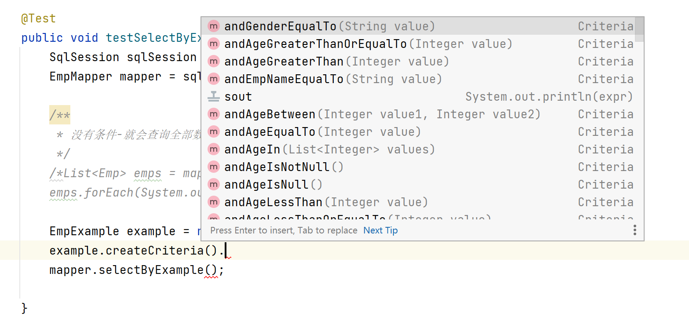

<!--  -->

测试晚上跑完步回来再测
跑完步回来也没测
今天测

```java
package com.zzmr.mybatis.test;

import com.zzmr.mybatis.mapper.EmpMapper;
import com.zzmr.mybatis.pojo.Emp;
import com.zzmr.mybatis.pojo.EmpExample;
import com.zzmr.mybatis.utils.SqlSessionUtil;
import org.apache.ibatis.session.SqlSession;
import org.junit.Test;

import java.util.List;

public class CompleteTest {


    /**
     * 这个CountByExample，就是根据条件查询有多少条数据，条件是 “名字为张三”，就是查询名字为张三的有多少个记录
     */
    @Test
    public void testCountByExample(){
        SqlSession sqlSession = SqlSessionUtil.getSqlSession();
        EmpMapper mapper = sqlSession.getMapper(EmpMapper.class);
        EmpExample example = new EmpExample();
        example.createCriteria().andEmpNameEqualTo("张三");
        int i = mapper.countByExample(example);
        System.out.println(i);
    }


    /**
     *  deleteByExample 根据条件删除，比如这个。条件是年龄为12 的，就会删除年龄为12的员工信息
     */
    @Test
    public void  testDeleteByExample(){
        SqlSession sqlSession = SqlSessionUtil.getSqlSession();
        EmpMapper mapper = sqlSession.getMapper(EmpMapper.class);
        EmpExample example = new EmpExample();
        example.createCriteria().andAgeEqualTo(12);
        int i = mapper.deleteByExample(example);
        System.out.println(i);
    }


    /**
     * 这个没啥说的吧，根据主键删除员工信息
     */
    @Test
    public void testDeleteByPrimaryKey(){
        SqlSession sqlSession = SqlSessionUtil.getSqlSession();
        EmpMapper mapper = sqlSession.getMapper(EmpMapper.class);
        int i = mapper.deleteByPrimaryKey(23);
        System.out.println(i);
    }

    /**
     * 普通的插入
     */
    @Test
    public void testInsert(){
        SqlSession sqlSession = SqlSessionUtil.getSqlSession();
        EmpMapper mapper = sqlSession.getMapper(EmpMapper.class);
        Emp emp = new Emp(null,"ZZMR123",20,"男");
        int i = mapper.insert(emp);
        System.out.println(i);
    }

    /**
     * 选择性插入
     * 什么是选择性插入呢，其实就是如果这个字段给它赋值，那就会在select里面写上，如果全填null，
     * 这个语句就会报错，因为相当于select from 了，select后面没有跟着字段，就报错了，而普通的insert不会出现这种情况
     */
    @Test
    public void testInsertSelective(){
        SqlSession sqlSession = SqlSessionUtil.getSqlSession();
        EmpMapper mapper = sqlSession.getMapper(EmpMapper.class);
        int insert = mapper.insertSelective(new Emp(null, "ZZMR1", null, null, null));
        System.out.println(insert);
    }


    @Test
    public void testSelectByExample(){
        SqlSession sqlSession = SqlSessionUtil.getSqlSession();
        EmpMapper mapper = sqlSession.getMapper(EmpMapper.class);

        /**
         * 没有条件-就会查询全部数据
         */
        /*List<Emp> emps = mapper.selectByExample(null);
        emps.forEach(System.out::println);*/

        /**
         * 根据条件查询数据
         */
        EmpExample example = new EmpExample();
        //条件就直接在后面and上就ok了，这也太方便了
        example.createCriteria().andEmpNameEqualTo("张三").andGenderEqualTo("女");
        //加”或者“的条件：     这样就拼成了：姓名为张三，性别为女或者年龄大于26的员工信息
        example.or().andAgeGreaterThan(26);
        List<Emp> emps = mapper.selectByExample(example);
        emps.forEach(System.out::println);

    }

    @Test
    public void testSelectByPrimaryKey(){
        SqlSession sqlSession = SqlSessionUtil.getSqlSession();
        EmpMapper mapper = sqlSession.getMapper(EmpMapper.class);
        Emp emp = mapper.selectByPrimaryKey(1);
        System.out.println(emp);
    }
  

    /**
     * 根据主键修改-普通
     * 没问题啊没问题
     */
    @Test
    public void testUpdateByPrimaryKey(){
        SqlSession sqlSession = SqlSessionUtil.getSqlSession();
        EmpMapper mapper = sqlSession.getMapper(EmpMapper.class);
        Emp emp = new Emp(23,"ZZMR",20,null);
        mapper.updateByPrimaryKey(emp);
    }

    /**
     * 终于知道选择性修改是啥意思了
     * 比如这个，如果原来的员工性别为”男“的话，这边写上null，是不会去修改原来的值的，而普通修改的话，就会把之前给覆盖
     */
    @Test
    public void testUpdateByPrimaryKeySelective(){
        SqlSession sqlSession = SqlSessionUtil.getSqlSession();
        EmpMapper mapper = sqlSession.getMapper(EmpMapper.class);
        Emp emp = new Emp(23,"ZZMR1",20,null);
        mapper.updateByPrimaryKeySelective(emp);
    }


}
```

### 分页插件

依稀记得这个是真的难
但是这个MyBatis简化了很多了

#### 配置分页插件

先加依赖

```xml
        <dependency>
            <groupId>com.github.pagehelper</groupId>
            <artifactId>pagehelper</artifactId>
            <version>5.2.0</version>
        </dependency>
```

在MyBatis核心配置文件中添加插件

```xml
    <plugins>
        <!-- 配置分页插件 -->
        <plugin interceptor="com.github.pagehelper.PageInterceptor"></plugin>
    </plugins>
```

要注意插件放的位置,这个标签要放在environments标签上面

而使用的步骤也很简单
**在查询之前开启分页功能**
PageHelper.startPage(1,4);
这就相当于开启了分页功能,而且获取当前页为1的内容,每页有4个数据
不过,还有一个很重要的对象--page
上面的方法会返回一个page对象
而page对象中有非常多的数据:

```java
Page{count=true, pageNum=1, pageSize=4, startRow=0, endRow=4, total=32, pages=8, reasonable=false, pageSizeZero=false}[Emp{empId=1, empName='1', age=null, gender='null'}, Emp{empId=2, empName='23', age=null, gender='null'}, Emp{empId=3, empName='4', age=null, gender='null'}, Emp{empId=4, empName='45', age=null, gender='null'}]
```

还有一个pageInfo对象

```java
        PageInfo<Emp> pageInfo = new PageInfo<>(emps,5);
```

这个里面也很多数据,比page中的数据还要多

```java
PageInfo{
    pageNum=1, pageSize=4, size=4, startRow=1, endRow=4, total=32, pages=8, list=Page{
        count=true, pageNum=1, pageSize=4, startRow=0, endRow=4, total=32, pages=8, reasonable=false, pageSizeZero=false}
[Emp{empId=1, empName='1', age=null, gender='null'}, Emp{empId=2, empName='23', age=null, gender='null'}, Emp{empId=3, empName='4', age=null, gender='null'}, Emp{empId=4, empName='45', age=null, gender='null'}], 
prePage=0, nextPage=2, isFirstPage=true, isLastPage=false, hasPreviousPage=false, hasNextPage=true, navigatePages=5, navigateFirstPage=1, navigateLastPage=5, navigatepageNums=[1, 2, 3, 4, 5]}
```

这个pageInfo对象里面存的数据是真的多啊
挺有用的
好了
MyBatis看完了,又一遍.

## Spring

这几天忙着打游戏,忙着写人工智能实验(虽然写不明白),嗯,2022年10月22日 15点57分
继续看咯
什么IOC,AOP
IOC: 反转资源获取方向,把'自己创建资源,向环境索取资源'变成环境将资源准备好,我们享受资源注入
AOP: 面向切面编程,在不修改代码功能的基础上增强代码功能
Spring IOC是一个容器,因为它包含并管理组件对象的生命周期,组件享受到容器化的管理,替程序员屏蔽了组件创建过程中的大量细节,极大降低了使用门槛,大幅提高了开发效率

### IOC容器

Inversion of Control 反转控制
而DI: Dependency Injection 为依赖注入
即为IOC的一种具体实现

#### 实现

看图吧,东西有点多,但是又不多
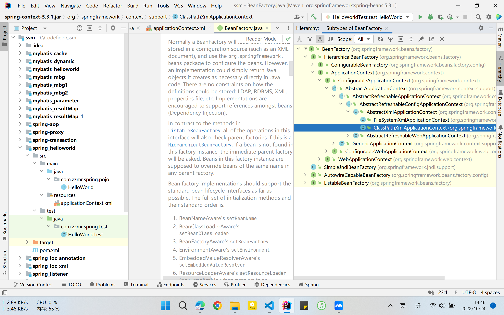

<!--  -->

用的比较多的就是ClassPathXmlApplicationContext类
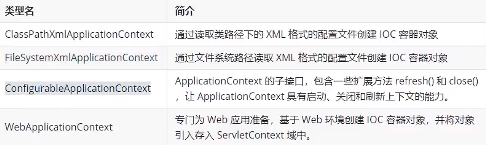

<!--  -->

#### 基于XML管理bean

这里就要强调了,一共两种管理方式,基于XML和基于注解,两种都非常重要,以后都会用到

流程是什么?

1. Java类
2. Spring配置文件-applocationContext.xml
   在里面配置上bean标签

```xml
    <bean id="helloworld" class="com.zzmr.spring.pojo.HelloWorld"></bean>
```

这时,IOC容器中就可以获取到HelloWorld类了,id为helloworld
3. 使用
这里new的是ClassPathXmlApplicationContext类,里面放的直接是配置文件的名字,所以说,这个配置文件是定位到resource目录下的
更精确地说,在打包后,resource目录会和java包打包在一起,所以可以直接访问

```java
    @Test
    public void testHelloWorld(){
    //            获取IOC容器
        ApplicationContext ioc = new ClassPathXmlApplicationContext("applicationContext.xml");
    //    获取IOC容器中的bean对象
        HelloWorld helloworld = (HelloWorld) ioc.getBean("helloworld");
        helloworld.sayHello();
    }
```

内容突然就多起来了
IOC要学的东西很多啊
**IOC容器获取对象实际上是根据反射实现的,这时就必须要要求Bean类有无参构造,没有的话就会出错**

下面看获取Bean的三种方式

1. 根据id获取,这个就是上面写的那种
2. 根据bean的类型获取
   **要求该IOC容器中有且只有一个类型匹配的bean**
   如果多了,就会报: NoUniqueBeanDefinitionException
   如果少了,就是一个都没有,就会报:
   NoSuchBeanDefinitionException
   所以还是要有且只有一个

```java
        Student studentOne = ioc.getBean(Student.class);
```

3. 根据bean的id和类型获取

```java
        Student studentOne = ioc.getBean("studentOne", Student.class);
```

两个都用上了属于是,
这样写的好处是可以直接获取Student对象了,步用进行强转,也不会出现根据类型获取bean出现的问题

**那以后用什么获取方式比较多呢,用根据类型获取**
因为没有谁会把一个Java类配置多个bean吧

**组件类实现了接口,根据接口类型可以获取bean,前提是bean唯一**

#### 依赖注入之setter注入

就是那个DI

> 说白了,依赖注入就是给类中的某些属性赋值的过程-也是写bean
> 如何赋值?----使用的是成员变量的set方法,如果没有set方法,是不能给属性赋值的

```xml
    <bean id="studentTwo" class="com.zzmr.spring.pojo.Student">
        <!--        property    通过成员变量的set方法进行赋值
                    name        设置需要复制的属性名（和set方法有关）
                    value       设置为属性所赋的值
        -->
        <property name="sid" value="1001"></property>
        <property name="sname" value="张三"></property>
        <property name="age" value="23"></property>
        <property name="gender" value="男"></property>
    </bean>
```

这个"依赖注入",写上参数之后,再次使用IOC容器来获取该类的对象时,就会获取注入后的对象

```java
    @Test
    public void testIOCByMe() {
        //获取IOC容器
        ApplicationContext ioc = new ClassPathXmlApplicationContext("spring-ioc.xml");

        //获取bean
        Student studentTwo = ioc.getBean("studentTwo", Student.class);

        System.out.println(studentTwo);
    }
```


<!--  -->

#### 依赖注入之构造器注入

> 这个就是使用类的构造方法来实现成员变量的赋值的
> **这里要注意,如果使用构造器注入,因为是使用了构造方法,所以里面的每个属性的顺序要和构造方法一致,不一致就会出现类型不匹配的问题**

```xml
    <bean id="studentThree" class="com.zzmr.spring.pojo.Student">
        <constructor-arg value="1002"></constructor-arg>
        <constructor-arg value="李四"></constructor-arg>
        <constructor-arg value="女"></constructor-arg>
        <constructor-arg value="24"></constructor-arg>
    </bean>
```

```java
    @Test
    public void testIOCByMe() {
        //获取IOC容器
        ApplicationContext ioc = new ClassPathXmlApplicationContext("spring-ioc.xml");

        //获取bean
        Student studentThree = ioc.getBean("studentThree", Student.class);

        System.out.println(studentThree);
    }
```

> 要注意的地方,如果出现两个构造方法,而某个参数不同,但参数的类型相同,这时可以指定使用哪一个构造方法,需要用到name属性
> 比如这里添加了一个具有分数的构造方法
> 还有一个具有年龄的构造方法

```java
    public Student(Integer sid, String sname,  String gender,Double score) {
        this.sid = sid;
        this.sname = sname;
        this.gender = gender;
        this.score = score;
    }

        public Student(Integer sid, String sname,  String gender,Integer age) {
        this.sid = sid;
        this.sname = sname;
        this.gender = gender;
        this.age = age;
    }

```

此时就可以使用name属性来指定了

```xml
    <bean id="studentThree" class="com.zzmr.spring.pojo.Student">
        <constructor-arg value="1002"></constructor-arg>
        <constructor-arg value="李四"></constructor-arg>
        <constructor-arg value="女"></constructor-arg>
        <constructor-arg value="24" name="score"></constructor-arg>
    </bean>
```

使用name指定这个arg是给哪个属性赋值---给score赋值

> **以上两种方式哪种用的多?当然是第一种,使用property赋值**

#### 特殊值处理

##### 为属性赋值为null

```xml
    <bean id="studentFour_two" class="com.zzmr.spring.pojo.Student">
        <property name="sid" value="1003"></property>
        <property name="sname" value="王五"></property>
        <property name="gender">
            <null></null>
        </property>
        <property name="age" value="23"></property>
    </bean>
```

**是不能直接在value里写上null的,不然会变成字符串null,正确的方法是在property标签中写上null标签,此时就对应gender为null,为空**

##### xml实体

这里要记住大于号和小于号
小于号: \&lt;
大于号: \&gt;

```xml
    <bean id="studentFour_three" class="com.zzmr.spring.pojo.Student">
        <property name="sid" value="1003"></property>
        <property name="sname" value="<王五>"></property>
        <property name="gender" value="男"></property>
        <property name="age" value="23"></property>
    </bean>
```

**CD区**
大写CD,回车,即可快速生成
\<![CDATA[]]>

```xml
    <bean id="studentFour_three" class="com.zzmr.spring.pojo.Student">
        <property name="sid" value="1003"></property>
        <property name="sname">
            <value><![CDATA[<王五>]]></value>
        </property>
        <property name="gender" value="男"></property>
        <property name="age" value="23"></property>
    </bean>
```

##### 为类类型属性赋值

第一种方式:

```xml
    <bean id="studentFive_two" class="com.zzmr.spring.pojo.Student">
        <property name="sid" value="1004"></property>
        <property name="sname" value="赵六"></property>
        <property name="age" value="14"></property>
        <property name="gender" value="男"></property>
        <property name="clazz" ref="clazzTwo"></property>
    </bean>
    <bean id="clazzTwo" class="com.zzmr.spring.pojo.Clazz">
        <property name="cid" value="123"></property>
        <property name="cname" value="高一一班"></property>
    </bean>
```

> 也没什么难的,主要是要给类类型的属性单独写一个bean,然后用ref来引用即可

第二种方式
级联方式,要保证提前为clazz属性赋值或者实例化
感觉这个比较鸡肋了,相当于对clazzTwo中的内容进行了修改,还是离不开clazz类

```xml
    <bean id="clazzTwo" class="com.zzmr.spring.pojo.Clazz">
        <property name="cid" value="123"></property>
        <property name="cname" value="高一一班"></property>
    </bean>


    <bean id="studentFive_three" class="com.zzmr.spring.pojo.Student">
        <property name="sid" value="1004"></property>
        <property name="sname" value="赵六"></property>
        <property name="age" value="14"></property>
        <property name="gender" value="男"></property>
        <property name="clazz" ref="clazzTwo"></property>
        <property name="clazz.cid" value="123"></property>
        <property name="clazz.cname" value="高二二班"></property>
    </bean>
```

> 哪个用的多?是第一种引用外部的bean,还有就是使用内部的bean,而级联这种方式用的不多

第三种-使用内部bean

```xml
    <bean id="studentFive_four" class="com.zzmr.spring.pojo.Student">
        <property name="sid" value="1004"></property>
        <property name="sname" value="赵六"></property>
        <property name="age" value="14"></property>
        <property name="gender" value="男"></property>
        <property name="clazz">
            <bean id="clazzInner" class="com.zzmr.spring.pojo.Clazz">
                <property name="cid" value="123"></property>
                <property name="cname" value="高一二班"></property>
            </bean>
        </property>
    </bean>
```

> 这里要注意的是,内部bean只能在这个类中使用,在**IOC是无法直接获取该bean的**

##### 为数组类型属性赋值

> 这里要注意使用的是array标签,也是使用的内部bean
> 还有就是array标签中有value和ref,如果是字面类类型的属性,就直接用value,如果是引用类型的,就要用ref

```xml
    <bean id="studentFive_five" class="com.zzmr.spring.pojo.Student">
        <property name="sid" value="1004"></property>
        <property name="sname" value="赵六"></property>
        <property name="age" value="14"></property>
        <property name="gender" value="男"></property>
        <property name="clazz">
            <bean id="clazzInner" class="com.zzmr.spring.pojo.Clazz">
                <property name="cid" value="123"></property>
                <property name="cname" value="高一二班"></property>
            </bean>
        </property>
        <property name="hobby">
            <array>
                <value>抽烟</value>
                <value>喝酒</value>
                <value>烫头</value>
                <value>学习</value>
            </array>
        </property>
    </bean>
```

##### 为集合类型赋值

也不难

```xml
    <bean id="clazzThree" class="com.zzmr.spring.pojo.Clazz">
        <property name="cid" value="123"></property>
        <property name="cname" value="高三三班"></property>
        <property name="students">
            <list>
                <ref bean="studentOne"></ref>
                <ref bean="studentTwo"></ref>
                <ref bean="studentThree"></ref>
            </list>
        </property>
    </bean>
```

测试:

```java
    @Test
    public void testIOCByMeTwo(){
        ApplicationContext ioc = new ClassPathXmlApplicationContext("spring-ioc.xml");
        Clazz clazz = ioc.getBean("clazzThree", Clazz.class);
        System.out.println(clazz);
    }
```

结果:
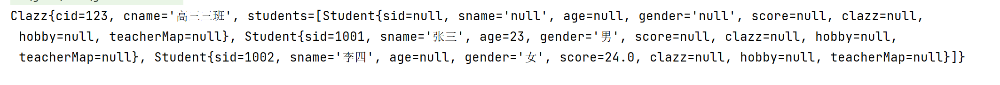

<!--  -->

> 配置一个集合类型的bean,需要使用util约束

```xml
    <!--    配置一个集合类型的bean，需要使用util的约束-->
    <util:list id="studentList">
        <ref bean="studentOne"></ref>
        <ref bean="studentTwo"></ref>
        <ref bean="studentThree"></ref>
    </util:list>
```

使用时,只需要引用即可

```xml
    <bean id="clazzThree" class="com.zzmr.spring.pojo.Clazz">
        <property name="cid" value="123"></property>
        <property name="cname" value="高三三班"></property>
        <property name="students" ref="studentList"></property>
    </bean>
```

##### 为map集合类型的属性赋值

用起来也没什么难的
第一种方式:

> 设置teacher的bean

```xml
    <bean id="teacherOne" class="com.zzmr.spring.pojo.Teacher">
        <property name="tid" value="10084"></property>
        <property name="tname" value="名字1"></property>
    </bean>
    <bean id="teacherTwo" class="com.zzmr.spring.pojo.Teacher">
        <property name="tid" value="100844"></property>
        <property name="tname" value="名字二"></property>
    </bean>
```

使用map

```xml
        <property name="teacherMap">
            <map>
                <entry key="10084" value-ref="teacherOne"></entry>
                <entry key="100844" value-ref="teacherTwo"></entry>
            </map>
        </property>
```

第二种方式:
和util:list有点相似

```xml
    <util:map id="teacherMapTwo">
        <entry key="10084" value-ref="teacherOne"></entry>
        <entry key="100844" value-ref="teacherTwo"></entry>
    </util:map>
```

使用时:

```xml
        <property name="teacherMap" ref="teacherMapTwo"></property>
```

##### p命名空间

这个没啥说的,用的也不多

```xml
    <bean id="studentSix" class="com.zzmr.spring.pojo.Student"
          p:sid="1005" p:sname="小明" p:teacherMap-ref="teacherMap">
    </bean>
```

#### Spring管理数据源

添加依赖-mysql驱动和数据库连接池(数据源)

```xml
        <!-- MySQL驱动 -->
        <dependency>
            <groupId>mysql</groupId>
            <artifactId>mysql-connector-java</artifactId>
            <version>8.0.16</version>
        </dependency>
        <!-- 数据源 -->
        <dependency>
            <groupId>com.alibaba</groupId>
            <artifactId>druid</artifactId>
            <version>1.0.31</version>
        </dependency>
```

实现:
这个location里面直接写上文件名,是因为这个路径同样定位到resource目录,也就是打包后的类目录

> 还有就是这个property可以设置一些数据库连接池的属性,总之就是mybatis配置文件中能设置的,spring也都能设置

```xml
<!--    引入jdbc.properties 之后就可以通过${key} 的方式访问value-->
    <context:property-placeholder location="jdbc.properties"></context:property-placeholder>

    <bean id="dataSource" class="com.alibaba.druid.pool.DruidDataSource">
        <property name="driverClassName" value="${jdbc.driver}"></property>
        <property name="url" value="${jdbc.url}"></property>
        <property name="username" value="${jdbc.username}"></property>
        <property name="password" value="${jdbc.password}"></property>
    </bean>
```

测试一下

```java
    @Test
    public void testDataSource() throws SQLException {
        ApplicationContext ioc = new ClassPathXmlApplicationContext("spring-datasource.xml");
        DruidDataSource data = ioc.getBean(DruidDataSource.class);
        System.out.println(data.getConnection());
    }
```

能输出一串地址就行,就证明获取成功

> 上面需要注意的就是一个context:property-placeholder标签,负责引入jdbc.properties文件,以后引入properties文件全是用的这个标签

#### bean的作用域

说是作用域,但是感觉更像是bean给创建Java对象指定的类型
写上scope="singleton" 就是单例模式
scope="prototype" 就是多例模式

> 单例和多例的区别:单例,表示获取该bean所对应的对象都是同一个,多例,表示获取该bean所对应的对象都不是同一个
> **一般都是使用单例,多例使用的不多**

```xml
    <bean id="student" class="com.zzmr.spring.pojo.Student" scope="singleton">
<!--    <bean id="student" class="com.zzmr.spring.pojo.Student" scope="prototype">-->
        <property name="sid" value="2009124101"></property>
        <property name="sname" value="杨晋"></property>
    </bean>
```

测试类

```java
    @Test
    public void testScope(){
        ApplicationContext ioc = new ClassPathXmlApplicationContext("spring-scope.xml");
        Student student1 = ioc.getBean(Student.class);
        Student student2 = ioc.getBean(Student.class);
        //System.out.println(student1.equals(student2));
        System.out.println(student1==student2);
    }
```

#### bean生命周期

感觉也没什么看的
主要是看每个方法执行的顺序

1. 实例化-调用无参构造
2. 依赖注入-调用set方法
3. 初始化-调用initMethod()方法,方法名是自定义的
   - 要在bean标签中写上init-method属性
4. 销毁(使用后销毁)-调用destoryMethod()方法,方法名是自定义的
   - 要在bean标签中写上destoryMethod属性

代码啥的看原来的笔记

**IOC容器创建时就会创建bean,而不是获取bean时才创建对象-前提是默认为单例,如果修改为多例prototype,这时创建IOC容器并不会创建bean对象,要在获取bean时才会创建对象-执行三个步骤**

> 后置处理器
> bean的后置处理器会在生命周期的初始虎啊前后添加额外的操作
> 需要实现BeanProcessor接口且配置到IOC容器中
> **配置完,IOC容器中所有的bean都会有这个功能**

配置:

```xml
    <bean id="myBeanPostProcessor" class="com.zzmr.spring.process.MyBeanPostProcessor"></bean>
```

方法:

```java
package com.zzmr.spring.process;

import org.springframework.beans.BeansException;
import org.springframework.beans.factory.config.BeanPostProcessor;

public class MyBeanPostProcessor implements BeanPostProcessor {

    @Override
    public Object postProcessBeforeInitialization(Object bean, String beanName) throws BeansException {
        //此方法在bean的生命周期初始化之前执行
        System.out.println("MyBeanPostProcessor---->后置处理器的postProcessBeforeInitialization");
        return bean;
    }

    @Override
    public Object postProcessAfterInitialization(Object bean, String beanName) throws BeansException {
        //此方法在bean的生命周期初始化之后执行
        System.out.println("MyBeanPostProcessor---->后置处理器的postProcessAfterInitialization");
        return bean;
    }
}
```

上面这两个抽象方法不重写是不会报红的,这也说明:**方法有默认的方法体或者用static静态修饰了**
打开源文件可看到:
说明是有默认的方法体

```java
	@Nullable
	default Object postProcessBeforeInitialization(Object bean, String beanName) throws BeansException {
		return bean;
	}

	@Nullable
	default Object postProcessAfterInitialization(Object bean, String beanName) throws BeansException {
		return bean;
	}
```

#### FactoryBean

> 一句话总结,配置FactoryBean类型的bean,在获取bean(getBean)时得到的不是class属性,而是geObject()方法的返回值

```java
package com.zzmr.spring.factory;

import com.zzmr.spring.pojo.User;
import org.springframework.beans.factory.FactoryBean;


/**
 * FactoryBean是一个接口，需要创建一个类实现该接口
 * 其中有三个方法
 * getObject()  提供一个对象交给IOC容器管理
 * getObjectType()  设置所提供对象的类型
 * isSingleton()    所提供的对象是否单例
 * 当把FactoryBean的实现类配置为bean时，会将当前类中getObject()  方法所返回的对象交给IOC容器管理
 */
public class UserFactoryBean implements FactoryBean<User> {

    @Override
    public User getObject() throws Exception {
        return new User();
    }

    @Override
    public Class<?> getObjectType() {
        return User.class;
    }
}
```

配置FactoryBean

```xml
    <bean class="com.zzmr.spring.factory.UserFactoryBean"/>
```

测试:

```java
    @Test
    public void testFactoryBean(){
        ApplicationContext ioc = new ClassPathXmlApplicationContext("spring-factory.xml");
        User user = ioc.getBean(User.class);
        System.out.println(user);
    }
```

**这个时候就不用单独配置UserBean了,FactoryBean直接代替了这种形式,以后Spring整合MyBatis也是使用的这种方式**

#### 基于xml的自动装配

> 自动装配,这块就是很重要的了
> *刚才回顾了一下之前写的书城book项目,算不上项目吧,终于能跑起来了,原来是少了一个jar包,导入那个jar包就ok了*

那个B三层架构,Controller层调用service层,service层调用dao层,dao和数据库进行交互

> 先看看手动装配,不是啊,是原始方式
> 什么Controller,Service,Dao,都还是原来的东西
> 主要是配置:
> 还是以前的方式-**引用外部bean**

```xml
    <bean id="userController" class="com.zzmr.spring.controller.UserController">
        <property name="userService" ref="userService"></property>
    </bean>

    <bean id="userService" class="com.zzmr.spring.service.impl.UserServiceImpl">
        <property name="userDao" ref="userDao"></property>
    </bean>

    <bean id="userDao" class="com.zzmr.spring.dao.impl.UserDaoImpl"></bean>
```

测试:

```java
    @Test
    public void testAutowire() {
        ApplicationContext ioc = new ClassPathXmlApplicationContext("spring-autowire-xml.xml");
        UserController userController = ioc.getBean(UserController.class);
        userController.saveUser();
    }
```

> **自动装配**

1. autowire属性设置自动装配的策略
   - no,default表示不装配,就相当于没有配置
   - byType,根据类型,在controller的bean中配置时,相当于会自动装配service,就是Controller中用到service时,ioc容器会自动匹配对应类型的bean(service),此时就能实现自动装配的效果
   - byName,根据属性名,当一个类对应的bean有多个时,就可以用到byName,当然,谁没事会把一个类配置多个bean

> 下面是byType的演示

```xml
    <bean id="userController" class="com.zzmr.spring.controller.UserController" autowire="byType">
    </bean>

    <bean id="userService" class="com.zzmr.spring.service.impl.UserServiceImpl" autowire="byType">
    </bean>

    <bean id="userDao" class="com.zzmr.spring.dao.impl.UserDaoImpl"></bean>
```

> 注意:
> 若通过类型没有找到任何一个类型匹配的bean,此时不装配,属性使用默认值
> 若通过类型找到了多个类型匹配的bean,此时会抛异常:noUniqueBeanDefinitionException
> 总结就是,byType用的最多,byName用的很少,一般不用

#### 基于注解管理bean

1. 给类和属性加上注解(标记)
2. 在配置文件中扫描组件
   这样就成了啊
   没啥难的

**4个常用注解**

> @Component:将类标识为普通组件
> @Controller:将类标识为控制层组件
> @Service:将类标识为业务层组件
> @Repository:将类标识为持久层组件
> **这四个注解,功能是一模一样的,是为了便于程序员区分才写成这样**

##### 扫描

```xml
    <context:component-scan base-package="com.zzmr.spring"></context:component-scan>
```

没啥复杂的,主要是一些细节要记住
**说的直白一点,就是一个类加了上面的注解,那这个类在ioc容器中就有了对应的bean**

> *这个怎么说呢,可以通过接口获取bean,但是给一个实现类设置了bean的话,就会出现找不到匹配的类,会把实现类和接口都找出来,就很奇怪,不知道怎么了就出现了这个bug,又不知道咋了这个bug就没了,奇怪*

还要注意一个事

> 以后SpringMVC要扫描的是控制层,而Spring要扫描除了控制层以外的所有组件
> 所以就要注意一个东西,就是扫描排除

spring扫描排除控制层:

> 根据注解来排除-annotation

```xml
<!--    扫描组件-->
    <context:component-scan base-package="com.zzmr.spring">
        <context:exclude-filter type="annotation" expression="org.springframework.stereotype.Controller"/>
    </context:component-scan>
```

这样就可以实现排除掉控制层了

> 根据类型来排除-assignable
> **只需要把全类名写在expression中就行**

```xml
<!--    扫描组件-->
    <context:component-scan base-package="com.zzmr.spring">
        <context:exclude-filter type="assignable" expression="com.zzmr.spring.controller.UserController" />
    </context:component-scan>
```

**以后用哪个多?用第一个根据注解排除比较多,因为等到SSM整合时,Spring负责扫描除了控制层之外的所有类型,而控制层会有很多类,此时一个一个排除很麻烦,并没有直接用注解排除方便**

包含的,我感觉就没必要写了
但还是写一下吧,万一以后碰到了
写包含**前提是在context-component-scan标签中设置use-default-filters="false"**,因为扫描标签默认是扫描整个包的,都扫描整个包了,再设置一个包含,也没什么意义,所以要把默认扫描整个包给关了,就可以实现只扫描特定的包了

> 同样是根据注解包含:

```xml
<!--    扫描组件-->
    <context:component-scan base-package="com.zzmr.spring" use-default-filters="false">
        <context:include-filter type="annotation" expression="org.springframework.stereotype.Controller"/>
    </context:component-scan>
```

> 根据类型包含:

```xml
<!--    扫描组件-->
    <context:component-scan base-package="com.zzmr.spring" use-default-filters="false">
        <context:include-filter type="assignable" expression="com.zzmr.spring.controller.UserController"/>
    </context:component-scan>
```

> bean的id
> 使用注解加扫描,那每个bean的id是什么?
> **通过注解+扫描所配置的bean的id,默认值为类的小驼峰,即类型的首字母为小写的结果**

获取测试
这里为什么要用Impl实现类?因为加注解的地方是实现类上啊,IOC只有实现类的bean的id,并不能找到接口上的id

```java
    @Test
    public void testByMe(){
        ApplicationContext ioc = new ClassPathXmlApplicationContext("spring-ioc-annotation.xml");
        UserController userController = ioc.getBean("userController",UserController.class);
        System.out.println(userController);
        //可以用接口获取，但是前提是这个接口要有对应的实现类
        UserService userService = ioc.getBean("userServiceImpl",UserService.class);
        System.out.println(userService);
        UserDao userDao = ioc.getBean("userDaoImpl",UserDao.class);
        System.out.println(userDao);
        //userController.saveUser();
    }
```

> 还可以自定义名字
> 就是在注解后加上括号,然后用双引号框住自定义id内容,这时,对应的UserController的bean的id就变成了userControllerByTest,但是一般没必要改吧,没啥作用

```java
@Controller("userControllerByTest")
public class UserController {}
```

**当然某些特殊情况还是会用到的,比如在SpringMVC中使用的文件上传解析器,就必须设置id**

##### 基于注解的自动装配

*原来笔记写的是个啥啊,一坨屎*

> 直接拿例子说话,基于注解的自动装配,首先就是要用到@Autowired,比如,要在Controller中创建Service对象,之前是在xml中的bean中实现自动装配的,而现在是根据注解实现,所以要在声明Service对象时加上@Autowired注解:

```java
    @Autowired
    private UserService userService;
```

之前拿xml实现自动装配时要求必须有set方法,而基于注解实现就不需要有set方法了

1. @AutoWired能够标识的位置
   - 标识在成员变量上-此时不需要设置成员变量的set方法(老师推荐的)
   - 标识在set方法上
   - 标识在为当前成员变量赋值的有参构造上
     这玩意还是有讲究的,现阶段还是标识在成员变量上吧
2. @Autowired注解的原理
   - byType还是byName?肯定是byType,或者说默认是byType,因为这个注解是加在成员变量service上的,而ioc管理的bean是service的实现类-serviceImpl,名字都不匹配,byName是找不到的,所以@Autowired注解的默认实现是byType
   - 如果有多个类型匹配的bean,此时会自动转换为byName的方式实现自动装配
   - 若byType和byName的方式都无法实现自动装配,即IOC容器中有多个类型匹配的bean,且这些bean的id和要赋值的属性的属性名都不一致,此时会抛出异常-NoUniqueBeanDefinitionException,此时可以在要赋值的属性上,添加一个@Qualifier("")注解,然后括号里指定上某一个bean的id,来赋值就好了

> 但上面的情况会出现吗,很小的几率吧,哪有byType不行,byName又不行的哈哈哈哈哈
> 以后的真实情况是,一个类型的bean只会配置一次,而不会配置这么多
> **以后的用法就是,在每个层上加上该有的注解,然后在需要赋值的成员变量上加上@Autowired注解,其他啥都不需要啊哈哈哈**

3. 特殊的情况
   - @Autowired注解有一个required属性,默认是true,要求必须完成自动装配,设置成false,此时能装配则装配,不能装配则使用默认值

IOC终于看完了!

### AOP

#### 场景模拟

模拟什么,就是模拟一个程序,这个程序里有一些非连续执行的代码,这些代码也不是核心代码,但是就是必须要用,比如:

```java
    @Override
    public int add(int i, int j) {
        System.out.println("日志：方法名：add  参数：" + i + "," + j);

        int result = i + j;
        System.out.println("方法内部, result:" + result);

        System.out.println("日志：方法名：add  结果：" + result);
        return result;
    }
```

像里面的两行日志代码,一个方法里就需要写上两个,四个方法就需要写上八个,而且由于是非连续执行的代码,也不能像JDBCUtils一样封装

> 问题就出现了,比如现在要去更改日志的格式,那就要去更改所有使用到地方,这就导致维护成本大大增加
> 所以就要解耦
> 重点就是如何解耦,如何把这些代码抽取出来,再放回去.

引入"代理"
使用代理前:
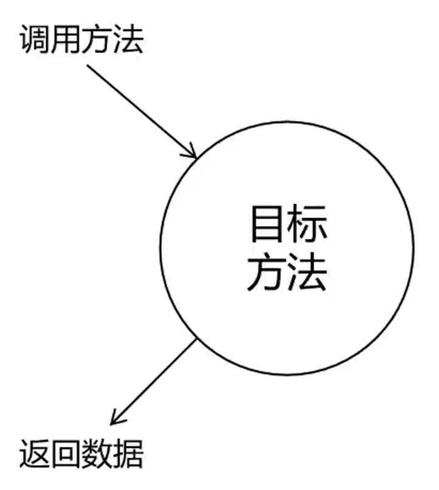

<!--  -->

使用代理后:
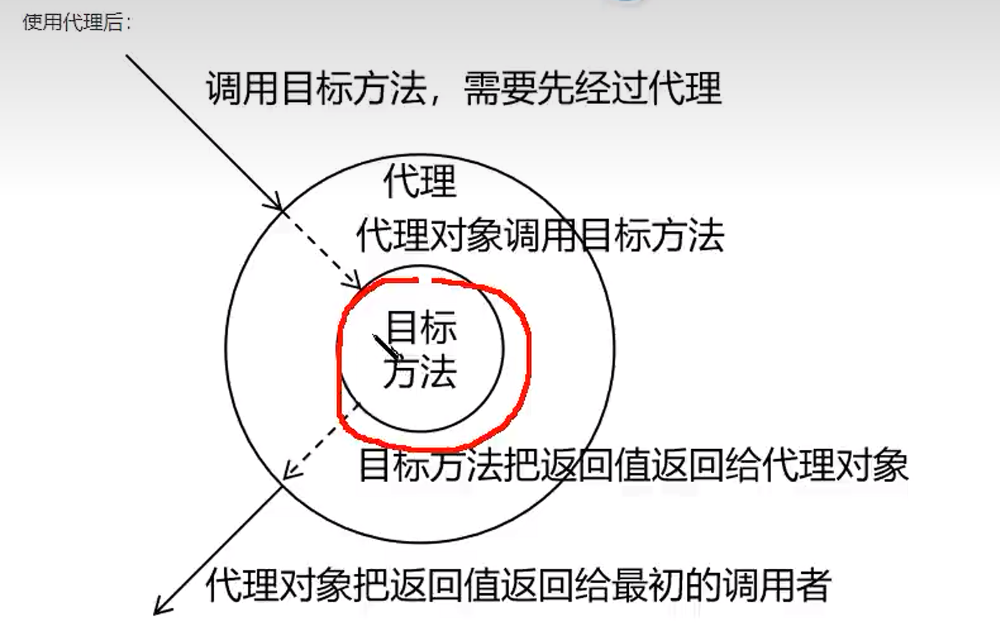

<!--  -->

> 这次算是明白了,相当于什么呢
> 当准备调用add方法时,会先调用代理的add方法,代理的add方法会记录下add的参数,以及方法名,然后调用目标的add方法,这时计算,将结果返回给代理方法,代理方法再整合一下,然后返回给调用者

##### 静态代理

*静态代理还是很简单的*
**这还是要注意一点,代理类要和目标类实现相同的接口**

此时的目标方法(被代理的)

```java
package com.zzmr.spring.proxy;

public class CalculatorByMeImpl implements CalculatorByMe {
    @Override
    public int add(int i, int j) {

        int result = i + j;
        System.out.println("方法内部, result:" + result);

        return result;
    }

    @Override
    public int sub(int i, int j) {

        int result = i - j;
        System.out.println("方法内部, result:" + result);

        return result;
    }

    @Override
    public int mul(int i, int j) {
        int result = i * j;
        System.out.println("方法内部, result:" + result);

        return result;
    }

    @Override
    public int div(int i, int j) {

        int result = i / j;
        System.out.println("方法内部, result:" + result);

        return result;
    }
}
```

代理类:

```java
package com.zzmr.spring.proxy;

public class CalculatorStaticProxyByMe implements CalculatorByMe {

    private CalculatorByMeImpl target;

    public CalculatorStaticProxyByMe(CalculatorByMeImpl target) {
        this.target = target;
    }

    @Override
    public int add(int i, int j) {
        System.out.println("日志，方法名：add, 参数：" + i + "," + j);
        int result = target.add(i, j);
        System.out.println("日志，结果：result,：" + result);
        return result;
    }

    @Override
    public int sub(int i, int j) {
        System.out.println("日志，方法名：sub, 参数：" + i + "," + j);
        int result = target.sub(i, j);
        System.out.println("日志，结果：result,：" + result);
        return result;
    }

    @Override
    public int mul(int i, int j) {
        System.out.println("日志，方法名：mul, 参数：" + i + "," + j);
        int result = target.mul(i, j);
        System.out.println("日志，结果：result,：" + result);
        return result;
    }

    @Override
    public int div(int i, int j) {
        System.out.println("日志，方法名：div, 参数：" + i + "," + j);
        int result = target.div(i, j);
        System.out.println("日志，结果：result,：" + result);
        return result;
    }
}
```

测试:

```java
    @Test
    public void testByProxy(){
        CalculatorStaticProxyByMe cal = new CalculatorStaticProxyByMe(new CalculatorByMeImpl());
        int result = cal.sub(1, 2);
        System.out.println(result);
    }
```

这里要创建的是代理对象,而不是目标对象

此时还可以增加代码

```java
    @Override
    public int add(int i, int j) {
        int result = 0;
        try {
            System.out.println("日志，方法名：add, 参数：" + i + "," + j);
            result = target.add(i, j);
            System.out.println("日志，结果：result,：" + result);
        } catch (Exception e) {
            e.printStackTrace();
            System.out.println("日志：出现异常");
        } finally {
        }
        return result;
    }
```

> 所以说静态代理确实实现了解耦,但是由于代码都是写死了,完全不具备任何的灵活性,就拿日志功能来说,将来其他地方也需要附加日志,那还得再声明更多个静态代理类,那就产生了大量重复的代码,日志功能还是分散的,没有统一管理
> 提出进一步的需求,将日志功能集中到一个代理类中,将来有任何日志需要,都通过这一个代理类来实现,这就需要使用动态代理技术

##### 动态代理

这里引入Proxy类,以及Proxy.newProxyInstance(),里面有三个参数,第一个ClassLoader类加载器,你还记得类加载器是什么吗

- ClassLoader loader    指定加载动态生成的代理类的类加载器          只需要获取某个类型的class对象,不需要获取对象的实现类对象,那如何获取类加载器?

```java
        ClassLoader classLoader = ProxyFactoryByMe.class.getClassLoader();
        //还可以这样
        ClassLoader classLoader = this.getClass().getClassLoader();
```

- Class[] interfaces    获取目标对象实现的所有接口的class对象的数组

```java
        Class<?>[] interfaces = target.getClass().getInterfaces();
```

- InvocatonHandler h    设置代理类中的抽象方法如何重写,这里使用了匿名内部类

```java
        InvocationHandler h = new InvocationHandler() {
            @Override
            public Object invoke(Object proxy, Method method, Object[] args) throws Throwable {
                /**
                 * proxy    表示代理对象
                 * method   表示要重写的抽象方法/要执行的方法
                 * args     表示要执行的方法的参数列表
                 */

                Object result = null;
                try {
                    System.out.println("日志 ， 方法："+method.getName()+","+"参数："+ Arrays.toString(args));

                    result = method.invoke(target, args);

                    System.out.println("日志 ， 方法："+method.getName()+","+"结果：："+ result);
                } catch (Exception e) {
                    e.printStackTrace();
                //    异常
                    System.out.println("日志 ， 方法："+method.getName()+","+"异常：："+ e);
                } finally {
                    System.out.println("结束");
                }

                return result;
            }
        };
```

上面的还是JDK动态代理
测试:

```java
    @Test
    public void testByProxyFactory() {
        ProxyFactoryByMe proxyFactoryByMe = new ProxyFactoryByMe(new CalculatorByMeImpl());
        CalculatorByMe proxy = (CalculatorByMe) proxyFactoryByMe.getProxy();
        int result = proxy.div(2, -1);
    }
```

> 动态代理的代码(工厂)

```java
package com.zzmr.spring.proxy;

import java.lang.reflect.InvocationHandler;
import java.lang.reflect.InvocationTargetException;
import java.lang.reflect.Method;
import java.lang.reflect.Proxy;
import java.util.Arrays;

public class ProxyFactoryByMe {
    private Object target;

    public ProxyFactoryByMe(Object target) {
        this.target = target;
    }

    public Object getProxy() {

        //ClassLoader classLoader = ProxyFactoryByMe.class.getClassLoader();
        //还可以这样
        ClassLoader classLoader = this.getClass().getClassLoader();
        Class<?>[] interfaces = target.getClass().getInterfaces();

        InvocationHandler h = new InvocationHandler() {
            @Override
            public Object invoke(Object proxy, Method method, Object[] args) throws Throwable {
                /**
                 * proxy    表示代理对象
                 * method   表示要重写的抽象方法/要执行的方法
                 * args     表示要执行的方法的参数列表
                 */

                Object result = null;
                try {
                    System.out.println("日志 ， 方法："+method.getName()+","+"参数："+ Arrays.toString(args));

                    result = method.invoke(target, args);

                    System.out.println("日志 ， 方法："+method.getName()+","+"结果：："+ result);
                } catch (Exception e) {
                    e.printStackTrace();
                //    异常
                    System.out.println("日志 ， 方法："+method.getName()+","+"异常：："+ e);
                } finally {
                    System.out.println("结束");
                }

                return result;
            }
        };

        return Proxy.newProxyInstance(classLoader, interfaces, h);
    }


}
```

还有一个cglib动态代理,最终生成的代理类,汇集成目标类,并且和目标类在相同的包下
但是这个不是很重要
所以就算了啊

> Java动态代理和cglib比较

1. 生成代理类技术不同
   - java动态代理：jdk自带类ProxyGenerator生成class字节码
   - cglib：通过ASM框架生成class字节码文件
2. 生成代理类的方式不同
   - java动态代理：代理类继承java.lang.reflect.Proxy，实现被代理类的接口
   - cglib：代理类继承被代理类，实现net.sf.cglib.proxy.Factory
3. 生成类数量不同
   - java动态代理：生成一个proxy类
   - cglib：生成一个proxy，两个fastclass类
4. 调用方式不同
   - java动态代理：代理类->InvocationHandler->反射调用被代理类方法
   - cglib：代理类->MethodInterceptor->调用索引类invoke->直接调用被代理类方法
5. 性能比较
   网上找到比较多的说明如下：

> 在 jdk6之前比使用 Java反射效率要高，在 jdk6、jdk7、jdk8 逐步对 JDK 动态代理优化之后，在调用次数较少的情况下，JDK 代理效率 高于 CGLIB 代理效率。只有当进行大量调用的时候，jdk6 和 jdk7 比 CGLIB 代理效率低一点，但是到 jdk8 的时候，jdk 代理效率高于 CGLIB 代理，总之，每一次 jdk 版本升级，JDK 代理效率 都得到提升，而 CGLIB 代理效率 确有点跟不上步伐。

*手写动态代理以后是用的不多的,那为什么要写?因为AOP的实现原理就是这么来的,所以以后要使用动态代理,就直接使用AOP了,并不需要手写,手写只是为了更好得学习AOP*

好了,马上进入正式的AOP

#### AOP概念

AOP是一种设计思想,也就是所谓的**面向切面编程**,它是面向对象编程的一种补充和完善,它以通过预编译方式和运行期动态代理方式实现在不修改源代码的情况下给程序动态统一添加额外功能的一种技术

##### 相关术语

又是一堆枯燥无味的概念,这些东西不实现,是很难记住的,我发现我现在是惊醒越来越差了

害

> **横切关注点**

什么是横切关注点?简单理解就是那些和核心业务无关的代码,比如前面的日志代码,那两行日志代码就是横切关注点

> **通知**

每个横切关注点上要做的事情都需要写一个方法来实现,这样的方法就叫通知方法,**也就是之前写的日志的代码,就相当于通知,只是分类有很多,比如之前写在核心代码前的,就是前置通知,这通知又分为好几种**

1. 前置通知:在被代理的目标方法**前**执行
2. 返回通知:在被代理的目标方法**成功结束**后执行(寿终正寝)
3. 异常通知:在被代理的目标方法**异常结束**后执行(死于非命)
4. 后置通知:在被代理的目标方法**最终结束**后执行(盖棺定论)
5. 环绕通知:使用try.catch/finally结构围绕整个被代理的目标方法,包括上面的四种通知对应的所有位置

> **切面**

封装通知方法的类,这个之前好像没有

> **目标**

被代理的目标对象

> **代理**

向目标对象应用通知之后创建的代理对象

> **连接点**

把方法排成一排，每个横切位置看成为x轴方向，把方法从上到下执行的顺序看成y轴,x轴和y轴的交叉点就是连接点

> **切入点**

定位连接点的方式
*把连接点看作数据库中的记录,那么切入点就是查询记录的SQL语句,Spring的AOP技术可以通过切入点定位到特定的连接点*

所以AOP的一个非常重要的操作就是**抽,和套**

##### 作用

- 简化代码:把方法中固定位置的重复的代码抽取出来,让被抽取的方法更专注于自己的核心功能,提高内聚性
- 代码增强,把特定的功能封装到切面类中,看哪里有需要,就往上套,被套用了切面逻辑的方法就被切面给增强了

#### 基于注解的AOP

三种实现方式

1. 动态代理
2. cglib
3. Aspectj(本质上是静态代理)

> 注意事项:
> 切面类和目标类都需要交给IOC容器管理
> 切面类必须通过@Aspect注解标识为一个切面
> 在Spring配置文件中设置\<aop:aspect-autoproxy/\>开启基于注解的AOP

交给IOC容器管理,这里是使用注解,所以只需要在普通类上面加上@Component注释

代理类的代码:
这个只是前置的,先看个样子

```java
package com.zzmr.spring.aop.annotation;

import org.aspectj.lang.annotation.Aspect;
import org.aspectj.lang.annotation.Before;
import org.springframework.stereotype.Component;

@Component
@Aspect
public class LoggerAspectByMe {

    @Before("execution(public int com.zzmr.spring.aop.annotation.CalculatorImpl.add(int,int))")
    public void beforeAdviceMethod(){
        System.out.println("LoggerAspect,Before");
    }

}
```

这里如果直接使用IOC获取目标对象,是获取不到的

```java
    @Test
    public void testBefore(){
        ApplicationContext ioc = new ClassPathXmlApplicationContext("aop-annotation.xml");
        CalculatorImpl calculator = ioc.getBean(CalculatorImpl.class);
        int result = calculator.add(1, 1);
    }
```

这个时候会直接报错-NoSuchBeanDefinitionException
说明只要添加了代理对象,那就不能直接获取目标对象了,而要使用目标对象的接口(代理对象)来获取

```java
    @Test
    public void testBefore(){
        ApplicationContext ioc = new ClassPathXmlApplicationContext("aop-annotation.xml");
        Calculator calculator = ioc.getBean(Calculator.class);
        calculator.add(1,1);
    }
```

这个时候就不会报错了

问题也出现了,看上面的切入点表达式:

```java
    @Before("execution(public int com.zzmr.spring.aop.annotation.CalculatorImpl.add(int,int))")
```

这就相当于方法写死了,只能定位到add方法里面了

> 改进
> 现在要把前置通知加入到Calculator的每一个方法中,该怎么做?
> **对切入点表达式进行改进**
> 第一个星号，表示任何访问修饰符，任意返回类型
> 第二个星号，表示类中所有的方法
> 括号里面表示方法参数类型列表,就是上面的int int，这里写上两个点，就是不管参数类型

```java
    @Before("execution(* com.zzmr.spring.aop.annotation.CalculatorImpl.*(..))")
```

这样就能给指定类中的所有方法加上通知了

以此类推,在类的位置上写上星号,就代表当前包下所有的类

```java
    @Before("execution(* com.zzmr.spring.aop.annotation.*.*(..))")
```

此时还有问题,怎么在通知方法中获取连接点信息?就是获取被代理的目标方法的信息,这里需要在通知方法中添加JoinPoint参数

- JoinPoint.getSignature()可以获取连接点对应方法的签名信息(内含方法名)
- JoinPoint.getArgs()可以获取对应方法的参数列表
- *那如何获取方法的返回类型?有一个MethodSignature,可以通过signature获取*

```java
        MethodSignature methodSignature = (MethodSignature) signature;
        System.out.println("方法的返回类型：" + methodSignature.getReturnType());
```

下面是代码:

```java
    @Before("execution(* com.zzmr.spring.aop.annotation.CalculatorImpl.*(..))")
    public void beforeAdviceMethod(JoinPoint joinPoint) {
        Signature signature = joinPoint.getSignature();
        Object[] args = joinPoint.getArgs();
        System.out.println("LoggerAspect,Before");
        System.out.println("LoggerAspect,方法名："+signature.getName()+","+"参数列表"+ Arrays.toString(args));
    }
```

测试:

```java
    @Test
    public void testBefore(){

        ApplicationContext ioc = new ClassPathXmlApplicationContext("aop-annotation.xml");
        Calculator calculator = ioc.getBean(Calculator.class);
        calculator.add(1,2);
        System.out.println("============");
        calculator.sub(1,1);
        System.out.println("============");
        calculator.mul(1,1);
        System.out.println("============");
        calculator.div(1,1);
    }
```

结果:
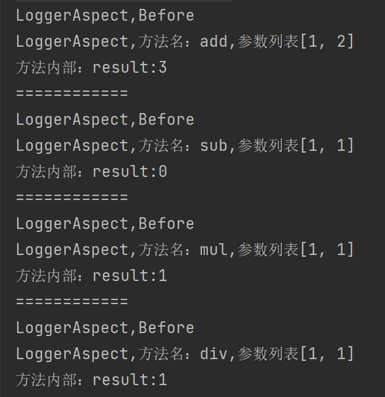

<!--  -->

> **切入点表达式重用**

很简单,只需要写一个方法,在方法的上面写上@Pointcut注解,里面写上要重用的切入点表达式即可

```java
    @Pointcut("execution(* com.zzmr.spring.aop.annotation.CalculatorImpl.*(..))")
    public void pointCut(){}
```

使用时:
使用时也很简单,只需要在原来写切入点表达式的地方换成方法名即可,这个方法名就是加了Pointcut注解的方法

```java
    @After("pointCut()")
    public void afterAdviceMethod(){
        System.out.println("后置通知");
    }
```

1. 前置通知:@Before()
2. 后置通知:@After()
   后置通知是在哪里的通知?是在方法执行之后就执行,还是finally里执行?
   这个时候调用div方法,执行1/0,此时若后置通知能输出,则代表是在finally中,反之是在方法执行之后
   验证结果是可以输出,代表是在finally中
3. 返回通知:@AfterReturning()
   返回通知是在方法返回后执行的,此时再测试div(1,0),就会发现此时的返回通知是不会执行,所以返回通知是方法返回之后执行的
   既然是返回通知,那就应该可以获取方法的返回值,此时要在注解中写上 returning = "result" , 然后在方法参数中加上Object result ,这个名字随便取，但是要保证上下一致

```java
    @AfterReturning(value = "pointCut()", returning = "result")
    public void afterReturningAdviceMethod(JoinPoint joinPoint, Object result) {
        Signature signature = joinPoint.getSignature();
        System.out.println("返回通知,方法：" + signature.getName() + "," + "结果：" + result);
    }
```

4. 异常通知:@AfterThrowing()
   若要获取目标对象方法的异常,只需要通过throwing属性,上下一致,即可(Throwable和Exception都行),直接输出ex,就可以获取异常信息

```java
    @AfterThrowing(value = "pointCut()",throwing = "ex")
    public void afterThrowingAdviceMethod(JoinPoint joinPoint,Throwable ex){
        Signature signature = joinPoint.getSignature();
        System.out.println("异常通知，方法名："+signature.getName()+"， 异常："+ex);
    }
```

此时比如还是1/0,看结果:
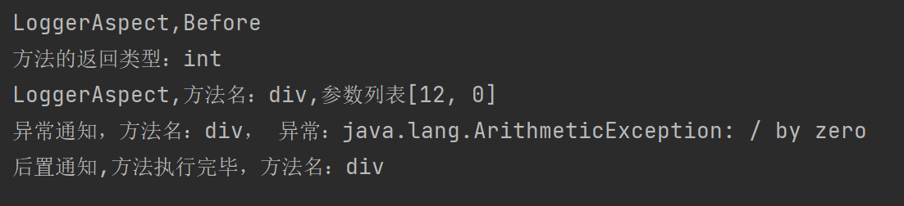

<!--  -->

这里还要注意:
Spring的通知顺序和版本有关:

- Spring版本5.3.x以前
  - 前置通知
  - 目标操作
  - 后置通知
  - 返回通知或异常通知
- Spring版本5.3.x以后
  - 前置通知
  - 目标操作
  - 返回通知或异常通知
  - 后置通知

> **环绕通知**
> 相当于之前几种通知的整合
> 但又很像之前的动态代理,看看代码就知道哪里像了
> @Around()
> 要在通知方法中写上ProceedingJoinPoint参数,然后在try中写上joinPoint.proceed()就是目标方法执行了,还有重点就是该通知方法的类型要和目标方法的返回类型一致

```java
    @Around("pointCut()")
    public Object aroundAdviceMethod(ProceedingJoinPoint joinPoint) {
        Object result = null;
        try {
            System.out.println("环绕通知：前置通知");
            //表示目标对象方法的执行
            result = joinPoint.proceed();
            System.out.println("环绕通知：返回通知");
        } catch (Throwable e) {
            e.printStackTrace();
            System.out.println("环绕通知：异常通知");
        } finally {
            System.out.println("环绕通知：后置通知");
        }
        return result;
    }
```

**但是以后用的话要么是四个普通的,要么就是一个环绕,不可能同时用两种**

##### 切面的优先级

上面写的是日志功能的切面,而以后还有事务功能的切面,验证功能的切面

每个切面都有一个优先级:@Order()
括号里面的数值越小,优先级越高,默认的数值是int的最大值,所以,如果想写一个切面,这个切面比之前的切面先执行的话,只需要在该切面上的Order()里面写上比上一个切面的优先级数值小的即可

```java
package com.zzmr.spring.aop.annotation;

import org.aspectj.lang.annotation.Aspect;
import org.aspectj.lang.annotation.Before;
import org.springframework.core.annotation.Order;
import org.springframework.stereotype.Component;

@Component
@Aspect
@Order
public class ValidateAspectByMe {

    @Before("execution(* com.zzmr.spring.aop.annotation.CalculatorImpl.*(..))")
    public void beforeMethod(){
        System.out.println("ValidateAspect--->前置通知");
    }

}
```

此时,ValidateAspectByMe就要比之前的切面优先级高了,可以先执行

#### 基于XML的AOP

这个只是了解,以后用大部分时候使用基于注解的AOP
笑死,我才发现,之前看的时候,甚至没有创建这个的包(com.zzmr.spring.aop.xml),代码都没敲,笔记也没写
看图吧,里面都有哈哈哈

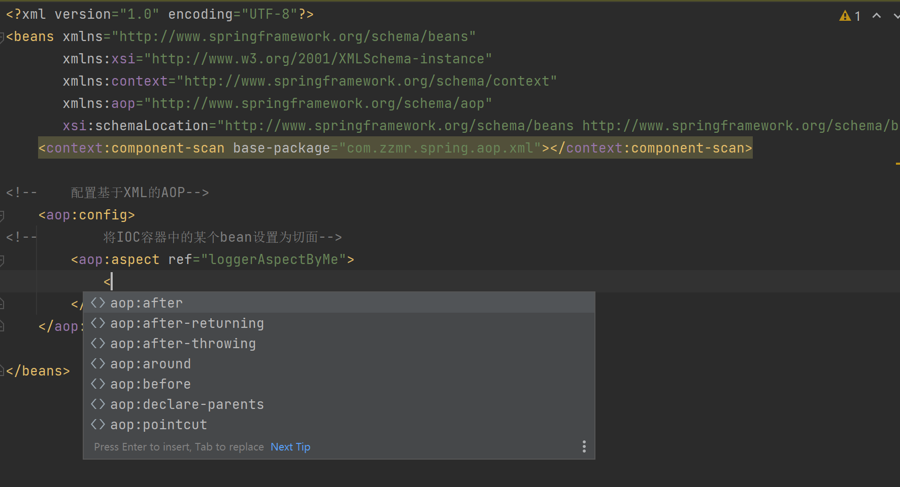

<!--  -->

```xml
<?xml version="1.0" encoding="UTF-8"?>
<beans xmlns="http://www.springframework.org/schema/beans"
       xmlns:xsi="http://www.w3.org/2001/XMLSchema-instance"
       xmlns:context="http://www.springframework.org/schema/context"
       xmlns:aop="http://www.springframework.org/schema/aop"
       xsi:schemaLocation="http://www.springframework.org/schema/beans http://www.springframework.org/schema/beans/spring-beans.xsd http://www.springframework.org/schema/context https://www.springframework.org/schema/context/spring-context.xsd http://www.springframework.org/schema/aop https://www.springframework.org/schema/aop/spring-aop.xsd">
    <context:component-scan base-package="com.zzmr.spring.aop.xml"></context:component-scan>

<!--    配置基于XML的AOP-->
    <aop:config>
        <aop:pointcut id="pointCut" expression="execution(* com.zzmr.spring.aop.xml.CalculatorImpl.*(..))"/>
<!--        将IOC容器中的某个bean设置为切面-->
        <aop:aspect ref="loggerAspectByMe">
            <aop:before method="beforeAdviceMethod" pointcut-ref="pointCut"></aop:before>
            <aop:after method="afterAdviceMethod" pointcut-ref="pointCut"></aop:after>
            <aop:after-returning method="afterReturningAdviceMethod" returning="result" pointcut-ref="pointCut"></aop:after-returning>
            <aop:after-throwing method="afterThrowingAdviceMethod"  pointcut-ref="pointCut" throwing="ex"></aop:after-throwing>
            <aop:around method="aroundAdviceMethod" pointcut-ref="pointCut"></aop:around>
        </aop:aspect>
    </aop:config>

</beans>
```

没啥难的,也没啥需要注意的哈哈哈哈

测试:

```java
package com.zzmr.spring.test;

import com.zzmr.spring.aop.xml.Calculator;
import org.junit.Test;
import org.springframework.context.ApplicationContext;
import org.springframework.context.support.ClassPathXmlApplicationContext;

public class AopXMLTest {
    @Test
    public void testXML(){
        ApplicationContext ioc = new ClassPathXmlApplicationContext("aop-xml.xml");
        Calculator bean = ioc.getBean(Calculator.class);
        bean.add(1,1);

    }
}
```

马上就是AOP的应用了
嗯
加油
2022年11月1日 18点13分

### 声明式事务

下面就到了给事务代码实现AOP了

但是在那之前,要先学习一下JdbcTemplate,这个是Spring封装的JDBC,但是这个只是了解一下,以后还是用MyBatis用的多

创建一个spring-jdbc.xml配置文件
里面要添加这个bean,因为JdbcTemplate是第三方jar包,不能使用注解的方式让IOC管理,所以只能是使用xml的方式实现.还有连接数据库的一些bean,数据源,同时也要引入jdbc.properties

```xml
<!--    引入jdbc.properties-->
    <context:property-placeholder location="classpath:jdbc.properties"/>

    <bean id="dataSource" class="com.alibaba.druid.pool.DruidDataSource">
        <property name="driverClassName" value="${jdbc.driver}"></property>
        <property name="url" value="${jdbc.url}"></property>
        <property name="username" value="${jdbc.username}"></property>
        <property name="password" value="${jdbc.password}"></property>
    </bean>

    <bean class="org.springframework.jdbc.core.JdbcTemplate">
        <property name="dataSource" ref="dataSource"></property>
    </bean>
```

这里有一个小的注意点,就是Spring有一个整合的junit,要引入依赖:
**但是之前的Junit的依赖还是不能丢掉的,还是要保留**

```xml
        <!-- Spring 测试相关 -->
        <dependency>
            <groupId>org.springframework</groupId>
            <artifactId>spring-test</artifactId>
            <version>5.3.1</version>
        </dependency>
```

然后给测试类上添加上两个注解

1. //指定当前测试类在spring的测试环境中执行，此时就可以通过注入的方式直接获取IOC容器中的bean
   @RunWith(SpringJUnit4ClassRunner.class)
2. //设置Spring测试环境的配置文件
   @ContextConfiguration("classpath:spring-jdbc.xml")

大白话说着不清楚,还是直接看代码吧

```java
package com.zzmr.spring.test;

import org.junit.Test;
import org.junit.runner.RunWith;
import org.springframework.beans.factory.annotation.Autowired;
import org.springframework.jdbc.core.JdbcTemplate;
import org.springframework.test.context.ContextConfiguration;
import org.springframework.test.context.junit4.SpringJUnit4ClassRunner;

//指定当前测试类在spring的测试环境中执行，此时就可以通过注入的方式直接获取IOC容器中的bean
@RunWith(SpringJUnit4ClassRunner.class)
//设置Spring测试环境的配置文件
@ContextConfiguration("classpath:spring-jdbc.xml")
public class JdbcTemplateTestTwo {
    @Autowired
    private JdbcTemplate jdbcTemplate;

    @Test
    public void testInsert(){
        String sql = "insert into t_user values(null,?,?,?,?,?)";
        jdbcTemplate.update(sql,"jimmy","010203",23,"男","123456@163.com");
    }

}
```

这里重点就是Spring的测试方法,可以直接使用两个注解来实现自动装配某个组件,比如这个JdbcTemplate,像之前的那个什么IOC容器也一样,就不用写一个测试方法就写一个ApplicationContext了

下面看查询的方法:

```java
    /**
     * 查询，老师说要另一个视频讲，那就先听吧
     */
    @Test
    public void testGetUserById(){
        String sql = "select * from t_user where id = ?";
        User user = jdbcTemplate.queryForObject(sql, new BeanPropertyRowMapper<>(User.class), 1);
        System.out.println(user);
    }

    /**
     * 查询所有数据
     */
    @Test
    public void testGetAllUser(){
        String sql = "select * from t_user";

        List<User> userList = jdbcTemplate.query(sql, new BeanPropertyRowMapper<>(User.class));
        userList.forEach(System.out::println);
    }

    @Test
    public void testGetCount(){
        String sql = "select count(*) from t_user";
        Integer count = jdbcTemplate.queryForObject(sql, Integer.class);
        System.out.println(count);
    }
```

也非常简单
前面铺垫了这么多,现在终于到声明式事务了
先看编程式事务的缺点,编程式事务,顾名思义,事务的实现是靠自己编程来实现的,比较繁琐,而且代码复用性不高

而声明式事务正是解决这一痛点而出现的
声明式事务的优点:

1. 提高开发效率
2. 消除了冗余代码
3. 框架会综合考虑相关领域中在实际开发环境下有可能遇到的各种问题.进行了健壮性,性能等各个方面的优化

而且,重要的是声明式事务的代码都已经写好了,都是直接拿来用的,连通知都不用写

#### 基于注解的声明式事务

一个配置,一个注解,即完成了声明式事务

在配置之前,首先看一下什么时候需要事务,或者说什么时候需要回滚?这里假设一个条件,比如当用户购买书时,如果书的库存不足,那就会出问题,这里可以使用**无符号的数据类型来限定库存余额**,当然也可以在java代码中实现,比如,如果余额不足,那就抛出异常即可,没有异常就造异常

> tx-annotation.xml
> Spring的配置文件

```xml
<?xml version="1.0" encoding="UTF-8"?>
<beans xmlns="http://www.springframework.org/schema/beans"
       xmlns:xsi="http://www.w3.org/2001/XMLSchema-instance"
       xmlns:context="http://www.springframework.org/schema/context" xmlns:tx="http://www.springframework.org/schema/tx"
       xsi:schemaLocation="http://www.springframework.org/schema/beans http://www.springframework.org/schema/beans/spring-beans.xsd http://www.springframework.org/schema/context https://www.springframework.org/schema/context/spring-context.xsd http://www.springframework.org/schema/tx http://www.springframework.org/schema/tx/spring-tx.xsd">

<!--    扫描组件-->
    <context:component-scan base-package="com.zzmr.spring"></context:component-scan>

<!--    引入jdbc.properties-->
    <context:property-placeholder location="classpath:jdbc.properties"/>

    <bean id="dataSource" class="com.alibaba.druid.pool.DruidDataSource">
        <property name="driverClassName" value="${jdbc.driver}"></property>
        <property name="url" value="${jdbc.url}"></property>
        <property name="username" value="${jdbc.username}"></property>
        <property name="password" value="${jdbc.password}"></property>
    </bean>

    <bean class="org.springframework.jdbc.core.JdbcTemplate">
        <property name="dataSource" ref="dataSource"></property>
    </bean>

<!--    配置事务管理器-->
    <bean id="transactionManager" class="org.springframework.jdbc.datasource.DataSourceTransactionManager">
        <property name="dataSource" ref="dataSource"></property>
    </bean>


<!--    开启事务的注解驱动
        将使用@Transactional注解所表示的方法或类中所有的方法使用事务进行管理
        transaction-manager 设置事务管理器的id
        若事务管理器的bean的id为默认的transactionManager。就可以不用写
-->
    <tx:annotation-driven transaction-manager="transactionManager"/>

</beans>
```

这里写上我自己写的代码吧
首先说明,事务管理的代码是在service中的
先看Controller代码

> BookControllerByMe.java

```java
package com.zzmr.spring.controller;

import com.zzmr.spring.service.BookServiceByMe;
import org.springframework.beans.factory.annotation.Autowired;
import org.springframework.stereotype.Controller;

@Controller
public class BookControllerByMe {

    @Autowired
    private BookServiceByMe bookServiceByMe;

    public void buyBookByMe(int userId,int bookId){
        bookServiceByMe.buyBookByMe(userId,bookId);
    }

}
```

> BookServiceByMe.java

```java
package com.zzmr.spring.service;

public interface BookServiceByMe {
    void buyBookByMe(int userId, int bookId);
}
```

> BookServiceImplByMe.java
> 没有事务管理,**但是由于在建表时指定了stock和balance是无符号的,所以当余额不足买书时数据库就会报错**

```java
package com.zzmr.spring.service.impl;

import com.zzmr.spring.dao.BookDaoByMe;
import com.zzmr.spring.service.BookServiceByMe;
import org.springframework.beans.factory.annotation.Autowired;
import org.springframework.stereotype.Service;

@Service
public class BookServiceImplByMe implements BookServiceByMe {

    @Autowired
    private BookDaoByMe bookDaoByMe;


    @Override
    public void buyBookByMe(int userId, int bookId) {
        //    就不能直接买了，要进行判断用户的余额够不够，以及书的库存足不足

    //   获取图书价格
        Integer bookPrice = bookDaoByMe.getPriceByIdByMe(bookId);

        bookDaoByMe.updateStock(bookId);

        bookDaoByMe.updateBalance(userId,bookPrice);


    }
}
```

> BookDaoByMe.java
> DAO层要负责的就多了,首先是获取图书价格,然后更新库存,更新余额

```java
package com.zzmr.spring.dao;

public interface BookDaoByMe {

    /**
     * 根据图书id获取图书价格
     *
     * @param bookId
     * @return
     */
    Integer getPriceByIdByMe(Integer bookId);

    void updateStock(Integer bookId);

    void updateBalance(Integer userId,Integer price);

}
```

> BookDaoImplByMe.java

```java
package com.zzmr.spring.dao.impl;

import com.zzmr.spring.dao.BookDaoByMe;
import org.springframework.beans.factory.annotation.Autowired;
import org.springframework.jdbc.core.JdbcTemplate;
import org.springframework.stereotype.Repository;

/**
 * Dao层
 */
@Repository
public class BookDaoImplByMe implements BookDaoByMe {


    @Autowired
    private JdbcTemplate jdbcTemplate;


    //根据图书id获取价格
    //以便于判断余额是否大于图书价格
    @Override
    public Integer getPriceByIdByMe(Integer bookId) {
        String sql = "select price from t_book where book_id = ?";
        Integer price = jdbcTemplate.queryForObject(sql, Integer.class, bookId);
        return price;
    }

    @Override
    public void updateStock(Integer bookId) {
        String sql = "update t_book set stock = stock - 1 where book_id = ?";
        jdbcTemplate.update(sql,bookId);
    }

    @Override
    public void updateBalance(Integer userId,Integer price) {
        String sql = "update t_user1 set balance = balance - ? where user_id = ?";
        jdbcTemplate.update(sql,price,userId);
    }


}
```

> 此时没有事务管理,用户余额为50,如果买第一本书,价格80,此时就会报错,但是由于MySql默认是一条Sql就会自动提交一次事务,所以就导致了库存是减少了,但是用户的余额并没有变

下面就是重头戏了,给service层添加上事务管理

> **出现异常就回滚**

先看需要的配置

```xml
<!--    配置事务管理器-->
    <bean id="transactionManager" class="org.springframework.jdbc.datasource.DataSourceTransactionManager">
        <property name="dataSource" ref="dataSource"></property>
    </bean>


<!--
        开启事务的注解驱动
        将使用@Transactional注解所表示的方法或类中所有的方法使用事务进行管理
        transaction-manager 设置事务管理器的id
        若事务管理器的bean的id为默认的transactionManager。就可以不用写
-->
    <tx:annotation-driven transaction-manager="transactionManager"/>
```

配置"开启事务的注解驱动"后,就会发现左边出现了环绕通知的图标


<!--  -->

> 给方法添加上事务管理
> 不需要写任何的代码,只需要一个注释,那么这个类/方法就被事务管理了--@Transactional
> 此时,buyBookByMe这个方法就被事务管理了,如果出现异常,就会回滚

声明式事务的步骤:

1. 在Spring的配置文件中配置事务管理器
2. 开启事务的注解驱动
3. 在需要被事务管理的方法上添加上@Transactional注解,该方法就会被事务管理

@Transactional注解标识的位置

1. 标识在方法上
2. 标识在类上,则类中所有的方法都会被事务管理

```java
    @Override
    @Transactional
    public void buyBookByMe(int userId, int bookId) {
        //    就不能直接买了，要进行判断用户的余额够不够，以及书的库存足不足

    //   获取图书价格
        Integer bookPrice = bookDaoByMe.getPriceByIdByMe(bookId);

        bookDaoByMe.updateStock(bookId);

        bookDaoByMe.updateBalance(userId,bookPrice);

    }
```

**@Transactional的属性**

> 只读
> 对一个查询操作来说,如果我们把它设置成只读,就能够明确的告诉数据库,这个操作不涉及写操作,这样数据库就能针对查询操作来进行优化
> 默认为false

```java
    @Transactional(
            readOnly = true
    )
```

**注意,如果设置了只读,这时如果进行修改,就会报SQLException:Connection is read-only. Queries leading to data modification are not allowed**

> 超时
> 事务在执行过程中,有可能遇到某些问题,导致程序卡住,从而长时间占用数据库资源,而长时间占用资源,大概率是因为程序运行出现了问题(可能是Java程序或者MySql数据库或网络连接等等)
> 这个时候出现问题的程序应该被回滚,撤销它已做的操作,事务结束,把资源让出来,让其他正常程序可以执行
> 概括来说就是一句话,超时回滚,释放资源

默认值是-1,意为一直等

```java
    @Transactional(
                    timeout = 3
    )
```

此时在service中,给这个程序休眠5s(*在调用核心代码之前添加以下代码*)

```java
        try {
            TimeUnit.SECONDS.sleep(5);
        } catch (InterruptedException e) {
            e.printStackTrace();
        }
```

如果超时,则会报:TransactionTimedOutException: Transaction timed out: deadline was...

> 回滚策略
> 声明式事务默认只针对运行时异常回滚,编译时异常不回滚

- rollbackFor属性:需要设置一个Class类型的对象
- rollbackForClassName属性:需要设置一个字符串类型的全类名
- noRollbackFor属性:需要设置一个Class类型的对象
- rollbackFor属性:需要设置一个字符串类型的全类名

**不过一般情况下不需要设置回滚策略**

看一种情况,比如在所有的更新库存更新余额执行完之后,执行一个sout(1/0),此时会抛出数学运算异常,但上面的更新是没问题的,由于还是抛出了异常,所以造成回滚

此时设置:

```java
    @Transactional(
            {noRollbackFor = ArithmeticException.class}
                        // noRollbackForClassName = "java.lang.ArithmeticException"

    )
```

noRollbackFor是一个数组,但是如果只有一个数据的话,是不用写大括号的

就可以实现

> 事务的隔离级别
> 数据库系统必须具有隔离并发运行各个事物的能力,使它们不会相互影响,避免各种并发问题,一个事务与其他事务隔离的程度称为隔离级别,SQL标准中规定了多种事务隔离级别,不同隔离级别对应不同的干扰程度,隔离级别越高,数据一致性就越好,但并发行越弱

就那几个隔离级别,一般来说不需要设置,默认为"可重复读"-REPEATABLE READ-确保Transaction01可以多次从一个字段中读取到相同的值,即Transaction01执行期间禁止其他事务对这个字段进行更新
而还有一个**串行化**,确保Transaction01可以多次从一个表中读取到相同的行,在Transaction01执行期间,进制其他事务对这个表进行添加,更新,删除操作,可以避免任何并发问题,但性能十分低下
**只有特殊情况下才使用串行化,一般都是用默认的可重复读**

> 各个隔离级别解决并发问题的能力:
> 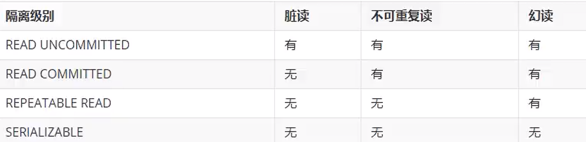

<!--  -->

```java
    @Transactional(
            //readOnly = true,
            //timeout = 3,
            //noRollbackFor = {ArithmeticException.class}
            //noRollbackForClassName = "java.lang.ArithmeticException",
            isolation = Isolation.DEFAULT
    )
```

> 事务的传播行为
> 这个是什么意思呢,举个例子,我现在有100块,要去买两本书,买完第一本,就没钱买第二本了

来看代码:

```java
package com.zzmr.spring.service;

import org.springframework.stereotype.Service;

public interface CheckoutService {

    /**
     * 结账方法
     * @param userId
     * @param bookIds
     */
    void checkout(Integer userId, Integer[] bookIds);
}

```

serviceImpl

```java
package com.zzmr.spring.service.impl;

import com.zzmr.spring.service.BookServiceByMe;
import com.zzmr.spring.service.CheckoutService;
import org.springframework.beans.factory.annotation.Autowired;
import org.springframework.stereotype.Service;
import org.springframework.transaction.annotation.Transactional;

@Service
public class CheckoutServiceImpl implements CheckoutService {

    @Autowired
    private BookServiceByMe bookServiceByMe;

    @Override
    @Transactional
    public void checkout(Integer userId, Integer[] bookIds) {
        for (Integer bookId : bookIds) {
            bookServiceByMe.buyBookByMe(userId,bookId);
        }
    }
}
```

测试类:

```java
    @Test
    public void testTwo(){
        bookControllerByMe.checkout(1,new Integer[]{1,2});
    }
```

此时,就会发现,虽然钱能够买第一本书,但是由于买不起第二本书,所以事务回滚
一本书也没买到

此时在BookServiceImpl中
设置:

```java
    @Transactional(
            propagation = Propagation.REQUIRES_NEW
    )
```

此时就会发现,第一本能买成功,第二本不行

#### 基于XML的声明式事务

此时先把BookServiceImpl和CheckoutServiceImpl中的@Transactional给注释掉,然后使用xml来实现以下,才发现之前甚至没有听这两节

```xml
<!--    下面就是基于xml的声明式事务的配置信息-->

<!--    配置事务通知-->
    <tx:advice id="tx" transaction-manager="transactionManager"></tx:advice>

    <aop:config>
        <aop:advisor advice-ref="tx" pointcut="execution(* com.zzmr.spring.service.impl.*.*(..))"></aop:advisor>
    </aop:config>
```

这个就是基于xml的声明式事务的配置信息

还有jar包,不然运行不了

```xml
        <dependency>
            <groupId>org.springframework</groupId>
            <artifactId>spring-aspects</artifactId>
            <version>5.3.1</version>
        </dependency>
```

SpringMVC开始
嗯

## SpringMVC

2022年11月6日 20点25分
*快要开始做项目了,有点慌,跟他们学的东西不太一样,咱又没人家学的精,只能用人家的方法来写了*

在这里再说一下,MyBatis是持久层框架,而Spring可以利用IOC和AOP来整合框架

三个概念:
M: Model,模型层,指工程中的JavaBean
    - 实体类Bean:专门存储业务数据
    - 业务处理Bean:指Service或Dao对象,专门用于处理业务逻辑和数据访问
V: View,视图层,指工程中的html或jsp等页面,作用是与用户进行交互,展示数据
C: Controller,控制层,指工程中的Servlet,作用是接收请求和响应浏览器

你还记得吗,之前有一个什么请求,都要写一个对应的Servlet,而现在不需要了,现在DispatcherServlet就是一个整体的Servlet,不需要自己创建Servlet了

*好久没写了,这段时间都在做项目/打游戏哈哈哈*
*2022年11月25日 15点13分*

### 基本配置

#### 配置web.xml

之前的web.xml要配置好多好多Servlet,而现在只需要配置一个-**DispatcherServelt**

> url-pattern中 /表示匹配浏览器向服务器发送的所有请求(不包括jsp) /*表示匹配浏览器向服务器发送的所有请求(包括jsp)
> 为什么不用/* ? 因为DispatcherServlet处理不了jsp的请求,jsp会被tomcat默认的配置-JspServlet来处理

```xml
<?xml version="1.0" encoding="UTF-8"?>
<web-app xmlns="http://xmlns.jcp.org/xml/ns/javaee"
         xmlns:xsi="http://www.w3.org/2001/XMLSchema-instance"
         xsi:schemaLocation="http://xmlns.jcp.org/xml/ns/javaee http://xmlns.jcp.org/xml/ns/javaee/web-app_4_0.xsd"
         version="4.0">

    <!--    配置SpringMVC的前端控制器 DispatcherServlet
            SpringMVC的配置文件默认的位置和名称：
            位置：WEB-INF下(但是以后绝对不会把这个配置文件放到web-inf下的,都是放在resources中)
            名称：<servlet-name>-servlet.xml  当前配置文件下的配置文件名 SpringMVC-servlet.xml

            url-pattern中 /和/*的区别
            /：匹配浏览器向服务器发送的所有请求（不包括.jsp）
            /* ：匹配浏览器向服务器发送的所有请求（包括.jsp）
    -->
    <servlet>
        <servlet-name>SpringMVC</servlet-name>
        <servlet-class>org.springframework.web.servlet.DispatcherServlet</servlet-class>
    </servlet>
    <servlet-mapping>
        <servlet-name>SpringMVC</servlet-name>
        <url-pattern>/</url-pattern>
    </servlet-mapping>


</web-app>

```

#### 创建请求控制器

前端控制器处理了所有浏览器发送的请求,但是具体的请求有不同的处理过程,就需要创建处理具体请求的类-请求控制器,这个类不需要继承什么,只需要加上@Controller注解,那这个普通的类就变成了请求控制器,不过要想实现这个操作,**需要在SpringMVC的配置文件中扫描对应的包才行**

请求控制器中每一个处理请求的方法称为控制器方法

```java
@Controller
public class HelloController {

}
```

#### 创建SpringMVC的配置文件

SpringMVC的配置文件是在SpringMVC初始化时完成加载的
默认是要放在web-inf下,名字是servlet-name+ -servlet.xml,**实际上配置文件还是要放在resources下,然后在web.xml中引入即可**

```xml
<?xml version="1.0" encoding="UTF-8"?>
<beans xmlns="http://www.springframework.org/schema/beans"
       xmlns:xsi="http://www.w3.org/2001/XMLSchema-instance"
       xmlns:context="http://www.springframework.org/schema/context"
       xsi:schemaLocation="http://www.springframework.org/schema/beans http://www.springframework.org/schema/beans/spring-beans.xsd http://www.springframework.org/schema/context https://www.springframework.org/schema/context/spring-context.xsd">

    <!-- 自动扫描包 -->
    <context:component-scan base-package="com.zzmr.controller"/>
    <!-- 配置Thymeleaf视图解析器 -->
    <bean id="viewResolver" class="org.thymeleaf.spring5.view.ThymeleafViewResolver">
        <property name="order" value="1"/>
        <property name="characterEncoding" value="UTF-8"/>
        <property name="templateEngine">
            <bean class="org.thymeleaf.spring5.SpringTemplateEngine">
                <property name="templateResolver">
                    <bean class="org.thymeleaf.spring5.templateresolver.SpringResourceTemplateResolver">
<!--                        index-->
                        <!-- 视图前缀 -->
                        <property name="prefix" value="/WEB-INF/templates/"/>
                        <!-- 视图后缀 -->
                        <property name="suffix" value=".html"/>
                        <property name="templateMode" value="HTML5"/>
                        <property name="characterEncoding" value="UTF-8"/>
                    </bean>
                </property>
            </bean>
        </property>
    </bean>

</beans>
```

配置了什么**视图前缀**,**视图后缀**之后,就可以直接通过逻辑视图(视图的名字)来访问了
比如之前是/WEB-INF/templates/index.html
而视图前缀就是/WEB-INF/templates,视图后缀就是.html,所以可以直接通过index来访问

#### 创建控制器方法

下文中的斜线/ 表示的是localhost:8080/上下文路径/
意思就是,配置斜线的RequestMapping,就是"首页"的路径

```java
    //控制器方法
    @RequestMapping("/")
    public String portal(){
        //将逻辑视图返回
        return "index";
    }
```

**当浏览器发送一个请求,如果请求路径和@RequestMapping的括号里面的路径是一样的话,这个请求就会被该控制器方法处理**
**在return之后,就会被视图解析器解析,然后在逻辑视图前面加上视图前缀,在逻辑视图后面加上视图后缀:**

```xml
                    <bean class="org.thymeleaf.spring5.templateresolver.SpringResourceTemplateResolver">
<!--                        index-->
                        <!-- 视图前缀 -->
                        <property name="prefix" value="/WEB-INF/templates/"/>
                        <!-- 视图后缀 -->
                        <property name="suffix" value=".html"/>
                        <property name="templateMode" value="HTML5"/>
                        <property name="characterEncoding" value="UTF-8"/>
                    </bean>
```

#### 测试

```html
<!DOCTYPE html>
<html lang="en" xmlns:th="http://www.thymeleaf.org">
<head>
    <meta charset="UTF-8">
    <title>首页</title>
</head>
<body>
<h1>index.html</h1>
<a th:href="@{/hello}">测试SpringMVC</a><br>
</body>
</html>
```

这里使用的是thymeleaf解析的路径,也就是下面的th:href="@{/hello}"
如果直接写/hello,这时浏览器会解析成localhost:8080,并不会有上下文路径,而@{/hello}就可以解析成localhost:8080/上下文路径

到这里,其实还有一些扩展的东西

1. 将SpringMVC配置文件放到resource目录下的操作:
   将在servlet标签中添加`<init-param>`初始化参数,指定param-name和param-value就行了,param-value就是配置文件的文件名

而load-on-startup标签是将DispatcherServlet的初始化时间提前到服务器启动时
为什么要设置这么呢?因为DispatcherServlet在初始化时要做的工作非常多,所以提前初始化能够提高效率

```xml
    <servlet>
        <servlet-name>SpringMVC</servlet-name>
        <servlet-class>org.springframework.web.servlet.DispatcherServlet</servlet-class>
<!--        设置SpringMVC配置文件的位置和名称-->
        <init-param>
            <param-name>contextConfigLocation</param-name>
            <param-value>classpath:springmvc.xml</param-value>
        </init-param>
<!--        将DispatcherServlet 的初始化时间提前到服务器启动时-->
        <load-on-startup>1</load-on-startup>
    </servlet>
```

### @RequestMapping注解

**开始深入了**

首先做的还是简单的配置

1. 复制pom.xml中的一些依赖,从打包方式开始,一直复制到最后
2. 然后配置web.xml,就是配置servlet(DispatcherServlet)
3. 然后配置springmvc配置文件(直接复制之前的,因为基本没什么区别)

配置完,就开始写controller了

可以单独写一个访问首页的控制器-PortalController.java

```java
package com.zzmr.controller;

import org.springframework.stereotype.Controller;
import org.springframework.web.bind.annotation.RequestMapping;

@Controller
public class PortalController {
    @RequestMapping("/")
    public String portal() {
        return "index";
    }
}
```

#### @RequestMapping注解的功能

@RequestMapping注解的作用就是将请求和处理请求的控制器方法关联起来,建立映射关系
SpringMVC接受到指定的请求,就会来找到映射关系中对应的控制器方法来处理这个请求

#### @RequestMapping注解可标识的位置

1. 标识在方法上,设置映射请求路径的具体信息
2. 标识到类上,设置映射请求路径的初始信息
   这种方式就相当于,**要先匹配类上的路径,再匹配到方法上的路径,才能处理请求**
   比如这样:

```java
package com.zzmr.controller;

import org.springframework.stereotype.Controller;
import org.springframework.web.bind.annotation.RequestMapping;

@Controller
@RequestMapping("/test")
public class TestRequestMappingController {

    @RequestMapping("/hello")
    public String hello(){
        return "success";
    }

}
```

此时类上的是/test,而方法上的是/hello
如果html文件中是这样写的:

```html
<a th:href="@{/hello}">测试@RequestMapping注解所标识的位置</a>
```

就访问不到,要写成这样:

```html
<a th:href="@{/test/hello}">测试@RequestMapping注解所标识的位置</a>
```

**也就是类上的路径加上方法的路径才是一个完整的路径**

> 这个是非常有用的,举个例子,老师和学生同时有一个查询的方法,请求路径都是/list,此时SpringMVC就不能分辨到底是学生的/list还是老师的/list,就会报错,在类上添加注解,可以解决这个问题,比如在学生类上添加/student,而请求查询所有学生信息就用的是/student/list,查询老师就是/teacher/list,这样就不会冲突了

#### @RequestMapping的value属性

这个value属性,其实就是路径,可以设置多个:

```java
    @RequestMapping({"/hello", "/abc"})
    public String hello(){
        return "success";
    }
```

设置多个的效果:该控制器方法可以处理多个请求:

```html
<a th:href="@{/hello}">测试@RequestMapping注解所标识的位置</a>
<a th:href="@{/abc}">测试@RequestMapping注解所标识的位置</a>
```

此时两个都能访问到

*之前的servlet也是可以实现的,只需要多设置几个url-pattern*

*明天见*

#### @RequestMapping的method属性

**通过请求的请求方式匹配请求,浏览器所发送请求的请求方式匹配method属性中的任意一个,即可响应请求**

这里的method,之前只学过POST和GET,什么时候是POST,什么时候是GET?
不用记,很简单
**POST请求只在form表单提交时改为post出现,其余皆为GET**

```java
    @RequestMapping(
            value = {"/hello", "/abc"},
            method = {RequestMethod.POST}
    )
    public String hello(){
        return "success";
    }
```

此时就只能处理post请求了

```html
<a th:href="@{/abc}">测试@RequestMapping的value属性</a><br>
<form th:action="@{/hello}" method="post">
    <input type="submit" value="测试@RequestMapping的method属性">
</form>
```

这两个,就只能下面的form表单能请求成功,因为是post请求,上面的是get请求

改成:

```java
    @RequestMapping(
            value = {"/hello", "/abc"},
            method = {RequestMethod.POST,RequestMethod.GET}
    )
    public String hello(){
        return "success";
    }
```

此时既能处理get,也能处理post

> 405错误:若浏览器所发送的请求的请求路径和@RequestMapping注解value属性匹配,但是请求方式不匹配,此时页面报错,405 - Request method 'xxx' not supported

#### @RequestMapping的param属性

> 在@RequestMapping的基础上,结合请求方式的一些派生注解:
> @GetMapping,@PostMapping,@DeleteMapping,@PutMapping,这些注解的效果和@RequestMapping注解的作用类似,只是里面不用再写method了,而是将method属性内置到了注解当中

@RequestMapping注解的params属性

作用:通过请求的请求参数匹配请求,即浏览器发送的请求的请求参数必须满足params属性

1. "param": 表示当前所匹配请求的请求参数中必须携带param参数
2. "!param": 表示当前所匹配请求参数必须不能携带param参数
3. "param=value": 表示当前所匹配请求的请求参数中必须携带param参数且值必须为value
4. "param!=value": 表示当前所匹配请求的请求参数可以不携带param,如果携带,必须不能等于value

**下面的params条件就是,必须有username,必须不能有password,必须有age,且等于20,gender可以不携带,但如果携带不能为男**

```java
    @RequestMapping(
            value = {"/hello", "/abc"},
            method = {RequestMethod.POST,RequestMethod.GET},
            params = {"username","!password","age=20","gender!=男"}
    )
    public String hello(){
        return "success";
    }
```

<!-- 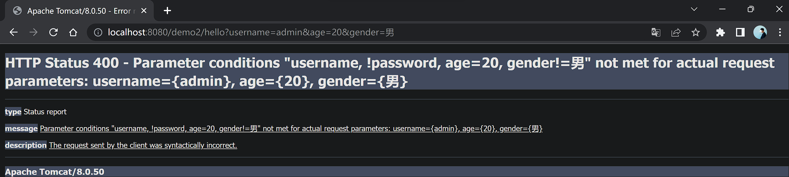 -->


> 如果遇到params属性不匹配的情况,就会报这个错误:
> HTTP Status 400 - Parameter conditions "xxxxx" not met for actual request parameters:

那如何设置请求参数呢,有两种方式:

1. 直接?拼接

```html
<a th:href="@{/hello?username=admin}">测试params属性</a>
```

2. 小括号的形式

```html
<a th:href="@{/hello(username='admin')}">测试params属性</a>
```

**有什么区别吗?没有,只是第一种写法,会报红,但实际运行时没问题**

<!-- 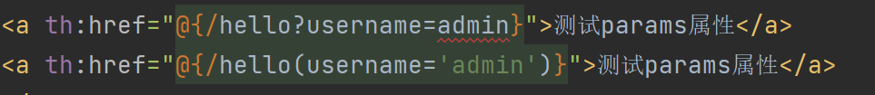 -->


**但是param用的并不多,还是value和method用的比较多**

#### @RequestMapping的headers属性(了解)

随便写点吧,反正是了解
@RequestMapping注解的headers属性通过请求的请求头信息匹配请求映射
@RequestMapping注解的headers属性是一个字符串类型的数组,可以用过四种表达式设置请求头信息和请求映射的匹配关系

这四种和上面的params类似,但又有些区别

<!-- 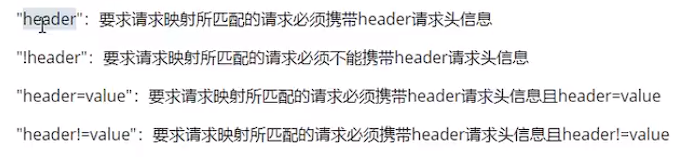 -->


若当前请求满足@RequestMapping注解的value和method属性,但是不满足headers属性,此时页面显示404错误,即资源未找到

#### SpringMVC支持ant风格的路径

说白了就是用特殊符号来表示路径片段

1. ?:表示任意的单个字符
2. *:表示任意的0个或多个字符
3. \**:表示任意层数的任意目录
   注意:在使用**时,只能使用/\*\*/xxx的方式

示例1:

```java
    /**
     * ？：任意的单个字符
     * @return
     */
    @RequestMapping("/a?c/test/ant")
    public String testAnt(){
        return "success";
    }
```

此时就可以匹配a(任意字符)c的请求了,**但是某些特殊字符是不行的,比如?**

```html
<a th:href="@{/abc/test/ant}">测试Ant</a>
<a th:href="@{/acc/test/ant}">测试Ant</a>
<a th:href="@{/adc/test/ant}">测试Ant</a>
```

示例2:

```java
    @RequestMapping("/a*c/test/ant")
    public String testAnt(){
        return "success";
    }
```

此时可以匹配任意个数的任意字符,但是也不能有特殊字符:?,/

示例3:

```java
    @RequestMapping("/**/test/ant")
    public String testAnt(){
        return "success";
    }
```

此时可以表示任意层数的任意目录,但是要注意写法:**\*\*只能写在双斜线中,前后不能有任何的字符**

<!-- 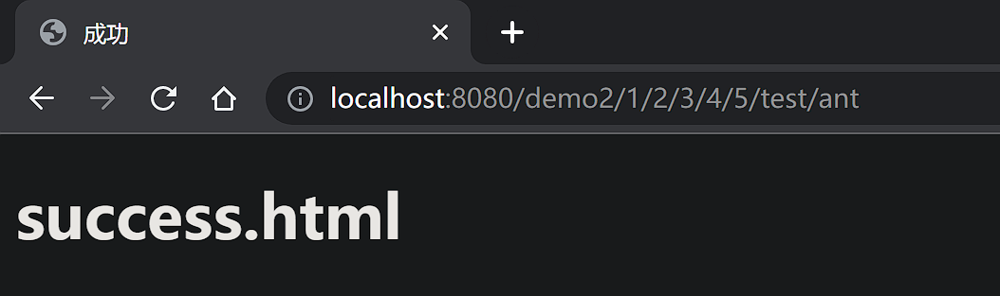 -->


#### SpringMVC支持路径中的占位符(重点)

原始方式: /deleteUser?id=1
rest方式: /deleteUser/1
又是这个rest方式:RESTful,当时看的时候迷迷瞪瞪的

> SpringMVC路径中的占位符常用于RESTful更各种,当请求路径种将某些数据通过路径的方式传输到服务器中,就可以在相应的@RequestMapping注解的value属性中通过占位符{xxx}表示传输的数据,在通过@PathVariable注解,将占位符所表示的数据赋值给控制器方法的形参

**说白了就是将发送的请求参数也作为路径的一部分**

主要就是要用{}和@PathVariable(""),

```java
    @RequestMapping("/test/rest/{username}/{id}")
    public String testRest(@PathVariable("id") Integer id, @PathVariable("username") String username) {
        System.out.println("id: " + id);
        System.out.println("username: " + username);
        return "success";
    }
```

此时:

```html
<a th:href="@{/test/rest/admin/1}">测试@ReqeustMapping注解的value属性中的占位符</a>
```

后端就可以获取到admin和1了

### SpringMVC获取请求参数

1. 通过ServletAPI获取,也就是老式的获取方式,主要就是要注意request是从哪里来的,是前端控制器检测方法用的是什么,就会给什么

```java
    @RequestMapping("/param/servletAPI")
    public String getParamByServletAPI(HttpServletRequest request) {
        String username = request.getParameter("username");
        String password = request.getParameter("password");
        System.out.println("username: " + username);
        System.out.println("password: " + password);
        return "success";
    }
```

```html
<form th:action="@{/param/servletAPI}" method="post">
    用户名: <input type="text" name="username"><br>
    密码:  <input type="password" name="password"><br>
    <input type="submit" value="登录">
</form>
```

2. 通过控制器方法的形参获取
   这种方法太简单了,只需要在形参位置写上和name一样的名字,就可以直接获取了,不用加注解,也不用写request

```java
    @RequestMapping("/param")
    public String getParam(String username,String password){
        System.out.println("username: " + username);
        System.out.println("password: " + password);
        return "success";
    }
```

```html
<form th:action="@{/param}" method="post">
    用户名: <input type="text" name="username"><br>
    密码:  <input type="password" name="password"><br>
    <input type="submit" value="登录">
</form>
```

但是如果请求参数和形参名不一致呢,也就是自己设置的不一致,此时可以使用@RquestParam注解

```java
    @RequestMapping("/param")
    public String getParam(@RequestParam("userName") String username, String password){
        System.out.println("username: " + username);
        System.out.println("password: " + password);
        return "success";
    }
```

*但是我感觉多此一举*,相当于多一个映射,用于请求参数和形参不一致的情况

还有就是@RequestParam注解的其他属性值

1. required,默认为true,表示必须传这个参数,如果不传,报400
2. defaultValue,当设置了defaultValue时,无论required是true还是false,当没传参数时,就是用默认值,传了,那就使用传的参数

```java
    @RequestMapping("/param")
    public String getParam(@RequestParam(value = "userName",required = false,defaultValue = "hello") String username, String password){
        System.out.println("username: " + username);
        System.out.println("password: " + password);
        return "success";
    }
```

### @RequestHeader和@CookieValue

1. @RequestHeader: 将请求头信息和控制器方法的形参绑定
2. @CookieValue: 将Cookie数据和控制器方法的形参绑定

```java
    @RequestMapping("/param")
    public String getParam(
            @RequestParam(value = "userName", required = false, defaultValue = "hello") String username,
            String password,
            @RequestHeader("referer") String referer,
            @CookieValue("JSESSIONID") String jsessionId
    ) {
        System.out.println("username: " + username);
        System.out.println("password: " + password);
        System.out.println("referer:" + referer);
        System.out.println("jsessionId:" + jsessionId);
        return "success";
    }
```

当然获取cookie的前提是要有,所以在上面的/param/servletAPI中添加了:

```java
        HttpSession session = request.getSession();
```

**此时先访问/param/servletAPI,然后再访问/param,就可以获取到jsessionId的cookie了**

### 通过pojo获取请求参数

这种以后用的也是很多

```java
    @RequestMapping("/param/pojo")
    public String getParamByPojo(User user){
        System.out.println(user);
        return "success";
    }
```

只需要在控制器方法的形参位置设置实体类类型的形参,要保证实体类中的属性的属性名和请求参数的名字一致,就可以实体类类型的形参获取请求参数
**这种也是用的最多的一种方式**

### 解决获取请求参数的乱码问题

解决获取请求参数的乱码问题,可以使用SpringMVC提供的编码过滤器CharacterEncodingFilter,但是必须在web.xml中进行注册

把这个放到web.xml中就可以了

```xml
    <!--    配置Spring的编码过滤器 -->
    <filter>
        <filter-name>CharacterEncodingFilter</filter-name>
        <filter-class>org.springframework.web.filter.CharacterEncodingFilter</filter-class>
        <init-param>
            <param-name>encoding</param-name>
            <param-value>UTF-8</param-value>
        </init-param>
        <init-param>
            <param-name>forceEncoding</param-name>
            <param-value>true</param-value>
        </init-param>
    </filter>
    <filter-mapping>
        <filter-name>CharacterEncodingFilter</filter-name>
        <url-pattern>/*</url-pattern>
    </filter-mapping>
```

> 还有一个要注意的地方
> Tomcat7，如果不在server.xml中设置字符集的话，那GET和POST都是乱码(中文乱码)
> Tomcat8，解决了GET请求乱码的问题，但是没有解决POST请求乱码，此时在web.xml中设置filter过滤器即可

**SpringmVC中处理编码的过滤器一定要配置在其他过滤器之前,否则无效**

### 域对象共享数据

#### 使用ServletAPI向request域对象共享数据

这还是老式的方式setAttribute()

#### 使用ModelAndView向request域对象共享数据

> 不管使用的是哪种方式,到最后都会被转换为ModelAndView的形式共享数据,这也是为什么推荐使用这个的原因

具体步骤:

1. 创建ModelAndView对象
2. 共享数据:addObject()
3. 设置视图:setViewName()
   **注意,如果使用ModelAndView,就必须将ModelAndView对象返回**

```java
@RequestMapping("/test/mav")
    public ModelAndView testModelAndView(){
        /**
         * ModelAndView 包含Model和View的功能
         * Model: 向请求域中共享数据
         * View: 设置逻辑视图，实现页面跳转
         */
        ModelAndView mav = new ModelAndView();
        //向请求域中共享数据
        mav.addObject("testRequestScope","hello,ModelAndView");
        //设置逻辑视图
        mav.setViewName("success");
        return mav;
    }
```

那如何获取数据呢?
哈哈哈哈哈哈艹

```html
<!--  thymeleaf中的语法，使用${}渲染p标签中的内容-->
<p th:text="${testRequestScope}"></p>
```

#### 使用Model向请求域中共享数据

这可能是最常用的方式了,因为相较于ModelAndView,这个明显简单一些

- 对象不用自己创建,直接写在形参位置即可
- 视图直接返回,不需要setView对象

```java
    @RequestMapping("/test/model")
    public String testModel(Model model){
        model.addAttribute("testRequestScope","hello,Model");
        return "success";
    }
```

#### 使用ModelMap向请求域中共享数据

这种也是很简单,几乎一模一样

```java
    @RequestMapping("/test/modelMap")
    public String testModelMap(ModelMap modelMap){
        modelMap.addAttribute("testRequestScope","hello,ModelMap");
        return "success";
    }
```

#### 使用map向请求域中共享数据

区别仅在于形参的对象不同

```java
    @RequestMapping("/test/map")
    public String testMap(Map<String,Object> map){
        map.put("testRequestScope","hello,map");
        return "success";
    }
```

#### Model和ModelMap和map的关系

**无论是使用Model,ModelMap,Map,底层都是同一个类:**
org.springframework.validation.support.BindingAwareModelMap

#### 向session域和application域中共享数据

建议还是使用老式的共享方式:setAttribute
因为SpringMVC提供的方式比原生servlet更复杂一些

```java
    @RequestMapping("/test/session")
    public String testSession(HttpSession session){
        session.setAttribute("testSessionScope","hello,Session");
        return "success";
    }

    @RequestMapping("/test/application")
    public String testApplication(HttpSession session){
        ServletContext servletContext = session.getServletContext();
        servletContext.setAttribute("testApplicationScope","hello,application");
        return "success";
    }
```

两个一块写了,主要就是记好如何往域中共享数据
session是直接使用session对象,而application也是使用session,但是要获取servletContext对象再设置

而获取域中的数据:

```html
<!--  在thymeleaf中，如果要获取session和application域中的数据，要写上session/application.xxx的形式-->
<p th:text="${session.testSessionScope}"></p>
<p th:text="${application.testApplicationScope}"></p>
```

### SpringMVC的视图

SpringMVC中的视图是View接口,视图的作用是渲染数据,将模型Model中的数据展示给用户
SpringMVC视图的种类很多,默认有转发视图和重定向视图
当工程引入jstl的依赖,转发视图会自动转换为jstlView
若使用的视图技术为Thymeleaf,在SpringMVC的配置文件中配置了Thymeleaf的视图解析器,由此视图解析器解析之后所得到的是ThymeleafView

#### ThymeleafView

**当控制器方法中所设置的视图名称没有任何前缀时,此时的视图名称会被SpringMVC配置文件中所配置的视图解析器解析,视图名称拼接视图前缀和视图后缀所得到的最终路径,会通过转发的方式实现跳转**

#### InternalResourceView

就是在视图前加上"forward:"

```java
    @RequestMapping("/test/view/forward")
    public String testInternalResourceView(){
        // 转发到/test/model
        return "forward:/test/model";
    }
```

但是这个用的不多的,因为原来实现的就是转发,这个也是转发
**以后用的最多的还是Thymeleaf**

#### 重定向视图RedirectView

```java
    @RequestMapping("/test/view/redirect")
    public String testRedirectView(){
        return "redirect:/test/model";
    }
```

> 总结来说,使用转发视图时,使用Thymeleaf视图,使用重定向时,使用重定向视图,而访问页面失败时,**就使用转发,访问成功就使用重定向**

#### 视图控制器view-controller

当控制器方法中,仅仅用来实现页面跳转,即只需要设置视图名称时,可以将处理器方法使用view-controller标签进行表示

```xml
    <!--    开启mvc的注解驱动-->
    <mvc:annotation-driven/>

    <!--  视图控制器：为当前的请求直接设置视图名称实现页面跳转 但是需要mvc:annotation-driven标签
          没有这个标签，那么DispatcherServlet只能处理视图控制器所设置的请求，其他请求全部404
    -->
    <mvc:view-controller path="/" view-name="index"/>
```

**通过标签实现页面跳转**

### RESTful

#### RESTful简介

> 其实我又开始迷茫了
> 因为这个视频看完好像也是没学到什么
> 还是要做项目啊
> 到底是先用SSM做一个项目,然后再学boot
> 还是先学boot,再做项目呢
> 看完再说吧
> 害

创建新的工程

我也不知道到底有什么用,反正就是看吧,看明白就好

#### RESTful模拟CRUD

**要注意,form表单只有两种提交方式,get和post,是没有put和delete的,要想实现这两种方式,需要以下步骤:**

1. 设置过滤器(要注意一定要设置在编码过滤器的后面)

```xml
<!--    设置处理请求方式的过滤器   -->
    <filter>
        <filter-name>HiddenHttpMethodFilter</filter-name>
        <filter-class>org.springframework.web.filter.HiddenHttpMethodFilter</filter-class>
    </filter>
    <filter-mapping>
        <filter-name>HiddenHttpMethodFilter</filter-name>
        <url-pattern>/*</url-pattern>
    </filter-mapping>
```

2. 设置name为_method的input标签,并保证form表单是post请求方式

```html
<form th:action="@{/user}" method="post">
    <input type="hidden" name="_method" value="put">
    <input type="submit" value="修改用户信息">
</form>
```

**name必须为_method,value为要设置的请求方式**

那代码都在这了,因为没啥难的,所以就一块放了

> 这里使用了派生注解

```java
package com.zzmr.controller;

import org.springframework.stereotype.Controller;
import org.springframework.web.bind.annotation.*;

/**
 * 查询所有的用户信息--->/user-->get
 * 根据id查询用户信息--->/user/1-->get
 * 添加用户信息--->/user-->post
 * 修改用户信息--->/user-->put
 * 删除用户信息--->/user/1-->delete
 */

@Controller
public class TestRestController {

    //@RequestMapping(value = "/user", method = RequestMethod.GET)
    @GetMapping("/user")
    public String getAllUser() {
        System.out.println("查询所有的用户信息--->/user-->get");
        return "success";
    }

    //@RequestMapping(value = "/user/{id}", method = RequestMethod.GET)
    @GetMapping("/user/{id}")
    public String getUserById(@PathVariable("id") Integer id) {
        System.out.println("根据id查询用户信息--->/user/" + id + "-->get");
        return "success";
    }


    //@RequestMapping(value = "/user", method = RequestMethod.POST)
    @PostMapping("/user")
    public String insertUser() {
        System.out.println("添加用户信息--->/user-->post");
        return "success";
    }

    //@RequestMapping(value = "/user", method = RequestMethod.PUT)
    @PutMapping("/user")
    public String updateUser() {
        System.out.println("修改用户信息--->/user-->put");
        return "success";
    }

    //@RequestMapping(value = "/user/{id}",method = RequestMethod.DELETE)
    @DeleteMapping("/user/{id}")
    public String deleteUser(@PathVariable("id") Integer id) {
        System.out.println("删除用户信息--->/user/" + id + "-->delete");
        return "success";
    }
}

```

然后就是页面

```html
<!DOCTYPE html>
<html lang="en" xmlns:th="http://www.thymeleaf.org">
<head>
    <meta charset="UTF-8">
    <title>首页</title>
</head>
<body>
<h1>index.html</h1>
<a th:href="@{/user}">查询所有的用户信息</a><br>
<a th:href="@{/user/2}">根据id查询用户</a><br>
<form th:action="@{/user}" method="post">
    <input type="submit" value="添加用户信息">
</form>
<form th:action="@{/user}" method="post">
    <input type="hidden" name="_method" value="put">
    <input type="submit" value="修改用户信息">
</form>
<form th:action="@{/user/1}" method="post">
    <input type="hidden" name="_method" value="delete">
    <input type="submit" value="删除用户信息">
</form>
</body>
</html>
```

#### RESTful案例

这次所谓的测试并没有链接数据库,还是只是模拟一下

> 真的是,用了新键盘两天,就感觉原来的键盘手感怪怪的

**这个案例好像也学不到什么,但是可以学一下,如何展示集合中的数据**
这个还是挺有用的:
思路就是,循环,语法:
**th:each="employee : ${域中集合的name}",那么employee就表示集合中的每一项**

```html
<table>
    <tr>
        <th colspan="5">employee list</th>
    </tr>
    <tr>
        <th>id</th>
        <th>lastName</th>
        <th>email</th>
        <th>gender</th>
        <th>options</th>
    </tr>
    <tr th:each="employee : ${allEmployee}">
        <td th:text="${employee.id}"></td>
        <td th:text="${employee.lastName}"></td>
        <td th:text="${employee.email}"></td>
        <td th:text="${employee.gender}"></td>
        <td>
            <a th:href="">delete</a>
            <a th:href="">update</a>
        </td>
    </tr>
</table>
```

> 静态资源的访问
> 在自己写的工程中的web.xml有DispatcherServlet,我们重写了一个url-pattern,为斜杆/,这就直接覆盖了tomcat自带的defaultServlet,而DistpathcerServlet是不能处理静态资源的,所以此时引入静态资源是404

解决办法

```xml
<!--    配置默认的servlet处理静态资源-->
    <mvc:default-servlet-handler/>
```

但是想用这个,还需要:

```xml
    <mvc:annotation-driven/>
```

此时就实现了:**请求先让DispatcherServlet处理,如果处理不了,比如静态资源,再转给默认的servlet处理(tomcat自带的)**

**还有一个要注意的点,之前写的默认跳转首页的那个,其实还可以用到一些其他地方,比如要跳转到添加页面,此时是不需要controller处理的,就让它直接跳过去,就可以直接在springmvc.xml中配置上**

```xml
    <mvc:view-controller path="/to/add" view-name="employee_add"/>
```

**还有要注意的地方**
路径的拼接:

```html
     <a th:href="@{'/employee/'+${employee.id}}">update</a>
```

**单引号括起来,然后用加号拼接**

**然后,写了一堆vue,我已经啥都不会了哈哈哈哈**

然后把代码放着吧

```java
package com.zzmr.controller;

import com.zzmr.dao.EmployeeDao;
import com.zzmr.pojo.Employee;
import org.springframework.beans.factory.annotation.Autowired;
import org.springframework.stereotype.Controller;
import org.springframework.ui.Model;
import org.springframework.web.bind.annotation.PathVariable;
import org.springframework.web.bind.annotation.RequestMapping;
import org.springframework.web.bind.annotation.RequestMethod;

import java.util.Collection;

/**
 * 查询所有的员工信息：/employee--->get
 * 跳转到添加页面：/to/add--->get
 * 添加员工信息：/employee--->post
 * 跳转到修改页面：/employee/1--->get
 * 修改员工信息：/employee--->put
 * 删除员工信息：/employee--->delete
 */
@Controller
public class EmployeeController {

    @Autowired
    private EmployeeDao employeeDao;

    @RequestMapping(value = "/employee", method = RequestMethod.GET)
    public String getAllEmployee(Model model) {
        //获取所有的员工信息
        Collection<Employee> allEmployee = employeeDao.getAll();
        //将所有的员工信息在请求域中共享
        model.addAttribute("allEmployee", allEmployee);
        //跳转到列表页面
        return "employee_list";
    }

    @RequestMapping(value = "/employee", method = RequestMethod.POST)
    public String addEmployee(Employee employee) {
        employeeDao.save(employee);
        //这里不能直接跳转到列表页面，直接跳转是没有数据的，因为列表页面的数据要经过getAllEmployee()处理才能获得
        return "redirect:/employee";
    }

    @RequestMapping(value = "/employee/{id}", method = RequestMethod.GET)
    public String toUpdateEmployee(@PathVariable("id") Integer id, Model model) {
        //    根据员工查询员工信息
        Employee employee = employeeDao.get(id);
        //    将员工信息共享到请求域中
        model.addAttribute("employee", employee);
        //    跳转到employee_update
        return "employee_update";
    }

    /**
     * 接收前端发过来的employee
     * @param employee
     * @return
     */
    @RequestMapping(value = "/employee",method = RequestMethod.PUT)
    public String updateEmployee(Employee employee){
        employeeDao.save(employee);
        //保存之后，就直接重定向到列表了
        return "redirect:/employee";
    }

    @RequestMapping(value = "/employee/{id}",method = RequestMethod.DELETE)
    public String deleteEmployee(@PathVariable("id") Integer id){
        employeeDao.delete(id);
        return "redirect:/employee";
    }
}
```

### SpringMVC处理ajax请求

之前学过吗?忘了,翻翻web的笔记看看,还真是学过,笑死,忘的一干二净

> 好久没见了

#### axios

这个又是什么?这个没啥印象好像

手好干啊,摸这个新键盘有一种让人起鸡皮疙瘩的感觉

我甚至都不知道在写什么

@RequestBody注解的使用=>将请求体中的内容和控制器方法的形参进行绑定
**将json格式的请求参数转换为java对象**
如何使用?

1. 导入jackson的依赖
2. 在SpringMVC的配置文件中设置开启mvc的注解驱动:[mvc:annotation-driven](mvc:annotation-driven)
3. 在处理请求的控制器方法的形参位置直接设置json格式的请求参数要转化的java类型的形参,使用@RequestBody注解标识即可

@ResponseBody,将所标识的控制器方法的返回值作为响应报文的响应体响应到浏览器
使用@ResponseBody注解响应浏览器json格式的数据

1. 导入jackson的依赖
2. 在SpringMVC的配置文件中设置开启mvc的注解驱动:[mvc:annotation-driven](mvc:annotation-driven)
3. 将需要转化为json字符串的java对象直接作为控制器方法的返回值,使用@ResponseBody注解标识控制器方法,就可以将java对象直接转化为json字符串,并响应到浏览器

```java
    @RequestMapping("/test/ResponseBody/json")
    @ResponseBody
    public User testResponseBody() {
        User user = new User(1001, "admin", "123456", 20, "男");
        return user;
    }
```

**总结来说,就听懂一点:服务器想给浏览器发送一个Java类时,可以使用@ResponseBody注解,这个注解可以将Java对象直接转化为json字符串返回到浏览器,不需要多余的操作,非常方便**

> 常用的Java对象转化为json的结果
> 实体类->json对象
> map->json对象
> list->json数组

map集合:

```java
    @RequestMapping("/test/ResponseBody/json")
    @ResponseBody
    public Map<String,Object> testResponseBody() {
        User user1 = new User(1001, "admin1", "123456", 20, "男");
        User user2 = new User(1002, "admin2", "123456", 20, "男");
        User user3 = new User(1003, "admin3", "123456", 20, "男");
        Map<String,Object> map = new HashMap<>();
        map.put("1001",user1);
        map.put("1002",user2);
        map.put("1003",user3);
        return map;
    }
```

list集合:

```java
    @RequestMapping("/test/ResponseBody/json")
    @ResponseBody
    public List<User> testResponseBody() {
        User user1 = new User(1001, "admin1", "123456", 20, "男");
        User user2 = new User(1002, "admin2", "123456", 20, "男");
        User user3 = new User(1003, "admin3", "123456", 20, "男");
        List<User> users = Arrays.asList(user1, user2, user3);
        return users;
    }
```

其实这些东西也没啥难的吧

还有一个注解也挺有用的
**@RestController注解**
此注解是一个复合注解,标识在控制器的类上,就相当于为类添加了@Controller注解,并且为其中的每个方法添加了@ResponseBody注解

### 文件上传和下载

文件上传和下载
上次听完这个,现在已经忘干净了
好像没学过一样
这个好像挺麻烦的

#### 文件下载

ResponseEntity用于控制器方法的返回值类型,该控制器方法的返回值就是响应到浏览器的响应报文,使用ResponseEntity实现下载文件的功能

要注意getRealPath()方法,这个方法如果括号里不写字符串,则返回的是整个项目在服务器中的位置,如果加上了字符串,则会将字符串拼接到位置的后面
String realPath = servletContext.getRealPath("");

下载的代码,基本相似,以后用到直接复制就行

```java
@RequestMapping("/test/down")
    public ResponseEntity<byte[]> testResponseEntity(HttpSession session) throws IOException {
        //获取ServletContext对象
        ServletContext servletContext = session.getServletContext();
        //获取服务器中文件的真实路径
        String realPath = servletContext.getRealPath("img");
        realPath = realPath + File.separator + "11.png";
        //创建输入流
        InputStream is = new FileInputStream(realPath);
        //创建字节数组        is.available()  获取输入流所对应文件的字节数
        byte[] bytes = new byte[is.available()];
        //将流读到字节数组中
        is.read(bytes);
        //创建HttpHeaders对象设置响应头信息
        MultiValueMap<String, String> headers = new HttpHeaders();
        //设置要下载方式以及下载文件的名字
        headers.add("Content-Disposition", "attachment;filename=11.png");
        //设置响应状态码
        HttpStatus statusCode = HttpStatus.OK;
        //创建ResponseEntity对象
        ResponseEntity<byte[]> responseEntity = new ResponseEntity<>(bytes, headers, statusCode);
        //关闭输入流
        is.close();
        return responseEntity;
    }
```

#### 文件上传

文件上传的条件:

1. form表单的请求方式必须为post
2. form表单必须设置属性enctype="multipart/form-data"

先添加依赖:

```xml
        <!-- https://mvnrepository.com/artifact/commons-fileupload/commons-fileupload -->
        <dependency>
            <groupId>commons-fileupload</groupId>
            <artifactId>commons-fileupload</artifactId>
            <version>1.3.1</version>
        </dependency>
    </dependencies>
```

控制器方法:

```java
    @RequestMapping("/test/up")
    public String testUp(MultipartFile photo, HttpSession session) throws IOException {
        // MultipartFile的对象名要和file域的name一致
        String fileName = photo.getOriginalFilename();
        // 获取ServletContext对象
        ServletContext servletContext = session.getServletContext();
        // 获取当前工程下photo目录的真实路径
        String photoPath = servletContext.getRealPath("photo");
        // 创建photoPath所对应的File对象
        File file = new File(photoPath);
        // 判断file所对应目录是否存在
        if (!file.exists()) {
            file.mkdir();
        }
        String finalPath = photoPath + File.separator + fileName;
        //上传文件
        photo.transferTo(new File(finalPath));
        return "success";
    }
```

注意form表单

```html
    <form th:action="@{/test/up}" method="post" enctype="multipart/form-data">
        头像<input type="file" name="photo"><br>
        <input type="submit" value="上传">
    </form>
```

以及配置文件中的bean

```xml
    <!--    配置文件上传解析器-->
    <bean id="multipartResolver" class="org.springframework.web.multipart.commons.CommonsMultipartResolver"></bean>
```

**id一定要为multipartResolver,为commonMultipartResolver就会报错,为其他的同样会报错**

#### 解决文件上传重名问题

```java
        String fileName = photo.getOriginalFilename();
        String hz = fileName.substring(fileName.lastIndexOf("."));
        String uuid = UUID.randomUUID().toString();
        //拼接一个新的文件名
        fileName = uuid + hz;
```

思路就是使用uuid,先用fileName.lastIndexOf()方法获取原始文件名最后的点的索引,然后使用substring()方法来截断,获取到后缀,再生成一个uuid,最后拼接

文件上传和下载也看完了,也没啥东西,主要就是思路

后面就是拦截器了?
好像就是了解一下

看到这时候,又开始迷茫了,不做项目是进步不了的
但是你这个情况,好像也做不了项目
就你这个水平,啥都用不利索
害
不管了,明天继续看吧,看完再说
2022年12月15日 21点20分

### 拦截器

了解

#### 配置拦截器

就了解一下如何配置拦截器吧
一个标签:

```xml
    <mvc:interceptors>
        <bean class="com.zzmr.interceptor.FirstInterceptor"></bean>
    </mvc:interceptors>
```

这样就可以配置FirstInterceptor这个类为一个拦截器

其他的配置方式:ref,引用其他的bean

```xml
    <bean id="firstInterceptor" class="com.zzmr.interceptor.FirstInterceptor"></bean>

    <mvc:interceptors>
        <ref bean="firstInterceptor"/>
    </mvc:interceptors>
```

还可以使用注解加扫描的形式
给FirstInterceptor类加上@Component注解
然后也是使用ref就可以了,id为类名首字母小写

第三种配置方式,更精确,因为上面两种都是默认对所有的请求进行拦截,而下面这种可以更加的精确,也可以进行排除
而/\*则表示上下文目录下的一层目录,意思就是http://localhost:8080/SpringMVC/first,只能拦截一层目录,如果有多层则不进行拦截,/\*\*就表示所有目录

```xml
    <mvc:interceptors>
        <mvc:interceptor>
            <mvc:mapping path="/**"/>
            <!--            排除扫描-->
            <mvc:exclude-mapping path="/abc"/>
            <ref bean="firstInterceptor"/>
        </mvc:interceptor>
    </mvc:interceptors>
```

**拦截器中的方法:**

```java
    /**
     * preHandle方法，在控制器方法之前执行，return false，表示拦截，返回true，表示放行
     */
    @Override
    public boolean preHandle(HttpServletRequest request, HttpServletResponse response, Object handler) throws Exception {
        System.out.println("FirstInterceptor-->preHandle");
        return true;
    }

    @Override
    public void postHandle(HttpServletRequest request, HttpServletResponse response, Object handler, ModelAndView modelAndView) throws Exception {
        System.out.println("FirstInterceptor-->postHandle");
    }

    @Override
    public void afterCompletion(HttpServletRequest request, HttpServletResponse response, Object handler, Exception ex) throws Exception {
        System.out.println("FirstInterceptor-->afterCompletion");
    }
```

#### 拦截器的执行顺序

拦截器方法的执行:

- preHandle() 在控制器方法执行之前  返回值表示对控制器方法的拦截(false)或放行(true)
- postHandle() 在控制器方法执行之后
- afterCompletion()  在控制器方法执行之后，且渲染视图完毕之后执行

**多个拦截器的执行顺序**
多个拦截器的执行顺序和拦截器在SpringVC的**配置文件中的配置的顺序有关**
preHandle()  按照配置的顺序执行，而postHandle() 和 afterCompletion() 按照配置的逆序执行
若拦截器中有某个拦截器的preHandle()返回值false

preHandle()返回false的情况:

- 若拦截其中某个拦截器的preHandle()返回了false和它之前的拦截器的preHandle()都会执行
- 所有的拦截器的post()都不执行
- 拦截器的preHandle()返回false之前的拦截器的afterCompletion会执行

害,其实也没什么意义,就看看而已
用灰木轴用多了,发现这个茶轴用起来好硬啊哈哈哈哈哈艹
手被惯坏了都

### 异常处理

这块看之前的笔记吧,懒得写了
反正内容都差不多

### 基于注解配置SpringMVC

这个好好看看吧

在Servlet3.0环境中,容器会在类路径中查找实现javax.servlet.ServletContainerInitializer接口的类,如果找到的话就用它来配置Servlet容器
Spring提供了这个接口的实现,名为SpringServletContainerInitializer,这个类反过来又会查找实现WebApplicationInitializer的类并配置的任务交给它们来完成,Spring3.2引入了一个便利的WebApplicationInitializer基础实现,名为AbstractAnnotationConfigDispatcherServletInitializer,当我们的类扩展了AbstractAnnotationConfigDispatcherServletInitializer并将其部署到Servlet3.0容器的时候,容器会自动发现它,并用它来配置Servlet上下文

#### 创建初始化类,代替web.xml

> 在Servlet3.0环境中,容器会在类路径中查找实现javax.servlet.ServletContainerInitializer接口的类,如果找到的话就用它来配置Servlet容器
> Spring提供了这个接口的实现,名为SpringServletContainerInitializer,这个类反过来又会查找实现WebApplicationInitializer的类并配置的任务交给它们来完成,Spring3.2引入了一个便利的WebApplicationInitializer基础实现,名为AbstractAnnotationConfigDispatcherServletInitializer,当我们的类扩展了AbstractAnnotationConfigDispatcherServletInitializer并将其部署到Servlet3.0容器的时候,容器会自动发现它,并用它来配置Servlet上下文

上代码吧注释都写好了
以后其实是用这种方式比较多吧,如果是开发项目,这种方式要比xml配置快,但是后期可能维护起来比较麻烦,但是开发时还是经常用注解的

```java
package com.zzmr.config;

import org.springframework.web.filter.CharacterEncodingFilter;
import org.springframework.web.filter.HiddenHttpMethodFilter;
import org.springframework.web.servlet.support.AbstractAnnotationConfigDispatcherServletInitializer;

import javax.servlet.Filter;

/**
 * 代替web.xml
 */
public class WebInit extends AbstractAnnotationConfigDispatcherServletInitializer {

    /**
     * 设置一个配置类，代替Spring的配置文件
     *
     * @return
     */
    @Override
    protected Class<?>[] getRootConfigClasses() {
        return new Class[]{SpringConfig.class};
    }

    /**
     * 设置一个配置类，代替SpringMVC的配置文件
     *
     * @return
     */
    @Override
    protected Class<?>[] getServletConfigClasses() {
        return new Class[]{WebConfig.class};
    }

    /**
     * 设置SpringMVC的前端控制器DispatcherServlet的url-pattern
     * 大括号里的就是url-pattern，可以设置多个，用双引号隔开
     *
     * @return
     */
    @Override
    protected String[] getServletMappings() {
        return new String[]{"/"};
    }

    /**
     * 设置当前的过滤器
     *
     * @return
     */
    @Override
    protected Filter[] getServletFilters() {
        //创建编码过滤器
        CharacterEncodingFilter characterEncodingFilter = new CharacterEncodingFilter();
        characterEncodingFilter.setEncoding("UTF-8");
        characterEncodingFilter.setForceEncoding(true);
        //创建处理请求方式的过滤器
        HiddenHttpMethodFilter hiddenHttpMethodFilter = new HiddenHttpMethodFilter();
        return new Filter[]{characterEncodingFilter, hiddenHttpMethodFilter};
    }
}
```

#### 创建WebConfig来代替SpringMVC配置文件

还是挺多的,不过那个视图解析器可以直接复制,都是类似的内容

```java
package com.zzmr.config;

import com.zzmr.interceptor.FirstInterceptor;
import org.springframework.context.annotation.Bean;
import org.springframework.context.annotation.ComponentScan;
import org.springframework.context.annotation.Configuration;
import org.springframework.web.context.ContextLoader;
import org.springframework.web.context.WebApplicationContext;
import org.springframework.web.multipart.commons.CommonsMultipartResolver;
import org.springframework.web.servlet.HandlerExceptionResolver;
import org.springframework.web.servlet.ViewResolver;
import org.springframework.web.servlet.config.annotation.*;
import org.springframework.web.servlet.handler.SimpleMappingExceptionResolver;
import org.thymeleaf.spring5.SpringTemplateEngine;
import org.thymeleaf.spring5.view.ThymeleafViewResolver;
import org.thymeleaf.templatemode.TemplateMode;
import org.thymeleaf.templateresolver.ITemplateResolver;
import org.thymeleaf.templateresolver.ServletContextTemplateResolver;

import java.util.List;
import java.util.Properties;

/**
 * 代替SpringMVC的配置文件
 * 先要知道SpringMVC的配置文件都配置了哪些东西：
 * 扫描组件，视图解析器，默认的Servlet，mvc的注解驱动，视图控制器，文件上传解析器，拦截器，异常解析器
 */

@Configuration
//扫描组件的注解
@ComponentScan("com.zzmr.controller")
//mvc的注解驱动
@EnableWebMvc
public class WebConfig implements WebMvcConfigurer {


    /**
     * 默认的servlet处理静态资源
     *
     * @param configurer
     */
    @Override
    public void configureDefaultServletHandling(DefaultServletHandlerConfigurer configurer) {
        configurer.enable();
    }

    /**
     * 配置视图控制器
     *
     * @param registry
     */
    @Override
    public void addViewControllers(ViewControllerRegistry registry) {
        registry.addViewController("/").setViewName("index");
    }

    /**
     * 配置文件上传解析器
     *
     * @return
     * @Bean 注解可以将标识的方法的返回值作为bean进行管理
     * bean的id为方法的方法名
     */
    @Bean
    public CommonsMultipartResolver multipartResolver() {
        return new CommonsMultipartResolver();
    }

    /**
     * 配置拦截器
     * 直接在addInterceptor后面继续点，然后可以设置排除的路径
     *
     * @param registry
     */
    @Override
    public void addInterceptors(InterceptorRegistry registry) {
        FirstInterceptor firstInterceptor = new FirstInterceptor();
        registry.addInterceptor(firstInterceptor).addPathPatterns("/**");
    }

    /**
     * 配置异常解析器
     *
     * @param resolvers initially an empty list
     */
    @Override
    public void configureHandlerExceptionResolvers(List<HandlerExceptionResolver> resolvers) {
        SimpleMappingExceptionResolver simpleMappingExceptionResolver = new SimpleMappingExceptionResolver();
        Properties properties = new Properties();
        // 第一个为异常类型，第二个为跳转到逻辑视图
        properties.setProperty("java.lang.ArithmeticException", "error");
        simpleMappingExceptionResolver.setExceptionMappings(properties);
        simpleMappingExceptionResolver.setExceptionAttribute("ex");
        resolvers.add(simpleMappingExceptionResolver);
    }

    //还有视图解析器没有配置,下面三个方法都是

    //配置生成模板解析器
    @Bean
    public ITemplateResolver templateResolver() {
        WebApplicationContext webApplicationContext = ContextLoader.getCurrentWebApplicationContext();
// ServletContextTemplateResolver需要一个ServletContext作为构造参数，可通过WebApplicationContext 的方法获得
        ServletContextTemplateResolver templateResolver = new ServletContextTemplateResolver(webApplicationContext.getServletContext());
        templateResolver.setPrefix("/WEB-INF/templates/");
        templateResolver.setSuffix(".html");
        templateResolver.setCharacterEncoding("UTF-8");
        templateResolver.setTemplateMode(TemplateMode.HTML);
        return templateResolver;
    }

    //生成模板引擎并为模板引擎注入模板解析器
    @Bean
    public SpringTemplateEngine templateEngine(ITemplateResolver templateResolver) {
        SpringTemplateEngine templateEngine = new SpringTemplateEngine();
        templateEngine.setTemplateResolver(templateResolver);
        return templateEngine;
    }

    //生成视图解析器并未解析器注入模板引擎
    @Bean
    public ViewResolver viewResolver(SpringTemplateEngine templateEngine) {
        ThymeleafViewResolver viewResolver = new ThymeleafViewResolver();
        viewResolver.setCharacterEncoding("UTF-8");
        viewResolver.setTemplateEngine(templateEngine);
        return viewResolver;
    }

}
```

这就配置完了,但是Spring的配置文件没写
哈哈哈
明天见

#### SpringConfig代替Spring的配置文件

```java
package com.zzmr.config;

import org.springframework.context.annotation.Configuration;

/**
 * 代替Spring的配置文件
 */

//将类标识为配置类
@Configuration
public class SpringConfig {
}
```

没错里面啥都有没有,用到的时候再配置吧

### SpringMVC执行流程

看之前的吧

## SSM整合

又到了最后关头
这次好好看看吧,看完就开始做项目/下一阶段

### ContextLoaderListener

监听器,Spring提供了监听器ContextLoaderListener,实现ServletContextListener接口,可监听ServletContext的状态,在web服务器启动,读取Spring的配置文件,创建Spring的IOC容器,web应用中必须在web.xml中配置

> 什么意思呢,就是设置一个监听器,若服务器一启动,就去寻找Spring的配置文件,创建Spring的IOC容器,以便于SpringMVC的Controller层能够实现自动装配service,然后要实现这个功能,要在web.xml中配置

### 准备工作

#### pom.xml

**以后用到的话,就直接来这里复制了**

```xml
<?xml version="1.0" encoding="UTF-8"?>
<project xmlns="http://maven.apache.org/POM/4.0.0"
         xmlns:xsi="http://www.w3.org/2001/XMLSchema-instance"
         xsi:schemaLocation="http://maven.apache.org/POM/4.0.0 http://maven.apache.org/xsd/maven-4.0.0.xsd">
    <modelVersion>4.0.0</modelVersion>

    <groupId>com.zzmr.ssm</groupId>
    <artifactId>ssm_aio</artifactId>
    <version>1.0-SNAPSHOT</version>
    <packaging>war</packaging>

    <!--   配置的自定义属性，用来设置Spring的版本-->
    <properties>
        <spring.version>5.3.1</spring.version>
    </properties>

    <dependencies>

        <dependency>
            <groupId>org.springframework</groupId>
            <artifactId>spring-context</artifactId>
            <version>${spring.version}</version>
        </dependency>

        <dependency>
            <groupId>org.springframework</groupId>
            <artifactId>spring-beans</artifactId>
            <version>${spring.version}</version>
        </dependency>

        <!--springmvc-->
        <dependency>
            <groupId>org.springframework</groupId>
            <artifactId>spring-web</artifactId>
            <version>${spring.version}</version>
        </dependency>

        <dependency>
            <groupId>org.springframework</groupId>
            <artifactId>spring-webmvc</artifactId>
            <version>${spring.version}</version>
        </dependency>

        <!--        跟事务相关  -->
        <dependency>
            <groupId>org.springframework</groupId>
            <artifactId>spring-jdbc</artifactId>
            <version>${spring.version}</version>
        </dependency>

        <dependency>
            <groupId>org.springframework</groupId>
            <artifactId>spring-aspects</artifactId>
            <version>${spring.version}</version>
        </dependency>

<!--        Spring整合junit-->
        <dependency>
            <groupId>org.springframework</groupId>
            <artifactId>spring-test</artifactId>
            <version>${spring.version}</version>
        </dependency>

        <!-- Mybatis核心 -->
        <dependency>
            <groupId>org.mybatis</groupId>
            <artifactId>mybatis</artifactId>
            <version>3.5.7</version>
        </dependency>

        <!--mybatis和spring的整合包-->
        <dependency>
            <groupId>org.mybatis</groupId>
            <artifactId>mybatis-spring</artifactId>
            <version>2.0.6</version>
        </dependency>

        <!-- 连接池 -->
        <dependency>
            <groupId>com.alibaba</groupId>
            <artifactId>druid</artifactId>
            <version>1.2.5</version>
        </dependency>

        <!-- junit测试 -->
        <dependency>
            <groupId>junit</groupId>
            <artifactId>junit</artifactId>
            <version>4.12</version>
            <scope>test</scope>
        </dependency>

        <!-- MySQL驱动 -->
        <dependency>
            <groupId>mysql</groupId>
            <artifactId>mysql-connector-java</artifactId>
            <version>8.0.16</version>
        </dependency>

        <!-- log4j日志 -->
        <dependency>
            <groupId>log4j</groupId>
            <artifactId>log4j</artifactId>
            <version>1.2.17</version>
        </dependency>

        <!-- https://mvnrepository.com/artifact/com.github.pagehelper/pagehelper -->
        <dependency>
            <groupId>com.github.pagehelper</groupId>
            <artifactId>pagehelper</artifactId>
            <version>5.2.0</version>
        </dependency>

        <!-- 日志 -->
        <dependency>
            <groupId>ch.qos.logback</groupId>
            <artifactId>logback-classic</artifactId>
            <version>1.2.3</version>
        </dependency>

        <!-- ServletAPI -->
        <dependency>
            <groupId>javax.servlet</groupId>
            <artifactId>javax.servlet-api</artifactId>
            <version>3.1.0</version>
            <scope>provided</scope>
        </dependency>

        <dependency>
            <groupId>com.fasterxml.jackson.core</groupId>
            <artifactId>jackson-databind</artifactId>
            <version>2.12.1</version>
        </dependency>

        <dependency>
            <groupId>commons-fileupload</groupId>
            <artifactId>commons-fileupload</artifactId>
            <version>1.3.1</version>
        </dependency>

        <!-- Spring5和Thymeleaf整合包 -->
        <dependency>
            <groupId>org.thymeleaf</groupId>
            <artifactId>thymeleaf-spring5</artifactId>
            <version>3.0.12.RELEASE</version>
        </dependency>

    </dependencies>

</project>
```

#### SQL

数据库文件

```sql
CREATE TABLE `t_emp` (
`emp_id` int(11) NOT NULL AUTO_INCREMENT,
`emp_name` varchar(20) DEFAULT NULL,
`age` int(11) DEFAULT NULL,
`gender` char(1) DEFAULT NULL,
`email` varchar(50) DEFAULT NULL,
PRIMARY KEY (`emp_id`)
) ENGINE=InnoDB DEFAULT CHARSET=utf8
```

#### web.xml(WebInit.java)

老师使用xml配置的,我倒是想用注解试一下
说试就试
反正之前的笔记有基于xml配置的

```java
package com.zzmr.config;

import org.springframework.web.context.ContextLoaderListener;
import org.springframework.web.filter.CharacterEncodingFilter;
import org.springframework.web.filter.HiddenHttpMethodFilter;
import org.springframework.web.servlet.support.AbstractAnnotationConfigDispatcherServletInitializer;

import javax.servlet.Filter;
import javax.servlet.ServletContext;

public class WebInit extends AbstractAnnotationConfigDispatcherServletInitializer {

    //这个方法返回一个代替Spring的配置类
    @Override
    protected Class<?>[] getRootConfigClasses() {
        return new Class[]{SpringConfig.class};
    }

    //这个方法返回
    @Override
    protected Class<?>[] getServletConfigClasses() {
        return new Class[]{WebConfig.class};
    }

    /**
     * 设置SpringMVC的前端控制器DispatcherServlet的url-pattern
     * 大括号里的就是url-pattern，可以设置多个，用双引号隔开
     *
     * @return
     */
    @Override
    protected String[] getServletMappings() {
        return new String[]{"/"};
    }

    /**
     * 创建过滤器
     * 1. 编码过滤器
     * 2. 请求方式过滤器
     *
     * @return
     */
    @Override
    protected Filter[] getServletFilters() {
        //创建编码过滤器
        CharacterEncodingFilter characterEncodingFilter = new CharacterEncodingFilter();
        characterEncodingFilter.setEncoding("UTF-8");
        characterEncodingFilter.setForceEncoding(true);
        //创建请求方式过滤器
        HiddenHttpMethodFilter hiddenHttpMethodFilter = new HiddenHttpMethodFilter();
        return new Filter[]{characterEncodingFilter, hiddenHttpMethodFilter};
    }

    /**
     * 配置监听器：在服务器启动时加载Spring的配置文件
     */
    @Override
    protected void registerContextLoaderListener(ServletContext servletContext) {
        servletContext.addListener(ContextLoaderListener.class);
    }
}
```

#### SpringMVC的配置类-WebConfig

```java
package com.zzmr.config;

import org.springframework.context.annotation.Bean;
import org.springframework.context.annotation.ComponentScan;
import org.springframework.context.annotation.Configuration;
import org.springframework.web.context.ContextLoader;
import org.springframework.web.context.WebApplicationContext;
import org.springframework.web.multipart.commons.CommonsMultipartResolver;
import org.springframework.web.servlet.ViewResolver;
import org.springframework.web.servlet.config.annotation.DefaultServletHandlerConfigurer;
import org.springframework.web.servlet.config.annotation.EnableWebMvc;
import org.springframework.web.servlet.config.annotation.ViewControllerRegistry;
import org.springframework.web.servlet.config.annotation.WebMvcConfigurer;
import org.thymeleaf.spring5.SpringTemplateEngine;
import org.thymeleaf.spring5.view.ThymeleafViewResolver;
import org.thymeleaf.templatemode.TemplateMode;
import org.thymeleaf.templateresolver.ITemplateResolver;
import org.thymeleaf.templateresolver.ServletContextTemplateResolver;

/**
 * 代替SpringMVC的配置文件
 * <p>
 * 扫描组件：@ComponentScan(""),扫描控制层
 * 视图解析器
 * 配置默认的servlet处理静态资源:configureDefaultServletHandling
 * 开启mvc的注解驱动  @EnableWebMvc
 * 配置视图控制器  addViewControllers
 * 配置文件上传解析器  CommonsMultipartResolver
 * 拦截器和异常处理器没有配置
 */
@Configuration
@ComponentScan("com.zzmr.controller")
@EnableWebMvc
public class WebConfig implements WebMvcConfigurer {

    /**
     * 下面这三个方法配置视图解析器
     *
     * @return
     */
    //配置生成模板解析器
    @Bean
    public ITemplateResolver templateResolver() {
        WebApplicationContext webApplicationContext = ContextLoader.getCurrentWebApplicationContext();
// ServletContextTemplateResolver需要一个ServletContext作为构造参数，可通过WebApplicationContext 的方法获得
        ServletContextTemplateResolver templateResolver = new ServletContextTemplateResolver(webApplicationContext.getServletContext());
        templateResolver.setPrefix("/WEB-INF/templates/");
        templateResolver.setSuffix(".html");
        templateResolver.setCharacterEncoding("UTF-8");
        templateResolver.setTemplateMode(TemplateMode.HTML);
        return templateResolver;
    }

    //生成模板引擎并为模板引擎注入模板解析器
    @Bean
    public SpringTemplateEngine templateEngine(ITemplateResolver templateResolver) {
        SpringTemplateEngine templateEngine = new SpringTemplateEngine();
        templateEngine.setTemplateResolver(templateResolver);
        return templateEngine;
    }

    //生成视图解析器并未解析器注入模板引擎
    @Bean
    public ViewResolver viewResolver(SpringTemplateEngine templateEngine) {
        ThymeleafViewResolver viewResolver = new ThymeleafViewResolver();
        viewResolver.setCharacterEncoding("UTF-8");
        viewResolver.setTemplateEngine(templateEngine);
        return viewResolver;
    }


    /**
     * 配置默认的servlet处理静态资源
     */
    @Override
    public void configureDefaultServletHandling(DefaultServletHandlerConfigurer configurer) {
        configurer.enable();
    }


    /**
     * 配置视图控制器
     */
    @Override
    public void addViewControllers(ViewControllerRegistry registry) {
        registry.addViewController("/").setViewName("index");
    }

    /**
     * 配置文件上传解析器
     * 要加@Bean注解
     */
    @Bean
    public CommonsMultipartResolver multipartResolver() {
        return new CommonsMultipartResolver();
    }

    /**
     * 拦截器，因为暂时用不到，就不配置了
     */


    /**
     * 异常处理器，没有，也不配置了
     */

}
```

#### Spring的配置类-SpringConfig

首先一个很重要的知识点,就是@ComponentScan注解的使用,因为我们要对某些类进行排除,Spring对除控制层之外的所有进行扫描,所以应该排除控制层

```java
@ComponentScan(
        value = "com.zzmr",
        excludeFilters = {@ComponentScan.Filter(type = FilterType.ANNOTATION,value = Controller.class)})
```

以上就是排除的用法,FilterType.ANNOTATION就是用注解来排除,后面的value就是注解的class

哈哈哈哈出现问题了吧,配置好扫描组件之后,剩下的就不会配置了,什么数据源啊,整合MyBatis啊,都不会配置

所以啊,我还是去看之前的xml了
害
高估自己了

### 断档重开

#### pom.xml

```xml
<?xml version="1.0" encoding="UTF-8"?>
<project xmlns="http://maven.apache.org/POM/4.0.0"
         xmlns:xsi="http://www.w3.org/2001/XMLSchema-instance"
         xsi:schemaLocation="http://maven.apache.org/POM/4.0.0 http://maven.apache.org/xsd/maven-4.0.0.xsd">
    <modelVersion>4.0.0</modelVersion>

    <groupId>com.zzmr.ssm</groupId>
    <artifactId>ssm_last</artifactId>
    <version>1.0-SNAPSHOT</version>
    <packaging>war</packaging>

    <properties>
        <spring.version>5.3.1</spring.version>
    </properties>

    <dependencies>

        <dependency>
            <groupId>org.springframework</groupId>
            <artifactId>spring-context</artifactId>
            <version>${spring.version}</version>
        </dependency>

        <dependency>
            <groupId>org.springframework</groupId>
            <artifactId>spring-beans</artifactId>
            <version>${spring.version}</version>
        </dependency>

        <!--springmvc-->
        <dependency>
            <groupId>org.springframework</groupId>
            <artifactId>spring-web</artifactId>
            <version>${spring.version}</version>
        </dependency>

        <dependency>
            <groupId>org.springframework</groupId>
            <artifactId>spring-webmvc</artifactId>
            <version>${spring.version}</version>
        </dependency>

        <dependency>
            <groupId>org.springframework</groupId>
            <artifactId>spring-jdbc</artifactId>
            <version>${spring.version}</version>
        </dependency>

        <dependency>
            <groupId>org.springframework</groupId>
            <artifactId>spring-aspects</artifactId>
            <version>${spring.version}</version>
        </dependency>

        <dependency>
            <groupId>org.springframework</groupId>
            <artifactId>spring-test</artifactId>
            <version>${spring.version}</version>
        </dependency>

        <!-- Mybatis核心 -->
        <dependency>
            <groupId>org.mybatis</groupId>
            <artifactId>mybatis</artifactId>
            <version>3.5.7</version>
        </dependency>

        <!--mybatis和spring的整合包-->
        <dependency>
            <groupId>org.mybatis</groupId>
            <artifactId>mybatis-spring</artifactId>
            <version>2.0.6</version>
        </dependency>

        <!-- 连接池 -->
        <dependency>
            <groupId>com.alibaba</groupId>
            <artifactId>druid</artifactId>
            <version>1.2.5</version>
        </dependency>

        <!-- junit测试 -->
        <dependency>
            <groupId>junit</groupId>
            <artifactId>junit</artifactId>
            <version>4.12</version>
            <scope>test</scope>
        </dependency>

        <!-- MySQL驱动 -->
        <dependency>
            <groupId>mysql</groupId>
            <artifactId>mysql-connector-java</artifactId>
            <version>8.0.16</version>
        </dependency>

        <!-- log4j日志 -->
        <dependency>
            <groupId>log4j</groupId>
            <artifactId>log4j</artifactId>
            <version>1.2.17</version>
        </dependency>

        <!-- https://mvnrepository.com/artifact/com.github.pagehelper/pagehelper -->
        <dependency>
            <groupId>com.github.pagehelper</groupId>
            <artifactId>pagehelper</artifactId>
            <version>5.2.0</version>
        </dependency>

        <!-- 日志 -->
        <dependency>
            <groupId>ch.qos.logback</groupId>
            <artifactId>logback-classic</artifactId>
            <version>1.2.3</version>
        </dependency>

        <!-- ServletAPI -->
        <dependency>
            <groupId>javax.servlet</groupId>
            <artifactId>javax.servlet-api</artifactId>
            <version>3.1.0</version>
            <scope>provided</scope>
        </dependency>

        <dependency>
            <groupId>com.fasterxml.jackson.core</groupId>
            <artifactId>jackson-databind</artifactId>
            <version>2.12.1</version>
        </dependency>

        <dependency>
            <groupId>commons-fileupload</groupId>
            <artifactId>commons-fileupload</artifactId>
            <version>1.3.1</version>
        </dependency>

        <!-- Spring5和Thymeleaf整合包 -->
        <dependency>
            <groupId>org.thymeleaf</groupId>
            <artifactId>thymeleaf-spring5</artifactId>
            <version>3.0.12.RELEASE</version>
        </dependency>

    </dependencies>


</project>
```

#### web.xml

```xml
<?xml version="1.0" encoding="UTF-8"?>
<web-app xmlns="http://xmlns.jcp.org/xml/ns/javaee"
         xmlns:xsi="http://www.w3.org/2001/XMLSchema-instance"
         xsi:schemaLocation="http://xmlns.jcp.org/xml/ns/javaee http://xmlns.jcp.org/xml/ns/javaee/web-app_4_0.xsd"
         version="4.0">
<!--    配置Spring的编码控制器-->
    <filter>
        <filter-name>CharacterEncodingFilter</filter-name>
        <filter-class>org.springframework.web.filter.CharacterEncodingFilter</filter-class>
        <init-param>
            <param-name>encoding</param-name>
            <param-value>UTF-8</param-value>
        </init-param>
        <init-param>
            <param-name>forceEncoding</param-name>
            <param-value>true</param-value>
        </init-param>
    </filter>
    <filter-mapping>
        <filter-name>CharacterEncodingFilter</filter-name>
        <url-pattern>/*</url-pattern>
    </filter-mapping>

<!--    配置处理请求方式的过滤器-->
    <filter>
        <filter-name>HiddenHttpMethodFilter</filter-name>
        <filter-class>org.springframework.web.filter.HiddenHttpMethodFilter</filter-class>
    </filter>
    <filter-mapping>
        <filter-name>HiddenHttpMethodFilter</filter-name>
        <url-pattern>/*</url-pattern>
    </filter-mapping>

<!--    配置SpringMVC的前端控制器DispatcherServlet-->
    <servlet>
        <servlet-name>SpringMVC</servlet-name>
        <servlet-class>org.springframework.web.servlet.DispatcherServlet</servlet-class>
<!--        设置SpringMVC配置文件自定义的位置和名称-->
        <init-param>
            <param-name>contextConfigLocation</param-name>
            <param-value>classpath:springmvc.xml</param-value>
        </init-param>
<!--        将DispatcherServlet初始化时间提前到服务器启动时-->
        <load-on-startup>1</load-on-startup>
    </servlet>
    <servlet-mapping>
        <servlet-name>SpringMVC</servlet-name>
        <url-pattern>/</url-pattern>
    </servlet-mapping>

<!--    配置Spring的监听器   在服务器启动时加载Spring的配置文件-->
    <listener>
        <listener-class>org.springframework.web.context.ContextLoaderListener</listener-class>
    </listener>

<!--    设置Spring配置文件自定义的位置和名称-->
    <context-param>
        <param-name>contextConfigLocation</param-name>
        <param-value>classpath:spring.xml</param-value>
    </context-param>

</web-app>
```

#### SpringMVC的配置文件

```xml
<?xml version="1.0" encoding="UTF-8"?>
<beans xmlns="http://www.springframework.org/schema/beans"
       xmlns:xsi="http://www.w3.org/2001/XMLSchema-instance"
       xmlns:context="http://www.springframework.org/schema/context"
       xmlns:mvc="http://www.springframework.org/schema/mvc"
       xsi:schemaLocation="http://www.springframework.org/schema/beans http://www.springframework.org/schema/beans/spring-beans.xsd http://www.springframework.org/schema/context https://www.springframework.org/schema/context/spring-context.xsd http://www.springframework.org/schema/mvc https://www.springframework.org/schema/mvc/spring-mvc.xsd">

<!--    扫描控制层组件-->
    <context:component-scan base-package="com.zzmr.ssm_last.controller"/>

<!--    配置视图解析器-->
    <bean id="viewResolver" class="org.thymeleaf.spring5.view.ThymeleafViewResolver">
        <property name="order" value="1"/>
        <property name="characterEncoding" value="UTF-8"/>
        <property name="templateEngine">
            <bean class="org.thymeleaf.spring5.SpringTemplateEngine">
                <property name="templateResolver">
                    <bean class="org.thymeleaf.spring5.templateresolver.SpringResourceTemplateResolver">
                        <!--                        index-->
                        <!-- 视图前缀 -->
                        <property name="prefix" value="/WEB-INF/templates/"/>
                        <!-- 视图后缀 -->
                        <property name="suffix" value=".html"/>
                        <property name="templateMode" value="HTML5"/>
                        <property name="characterEncoding" value="UTF-8"/>
                    </bean>
                </property>
            </bean>
        </property>
    </bean>

    <!--    配置默认的servlet处理静态资源-->
    <mvc:default-servlet-handler />

    <!-- 开启mvc的注解驱动 -->
    <mvc:annotation-driven/>

<!--    配置视图控制器-->
    <mvc:view-controller path="/" view-name="index"></mvc:view-controller>


<!--    配置文件上传解析器-->
    <bean id="multipartResolver" class="org.springframework.web.multipart.commons.CommonsMultipartResolver"/>

<!--  配置异常解析处理器  -->
<!--    <bean class="org.springframework.web.servlet.handler.SimpleMappingExceptionResolver"/>-->


</beans>
```

#### 配置Spring的配置文件

整合了MyBatis

```xml
<?xml version="1.0" encoding="UTF-8"?>
<beans xmlns="http://www.springframework.org/schema/beans"
       xmlns:xsi="http://www.w3.org/2001/XMLSchema-instance"
       xmlns:context="http://www.springframework.org/schema/context" xmlns:tx="http://www.springframework.org/schema/tx"
       xsi:schemaLocation="http://www.springframework.org/schema/beans http://www.springframework.org/schema/beans/spring-beans.xsd http://www.springframework.org/schema/context https://www.springframework.org/schema/context/spring-context.xsd http://www.springframework.org/schema/tx http://www.springframework.org/schema/tx/spring-tx.xsd">

<!--    扫描组件-除了控制层-->
    <context:component-scan base-package="com.zzmr.ssm_last">
        <context:exclude-filter type="annotation" expression="org.springframework.stereotype.Controller"/>
    </context:component-scan>

<!--    引入jdbc.properties-->
    <context:property-placeholder location="classpath:jdbc.properties"></context:property-placeholder>

<!--    配置数据源-->
    <bean id="dateSource" class="com.alibaba.druid.pool.DruidDataSource">
        <property name="driverClassName" value="${jdbc.driver}"></property>
        <property name="url" value="${jdbc.url}"></property>
        <property name="username" value="${jdbc.username}"></property>
        <property name="password" value="${jdbc.password}"></property>
    </bean>


<!--    下面的是整合MyBatis的配置-->


<!--    配置事务管理器-->
    <bean id="transactionManager" class="org.springframework.jdbc.datasource.DataSourceTransactionManager">
        <property name="dataSource" ref="dateSource"></property>
    </bean>


<!--    开启事务的注解驱动
        将使用注解@Transaction标识的方法或类中所有的方法通过事务进行事务管理
-->

<!--    开启事务的注解驱动-->
    <tx:annotation-driven transaction-manager="transactionManager"/>

<!--    配置SqlSessionFactoryBean  可以直接在Spring的IOC中获取SqlSessionFactory对象-->
    <bean class="org.mybatis.spring.SqlSessionFactoryBean">
<!--        设置MyBatis的核心配置文件的路径-->
        <property name="configLocation" value="classpath:mybatis-config.xml"></property>
<!--        设置数据源-->
        <property name="dataSource" ref="dateSource"></property>
<!--设置 类型别名所对应的包-->
        <property name="typeAliasesPackage" value="com.zzmr.ssm_last.pojo"></property>
<!--    设置映射文件的路径，只有映射文件的包和mapper接口的包不一致时需要设置    -->
<!--        <property name="mapperLocations" value="classpath:mappers/*.xml"></property>-->
<!--        插件-->
<!--        <property name="plugins">-->
<!--            <array>-->
<!--                <bean class="com.github.pagehelper.PageInterceptor"></bean>-->
<!--            </array>-->
<!--        </property>-->
    </bean>

<!--    配置mapper接口的扫描，将指定包下所有的mapper接口，通过
SqlSession创建代理实现类对象，并将这些对象交给ioc容器管理-->
    <bean class="org.mybatis.spring.mapper.MapperScannerConfigurer">
        <property name="basePackage" value="com.zzmr.ssm_last.mapper"></property>
    </bean>

</beans>
```

#### MyBatis的配置文件

```xml
<?xml version="1.0" encoding="UTF-8" ?> <!DOCTYPE configuration PUBLIC "-//mybatis.org//DTD Config 3.0//EN"
        "http://mybatis.org/dtd/mybatis-3-config.dtd">
<configuration> <!--设置连接数据库的环境-->

    <!--    MyBtatis 核心配置文件中的标签必须要按照指定的顺序配置-->
    <!--    The content of element type "configuration" must match
    "(properties?,settings?,typeAliases?,typeHandlers?,objectFactory?,
    objectWrapperFactory?,reflectorFactory?,plugins?,environments?,databaseIdProvider?,mappers?)"-->


<!--    <!–    引入properties文件，此后就可在当前文件中使用 来访问 value –>-->
<!--    <properties resource="jdbc.properties"/>-->

    <settings>
        <!--        将下划线映射为驼峰-->
        <setting name="mapUnderscoreToCamelCase" value="true"/>
    </settings>

    <!--    设置类型别名：即为某个具体的类型，设置一个别名
在MyBatis的范围中就可以使用别名表示一个具体的类型
        -->
<!--    <typeAliases>-->
<!--        <package name=""/>-->
<!--    </typeAliases>-->


<!--    <environments default="development">-->

<!--        <environment id="development">-->

<!--            <transactionManager type="JDBC"/>-->

<!--            <dataSource type="POOLED">-->
<!--                <property name="driver" value="${jdbc.driver}"/>-->
<!--                <property name="url" value="${jdbc.url}"/>-->
<!--                <property name="username" value="${jdbc.username}"/>-->
<!--                <property name="password" value="${jdbc.password}"/>-->
<!--            </dataSource>-->
<!--        </environment>-->

<!--    </environments>-->


    <!--    引入mybatis的映射文件-->
<!--    <mappers>-->
<!--        <package name=""/>-->
<!--    </mappers>-->

    <plugins>
<!--        配置分页插件-->
        <plugin interceptor="com.github.pagehelper.PageInterceptor"></plugin>
    </plugins>

</configuration>
```

已经被掏空了,就剩下两个,其实这两个也可以由Spring来配置
但是整合的目的是将配置文件写到一起吗?
并不是,整合的目的是让Spring的IOC容器可以直接获取到mapper接口的代理实现类对象(MapperScannerConfigurer),然后在service就可以直接自动装配mapper接口的代理实现类对象了,非常方便

#### 其他代码

那也没必要写了,自己明白就行了

好了,我把这个项目的其余功能实现了:添加,删除,修改,测试也没有问题,但是这个项目太简单了啊
没什么内容,代码全在ssm_last里面了,tomcat部署在了SSM_XML中,啥时候想看了就回去看看,里面的内容麻雀虽小五脏俱全.

不过这也算是我的SSM的基础已经学完了,但是我还没有做项目的能力,前端太薄弱了,啥都不会,所以现在学什么?
路在何方?
路在脚下

## Endless

所以还是重新学一下这个mybatis这块,sql实在是不会写了...

害,当初没好好学,现在真是追悔莫及

---

### 映射关系

表结构:
1. t_emp_old:

2. t_dept:


> **当字段名和属性名不一致时,该怎么办**?

1. sql中起别名,比如数据库中是emp_id,而Java属性是empId,那么可以这样写sql:

```sql
    select emp_id empId,emp_name empName ,age,gender from t_emp where emp_id = #{empId};
```

2. 给核心配置文件加上如下设置,就可以自定映射下划线和驼峰

```xml
    <settings>
<!--        将下划线映射为驼峰-->
        <setting name="mapUnderscoreToCamelCase" value="true"/>

    </settings>
```

---

*所以当时看这个课的时候,是什么心情呢?*

### 自定义映射resultMap

仔细看看笔记,其实也是挺明白的,就是写的地方优点...

1. 多对一的映射关系:
   - 级联
   - association
   - 分步查询
2. 一对多的映射关系:
   - collection
   - 分步查询

#### resultMap最基本的使用

>**resultMap中的标签/属性**
- id设置主键的映射关系
- result设置其余字段的映射关系
- column字段名
- property属性名


用于处理数据库表字段和Java属性名不匹配的情况:

依然还是数据库中emp_id,emp_name,而java类是empId和empName

这时就可以使用resultMap来自定义映射关系:

```xml
    <resultMap id="empResultMap" type="Emp">
        <id column="emp_id" property="empId"></id>
        <result column="emp_name" property="empName"></result>
        <result column="age" property="age"></result>
        <result column="gender" property="gender"></result>
    </resultMap>

    <select id="getEmpByEmpId" resultMap="empResultMap">
        select *
        from t_emp_old
        where emp_id = #{empId};
    </select>
```

主要就是emp_id和empId之间的写法,column表示数据库中的字段,而property表示属性名

#### 处理多对一映射关系

>场景:查询员工信息以及员工所对应的部门信息

**这时,就要注意多对一这种关系如何处理了-如何设置java实体类的属性**
1. **在一的一方设置多的一方类型的集合**
2. 在多的一方设置一的一方的类的对象

>**Emp.java**
```java
public class Emp {
    private Integer empId;
    private String empName;
    private Integer age;
    private String gender;
    private Dept dept;
}
```

>Dept.java
```java
public class Dept {
    private Integer deptId;
    private String deptName;
    private List<Emp> emps;
}
```

定义根据员工id查询员工和该员工对应的部门信息的方法:
```java
    Emp getEmpAndDeptByEmpIdNew(@Param("empId") Integer empId);
```

这个就涉及到两个表关联之间的关系了,什么A`∪`B和A`∩`B,还有各种各样的关系,害,突然意识到,我可能需要把之前mysql的关联查询也重新学一遍了,这几天就少打点游戏吧,把什么`left join`,和`right join`,和`inner join`都重新看一遍...

>mapper映射文件中该怎么写(resultMap和sql)

**什么意思呢,就是你看这个方法,是根据员工id查询员工信息已经员工对应的部门信息,而员工类中是有一个部门类的,这时通过sql查询,查询出的`dept_id`和`dept_name`要映射为一个Dept对象,此时就要使用`association`来实现了**

一共三种方式来处理字段和类对应的关系:
1. 级联
2. association
3. 分布查询

##### 级联处理

什么意思呢,就是**单纯使用**`resultMap`:
```xml
<!--    级联查询的方式-->
    <resultMap id="empAndDeptMapJiLian" type="Emp">
        <id column="emp_id" property="empId"></id>
        <result column="emp_name" property="empName"></result>
        <result column="age" property="age"></result>
        <result column="gender" property="gender"></result>
        <result column="dept_id" property="dept.deptId"></result>
        <result column="dept_name" property="dept.deptName"></result>
    </resultMap>

    <!--    Emp getEmpAndDeptByEmpIdNew(@Param("empId") Integer empId);-->
    <select id="getEmpAndDeptByEmpIdNew" resultMap="empAndDeptMapJiLian">
        SELECT t_emp_old.*,
               t_dept.*
        FROM t_emp_old
                 LEFT JOIN t_dept ON t_emp_old.dept_id = t_dept.dept_id
        WHERE t_emp_old.emp_id = 1
    </select>
```

**区别在哪**?
区别在于处理dept_id和dept_name和dept属性的映射关系时,使用了result,column依然是查询出的列名,而**property对应的就是`dept.deptId`和`dept.deptName`了**,这就相当于,将查询出的字段dept_id与Emp类中dept属性中的deptId属性进行对应(有点拗口,但是这么说没问题啊没问题),此时得到正确的数据:

*不用在意dept后面有个emps,那个是toString的输出,只要查到deptId和deptName就算成功了*


##### association处理

这里使用association标签进行多对一的映射关系:
```xml
<!--    association的方式-->
    <resultMap id="empAndDeptMap" type="Emp">
        <id column="emp_id" property="empId"></id>
        <result column="emp_name" property="empName"></result>
        <result column="age" property="age"></result>
        <result column="gender" property="gender"></result>
        <association property="dept" javaType="Dept">
            <id column="dept_id" property="deptId"></id>
            <result column="dept_name" property="deptName"></result>
        </association>
    </resultMap>

    <!--    Emp getEmpAndDeptByEmpIdNew(@Param("empId") Integer empId);-->
    <select id="getEmpAndDeptByEmpIdNew" resultMap="empAndDeptMap">
        SELECT t_emp_old.*,
               t_dept.*
        FROM t_emp_old
                 LEFT JOIN t_dept ON t_emp_old.dept_id = t_dept.dept_id
        WHERE t_emp_old.emp_id = 1
    </select>
```

**这里要注意什么?**
要注意association标签的使用,association标签中的属性有property和javaType等,property是属性名-就是Emp类中Dept属性的属性名dept,而javaType就表示该属性是什么类型的:Dept呗,此时就可以在association中正常的写映射关系了

>**一对一和多对一有什么区别?**
没有区别,处理起来是一样的步骤

还有就是,说白了,`association`就是用来处理实体类类型的属性的,你看,这个Emp类中有一个Dept类型的属性,就可以通过`association`来处理,所以它还可以用来处理一对一的关系

##### 分步查询处理:

23点56分
这个明天再看吧,睡觉

分步查询,也就是使用多个sql进行查询,重点在于,**这个查询应该分为几步,每一步应该干什么**

所以,查询员工信息以及员工对应的部门信息,可以分为两步:
1. 根据员工id查询员工信息
2. 根据员工对应的部门id在部门表中查询部门信息

第一步的内容:
接口:
```java
    /**
     * 分步查询员工以及对应的部门信息-step one
     * @param empId
     * @return
     */
    Emp getEmpAndDeptByStepOneNew(@Param("empId") Integer empId);
```

sql:
```xml
    <resultMap id="empAndDeptOne" type="Emp">
        <id column="emp_id" property="empId"></id>
        <result column="emp_name" property="empName"></result>
        <result column="age" property="age"></result>
        <result column="gender" property="gender"></result>
        <association property="dept"
                     select="com.zzmr.mybatis.mapper.DeptMapper.getEmpAndDeptByStepTwoNew"
                     column="dept_id">
        </association>
    </resultMap>

    <!--    Emp getEmpAndDeptByStepOneNew(@Param("empId") Integer empId);-->
    <select id="getEmpAndDeptByStepOneNew" resultMap="empAndDeptOne">
        select *
        from t_emp_old
        where emp_id = #{empId};
    </select>
```

**这里就要注意association的使用了,比之前多了一个`select`属性,它适用于指定下一步查询的sql唯一标识,或者说是方法的全路径**,而方法的全路径可以使用idea的copy reference,但是注意,拷过来的是长这样:`com.zzmr.mybatis.mapper.EmpMapper#getEmpAndDeptByStepOneNew`,没错,前面都没问题,但是最后那个方法的位置是变成了`#`号,所以会导致mybatis找不到对应的sql,要把井号改为点才行,**还有就是`column`表示给第二步查询传入的参数

下面看第二步查询:

这里将第二步查询的接口放在了DeptMapper中了,当然,放在EmpMapper是一样的,但是为了结构更加清晰明了,还是放在了DeptMapper中

接口
```java
    /**
     * 分步查询员工以及所对应员工信息的第二步
     * @param deptId
     * @return
     */
    Dept getEmpAndDeptByStepTwoNew(@Param("deptId") Integer deptId);
```
sql:
```xml
    <!--    Dept getEmpAndDeptByStepTwoNew(@Param("deptId") Integer deptId);-->
    <select id="getEmpAndDeptByStepTwoNew" resultType="Dept">
        select *
        from t_dept
        where dept_id = #{deptId}
    </select>
```

第二步就简单的多了,可以看出,stepTwo方法接收一个deptId,此时第一步中association中的`column`就派上用场了,它就用来指定传给第二步查询的参数,这里要根据**查询出员工信息中对应的部门id,在部门表中根据id来查询部门信息**

association中的property依然是用于将查询的结果赋值给emp中的dept属性(**这里由于第二步查询的返回值是一个dept对象,所以第一步不需要再处理一次dept_id和dept_name跟deptId和deptName的映射关系了**)

查询结果:


>那能用一条sql查出的结果,为什么要用两条sql呢?
这里就要引入分步查询的优点-延迟加载

##### 延迟加载

需要在配置文件中设置全局配置信息

```xml
    <settings>
<!--        开启延迟加载-->
        <setting name="lazyLoadingEnabled" value="true"/>
    </settings>
```

这样就开启了延迟加载,此时修改测试方法,再执行刚才的byStepOne:
```java
    @Test
    public void testGetEmpAndDeptByStepNew() {
        SqlSession sqlSession = SqlSessionUtil.getSqlSession();
        EmpMapper mapper = sqlSession.getMapper(EmpMapper.class);
        Emp emp = mapper.getEmpAndDeptByStepOneNew(3);
        System.out.println(emp.getEmpName());
    }
```

此时我们只获取emp.getEmpName()而不获取部门信息,此时只会执行一条sql:


把延迟加载配置给注掉,再测试,两条sql:


此时就能感受到延迟加载的好处了

但是延迟加载和另外一个属性也有关:`aggressiveLazyLoading`,当开启时,**任何该对象的方法调用都会加载该对象的所有属性,否则,每个属性都会按需加载**

```xml
        <setting name="aggressiveLazyLoading" value="false"/>
```

此时就实现了按需加载,获取的数据是什么,就只会执行相应的sql,此时可以通过association和collection中的fetchType属性设置当前的分布查询是否使用延迟加载,`fetchType="lazy"`就是开启延迟加载,而等于eager就是立即加载

```xml
    <resultMap id="empAndDeptOne" type="Emp">
        <id column="emp_id" property="empId"></id>
        <result column="emp_name" property="empName"></result>
        <result column="age" property="age"></result>
        <result column="gender" property="gender"></result>
        <association property="dept" fetchType="eager"
                     select="com.zzmr.mybatis.mapper.DeptMapper.getEmpAndDeptByStepTwoNew"
                     column="dept_id">
        </association>
    </resultMap>

    <!--    Emp getEmpAndDeptByStepOneNew(@Param("empId") Integer empId);-->
    <select id="getEmpAndDeptByStepOneNew" resultMap="empAndDeptOne">
        select *
        from t_emp_old
        where emp_id = #{empId};
    </select>
```

看,此时fetchType为eager,即使开启了延迟加载和关闭了按需加载,依然是执行全部的sql

总结:
1. 想要实现延迟加载,一个`lazyLoadingEnabled=true`即可完成,但是老师建议是加上`aggressiveLazyLoading=false`,这样依然是默认延迟加载
2. 当配置文件如上面所示,又想要实现立即加载,只需要在associaiton中设置`fetchType=eager`,即可实现立即加载,而不设置或者是设置`fetchType=lazy`时,都是延迟加载

ok,多对一搞定了,应该是搞定了,下面继续看一对多

#### 处理一对多映射关系

一共两种方式:
1. collection
2. 分步查询

##### collection处理一对多

把上面的部门类再拿下来看一下:
>Dept.java
```java
public class Dept {
    private Integer deptId;
    private String deptName;
    private List<Emp> emps;
}
```

**没错,就是在一的一方设置多的一方的集合,其实就是一句话:对一,对应对象,对多,对应集合**

重点就在于,将联查得到的员工信息,封装为一个List集合,下图就是sql查询出的结果,可以看出,部门信息肯定是一样的,不同的地方就在于emp的信息,就要把这多个emp信息封装为一个`List<Emp>`集合


看sql:
```xml
    <resultMap id="deptAndEmpMapNew" type="Dept">
        <id column="dept_id" property="deptId"></id>
        <result column="dept_name" property="deptName"></result>
        <collection property="emps" ofType="Emp">
            <id column="emp_id" property="empId"></id>
            <result column="emp_name" property="empName"></result>
            <result column="age" property="age"></result>
            <result column="gender" property="gender"></result>
        </collection>
    </resultMap>

    <!--    Dept getDeptAndEmpByDeptIdNew(@Param("deptId") Integer deptId);-->
    <select id="getDeptAndEmpByDeptIdNew" resultMap="deptAndEmpMapNew">
        SELECT *
        FROM t_dept
                 INNER JOIN t_emp_old ON t_emp_old.dept_id = t_dept.dept_id
        where t_dept.dept_id = #{deptId}
    </select>
```

这里就用到collection标签了,它可以用于处理**一对多和多对多的关系**,collection的属性也是有property,表示tpye类中的属性名,什么意思呢,往上看Dept类,是不是有一个`List<Emp> emps`,这个emps就是要填在property中的内容,而ofType就表示要封装的集合的泛型,collection会将结果集中的多条emp信息封装为一个emp集合,而每个emp对象中字段的对应关系,就还是和之前的写法一样.

测试:
```java
    @Test
    public void testDeptAndEmpByDeptIdNew() {
        SqlSession sqlSession = SqlSessionUtil.getSqlSession();
        DeptMapper mapper = sqlSession.getMapper(DeptMapper.class);
        Dept deptInfo = mapper.getDeptAndEmpByDeptIdNew(2);
        System.out.println(deptInfo);
    }
```

结果:


##### 分步查询处理一对多

还是分两步,我想想
1. 根据部门id查询部门信息
2. 根据部门id再去员工信息表中查询所有匹配的员工

第一步的接口:
```java
    /**
     * 根据部门id查询部门所对应的所有员工-step1-根据部门id查询部门信息
     * @param deptId
     * @return
     */
    Dept getDeptAndEmpStepOneNew(@Param("deptId") Integer deptId);
```

sql:
```xml
    <resultMap id="deptAndEmpStepMap" type="Dept">
        <id property="deptId" column="dept_id"></id>
        <result property="deptName" column="dept_name"></result>
        <collection property="emps" select="com.zzmr.mybatis.mapper.EmpMapper.getDeptAndEmpStepTwoNew" column="dept_id">
        </collection>
    </resultMap>

    <!--    Dept getDeptAndEmpStepOneNew(@Param("deptId") Integer deptId);-->
    <select id="getDeptAndEmpStepOneNew" resultMap="deptAndEmpStepMap">
        select *
        from t_dept
        where dept_id = #{deptId}
    </select>
```

第一步查询就是**根据部门id查询部门信息**,而resultMap才是重点,这里使用collection时,也是使用了select指定下一步查询的sql唯一标识,以及传递的参数dept_id

第二步的接口:
```java
    /**
     * 分布查询-根据部门id查询部门信息以及部门对应的所有员工的信息-step2-根据部门id查询员工信息
     * @param deptId
     * @return
     */
    List<Emp> getDeptAndEmpStepTwoNew(@Param("deptId") Integer deptId);
```

第二步的sql:
```xml
    <!-- List<Emp> getDeptAndEmpStepTwoNew(@Param("deptId") Integer deptId); -->
    <select id="getDeptAndEmpStepTwoNew" resultType="Emp">
        select * from t_emp_old where dept_id = #{deptId}
    </select>
```

这里就是直接使用的resultType,因为查询出的结果就是一个一个的Emp,第二步返回的结果会交给第一步的collection来处理,使多个Emp对象封装为一个`List<Emp>`集合,最后再将这个集合赋给emps


再看一下延迟加载的效果:
测试代码:
```java
    @Test
    public void testDeptAndEmpByDeptIdByStepNew() {
        SqlSession sqlSession = SqlSessionUtil.getSqlSession();
        DeptMapper mapper = sqlSession.getMapper(DeptMapper.class);
        Dept deptInfo = mapper.getDeptAndEmpStepOneNew(2);
        System.out.println(deptInfo.getDeptName());
    }
```

测试结果:


当只获取getDeptName,此时就不涉及到员工的信息,所以只会执行第一条sql语句..


ok,现在应该是比之前好一点了

