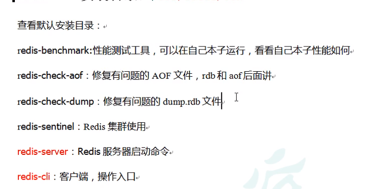

2023年1月30日 17点30分

走一步看一步吧

# Ridis

## 基本使用

### Redis安装

还是那个安装步骤,这里就不再写了

[安装教程](https://www.cnblogs.com/guozhiqiang/p/16882429.html)

安装好后,打开/usr/local/bin
可以看到一些文件,它们的用处:

<!--  -->


> 最重要的就是redis-server和redis-cli

### 启动

1. 前台启动,命令窗口不能关闭,否则服务器停止(不推荐)
   直接执行:

```
redis-server
```

2. 后台启动(推荐)

有些东西还是按自己的来吧

我把原来改过的redis.conf复制一份到了etc下,这算是跟老师一样了
根据配置文件启动redis服务器

```
redis-server /etc/redis.conf
```

查看启动信息

```
ps -ef | grep redis
```

**连接数据库:**

最好带上密码

```
redis-cli -a 010203
```

### 关闭

**千万别直接打个shutdown上去了,那是给服务器直接关机**

但是由于我设置了密码,所以关闭时要:

```
redis-cli -a 010203 shutdown
```

没错,我把密码改成010203了

或者找到进程,kill进程也行

### Redis相关知识

> 默认端口号6379从何而来
> 这个还挺有意思,一个人名:Alessia Merz,而Merz在九键输入法中的位置就是6379

> Alessia Merz 是一位意大利舞女、女演员。 Redis 作者 Antirez 早年看电视节目，觉得 Merz 在节目中的一些话愚蠢可笑，Antirez 喜欢造“梗”用于平时和朋友们交流，于是造了一个词 “MERZ”，形容愚蠢，与 “stupid” 含义相同。
> 后来 Antirez 重新定义了 “MERZ” ，形容”具有很高的技术价值，包含技艺、耐心和劳动，但仍然保持简单本质“。
> 到了给 Redis 选择一个数字作为默认端口号时，Antirez 没有多想，把 “MERZ” 在手机键盘上对应的数字 6379 拿来用了。

1. 默认16个数据库,类似数组下标从0开始,初识默认使用0号库
2. 使用命令 ``select [index]``来切换数据库,如select 1
3. 统一密码管理,所有库同样的密码

**Redis是单线程+多路IO复用技术**

## 常用五大数据类型

先肯定是建立连接嘛
要牢记于心: cd usr/local/bin
然后redis-cli -a 010203

### Redis键(key)


> **一个很简单的命令,就代表获取所有的key**

```
keys *
```

> **判断键是否存在,存在返回1,不存在返回0**

```
exists key
```

> **查看你的key存储的值是什么类型**

```
type key
```

> **删除指定的数据,成功返回1,否则返回0**

```
del key
unlink key  // 选择非阻塞删除,仅将key从keyspace元数据中删除,真正的删除会在后续异步操作
```

> **设置和查看key过期时间**

```
expire key 10 // 10s过期
ttl key       // 查看还有多长时间过期,-1表示永不过期,-2表示已过期
```

> **其他命令**

```
select      // 命令切换数据库
dbsize      // 查看当前数据库的key的数量
flushdb     // 清空当前库
flushall    // 通杀全部库
```

### 字符串(String)

String是Redis最基本的类型

String类型是二进制安全的,意味着Redis的string可以包含任何数据(包含jpg图片或者序列化的对象)

> **set和get**

```
set key value
get key
```

注意:如果重复设置,会对之前的数据进行覆盖

> **append**

```
append key addValue
```

会将addValue追加到原本value的后面

> **strlen key**
> 获取key对应value的长度

> **setnx key value**
> 只有在key不存在时,才能设置,如果key存在,会返回0,表示失败

> **让key中存储的数字值增/减1**

```
incr key // 只能对数字值操作,如果为空,新增值为1
decr key // 只能对数字值操作,如果为空,新增值为-1
```

> **让key中存储的数字值增/减-自定义的步长**

```
incrby/decrby key 步长
```

> java中的i++是否是原子操作(不是)
> i=0;两个线程分别对i进行++100次,值是多少(2-200不固定)

```
第7讲i++不是原子操作
i++分为取值 ， ++ ，赋值操作
极端情况：b抢到线权，开始取值取到0，还没开始++时a抢到了线权，i取值为0，一直加到99；
b又抢回线权，开始++操作，i从0加到1。a中i=99就相当于被覆盖了，此时a只能再加1次了，b还能加99次。
a抢回线权，取值为1，还没开始++时，又被b抢到线权，i一直加到100结束，a抢回线权，i+1=2，再赋值操作。
ab都各自加了100次，最后i就是2。问题出在i++分为三步，取值，++，赋值。a取值后，还没开始++之前，是可以被另一线程b打断的，即使a后面抢回线权，它也不会再取值，会继续执行++操作。
```

> **mset和mget以及msetnx**

```
mset key1 value1 key2 value2 ...
mget key1 key2 ...
msetnx key1 value1 key2 value2 ... // 同时设置一个或多个key-value,当且仅当所有给定key都不存在才可以
```

> **getrange/setrange**

```
getrange key 起始位置 结束位置 // 获取值的范围,类似java中的substring,前包后包
setrange key 起始位置 value   // 用value 覆写key所存储的字符串值,从起始位置开始(索引从0开始)
```

> **setex key 过期时间 value**
> 设置键值对的同时,设置过期时间,单位秒

> **getset key value**
> 以新换旧,设置了新值同时获得旧值

命令好几把多啊,这才一个类型,就这么多

### 列表(List)

**单键多值**
Redis列表是简单的字符串列表,按照插入顺序排序,你可以添加一个元素到列表的**头部**(左边)或者**尾部**(右边)
它的底层实际上是个**双向链表**,对两端的操作性能很高,通过索引下标的操作中间的节点性能会比较差

---

常用命令:

- **lpush/rpush key value1 value2 value3...,从左边/右边插入一个或多个值**
  - 放的特点就是会挤走前面的值
- **lpop/rpop key, 从左边/右边吐出一个值,值在键在,值亡键亡**
- **rpoplpush k1 k2 从k1列表右边吐出一个值,插入到k2左边**
- **lrange key start stop,获取全部数据,就用lrange key 0 -1**
- **lindex key index,按照索引下标获得元素(从左到右)**
- llen key 获取列表长度
- linsert key before/after value newvalue 在value的左边或者右边插入newvalue
  - 
- lrem key n value 从左边删除n个value(从左到右)
- lset key index value 将列表key下表为index的值替换成value

### 集合(Set)

set对外提供的功能与list类似,特殊之处在于set是可以自动排重的,当你需要存储一个列表数据,又不希望出现重复数据时,set是一个很好的选择,并且set提供了判断某个成员是否在一个set集合内的重要接口,这个也是list所不能提供的

set师string类型的无序集合,它底层其实是一个value为null的hash表,所以添加,删除,查找复杂度都是O(1)

一个算法,随着数据的增加,执行时间的长短,如果是O(1),数据增加,**查找数据时间不变**

---

常用命令:

- 单集合操作
  1. ``sadd key value1 value2 value3``将一个或多个member元素加入到集合key中,已经存在的member元素将被忽略
  2. ``smembers key``取出该集合的所有值
  3. ``sismember key value``判断集合key是否含有该value值,有1,无0
  4. ``scard key``,返回该集合的元素个数
  5. ``srem key value1 value2``删除集合中的元素
  6. ``spop key``随机从该集合中吐出一个值
  7. ``srandmember key n``随机从该集合中取出n个值,但不是删除
- 多集合操作
  1. ``smove source destination value``把集合中一个值从一个集合移动到另一个
  2. ``sinter key1 key2``取两个集合的交集
  3. ``sunion key1 key2``取两个集合的并集
  4. ``sdiff key1 key2``返回两个集合的差集(key1中有的,但是不包含在key2中)

---

底层是hash结构,所有的value都指向同一个内部值

### 哈希(Hash)

Redis hash是一个键值对集合,是一个string类型的field和value的映射表,hash特别适合用于存储对象


---

常用命令:

1. ``hset key field value``给key集合中的fild键赋值value
2. ``hget key field``从key集合的field取出value
   - 
3. `hmset key1 field1 value1 key2 field2 value2..`批量设置hash的值
4. `hexists key1 field`查看哈希表key中,给定域field是否存在
5. `hkeys key`列出该hash集合的所有field
6. `hvals key`列出该hash集合的所有value
7. `hincrby key field increment`为哈希表key中的域field的值加上增量1 -1
8. `hsetnx key field value`将哈希表key中的域field的值设置为value,当且仅当域field不存在

---

### 有序集合(Zset)

zset和set非常相似,是一个**没有重复元素**的字符串集合
不同之处师有序集合的每个成员都关联了一个**评分(score)**,这个评分,被用来按照从最低分到最高分的方式排序集合中的成员,

**集合的成员是唯一的,但是评分是可以重复的**

因为元素是有序的,所以你也可以很快的根据评分(score)或者次序(position)来获取一个范围的元素

访问有序集合的中间元素也是非常快的,因此你能够使用有序集合作为一个没有重复成员的**智能列表**

---

常用指令

1. `zadd key score1 value1 score2 value2`将一个或多个member元素及其score值加入到有序集key当中
2. `zrange key start end (withscores)`返回有序集key中,下标在start和end之间的元素(0,-1即可获取全部元素),加上withscores就可以同时输出该value对应的score
3. `zrangebyscore key min max (withscores) (limit offset count)`返回有序集key中,所有score值介于min和max之间(包含等于min或max)的成员,有序集成员按score值递增(从小到大)排列
4. `zrevrangebyscore key max min (withscores) (limit offset count)`同上,改为从大到小排列
5. `zincrby key increment value`为元素的score加上增量
   - ``zincrby topn 50 java``
6. `zrem key value`删除该集合下,分数区间内的元素个数
7. `zcount key min max`统计该集合,分数区间内的元素个数
8. `zrank key value`返回该值(value)在集合中的排名,从0开始

---

> **案例:如何利用zset实现一个文章访问量的排行榜**
> 这也不算是案例吧
> 

底层数据结构:
一方面等价于Map\<String,Double\>,另一方面又类似于TreeSet

## 配置文件

直接把配置文件下载到本机上了 `redis.conf`

> **bind**

在NETWORK里面找到bind
默认情况下bind=127.0.0.1,只能接受本机的访问请求
这也就是为什么不把这一行给注掉,是不能远程连接的

> **protected-mode**

下面有一个 `protected-mode`,默认是yes,表示保护模式,打开的话,就只能通过本机访问,不能进行远程连接,所以要开启远程连接,要把这一项设置成no

```
protected-mode no
```

> **tcp-backlog**

设置tcp的backlog,backlog其实是一个连接队列,backlog队列总和=未完成三次握手队列+已经完成三次握手队列
在高并发环境下你需要一个高backlog值来避免客户端连接问题

> **timeout**

0表示永不超时,表示不会过期(长时间不操作)

> **tcp-keepalive**

每隔一定时间检查连接

> **daemonize**

允许后台启动

## Redis的发布和订阅

Redis发布订阅(pub/sub)是一种消息通信模式,发送者(pub)发送消息,订阅者(sub)接收消息

Redis客户端可以订阅任意数量的频道

### 发布订阅命令行实现

订阅消息:

```r
SUBSCRIBE channel1
```

发布消息

```r
publish channel1 hello
```

这样,订阅消息的客户端就可以接收到发布消息客户端发送的消息
订阅:

发布:


## Redis6新的数据类型

### Bitmaps

Redis提供了Bitmaps这个*数据类型*,可以实现对位的操作

1. Bitmaps本身不是一种数据类型,实际上它就是字符串(key-value),但是它可以对字符串的位进行操作
2. Bitmaps单独提供了一套命令,所以在Redis中使用Bitmaps和使用字符串的方式不太相同,可以把Bitmaps想象成一个以位为单位的数组,数组的每个单元只能存储0/1,数组的下标在Bitmaps中叫偏移量


指令

> **setbit**

```
setbit key 偏移量 value
```

注意:很多应用id以一个指定数字(例如10000)开头,直接将用户id和Bitmaps的偏移量对应势必会造成一定的浪费,通常的做法是每次做setbit操作时将用户id减去这个指定数字

在第一次初始化Bitmaps时,加入偏移量非常大,那么整个初始化过程执行会比较慢,可能会造成Redis的阻塞

> **getbit**

获取键的第offset位的值(从0开始算)

```
getbit key offset
```

> **bitcount**

获取为1的个数

> **bitop and(or/not/xor) destkey \[key...\]**

bitop是一个复合操作,它可以做多个Bitmaps的and(交集),or(并集),not(非),xor(异或)操作并将结果保存在destkey中

```
2020-11-04 日访问网站的userid=1,2,5,9。
setbit unique:users:20201104 1 1
setbit unique:users:20201104 2 1
setbit unique:users:20201104 5 1
setbit unique:users:20201104 9 1


2020-11-03 日访问网站的userid=0,1,4,9。
setbit unique:users:20201103 0 1
setbit unique:users:20201103 1 1
setbit unique:users:20201103 4 1
setbit unique:users:20201103 9 1

计算出两天都访问过网站的用户数量
bitop and unique:users:and:20201104_03 unique:users:20201103 unique:users:20201104
```

Bitmaps与set对比会节省很多的内存量,但并不是万金油,用户量少时还是用set比较好

### HyperLogLog

这名字好几把奇怪

**计算基数(不重复的数据)**

---

命令

> **pfadd key element \[elements\]**添加指定元素到HyperLogLog中


> **pfcount key**计算个数

> **pfmerge newkey** \[oldkeys\]合并多个


---

### Geospatial

地理位置信息

实例:

```r
// 添加
geoadd china:city 121.47 31.23 shanghai
geoadd china:city 106.50 29.53 chongqing 114.05 22.52 shenzhen 116.38 39.90 beijing

// 获取
geopos china:city shanghai

// 获取两个位置之间的直线距离
geodist key member1 member2 [k|km|ft|mi]
// 如:
127.0.0.1:6379> geodist china:city shanghai beijing km
"1068.1535"

// 以给定的经纬度为中心,找出某一半径内的元素
georadius key longitude latitude radius m|km|ft|mi
```

注意:两极无法直接添加,一般会下载城市数据,直接通过Java程序一次性导入
有效的经度从-180度到180度,有效的纬度从-85.05112878度到85.05112878度

当坐标位置超出指定范围时,该命令将返回一个错误
已经添加的数据,是无法再次往里面添加的

抛一个问题,这个东西真的有用吗?或者说,真的会用到吗

## Jedis操作Redis6

终于到了Java操作Redis了

### 基本使用

1. 引入依赖

```xml
        <dependency>
            <groupId>redis.clients</groupId>
            <artifactId>jedis</artifactId>
            <version>3.2.0</version>
        </dependency>
```

2. 进行测试
   如果没有密码,不需要jedis.auth

```java
    public static void main(String[] args) {
        //    创建Jedis对象
        Jedis jedis = new Jedis("1.14.102.11", 6379);

        // 因为设置了密码，所以要有这个配置
        jedis.auth("010203");
        //    测试
        String value = jedis.ping();
        System.out.println(value);
    }
```

### Jedis常用操作

> **操作Stirng**

```java
    //    操作String
    @Test
    public void demo1() {
        //    创建Jedis对象
        Jedis jedis = new Jedis("1.14.102.11", 6379);
        jedis.auth("010203");

        // 添加数据
        jedis.set("name", "lucy");

        // 获取
        String name = jedis.get("name");
        System.out.println(name);

        Long ttl = jedis.ttl("name");
        System.out.println("ttl:" + ttl);

        // 设置多个key-value
        jedis.mset("k1", "v1", "k2", "v2");
        List<String> mget = jedis.mget("k1", "k2");
        mget.forEach(System.out::println);

        System.out.println("===");


        // 相当于 keys *
        Set<String> keys = jedis.keys("*");
        for (String key : keys) {
            System.out.println(key);
        }
    }
```

> **操作List**

```java
    // 操作List
    @Test
    public void demo2() {
        //    创建Jedis对象
        Jedis jedis = new Jedis("1.14.102.11", 6379);
        jedis.auth("010203");

        jedis.lpush("key1","value1","value2","value3");
        List<String> values = jedis.lrange("key1", 0, -1);
        values.forEach(System.out::println);
    }
```

> **操作Set**

```java
    //  操作Set
    @Test
    public void demo3() {
        //    创建Jedis对象
        Jedis jedis = new Jedis("1.14.102.11", 6379);
        jedis.auth("010203");

        jedis.sadd("SetName","lucy","jack");
        Set<String> names = jedis.smembers("SetName");
        names.forEach(System.out::println);
  
    }
```

> **操作Hash**

```java
    //  操作Set
    @Test
    public void demo4() {
        //    创建Jedis对象
        Jedis jedis = new Jedis("1.14.102.11", 6379);
        jedis.auth("010203");

        jedis.hset("users","age","20");
        String hget = jedis.hget("users", "age");
        System.out.println(hget);
  
    }
```

> **操作zset**

```java
   //  操作ZSet
    @Test
    public void demo5() {
        //    创建Jedis对象
        Jedis jedis = new Jedis("1.14.102.11", 6379);
        jedis.auth("010203");

        jedis.zadd("china",100d,"shanghai");

        Set<String> china = jedis.zrange("china", 0, -1);
        System.out.println(china);

    }
```

---

> **Jedis案例-模拟验证码发送**

要求:

1. 输入手机号,点击发送后随机生成6位数字码,2分钟有效
2. 输入验证码,点击验证,返回成功或失败
3. 每个手机号每天只能输入3次

*洗完了脸,背完了单词,嗯*

> **PhoneCode.java**

```java
package com.zzmr.jedis;

import redis.clients.jedis.Jedis;

import java.util.Random;

public class PhoneCode {

    public static void main(String[] args) {
        //     模拟验证码发送
        verifyCode("17513571210");
        //getRedisCode("17513571210","572885");
    }

    // 3. 验证码校验
    public static void getRedisCode(String phone, String code) {
        //    从redis中获取验证码
        Jedis jedis = new Jedis("1.14.102.11", 6379);
        jedis.auth("010203");

        String codeKey = "VerifyCode" + phone + ":code";
        String redisCode = jedis.get(codeKey);

        //    判断
        if (code.equals(redisCode)) {
            System.out.println("成功");
        } else {
            System.out.println("失败");
        }
        jedis.close();
    }

    // 2. 每个手机每天只能发送三次,验证码放到redis中，设置过期时间
    public static void verifyCode(String phone) {
        // 连接redis
        Jedis jedis = new Jedis("1.14.102.11", 6379);
        jedis.auth("010203");

        // 拼接key
        // 手机发送次数key
        String countKey = "VerifyCode" + phone + ":count"; // VerifyCode17513571210:count
        // 验证码key
        String codeKey = "VerifyCode" + phone + ":code"; // VerifyCode17513571210:code

        //TODO 每个手机每天只能发送三次
        String count = jedis.get(countKey);
        if (count == null) {
            //    没有发送次数，第一次发送
            //     设置发送次数是1
            jedis.setex(countKey, 24 * 60 * 60, "1");
        } else if (Integer.parseInt(count) <= 2) {
            //     发送次数+1
            jedis.incr(countKey);

        } else if (Integer.parseInt(count) == 3) {
            //    已经发送三次，不能再次发送了
            System.out.println("发送次数超过3次");
            jedis.close();
            return;
        }

        //    发送的验证码要放到redis里面
        String vcode = getCode();
        jedis.setex(codeKey, 120, vcode);

        jedis.close();
    }

    // 1. 生成6位验证码
    public static String getCode() {
        Random random = new Random();
        StringBuilder code = new StringBuilder();
        for (int i = 0; i < 6; i++) {
            int rand = random.nextInt(10);
            code.append(rand);
        }
        return code.toString();
    }

}
```

### SpringBoot整合Redis

我感觉这个还是挺重要的吧,之前学SpringBoot的时候就没学这块...

创建项目,引入依赖:
**这个版本是有仲裁的,不用再写版本**

```xml
        <!--        spring2集成redis所需要common-poll2 -->
        <dependency>
            <groupId>org.apache.commons</groupId>
            <artifactId>commons-pool2</artifactId>
        </dependency>

        <dependency>
            <groupId>org.springframework.boot</groupId>
            <artifactId>spring-boot-starter-test</artifactId>
            <scope>test</scope>
        </dependency>
```

配置项:

```properties
#Redis服务器地址
spring.redis.host=1.14.102.11
#Redis服务器连接端口
spring.redis.port=6379
#Redis数据库索引（默认为0）
spring.redis.database=0
spring.redis.password="010203"
#连接超时时间（毫秒）
spring.redis.timeout=1800000
#连接池最大连接数（使用负值表示没有限制）
spring.redis.lettuce.pool.max-active=20
#最大阻塞等待时间(负数表示没限制)
spring.redis.lettuce.pool.max-wait=-1
#连接池中的最大空闲连接
spring.redis.lettuce.pool.max-idle=5
#连接池中的最小空闲连接
spring.redis.lettuce.pool.min-idle=0
```

> **yml版**

```yml
spring:
  redis:
    host: 1.14.102.11         # 服务器地址
    port: 6379                # 端口号
    database: 0               # 默认使用的数据库(0)
    password: "010203"        # 密码，有的话就要设置
    connect-timeout: 1800000  # 连接超时时间
    lettuce:
      pool:
        max-active: 20        # 连接池最大连接数(使用负值表示没有限制)
        max-idle: 5           # 连接池最大空闲连接
        max-wait: -1          # 最大阻塞等待时间(使用负值表示没有限制)
        min-idle: 0           # 最小空闲连接
```

> **RedisConfig.java**

```java
package com.zzmr.redis_springboot.config;

import com.fasterxml.jackson.annotation.JsonAutoDetect;
import com.fasterxml.jackson.annotation.PropertyAccessor;
import com.fasterxml.jackson.databind.ObjectMapper;
import org.springframework.cache.CacheManager;
import org.springframework.cache.annotation.CachingConfigurerSupport;
import org.springframework.cache.annotation.EnableCaching;
import org.springframework.context.annotation.Bean;
import org.springframework.context.annotation.Configuration;
import org.springframework.data.redis.cache.RedisCacheConfiguration;
import org.springframework.data.redis.cache.RedisCacheManager;
import org.springframework.data.redis.connection.RedisConnectionFactory;
import org.springframework.data.redis.core.RedisTemplate;
import org.springframework.data.redis.serializer.Jackson2JsonRedisSerializer;
import org.springframework.data.redis.serializer.RedisSerializationContext;
import org.springframework.data.redis.serializer.RedisSerializer;
import org.springframework.data.redis.serializer.StringRedisSerializer;

import java.time.Duration;

@EnableCaching
@Configuration
public class RedisConfig extends CachingConfigurerSupport {

    @Bean
    public RedisTemplate<String, Object> redisTemplate(RedisConnectionFactory factory) {
        RedisTemplate<String, Object> template = new RedisTemplate<>();
        RedisSerializer<String> redisSerializer = new StringRedisSerializer();
        Jackson2JsonRedisSerializer jackson2JsonRedisSerializer = new Jackson2JsonRedisSerializer(Object.class);
        ObjectMapper om = new ObjectMapper();
        om.setVisibility(PropertyAccessor.ALL, JsonAutoDetect.Visibility.ANY);
        om.enableDefaultTyping(ObjectMapper.DefaultTyping.NON_FINAL);
        jackson2JsonRedisSerializer.setObjectMapper(om);
        template.setConnectionFactory(factory);
//key序列化方式
        template.setKeySerializer(redisSerializer);
//value序列化
        template.setValueSerializer(jackson2JsonRedisSerializer);
//value hashmap序列化
        template.setHashValueSerializer(jackson2JsonRedisSerializer);
        return template;
    }

    @Bean
    public CacheManager cacheManager(RedisConnectionFactory factory) {
        RedisSerializer<String> redisSerializer = new StringRedisSerializer();
        Jackson2JsonRedisSerializer jackson2JsonRedisSerializer = new Jackson2JsonRedisSerializer(Object.class);
//解决查询缓存转换异常的问题
        ObjectMapper om = new ObjectMapper();
        om.setVisibility(PropertyAccessor.ALL, JsonAutoDetect.Visibility.ANY);
        om.enableDefaultTyping(ObjectMapper.DefaultTyping.NON_FINAL);
        jackson2JsonRedisSerializer.setObjectMapper(om);
// 配置序列化（解决乱码的问题）,过期时间600秒
        RedisCacheConfiguration config = RedisCacheConfiguration.defaultCacheConfig()
                .entryTtl(Duration.ofSeconds(600))
                .serializeKeysWith(RedisSerializationContext.SerializationPair.fromSerializer(redisSerializer))
                .serializeValuesWith(RedisSerializationContext.SerializationPair.fromSerializer(jackson2JsonRedisSerializer))
                .disableCachingNullValues();
        RedisCacheManager cacheManager = RedisCacheManager.builder(factory)
                .cacheDefaults(config)
                .build();
        return cacheManager;
    }
}
```

测试controller:

```java
package com.zzmr.redis_springboot.controller;

import org.springframework.beans.factory.annotation.Autowired;
import org.springframework.data.redis.core.RedisTemplate;
import org.springframework.web.bind.annotation.GetMapping;
import org.springframework.web.bind.annotation.RequestMapping;
import org.springframework.web.bind.annotation.RestController;

@RestController
@RequestMapping("/redisTest")
public class RedisTestController {

    @Autowired
    private RedisTemplate redisTemplate;

    @GetMapping
    public String testRedis() {
        // 设置值到redis中
        redisTemplate.opsForValue().set("name", "灼灼某人");
        // 从redis获取值
        String name = (String) redisTemplate.opsForValue().get("name");
        return name;
    }

}
```

## Redis6的事务操作

> Redis事务是一个单独的隔离操作:事务中的所有命令都会序列化,按顺序地执行,事务在执行的过程中,不会被其他客户端发送来的命令请求所打断
> Redis事务的主要作用就是**串联多个命令**防止别的命令插队

### 命令

Multi,Exec,discard
从输入Multi命令开始,输入的命令都会依次进入命令队列中,**但不会执行,**直到输入Exec后,Redis会将之前的命令队列中的命令依次执行
组队过程中可以通过discard来放弃组队

**入队执行**


**使用discard**


### 事务的错误处理

两种情况

1. 组队中某个命令出现了错误,执行时整个队列都会被取消
   
2. 如果执行阶段某个命令报出了错误,则只有报错的命令不会被执行,而其他的命令都会执行,不会回滚
   

### 事务冲突-悲观锁和乐观锁

> **悲观锁**

就是很悲观,每次去拿数据的时候都认为别人会修改,所以每次在拿数据的时候都会上锁,这样别人想拿这个数据就会block知道它拿到锁,传统的关系型数据库就用到了很多这种锁的机制

> **乐观锁**

就是很乐观,每次去拿数据的时候,都认为别人不会修改,所以不会上锁,但是在更新的时候会判断一下在此期间别人有没有去更新这个数据,可以使用版本号等机制,**乐观锁适用于多读的应用类型,这样可以提高吞吐量,Redis就是利用这种check-and-set机制实现事务的**


> **Watch key [key..]**

在执行multi之前,先执行watch key1 \[key2\] ,可以监视一个(或多个)key,如果在事务执行之前这个(或这些)key被其他命令所改动,那么事务将被打断

1. 首先设置一个key-value:balance
2. 在两个客户端都设置watch balance
3. 在第一个客户端中开启事务multi,进行incrby balance 10,加 10
4. 在第二个客户端中开启事务multi,进行incrby balance 20
5. 然后在第一个客户端中执行exec,成功
6. 第二个客户端执行exec,返回(nil)失败(因为第二个客户端拿到的balance的版本和最新的balance版本不一致,所以失败)

这就是Redis的乐观锁

### Redis事务三特性

1. 单独的隔离操作
   - 事务中的所有命令都会序列化,按顺序地执行,事务在执行的过程中,不会被其他客户端发送来的命令请求所打断
2. 没有隔离级别的概念
   - 队列中的命令没有提交之前都不会实际被执行,因为事务提交前任何指令都不会被实际执行
3. 不保证原子性
   - 事务中如果有一条命令执行失败,其后的命令仍然会被执行,没有回滚

### 秒杀案例

竟然还是用jsp实现的
不过毕竟只是演示一下
也不能要求太高

#### 秒杀并发模拟

使用工具ab模拟测试
CentOS7需要手动安装

执行命令:

```
    yum install httpd-tools
```

通过浏览器测试:

```
    ab -n 1000 -c 100 -p ~/postfile -T application/x-www-form-urlencoded 
    http://192.168.123.142:8080/Seckill/doseckill
```

**搞不好**

还是访问超时
害
这个防火墙真是搞人心态

这个秒杀案例,就放着吧

直接看持久化了

## Redis6持久化

### RDB

持久化:**在指定的时间间隔内将内存中的数据集快照写入磁盘**

Redis会单独创建(fork)一个子进程来进行持久化,会先将数据写入到一个临时文件中,待持久化过程都结束了,再用这个临时文件替换上次持久化好的文件,整个过程中,主进程是不进行任何IO操作的,这就确保了极高的性能,如果需要进行大规模数据的恢复,且对于数据恢复的完整性不是非常敏感,那RDB方式要比AOF方式更加高效,**RDB的缺点是最后一次持久化后的数据可能丢失**

fork过程:
    

在Linux程序中,fork()会产生一个和父进程完全相同的子进程,但子进程在此后都会exec系统调用,出于效率考虑,Linux中引入了"写时复制技术"

#### RDB持久化过程

打开配置文件
dbfilename 就是持久化生成的文件名称

```
# The filename where to dump the DB
dbfilename dump.rdb  
```

> **Save**

格式:save 秒钟 写操作次数
RDB是整个内存的压缩过的Snapshot,RDB的数据结构,可以配置复合的快照触发条件

关于save和bgsave

- save时只管保存,其他不管,全部阻塞,手动保存,不建议
- bgsave:Redis会在后台异步进行快照操作,快照同时还可以响应客户端请求
  可以通过lastsave命令获取最后一次成功执行快照的时间

---

开始测试:

1. 更改配置文件:

```
save 20 3 # 表示 20s内,有3个key改变,就进行持久化操作
```

2. 打开redis安装的目录:/usr/local/bin,可以看到有一个dump.rdb文件
   
3. 操作redis,设置key

   - 然后就能发现dump.rdb大小发生了改变(但其实没变,我把这个文件删了之后,甚至都没有再生成?怎么回事)
   - 变了变了,只是目录有点小问题,在主目录下的dump.rdb发生了改变....没问题了

那么RDB的优势呢?

- 适合大规模的数据恢复
- 对数据完整性和一致性要求不高更适合使用
- 节省磁盘空间
- 恢复速度块

劣势如下:

- Fork的时候,内存中的数据被克隆了一份,大致2倍的膨胀性需要考虑
- 虽然Redis在fork时使用了写时复制技术,但是如果数据庞大时还是比较消耗性能
- 在备份周期一定间隔时间做一次备份,所以如果Redis意外down掉的话,就会丢失最后一次快照后的所有更改

---

> **rdb的备份**

**难道以后也是手动备份手动恢复吗**

学到新命令:
将sourcefile文件复制一份,名为newfile

```
cp sourcefile newfile
```

将sourcefile改名为newname

```
mv sourcefile newname
```

手动备份,就是把redis持久化的dump.rdb文件复制一份,改个名字
手动恢复,就是把名字改回来

### AOF

AOF是什么?
以日志形式来记录每个写操作(增量保存),将redis执行过的所有写指令记录下来(读操作不记录),只许追加文件但不可以改写文件,redis启动之初会读取改文件重新构建数据,换言之,redis重启的话就根据日志文件的内容将写指令从前到后执行一次以完成数据的恢复工作

> **持久化流程**

- 客户端的请求写命令会被append追加到AOF缓冲区内
- AOF缓冲区根据AOF持久化策略[always,everysec,no]将操作sync同步到磁盘的AOF文件中
- AOF文件大小超过重写策略或手动重写时,会对AOF文件rewrite重写,压缩AOF文件容量
- Redis服务重启时,会重新load加载AOF文件中的写操作达到数据恢复的目的

#### 基本使用

AOF默认不开启
可以在redis.conf中更改文件名称,默认为appendonly.aof
AOF文件的保存路径,同RDB的路径一致

1. 在redis.conf中:

   ```
   appendonly yes
   ```

   **然后呢,重启redis服务,你会发现,之前的数据都没了,是因为redis开启了aof又开启了rdb时,redis就不会使用rdb了,默认取aof的数据(数据不会存在丢失的情况)**
2. 然后就是把appendonly.aof备份,恢复的话就是把名字改为原来的名字就行了

> **异常恢复**

- 如遇到AOF文件损坏,通过/usr/local/bin/redis-check-aof--fix appendonly.aof进行恢复
- 备份被写坏的aof文件
- 恢复,重启redis,然后重新加载

打开appendonly.aof,文件里面是这样的:

```
*2
$6
SELECT
$1
0
*3
$3
set
$2
k1
$2
v1
*1
$7
flushdb
*3
$3
set
$3
k11
$3
v11
*3
$3
set
$3
k12
$3
v12
*3
$3
set
$3
k13
$3
v13
*3
$3
set
$3
k14
$3
v14
```

可以看出,文件有一定的格式,这时在最后面加上一个Hello
文件损坏,此时重启redis服务,会发现连接不上了

执行 ``redis-check-aof --fix ~/appendonly.aof``,这里注意,\~表示的意思是root目录,主目录也就是用户目录,而我们的用户就是root,所以就是\~
可得到:
    

> **AOF同步频率设置**

- appendfsync always 始终同步,每次Redis的写入都会立刻记入日志,性能较差但数据完整性比较好
- appendfsync everysec 每秒同步,每秒记入日志一次,如果宕机,本秒的数据可能丢失
- appendfsync no redis不主动进行同步,把同步时机交给操作系统

> **Rewrite压缩**

1. 是什么?
   - AOF采用文件追加方式,文件会越来越大,为避免出现这种情况,新增了重写机制,当AOF文件的大小超过所设定的值时,Redis就会启动AOF文件的内容压缩,只保留可以恢复数据的最小指令集,可以使用命令bgrewriteaof
2. 重写原理,如何实现重写
   - AOF文件持续增长而过大时,会fork出一条新进程来将文件重写(也是先写临时文件最后再rename),redis4.0版本后的重写,是指就是把rdb的快照,以二进制的形式附在新的aof头部,作为已有的历史数据,替换掉原来的流水账操作

---

AOF的优点

- 备份机制更稳健,丢失数据概率更低
- 可读的日志文本,通过操作AOF稳健,可以处理误操作

劣势

- 比起RDB占用更多的磁盘空间
- 恢复备份速度要慢
- 每次读写都同步的话,有一定的性能压力
- 存在个别bug,造成不能恢复

### 总结

官方推荐两个都启用
如果对数据不敏感,可以选单独用RDB
不建议单独用AOF,因为可能会出现Bug
如果只是做纯内存缓存,可以都不用

官方还建议,用save 900 1就行了,所以我改回来了

## Redis主从复制

主从复制是什么?
主机数据更新后根据配置和策略,自动同步到备用机的master/slaver机制,Master以写为主,Slaver以读为主


> **主从复制的特点**

1. 读写分离,主机写,从机读
2. 容灾快速恢复
3. 一主多从

### 搭建一主多从

一主两从

1. 在根目录下创建/myredis文件夹
2. 复制redis.conf配置文件到/myredis文件夹中
3. 配置一主两从,创建三个配置文件
   - redis6379.conf
   - redis6380.conf
   - redis6381.conf
4. 关闭AOF
5. 在三个配置文件中写入内容

在/myredis/redis63xx.conf中配置:

```
include /myredis/redis.conf
pidfile /var/run/redis_63xx.pid
port 63xx
dbfilename dump63xx.rdb
```

然后启动三台服务器


然后查看进程,`ps-ef | grep redis`


目前,三台服务器已经启动,但是三台是相互独立的

在myredis文件夹中连接服务器,因为设置了密码,所以还是要加入-a命令
`redis-cli -p 63xx -a 010203`

连接上服务器之后,执行 `info replication`


可以看出,默认启动,都是主机:`role:master`

> **配置**
> 配从(库)不配主(库)

让6379作为主机,其余两个作为从机

1. 在6380和6381上执行 `slaveof 127.0.0.1 6379`
   

> **然后就发现了bug哈哈哈哈,因为主机设置了密码,所以从机连接时,主机master会要求密码验证,所以要在从机的配置文件中加上 `masterauth password`**

然后重启从机的redis,再进行slaveof
即可配置成功


那这么配置,还算挺方便的,只需要配置好多台服务器,然后在从机上执行slaveof即可

### 测试

现在就可以实现读写分离了,在主机(6379)中可以进行写操作,从机中可以获取主机写入的数据,但是**从机不能写数据,写的话会报错:`READONLY You can't write against a read only replica`**
    

### 三种方法

#### 主从复制原理

1. 从连接上主服务器之后,从服务器向主服务器发送进行数据同步的消息
2. 主服务器接收到请求后,**把主服务器数据进行持久化,得到rdb文件,把rdb文件发送给从服务器**,从服务器拿到rdb文件,然后进行读取
3. 每次主服务器进行写操作之后,和从服务器进行数据同步

> **两种复制方式**

- 全量复制:从服务器执行完slaveof后,会接收到主服务器发送的rdb文件,将其解析
- 增量复制:主服务器进行写操作后,会将新的数据发送给slave(从服务器),完成同步

三种方法解决从机意外宕机的问题

#### 一主二从

让shutdown6380服务器,然后查看6379的从服务器个数
会发现已经变成1个了
在6379中新加入几个key,此时6381是能同步的
再打开6380,会发现,该服务器**变成了主服务器master**
再重新slaveof,查看 `keys *`
可以看出,数据和主服务器中是一样的,说明从服务器会将主服务器的所有数据从头到尾复制过来

当主服务器挂掉,从服务器扔是从服务器
主服务器再开启,仍有和从服务器之间的关系

#### 薪火相传

更改配置,6379仍是主服务器,但是将6380slaveof6381,形成主(6379)-从(6381)-从(6380)形式

如果6381挂掉了,那么6379就不能和6380进行同步了

但是6381作为6380的主服务器,在重启之后,仍可以与6380进行同步,但是和6379就失去了联系,这个过程和一主二仆是相似的

还有一点,**虽然6381作为6380的主服务器,但是它实质上仍是从服务器,所以还是只能进行读操作,写操作仍不能使用**


#### 反客为主

当一个master宕机后,后面的slave可以立刻升为master,其后面的slave不用做任何修改

这个还挺有意思

命令:`slaveof no one`
就可以把从机变成主机,**但是这种是手动完成的**

### 哨兵模式

哨兵模式-sentinel

反客为主的自动版,**能够后台监控主机是否故障,如果故障了根据投票数自动将从库转换为主库**

#### 使用步骤

1. 先将服务器改成一主二仆的形式
   - 6379(主)下有两个仆(6380和6381)
2. 自定义的/myredis目录下新建sentinel.conf文件,文件名必须是这个
   - 配置内容:`sentinel monitor mymaster 127.0.0.1 6379 1`,
   - mymaster相当于给主机起的名字,也是为监控对象起的名字
   - 1为至少有多少个哨兵同意迁移的数量
3. 执行:`redis-sentinel sentinel.conf`
   - 

---

下面都是改Bug

> **又双报错了,看下图,这时上面没截全的,有一行 `failover-state-select-slaave master mymaster`,意思是就算主服务器宕机,每次选举仍然选择挂掉的主服务器,这个错误是因为没有开放哨兵节点的端口**,去服务器防火墙那里放行26379端口应该就行了,还是不行,翻翻评论区,原来是没有设置密码,要在sentinel.conf文件中加入一行 `sentinel auth-pass mymaster password`才行,试试吧,我服了啊,监视错了,监视成12了,日了狗了
> 

好了好了,再次重启服务,就正常了

- 

然后关掉6379,模拟宕机
此时主机就变成了6380


> 也就是,**6381的主机变成了6380,6380也就变成了master**
> 

此时如果再启动6379,**它并不会变成主服务器,而是变成6380的从服务器**

> **复制延迟**

由于所有的写操作都是现在Master上操作,然后同步更新到Slave上,所以从Master同步到Slave机器有一定的延迟,当系统很繁忙时,延迟问题会更加严重,Slave机器数量的增加也会使这个问题更加严重

#### 故障恢复

> **优先级,偏移量,runid**

replica-priority 100,值越小优先级越高

偏移量是指获得原主机数据最全的

每个redis实例启动后都会随机生成一个40位的runid

1. 从下线的主服务的所有从服务里面挑选一个从服务,将其转成主服务,选择条件为:
   1. 选择优先级靠前的
   2. 选择偏移量最大的
   3. 选择runid最小的服务
2. 挑选出新的主服务之后,sentinel向原主服务器的从服务器发送slaveof新主服务的命令,复制新master,说白了就是转让主服务
3. 当已下线的服务器重新上线时,sentinel同其发送slaveof命令,让其成为新主的从

## Redis集群

*快学完了,明天应该就能结束Redis的学习*

### Redis集群介绍

当容量不够时,redis如何进行扩容?
并发写操作,redis如何分摊?
另外,主从模式,薪火相传模式,主机宕机,导致ip地址发生变化,应用程序中配置需要修改对应的主机地址,端口等信息
之前通过代理主机来解决,但是redis3.0中提供了解决方案,就是**去中心化集群**配置

特点是什么?就是多master和多slave

Redis集群实现了对Redis的水平扩容,即启动N个redis节点,将整个数据库分布存储再这N个节点中,每个节点存储总数据的1/N

Redis集群通过分区(partition)来提供一定程度的可用性(availability),即使集群中有一部分节点失效或者无法进行通讯,集群也可以继续处理命令请求

### 搭建集群

**实际开发肯定是多台服务器,多个redis,而现在只能模拟,也就是一台服务器,多个端口**

1. 制作6个实例 `6379,6380,6381,6389,6390,6391`
2. 打开6379配置文件,删除多余部分,只留下最初写的内容
3. 加入redis cluster配置

   - cluster-enabled yes 打开集群模式
   - cluster-config-file nodes-6379.conf 设置节点配置文件
   - cluster-node-timeout 15000 设定节点失联时间,超过该时间(毫秒),集群自动进行主从切换
   - (看完后面新增的)要加上密码,没错,加上`masterauth password 和 requirepass password`,在redis.conf(最原始的那个)里面也要加上masterauth,不然到后面主从替换的时候会无效果
     
4. 启动这6个redis服务
   
5. 将六个节点合成一个集群

   - 需要一个文件
     
   - 在redis安装后的目录,有一个src
   - 在src下执行命令,此处要用真实IP地址,--replicas 1 表示采用最简单的方式配置集群:**一台主机,一台从机,正好三组**

   ```r
   redis-cli --cluster create --cluster-replicas 1 1.14.102.11:6379 1.14.102.11:6380 1.14.102.11:6381 1.14.102.11:6389 1.14.102.11:6390 1.14.102.11:6391 -a 010203
   ```

   - 执行完命令没有响应,应该是端口号没有放行
   - 正常应该是这样的,自动分配好了主从服务器
     
   - 但是输入yes后,显示Waiting for the cluster to join,然后无休止的等待了,百度了一下,发现要放行对应端口号+10000的端口号,比如6379就要放行16379,再试试
   - **问题解决**
     

### 测试

集群的方式连接和之前的普通连接不同,要加上 `-c`,指令如下:

`redis-cli -c -p 6379 -a 010203`

连接上之后,执行 `cluster nodes`
可以看出详细的主从服务器

然后写入数据试试


会发现,自动从6379跳到了6381,话说,为什么跳到6381呢

### 原理

> redis cluster是如何分配这6个节点的?

一个集群至少要有**三个主节点**,选项 `--cluster-replicas 1` 表示我们希望为集群中的每个主节点创建一个从节点,**分配原则尽量保证每个主数据库运行在不同的IP地址上,每个从库和主库不在一个IP地址上**
*但是现在是模拟,没办法整多台服务器*

好了,洗洗睡吧,今天的三体还没有看 `2023年2月2日21点47分`

#### slotes

在集群配置好后,会有一个 `All 16384 slots covered`提示,表示一个Redis集群包含16384个插槽(hash slot),数据库中的每个键都属于这16384个插槽的其中一个

添加时,集群使用公式 `CRC16(key)%16384`来计算键key属于哪个插槽,其中 `CRC16(key)`语句用于计算key的CRC16校验和

详细数据:


可以看出,6379这台主服务器对应的插槽是0-5460
6380对应的是5461-10922
6381对应的是10923-16383

比如说,执行 `set k1 v1`,程序会计算k1的插槽数,对应到哪个范围,就会放到哪个主服务器中

所以插槽,可以说是为了让写入的数据均匀分配的每个服务器上

> **注意问题**
> 如果用mset或者其他一次性插入多条数据的语句,如果插槽对应的位置不是一台服务器,就会报错
> 

那如果就想一次性加入多条呢,就要使用组的形式


> **两个命令**

1. `cluster keyslot key`,可以得到key对应的插槽值
2. `cluster countkeysinslot slotId`得到对应插槽有多少个key,**注意,只能查看本服务器插槽范围内的数据**
   
3. `cluster getkeysinslot slotId count`,得到count个slot插槽中的键

### 故障恢复

主机掉线,从机是否能成为主机?

现在是不能,原因可能是密码问题,百度了一下,建议在每一个配置文件中都加入 `masterauth password 和 requirepass password`
试试吧

替换完成之后,重启所有服务器

重启之后还是不行,现在把原来的redis.conf里面加上了masterauth,因为像后面6台服务器的配置文件redis63xx.conf都是引入了这个服务器的配置文件,我不知道这样行不行,试试看吧

又出问题了,现在主机变成了80,81,91了,这是为什么啊
妈的

???
一脸迷惑
好像又好了,只是我看不懂这个关系了

现在的关系是

```
81主机,宕机了,90是主机,80是主机,91是主机,但是宕机了,89是slave,79是主机
所以现在主机有80,80,79
而slave只有89,另外的81,91都被我shutdown了
```

**好像也算是成功了**
好了,继续看吧

现在再把81和91启动
重启后,slave有81,91,89
master有90,80,79
也就是说,**原来的主机宕机后,再恢复,会变成新主机的从机**

还有特点

- **如果某一短插槽的主从节点全部宕机,而 `cluster-require-full-coverage`为yes,那么,整个集群都挂掉**
- 如果某一段插槽的主从都挂掉,而 `cluster-require-full-coverage`为no,那么,该插槽数据全都不能使用,也无法存储

redis.conf中的参数 `cluster-require-full-coverage`

也正好通过 `info replication`分清楚主从关系
80-89
90-81
79-91


### 集群的Jedis开发

即使连接的不是主机,集群会自动切换主机存储,主机写,从机读
去中心化主从集群,无论从哪台主机写数据,其他主机上都能读到数据

没有用到springboot,这里直接配置算了吧
也没啥用


### Redis集群的优与缺

优点
1. 实现扩容
2. 分摊压力
3. 去中心化配置相对简单

缺点
1. 多键操作是不被支持的
2. 多键的redis事务是不支持的,lua脚本不支持
3. 由于集群方案出现较晚,很多公司已经采用了其他的集群方案,而代理或者客户端分片的方案想要迁移到redis cluster,需要整体迁移而不是逐步过度,复杂度较大

## Redis应用问题解决

### 缓存穿透

#### 问题描述

出现情况:
1. 应用服务器压力变大了
2. redis命中率降低
3. 一直查询数据库

结果:
1. redis查询不到数据库
2. 出现了非正常url访问

#### 解决

1. 对空值缓存
    - 如果一个查询返回的数据为空(不管数据是否存在),我们仍然把这个结果(null)进行缓存,设置很短的空结果的过期时间,最长不超过5分钟
2. 设置可访问的名单(白名单)
    - 使用bitmaps类型定义一个可以访问的名单,名单id作为bitmaps的偏移量,每次访问和bitmaps里面的id进行比较,如果访问id不在bitmaps里面,进行拦截,不允许访问
3. 采用布隆过滤器
    - 1970年布隆提出的,它实际上是一个很长的二进制向量(位图)和一系列随即映射函数(哈希函数)
4. 进行实时监控
    - 当发现redis的命中率开始急速降低,需要排查访问对象和访问数据,和运维人员配合,可以设置黑名单限制服务

### 缓存击穿

#### 问题描述

现象:
1. 数据库访问压力瞬时增加
2. redis里面没有出现大量的key过期
3. redis正常运行状态

原因:
1. redis**某个key过期了**,正好又有大量访问使用这个key

#### 解决

key可能会在某些事件点背超高并发地访问,是一种非常"热点"的数据,这个时候,需要考虑一个问题:**缓存被"击穿"的问题**

解决:
1. 预先设置热门数据:在redis高峰访问之前,把一些热门数据提前存入到redis里面,加大这些热门数据key的时长
2. 实时调整:现场监控哪些数据热门,实时调整key的过期时长
3. 使用锁
    - 就是在缓存失效的时候(判断拿出来的值为空),不是立即去load db
    - 先使用缓存工具的某些带成功操作返回值的操作(比如redis的setnx)
    - 当操作返回成功时,再进行load db的操作,开会设缓存,最后删除mutex key;
    - 当操作返回失败,证明有线程在load db,当前线程睡眠一堆时间再重试整个get缓存的方法

### 缓存雪崩

#### 问题描述

现象
1. 数据库压力变大-服务器崩溃

原因
1. 在极少时间段,查询**大量的key的集中过期**情况

>缓存雪崩和缓存击穿的区别
**雪崩是指大量的key集中过期,而击穿是指某一个key过期,就是key过期数量上的区别**

#### 解决

缓存失效时雪崩效应对底层系统的冲击非常可怕

1. 构架多级缓存架构:nginx缓存+redis缓存+其他缓存(ehcache等)
2. 使用锁或队列
    - 用加锁或者队列的方式保证不会有大量的线程对数据库一次性进行读写,从而避免失效时大量的并发请求落到底层存储系统上,不适用高并发的情况
3. 设置过期标志更新缓存
    - 记录缓存数据是否过期(设置提前量),如果国企会触发通知另外的线程在后台去更新实际key的缓存
4. 将缓存失效时间分散开
    - 比如我们可以在原有的失效时间基础上增加一个随机值,比如1-5分钟随机,这样每一个缓存的过期时间的重复率就会降低,就很难引发集体失效的事件

### 分布式锁

#### 问题描述

>随着业务发展的需要，原单体单机部署的系统被演化成分布式集群系统后，由于分布式系统多线程、多进程并且分布在不同机器上，这将使原单机部署情况下的并发控制锁策略失效，单纯的Java API并不能提供分布式锁的能力。为了解决这个问题就需要一种跨JVM的互斥机制来控制共享资源的访问，这就是分布式锁要解决的问题!


#### 基于redis实现分布式锁

最简单的使用:setnx


上锁的同时设置过期时间

`set users 10 nx ex 12`

这样就实现了redis的分布式锁

#### 使用UUID防止误删

普通方式,模拟setnx..ex..
```java
@GetMapping("testLock")
    public void testLock() {
        //1获取锁，setne
        Boolean lock = redisTemplate.opsForValue().setIfAbsent("lock", "111", 3, TimeUnit.SECONDS);
        //2获取锁成功、查询num的值
        if (lock) {
            Object value = redisTemplate.opsForValue().get("num");
            //2.1判断num为空return
            if (StringUtils.isEmpty(value)) {
                return;
            }
            //2.2有值就转成成int
            int num = Integer.parseInt(value + "");
            //2.3把redis的num加1
            redisTemplate.opsForValue().set("num", ++num);
            //2.4释放锁，del
            redisTemplate.delete("lock");

        } else {
            //3获取锁失败、每隔0.1秒再获取
            try {
                Thread.sleep(100);
                testLock();
            } catch (InterruptedException e) {
                e.printStackTrace();
            }
        }
    }
```


给服务器上装一个vscode吧
自带的编辑器用着属实是难受

他又不讲这个lua怎么写,放进去又有什么用

```java
@GetMapping("testLock")
    public void testLock() {

        String uuid = UUID.randomUUID().toString();

        //1获取锁，setne
        Boolean lock = redisTemplate.opsForValue().setIfAbsent("lock", uuid, 3, TimeUnit.SECONDS);
        //2获取锁成功、查询num的值
        if (lock) {
            Object value = redisTemplate.opsForValue().get("num");
            //2.1判断num为空return
            if (StringUtils.isEmpty(value)) {
                return;
            }
            //2.2有值就转成成int
            int num = Integer.parseInt(value + "");
            //2.3把redis的num加1
            redisTemplate.opsForValue().set("num", ++num);
            //2.4释放锁，del
            String lockUuid = (String) redisTemplate.opsForValue().get("lock");
            if (uuid.equals(lockUuid)) {
                redisTemplate.delete("lock");
            }

        } else {
            //3获取锁失败、每隔0.1秒再获取
            try {
                Thread.sleep(100);
                testLock();
            } catch (InterruptedException e) {
                e.printStackTrace();
            }
        }
    }
```

## Redis6新功能

### ACL

访问控制列表

命令
1. `acl list`展示用户权限列表


default是用户名,on代表启用,off反之,nopass表示无密码,有密码会显示一大串字符,~*表示可操作的key,+@all表示可以进行的操作

2. `acl cat string`获取对key的全部命令


3. 添加用户`acl setuser username`,默认是off,也就是未启用的状态

4. 查看当前用户`acl whoami`
5. 添加用户,并设置用户名,密码,ACL权限,并启用用户`acl setuser username on >password ~cached:* +get`,就表示只能操作带有cached的key,和只能使用get操作

6. 切换用户`auth username password`,验证权限


### IO多线程

Redis执行命令依然是单线程

Redis多线程部分是用来处理网络数据的读写和协议解析,执行命令仍然是单线程的,之所以这么设计是为了不因为多线程而变得复杂,需要控制key,lua,事务,LPUSH/LPOP等等的并发问题

还有,多线程IO默认也是不开启的,需要在配置文件中配置:
`io-threads-do-reads yes`
`io-threads 4`

## 结束了

课程总结来了,有什么好总结的呢,这个图


用了好几天啊,接下来歇着吧,看看书啥的,要开学了,开学要考试呢

2023年2月3日 14点21分

