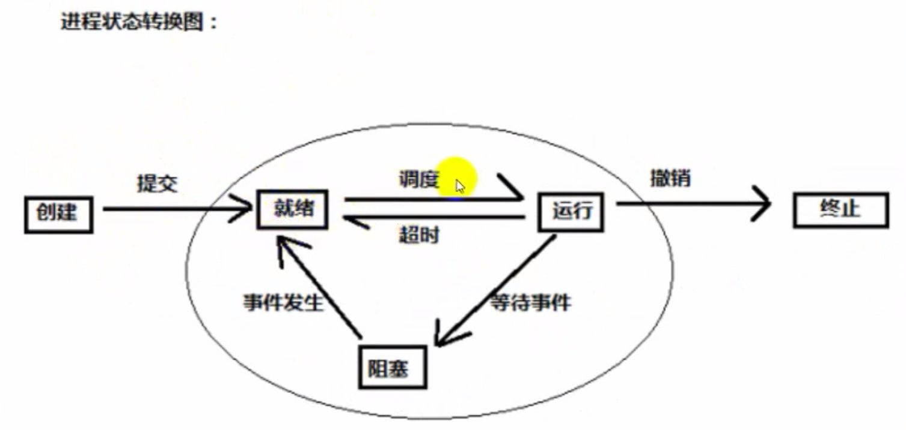
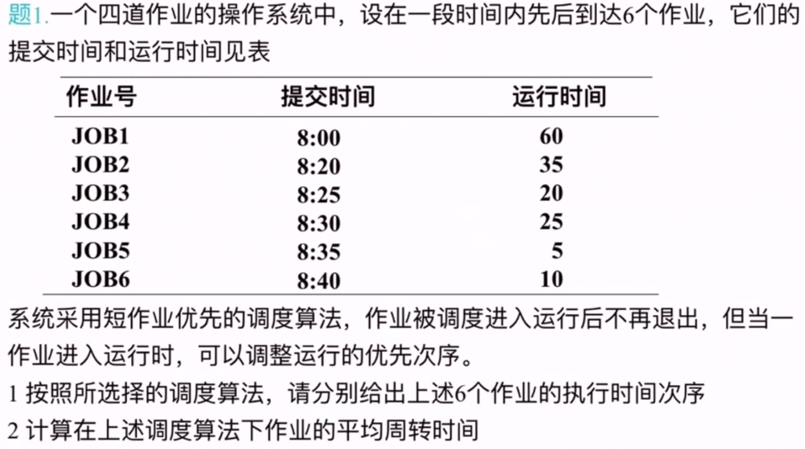
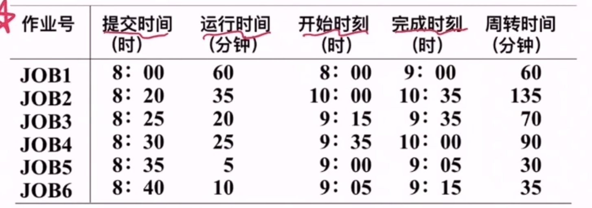
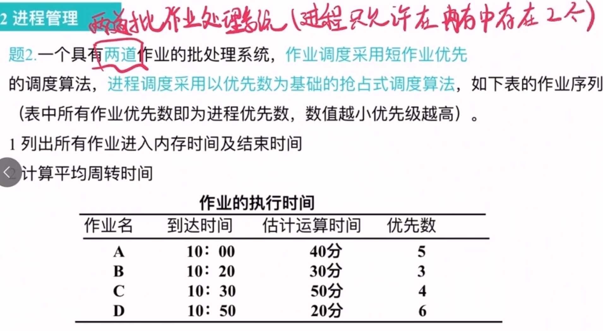
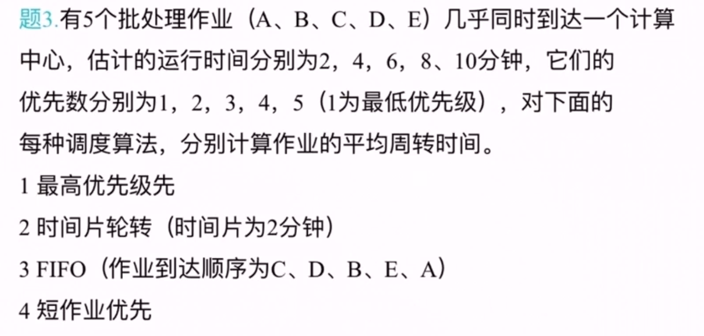

# 操作系统引论

> 基本特征:

1. 并发-是指两个或多个活动在同一给定的时间间隔中进行
2. 共享-是指计算机系统中的资源被多个进程所共用
3. 异步-进程以不可预知的速度向前推进
4. 虚拟-把一个物理上的实体变为若干个逻辑上的对应物
   **最基本特性:并发,共享**(两者互为存在条件)

这里要注意:并行->并发,而并发!=并行
应为并发是**同一时间间隔**,而并行是**同一时刻**

> 主要功能

1. 处理机管理
2. 存储器管理
3. 文件管理
4. 设备管理
   这个后面都会详细的讲

> 发展

1. 手工操作阶段(此阶段无操作系统)  缺点:**人机速度矛盾**
2. 批处理阶段(操作系统开始出现)
   1. 单道批处理阶段
   2. 多道批处理阶段(操作系统正式诞生)
      优点: 多道程序并发执行,资源利用率高
      缺点: 不提供人机交互能力(缺少交互性)
      目的: **提高系统资源的利用率**
3. 分时操作系统(不可插队,有了人机交互)
   - 优点:提供人机交互(交互性)
   - 缺点: 不能优先处理紧急事务
4. 实时操作系统(可以插队)
   - 硬实时系统:必须在被控制对象规定时间内完成
   - 软实时系统:可以松一些
     **优点:能优先处理紧急任务**
     特点: 从**可靠性**看实时操作系统更强,从**交互性**看分时操作系统更强

> 两种指令

1. 特权指令:不允许用户程序使用(只允许操作系统使用) 如IO指令,置中断指令
2. 非特权指令:普通的运算指令

> 两种程序

1. 内核程序:系统的管理者,可执行一切指令,运行在核心态
2. 应用程序:普通用户程序只能执行非特权指令,运行在用户态

> 处理机状态

1. 用户态(目态):CPU只能执行非特权指令
2. 核心态(又称管态,内核态):可以执行所有指令
3. 用户态到核心态:通过中断(是硬件完成的)
4. 核心态到用户态:特权指令psw的标志位0用户态,1核心态,**常考谁在用户态执行,谁在和心态执行**

> 原语

1. 处于操作系统的最低层,是最接近硬件的部分
2. 这些程序的运行具有原子性,其操作只能一气呵成
3. 这些程序的运行时间都比较短,而且调用频繁

> 中断和异常

1. 内中断(异常,信号来自内部)
   - 自愿中断--指令中断
   - 强迫中断
     1. 硬件中断
     2. 软件中断
        这里注意,如果是软件出现问题,就是内中断了,也叫异常
2. 外中断(中断,信号来自外部)
   - 外设请求
   - 人工干预

> 系统调用: **系统给程序员(应用程序)提供的唯一接口,可获得OS的服务,在用户态发生,核心态处理**

> 体系机构

1. 大内核
2. 微内核

# 进程调度

## 进程管理

> 进程管理

- 引入进程目的: 为了更好地描述和控制程序并发执行,实现操作系统的并发性和共享性(进程是动态的,程序是静态的)
- 定义: 进程是计算机中的程序关于某数据集合上的一次运行活动,**是系统进行资源分配和调度的基本单位**
- 组成:
  - PCB: 保存进程运行期间相关的数据,是进程存在的**唯一标识**
  - 程序段: 能被进程调度到CPU的代码
  - 数据段
- 进程的状态
  - 状态种类
    - 创建状态: 进程正在被创建
    - 就绪态: 进程已处于准备运行的状态,即进程获得了除处理机外的一切所需资源,一旦得到处理机即可运行
    - 运行态: 进程正在占用CPU
    - 结束状态: 进程正在从系统消失
    - 阻塞态

> 进程状态转换图
> 

<!--  -->

运行态->阻塞态:进程需要的某一资源还没有准备好
阻塞态->就绪态:进程等待的时间到来时

> 线程
> 引入目的:为了更好地使用多道程序并发执行,**提高资源利用率和系统吞吐量**
> 特点: 是程序执行的最小单位,基本不用有任何系统资源(调度的基本单位)

> 进程和线程的关系
> **进程是资源分配的基本单位，线程是CPU调度和分派的基本单位**
> **线程是进程的一部分，一个线程只能属于一个进程，一个进程可以有多个线程，但至少有一个线程**

---

## 处理机调度

> 概念
> 是对处理机进行分配,即从就绪队列中按照一定的算法(公平,高效)选择一个进程并将处理及分配给它运行,以实现进程并发地执行

> 分类

- 高级调度(作业调度)-次数少
- 中级调度(内存对换)-次数中等
- 低级调度(进程调度)-次数多

> 调度方式

- 剥夺式
- 非剥夺式

> 调度准则

- CPU利用率
- 系统吞吐量: 单位时间内完成的作业数
- 周转时间: 作业的完成时间-作业的提交时间
- 等待时间: 进程等待调度的时间片总和
- 响应时间: 提交->第一次运行

> 算法

- 先来先服务
- 短作业优先
- 优先级调度算法
- 高响应比优先调度算法
  计算方式: (运行时间+等待时间)/等待时间
- 时间片轮转: 一定是剥夺式的
- 多级反馈队列调度算法

> 进程同步

- 引入原因: 协调进程之间的相互制约关系
- 制约关系

  - 同步: 亦称直接制约关系,是指为完成某种任务而建立的两个或多个进程,这些恶进程因为需要在某些位置上协调它们的工作次序而等待,传递信息所产生的制约关系
  - 互斥: 也称间接制约关系,当一个进程进入临界区使用临界资源时,另一个进程必须等待,当占用临界资源的进程退出临界区后,另进程才允许访问此临界资源
- 临界资源: 一次仅允许一个进程使用的资源(打印机,共享缓冲区,共享变量,共用队列)
- 临界区: 在每隔二进程中访问临界资源的**那段程序**
- 临界区互斥

  - 原则
    - 空闲让进: 如果有若干进程要求进入空闲的临界区,一次仅允许一个进程进入
    - 忙则等待: 任何时候,处于临界区内的进程不可多于一个,如果已有进程进入自己的临界区,则其它所有试图进入临界区的进程必须等待
    - 有限等待: 进入临界区的进程要在有限时间内退出,以便其他进程能及时进入自己的临界区
    - 让权等待: 如果进程不能进入自己的临界区,则让出CPU,避免进程出现"忙等"现象
  - 基本方法: 信号量(会考大题-利用PV操作实现互斥)

> 死锁

- 产生的原因: 非剥夺资源的竞争和进程的不恰当推进顺序(与饥饿的区别)
- 定义: 多个进程因竞争资源而造成的一种僵局,如果没有外力,这些进程将无法推进
- 解决方法
  - 预防死锁
    - 破坏互斥条件
    - 破坏不剥夺条件
    - 破坏请求和保持条件
    - 破坏循环等待条件
  - 避免死锁
    - 安全状态
    - **银行家算法**
  - 检测死锁:利用死锁定理
  - 解除死锁
    - 资源剥夺法
    - 撤销进程法
    - 进程回退法

## 第二章习题

> **第一题**



<!--  -->

- 短作业优先:相同时刻提交的作业,运行时间越短的,越先执行
- "作业被调度进入运行后不再退出"-意思是作业是非抢占的-和非剥夺是一个意思?就是JOB1最先提交,经过一个小时,9点结束,而JOB2,3,4,5,6在JOB1运行时间段内已经提交,但是它们都在等待JOB1运行结束,而不能抢占JOB1的执行机会
- 周转时间/平均周转时间

$$
周转时间=完成时间-提交时间
$$

$$
平均周转时间=(n_1+n_2+n_3+\cdots+n_n)/n
$$

n为作业目数,n的每一项是周转时间

解答:

1. 1-5-6-3-4-2,如下图(答案要写成表格样式):
   

<!--  -->

JOB1先提交,执行一个小时,期间JOB2-6都已提交,所以JOB1执行结束后,JOB2-6按照短作业优先的算法来排序

2. 平均周转时间:

$$
平均周转时间=(60+135+70+90+30+35)/6=70分钟
$$

---

> **第二题**



<!--  -->

- 两道批处理-进程只允许在内存中出现两个
- 作业调度:从外存->内存,短作业优先
- 进程调度采用以优先数为基础的抢占式调度算法,该题是优先数越小,优先级越高
- **主要流程:**

解析:

1. 10点A到达,A进入内存,执行到10:20,此时B到达,内存有两道,所以B也进入内存,此时B的优先级要比A的优先级高,所以B抢占了A的CPU,A还剩20分钟结束,开始执行B,到10:30,B执行了10分钟,C到达,而此时内存中有两个作业,C不能进入内存,到10:50,B结束,此时D也到达了,根据作业调度的算法,此时D先进入内存,但由于A的优先级比D高,所以CPU执行A剩下的任务,直到11:10分,A结束,D进入,此时根据进程调度算法,C的优先级高于D,所以C开始执行,执行50分钟,从11:10->12:00,此时D开始执行,从12:00->12:20,D结束
   所以:
   A:10:00进入->11:10结束
   B:10:20进入->10:50结束
   C:11:10进入->12:00结束
   D:10:50进入->12:20结束
2. 完成时间-提交时间(到达时间)

$$
(70+30+90+90)/4 = 70分钟
$$

---

> **第三题**

先看题:


<!--  -->

- 1为最低优先级,所以优先数越大,优先级越高
- 时间片轮转算法-就是给每个任务分配指定的时间,这里是2分钟,A上处理机,执行2分钟,A下处理机,然后B上,以此类推,一直循环,直至执行结束
- FIFO,先到先得,先到先服务

1. 最高优先级先,E的优先级最高,其次是D,C,B,A,所以是E-D-C-B-A
   0时刻E开始执行,10分钟后结束,D开始执行...
   平均周转时间=10+18+24+28+30/5=22分钟
2. 时间片轮转(时间片为2分钟)
   A运行两分钟结束,B运行两轮,在12分钟结束,C运行三轮,在20分钟结束,D运行4轮,在26分钟结束,D运行5轮,在28分钟结束,E运行6轮,在30分钟结束
   2+12+20+26+30/5=18
3. FIFO(C-D-B-E-A)
   先到先执行
   C先到,执行6分钟,然后D开始执行,经过八分钟,在14分时执行结束,然后B开始执行,经过4分钟,在18分钟时B结束,E开始执行,在28分钟时E结束,A开始执行,经过两分钟,30分钟时A结束
   6+14+18+28+30/5=19.2
4. 短作业优先
   2+6+12+20+30/5=14

---

> **第四题**


<!--  -->

临界资源,临界区:

- **临界资源:一次仅允许一个进程使用的资源**
- **临界区:在每个进程中访问临界资源的那段程序**

进程的同步与互斥:

- **同步:同步亦称直接制约关系,是指为完成某种任务而建立的两个或多个进程,这些进程因为需要在某些位置上协调它们的工作次序而等待,传递信息所产生的制约关系**
- **互斥:互斥也称为间接制约关系,当一个进程进入临界区使用临界资源时,另一个进程必须等待,当占用临界资源的进程退出临界区后,另外的进程才允许访问此临界资源**

---

> **第五题**

**信号量(信号量机制是一种有效实现进程同步和互斥的工具)**

1. 信号量的值大于0:表示昂前资源可用数量,小于0,其绝对值表示等待使用该资源的进程个数
2. 信号量初值为负数的整数变量,代表资源数
3. 信号量值可变,但仅能由P,V操作来改变

---

> **第六题**

P/V操作原语

1. P操作原语P(S)
   1. P操作一次,S值减一,即S=S-1(请求分配一资源),*说人话就是,执行一次P操作,就会获取一个资源,此时S会减一*
   2. 如果S>=0,则该进程继续执行;如果S<0,表示无资源,则该进程的状态置为阻塞态,把相应的PCB连入该信号量队列的末尾,并放弃处理机,进行等待(直至另一个进程执行V(S)操作)
2. V操作原语(V(S))
   1. V操作一次,S值加一,即S=S+1(释放一单位量资源)
   2. 如果S>0,表示有资源,则该进程继续执行; 如果S<=0,则释放信号量队列上的第一个PCB所对应的进程(阻塞态改为就绪态),执行V操作的进程继续执行

> **第七题**

生产者消费者问题(金典同步问题)


<!--  -->

- 首先找到题目中的**同步**/**互斥**的关系,那这个题的互斥是什么?-生产者放入消息时,消费者不能取,消费者取消息时,生产者不能放,所以就是**生产者的放和消费者的取是一对互斥关系**,而生产者生产和消费者取又是一对同步的关系
- 啥啊啥啊,没听明白,书上的也看不懂

嗯...

**死锁**
多个进程循环等待它方占有的资源而无限期地僵持下去的局面

产生死锁的原因:

1. 系统资源的竞争
   通常系统中拥有的不可剥夺资源,其数量不足以满足多个进程运行的需要,使得进程在运行过程中,会因为争夺资源而陷入僵局,如磁带机,打印机等,只有对不可剥夺资源的竞争才可能产生死锁,对可剥夺资源的竞争是不会引起死锁的
2. 进程推进顺序非法
   进程在运行过程中,请求和释放资源的顺序不当,也同样会导致死锁,例如,并发进程P1,P2分别保持了资源R1,R2,而进程P申请资源R2,进程P2申请资源R1时,两者都会因为所有资源被占用而堵塞
3. 死锁产生的必要条件
   - 互斥条件:进程要求对所分配的资源(如打印机)进行排他性控制,即在一段时间内某资源仅为一个进程所占有,此时若有其他进程请求该资源,则请求进程只能等待
   - 不剥夺条件:进程所获得的额资源在未使用完毕之前,不能被其他进程强行夺走,即只能由获得该资源的进程自己来释放(只能是主动释放)
   - 请求和保持条件:进程已经保持了至少一个资源,但又提出了新的资源请求,而该资源已被其他进程占有,此时请求进程被阻塞,但对自己已获得的资源保持不放
   - 循环等待条件:存在一种进程资源的循环等待链,链中每一个进程已获得的资源同时被链中下一个进程所请求
   - 

**当死锁产生的时候一定会有这四个条件,有一个条件不成立都不会造成死锁,其中互斥使用资源是无法破坏的**

> **第八题**

解决死锁的一般方法
解决思索地三种方法:死锁的预防,避免,检测与恢复

1. 死锁预防的基本思想和可行的解决办法
   1. 死锁预防的基本思想:打破产生死锁的四个必要条件的一个或多个
   2. 避免死锁的策略:在资源的动态分配过程中,用某种方法防止系统进入不安全状态,从而避免死锁
   3. 死锁的检测及解除:无需采取任何限制性措施,允许进程在运行过程中发生死锁,通过系统的检测机构及时检测出死锁的发生,然后采取某种措施解除死锁

# 考试

## 知识点

> 1. 操作系统的概念及主要功能,操作系统的发展,现代OS的主要特征,结构

概念-操作系统是配置在计算机硬件上的第一层软件,是对硬件系统的首次扩充

主要功能-处理机管理,存储器管理,设备管理,文件管理,接口管理

主要作用-管理硬件设备,提高它们的利用率和系统吞吐量,并为用户和应用程序提供一个简单的接口,以便于用户和应用程序使用硬件设备

发展-**批处理阶段(单道和多道-操作系统正式诞生),分时操作系统,实时操作系统**

```
1. 手工操作阶段(此阶段无操作系统)  缺点:**人机速度矛盾**
2. 批处理阶段(操作系统开始出现)
   1. 单道批处理阶段
   2. 多道批处理阶段(操作系统正式诞生)
      优点: 多道程序并发执行,资源利用率高
      缺点: 不提供人机交互能力(缺少交互性)
      目的: **提高系统资源的利用率**
3. 分时操作系统(不可插队,有了人机交互)
   - 优点:提供人机交互(交互性)
   - 缺点: 不能优先处理紧急事务
4. 实时操作系统(可以插队)
   - 硬实时系统:必须在被控制对象规定时间内完成
   - 软实时系统:可以松一些
     **优点:能优先处理紧急任务**
     特点: 从**可靠性**看实时操作系统更强,从**交互性**看分时操作系统更强
```

主要特征-**并发和共享**,虚拟和异步

---

> 2. 进程的三状态转换及五状态转换的典型原因,转换图表示

三状态转换图


五状态转换图


所有进程至少应处于三种基本状态之一

执行->阻塞:进程所要访问的临界资源正在被其他进程访问,导致进程阻塞

阻塞->就绪:进程所要访问的临界资源可以使用,进程已处于准备好执行的状态,进程从阻塞转换为就绪

就绪->执行:获得CPU,开始执行

执行->就绪:给进程分配的时间片结束时,进程从执行转换为就绪

创建状态-处理机分配给进程运行时所需的资源,进程的状态转换为就绪状态

终止状态-进程结束

---

> 3. 进程的同步于互斥:掌握运用信号量机制解决进程互斥与同步问题-**生产者消费者问题**
>    

P操作(wait,拿取)和V操作(signal)放回,要成对出现

---

> 4. 掌握常用的进程调度算法实现过程,会画调度时序图,掌握作业周转时间和平均周转时间及平均带权周转时间的计算方法

这个是没啥难的,当时听课的时候就这块听了听
看题:

```
1. 先来先到(FCFS)和短作业优先(SJF)
```


---

> 5. 什么是死锁?产生死锁的原因是什么?死锁的发生的必要条件有哪些?

死锁的定义-*如果一组进程中的每个进程都在等待仅有该进程中的其他进程才能引发的事件发生,那么该组进程是死锁的*,不能说人话吗,**死锁就是A进程要使用的资源在B进程中,同时B进程需要的资源又在A进程中,两个进程都因为缺少资源而不能执行**

**多个进程循环等待它方占有的资源而无限期地僵持下去的局面**

产生死锁的原因-竞争不可抢占资源引起的,竞争可消耗资源引起,进程推进顺序不当引起

产生死锁的必要条件-**互斥,请求和保持,不可抢占,循环等待**

---

> 6. 掌握利用银行家算法及安全性算法判断系统的安全性


---

> 7. 虚拟存储技术主要实现了什么

> 8. 分页和分段存储的实现机制及地址重定位方法

1. 分页存储,在该方式中,将应用程序的地址空间分为若干个**固定大小的区域**,称之为"页"或"页面",相应地,也将内存空间分为若干个物理块或页框,**页和块的大小相同**
2. 分段存储,它把用户程序的地址空间分为若干个**大小不同的段**,每段可定义一组相对完整的信息,在存储器分配时,以段为单位,这些段在内存中可以不相邻接
   

还有一道题


```
1KB = 1024B
INT(2800,1024) = 2
页内偏移MOD(2800,1024) = 752
第二页的物理块号是2
物理地址为 2*1024 + 752 = 2800
```

还有分段存储的题


```
(1) 1024 + 430 = 1454
(2) 3000 + 50 = 3050
(3) 因为179>100,所以产生越界中断
```

地址重定位是指为了保证CPU执行程序指令时能正确访问存储单元,需要将程序中的逻辑地址转换为运行时可由机器直接寻址的物理地址,这一过程称为地址映射或地址重定位,分为动态重定位和静态重定位

---

> 9. 掌握常见的页面置换算法及其算法原理

- 最佳算法(OPT)
- 先进先出算法(FIFO)
- 最近最久未使用算法(LRU)
  
  

---

> 10. 引入缓冲的主要原因

1. 减少CPU与I/O设备间速度不匹配的矛盾
2. 减少对CPU中断的频率,放宽对CPU中断响应时间的限制
3. 解决数据粒度不匹配的问题
4. 提高CPU和I/O设备之间的并行性,缓冲分为单缓冲,双缓冲,环形缓冲和缓冲池

> 11. 常见的几种I/O设备控制方式(轮询,中断,DMA,通道)

- 轮询:在处理机向设备控制器发出一条I/O指令,启动输入设备数据时,要同时把状态寄存器中的忙/闲标志busy置为1,然后便不断地循环测试busy,缺点是CPU大部分时间用于等待I/O设备完成数据I/O的循环测试中,造成了极大的浪费
- 中断:中断可编程I/O方式(中断驱动I/O方式),以字节为单位进行I/O操作,没完成一字节请求一次中断,这是极其低效的,读出1KB的数据,需要中断1K次
- DMA:以数据块为单位进行干预,提高了CPU和I/O设备的并行操作程度
- I/O通道,以对一组数据块的读写相关的控制和管理为单位进行干预,实现CPU通道和I/O设备三者并行,提高整个系统的资源利用率

> 12. 假脱机Spooling技术的主要功能和组成

Spooling:将一台物理I/O设备虚拟为多台逻辑I/O设备,允许多个用户共享一台物理I/O设备

1. SPOOLing技术的主要作用是-**提高独占设备的利用率**
2. 三种常见的I/O设备控制方式是**询问,中断和通道**
3. 通道是一种特殊的处理机
4. 当操作系统从系统程序转向用户程序时,会从**管态转换为目态**
5. 在缓冲池管理中,用于收容设备输入数据的收容输入缓冲区是**hin**
6. 外部设备和内存之间的数据传送控制方式最快的是**DMA方式**
7. 程序控制方式不使用中断机构
8. Spooling技术可以实现设备的**共享**分配

---

> 13. 掌握常用的磁盘调用算法的实现过程,如先来先服务,扫描算法

磁盘调度算法,其实也叫**磁盘移臂调度算法**

1. FCFS调度算法(先来先服务),是最简单的磁盘调度算法,它根据进程的请求访问磁盘的先后次序进行调度,此算法的优点是**公平,简单,且每个进程的请求都能依次得到处理,不会出现某一进程的请求长期得不到满足的情况**,但此算法由于未对寻道进行优化,**平均寻道时间可能较长**
2. SSTF调度算法(最短寻道时间),其要求访问的磁道与当前慈头所在的磁道距离最近,以使每次的**寻道时间最短**,但这种算法**不能保证平均寻道时间最短**
3. SCAN调度算法(电梯调度算法),SCAN调度算法不仅会考虑欲访问的磁道与当前磁道间的距离,还会优先考虑磁头当前的移动方向


- 对磁盘进行移臂调度的目的是为了缩短**寻道时间**

---

> 14. 文件结构的逻辑结构(顺序结构,索引结构,顺序索引)

1. 顺序文件
   1. 顺序文件的排列方式
      1. 串结构:串结构文件中的记录,**通常是按存入文件的先后时间进行排序的**,各记录之间的顺序与关键字无关,**在对串结构文件进行检索时,每次都必须从头开始逐个地查找记录,显然,对串结构文件进行检索是比较费时的**
      2. 顺序结构:由用户指定一个字段作为关键字,**为了能唯一地标识每个记录,必须使每个记录的关键字值在文件中具有唯一性**
   2. 顺序文件记录寻址
      1. 隐式寻址方式
      2. 显示寻址方式
   3. 顺序文件的优缺点
      1. 顺序文件中最佳应用场合是在**对文件中的记录要进行批量存取时**,即每次要读/写一大批记录时,在所有逻辑文件中,**顺序文件的存取效率是最高的**
      2. 顺序文件不适合查找或修改单个记录,也不适合添加或删除一个记录
2. 索引文件
   1. 我们为变长记录顺序文件建立一张索引表,为主文件中每个记录在索引表中分别设置一个索引表项,用于记录指向记录的指针以及记录长度
   2. 索引表中存放的是**物理地址**
   3. 索引文件结构适合**直接存取,且文件大小不固定**的方式
3. 索引顺序文件
   1. 索引顺序文件是对顺序文件的一种改进,**它基本克服了边长记录的顺序文件不能被随机访问以及不便于删除和插入记录等缺点**,但同时保留了顺序文件的关键特征,即**记录是按关键字的顺序组织起来的**,它又新增了两个特性,一个是引入了文件索引表,通过该表可以实现对索引顺序文件的随机访问,另一个是增加了溢出文件,用它来记录新增加的,删除和修改的记录
   2. 索引顺序文件是顺序文件和索引文件的相结合的产物,**能有效克服变长记录顺序文件的缺点而且所付出的代价也不算太大**

> 15. 物理结构及其存储方式(顺序结构-连续存储,链接结构-离散存储,索引结构)

- 连续组织方式:每个文件分配一个连续的磁盘空间,文件物理结构是顺序式文件结构,存储方式是必须要由连续的物理地址
- 链接组织方式:可不连续存储,需要链接指针,物理结构是链接式文件结构,分为隐式链接(每个存储空间会有下一个地址的指针)和显式链接(所有盘块的链接指针都存放在文件分配表)
- 索引组织方式:物理结构是索引式文件,存储方式是为每个文件分配一个索引表,把分配给该文件的所有盘号记录在该索引表上,分为单级索引和多级索引

1. 空闲表法-采用连续分配方式的空闲磁盘空间管理方法
2. 磁带适用于存放**顺序文件**
3. **成组链接法**适用于大型文件系统的空闲磁盘空间管理
4. 位示图的作用是**管理磁盘空闲空间**
5. 在UNIX系统中,磁盘存储空间空闲块的链接方式是**成组链接**
6. 磁盘是直接存取设备
7. CPU输出数据的速度远高于打印机的速度,可采用**缓冲技术**解决这一矛盾

> 16. 文件目录及其主要作用

为了能对这些文件实施有效的管理,必须对它们加以妥善组织,这主要是通过文件目录来实现的,**文件目录也是一种数据结构,用于标志系统中的文件及其物理地址,供检索时使用,主要作用是是实现文件的按名存取**

**分为单级,二级,多级(树形目录)**

**作用:实现"按名存取",提高对目录的检索速度,文件共享:允许文件重名**

- 操作系统就是通过**文件目录**将文件名转换为文件存储地址的

> 17. 文件的绝对与相对路径

针对多级目录而言,当前目录开始到数据文件为止所构成的路径名称称为相对路径,从树根开始到当前文件的路径名称称为绝对路径
