# 软件工程

根据学习通网课以及其他方面总结而来

## 1 概论

软件及其特点:

- 定义:软件是计算机程序,规程以及运行计算机系统需要的相关文档和数据,强调了程序是软件的一部分.
- 特点:一致性,可变性,复杂性,不可见性
- 分类:系统软件,支持软件,应用软件

### 软件危机

软件危机:

1. 表现:
   - 许多软件项目不能满足客户的要求
   - 许多软件项目超出预算和时间安排
   - 大量已有软件难以维护
2. 原因
   - 客观:软件本身特点
   - 主观:不正确的开发方法

### 软件工程

软件工程的出现
在软件危机形势下,软件工程诞生了
标志性事件:北约的德国格密斯学术会议正式提出了"软件工程"

*计算机科学技术百科全书:软件工程是应用计算机科学,数学及管理科学等原理,开发软件的工程,软件工程借鉴传统工程的原则,方法,以**提高质量,降低成本**为目的*

**软件工程具有下述的本质特性**

1. 软件工程关注于大型程序的构造(*大小的分界线并不是十分清晰,一般认为:一个人在较短时间内写出的程序称为小型程序,而把多人合作用时半年以上才写出的程序称为大型程序*)
2. 软件工程的中心课题是控制复杂性(*将问题分解,使得分解出的每个部分是可理解的,而且各个部门之间保持简单的通信关系,并不能**降低整体复杂性**,但是却可以使它变成**可管理**的*)
3. 软件经常变化(*在软件系统交付使用后仍需要耗费成本,软件开法过程重必须考虑软件将来可能的变化*)
4. 软件开发效率非常重要
5. 和谐的合作是开发软件的关键
6. 软件必须有效地支持它的用户
7. 在软件工程领域中是由具有一种文化背景的人体具有另一种文化背景的人

**7个重要组成**

1. 用分阶段的生命周期计划严格管理
2. 坚持进行阶段评审
3. 实行严格的产品控制
4. 采用现代程序设计技术
5. 结果应能清楚地审查
6. 开发小组的人员应该少而精
7. 承认不断改进软件工程实践的必要性

### 软件工程方法学

了解:
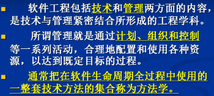

<!--  -->

**方法,工具,过程**

**软件工程发展的已经历了四个要阶段**

1. 第一代软件工程: 传统的软件工程
2. 第二代软件工程: 对象工程
3. 第三代软件工程: 过程工程
4. 第四代软件工程: 构件过程

**两种最广泛的软件工程方法学**:

- 传统方法学
  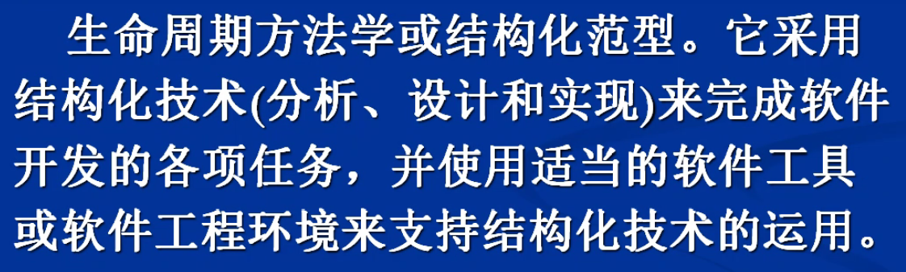
  <!--  -->
- 面向对象方法学
  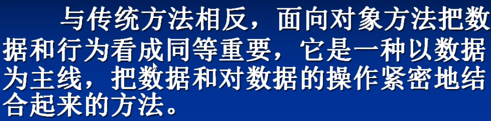
  <!--  -->
- 两种方法的比较
  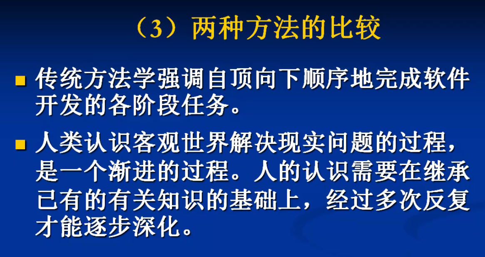
  <!--  -->

### 软件生存周期

1. 软件定义
   *也叫系统分析*
   - 问题定义
   - 可行性研究
   - 需求分析
2. 软件开发
   *也叫系统设计*
   - 总体设计
   - 详细设计
   - 编码
   - 单元测试
   - 综合测试
3. 软件维护
   *维护形式*
   - 当软件在使用过程中发现错误时应该加以改正
   - 当环境改变时应该修改软件以适应新的环境
   - 当用户有新的要求时应该及时改进软件以满足用户的新需要
   - 其他维护

*摘自亿速云*

```
在软件生存周期中，能准确地确定“软件系统必须做什么”的阶段是：需求分析。

软件生命周期各阶段的任务：

1、问题定义

确定好要解决的问题是什么（what），通过对客户的访问调查，系统分析员扼要的写出关于问题性质、工程目标和工程规模的书面报告，经过讨论和必要的修改之后这份报告应该得到客户的确认。

2、可行性研究

确定该问题是否存在一个可以解决的方案。可行性研究的结果是客户做出是否继续进行这项工程的决定的重要依据，一般来说，只有投资可能取得较大的效益的那些工程项目才值得继续进行下去。

3、需求分析

深入具体的了解用户的需求，在所开发的系统要做什么这个问题上和用户想法完全一致。明确目标系统必须做什么，确定目标系统必须具备哪些功能。通常用数据流图、数据字典和简要的算法表示系统的逻辑模型。用《规格说明书》记录对目标系统的需求。

4、概要设计（总体设计）

概括的说，应该怎样实现目标系统，设计出实现目标系统的几种可能方案，设计程序的体系结构，也就是确定程序由哪些模块组成以及模块之间的关系。

5、详细设计

实现系统的具体工作，编写详细规格说明，程序员可以根据它们写出实际的程序代码。详细设计也称模块设计，在这个阶段将详细的设计每个模块，确定实现模块功能所需的算法和数据结构。

6、编码和单元测试（编码占全部开发工作量的10%-20%）

7、综合测试（测试占全部开发工作量的40%-50%）

8、软件维护

通过各种必要的维护活动使系统持久的满足用户的需求。主要分为 改正性维护、适应性维护、完善性维护、预防性维护。
```

下面是学习通里面讲的

```
1. 系统工程
    - 将基于计算机系统的功能,性能等要求分配到各系统元素中
2. 需求分析
    - 确定软件的功能,性能,数据,界面等要求
3. 设计
    - 概要设计和详细设计
4. 实现
    - 用某种程设设计语言将设计的结果转化为可执行的程序代码
5. 测试
    - 发现并纠正软件中的错误和缺陷
6. 运行与维护
    - 在软件运行期间,对软件进行必要的修改
```

<!-- **软件工程化**
- 工程:有序化,可控制,可管理
- 计划,实施,反馈,优化

软件工程化的难度
- 结构复杂
- 目标难以定量度量
- 演化性

软件工程框架:
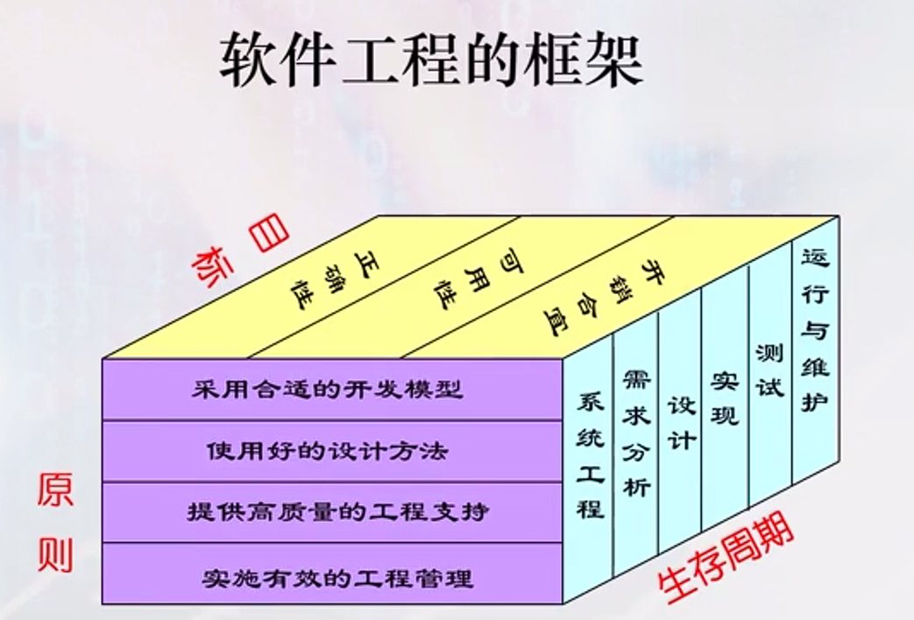 -->

<!-- 我可真是个大聪明,本地的md文档继续使用本地照片,同时上传到图床一份,先给注释掉,这样如果以后想上传到博客,也可以直接把注释取消,把本地的给注释,就OK啦,我可真是个大聪明 -->

<!--  -->

<!-- **软件工程目标**
- 生产具有正确性,可用性,及开销合宜的产品
    - 正确性反应软件产品实现相应功能规约的程度.
    - 可用性反应软件的基本结构,实现及其文档为用户可用的程度.
    - 开销合宜反映软件开发与运行的总代价满足用户要求的程度.

软件工程原则
围绕工程设计,工程支持和工程管理
- 选取适宜的开发模型
- 采用合适的设计方法
- 提供高质量的工程支持
- 重视软件工程的管理

软件工具
- 用于辅助计算机软件的开发,运行,维护,管理,支持过程中的活动或任务的软件
 - 计算机辅助软件工程(Computer Aided SoftWare Engineering)简称CASE -->

### 软件过程

软件过程是软件工程人员为了获得软件产品而在软件工具的支持下实施的一系列软件工程活动

软件过程模型

- 软件过程模型是对实际过程的抽象描述
- 包括软件过程的活动，软件产品以及参与人员的不同角色

### 常见的软件过程模型

- 瀑布模型

  - 适用：在开发的早期阶段软件需求被完整确定(系统软件等)
  - 优点:
    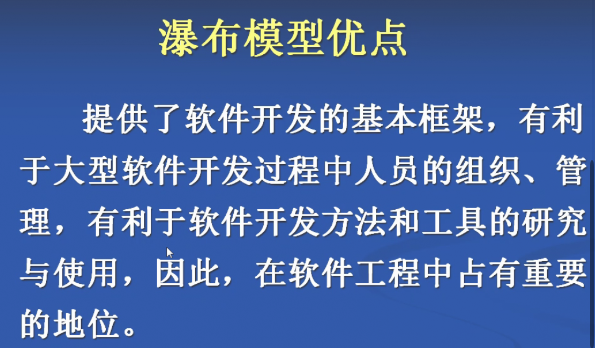
    <!--  -->
  - 缺点：
    1. 现实中客户很难明确的描述软件的需求,由于需求无法确定,就无法往下走,无法做软件设计,编码实现也就没法开展
    2. 每个阶段都要写大量的相应文档,要花很多精力,增加许多工作量
    3. 开发过程中很难响应客户的需求比变更
       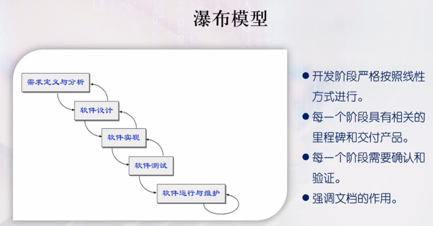

  <!--  -->
- 快速原型模型
  快速原型需要迅速建造一个可以运行的软件原型,以便理解和澄清问题,使开发人员与用户达成共识

  - 目的:减少开发风险和需求的不确定性
  - 优点:在需求难以表达的时候,可做出一个原型系统,这个原型系统,内部业务处理部分不完全,但功能界面基本是完整的,这样开发人员与客户之间就有了讨论的基础
  - 缺点:
    - 因为是快速做出来的原型系统,内部结构可能会比较乱
    - 它必须要求开发人员掌握快速原型的开发技术和工具
  - 使用范围
    - 小型的,或者中等规模的交互式系统
    - 大型系统的某些部门,比如说我们常见的界面部分
    - 生命周期比较短的过渡性软件系统
      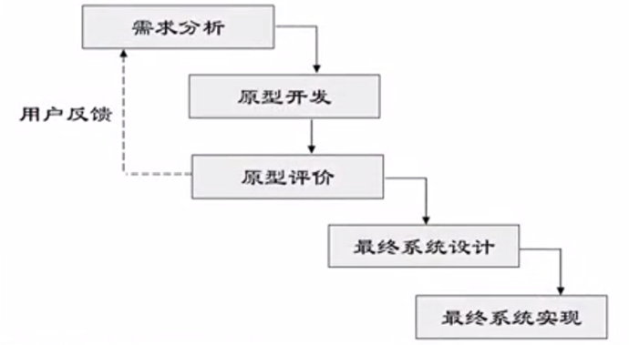

  <!--  -->
- 增量模型

  - 优点:
    - 用户可以不断地,最快的看到软件可运行的中间版本,对于抢占市场入口的软件特别适用
    - 可以降低开发风险,不用全盘铺开,巨额投入,发现风险容易脱身
  - 缺点:
    - 需要具备开放的体系结构,才能支持这种不断地增量打补丁开发过程
      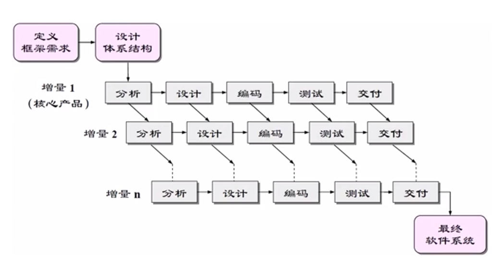

  <!--  -->
- 螺旋模型
  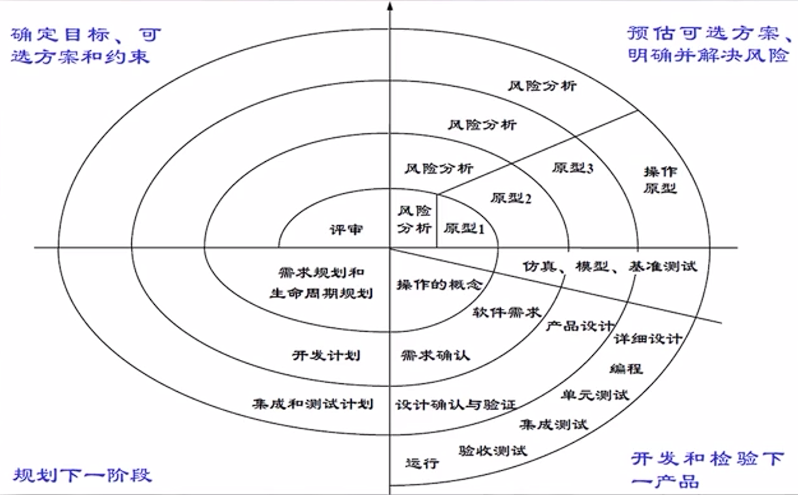

  <!--  -->

  - 使用原型及其他方法来降低风险
  - 构建原型是一种能使某些类型的风险降至最低的方法
    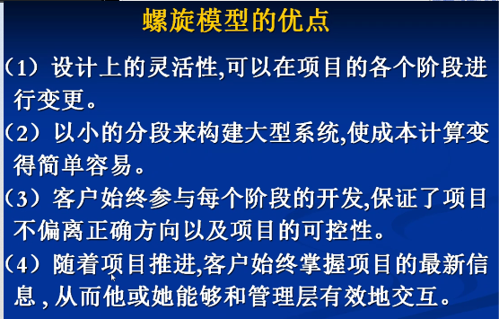

  <!--  -->

  缺点:需要风险评估的经验,没有经验的话是无法发挥其优点的

## 2 可行性研究

- 理解可行性研究的任务和流程
- 设计软件系统的数据流图
- 定义数据字典

### 可行性研究的任务

- 可行性研究的目的不是解决问题，而是确定问题是否值得去解决
- 可行性研究实质上要进行一次大大压缩简化了系统分析和设计的过程

1. 需要进一部分析和澄清问题定义,在问题定义阶段初步确定的规模和目标,如果是正确的就进一步加以肯定,如果有错误就应该及时改正,如果对目标系统有任何约束和限制,也必须把它们清除地列举出来
2. 导出系统的逻辑模型,然后从系统逻辑模型出发,探索若干种可供选择的主要解法(即系统实现方案),对每种揭发都应该仔细研究它的可行性

**可行性研究需要从下面几个方面进行**

- 技术可行性
  度量一个特定技术信息系统解决方案的实用性及技术资源的可用性
  主要考虑的问题:
  1. 开发风险分析
  2. 资源分析
  3. 相关技术的发展(现有技术能否实现新系统技术难点,建议采用技术的先进性)
- 经济可行性
  主要考虑的问题:
  成本和效益的估算
  - 开发成本的估算
  - 开发效益的估算
  - 运行成本的估算
  - 运行效益的估算
- 操作可行性
- 法律可行性
  - 开发项目是否会在社会上或政治上引起侵权,破坏其他责任问题
    - 是否满足所有项目设计者的利益
    - 是否满足法律或合同的要求
  - 市场又分为未成熟的市场,成熟的市场和将要消亡的市场.涉足未成熟的市场要冒很大的风险,要尽可能准确地估计潜在的市场有多大,自己能占多少分额,多长时间能实现
  - 政策对软件公司的生存与发展影响非常大
- 开发方案可行性研究
  - 设计解决方案
  - 选择解决方案

### 可行性研究过程

典型的可行性研究过程有下述八个步骤

1. 复查系统规模和目标
2. 研究目前正在使用的系统
3. 导出新系统的高层逻辑模型
4. 进一步定义问题
5. 导出和评价供选择的解法
6. 推荐行动方针
7. 草拟开发计划
8. 书写文档提交审查

可行性研究过程图:
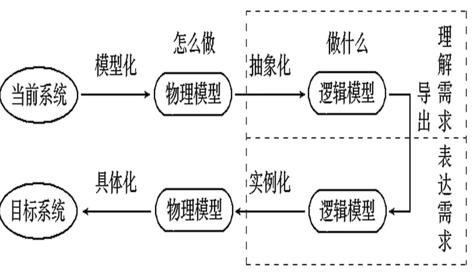

<!--  -->

### 系统流程图

系统流程图的作用:
*系统流程图是描述物理系统的工具,所谓物理系统,就是一个具体实现的系统,也就是描述一个单位,组织的信息处理的具体实现的系统,系统流程图不仅能用于可行性研究,还能用于需求分析阶段*
系统流程图可用图形符号来表示系统中的各个元素

系统流程图的符号:
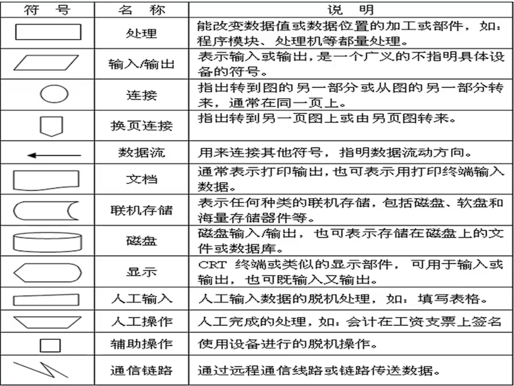

<!--  -->

### 数据流图

- 数据流图(Data Flow Diagram)是一种**图形化技术**,它描绘信息流和数据从输入移动到输入的过程中所经受的变换
- **数据流图**和**数据字典**(Data Dictionary)共同构成了系统的**逻辑模型**

数据流图中的符号
数据流图的基本图形元素有4种,有时为了使数据流图便于在计算机上输入和输出,免去画曲线,斜线和圆的困难,常使用对应的另一套符号,这两套符号完成等价
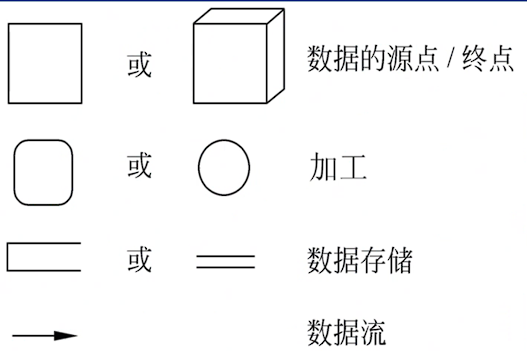

<!--  -->

1. 数据流
   数据流是数据在系统内传播的路径,由一组成分固定的数据项组成,如订票单由旅客姓名,年龄,单位,身份证号,日期及目的地等数据项组成
   由于数据流是流动中的数据,所以必须有流向,即在加工之间,加工与原点终点之间,加工与数据存储之间流动
   除了与数据存储之间的数据流不用命名外,数据流应该用名称或名称短语命名,**同一数据流图上不能有同名的数据流**,多个数据流可以指向同一个加工,也可以从一个加工发出许多数据流
2. 加工
   加工也成为数据处理,是以数据结构或数据内容作为加工对象,它对数据流进行某些操作或变换
   加工的名字通常是动词短语,简明地描述完成什么加工,在分层的数据流图中,加工还应有编号
3. 数据存储
   数据存储值暂时保存的数据,它可以是数据库文件或任何形式的数据组织
4. 数据源点和终点
   数据源点和终点是软件系统外部环境中的实体

### 设计数据流图

如图为图书管理系统顶层图
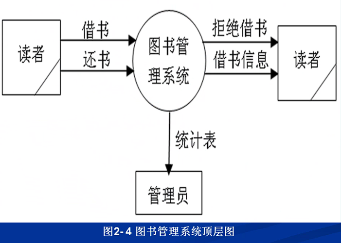

<!--  -->

## 3 需求分析

**确定对系统的综合要求**

1. 功能需求
2. 性能需求
3. 可靠性和可用性需求
4. 出错处理需求
5. 接口需求
6. 约束
7. 逆向需求
8. 将来可能提出的需求

## 考试

1. 第一章

   1. 软件产品是一种**逻辑**产品
   2. 软件会逐渐退化而不会磨损，其原因在于**不断的变更使组件接口之间引起错误**
   3. 软件通常分为**系统软件,支持软件,应用软件**
   4. 瀑布模型突出的缺点是不适应**用户需求**的变动
2. 第二章

   1. 基于计算机系统的元素包括软件,硬件,人员,数据库,文档和规程
   2. 经济可行性分析中的效益包括**经济效益**和**环境效益**
   3. 计算机系统工程是一个问题求解的活动
   4. 软件开发前的可行性分析中不适合用来进行成本/效益分析的方法**精确效益分析技术**
   5. 可行性研究实质上是在较高层次上，比较抽象的方式进行**简化的需求分析**的过程
   6. 投资回报率是指**投资者从投资中获得的收益与投资金额之比**,公式为

   $$
   投资回报率 = (投资收益-投资成本)/投资成本*100%
   $$
3. 第三章

   1. 软件生存周期中,**需求分析**阶段主要任务是**弄清楚要做什么**
   2. 需求规格说明描述了-**计算机系统的功能,性能及其约束
   3. 用例的参与者有人员还有**系统设备**
   4. Jackson方式是由英国人Jackson所提出的一种面向数据结构的方法
   5. 需求规格说明主要用于精确描述一个软件系统必须提供的功能和性能以及其它要考虑的限制条件
   6. DFD的每个加工都必须有**一个输入和输出数据流**
   7. DFD用于描述系统的**软件功能**
   8. 在数据词典中,`{}`表示允许重复0至任意次
4. 第四章

   1. 概要设计的目的是确定整个系统的**功能及模块结构**
   2. 衡量模块独立性的标准是**耦合性和内聚性**
   3. 软件设计是把**软件需求**转化为软件表示的过程
   4. 软件详细设计的主要任务是确定每个模块的**算法和使用的数据结构**
5. 第五章

   1. 设计审查的主要工作包括**检查设计结果**和**记录发现的设计缺陷**
6. 第六章

   1. 在进行单元测试时,常用的方法是**采用白盒测试,辅之以黑盒测试**
   2. 白盒法和黑盒法最大的不同在于**测试用例设计方法不同**
   3. 测试和调试最大的不同在于**操作者的心理状态不同**
   4. 逻辑覆盖标准中,差错能力最强的是**条件组合覆盖**
   5. 进行软件测试的目的是**尽可能多地找到软件中的错误**
7. 第七章

   1. 软件维护的分类不包含**可靠性维护**
8. 第八章

   1. 需求管理不包括需求设计
   2. 质量成本是一个项目管理概念，它说明了**额外需求的成本**
   3. 质量控制是**项目生存期的各个阶段都需要实施的**
