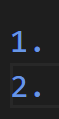

# MarkDown学习笔记

- 2022年8月1日19点32分

# 标题

## *二级标题*

### *三级标题*

#### 四级标题

- 一级标题：一个#加空格，以此类推
  

# 列表

## 无序列表

- 简单的无序列表，可以用于列出一些无序项，就是用一个减号“-”加空格
- 
- 

## 有序列表

1. 有序列表则是数字加上"."组成
2. 如图：

## 列表嵌套

1. 有序嵌套无序:
   - 嵌套项

- 无序嵌套有序
  1. 嵌套项

     

# 公式

就是上下两个美元符号包着：

$$
y=f(x)
$$

# 代码

用``` 紧跟着语言类型，结尾用三个点结尾

# 横线:---
---

>这是下横线,就是一个\>号
效果就是你看到的效果