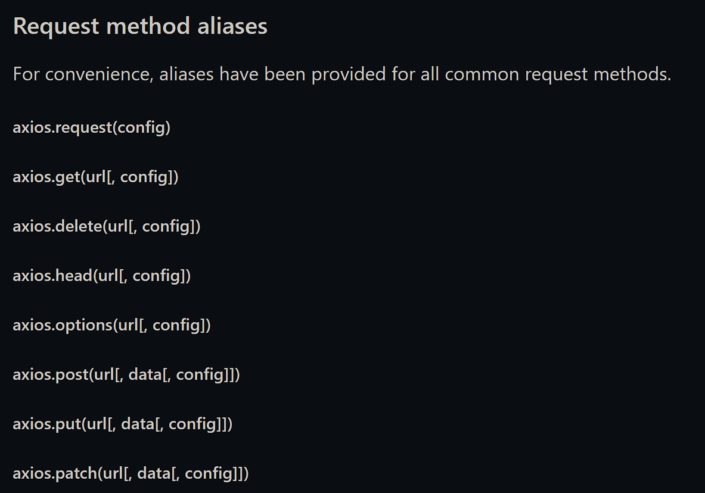
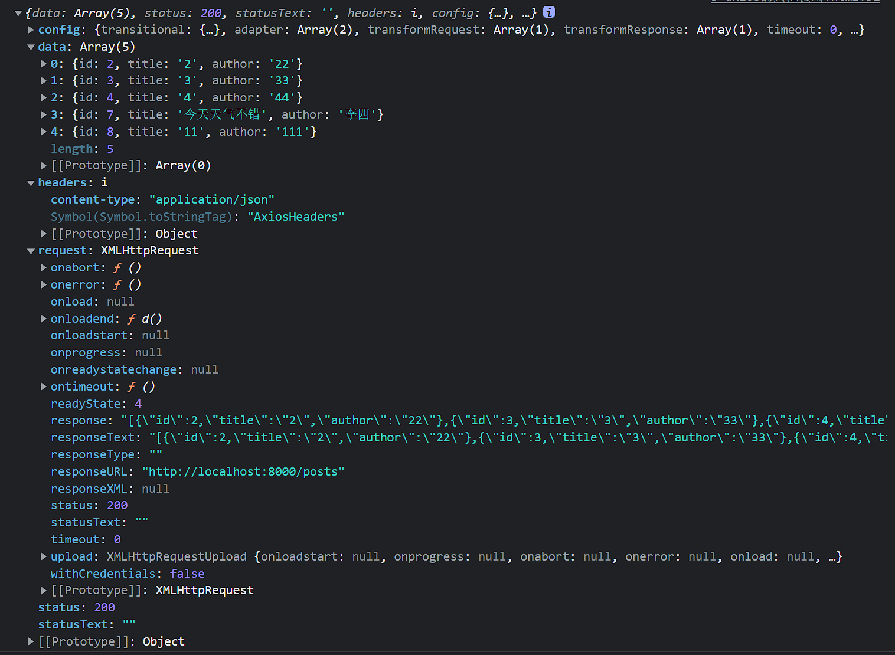

# axios
2023年1月1日 13点20分
昨天看完ajax,今天开始看axios

那ajax和axios的关系是什么?
axios是ajax的一个请求库,可以理解为封装了ajax?

*又是三个小时的课程,后面还有一个promise,看完这个再去看看promise吧,然后就开始看vue*

?
前置知识是promise,艹
那没事了,去看promise了

2023年1月4日 11点54分
回来了回来了

摸鱼加划水....

## axios基本使用

### json-server
模拟服务端
[官网地址](https://github.com/typicode/json-server)

这个感觉也挺好用的,直接就实现了RESTful的风格
配置文件
```json
{
  "posts": [
    {
      "id": 1,
      "title": "json-server",
      "author": "typicode"
    },
    {
      "id": 2,
      "title": "zzmr",
      "author": "zz"
    }
  ],
  "comments": [
    {
      "id": 1,
      "body": "some comment",
      "postId": 1
    }
  ],
  "profile": {
    "name": "typicode"
  }
}
```

开启命令:
json-server --watch db.json
不行的话,前面加上npx


### axios基本配置

html页面引入,这里使用了bootcdn的镜像
```html
    <script src="https://cdn.bootcdn.net/ajax/libs/axios/1.2.2/axios.min.js"></script>
```


### axios的基本使用


没有用上面的json-server,自己写的后端

>顺便整合了一下数据源/mybatis-plus,用起来还是很舒服的

```java
package com.zzmr.boot.controller;

import com.zzmr.boot.bean.Essay;
import com.zzmr.boot.service.EssayService;
import org.springframework.beans.factory.annotation.Autowired;
import org.springframework.web.bind.annotation.*;

import java.util.List;

@CrossOrigin
@RestController
public class AxiosController {

    @Autowired
    EssayService essayService;

    @GetMapping("/posts/{id}")
    public String getTest(@PathVariable("id") Integer id){
        Essay essay = essayService.getById(id);
        return essay.toString();
    }

    /**
     * 写了一个bean类来接收前端发来的json数据，由于没有连接数据库，所以id是null，(id应该到数据库中自增的)
     * 要不连一下数据库？
     * 连就连
     * @param essay
     * @return
     */
    @PostMapping("/posts")
    public String postTest(@RequestBody Essay essay){
        boolean save = essayService.save(essay);
        return "是否添加成功"+save;
    }


    @PutMapping("/posts/{id}")
    public String putTest(@PathVariable("id") Long id,@RequestBody Essay essay){

        //使用updateById()，里面传入一个bean类，会根据传入的bean类找到对应的id进行修改，如果没有这个id，则返回false
        //这里前端传入的有id，也有json数据，但是json数据中是没有id的，所以将id set到bean内部即可
        essay.setId(id);
        essayService.updateById(essay);
        return "更改成功";
    }


    @DeleteMapping("/posts/{id}")
    public String deleteTest(@PathVariable("id") Integer id){
        boolean b = essayService.removeById(id);
        return "删除"+b;
    }


    /**
     * 测试一下获取所有的文章信息
     * @return
     */
    @GetMapping("/posts")
    public List<Essay> getAllEssay(){
        return essayService.list();
    }


}
```


axios
```html
<div class="container">
        <h2>基本使用</h2>
        <button>GET</button>
        <button>POST</button>
        <button>PUT</button>
        <button>DELETE</button>
    </div>

    <script>
        // 获取按钮
        const btns = document.querySelectorAll('button');
        btns[0].onclick = function () {
            // 发送ajax请求
            axios({
                // 请求类型
                method: 'GET',
                // url
                url: 'http://localhost:8000/posts/2',
            }).then(response => {
                console.log(response);
            });
        }

        // 添加一篇新的文章
        btns[1].onclick = function () {
            // 发送ajax请求-post
            axios({
                // 请求类型
                method: 'POST',
                url: 'http://localhost:8000/posts',
                // 设置请求体
                data: {
                    title: "5",
                    author: "55"
                }
            }).then(response => {
                console.log(response);
            });
        }

        // 更新文章
        btns[2].onclick = function () {
            // 发送ajax请求-put
            axios({
                // 请求类型
                method: 'PUT',
                url: 'http://localhost:8000/posts/7',
                // 设置请求体
                data: {
                    title: "今天天气不错",
                    author: "李四"
                }
            }).then(response => {
                console.log(response);
            });
        }

        // 删除文章
        btns[3].onclick = function () {
            // 发送ajax请求-put
            axios({
                // 请求类型
                method: 'DELETE',
                url: 'http://localhost:8000/posts/1',
            }).then(response => {
                console.log(response);
            });
        }

    </script>
```


### axios的其他使用方式

<!--  -->

>就像之前的@RequestMapping和@GetMapping一样,只是把方法名内置到了里面,axios.post()和直接在axios里面写method是一样的效果

```js
// 获取按钮
        const btns = document.querySelectorAll('button');
        
        // 发送GET请求
        btns[0].onclick = function(){
            // axios()
            axios.request({
                method: 'GET',
                url: 'http://localhost:8000/posts'
            }).then(response => {
                console.log(response);
            });
        }

        // 发送post请求
        btns[1].onclick = function(){
            // axios()
            axios.post('http://localhost:8000/posts',{
                "title": "11",
                "author": "111"
            }).then(response => {
                console.log(response);
            })
        }
```

### 请求响应结果的结构

<!--  -->
内容挺多的


```js
{
  // `url` is the server URL that will be used for the request
  url: '/user',

  // `method` is the request method to be used when making the request
  method: 'get', // default

  // `baseURL` will be prepended to `url` unless `url` is absolute.
  // It can be convenient to set `baseURL` for an instance of axios to pass relative URLs
  // to methods of that instance.
  baseURL: 'https://some-domain.com/api/',

  // `transformRequest` allows changes to the request data before it is sent to the server
  // This is only applicable for request methods 'PUT', 'POST', 'PATCH' and 'DELETE'
  // The last function in the array must return a string or an instance of Buffer, ArrayBuffer,
  // FormData or Stream
  // You may modify the headers object.
  transformRequest: [function (data, headers) {
    // Do whatever you want to transform the data

    return data;
  }],

  // `transformResponse` allows changes to the response data to be made before
  // it is passed to then/catch
  transformResponse: [function (data) {
    // Do whatever you want to transform the data

    return data;
  }],

  // `headers` are custom headers to be sent
  headers: {'X-Requested-With': 'XMLHttpRequest'},

  // `params` are the URL parameters to be sent with the request
  // Must be a plain object or a URLSearchParams object
  params: {
    ID: 12345
  },

  // `paramsSerializer` is an optional config in charge of serializing `params`
  paramsSerializer: {
    encode?: (param: string): string => { /* Do custom ops here and return transformed string */ }, // custom encoder function; sends Key/Values in an iterative fashion
    serialize?: (params: Record<string, any>, options?: ParamsSerializerOptions ), // mimic pre 1.x behavior and send entire params object to a custom serializer func. Allows consumer to control how params are serialized.
    indexes: false // array indexes format (null - no brackets, false (default) - empty brackets, true - brackets with indexes)
  },

  // `data` is the data to be sent as the request body
  // Only applicable for request methods 'PUT', 'POST', 'DELETE , and 'PATCH'
  // When no `transformRequest` is set, must be of one of the following types:
  // - string, plain object, ArrayBuffer, ArrayBufferView, URLSearchParams
  // - Browser only: FormData, File, Blob
  // - Node only: Stream, Buffer, FormData (form-data package)
  data: {
    firstName: 'Fred'
  },

  // syntax alternative to send data into the body
  // method post
  // only the value is sent, not the key
  data: 'Country=Brasil&City=Belo Horizonte',

  // `timeout` specifies the number of milliseconds before the request times out.
  // If the request takes longer than `timeout`, the request will be aborted.
  timeout: 1000, // default is `0` (no timeout)

  // `withCredentials` indicates whether or not cross-site Access-Control requests
  // should be made using credentials
  withCredentials: false, // default

  // `adapter` allows custom handling of requests which makes testing easier.
  // Return a promise and supply a valid response (see lib/adapters/README.md).
  adapter: function (config) {
    /* ... */
  },

  // `auth` indicates that HTTP Basic auth should be used, and supplies credentials.
  // This will set an `Authorization` header, overwriting any existing
  // `Authorization` custom headers you have set using `headers`.
  // Please note that only HTTP Basic auth is configurable through this parameter.
  // For Bearer tokens and such, use `Authorization` custom headers instead.
  auth: {
    username: 'janedoe',
    password: 's00pers3cret'
  },

  // `responseType` indicates the type of data that the server will respond with
  // options are: 'arraybuffer', 'document', 'json', 'text', 'stream'
  //   browser only: 'blob'
  responseType: 'json', // default

  // `responseEncoding` indicates encoding to use for decoding responses (Node.js only)
  // Note: Ignored for `responseType` of 'stream' or client-side requests
  responseEncoding: 'utf8', // default

  // `xsrfCookieName` is the name of the cookie to use as a value for xsrf token
  xsrfCookieName: 'XSRF-TOKEN', // default

  // `xsrfHeaderName` is the name of the http header that carries the xsrf token value
  xsrfHeaderName: 'X-XSRF-TOKEN', // default

  // `onUploadProgress` allows handling of progress events for uploads
  // browser & node.js
  onUploadProgress: function ({loaded, total, progress, bytes, estimated, rate, upload = true}) {
    // Do whatever you want with the Axios progress event
  },

  // `onDownloadProgress` allows handling of progress events for downloads
  // browser & node.js
  onDownloadProgress: function ({loaded, total, progress, bytes, estimated, rate, download = true}) {
    // Do whatever you want with the Axios progress event
  },

  // `maxContentLength` defines the max size of the http response content in bytes allowed in node.js
  maxContentLength: 2000,

  // `maxBodyLength` (Node only option) defines the max size of the http request content in bytes allowed
  maxBodyLength: 2000,

  // `validateStatus` defines whether to resolve or reject the promise for a given
  // HTTP response status code. If `validateStatus` returns `true` (or is set to `null`
  // or `undefined`), the promise will be resolved; otherwise, the promise will be
  // rejected.
  validateStatus: function (status) {
    return status >= 200 && status < 300; // default
  },

  // `maxRedirects` defines the maximum number of redirects to follow in node.js.
  // If set to 0, no redirects will be followed.
  maxRedirects: 21, // default

  // `beforeRedirect` defines a function that will be called before redirect.
  // Use this to adjust the request options upon redirecting,
  // to inspect the latest response headers,
  // or to cancel the request by throwing an error
  // If maxRedirects is set to 0, `beforeRedirect` is not used.
  beforeRedirect: (options, { headers }) => {
    if (options.hostname === "example.com") {
      options.auth = "user:password";
    }
  },

  // `socketPath` defines a UNIX Socket to be used in node.js.
  // e.g. '/var/run/docker.sock' to send requests to the docker daemon.
  // Only either `socketPath` or `proxy` can be specified.
  // If both are specified, `socketPath` is used.
  socketPath: null, // default

  // `httpAgent` and `httpsAgent` define a custom agent to be used when performing http
  // and https requests, respectively, in node.js. This allows options to be added like
  // `keepAlive` that are not enabled by default.
  httpAgent: new http.Agent({ keepAlive: true }),
  httpsAgent: new https.Agent({ keepAlive: true }),

  // `proxy` defines the hostname, port, and protocol of the proxy server.
  // You can also define your proxy using the conventional `http_proxy` and
  // `https_proxy` environment variables. If you are using environment variables
  // for your proxy configuration, you can also define a `no_proxy` environment
  // variable as a comma-separated list of domains that should not be proxied.
  // Use `false` to disable proxies, ignoring environment variables.
  // `auth` indicates that HTTP Basic auth should be used to connect to the proxy, and
  // supplies credentials.
  // This will set an `Proxy-Authorization` header, overwriting any existing
  // `Proxy-Authorization` custom headers you have set using `headers`.
  // If the proxy server uses HTTPS, then you must set the protocol to `https`.
  proxy: {
    protocol: 'https',
    host: '127.0.0.1',
    // hostname: '127.0.0.1' // Takes precedence over 'host' if both are defined
    port: 9000,
    auth: {
      username: 'mikeymike',
      password: 'rapunz3l'
    }
  },

  // `cancelToken` specifies a cancel token that can be used to cancel the request
  // (see Cancellation section below for details)
  cancelToken: new CancelToken(function (cancel) {
  }),

  // an alternative way to cancel Axios requests using AbortController
  signal: new AbortController().signal,

  // `decompress` indicates whether or not the response body should be decompressed
  // automatically. If set to `true` will also remove the 'content-encoding' header
  // from the responses objects of all decompressed responses
  // - Node only (XHR cannot turn off decompression)
  decompress: true // default

  // `insecureHTTPParser` boolean.
  // Indicates where to use an insecure HTTP parser that accepts invalid HTTP headers.
  // This may allow interoperability with non-conformant HTTP implementations.
  // Using the insecure parser should be avoided.
  // see options https://nodejs.org/dist/latest-v12.x/docs/api/http.html#http_http_request_url_options_callback
  // see also https://nodejs.org/en/blog/vulnerability/february-2020-security-releases/#strict-http-header-parsing-none
  insecureHTTPParser: undefined // default

  // transitional options for backward compatibility that may be removed in the newer versions
  transitional: {
    // silent JSON parsing mode
    // `true`  - ignore JSON parsing errors and set response.data to null if parsing failed (old behaviour)
    // `false` - throw SyntaxError if JSON parsing failed (Note: responseType must be set to 'json')
    silentJSONParsing: true, // default value for the current Axios version

    // try to parse the response string as JSON even if `responseType` is not 'json'
    forcedJSONParsing: true,

    // throw ETIMEDOUT error instead of generic ECONNABORTED on request timeouts
    clarifyTimeoutError: false,
  },

  env: {
    // The FormData class to be used to automatically serialize the payload into a FormData object
    FormData: window?.FormData || global?.FormData
  },

  formSerializer: {
      visitor: (value, key, path, helpers) => {}; // custom visitor function to serialize form values
      dots: boolean; // use dots instead of brackets format
      metaTokens: boolean; // keep special endings like {} in parameter key
      indexes: boolean; // array indexes format null - no brackets, false - empty brackets, true - brackets with indexes
  },

  // http adapter only (node.js)
  maxRate: [
    100 * 1024, // 100KB/s upload limit,
    100 * 1024  // 100KB/s download limit
  ]
}
```

好家伙,上节课后大半部分音画不同步

### 默认配置

```html
    <script>
        // 获取按钮
        const btns = document.querySelectorAll('button');

        // 默认配置
        axios.defaults.method = 'GET';// 设置默认的请求类型为GET
        axios.defaults.baseURL = 'http://localhost:8000' //设置基础url

        // 设置默认的请求参数 
        axios.defaults.params = { id: 100 };
        axios.defaults.timeout= 3000;// 超时时间


        btns[0].onclick = function () {
            axios({
                url: '/posts'
            }).then(response => {
                console.log(response);
            })
        }

    </script>
```

就是使用axios.defaults.xxx来设置默认信息

### 创建实例对象发送请求

```js
// 获取按钮
        const btns = document.querySelectorAll('button');

        // 创建实例对象
        const essay = axios.create({
            baseURL: 'http://localhost:8000',
            timeout: 2000
        });

        // 这里 essay 与 axios 对象的功能几近是一样的
        /* essay({
            url: '/posts'
        }).then(response => {
            console.log(response);
        }) */

        essay.get('/posts')
        .then(res => {
            console.log(res.data)
        })
```


### 拦截器

>请求拦截器和相应拦截器

```js
// Add a request interceptor
axios.interceptors.request.use(function (config) {
    // Do something before request is sent
    return config;
  }, function (error) {
    // Do something with request error
    return Promise.reject(error);
  });

// Add a response interceptor
axios.interceptors.response.use(function (response) {
    // Any status code that lie within the range of 2xx cause this function to trigger
    // Do something with response data
    return response;
  }, function (error) {
    // Any status codes that falls outside the range of 2xx cause this function to trigger
    // Do something with response error
    return Promise.reject(error);
  });
```

更改过的:
```js
        // Promise
        // 设置请求拦截器  config 配置对象
        axios.interceptors.request.use(function (config) {
            console.log('请求拦截器-成功 - 1');

            // 修改config中的参数
            config.params = {a:100};
            config.timeout = 2000;

            return config;
            // throw '参数出了问题';
        }, function (error) {
            console.log('请求拦截器-失败 - 1');
            return Promise.reject(error);
        });

        // 设置请求拦截器
        axios.interceptors.request.use(function (config) {
            console.log('请求拦截器-成功 - 2');
            return config;
            // throw '参数出了问题';
        }, function (error) {
            console.log('请求拦截器-失败 - 2');
            return Promise.reject(error);
        });

        // 设置响应拦截器
        axios.interceptors.response.use(function (response) {
            console.log('响应拦截器-成功 - 1')

            console.log(response);

            // return response;
            return response.data;
        }, function (error) {
            console.log('响应拦截器-失败 - 1')
            return Promise.reject(error);
        });

        // 设置响应拦截器
        axios.interceptors.response.use(function (response) {
            console.log('响应拦截器-成功 - 2')
            return response;
        }, function (error) {
            console.log('响应拦截器-失败 - 2')
            return Promise.reject(error);
        });

        // 发送请求
        axios({
            method: 'GET',
            url: 'http://localhost:8000/posts'
        }).then(response => {
            console.log('自定义回调处理成功的结果:');
            console.log(response);
        }).catch(reason => {
            console.log('自定义失败的回调');
        })
```

类似Promise

### 取消请求

```js
// 获取按钮
        const btns = document.querySelectorAll('button');

        // 2. 声明全局变量
        let cancel = null;

        // 发送请求
        btns[0].onclick = function(){

            // 检查一下上一次请求是否已经完成
            if(cancel!==null){
                cancel();
            }

            axios({
                method:'get',
                url: 'http://localhost:8000/posts',
                // 1. 添加配置对象的属性
                cancelToken: new axios.CancelToken(function(c){
                    // 3. 将c的值赋值给cancel
                    cancel = c;
                })
            }).then(response => {
                console.log(response);
                // 将cancel的值初始化
                cancel = null;
            });
        }

        // 取消请求
        btns[1].onclick = function(){
            cancel();
        }
```

controller里面加一个Thread.sleep();就行了

## 源码分析
这块随便看看吧,毕竟是会用就行


### axios的创建过程

算了
去看vue吧,这源码真不是人看的
