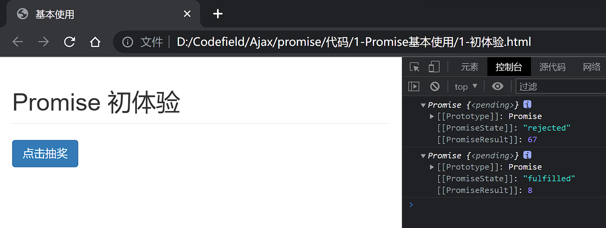
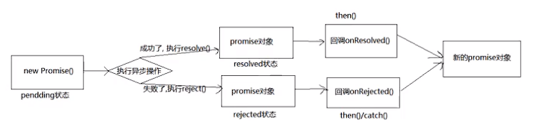
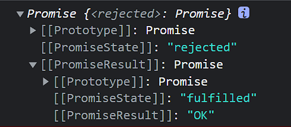

# Promise

从axios过来的

## Promise 介绍与基本使用

### Promise是什么

- Promise是一门新的技术(ES6规范)
- Promise是JS中进行异步编程的新解决方案(旧方案是指回调函数)
- 从语法上来说,Promise是一个构造函数
- 从功能上来说,Promise对象用来封装一个异步操作并可以获取其成功/失败的结果值

Promise的特点:
- **Promise支持链式调用,可以解决回调地狱问题**
- 指定回调函数的方式更加灵活
    - 旧的:必须在启动异步任务前指定
    - promise:启动异步任务=>返回promise对象=>给promise对象绑定回调函数(甚至可以在异步任务结束后指定/多个)

### Promise初体验

```html
<!DOCTYPE html>
<html lang="en">

<head>
    <meta charset="UTF-8">
    <meta http-equiv="X-UA-Compatible" content="IE=edge">
    <meta name="viewport" content="width=device-width, initial-scale=1.0">
    <title>基本使用</title>
    <link crossorigin='anonymous' href="https://cdn.bootcss.com/twitter-bootstrap/3.3.7/css/bootstrap.min.css"
        rel="stylesheet">
</head>

<body>
    <div class="container">
        <h2 class="page-header">Promise 初体验</h2>
        <button class="btn btn-primary" id="btn">点击抽奖</button>
    </div>

    <script>
        // 生成随机数
        function rand(m, n) {
            return Math.ceil(Math.random() * (n - m + 1)) + m - 1
        }

        /**
         *  点击按钮, 1s后先是是否中奖(30%概率中奖)
         *  若中奖弹出  中奖了
         *  若未中奖弹出    再接再厉
        */

        // 获取元素对象
        const btn = document.querySelector('#btn');
        // 绑定单击事件
        btn.addEventListener('click', function () {
            // setTimeout(() => {
            //     // 30%中奖概率
            //     // 获取从1 - 100 的一个随机数
            //     let n = rand(1, 100);
            //     // 判断
            //     if (n <= 30) {
            //         alert("中奖了")
            //     } else {
            //         alert("再接再厉")
            //     }
            // }, 1000)

            // 下面是promise实现
            // resolve 解决  函数类型的数据 异步任务成功时调用
            // reject  拒绝   函数类型的数据 异步任务失败时调用
            const p = new Promise((resolve, reject) => {
                setTimeout(() => {
                    // 30%中奖概率
                    // 获取从1 - 100 的一个随机数
                    let n = rand(1, 100);
                    // 判断
                    if (n <= 30) {
                        resolve(n);  // 将promise对象的状态设置为成功
                        // alert("中奖了")
                    } else {
                        reject(n);   // 将promise对象的状态设置为成功
                        // alert("再接再厉")
                    }
                }, 1000)
            });

            // 调用then方法, value和reason也是可以自定义名字的,都是上面传来的形参
            p.then((value) => {
                alert("中奖了" + value);
            }, (reason) => {
                alert("再接再厉" + reason);
            });

        });

    </script>

</body>

</html>
```

**主要就是new那个对象const p = new Promise((resolve, reject) => {} 然后resolve和reject的使用**


### fs模块
```js
// 引入fs模块
const fs = require('fs');

// 回调函数的形式
// fs.readFile('./resource/content.txt', (err, data) => {
//     // 如果出错,则抛出错误
//     if(err) throw err;
//     // 输出文件内容
//     console.log(data.toString());
// });

// promise 形式
let p = new Promise((resolve, reject) => {
    fs.readFile('./resource/content.txt', (err, data) => {
        // 如果出错
        if (err) reject(err);
        // 如果成功
        resolve(data);
    });
});

// 调用then方法,对结果进行处理
p.then(value => {
    console.log(value.toString());
}, reason => {
    console.log(reason);
})
```

### Ajax请求

还是原生的ajax请求发送方式,但是使用promise来实现的
```html
    <script>
        // 接口地址 https://api.apiopen.top/getJoke
        // 获取元素对象
        const btn = document.getElementById('btn');

        btn.addEventListener('click', function () {
            // 创建promise
            const promise = new Promise((resolve, reject) => {
                // 1. 创建对象
                const xhr = new XMLHttpRequest();
                // 2. 初始化
                xhr.open('GET', 'http://localhost:8000/ajax');
                // 3. 发送
                xhr.send();
                // 4. 绑定事件，处理响应结果
                xhr.onreadystatechange = function () {
                    if (xhr.readyState === 4) {
                        // 判断响应状态码
                        if (xhr.status >= 200 && xhr.status < 300) {
                            // 控制台输出响应体
                            resolve(xhr.response);
                        }
                        else {
                            // 控制台输出响应状态码
                            reject(xhr.status);
                        }
                    }
                }
            });
            // 调用then方法
            promise.then(value => {
                console.log(value);
            },reason => {
                console.warn(reason);
            })
        });

    </script>
```

后端部分还是一个controller
```java
    @GetMapping("/ajax")
    @ResponseBody
    public String testAjax() {
        return "没问题";
    }
```

还是要用到@CrossOrigin注解


### Promise封装fs读取文件

```js
/**
 * 封装一个函数 mineReadFile 读取文件内容
 * 参数 path 文件路径
 * 返回 promise 对象
 */

function mineReadFile(path){
    return new Promise((resolve, reject) => {
        //读取文件
        require('fs').readFile(path, (err, data) =>{
            //判断
            if(err) reject(err);
            //成功
            resolve(data);
        });
    });
}

mineReadFile('./resource/conten.txt')
.then(value=>{
    //输出文件内容
    console.log(value.toString());
}, reason=>{
    console.log(reason);
});
```


### util.promisify
方法封装
```js
/**
 * util.promisify 方法
 */

// 引入 util 模块
const util = require('util');
// 引入fs模块
const fs = require('fs');
// 返回一个新的函数
let mineReadFile = util.promisify(fs.readFile);

mineReadFile('./resource/content.txt').then(value => {
    console.log(value.toString());
});
```

### 封装Ajax请求

```html
<!DOCTYPE html>
<html lang="en">

<head>
    <meta charset="UTF-8">
    <meta http-equiv="X-UA-Compatible" content="IE=edge">
    <meta name="viewport" content="width=device-width, initial-scale=1.0">
    <title>Promise封装Ajax操作</title>
</head>

<body>

    <script>

        /**
         * 封装一个函数 sendAjax 发送GET Ajax 请求
         * 参数 URL
         * 返回结果 Promise 对象
         */

        function sendAjax(url) {
            return new Promise((resolve, reject) => {
                const xhr = new XMLHttpRequest();
                xhr.open('GET', url);
                xhr.send();
                // 处理结果
                xhr.onreadystatechange = function () {
                    if (xhr.readyState === 4) {
                        // 判断成功
                        if (xhr.status >= 200 && xhr.status < 300) {
                            resolve(xhr.response);
                        } else {
                            reject(xhr.status);
                        }
                    }
                }

            });
        }

        sendAjax('http://localhost:8000/ajax')
            .then(value => {
                console.log(value);
            }, reason => {
                console.warn(reason);
            });

    </script>
</body>

</html>
```

## Promise的理解

### Promise的状态改变

状态:实例对象中的一个属性 [PromiseState]

1. pending变为resolved / fulfilled 成功
2. pending变为rejected 失败
而pending表示未决定的

说明:只有这两种,且一个promise对象只能改变一次,无论变为成功还是失败,都会有一个结果数据,成功的结果数据一般称为value,失败的结果一般称为reason

<!--  -->


**Promise对象的值**

实例对象中的另一个属性 [PromiseResult]
保存着对象[成功/失败] 的结果

### promise的基本流程

<!--  -->


### API

1. Promise构造函数:Promise(excutor){}
    - executor函数: 执行器 (resolve, reject) => {}
    - resolve函数: 内部定义成功时我们调用的函数 value => {}
    - reject函数: 内部定义失败时我们调用的函数 reason => {}
    说明: executor会在promise内部立即同步调用,异步操作在执行器中执行

2. Promise.prototype.then方法(onResolved,onRejected) => {}
    - onResolved 函数:成功的回调函数 (value) => {}
    - onRejected 函数:失败的回调函数 (reason) => {}
    说明:指定用于得到成功回调和用于得到失败reason的失败回调返回一个新的promise对象

3. Peomise.prototype.catch方法:(onRejected)=> {}
    - onRejected函数: 失败的回调函数(reason) => {}

4. Promise.resolve方法 (value) => {}
    - value: 成功的数据或promise对象
    说明:返回一个成功/失败的promise对象
```html
    <script>

        let p1 = Promise.resolve(521);
        // 如果传入的参数为 非promise类型对象,则返回的结果为promise对象
        // 如果传入的参数为Promise对象,则参数的结果决定了resolve的结果
        let p2 = Promise.resolve(new Promise((resolve,reject) => {
            // resolve('OK');
            reject('error');
        }))
        console.log(p2);
        // 此时内层的new promise是resolve,是成功,所以外层的p2也是成功
        p2.catch(reason => {
            console.log(reason);
        })
    </script>
```

5. Promise.reject方法 (raason) => {}
    - reason: 失败的原因
    说明: 返回一个失败的promise对象

```js
        let p1 = Promise.reject(521);

        let p2 = Promise.reject('iii');
        let p3 = Promise.reject(new Promise((resolve,reject) => {
            resolve('OK');
        }));

        console.log(p3);
        // 传什么返回的都是一个失败的promise对象
```
<!--  -->


6. Promise.all方法:(promises=>{})
    - Promises:包含n个promise的数组
    说明: 返回一个新的promise,只有所有的promise都成功才成功,只要有一个失败了就直接失败

```js
        let p1 = new Promise((resolve,reject) => {
            // 成功
            resolve('OK');
        });

        let p2 = Promise.reject('error')
        let p3 = Promise.resolve('ok')

        const result = Promise.all([p1, p2, p3]);
        console.log(result);
```

7. Promise.race方法:(promise)=> {}
    - promises:包含n个promise的数组
    说明:返回一个新的promise,第一个完成的promise的结果状态就是最终的结果状态
此时result的结果就是p2,因为p1延迟了
```js
let p1 = new Promise((resolve, reject) => {
            setTimeout(() => {
                // 成功
                resolve('OK');
            }, 1000);
        });

        let p2 = Promise.resolve('success');
        let p3 = Promise.resolve('ok');

        let result = Promise.race([p1, p2, p3]);
        console.log(result);
```


## Promise的几个关键问题

1. 如何改变promise的状态?
    - resolve(value): 如果当前是pending就会变为resolved
    - reject(reason): 如果当前是pending就会变为rejected
    - 抛出异常: 如果当前是pending就会变为rejected

```js
        let p = new Promise((resolve, reject) => {
            // 1. 调用 resolve 函数
            // resolve('ok');  // pending => fulfilled(resolved)
            // 2. 调用 reject 函数
            // reject('Error'); // pending => rejected

            // 3. 抛出错误
            throw '出问题了'  // pending => rejected

        });
        console.log(p);
```

2. 一个promise指定多个成功/失败回调函数,都会调用吗
当promise改变为对应状态时都会调用

```js
        let p = new Promise((resolve, reject) => {
            resolve('Ok');
        });
        // 指定回调 -1
        p.then(value => {
            console.log(value);
        });

        // 指定回调 -2
        p.then(value => {
            alert(value);
        });
```

3. 改变promise状态和指定回调函数谁先谁后
    - 都有可能,正常情况下是先指定回调再改变状态,但是也可先改状态再指定回调
    - 如何先改变状态再指定回调
        1. 在执行器中直接调用resolve()/reject()
        2. 延迟更长时间才调用then()
    - 什么时候才能得到数据?
        1. 如果先指定的回调,那当状态发生改变时,回调函数就会调用,得到数据
        2. 如果先改变状态,那当指定回调时,回调函数就会调用,得到数据

```js
        let p = new Promise((resolve, reject) => {
            setTimeout(() => {
                resolve('Ok');
            }, 1000)
        });

        p.then(value => {
            console.log(value);
        }, reason => {

        });
```

4. promise.then()返回的新promise的结果状态由什么决定
    1. 简单表达:由then()指定的回调函数执行的结果决定
    2. 详细表达
        - 如果抛出异常,新promise变为rejected,reason为抛出异常
        - 如果返回的是非promise的任意值,新promise变为resolved,value为返回值
        - 如果返回的是另一个新的promise,此时promise的结果就会成为新的promise的结果

```js
        let p = new Promise((resolve, reject) => {
            resolve('ok');
        });

        // 执行then 方法
        let result = p.then(value => {
            // console.log(value);
            // 1. 抛出错误
            // throw '出了问题';
            // 2. 返回结果是 非Promise对象
            // return 33;
            // 3. 返回的结果是一个Promise对象
            return new Promise((resolve, reject) => {
                resolve('success');
            })
        }, reason => {
            console.warn(reason);
        });

        console.log(result);
```


5. Promise如何串联多个操作任务
    - promise的then()返回一个新的promise,可以开成then()的链式调用
    - 通过then的 链式调用串联多个同步/异步任务

```js
        let p = new Promise((resovle, reject) => {
            setTimeout(() => {
                resovle('Ok');
            }, 1000);
        });

        p.then(value => {
            return new Promise((resolve, reject) => {
                resolve('Success');
            });
        }).then(value => {
            console.log(value);
        }).then(value => {
            console.log(value); //undefined
        })
```

6. Promise异常穿透
    - 当使用promise的then链式调用时,可以在最后指定失败的回调
    - 前面任何操作出了异常,都会传到最后失败的回调中处理

```js
        let p = new Promise((resovle, reject) => {
            setTimeout(() => {
                // resovle('Ok');
                reject('error');
            }, 1000);
        });

        p.then(value => {
            return new Promise((resolve, reject) => {
                resolve('Success');
            });
        }).then(value => {
            console.log(value);
        }).then(value => {
            console.log(value); //undefined
        }).catch(reason => {
            console.warn(reason);
        })
```

7. 中断Promise链
    - 当使用promise的then链式调用时,在中间中断,不在调用后面的回调函数
    - 办法:在回调函数中返回一个pendding状态的promise对象

```js
let p = new Promise((resovle, reject) => {
            setTimeout(() => {
                resovle('Ok');
                // reject('error');
            }, 1000);
        });

        p.then(value => {
            console.log('111');
            // 中断,有且只有一个方式
            return new Promise(() => {});
        }).then(value => {
            console.log(value);
        }).then(value => {
            console.log(value); //undefined
        }).catch(reason => {
            console.warn(reason);
        })
```

## 手写Promise

### 定义整体结构

写个狗把啊,照着敲都能有问题,报错也啥都没有,这语言也太恶心了吧

害,跳过自定义封装吧,直接看后面那几个async函数和await表达式


## async与await

### async
```js
        async function main() {
            // 1. 返回值是一个非Promise类型的数据,那就会得到一个成功的Promise,值是返回的值
            // return 521
            // 2. 如果返回的是一个Promise对象,
            /* return new Promise((resolve,reject) => {
                // resolve('OK');
                reject('Error')
            }) */
            // 3. 抛出异常
            throw "OH No";
        }

        let result = main();
        
        console.log(result);
```


### await

1. await右侧的表达式一般为promise对象,但也可以是其他值
2. 如果表达式是promise对象,await返回的是promise成功的值
3. 如果表达式是其他值,直接将此值作为await的返回值
4. await必须写在async函数中,但是async函数中可以没有await
5. 如果await的promise失败了,就会抛出异常,需要通过try...catch捕获处理
