# 微机原理

## 第一章 微型计算机概述

- 世界上第一台通用计算机----1946年2月
- IBM公司在1924年诞生(其实是改名为IBM,最早公司是1911年创立,只是名字不叫IBM)
- 世界上第一个4位微处理器芯片的公司是intel在1971年研制而成
- 计算机之父-冯诺依曼
- 用四个字来描述冯诺依曼计算机的基本原理-程序存储

微型计算机由**CPU,存储器,输入/输出接口和系统总线**构成,这就是通常所说的主机
例题1.1:
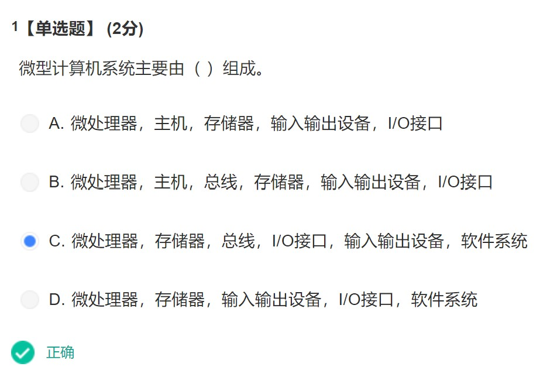

<!--  -->

例题1.2:
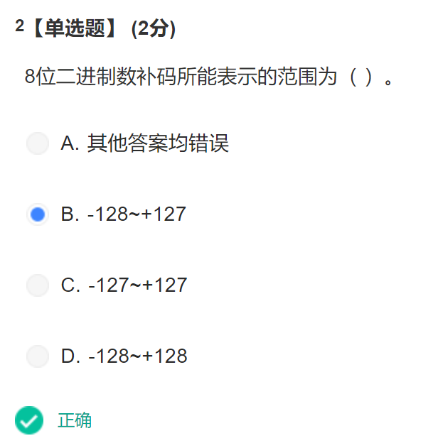

<!--  -->

在微型机系统的不同层次结构中,有不同的总线.和CPU直接相连的总线称为CPU总线,CPU总线按功能分为三组,即数据总线DB(data bus),地址总线AB(address bus),和控制总线CB(control bus)

例题1.3:
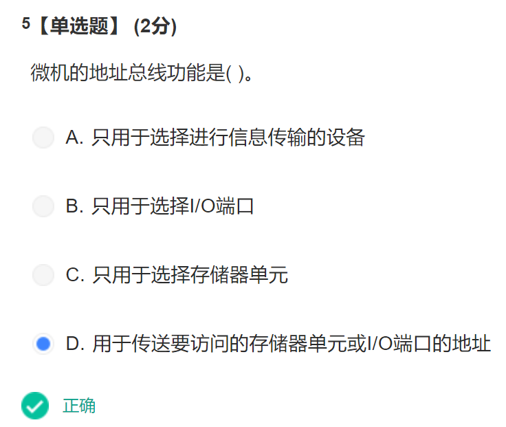

<!--  -->

**微型计算机的性能指标**

1. CPU的位数
   CPU的位数是最重要的性能指标,**位数越多,功能越强**,并可使主存能够配置的容量越大,当前,**常用微型机中的CPU为32位**,包括80386,80486,Pentium微型机系统,但实际上现在更常用的是Pentium IV
2. CPU的主频
   CPU的主频决定了计算机系统的运算速度,早期的CPU主频用MHz,现在用GHz,当前的Pentium IV的主频达到4.0GHz
3. 内存容量和速度
   **内存容量越大,信息处理能力越强**
4. 硬盘容量
   硬盘容量越大,村的信息越多(*这还用说嘛...*)

## 第二章 16位和32位微处理器

微处理器的性能指标最主要的是以下两项:

1. 字长
   指CPU能同时处理的数据位数,也成为数据宽度,字长越长,计算能力越高,速度越快
2. 主频
   即CPU的时钟频率,这和CPU的运算速度密切相关,主频越高,运算速度越快

### 2.1 16位微处理器8086

8086的编程结构:8086是Intel系列的16位微处理器,有**16根数据线**和**20根地址线**

**2022年11月21日 10点09分**
**换课看了,现在在看潘继强的微型计算机概述,看看试试吧**

> 8086:字长16位,主频5-10MHz,16根数据总线和20根地址总线,可寻址1MB的内存空间和64KB的I/O端口

> 8088:准16位微处理器,内部寄存器,运算器以及内部数据总线都是按照16位来设计的,外部数据总线只有8条

#### 8086的编程结构

> 编程结构: 程序员所看到的处理器里面的结构图,实际上CPU内部的物理结构和编程结构是有一定出入的

<!-- 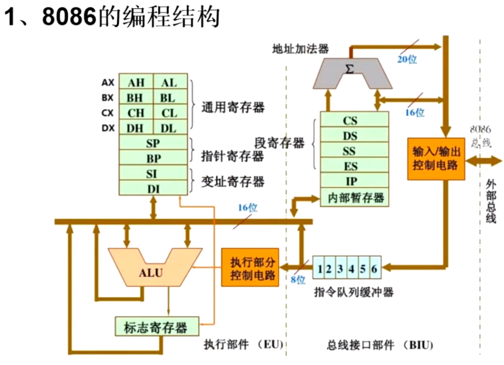 -->


- 总线接口部件(BLU)通过外部总线连接主存和接口
  1. 取址,保存在内存中的指令代码,按照所写程序的逻辑顺序,读入CPU当中
  2. 取操作数,把保存在内存单元中的操作数读入CPU当中
  3. 存数,将数据存入内存中
- 执行部件(EU),负责指令的执行,核心部分-ALU(算术逻辑部件

##### 执行部件(EU)

**4个通用寄存器-AX,BX,CX,DX,每个里面又分为XH,XL**
**H表示高八位,L表示低八位**

1. AX:数据寄存器,协作ALU完成算术运算
2. BX:基址寄存器,保存线性数据结构的基地址(a[0])
3. CX:计数寄存器,计数控制,记录循环确切执行的次数
4. DX:数据寄存器,保存一些数据

SP,BP,指针寄存器,专门用于访问栈,SP称为栈顶指针寄存器,BP为基址指针寄存器
SI,DI,变址寄存器,SI称为原变址寄存器,DI表示目的变址寄存器,不能分割,通常用于保存变量的地址

---

**情景:数组求和**

> ADD AX,[BX] ;将BX所指向的数据加到AX里面
> ADD BX,2    ;将BX指向下一个元素
> 遍历完这个数组,此时BX的位置已经发生很大变化了

改写:

> MOV SI,0  ;将SI寄存器的值初始化为0,DI也可以替换SI
> ADD AX,[BX+SI*2]   ;SI代替了BX发生变化,2代表比例因子,只能是一个偶数,一般用的都是2/4/8
> INC SI            ;加一指令,相当于i++,继续循环

BX就没有发生变化,方便以后对该数组进行操作

*又是好多天没看,2022年11月26日 17点25分,看到第三集-8086的编程结构-2*

---

**标志寄存器**

ALU有一个指向标志寄存器的箭头,表示ALU会把一些运算结果保存到标志寄存器当中,它是按照16位来设计的,但只有9(6+3)位是用来作为标志位的,其余7位保持空闲状态

6个条件码标志(ZF,CF,SF,PF,AF,OF),记录程序运行时的状态信息,3个控制标志

##### 总线接口部件(BLU)

1. 20位的地址加法器,两个输入
2. 段寄存器(CS,DS,SS,ES)
   - CS:16位的代码段寄存器
   - DS:16位的数据段寄存器
   - ES:16位的扩展段寄存器
   - SS:16位的堆栈段寄存器
3. IP指令指针(与PC类似,PC的功能:每次取址,PC就会加一)
4. **指令队列缓冲器**(6个字节单元,而8088只有4个字节单元,内存中的指令进入到指令队列缓冲器中进行排队,此时执行部件,只需要在指令队列缓冲器中读取队首的指令代码,这样就可以实现执行部件和总线接口部件**并行**的方式,5和6单元为空时,会自动从内存中取址,填满为止,保证执行部件执行指令时,总线接口部件在取址),总而言之,**这个指令队列缓冲器的意义就是让执行部件和总线接口实现并行的工作状态,也就是说,执行指令和取指令的时间可以重叠,从而提高CPU的利用率**.

---

BIU和EU的动作管理

- 时钟周期---CPU的基本时间计量单位,由计算机的主频决定
- 时钟周期 = 1/主频
- 8086的主频为5MHz,所以8086的时钟周期 = 1/(5*10^6Hz) = 0.2*10^-6s = 200ns
- 总线周期---CPU访问一次存储器或I/O端口所需要的时间

---

8086的总线周期
为了取得指令和数据,BIU执行一个总线周期,在8086中,一个基本的总线周期由4个时钟周期组成,将这4个时钟周期分别称为4个状态,T1-T4
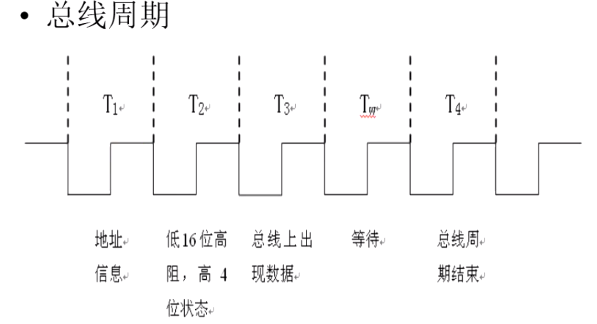

<!--  -->

一个总线周期是4个时钟周期,而时钟周期=1/主频,8086的主频是5MHz,时钟周期是200ns,所以8086的一个总线周期是4*200ns=800ns

> 二十位的地址加法器是如何工作的?
> 先看下面的讲解:

#### 8086的存储器和I/O编址

1. 8086的存储器组织

- 8086的存储器是以字节为单位组织的,具有**20条地址总线**,**所以可寻址的存储器地址空间容量为1MB**(2^20B),每个字节对应一个唯一的地址,地址范围为00000H~FFFFFH
- 一个存储单元中存放的信息称为该存储单元的内容,如00000H单元的内容为11H,记为(00000H)=11H
- **存储器中两个连续的字节,定义为一个字**,一个字中的每个字节,都有一个字节地址,字的低字节存放在低地址中,高字节存放在高地址中
  看图吧

<!-- 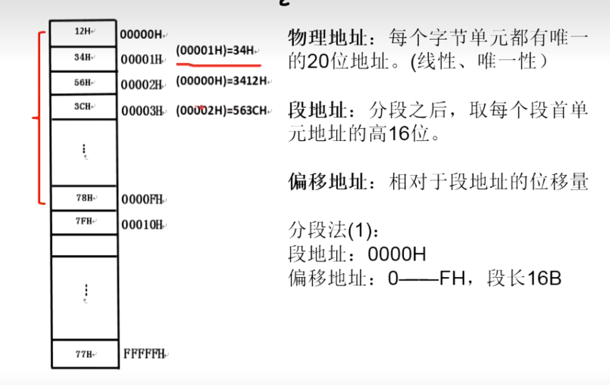 -->


也就是说,8086微处理器,可以按照字节来访问:(00001H)=34H,也可以按照字来访问:两个字节(00000H)=3412H

---

**各种地址概念**

- 物理地址:每个字节单元都有唯一的20位地址(线性,唯一性)
- 段地址:分段之后,取每个段首单元地址的高16位(8086的1MB就可以分为64K个段,1MB就是2^20B,因为16个字节分成一个段,所以2^20/2^4 = 2^16 = 2^10 * 2^6 = 64K)
- 偏移地址:相对于段地址的位移量
  分段法(1)
  段地址:0000H
  偏移地址: 0---FH,段长16B

分段法(2)
段地址:0000H
偏移地址: 00---FFH,段长256B(16*16)

分段法(3)
段地址:0000H
偏移地址:0000-FFFFH,段长64KB

有点奇怪,先说为什么20位地址就是五位呢?因为一位十六机制数是4位二进制,5个16进制数就是20位

物理地址怎么计算呢?
物理地址=段地址*16D+偏移地址
其实就是段地址左移一位,然后与偏移地址相加

<!-- 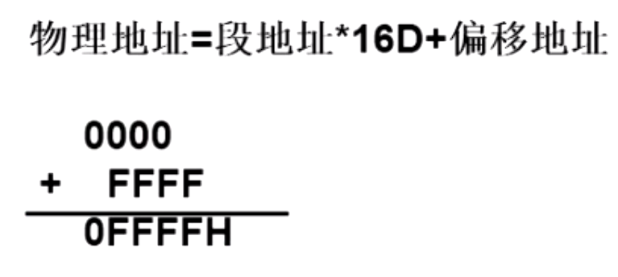 -->


**这就是地址加法器的工作原理**

**分段之后,段地址就在段寄存器中保存(CS,DS,SS,ES),偏移地址在6个寄存器中(IP,BX,SP,BP,SI,DI)**
该看P4了

#### 8086的引脚信号

我动摇了,感觉是真的看不完了,速成课?

害,人生路漫漫

> 8086引脚

1. 8086的AD有16个(0-15),可以同时访问两个字节的存储单元,而8088只有8个(0-7),只能同时访问1个字节的存储单元
2. 8086的指令队列缓冲器是6个字节,8088是4个字节
3. 地址/数据复用引脚:地址/数据分时复用输入输出信号线.AD0到AD15,这16个引脚,被同时当作地址总线和数据总线来用,A表示地址,D表示数据,四个时钟周期,T1状态时,AD传输地址,T3状态传输数据
4. 还有地址/状态复用引脚(A16/S3-A19/S6),T1状态传输物理地址最高的4位(当访问存储器时,T1状态输出A19~A16,与AD15~AD0一起构成访问存储器的20位物理地址),T2,T3,T4状态,传送状态信息,当CPU访问I/O端口时,不使用这四个引脚,A19~A16保持0
5. 在T2~T4状态,S6为0表示8086CPU当前与总线相连,S5表示中断允许标志位IF的当前设置,S4S3用来指示当前正在使用哪个段寄存器
6. 最大工作模式不考(31-24的意义,最大工作模式就是右边括号里的意义,而最小工作模式就是左边的意义)
7. 其余都是控制引脚(除去3个,接地和接电源的)
8. 最小还是最大工作模式,要看33号引脚接的是什么,33号引脚是MN/MX非,当接的是+5V时,CPU处于最小模式,如果接地,则CPU处于最大模式
9. READY,数据"准备好"信号,输入,高电平有效,当CPU对存储器或I/O接口进行操作时,在T3周期开始采样READY信号,**若是高电平,则表示存储器或I/O设备已准备好**,反之,表示被访问的存储器或I/O设备还未准备好数据,此时在T3周期以后插入Tw周期,然后再在Tw周期中再采样READY信号,直到READY变为高电平时Tw周期才可以结束,进入T4周期,完成数据传送.**总结来说,READY就是用于判断存储器或I/O设备是否已经准备好,准备好,为高电平,低电平,则是未准备好,此时加入Tw,然后等到存储器或I/O设备准备好为止
10. NMI,非屏蔽中断引脚,输入上升沿触发,为*什么叫非屏蔽呢?因为NMI不受IF(中断允许标志)的影响,优先级较高*
11. INTR,可屏蔽中断请求信号,输入,高电平有效,若此信号有效,表明有外设提出了中断请求,这时若IF(中断允许标志) = 1,则当前指令执行完成后立即响应中断
12. RESET,CPU的复位信号,输入,高电平有效,复位信号使处理器**马上结束现行操作**,对处理器内部寄存器进行初始化,对标志寄存器,IP,DS,SS,ES及指令队列清零,而将CS设置为FFFFH,当复位信号变为低电平时,CPU从FFFF0H,**段地址*16加上偏移地址,段地址是FFFF,左移一位,变成FFFF0H,加上0000H,即为FFFF0H,如果是二进制,要左移4位,16进制是左移1位**开始执行程序,后面会接上一个JMP指令(表示无条件跳转指令,会跳转到操作系统的入口),8086要求复位脉冲宽度不得小于4个时钟周期
13. TEST非:用于测试的输入信号,当WAIT指令执行时,该信号低电平有效,CPU就进入等待状态
14. M/IO非:存储器/I/O控制信号,输出,用来区分当前操作是访问存储器还是访问I/O端口,**如为高电平,表示PCU和存储器之间进行数据传输,如为低电平,表示CPU和I/O端口之间进行数据传输**
15. WR非:**该引脚输出为低电平时,表示CPU正处于写存储器或写I/O端口**,具体到底是那种写操作则由M/IO非信号决定
16. RD非:**低电平有效,表示CPU正在进行存储器或I/O端口读操作**,具体是读取内存单元中还是I/O端口中的数据,这决定于M/IO非信号,**WR非和DR非属于是互斥关系**
17. DT/R非,用于确定数据传送的方向,高电平为发送方向,即CPU写数据到存储器或I/O端口,低电平为接受方向,即CPU到存储器或I/O端口读数据,中的T就相当于WR非,而R非,就相当于RD非,分别表示写和读
18. DEN非,该信号有效时,表示数据总线上有有效数据
19. ALE:高电平有效,当他有效时,表名CPU送出有效的地址信号,因此它常作为锁存控制信号将A0~A19所存于地址锁存器中
20. INTA非,CPU输出的中断响应信号,是CPU对外部输入的INTR中断请求信号的响应,当CPU决定响应可屏蔽中断时,会在INTA非引脚上发两个连续的负脉冲,第一个负脉冲:通知外部设备的接口,它发出的中断请求已经得到允许,外设接口收到第二个负脉冲后,往数据总线上放**中断类型码**(0~255,256个中断,),从而CPU便得到了有关此中断请求的详尽信息
21. HOLD:输入信号高电平有效,**用于向CPU提出总线保持请求**,当某一部件要占用系统总线时,可以通过这条输入线向CPU提出请求
    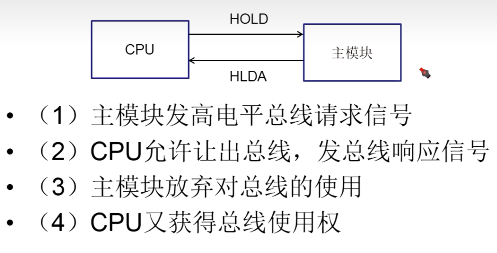

<!--  -->

*为什么picgo用不了了，去github里看了看,找到一个类似的问题,但是没有解答,我评论了,看看结果吧*
*我好想知道原因了,应该是token过期了*
*G了,原本是准备删token,不小心把ssh删了,现在博客G了*
22. HLDA:CPU对HOLD请求的响应信号,高电平有效的输出信号.

**下面的是速成课的内容**

---

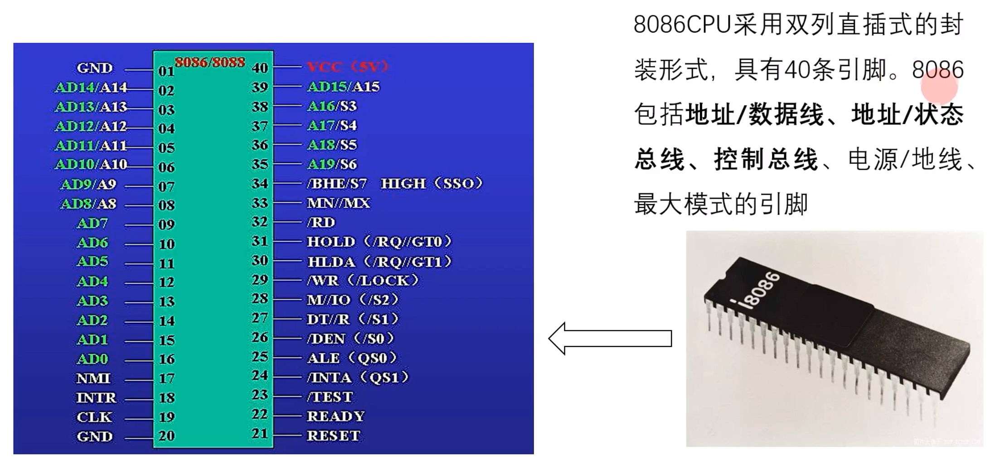

<!--  -->

*先把图放着,然后明天打字*
地址/数据总线
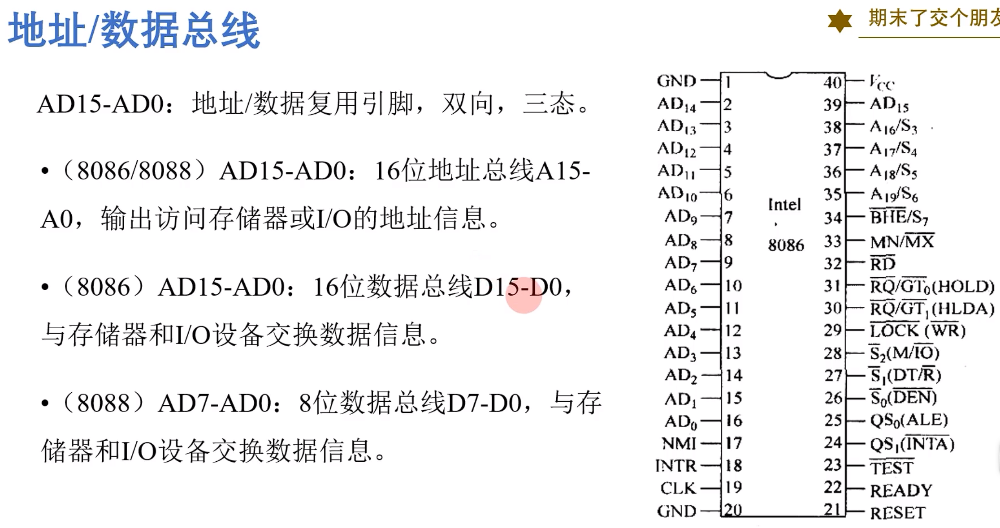

<!--  -->

地址状态总线
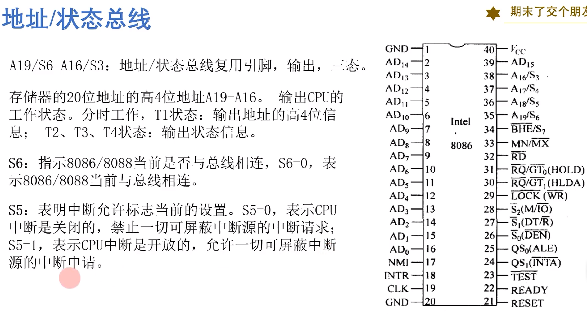

<!--  -->

控制总线
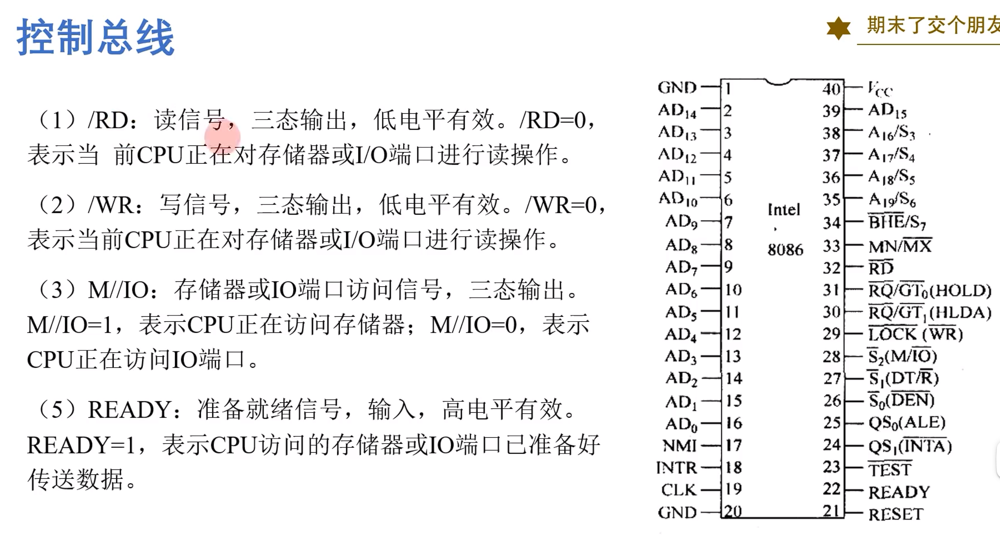

<!--  -->

---

#### 8086的存储结构

逻辑地址和物理地址
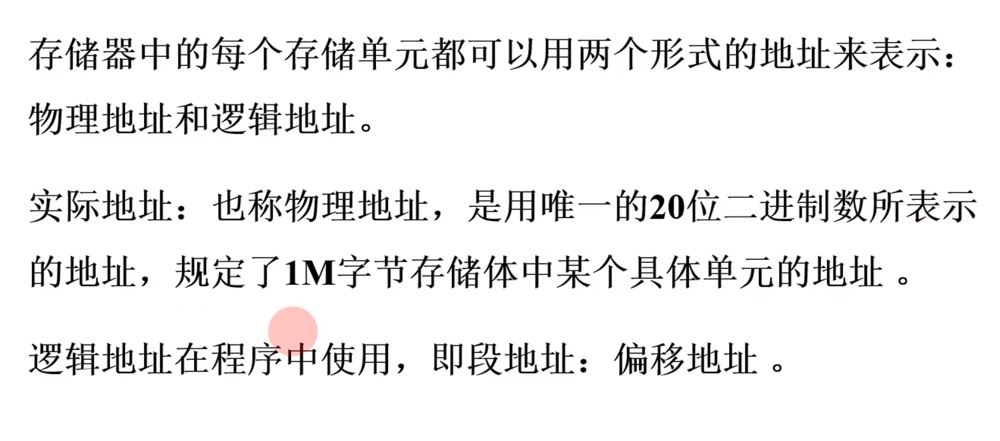

<!--  -->

计算物理地址


<!--  -->

堆栈
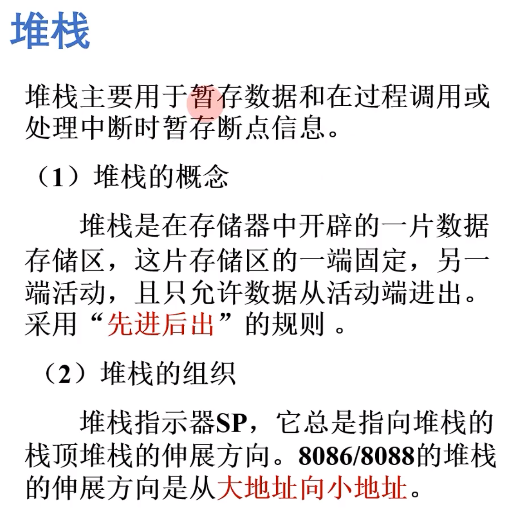

<!--  -->

操作时序
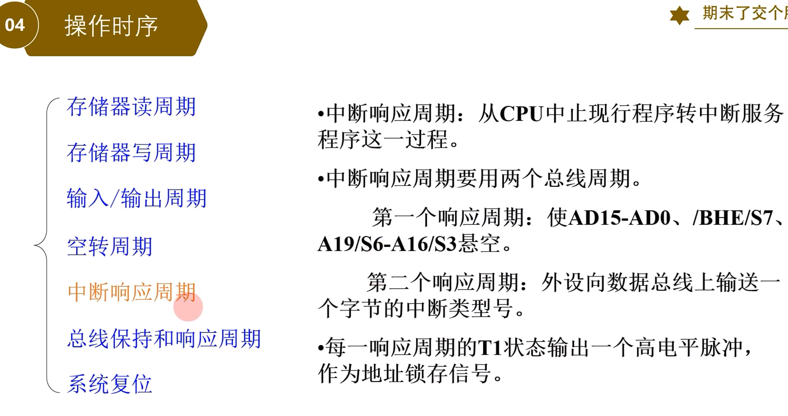

<!--  -->

## 考试

```
第一章 什么叫微型计算机系统

第二章 什么叫微处理器

第三章 指令系统-简答题:写寻址方式（系统寻址方式）-给几条指令，说明原操作数和目的操作数的寻址方式是什么
MOV/OUT指令

第四章 存储器 连接，寻址范围

第五章 CPU与IO接口的通信方式（都有什么，还有特点，优缺点）--简答题

几个接口芯片
主要看8259和8255

8253和8251会有几个计算
8251串行接口的波特率，每分钟传输多少个字/多少位数

比较关键—中断-概念，几个中断的特点
可屏蔽中断和非可屏蔽中断的区别（操作上有什么区别）

中断类型码-如何根据中断类型码算出码地址（4倍的关系？）

学习通的作业
```

> 什么叫微型计算机系统?

1. 微型计算机包括**微处理器,存储器,I/O接口**
2. 微型计算机系统是由**微型计算机,显示器,输入输出设备,电源及控制面板等组成的计算机系统**

> 什么叫微处理器
> 微处理器包括**运算器,控制器,寄存器**

# 学习通的作业

## 第一章

> [x+y]的补=x补+y补

正数的补数是它本身,负数的补是除符号位外取反加一

## 第二章

> 当8086发现READY引脚变为0时,它将在总线周期中插入**等待周期**

Ready引脚为高电平时,表示CPU或者IO设备准备好了

> 总线的基本功能是

传输同步,仲裁控制,总线驱动

> 标志位SF表示**运算结果的最高位是否为1**

> 8086CPU能够实现指令的并行执行,主要是因为**其内部设置了4字节的指令预取队列**

> 指令流水线是指**微处理器顺序地执行执行

> 若已知存储单元的逻辑地址为1EB0H:2300H,其对应的物理地址是**20E00H**

$$
物理地址 = 段地址*16 + 逻辑地址
$$

> 若已知DS=8402H,则当前数据段最后一个单元地址是**9401H**

$$
逻辑地址 = 段地址 * 16(段基地址最低为补上一个0)
$$


偏移地址的范围就是`0000H~FFFFH`,所以最后一个就是段基地址*16+FFFFH


# 考试


第一章 什么叫微型计算机系统

第二章 什么叫微处理器

第三章 指令系统-简答题:写寻址方式（系统寻址方式）-给几条指令，说明原操作数和目的操作数的寻址方式是什么
MOV/OUT指令

第四章 存储器 连接，寻址范围

第五章 CPU与IO接口的通信方式（都有什么，还有特点，优缺点）--简答题

几个接口芯片
主要看8259和8255

8253和8251会有几个计算
8251串行接口的波特率，每分钟传输多少个字/多少位数

比较关键—中断-概念，几个中断的特点
可屏蔽中断和非可屏蔽中断的区别（操作上有什么区别）

中断类型码-如何根据中断类型码算出码地址（4倍的关系？）

学习通的作业
