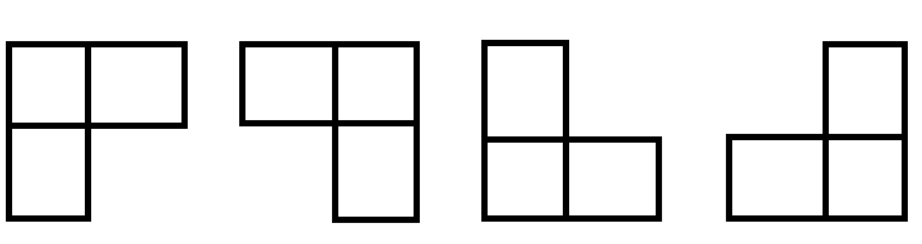

# 分治--棋盘覆盖

> 问题描述

> 在一个2^k*2^k个方格组成的期盼中,恰有一个方格与其他方格不同,称该方格为特殊方格,并且有特殊方格的棋盘为一个特殊棋盘.显然,特殊方格会出现在4^k个位置中的一个位置,进而形成4^k个不同情况的特殊棋盘,例如当k=2,就会有16个不同情况的特殊棋盘

要用到4中不同形态的骨牌-三个方格的组合:

<!--  -->


除了特殊方格,一共有4^k-1个方格,所以需要(4^k-1)/3个骨牌

*我到现在其实还不知道应该干什么*

> 解题思路

1. 当k>0时,将2^k * 2^k棋盘分割称4个2^(k-1)\*2^(k-1)个子棋盘,即如果k=2,则原来是4\*4的棋盘,现在分割成4个2*2的棋盘了,这时特殊方格一定在其中一个子棋盘中,而其他3个子棋盘中是没有特殊方格的
2. 将三个没有特殊方格的子棋盘转化为有特殊方格的子特殊棋盘,可以用一个L型骨牌覆盖这3个子棋盘的会和处,会和处被覆盖后,这3个子棋盘上被覆盖的方格就成为了该子棋盘的特殊方格,这样就将问题转化为了4个较小规模的棋盘覆盖子问题,且4个子问题相互独立
3. 当k=0时,此时棋盘就只有一个方格了,已经无法分割,停止分割

> 代码实现

```java
public class Chessboard {

    // size 规模
    final static int N = 4;

    // 全局变量 tile，表示 L 型骨牌编号
    static int tile = 1;
    // 全局数组 board [N][N]，表示棋盘
    static int[][] board = new int[N][N];

    public static void ChessBoard(int tr, int tc, int dr, int dc, int size) {
        // 如果棋盘只有一个方格，退出。
        if (size == 1)
            return;
        int t = tile++;
        // 将棋盘分隔为4个子棋盘
        int s = size / 2;

        // 特殊方格在左上角的子棋盘中
        if (dr < tr + s && dc < tc + s)
            ChessBoard(tr, tc, dr, dc, s);
        else {
            // 特殊方格不在左上角子棋盘中时，将左上角子棋盘中的右下角方格设置为特殊方格
            board[tr + s - 1][tc + s - 1] = t;

            // 此时左上角子棋盘的右下角方格为特殊方格，然后递归调用
            ChessBoard(tr, tc, tr + s - 1, tc + s - 1, s);
        }

        // 特殊方格在右上角子棋盘中
        if (dr < tr + s && dc >= tc + s)
            ChessBoard(tr, tc + s, dr, dc, s);
        else {
            // 特殊方格不在右上角子棋盘中时，将右上角子棋盘中的左下角方格设置为特殊方格
            board[tr + s - 1][tc + s] = t;

            // 此时右上角子棋盘的左下角方格为特殊方格，然后递归调用
            ChessBoard(tr, tc + s, tr + s - 1, tc + s, s);
        }

        // 特殊方格在左下角子棋盘中
        if (dr >= tr + s && dc < tc + s)
            ChessBoard(tr + s, tc, dr, dc, s);
        else {
            // 特殊方格不在左下角子棋盘中时，将左下角子棋盘中的右上角方格设置为特殊方格
            board[tr + s][tc + s - 1] = t;

            // 此时左下角子棋盘的右上角方格为特殊方格，然后递归调用
            ChessBoard(tr + s, tc, tr + s, tc + s - 1, s);
        }

        // 特殊方格在右下角棋盘中
        if (dr >= tr + s && dc >= tc + s)
            ChessBoard(tr + s, tc + s, dr, dc, s);
        else {
            // 特殊方格不在右下角子棋盘中时，将右下角子棋盘中的左上角方格设置为特殊方格
            board[tr + s][tc + s] = t;

            // 此时右下角子棋盘的左上角方格为特殊方格，然后递归调用
            ChessBoard(tr + s, tc + s, tr + s, tc + s, s);
        }
    }

    public static void main(String[] args) {
        // 此时特殊方格为 board[1][2]
        ChessBoard(0, 0, 1, 2, N);
        for (int i = 0; i < N; i++) {
            for (int j = 0; j < N; j++)
                //字段宽度，3，表示每个数字占3个位置，小于3，则左端补空格
                System.out.printf("%3d", board[i][j]);
            System.out.println();
        }
    }
}

```

思考：
上面也说了,2^k*2^k的棋盘,要用(4^k)-1 / 3个骨牌,比如说4*4的棋盘,k=2,则有4*2-1=15,15/3 = 5,个骨牌

# 贪心--活动安排

[视频教程](https://www.bilibili.com/video/BV1r3411N7jh/?spm_id_from=333.337.search-card.all.click&vd_source=5815ab19beeaab6a8ea7a561cba20233)

用贪心算法求解活动安排问题

> 贪心算法的整体思想
> 找出整体当中每个小的局部最优解,合起来形成整体上的一个最优解

1. 大化小
2. 找策略-活动安排的贪心策略是**活动结束时间最早的**-为什么,是为了给后面留出更多的时间,以安排更多的活动(第一个活动的结束时间小于等于第二个活动的开始时间-Sj>=Fi)
3. 小凑大-把所有的活动总结在一起

而活动安排问题就是要在所给的活动集合中选出**最大的相容活动子集合**

伪代码

1. 输入活动的开始时间Si及结束时间Fi
2. 将第一个活动存入答案数组中
3. 判断当下一个活动的开始时间是否大于当前活动的结束时间

伪代码如下:

```cpp
int cnt = 1; //计数,初始存在第一个时间段
int temp = t[0].end; // temp是第一个活动的结束时间
for(int i = 1;i<N;i++){
    if(t[i].begin>=temp){  // t[i].begin是当前活动的开始时间
        cnt++;
        temp = t[i].end; // 更新temp
    }
}
```

然后我应该是差不多看明白了
算法并不难,或者说是很简单,因为就是比较一下第一个活动的结束时间和下一个活动的开始时间,让 `Sj >= Fi`

拿Java写的

```java
package com.zzmr;

public class ActiveManage {


    public static void main(String[] args) {

        //int[] s = new int[]{1, 3, 0, 5, 3, 5, 6, 8, 8, 2, 12};
        //int[] f = new int[]{4, 5, 6, 7, 8, 9, 10, 11, 12, 13, 14};
        int[] s = new int[]{1, 2, 5, 8, 4, 12, 11};
        int[] f = new int[]{4, 5, 7, 9, 10, 13, 15};
        int n = 7;

        int[] B = new int[n];
        int i = activeManage(s, f, B, n);
        System.out.println("已安排的活动个数为" + i);
    }


    static int activeManage(int[] s, int[] f, int[] B, int n) {

        B[0] = 1; // 这是结果的数组，因为默认第一个活动已经安排进去了，所以B[0] = 1
        int cnt = 1; // 计数，初始存在第一个时间段
        int temp = f[0];  // 第一个活动的结束时间
        for (int i = 1; i < n; i++) {
            if (s[i] >= temp) {
                B[i] = 1;
                cnt++;
                temp = f[i];
            }
        }
        print(B);
        return cnt;
    }

    private static void print(int[] B) {

        System.out.println("安排了以下活动");
        for (int i = 0; i < B.length; i++) {
            if (B[i] == 1) {
                System.out.printf("%d ", i + 1);
            }
        }
        System.out.println();

    }


}
```

# 动态规划--数塔问题

---

# 算法课设

> 蛮力算法找出4样东西的价格算法实现

题目详情:

在美国有一个连锁店叫7-11店，因为这个商店以前常常是早晨7点开门，晚上11点关门。有一天，一个顾客在这个店里挑了四样东西,然后到收银台去交钱。营业员拿起计算器，按了一些键，然后说道：“总共是$7.11。”这个顾客开了个玩笑说：难道你们的店名叫7-11，所以我就要付$7.11吗？”营业员没听出这是个玩笑，回答说：“当然不是的!我已经把这四样东西的价格相乘才得出这个结果的!”顾客一听非常吃惊，“你怎么把它们相乘呢?你应该把他们相加才对嘛。”营业员答道：“哦，对了，真是抱歉,我今天非常头疼，所以把键按错了。”然后营业员将结果重算了一遍，将这4件商品的价格加在一起，然而，令他们俩更吃惊的是总和也是$7.11。设计蛮力算法找出这4样东西的价格各是多少？

---

1. 化成整数好计算些,设三个数都是x.xx,就是两位小数,都乘以100,那么它们的乘积就是7.11X100X100X100X100 = 711000000,就有一个表达式 `a*b*c*d=711000000`
2. `int a = 1;a<711;a++`,这是第一层循环,到第二层循环:`int b = 1;b<711-a;b++`,然后是第三层循环 `int c = 1;c<711-a-b;c++`此时a,b,c的值都已经算是确定了,所以 `d = 711-a-b-c`
3. 最后判断一下 `if(a*b*c*d == 71000000)`,如果相等,则证明已经找到了这四个数(相加的地方上面已经确定好了)
4. 所以结果为:`a = 3.16,b = 1.5,c = 1.25, d = 1.2`

> 24个顺序,为什么是24呢,因为 `A^4,4 = 4*3*2 = 24`

---

代码如下:

```java
package com.zzmr;

public class Algorithm711 {
    public static void main(String[] args) {
        int cnt = 0; // 计数
        for (int a = 1; a < 711; a++) {
            for (int b = 1; b < 711 - a; b++) {
                for (int c = 1; c < 711 - a - b; c++) {
                    cnt++;
                    int d = 711 - a - b - c;
                    if (a * b * c * d == 711000000) {
                        System.out.printf("a的值为%.2f  ", a * 1.0 / 100);
                        System.out.printf("b的值为%.2f  ", b * 1.0 / 100);
                        System.out.printf("c的值为%.2f  ", c * 1.0 / 100);
                        System.out.printf("d的值为%.2f  ", d * 1.0 / 100);
                        System.out.println();
                    }
                }
            }
        }
        System.out.println("共计算" + cnt + "次");
    }
}

```

运行结果如下


---

# 考试

### 算法设计与分析基础

1. 算法的基本特性(1.1节)
   1. 输入
   2. 输出
   3. 有穷性
   4. 确定性
   5. 可行性
   6. 除了以上五个,还有以下特征
      1. 正确性
      2. 健壮性
      3. 可理解性
      4. 抽象分级
      5. 高效性
2. 算法设计的一般过程(1.1节)
   1. 理解问题
   2. 选择算法设计技术
   3. 设计并描述算法
   4. 手工运行算法
   5. 分析算法的效率
   6. 实现算法
   7. 
3. 算法时间复杂度分析(2.1节)
   

### 穷举法

1. ~~百钱百鸡问题(3.1节)~~
   - 代码:

```java
      package com.zzmr;

      public class Chicken {
          public static void main(String[] args) {
              int count = 0;
              int z = 0;
              for (int x = 0; x <= 20; x++) {
                  for (int y = 0; y <= 33; y++) {
                      z = 100 - x - y;
                      // 这个地方是个坑，要注意z必须是能整除3的，或者说是3的倍数
                      if (5 * x + 3 * y + z / 3 == 100 && z % 3 == 0) {
                          count++;
                          System.out.printf("x的值为%d ", x);
                          System.out.printf("y的值为%d ", y);
                          System.out.printf("z的值为%d ", z);
                          System.out.println("=======");
                      }
                  }
              }

              if (count == 0) {
                  System.out.println("无解");
              } else {
                  System.out.println("一共有" + count + "个解");
              }
          }
      }
```

2. ~~0/1背包问题:穷举法得到n个物品的全部子集算法(3.4节)~~
   - 用蛮力法解决0/1背包问题,需要考虑给定n个物品集合的所有子集,找出所有总重量不超过背包容量的子集,计算每个可能子集的总价值,然后找到价值最大的子集
   - 对于一个具有n个元素的集合,其子集数量是2^n,所以,不论生成子集的算法效率有多高,蛮力法求解0/1背包问题都会导致一个Ω(2^n)的算法
   - 代码

```java
package com.zzmr;

import java.util.ArrayList;
import java.util.List;

public class KnapsackProblem {

    public static void main(String[] args) {

        //物品价值
        int[] values = new int[]{4, 2, 10, 1, 2};
        //物品重量
        int[] weights = new int[]{12, 1, 4, 1, 2};

        List<String> list = new ArrayList<>();

        int max = 0;
        int index = 0;

        System.out.println("全部子集");
        for (int i = 0; i < 32; i++) {
            /**
             * 将0~32十进制数转化为2进制
             */
            String s = Integer.toBinaryString(i);

            /**
             * 转化为二进制后，在前面补零
             */
            for (int j = 0; j < 5; j++) {
                if (s.length() < 5) {
                    s = "0" + s;
                }
            }
            list.add(s);

            /**
             * 即可得到00000~11111序列
             */

            /**
             * 定义两个变量
             * weight
             * value
             */
            int weight = 0;
            int value = 0;

            for (int j = 0; j < 5; j++) {
                if (s.charAt(j) == '1') {
                    weight = weight + weights[j];
                    value = value + values[j];
                }
            }

            System.out.println(s + "  weight=" + weight + "~~~~~~" + "value=" + value);


            /**
             * 找到最大的价值和最大价值的位置
             */
            if (weight < 15) {
                if (value > max) {
                    max = value;
                    index = i;
                }
            }

        }


        System.out.println("最佳组合的序列：" + list.get(index));
        System.out.println("组合中每个物品详情：");

        /**
         * 对应序列有了，现在根据序列找到01111对应的是哪几个物品
         */


        for (int i = 0; i < 5; i++) {
            if (list.get(index).charAt(i) == '1') {
                int x = i + 1;
                System.out.println("有第" + x + "个物品");
                System.out.println("该物品的价值为：" + values[i] + ", 该物品的重量为" + weights[i]);
                System.out.println("========");
            }
        }

        System.out.println("max: " + max);

    }

}

```

### 分治法

1. ~~分治法的设计思想(4.1.1节)~~
   1. 将一个难以直接解决的**大问题划分成一些规模较小的子问题,分别求解各个子问题,再合并子问题的解得到原问题**的解
   2. 分治法求解过程
      1. 划分
      2. 求解子问题
      3. 合并
2. 快速排序分治算法(4.2.2节)
   1. 快速排序的时间复杂度

$$
O(n\log_2{n})
$$

3. 棋盘覆盖问题分治算法(4.3.2节)

   1. 骨牌个数:(4^k  -1)/3
   2. 棋盘覆盖问题的时间复杂度为 `O(4^k)`
   3. 代码就很有问题了,到现在我还是不怎么明白这个代码
   4. ```java
      package com.zzmr;

      public class Chessboard {

          // 棋盘大小 N*N
          static int N = 8;

          // 骨牌编号
          static int t0 = 0;

          // 二维数组-棋盘
          static int[][] board = new int[N][N];

          /**
           *
           * @param tr    左上角方格行号
           * @param tc    左上角方格列号
           * @param dr    特殊方格行号
           * @param dc    特殊方格列号
           * @param size
           */
          static void chessBoard(int tr, int tc, int dr, int dc, int size) {
              //等于1，到达边界，返回
              if (size == 1)
                  return;
              // L型骨牌编号
              int t = ++t0;
              // 划分棋盘，1划4
              int s = size / 2;

              // 特殊方格在左上角的子棋盘中
              if (dr < tr + s && dc < tc + s)
                  chessBoard(tr, tc, dr, dc, s);
              else {
                  // 特殊方格不在左上角子棋盘中时，将左上角子棋盘中的右下角方格设置为特殊方格
                  board[tr + s - 1][tc + s - 1] = t;
                  print(board);

                  // 此时左上角子棋盘的右下角方格为特殊方格，然后递归调用
                  chessBoard(tr, tc, tr + s - 1, tc + s - 1, s);
              }

              // 特殊方格在右上角子棋盘中
              if (dr < tr + s && dc >= tc + s)
                  chessBoard(tr, tc + s, dr, dc, s);
              else {
                  // 特殊方格不在右上角子棋盘中时，将右上角子棋盘中的左下角方格设置为特殊方格
                  board[tr + s - 1][tc + s] = t;
                  print(board);

                  // 此时右上角子棋盘的左下角方格为特殊方格，然后递归调用
                  chessBoard(tr, tc + s, tr + s - 1, tc + s, s);
              }

              // 特殊方格在左下角子棋盘中
              if (dr >= tr + s && dc < tc + s)
                  chessBoard(tr + s, tc, dr, dc, s);
              else {
                  // 特殊方格不在左下角子棋盘中时，将左下角子棋盘中的右上角方格设置为特殊方格
                  board[tr + s][tc + s - 1] = t;
                  print(board);

                  // 此时左下角子棋盘的右上角方格为特殊方格，然后递归调用
                  chessBoard(tr + s, tc, tr + s, tc + s - 1, s);
              }

              // 特殊方格在右下角棋盘中
              if (dr >= tr + s && dc >= tc + s)
                  chessBoard(tr + s, tc + s, dr, dc, s);
              else {
                  // 特殊方格不在右下角子棋盘中时，将右下角子棋盘中的左上角方格设置为特殊方格
                  board[tr + s][tc + s] = t;
                  print(board);

                  // 此时右下角子棋盘的左上角方格为特殊方格，然后递归调用
                  chessBoard(tr + s, tc + s, tr + s, tc + s, s);
              }

          }

          public static void main(String[] args) {

              print(board);

              chessBoard(0,0,1,1,N);
              System.out.println("最终结果：");
              print(board);
          }

          private static void print(int[][] board) {
              for (int i = 0; i < N; i++) {
                  for (int j = 0; j < N; j++) {
                      System.out.printf("%3d",board[i][j]);
                  }
                  System.out.println();
              }
              System.out.println();
          }


      }

      ```
4. 递归函数和递归算法(p74)

   1. 递归就是子程序(或函数)直接调用子集或通过一系列调用语句间接调用自己,是一种描述问题和解决问题的基本方法
   2. 递归必须具备以下两个基本要素,才能在有限次计算后得到结果
      1. 边界条件:确定递归到何时终止,也称为递归出口
      2. 递归模式:大问题是如何分解为小问题的,也称为递归体
5. 折半查找算法(5.2.1节)

   1. 也是减治法的内容-取有序序列的中间记录作为比较对象,若给定值与中间记录相等,则查找成功;若给定值小于中间记录,则在中间记录的左半区继续查找;若给定值大于中间记录,则在中间记录的右半区继续查找.不断重复此过程,直到查找成功,或所查找到额区域无记录,查找失败.
   2. 折半查找的时间复杂度为

   $$
   O(log_2{n})
   $$

   3. 折半查找的算法实现
   4. ```java
      package com.zzmr;

      public class BinSearch {

          public static void main(String[] args) {
              int[] r = {1,2,3,4,5,6,7,8,9,10};
              int i = binSearchMethod(r, r.length, 10);
              System.out.println(i);
          }

          static int binSearchMethod(int[] r, int n, int k) {
              int low = 0, high = n - 1; // 初始化查找区间0~n-1
              int mid;
              while (low <= high) {// 区间存在-low不能大于high
                  mid = (low + high) / 2;   
                  if (k < r[mid]) {  // 目标值k小于中间值，则将high = mid -1
                      high = mid - 1;
                  } else if (k > r[mid]) {  // 目标值k大于中间值，则将low = mid + 1
                      low = mid + 1;
                  } else {
                      return mid;  // 两种情况除外，则是k = mid
                  }
              }
              return 0;
          }

      }

      ```

### 动态规划法

1. 动态规划法的设计思想(6.1节)

   1. 动态规划法将待求解问题分解成若干个相互重叠的子问题,每个子问题对应决策过程的一个阶段(还有最优子结构性质)
   2. 最优子结构:问题的最优解包含了其子问题的最优解
2. 动态规划和分治法的区别

   1. 分治法是将一个难以直接解决的大问题划分成若干较小规模的子问题，分别求解各个子问题，再合并子问题的解，得到原问题的解
   2. 动态规划法是将待求解问题分解成若干个**相互重叠**的子问题，每个子问题对应决策过程的一个阶段
   3. 所以就是-两个算法都是讲问题划分成子问题,但是分治法划分的子问题是没有重叠的,而动态规划法划分的子问题是相互重叠的,且每个子问题对应决策过程的**一个阶段**
3. 数塔问题动态规划算法(6.1.3节)

   1. 初始化数组maxAdd的最后一行为数塔的底层数据
   2. 从第n-1层开始直到第1层对下三角元素maxAdd `[i][j]`执行下属操作
      1. **maxAdd[i][j] = d[i][j] + max{maxAdd[i+1][j],maxAdd[i+1][j+1]}**
      2. 如果选择下标j的元素,则path[i][j] = j,否则 `path[i][j] = j+1`
   3. 输出最大数值和maxAdd[0][0]
   4. 根据path数组确定每一层决策的列下标,输出路径信息

```java
package com.zzmr;

public class DataTower {

    static int[][] d = {{8}, {12, 15}, {3, 9, 6}, {8, 10, 5, 12}, {16, 4, 18, 10, 9}};

    static int n = d.length;

    static int maxAdd[][] = new int[n][n];
    static int path[][] = new int[n][n];

    static int DataTower() {//数塔问题

        int i, j;
        //初始数组maxAdd的最后一行为数塔的底层数据
        for (j = 0; j < n; j++)
            maxAdd[n - 1][j] = d[n - 1][j];


        for (i = n - 2; i >= 0; i--) {
            for (j = 0; j <= i; j++) {
                if (maxAdd[i + 1][j] > maxAdd[i + 1][j + 1]) {
                    maxAdd[i][j] = d[i][j] + maxAdd[i + 1][j];
                    path[i][j] = j;
                } else {
                    maxAdd[i][j] = d[i][j] + maxAdd[i + 1][j + 1];
                    path[i][j] = j + 1;
                }
            }
        }

        System.out.print("路径为：" + d[0][0]);
        j = path[0][0];
        for (i = 1; i < n; i++) {
            System.out.print("-->" + d[i][j]);
            j = path[i][j];
        }
        System.out.println();

        return maxAdd[0][0];
    }


    public static void main(String[] args) {

        //输出数塔
        System.out.println("数塔:");
        for (int i = 0; i < d.length; i++) {
            for (int j = 0; j <= i; j++) {
                System.out.printf("%-5d", d[i][j]);
            }
            System.out.println();
        }
        System.out.println("数组的最大数值为:" + DataTower());


        System.out.println("maxAdd:");
        for (int i = 0; i < d.length; i++) {
            for (int j = 0; j <= i; j++) {
                System.out.printf("%-5d", maxAdd[i][j]);
            }
            System.out.println();
        }

        System.out.println();
        System.out.println("path:");
        for (int i = 0; i < d.length; i++) {
            for (int j = 0; j <= i; j++) {
                System.out.printf("%-5d", path[i][j]);
            }
            System.out.println();
        }
    }

}
```

4. 0/1背包问题动态规划算法(6.3.3节)

### 贪心法

1. 贪心法的设计思想(7.1.1节)
   1. 以局部最优解获得近似最优解
2. 背包问题贪心算法(7.3.1节)
3. 活动安排问题贪心算法(7.3.2节)
   1. 两种贪心策略:最早开始和最早结束
   2. 最早结束,判断下一个活动的开始时间是否大于当前活动的结束时间

```java
package com.zzmr;

public class ActiveManage {


    public static void main(String[] args) {

        int[] s = new int[]{1, 3, 0, 5, 3, 5, 6, 8, 8, 2, 12};
        int[] f = new int[]{4, 5, 6, 7, 8, 9, 10, 11, 12, 13, 14};
        //int[] s = new int[]{0,1,3,5,7,9,9,12};
        //int[] f = new int[]{2,3,6,9,9,12,11,14};
        //int[] s = new int[]{1, 2, 5, 8, 4, 12, 11};
        //int[] f = new int[]{4, 5, 7, 9, 10, 13, 15};
        int n = s.length;

        int[] B = new int[n];
        int i = activeManage(s, f, B, n);
        System.out.println("已安排的活动个数为" + i);
    }

    static int activeManage(int[] s, int[] f, int[] B, int n) {

        B[0] = 1; // 这是结果的数组，因为默认第一个活动已经安排进去了，所以B[0] = 1
        int cnt = 1; // 计数，初始存在第一个时间段
        int temp = f[0];  // 第一个活动的结束时间
        for (int i = 1; i < n; i++) {
            if (s[i] >= temp) {
                B[i] = 1;
                cnt++;
                temp = f[i];
            }
        }
        print(B);
        return cnt;
    }

    private static void print(int[] B) {
        // 根据B数组的1还是0来判断是否安排，如果是1，则为安排

        System.out.println("安排了以下活动");
        for (int i = 0; i < B.length; i++) {
            if (B[i] == 1) {
                System.out.printf("%d ", i + 1);
            }
        }
        System.out.println();

    }
}
```

4. 多机调度问题贪心算法(7.3.3节)
   1. 多级调度问题要求给出一种作业调度方案,使所给的n个作业在尽**可能短**的时间内由m台机器加工处理完成
   2. 想法:*贪心法求解多机调度问题的贪心策略是最长时间作业优先,即把处理时间最长的作业分配给最先空闲的机器,这样可以保证处理时间长的作业优先处理,从而在整体上获得尽可能短的处理时间.* 按照最长处理时间作业优先的贪心策略,当m>=n时,只要将机器i的[0,ti)时间区间分配给作业i即可;当m<n时,首先将n个作业按其所需的处理时间从大到小排序,然后依次顺序将作业分配给最先空闲的处理机
   3. 伪代码:
      1. ```java
         1. 将数组t[n]由大到小排序,对应的作业序号存储在数组p[n]中
         2. 将数组d[m]初始化为0
         3. for(i=0;i<m;i++)
            3.1 将前m个作业分配给m个机器:S[i] = {p[i]};
            3.2 d[i] = t[i]
         4. for(i=m;i<n;i++)
            4.1 j=数组d[m]中最小值对应的下标
            4.2 将作业i分配给最先空闲的机器j: S[i]=S[j]+{p[i]}
            4.3 机器j将在d[j] 后空闲: d[j] = d[j] + t[i]
         ```

### 回溯法

1. 解空间树及其生成方法(8.1.1节)

   - 复杂问题常常有很多的可能解,这些可能解构成了问题的**解空间**,并且可能解的表示方式隐含了解空间及其大小.
   - 问题的解空间一般用**解空间树**(也称状态空间树)的方式组织,树的根节点位于第一层,表示搜索的初始状态,第2层的节点表示对解向量的第一个分量做出选择后到达的状态,第一层到第二层的边上标出第一个分量选择的结果,依次类推,从树的根节点到叶子结点的路径就构成了解空间的一个可能解
2. 回溯法的设计思想(8.1.2节)

   - 回溯法在包含问题的所有可能解的解空间树中,从根节点触发,按照**深度优先**的策略进行搜索
   - 回溯法的设计思想:回溯法从解空间树的根结点出发,按照深度优先策略搜索满足约束条件的解,在搜索至树中某结点时,先判断该结点对应的部分解是否满足约束条件,也就是判断该节点是否包含问题的(最优)解,如果肯定不包含,则跳过以该节点为根的子树,即所谓**剪枝**,否则,进入以该结点为根的子树,继续按照深度优先策略进行搜索
3. 0/1背包问题的回溯算法(课程讲授及实验)
4. 回溯法是指**具有限界函数的深度优先生成法**
5. N皇后问题(8.3.1节)

   - 伪代码如下

   ```java
   1. 初始化解向量x[n]
   2. k=1
   3. while(k>=1)
       3.1 把皇后k拜访在下一列的位置,即x[k]++
       3.2 从x[k]开始依次考察每一列,如果皇后k摆放在x[k]位置不发生冲突,则转步骤3.3
       3.3 若n个皇后已全部摆放,则输出一个解,算法结束
       3.4 若尚有皇后没有摆放,则k++,转步骤3摆放下一个皇后
       3.5 若x[k]出界,则回溯,x[k] = -1 ,k-- 转步骤3重新摆放皇后k
   4 退出循环,说明n皇后问题无解
   ```

### 自学内容

1. 分支限界法的设计思想(9.1.1节)
   1. 分支界限法首先确定一个合理的**界限函数**,并根据界限函数确定目标函数的解 `[down,up]`,然后,按照**广度优先**策略搜索问题的解空间树,在分支结点上,依次扩展该节点的所有孩子节点,
2. 图灵机与可计算问题(10.1.2节)
   1. Turing论题:一个问题是可计算的,当且仅当它在图灵机上经过**有限步骤后得到正确的结果**
3. NP类问题(10.2.3节)
   1. 如果对于某个判定问题Ⅱ,存在一个非负整数k,杜宇输入规模为n的实例,能够以O(n^k)的时间运行一个非确定性算法,得到yes或no的答案,则该判定问题Ⅱ是一个NP类问题

---

> 复习方法
>
> 1. 对考试范围内容重点复习,对每种算法的设计思想,典型案例,算法计算过程要求熟练掌握
> 2. 对典型案例要求会编写算法和C程序在计算机上运行验证
> 3. 从试题库中选做3-5套试题强化训练

> 考试题型
>
> 1. 单选题-20分
> 2. 填空题-10分
> 3. 简单题-20分
> 4. 计算题-20分
> 5. 算法设计题-30分
