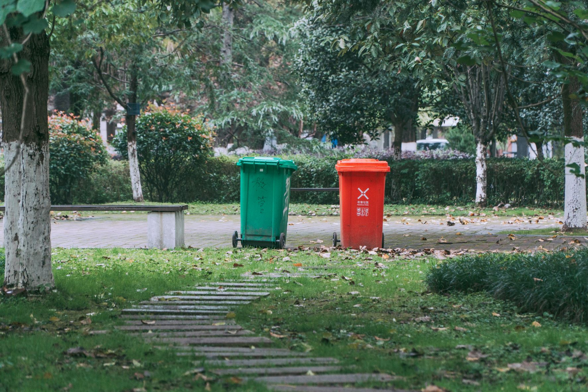
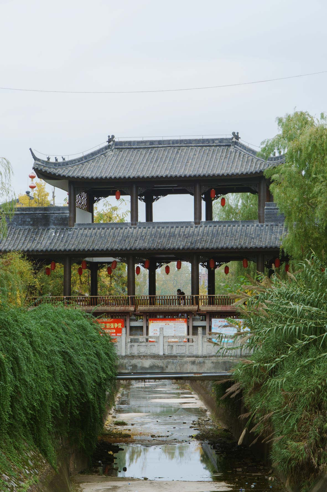
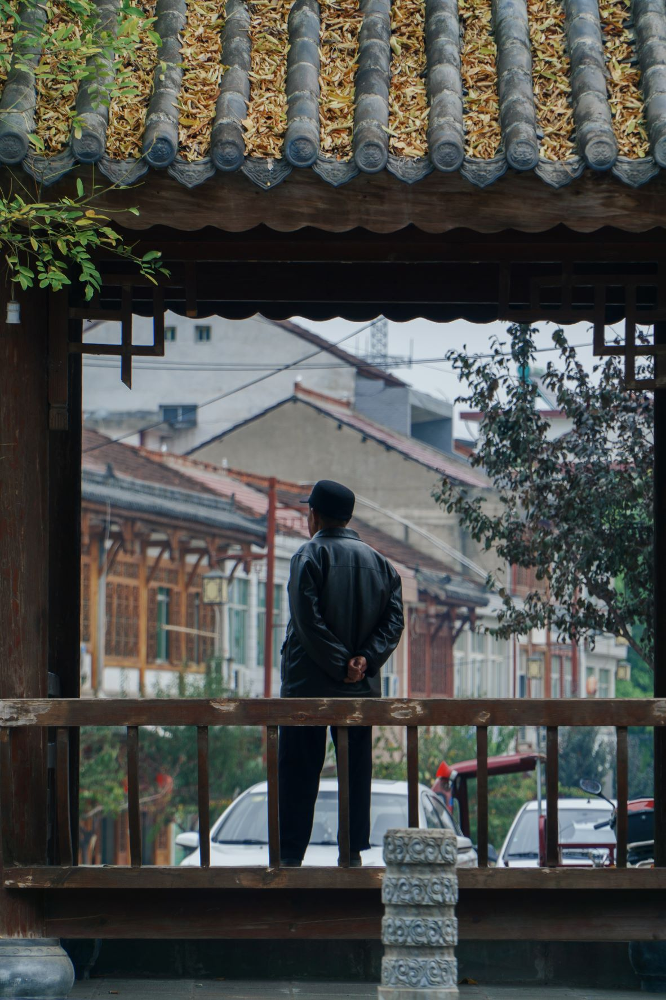
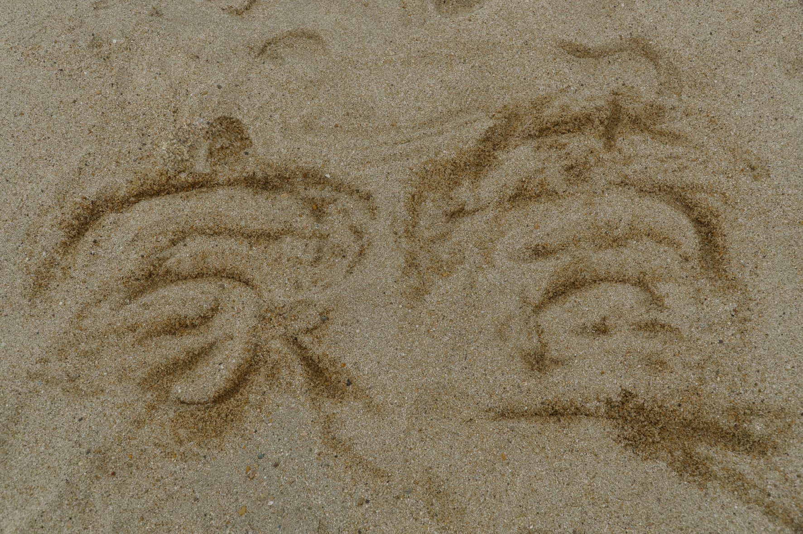
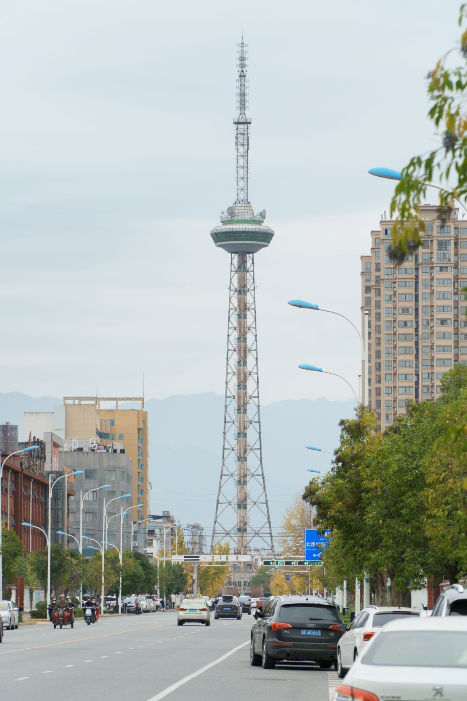
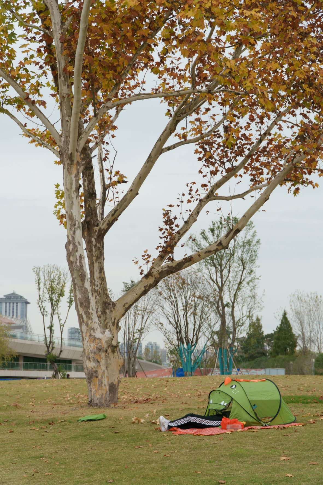
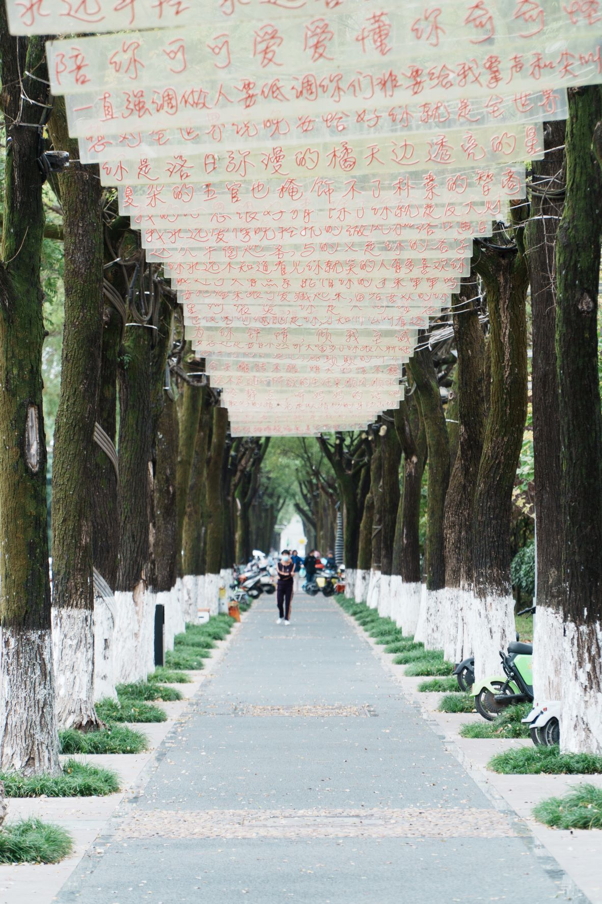
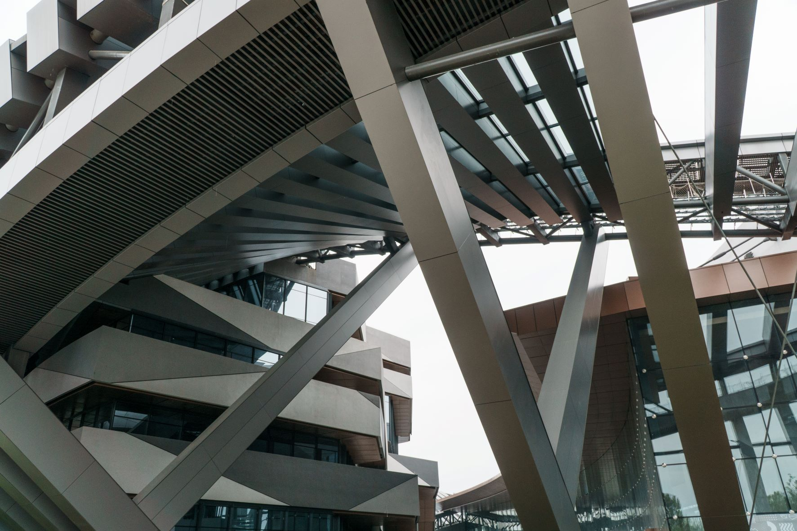
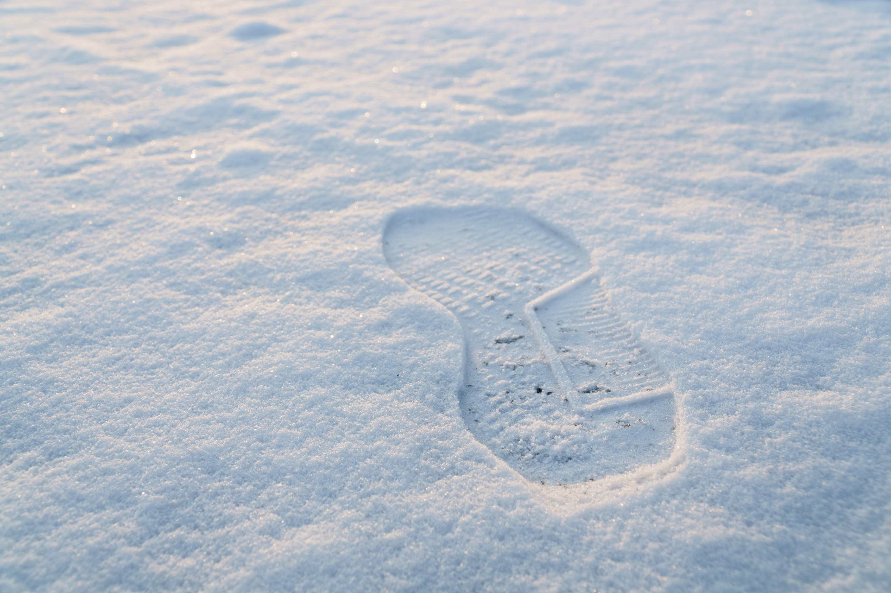

# 22-10

## 10-27

没错,《我们的生活并不难啊》以后就在这里写了
以后就用这种格式吧,一级标题是年份-月份,二级标题是月份-日期
上一次写还是开学的时候,在word里扣扣嗖嗖,哈哈哈
这么多天
啥都没写,主要是无事发生吧,从开学到现在几乎每天都在做核酸,现在汉中的疫情又越发严重,但是有好转的倾向了?希望把,早点解封,早点能出去玩了,在宿舍真的能把人憋疯
还有一件事,家萱开始给我计划任务了,帮我过四级,如果过的话寒假请她吃大虾
哈哈哈哈,寒假成绩也出不来啊,但是寒假还是要聚一下的。毕竟这么久没好好聚过了，上次聚还是暑假，也不算是聚，匆匆忙忙吃了碗瘦肉丸
嗯，在这里写，就可以写的像个日记了，在word里写个日期都麻烦，写个目录更是麻烦，还是markdown好用，哈哈哈。
好了，下次见

## 10-29

上次出去拍照还是10-1,今天下着雨也出去溜达了一会

拍了一张我感觉很棒的照片:



<!--  -->

怎么样,是不是很有感觉,这么多天没用相机,竟有些生疏了,跟焦都不怎么会用了
嗯
加油!

## 10-30

都是啥事，人工智能第二次作业忘了提交了,妈的,我去跟达列雄求情了,看看能不能再开一会,他还没回我.

回了,但没完全回,因为没交的人多,所以他直接在群里发了哈哈哈哈,还好还好

ok,继续看SSM,现在学到AOP了

# 22-11

## 11-02

嗯，线下课，如期到来

好消息是可以出校了

嗯

## 11-05

武乡镇，凤头沟

发展经济，保障供给

一天还是很舒服的


<!--  -->

拍到了两张感觉不错的照片


<!--  -->



<!--  -->

晚上还去吃了烧烤

## 11-07

好忙，好鸡巴忙

人工智能的实验好恶心，什么鬼都是，没用的多西，害

我只想好好躺一躺哈哈哈哈，啥也不想干，衣服没洗，头没洗

不如现在去洗衣服，然后去洗澡

## 11-13

最近好累

因为各种各样的屁事

还有就是做项目

做项目是真的累，要考虑的东西是真的多

哦对，看看昨天徒步出去玩拍的照片

还是有好几张满意的呢



<!--  -->

这张照片，是很久之前就想拍的，一直没拍哈哈哈



<!--  -->

天汉楼附近，有人在这搭帐篷，挺好看的一张



<!--  -->

还有这些句子
“陪你可可爱爱，懂你奇奇怪怪”



<!--  -->

还有大剧院，暂时未建好，但是大体结构已经很好看了
就这样，下次见

## 11-14

天已放晴，但是课排的很满，是没时间出去玩了，浪费了这么好的天气

希望等周六周日还能有这么个天气

好想去汉山啊，计划这么久了，可是还没去，下周末或者下下周末吧，早晚要去

还有，明天体测，不测50和1000，希望明天那个什么立定跳远能跳远一点，别拉后腿，而50/1000就只能听天由命了

## 11-19

先说一下体测成绩

跳远2.2，身高体重满分，引体向上7个，肺活量刚及格，坐位体前屈20.9

后面就看50/1000了，希望能拿个好分数，这样不至于不及格，毕竟引体向上几乎没拿到分

还有就是项目快结束了

## 11-29

50跑了8.4,1000跑了4.01,跟去年差不多,还是这个成绩,但是是真的累,跑完50就感觉左大腿有点抬不起来了,揉了一会还是能跑
主要是人太多了,太多了,在第三圈跑的至少有200m,要是一直在内圈跑,感觉进4分内是完全没问题的
都是后话了,反正及格了,现在立定跳远和引体向上的成绩还没出,总分就已经60分了,今年是稳了

2022年11月29日 23点28分
没错,现在都快12点了,今天停了一天的电,下午原本说是6点来电,拖到8点,一下午啥都没干,睡了一下午
所以现在完全不困

还有就是,下周(十五周)就要考试了,下周周一考软件知识产权,周三考人工智能
其实我现在挺慌得,但是又不知道怎么复习,然后后面紧接着就是软工,微机算法,操作系统,一堆要考试的,还有习近平的作业还没下.
这学期的事是真的多啊
哦对,还有四级马上就要考试了
没错,还有10天就要考了
可能这学期又是寄了,因为单词都没背完
害
现在干什么?
我也不知道,我感觉现在好迷茫啊

要不看会儿微机?
感觉可以哎
看到几点?
不知道
看看吧

# 22-12

## 12-2

有新消息了,人工智能是开卷考,还有就是我们又是线上上课了,附近高风险有很多,所以还是要好好在学校呆着
挺麻烦的,希望考试往后延期个一个星期
全部提前,我真是受不了啊
完全顶不住了

还有就是寒假准备配个键盘,买个ciy68的套件,然后买一套灰木轴V3,再买套粉色的键帽,樱花或者是吐丝猫都行吧
可能会买一些美纹纸什么的东西,把内部填充一下,然后组一个麻将音的键盘
好了
看微机
微机是非常难搞的

**世事无常**
今天写微机,写着写着发现picgo用不了了
然后搜了一些解决办法,无解
最后想到可能是token过期了
去github,没找到token,找到了ssh
手贱把ssh给删了
然后,然后博客就打不开了

又找到之前的教程,看了一番,试了一番
最后的解决办法是:

1. 先删除.ssh文件夹中的文件,全部删除,一个别留
2. 在git-bash中再新建ssh--

```
ssh-keygen -t rsa -C "jim7yang@gmail.com"
```

3. 然后在将.ssh文件夹中的id_rsa.pub文件打开,复制内容
4. 在github中新建ssh,粘贴内容

然后就好了? 突然就好了,刷新了好多次,然后就能进去了
虚惊一场

## 12-5

纸醉金迷一般
打了几天的游戏
四级是没复习
因为我打算等到3月考了-没人陪我了
所以我也是回家,今天把该办的事都办了,明天再去学校里转转吧,说不定下次来,可能就快毕业了毕竟这个疫情,谁也说不准
这几天是一直在打派派
我好想渐渐明白了这个游戏的玩法
哈哈哈哈哈
有时候匹配到的人也挺有意思
有一次决赛圈,我一个,他们两个,互相抽了几枪,电没了
人家也冲过来了,哈哈哈哈
蹲起蹲起蹲起
然后我开了个大,跳了段舞,自己跑毒圈里了
还有一次
一只狗到决赛圈,中间也被打过好几次
最后关头,我直接冲上去,拿下一个人头,然后当着人家的面处决,回甲,然后还有一个已经碎甲的动力小子,一梭子带走
吃鸡!哈哈哈哈

## 12-6

安排就绪
下午收拾一下衣服
行李
明天就准备回家了
好耶

## 12-7

到家了
坐了一天的车
是真的累

## 12-8

test68改造计划
算不上什么计划,只是玩着玩罢了

首先就是美纹纸,在PCB背面,也就是接触底棉的那一面,贴上3层美纹纸
那你知道哪一面是PCB的背面吗
背面会有一个电源接口,也就是连接电源排线的地方
**开关和电源排线的地方要开口啊,扎小孔就行了**

然后就是买一个轴下垫了
淘宝买一个10块的吧

好了好了,算好了,价格一共是115(套件＋轴体)+0.27(美纹纸)+34.66(天气键帽)+3.96(eva轴下垫)=153.89
差不多是150块
这一套,也算挺值吧
就等到货自己装好了
哈哈哈哈哈哈哈哈
多下来的轴下垫还能给我的RK用,岂不美哉

## 12-10

键盘装好了

声音还可以
很HIFI哈哈哈哈啊哈哈
就是可能会误触？这个比例果然好逆天啊
用起来有一种说不上来的感觉
有些键位就是知道在哪，但是就是按不到
哈哈哈哈
需要时间来适应

看着你和他,走到我面前,微笑着对我说声,好久不见,未必永远才算,爱的完全,一个人的成全熬过三个人的纠结

发什么疯
还是等等吧
先用一段时间,看看情况,然后就送给粥粥了
这个配色反正她是喜欢
哈哈哈哈哈哈哈哈哈哈

《我最闪亮》
灯光和花火一起闪亮
也亮不过我的梦想
我路途的开场
我沿路的徽章
风沙搁浅的希望
时光让脸庞渐渐发光
风雪把悲伤轻轻吹凉
被淋湿的翅膀
才拥有穿越过
那暴风雨的力量
曾经的我想唱就唱我最闪亮
这一年夏天有最感动的阳光
你给我梦想
我勇敢往前闯
风吹雨打拍拍肩膀
现在的我想唱就唱我最闪亮
这一年夏天有最温暖的目光
记忆的远方
我披戴的荣光
照进天窗擦亮梦想
我最响亮
灯光和花火一起闪亮
也亮不过我的梦想
我路途的开场
我沿路的徽章
风沙搁浅的希望
时光让脸庞渐渐发光
风雪把悲伤轻轻吹亮
被淋湿的翅膀
才拥有穿越过
那暴风雨的力量
曾经的我想唱就唱我最响亮
这一年夏天有最感动的阳光
你给我梦想
我勇敢往前闯
风吹雨打拍拍肩膀

舒服了
但是感觉这个键盘的声音还是有点大
但是已经挺舒服了
已经比我之前的小得多了
那个毕竟是个段落轴
这个是个线性轴
不是一个东西

## 12-11

可以说我对这个键盘很满意，就是有些细节，比如地盘不是平的，从下面看一直是弯了一点，不过无伤大雅

又不是不能用哈哈啊哈

但是我原来的这个价盘，垫了一层没问之后，感觉没什么变化啊

笑死

## 12- 12

我感觉后面可以学一下如何润轴了

毕竟这两个键盘的大键实属闹心哈哈哈哈

是真的难用又闹心

因为手感区别太大了

这个茶抽根本没有茶轴的感觉，另一个灰木轴又太肉了

## 12-13

我好像发现问题了

刚才去B站翻了一下评论区，发现有几个和我情况类似的，都是不挂梯子访问不了

可能是最近墙又高了吧

封控了一些github的页面

所以间歇性进不去，就像github一样

真是奇了个怪

害

GTA的年底大更新来了,说实话,挺有新意的,尤其是致幻之后的关卡设计,比一些普普通通的打打杀杀要有意思

还有那个杀兔兔的,这么大的兔子哈哈哈哈哈

真的,还没做完,不知道后面是啥样的

还做吗?

洗个脸继续吧!

## 12-30

这么多天没写,你猜猜都发生了什么,SpringBoot的视频我快看完了

还有我买了Apex的通行证

还有,我应该是阳了

但是已经好了

今天就不发烧了,挺奇怪的,3天就能好?难道我没阳,只是普通感冒?但是我在家里穿一样的衣服,怎么会突然发烧

一下烧到38.5

这体温不太正常啊

现在还有点咳嗽

问题不大

# 23-1

## 1-11

无

## 1-15

昨天夜里的雪下的挺大的

今天早上起了个大早

去逛了逛，还是那条小路，回来的时候发现桥对面还有一条，下次可以去另一边看看

看看图


<!--  -->

就拍了没几张照片，外面实在是太冷了

太冷了

## 1-27

现在就是非常混乱

非常迷茫
迷茫
迷茫

## 1-28

反正要开学了
看看书吧
备考

## 1-29

今天去找周周了，骑了一个小时的电车吧

匆匆忙忙

希望药有作用

## 1-31

没想到啊,下学期教的javaee,竟然是框架
那正好可以复习一下SSM
刚好
嗯

# 23-2

## 2-7

今天周家萱来平舆了啊哈哈哈哈

我去南站接她，然后一起去了挚园，随便拍了些照片

叙叙旧，聊聊生活


罚站大熊猫哈哈哈啊

中午一起去吃了酸菜鱼

然后又去逛了逛商场

她买了件裤子

然后又随便逛了逛，最后送她去车站，小电车没电了，和她走了过去

她奶奶还让我去她家玩哈哈哈哈哈

等有机会吧

嗯

下次一定

## 2-11

到学校了

累死了

这次返校比之前都累

从早上8点出发，下午一点到郑州

然后又是等，等，等，等

原本是下午3点半的票
改签到2点50
哈哈哈哈哈哈哈
晚上6点半到学校

取了取快递
在东门外

今天是真累
想去吃饺子
饺子
但是原来的饺子店没了
我也不知道搬哪了
那家店左边的左边又开了一家面和饺子
我买了一小份芹菜的
味道还可以
但是说实话
并没有原来的好吃
害
有机会问问现在的老板
看原来的饺子店搬哪去了

好了
睡觉

## 2-13

一直在下雨

我还是不知道原来的饺子店哪去了

但是说实话

这家新的饺子店还行

先吃着吧

嗯

马上要考试了

但是我这几天一直在打游戏

打游戏

这几门课都是0的状态啊

真是一点没听的这种

害

加油吧

走一步看一步

## 2-14

昨天晚上俺奶走了

来的时候就快不行了吧

人老了啊

这应该是我最近的一次-亲人的离去

好像也没啥感觉

只不过是一种说不上来的感觉罢了

可能我这人就这样吧

人老了，挡也挡不住

小时候俺爷走，我好像还不咋记事，模模糊糊记得一些细节

但是实在是想不起来了

就连他的样子都不咋能想得起来了

哦

今天闫芳嘉胃不舒服

跟他一块去医院了

中心医院哈哈哈哈哈

我也去过

看痘痘

还有开证明，就是荨麻疹的证明

那个医生的态度是真的不好

嗯

拜拜

## 2-15

害

人生老病死

## 2-20

晚上考完知识产权,出去吃饭了

吃了12.5的饺子

没吃饱,又去吃了一个烧饼

还挺好吃

以至于现在都还饱着(23点43分)

软工课设,又要做一个项目,我感觉可以直接做一个命令行的就好了,还特别简单

但是很明显,我不怎么知足,所以还是想整一个web项目

连下数据库啥的

明天把表一搞,然后就把前端框架搭建起来

剩下的应该就简单多了

希望吧

还有希望考试全过

## 2-27

token要过期了,更新了一下,这次设置是no expire永不过期
应该没啥问题

测试一下:


## 2-28

3.2号，也就是后天，就要考算法了，这可怎么办啊，发的题这么多，还这么难，根本不会啊

害

# 23-3

## 3-10

一转眼过了这么多天

算法考试早结束了，

结束的第二天去了趟汉山，我发了一篇博客，记录了一下整体的流程，也为下次去汉山打下了基础

然后就是回来歇了好久

中间还感冒了

现在感冒都没咋好透

后天考四级，没怎么复习，我现在只能祈祷

能飘过去了，不过我感觉不太可能哈哈哈哈

感冒赶紧好，然后四级考完，去汉江溜一圈，然后就是等待恒哲考完线代，找个时间就去爬华山，华山，祈祷能看到日出哈哈哈

华山去完，下一个目的地就是勉县了，去武侯祠看看，附近还有一个定军山，不知道咋样，反正肯定要在武侯祠看看

如果有可能的话还可以在定军山玩一圈

然后呢?

感觉还能再去一趟汉山,晚上在那过夜,拍银河!

哈哈哈哈哈哈

上去是没啥问题感觉,就是住是个问题

不知道能不能安安稳稳的睡一夜

毕竟是野外

要是有一辆车可能会好点吧

嗯

暂时就这几个地方

后面就是以后再说了

## 3-13

昨天还是出去溜了溜
很舒服
去了皇塘
人好多啊
又去了汉江

## 3-14

有感而发还是?

肯定是要参加比赛的,但是

能力够吗?

真不知道

害

这些事挺麻烦的

要是大一就开始学java,或许现在不是这个样子的了

嗯

现在还是在看软工的课设

---

2023年3月14日 21点47分

可能不够吧,搞了一天了,还没搞明白这个比发送附件的功能

感觉好难啊

又没有现成的教程

害

还是用的太少了

要不看看尚硅谷的那个什么尚医通?

我去看看


## 3-20

不知不觉又过了好几天

说说这几天发生了什么

上部不是说要写什么尚医通嘛
但是人家要求的是有学过spring cloud
没学过,所以去学,但是又要求有rabbitMQ的基础
所以我现在在看rabbitMQ

等几天看完了之后
就直接开始看SpringCloud吧
然后用到Nginx的时候再去认真学

或者就直接学习怎么用

哈哈哈哈哈
这一切都太长久了

需要太多的时间来学习了

只恨大一的时候没有好好学

现在是贼焦虑

害

还是要努力啊

这周五可能去爬华山-天气可以的话
就是担心天气不太好,然后就不行了

不行的话我们就去勉县了
我跟恒哲,骑过去大概50公里的样子

然后睡一晚,玩一天
晚上开始往回走

应该是这么回事

好了
熄灯了


睡觉

## 3-22

绝了啊,高烧不退

胃还不舒服

这甲流真的严重

还好现在胃好了
烧也退了一点了


## 3-23

高烧不退

嗯

## 3-29

马上4月份了

华山又被搁置了

所以我们明天准备去勉县

下午吧,直接骑过去

第二天看看武侯祠武侯墓啥的

现在看看路线


## 3-30

2023年3月30日 12点40分
准备出发

# 23-4

## 4-1

四月一了,只不过是阳历,阴历还早吧

勉县之行还算可以

回来的路上很舒服

路上风景特别好

嗯

## 4-4

浑浑噩噩的第几天了这是

也不知道怎么回事

啥都不会

嗯

过几天就是去华山了

现在还没定下来怎么去

票好少啊

嗯

决定是背着脚架

## 4-10

华山行的日志已经发到博客里了

体验还算不错

嗯

2023年4月13日 20点08分

新电脑到了,火影众颜U4

嗯

希望这个电脑能多用个几年


## 4-18

图床好像又G了,不挂梯子访问不了


但是上传是没问题的

真是奇怪

# 23-5

## 5-2

玩了好几天

舒服了,嗯

## 5-6

又是好几天没写了

今天上javaee的实验了,跟肥批讲了一节课的mybatis
甚至还有java的一些基础

