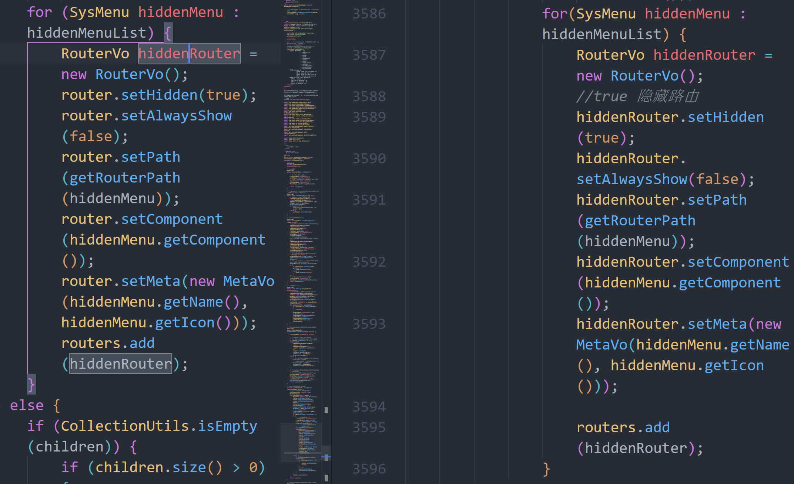

2023年5月2日 16点38分

看会儿新项目

这次笔记要好好写啊,不能像上次一样,那直接看不了了

这个里面好像有公众号模块,真的假的,如果是真的,那就更好了

# 云尚办公系统

## 1 课程特色

技术主流:涵盖SpringBoot,MyBatisPlus,SpringSecurity,Activiti,Redis,微信公众号等

## 2 课程大纲


这老师已经来了一句名言了:
>志不强者智不达,言不信者行不果

## 3 搭建环境

### 3.1 项目介绍

>结构介绍
1. 云尚办公系统是一套自动办公系统,系统主要包含:管理端和员工端
2. 管理端包含
    - 权限管理
    - 审批管理
    - 公众号菜单管理
3. 员工端采用微信公众号操作,包含
    - 办公审批
    - 微信授权登录
    - 消息推送等功能


这个里面竟然还有微信授权登录

### 3.2 搭建后端环境

>又用到了maven的聚合工程

工程结构:


这是建好的:


>引了一堆依赖,没啥难度也

### 3.3 MyBatis-Plus

之前一直没用过这个代码生成器,或者说,用过,但是用的不是这个,那这次就可以好好学学这个代码生成器怎么用了

MyBatis-Plus内置了代码生成器:采用代码或者Maven插件可以快速生成Mapper,Model,Service,Controller层代码,支持模板引擎,更有超多自定义配置来使用


#### 3.3.1 MP入门

所以要先建表啊

建好了,建了一个库,然后一个`sys_role`表,看配置文件:

application.yml
```yml
spring:
  application:
    name: service-oa
  profiles:
    active: dev
```

application-dev.yml
```yml
server:
  port: 8800
mybatis-plus:
  configuration:
    log-impl: org.apache.ibatis.logging.stdout.StdOutImpl # 查看日志
spring:
  datasource:
    type: com.zaxxer.hikari.HikariDataSource
    driver-class-name: com.mysql.cj.jdbc.Driver
    url: jdbc:mysql://localhost:3306/guigu-oa?serverTimezone=GMT%2B8&useSSL=false&characterEncoding=utf-8
    username: root
    password: '010203'
```

---

>MP会自动回填插入数据的id
```java
    @Test
    @DisplayName("添加")
    public void add() {
        SysRole sysRole = new SysRole();
        sysRole.setRoleName("角色管理员");
        sysRole.setRoleCode("role");
        sysRole.setDescription("角色管理员123");
        //rows 影响行数
        int rows = sysRoleMapper.insert(sysRole);
        System.out.println(rows);
        System.out.println(sysRole.getId());
    }
```

以前都不知道,比如说这个,**插入sysRole这个对象,然后再输出时,能拿到该对象插入数据库的自增id值**

---

>逻辑删除

这里又涉及到逻辑删除了,那个`is_deleted`字段

没想到MP中也封装了逻辑删除`TableLogic`,表示进行逻辑删除

```java
    /**
     * 配置文件中加入配置
     * 此为默认值，不需要修改  意思就是1为删除了,0为未删除
     * mybatis-plus:
     *  global-config:
     *    db-config:
     *      logic-delete-value: 1
     *      logic-note-delete-value: 0
     */
    @Test
    @DisplayName("根据id删除")
    public void deleteById() {
        int rows = sysRoleMapper.deleteById(12);
    }
```

加上`@TableLogic`之后,数据库表中如有`is_deleted`字段,则执行delete操作时,会自动进行逻辑删除-修改

这个时候,如果再执行查询全部的操作,会发现自动筛选了被逻辑删除的内容:


**也就是说,在查询时会自动在where后面加上`is_deleted = 0`**

---

>批量删除

```java
    @Test
    @DisplayName("批量删除")
    public void testDeleteBatchIds() {
        int result = sysRoleMapper.deleteBatchIds(Arrays.asList(10, 11));
        System.out.println(result);
    }
```

所以以后要做批量删除的话,就要将前端传来的所有id,封装成一个集合,然后放到ids里面(用asList)


---

>条件查询

Mp条件构造器:


- Wrapper: 条件构造抽象类,最顶端的父类
  - AbstractWrapper: 用于查询调价封装,生成sql的where条件
    - QueryWrapper: Entity对象封装操作类,不使用lambda语法
    - UpdateWrapper: Update条件封装,用于Entity对象更新操作
    - AbstractLambdaWrapper: Lambda语法使用Wrapper统一处理解析lambda获取column
      - LambdaQueryWrapper: 看名称也能明白就是用lambda语法使用的查询Wrapper
      - LambdaUpdateWrapper: Lambda更新封装Wrapper


条件查询测试(**普通版**):
```java
    @Test
    @DisplayName("条件查询")
    public void querySelect() {
        QueryWrapper<SysRole> queryWrapper = new QueryWrapper<>();
        queryWrapper.eq("role_code", "admin");
        List<SysRole> sysRoles = sysRoleMapper.selectList(queryWrapper);
        sysRoles.forEach(System.out::println);
    }
```

使用Lambda实现条件查询:
```java
    //  好处在于，不用在乎表中字段了，可以直接使用实体类中的属性来查询
    @Test
    @DisplayName("条件查询")
    public void querySelectLambda() {
        LambdaQueryWrapper<SysRole> wrapper = new LambdaQueryWrapper<>();
        wrapper.eq(SysRole::getRoleName, "总经理");
        List<SysRole> sysRoles = sysRoleMapper.selectList(wrapper);
        sysRoles.forEach(System.out::println);
    }
```

>**MP封装service**

这个我之前也是用过,接口继承`IService<Bean>`

举例:
SysRoleService接口
```java
package com.zzmr.auth.service;

import com.baomidou.mybatisplus.extension.service.IService;
import com.zzmr.model.system.SysRole;

public interface SysRoleService extends IService<SysRole> {
}
```

SysRoleServiceImpl实现类
```java
package com.zzmr.auth.service.impl;

import com.baomidou.mybatisplus.extension.service.impl.ServiceImpl;
import com.zzmr.auth.mapper.SysRoleMapper;
import com.zzmr.auth.service.SysRoleService;
import com.zzmr.model.system.SysRole;
import org.springframework.stereotype.Service;

@Service
public class SysRoleServiceImpl extends ServiceImpl<SysRoleMapper, SysRole> implements SysRoleService {
}
```

>测试

```java

@SpringBootTest
public class TestDemo2 {

    @Autowired
    private SysRoleService service;

    @Test
    public void testService() {
        List<SysRole> list = service.list();
        list.forEach(System.out::println);
    }

}
```

执行service的list()方法,即可获取全部的数据,查看源码,可以看出,还是调用的selectList()方法来实现的,只不过mp又加了一层封装


#### 3.3.2 Lambda表达式

*那在在此好好学学lambda表达式怎么用吧*

>Lambda表达式的本质
1. Lambda表达式作为接口的实现类的对象.  -万事万物皆对象
2. Lambda表达式本身就是**匿名函数**,因为名字是确定的(只有一个抽象方法),所以省略不写方法名,只关注形参列表和方法体

这是普通写法:
```java
    public static void main(String[] args) {
        Thread thread = new Thread(new Runnable() {
            @Override
            public void run() {
                System.out.println("Hello World");
            }
        });
        thread.start();
    }
```

此时在idea中可以看到`new Runnable()`是灰色的


idea提示可以替换成lambda表达式:
```java
    public static void main(String[] args) {
        Thread thread = new Thread(() -> System.out.println("Hello World"));
        thread.start();
    }
```

---

自己写接口测试:

1. 创建接口
```java
package com.zzmr;

public interface MyInterface {
    void charging();
}
```

2. 创建实体类:
```java
package com.zzmr;

public class Phone {
    private String brand;
    private Integer electricity;

    public void charge(MyInterface myInterface) {
        System.out.println(this.brand + "正在充电");
        myInterface.charging();
        System.out.println(this.brand + "充电完成");
    }

    public void showElectricity() {
        System.out.println(this.brand + "电量为" + this.electricity);
    }

    public static void main(String[] args) {
        Phone phone = new Phone();
        phone.brand = "小米";
        phone.electricity = 90;
        phone.showElectricity();
        // phone.charge(new MyInterface() {
        //     @Override
        //     public void charging() {
        //         System.out.println("电量" + phone.electricity);
        //         phone.electricity += 20;
        //     }
        // });
        phone.charge(() -> {
            while (phone.electricity < 100) {
                phone.electricity++;
            }
        });
        phone.showElectricity();
    }
}
```

嗯....看的这个视频好像也不怎么专业,还是看看正经的课吧

>才知道,java8中竟然有jjs,可以直接运行js代码

好了不说题外话了

Lambda到底是什么?
Lambda是一个匿名函数,我们可以把Lambda表达式理解为是一段可以传递的代码(将代码像数据一样传递),使用它可以写出更加简洁,更灵活的代码.

举例:
```java
import org.junit.Test;

import java.util.Comparator;

public class TestLambda {

    @Test
    public void testOne() {
        Runnable r1 = new Runnable() {
            @Override
            public void run() {
                System.out.println("你好,这是正常写法");
            }
        };
        r1.run();

        System.out.println("&******&");

        Runnable r2 = () -> {
            System.out.println("你好,这是Lambda写法");
        };
        r2.run();

    }

    @Test
    public void testTwo() {
        Comparator<Integer> com1 = new Comparator<Integer>() {
            @Override
            public int compare(Integer o1, Integer o2) {
                return Integer.compare(o1, o2);
            }
        };

        int compare1 = com1.compare(12, 21);
        System.out.println(compare1);

        System.out.println("***************");

        /*Comparator<Integer> com2 = (o1, o2) -> {
            return Integer.compare(o1, o2);
        };*/
        // 简写形式,因为只有一条语句,可以将大括号删除,同时return也删除
        Comparator<Integer> com2 = (o1, o2) -> Integer.compare(o1, o2);
        int compare2 = com2.compare(12, 21);
        System.out.println(compare2);
        System.out.println("***************");

        //    方法引用,这个就是::的形式了
        Comparator<Integer> com3 = Integer::compare;
        int compare3 = com3.compare(12, 21);
        System.out.println(compare3);


    }

}

```

**好像蒙一点了,最后一个,就是如果上面的参数和下面用到的一样时,是可以直接不写的,直接写方法体,且当Lambda体只有一条语句时,return和大括号都可以删除,但两者是需要同步删除的**

---

>Lambda表达式的格式
`->`: lambda操作符或者箭头操作符
`->`的左边: lambda形参列表,对应着要重写的接口中的抽象方法的形参列表
`->`的右边: lambda体,对应着接口的实现类要重写的方法的方法体

**同时,要注意,这种写法只适用于接口中只有一个抽象方法**

>当Lambda需要两个或以上的参数,多条执行语句,并且可以有返回值(也没啥特别的)
```java
    @Test
    public void testThree() {
        Comparator<Integer> com1 = new Comparator<Integer>() {
            @Override
            public int compare(Integer o1, Integer o2) {
                System.out.println(o1);
                System.out.println(o2);
                return o1.compareTo(o2);
            }
        };

        System.out.println(com1.compare(12, 21));
        System.out.println("_______________");

        Comparator<Integer> com2 = (o1, o2) -> {
            System.out.println(o1);
            System.out.println(o2);
            return o1.compareTo(o2);
        };
        System.out.println(com2.compare(12, 21));
    }
```

>一些闲言碎语
Java从诞生就是一直提倡**一切皆对象**,但是后来Java8引入了Lambda表达式之后,Java也开始支持函数式编程,在此之前,像C++,C#,Python,Scala等均支持了Lambda

---

>**函数式接口**
什么是函数式接口?为什么要使用函数式接口?

**如果接口中只声明有一个抽象方法,则此接口就称为函数式接口**,原来是这个意思啊

**只有给函数式接口提供实现类的对象时,我们才可以使用lambda表达式**

看源码:


### 3.4 角色管理

1. 查询所有角色
2. 条件分页查询角色
3. 添加角色
4. 修改角色
5. 删除角色(id删除和批量删除)

#### 3.4.1 测试接口

测试查询所有角色
```java
@RestController
@RequestMapping("/admin/system/sysRole")
public class SysRoleController {

    //    注入service
    @Autowired
    private SysRoleService sysRoleService;

    //    查询所有的角色
    @GetMapping("/findAll")
    public List<SysRole> findAll() {
        return sysRoleService.list();
    }

}
```

并没有统一返回结果对象,项目中我们一般会将所有接口的数据格式统一,使前端对数据的操作更一致,轻松

一般情况下,统一返回数据格式没有固定的格式,只要能描述清楚返回的数据状态以及要返回的具体数据就可以,但是一般会包含状态码,返回消息,数据这几部分内容

#### 3.4.2 统一返回结果对象

```json
{
    "code": 200,
    "message": "成功",
    "data": [
        {
            "id": 2,
            "roleName": "系统管理员"
        }
    ],
    "ok": true
}
```

首先是一个枚举类:
```java
package com.zzmr.common.result;

import lombok.Getter;

@Getter
public enum ResultCodeEnum {

    SUCCESS(200, "成功"),
    FAIL(201, "失败");
    /*SERVICE_ERROR(2012, "服务异常"),
    DATA_ERROR(204, "数据异常"),

    LOGIN_AUTH(208, "未登录"),
    PERMISSION(209, "没有权限");*/

    private Integer code;

    private String message;

    private ResultCodeEnum(Integer code, String message) {
        this.code = code;
        this.message = message;
    }

}
```

然后就是返回结果类了
```java
package com.zzmr.common.result;

import lombok.Data;

@Data
public class Result<T> {

    // 状态码
    private Integer code;

    // 信息
    private String message;

    // 数据
    private T data;

    // 构造私有化,
    private Result() {

    }

    // 封装返回的是数据
    public static <T> Result<T> build(T body, ResultCodeEnum resultCodeEnum) {
        Result<T> result = new Result<>();

        if (body != null) {
            result.setData(body);
        }
        result.setCode(resultCodeEnum.getCode());
        result.setMessage(resultCodeEnum.getMessage());

        return result;
    }

    // 成功
    public static <T> Result<T> ok() {
        return build(null, ResultCodeEnum.SUCCESS);
    }

    // 成功-有数据
    public static <T> Result<T> ok(T data) {
        return build(data, ResultCodeEnum.SUCCESS);
    }

    // 失败
    public static <T> Result<T> fail() {
        return build(null, ResultCodeEnum.FAIL);
    }

    // 失败-有数据
    public static <T> Result<T> fail(T data) {
        return build(data, ResultCodeEnum.FAIL);
    }

    public Result<T> message(String msg) {
        this.setMessage(msg);
        return this;
    }

    public Result<T> code(Integer code) {
        this.setCode(code);
        return this;
    }

}
```

此时修改Controller
```java
    @GetMapping("/findAll")
    public Result findAll() {
        return Result.ok(sysRoleService.list());
    }
```

就是直接把返回类型改成Result,然后在return上加入Result.ok(参数)即可

#### 3.4.3 Knife4j

knife4j是为Java MVC框架集成Swagger生成Api文档的增强解决方案

service-util中添加配置类,但是好像都过时了,应该还能用...
```java
package com.zzmr.common.config.knife4j;

import org.springframework.context.annotation.Bean;
import org.springframework.context.annotation.Configuration;
import springfox.documentation.builders.ApiInfoBuilder;
import springfox.documentation.builders.ParameterBuilder;
import springfox.documentation.builders.PathSelectors;
import springfox.documentation.builders.RequestHandlerSelectors;
import springfox.documentation.schema.ModelRef;
import springfox.documentation.service.ApiInfo;
import springfox.documentation.service.Contact;
import springfox.documentation.service.Parameter;
import springfox.documentation.spi.DocumentationType;
import springfox.documentation.spring.web.plugins.Docket;
import springfox.documentation.swagger2.annotations.EnableSwagger2WebMvc;

import java.util.ArrayList;
import java.util.List;

/**
 * knife4j配置信息
 */
@Configuration
@EnableSwagger2WebMvc
public class Knife4jConfig {

    @Bean
    public Docket adminApiConfig() {
        List<Parameter> pars = new ArrayList<>();
        ParameterBuilder tokenPar = new ParameterBuilder();
        tokenPar.name("token")
                .description("用户token")
                .defaultValue("")
                .modelRef(new ModelRef("string"))
                .parameterType("header")
                .required(false)
                .build();
        pars.add(tokenPar.build());
        // 添加head参数end

        Docket adminApi = new Docket(DocumentationType.SWAGGER_2)
                .groupName("adminApi")
                .apiInfo(adminApiInfo())
                .select()
                // 只显示admin路径下的页面
                .apis(RequestHandlerSelectors.basePackage("com.zzmr"))
                .paths(PathSelectors.regex("/admin/.*"))
                .build()
                .globalOperationParameters(pars);
        return adminApi;
    }

    private ApiInfo adminApiInfo() {

        return new ApiInfoBuilder()
                .title("后台管理系统-API文档")
                .description("本文档描述了后台管理系统微服务接口定义")
                .version("1.0")
                .contact(new Contact("zzmr", "https://jimmy66886.github.io/", "jim7yang@gmail.com"))
                .build();
    }


}
```

>修改Controller(其实加不加都无所谓,只是加了有中文提示)

1. 给类上加上`@Api(tags = "角色管理接口")`
2. 给方法上加上`@ApiOperation("查询所有的角色")`

加上之后,在`localhost:8800/doc.html`下可以访问到文档界面,感觉也挺方便


#### 3.4.4 角色管理其他接口

```
2. 条件分页查询角色
3. 添加角色
4. 修改角色
5. 删除角色(id删除和批量删除)
```

还剩这几个接口没有写

>**条件分页查询角色**

1. 配置分页插件
```java
package com.zzmr.common.config.mp;

import com.baomidou.mybatisplus.annotation.DbType;
import com.baomidou.mybatisplus.autoconfigure.ConfigurationCustomizer;
import com.baomidou.mybatisplus.extension.plugins.MybatisPlusInterceptor;
import com.baomidou.mybatisplus.extension.plugins.inner.PaginationInnerInterceptor;
import org.mybatis.spring.annotation.MapperScan;
import org.springframework.context.annotation.Bean;
import org.springframework.context.annotation.Configuration;

@Configuration
@MapperScan("com.zzmr.auth.mapper")
public class MybatisPlusConfig {
    /**
     * 新的分页插件,一缓和二缓遵循mybatis的规则,需要设置 MybatisConfiguration#useDeprecatedExecutor = false 避免缓存出现问题(该属性会在旧插件移除后一同移除)
     */
    @Bean
    public MybatisPlusInterceptor mybatisPlusInterceptor() {
        MybatisPlusInterceptor interceptor = new MybatisPlusInterceptor();
        interceptor.addInnerInterceptor(new PaginationInnerInterceptor(DbType.MYSQL));
        return interceptor;
    }

    @Bean
    public ConfigurationCustomizer configurationCustomizer() {
        return configuration -> configuration.setUseDeprecatedExecutor(false);
    }
}
```
2. 编写controller的分页方法
    - 当前页,每页显示的记录数
    - 条件参数
3. 调用service的方法实现条件分页查询
```java
// 条件分页查询
    // page 当前页 limit 每页显示的记录数
    @ApiOperation("条件分页查询")
    @GetMapping("/{page}/{limit}")
    public Result pageQueryRole(@PathVariable Long page, @PathVariable Long limit,
                                SysRoleQueryVo sysRoleQueryVo) {
        // 调用service的方法实现
        // 1. 创建page对象，传递分页相关参数
        Page<SysRole> pageParam = new Page<>(page, limit);
        // 2. 封装条件，判断条件是否为空，不为空进行封装
        LambdaQueryWrapper<SysRole> wrapper = new LambdaQueryWrapper<>();
        String roleName = sysRoleQueryVo.getRoleName();
        if (!StringUtils.isEmpty(roleName)) {
            // 不为空，封装
            // 下面的lambda表达式相当于取数据库中roleName的字段名和roleName进行模糊搜索
            wrapper.like(SysRole::getRoleName, roleName);
        }
        // 3. 调用方法实现
        IPage<SysRole> pageModel = sysRoleService.page(pageParam, wrapper);
        return Result.ok(pageModel);
    }
```

>**重点**
1. 控制器方法的形参列表中,有一个`SysRoleQueryVo sysRoleQueryVo`,同时这个也是get请求,所以这个对象是用get请求的**查询字符串**来实现的:`在 URL 中，查询字符串参数通常是使用 ? 来分隔 URL 的主体和查询字符串部分，多个参数之间使用 & 来分隔。例如：https://example.com/search?q=keyword&page=1&sort=price`,所以,这个参数如果有,就会被接收到,如果没有,则接收不到,*原来还可以这样*

---

>**添加角色接口,修改角色,删除角色(id删除和批量删除)**

```java

    @ApiOperation("添加")
    @PostMapping("/save")
    public Result save(@RequestBody SysRole sysRole) {
        boolean isSuccess = sysRoleService.save(sysRole);
        if (isSuccess) {
            return Result.ok();
        } else {
            return Result.fail();
        }
    }

    // 修改角色-根据id查询
    @ApiOperation("根据id查询")
    @GetMapping("/get/{id}")
    public Result get(@PathVariable Long id) {
        SysRole sysRole = sysRoleService.getById(id);
        return Result.ok(sysRole);
    }

    // 修改角色-最终修改
    @ApiOperation("修改")
    @PutMapping("/update")
    public Result update(@RequestBody SysRole sysRole) {
        boolean isSuccess = sysRoleService.updateById(sysRole);
        if (isSuccess) {
            return Result.ok();
        } else {
            return Result.fail();
        }
    }

    // 根据id删除
    @ApiOperation("根据id删除")
    @DeleteMapping("/remove/{id}")
    public Result remove(@PathVariable Long id) {
        boolean isSuccess = sysRoleService.removeById(id);
        if (isSuccess) {
            return Result.ok();
        } else {
            return Result.fail();
        }
    }

    // 批量删除
    // 前端传入的数据数组样式: [1,2,3]
    // 这里有一个对应关系:json的数组会转换为Java中的list集合
    @ApiOperation("批量删除")
    @DeleteMapping("/batchRemove")
    public Result batchRemove(@RequestBody List<Long> idList) {
        boolean isSuccess = sysRoleService.removeByIds(idList);
        if (isSuccess) {
            return Result.ok();
        } else {
            return Result.fail();
        }
    }
```

>**目前来看一切正常**

#### 3.4.5 统一异常处理

**日期问题**
在配置文件中添加以下内容:
```yml
  jackson:
    date-format: yyyy-MM-dd HH:mm:ss
    time-zone: GMT+8
```

---

当控制器方法出现异常时,我们希望都返回相同格式的数据,在没有任何处理的情况下,在查询所有的角色的方法中加上`int i = 10/0`,这肯定会出现`/ by zero`异常,前端收到的数据是:
```json
{
  "timestamp": "2023-05-04 16:43:00",
  "status": 500,
  "error": "Internal Server Error",
  "message": "",
  "path": "/admin/system/sysRole/findAll"
}
```

我们想要实现的效果,**就算是有异常,返回仍是Result格式的结果**

1. 全局异常处理
2. 特定异常处理
3. 自定义异常处理

具体步骤:
- 创建类,在类上添加上注解:`@ControllerAdvice`
- 在类上添加执行的方法,在方法上面添加注解,指定哪个异常出现时执行的方法(**底层是使用的AOP实现的**)

全局异常处理:
```java
package com.zzmr.common.config.exception;

import com.zzmr.common.result.Result;
import org.springframework.web.bind.annotation.ControllerAdvice;
import org.springframework.web.bind.annotation.ExceptionHandler;
import org.springframework.web.bind.annotation.ResponseBody;

@ControllerAdvice
public class GlobalExceptionHandler {

    // 全局异常处理,执行的方法
    @ExceptionHandler(Exception.class)
    @ResponseBody
    public Result error(Exception e) {
        e.printStackTrace();
        return Result.fail().message("执行了全局异常处理....");
    }

}

```

这时,前端接收到的数据就是:
```json
{
  "code": 201,
  "message": "执行了全局异常处理....",
  "data": null
}
```

**我现在在好奇,为什么是`Result.fail().message("执行了全局异常处理....");`这个语法,问问gpt吧**

```
`Result.fail()` 返回一个 `Result` 对象，该对象有一个名为 `message` 的方法，允许在对象创建后链式调用该方法以设置 `message` 属性的值。这种编程风格称为流式 API，可以使代码更具可读性和可维护性。

在这个特定的例子中，`Result.fail()` 返回一个失败的 `Result` 对象，然后通过链式调用 `message("执行了全局异常处理....")` 方法来设置其 `message` 属性。因此，最终返回给客户端的响应体将包含 `message` 属性设置为指定字符串值的 `Result` 对象。

需要注意的是，这个代码片段中的 `Result` 类是一个自定义的类，我们无法确定它的具体实现细节，只能根据代码片段中的上下文来推断出它的一些行为。
```

大概明白了,就是使用了这个Result类中的一个message方法,刚才看了看,的确有这个方法:
```java
    public Result<T> message(String msg) {
        this.setMessage(msg);
        return this;
    }
```

原来如此啊哈哈哈

---

特定异常处理/自定义异常处理

1. 特定:
```java
    // 特定异常处理
    @ExceptionHandler(ArithmeticException.class)
    @ResponseBody
    public Result error(ArithmeticException e) {
        e.printStackTrace();
        return Result.fail().message("执行了特定异常处理....");
    }
```

**如果加了特定,同时也有全局,那么程序会默认找特定的,如果没有特定的才会使用全局的**,此时前端接收到的数据为:
```json
{
  "code": 201,
  "message": "执行了特定异常处理....",
  "data": null
}
```

2. 自定义异常处理
    - 创建异常类,继承RuntimeException
    - 在异常类中添加上相关的属性,状态码,描述信息
    - 在出现异常的地方手动抛出异常
    - 在之前创建异常类中,添加上执行方法(就是上面的方法)

**其实说实话,上面的方法都是出现异常时,会执行的操作**

**异常类**:
```java
package com.zzmr.common.config.exception;

import com.zzmr.common.result.ResultCodeEnum;
import lombok.Data;

@Data
public class ZzmrException extends RuntimeException {
    private Integer code; // 异常状态码
    private String msg; // 描述信息

    /**
     * 通过状态码和错误消息创建异常对象
     *
     * @param code
     * @param msg
     */
    public ZzmrException(Integer code, String msg) {
        super(msg);
        this.code = code;
        this.msg = msg;
    }

    /**
     * 接收枚举类型对象
     *
     * @param resultCodeEnum
     */
    public ZzmrException(ResultCodeEnum resultCodeEnum) {
        super(resultCodeEnum.getMessage());
        this.code = resultCodeEnum.getCode();
        this.msg = resultCodeEnum.getMessage();
    }

    @Override
    public String toString() {
        return "ZzmrException{" +
                "code=" + code +
                ", msg=" + this.getMsg() +
                '}';
    }

}

```

**手动抛出异常**
```java
        // 模拟异常效果
        try {
            int i = 10 / 0;
        } catch (Exception e) {
            // 抛出自定义异常
            throw new ZzmrException(20001,"执行了自定义异常处理");
        }
```

添加执行方法:
```java
    // 自定义异常处理
    @ExceptionHandler(ZzmrException.class)
    @ResponseBody
    public Result error(ZzmrException e) {
        e.printStackTrace();
        return Result.fail().code(e.getCode()).message(e.getMsg());
    }
```

此时出现异常时:
```json
{
  "code": 20001,
  "message": "执行了自定义异常处理",
  "data": null
}
```

即完成了自定义异常处理的实现.


17点21分,好了,歇一会

## 4 前端基础知识

hahaha

'前端基础知识':ES6
这玩意当时我都没学,害,前端学的内容太少了

### 4.1 ES6

>模板字符串

就是之前用的反引号来实现拼接url的时候用的东西

```html
    <script>
        var name = "lucy"
        var age = 20
        // 在info中获取name和age的值并使age加加
        // 使用模板字符串+表达式
        // 模板字符串符号写法:``   这个我知道哎,当时发请求写url的时候用到过
        // 表达式: ${变量名称}
        var info = `name is ${name},age is ${age+1}`
        console.log(info)
    </script>
```

我把之前装的vue插件换成vetur试试

>对象拓展运算符

**拓展运算符`...`用于取出参数对象所有可遍历属性然后拷贝到当前对象**

```js
        let person1 = {
            name: "Amy",
            age: 15
        }

        let person2 = { ...person1 }
        let person3 = person1
        console.log(person1)
        console.log(person2)
```

控制台输出:

所以,为什么要这样写呢,明明直接赋值也可以进行复制啊

>箭头函数

**箭头函数提供了一种更加简洁的函数书写方式,基本语法是`参数=>函数体`,和lambda挺像的**

```js
        var f1 = function (a) {
            return a
        }

        console.log(f1(1))

        // ES6
        var f2 = a => a
        console.log(f2(1))
```

### 4.2 Vue基础

#### 4.2.1 Vue示例

哈哈哈操,应该讲的很浅吧

的确很浅,如果没学过vue的话,看这个肯定是一脸懵逼

```html
<!DOCTYPE html>
<html lang="en">

<head>
    <meta charset="UTF-8">
    <meta http-equiv="X-UA-Compatible" content="IE=edge">
    <meta name="viewport" content="width=device-width, initial-scale=1.0">
    <title>Document</title>
    <script type="text/javascript" src="vue.min.js"></script>
</head>

<body>

    <div id="app">
        {{message}}
    </div>

    <script>
        // 创建一个vue对象
        new Vue({
            el: '#app',
            data:{
                message: 'Hello Vue'
            }
        })
    </script>
</body>

</html>
```

#### 4.2.2 实例生命周期

这个已经忘得差不多了

**老师意思是,created和mounted用的最多,一个是页面渲染前执行,一个是页面渲染后执行**

```html
<!DOCTYPE html>
<html lang="en">

<head>
    <meta charset="UTF-8">
    <meta http-equiv="X-UA-Compatible" content="IE=edge">
    <meta name="viewport" content="width=device-width, initial-scale=1.0">
    <title>Document</title>
    <script type="text/javascript" src="vue.min.js"></script>
</head>

<body>

    <div id="app">
        {{message}}
    </div>

    <script>
        // 创建一个vue对象
        new Vue({
            el: '#app',
            data: {
                message: 'Hello Vue'
            },
            created() {
                // 页面渲染之前执行
                debugger
                console.log('created')
            },
            mounted() {
                debugger
                // 页面渲染之后执行
                console.log('mounted')
            },
        })
    </script>
</body>

</html>
```

话是这么说,但是用的话还是mounted用的最多

#### 4.2.3 Axios

嗯,目前来说,并没有学到什么有用的东西...

```html
<!DOCTYPE html>
<html lang="en">

<head>
    <meta charset="UTF-8">
    <meta http-equiv="X-UA-Compatible" content="IE=edge">
    <meta name="viewport" content="width=device-width, initial-scale=1.0">
    <title>Document</title>
    <script type="text/javascript" src="vue.min.js"></script>
    <script type="text/javascript" src="axios.min.js"></script>
</head>

<body>

    <div id="app">
        {{userList}}
    </div>

    <script>
        // 创建一个vue对象
        new Vue({
            el: '#app',
            data: {
                userList: [],
            },
            methods: {
                // 用axios发送请求
                getList(){
                    axios.get("data.json")
                    .then(res => {
                        this.userList = res.data.data
                    })
                    .catch(err => {
                        console.error(err); 
                    })
                },
            },
            created() {
                // 页面渲染之前执行
                this.getList()                
            },
            mounted() {
                // 页面渲染之后执行
                console.log('mounted')
            },
        })
    </script>
</body>

</html>
```

依然是没有什么有用的内容

#### 4.2.4 Node.js

还好这些东西之前都学过了

老师也没讲什么有用的内容,嗯

困了啊哈哈哈操

#### 4.2.5 模块化开发

总感觉之前那个项目,他讲过这个东西

其实就是js的模块化管理

**可能有用的就是,ES6的模块化在node.js中无法直接使用,需要用Babel编辑成ES6再执行**

好鸡巴麻烦,也没什么用

第一种写法:
```js
export function getList(){
    console.log("获取List")
}

export function save(){
    console.log("保存数据")
}


import { getList, save } from './01.js'

getList()
console.log("分割")
save()
```

第二种方法
```js
export default{
    getList(){
        console.log("获取List")
    },
    
    save(){
        console.log("保存数据")
    }
}

import user from './001'

user.getList()
user.save()
```

还好框架都配置好这些内容了

## 5 角色管理前端

### 5.1 引入前端框架

**vue-element-admin**[演示地址](https://panjiachen.gitee.io/vue-element-admin/)

但是这个框架内容太多了,太重了,所以就有一个精简版本:
**vue-admin-template**[仓库地址](https://github.com/PanJiaChen/vue-admin-template)

**建议**,可以在vue-admin-template的基础上二次开发,把vue-element-admin当作工具箱,想要什么功能或者组件就去vue-element-admin那里复制过来

使用步骤:
1. 去仓库下载压缩包
2. 将压缩包打开
3. 下载依赖
4. 执行`npm run dev`运行项目

>但其实人家官网也有教程:


项目结构:


|-dist 生产环境打包生成的打包项目
|-mock 使用mockjs来mock接口
|-public 包含会被自动打包到项目根路径的文件夹
	|-index.html 唯一的页面
|-src
	|-api 包含接口请求函数模块
		|-table.js  表格列表mock数据接口的请求函数
		|-user.js  用户登陆相关mock数据接口的请求函数
	|-assets 组件中需要使用的公用资源
		|-404_images 404页面的图片
	|-components 非路由组件
		|-SvgIcon svg图标组件
		|-Breadcrumb 面包屑组件(头部水平方向的层级组件)
		|-Hamburger 用来点击切换左侧菜单导航的图标组件
	|-icons
		|-svg 包含一些svg图片文件
		|-index.js 全局注册SvgIcon组件,加载所有svg图片并暴露所有svg文件名的数组
	|-layout
		|-components 组成整体布局的一些子组件
		|-mixin 组件中可复用的代码
		|-index.vue 后台管理的整体界面布局组件
	|-router
		|-index.js 路由器
	|-store
		|-modules
			|-app.js 管理应用相关数据
			|-settings.js 管理设置相关数据
			|-user.js 管理后台登陆用户相关数据
		|-getters.js 提供子模块相关数据的getters计算属性
		|-index.js vuex的store
	|-styles
		|-xxx.scss 项目组件需要使用的一些样式(使用scss)
	|-utils 一些工具函数
		|-auth.js 操作登陆用户的token cookie
		|-get-page-title.js 得到要显示的网页title
		|-request.js axios二次封装的模块
		|-validate.js 检验相关工具函数
		|-index.js 日期和请求参数处理相关工具函数
	|-views 路由组件文件夹
		|-dashboard 首页
		|-login 登陆
	|-App.vue 应用根组件
	|-main.js 入口js
	|-permission.js 使用全局守卫实现路由权限控制的模块
	|-settings.js 包含应用设置信息的模块
|-.env.development 指定了开发环境的代理服务器前缀路径
|-.env.production 指定了生产环境的代理服务器前缀路径
|-.eslintignore eslint的忽略配置
|-.eslintrc.js eslint的检查配置
|-.gitignore git的忽略配置
|-.npmrc 指定npm的淘宝镜像和sass的下载地址
|-babel.config.js babel的配置
|-jsconfig.json 用于vscode引入路径提示的配置
|-package.json 当前项目包信息
|-package-lock.json 当前项目依赖的第三方包的精确信息
|-vue.config.js webpack相关配置(如: 代理服务器)


### 5.2 改造登录功能

框架本身自带登录,使用mock里面模拟接口实现,两个请求:


1. login返回的数据:(http://localhost:9528/dev-api/vue-admin-template/user/login)
```json
{"code":20000,"data":{"token":"admin-token"}}
```
2. info返回的数据是:(http://localhost:9528/dev-api/vue-admin-template/user/info?token=admin-token)
```json
{
    "code":20000,
    "data":{"roles":["admin"],
    "introduction":"I am a super administrator",
    "avatar":"https://wpimg.wallstcn.com/f778738c-e4f8-4870-b634-56703b4acafe.gif",
    "name":"Super Admin"}
}
```

路径和端口都要进行修改:
1. 修改方式一,在`.env.development`中修改:
```yml
# VUE_APP_BASE_API = '/dev-api'
VUE_APP_BASE_API = 'http://localhost:8800'
```
2. 修改方式二,在`vue.config.js`中修改代理服务器
```js
  /* devServer: {
    port: port,
    open: true,
    overlay: {
      warnings: false,
      errors: true
    },
    before: require('./mock/mock-server.js')
  }, */
  devServer: {
    port: port,
    open: true,
    overlay: {
      warnings: false,
      errors: true
    },
    proxy: {
      '/dev-api': { // 匹配所有以 '/dev-api'开头的请求路径
        target: 'http://localhost:8800', 
        changeOrigin: true,   // 支持跨域
        pathRewrite: {  // 重写路径: 去掉路径中开头的'/dev-api'
          '^/dev-api': ''
        }
      }
    }
  },
```

**我们选择第二种**

>配置完代理服务器的执行流程:
1. 登录请求路径:`http://localhost:9528/dev-api/vue-admin-template/user/login`
2. 代理服务器检测到有`/dev-api`,就会自动转发到`http://localhost:8800`,相当于把`http://localhost:9528/dev-api`替换成了`http://localhost:8800`

---

>在后端编写登录接口,返回要求的数据

处理登录请求的IndexController
```java
package com.zzmr.auth.controller;

import com.zzmr.common.result.Result;
import io.swagger.annotations.Api;
import org.springframework.web.bind.annotation.GetMapping;
import org.springframework.web.bind.annotation.PostMapping;
import org.springframework.web.bind.annotation.RequestMapping;
import org.springframework.web.bind.annotation.RestController;

import java.util.HashMap;
import java.util.Map;

@RestController
@Api(tags = "后台登录管理")
@RequestMapping("/admin/system/index")
public class IndexController {

    // login
    @PostMapping("/login")
    public Result login() {
        // {"code":200,"data":{"token":"admin-token"}}
        Map<String, Object> map = new HashMap<>();
        map.put("token", "admin-token");
        return Result.ok(map);
    }

    // info
    @GetMapping("/info")
    public Result info() {
        /*{
            "code":20000,
                "data":{"roles":["admin"],
            "introduction":"I am a super administrator",
                    "avatar":"https://wpimg.wallstcn.com/f778738c-e4f8-4870-b634-56703b4acafe.gif",
                    "name":"Super Admin"}
        }*/
        Map<String, Object> map = new HashMap<>();
        map.put("roles", "[admin]");
        map.put("name", "admin");
        map.put("avatar", "https://wpimg.wallstcn.com/f778738c-e4f8-4870-b634-56703b4acafe.gif");
        return Result.ok(map);
    }

    // 退出的方法
    @PostMapping("/logout")
    public Result logout() {
        return Result.ok();
    }

}
```

>在前端修改请求url

在user.js中修改:
```js
import request from '@/utils/request'

export function login(data) {
  return request({
    url: '/admin/system/index/login',
    method: 'post',
    data
  })
}

export function getInfo(token) {
  return request({
    url: '/admin/system/index/info',
    method: 'get',
    params: { token }
  })
}

export function logout() {
  return request({
    url: '/admin/system/index/logout',
    method: 'post'
  })
}
```

>修改返回状态码

项目原本是20000,我们是200,所以要修改,在request.js中修改


修改为:


重启项目即可

### 5.3 角色管理-实现

1. 添加角色管理的路由
```js
{
    path: '/system',
    component: Layout,
    meta: {
      title: '系统管理',
      icon: 'el-icon-s-tools'
    },
    alwaysShow: true,
    children: [
      {
        path: 'sysRole',
        component: () => import('@/views/system/sysRole/list'),
        meta: {
          title: '角色管理',
          icon: 'el-icon-s-help'
        },
      }
    ]
  },
```
2. 在api文件夹中创建js文件,定义接口信息(路径,提交方式,参数等)
```js
import request from '@/utils/request'

const api_name = '/admin/system/sysRole'

export default {
    // 角色列表-条件分页查询
    getPageList(current, limit, seachObj) {
        return request({
            url: `${api_name}/${current}/${limit}`,
            method: 'get',
            // 普通对象参数传递写法 params:对象参数名称
            // 如果是json格式传递  data: 对象参数名称
            params: seachObj
        })
    },
}
```
3. 在views文件夹创建页面,在页面引入定义接口js文件调用接口通过axios实现功能

他这个代码,有好多都是没声明的变量,也不知道他为什么不修改一下...

我的想法是,写完这个角色管理页面,再把代码拷过来,嗯

promise的链式调用,这里老师用的是这种方式

```text
User
解释以下代码
// 批量删除
batchRemove() {
  if (this.multipleSelection.length === 0) {
    this.$message.warning('请选择要删除的记录！')
    return
  }
  this.$confirm('此操作将永久删除该记录, 是否继续?', '提示', {
    confirmButtonText: '确定',
    cancelButtonText: '取消',
    type: 'warning'
  }).then(() => {
    // 点击确定，远程调用ajax
    // 遍历selection，将id取出放入id列表
    var idList = []
    this.multipleSelection.forEach(item => {
      idList.push(item.id)
    })
    // 调用api
    return api.batchRemove(idList)
  }).then((response) => {
    this.fetchData()
    this.$message.success(response.message)
  })
}
ChatGPT
这段代码实现的是一个批量删除的功能，主要实现步骤如下：

首先判断是否有选中的记录，如果没有则提示用户选择要删除的记录；
如果有选中的记录，弹出一个确认框，询问用户是否确认删除；
如果用户点击了确认按钮，则执行远程调用 ajax，将选中记录的 id 传递给服务器进行批量删除；
执行批量删除后，根据服务器返回的消息，使用 $message.success 方法提示用户删除成功；
最后，调用 fetchData 方法刷新数据列表。
代码中的具体实现细节：

multipleSelection 是一个数组，存放了当前选中的记录；
$confirm 是一个 Element UI 中的组件，用于弹出确认框；
idList 是一个数组，用于存放选中记录的 id；
api 是一个对象，其中 batchRemove 方法用于调用服务器接口进行批量删除操作；
最后，使用 $message.warning 和 $message.success 方法分别弹出警告和成功的提示框。


User
在return api.batchRemove(idList),为什么可以直接return？
ChatGPT
在这段代码中，api.batchRemove(idList)是一个异步操作，它会返回一个 Promise 对象。使用 return api.batchRemove(idList) 的语法，实际上是将这个 Promise 对象直接返回给 then 方法，以便继续执行后续的异步操作。

具体来说，then 方法会在用户点击确认按钮后被调用，并且会将上一个 then 方法的返回值（也就是 api.batchRemove(idList) 返回的 Promise 对象）作为参数传递给它。这样，当 api.batchRemove(idList) 返回的 Promise 对象 resolve（或 reject）时，就可以在下一个 then 方法中获取到异步操作的结果，并且根据需要执行后续的操作。

因此，在这段代码中，可以直接使用 return api.batchRemove(idList) 将异步操作的结果返回给下一个 then 方法。


User
所以这里的return api.batchRemove(idList)直接决定了 最下面的then方法是否执行吗
ChatGPT
是的，这里的 return api.batchRemove(idList) 直接决定了最下面的 then 方法是否执行。

在 Promise 的链式调用中，每个 then 方法都需要返回一个 Promise 对象，以便能够继续链式调用下一个 then 方法。当一个 then 方法返回一个 Promise 对象时，下一个 then 方法会在这个 Promise 对象 resolve 后被调用，并且会将 Promise 对象 resolve 的值作为参数传递给它。

因此，当 batchRemove() 方法中的 return api.batchRemove(idList) 执行后，它会返回一个 Promise 对象，这个 Promise 对象的 resolve 值是远程调用的异步操作结果。如果这个异步操作成功完成，那么这个 Promise 对象就会 resolve，并且会将异步操作结果作为参数传递给下一个 then 方法；如果异步操作失败，那么这个 Promise 对象就会 reject，并且会将错误信息作为参数传递给下一个 catch 方法。

因此，如果 return api.batchRemove(idList) 执行成功，那么下一个 then 方法就会被调用，并且会接收到异步操作结果作为参数。如果 return api.batchRemove(idList) 执行失败，那么下一个 then 方法就不会被调用，而是会被链式调用的第一个 catch 方法捕获异常。
```

>chatgpt还优化了一下这个batchRemove

```js
// 批量删除
async batchRemove() {
  if (this.multipleSelection.length === 0) {
    this.$message.warning('请选择要删除的记录！')
    return
  }

  try {
    await this.$confirm('此操作将永久删除该记录, 是否继续?', '提示', {
      confirmButtonText: '确定',
      cancelButtonText: '取消',
      type: 'warning'
    })

    // 遍历selection，将id取出放入id列表
    const idList = this.multipleSelection.map(item => item.id)

    const response = await api.batchRemove(idList)
    this.fetchData()
    this.$message.success(response.message)
  } catch (error) {
    console.error(error)
    this.$message.error('删除记录失败！')
  }
}
```

**现在角色管理的整个功能已经实现了,代码如下**:

>**list.vue**
```html
<template>
  <div class="app-container">
    <!--查询表单-->
    <div class="search-div">
      <el-form label-width="70px" size="small">
        <el-row>
          <el-col :span="24">
            <el-form-item label="角色名称">
              <el-input
                style="width: 100%"
                v-model="searchObj.roleName"
                placeholder="角色名称"
              ></el-input>
            </el-form-item>
          </el-col>
        </el-row>
        <el-row style="display: flex">
          <el-button
            type="primary"
            icon="el-icon-search"
            size="mini"
            :loading="loading"
            @click="fetchData()"
            >搜索</el-button
          >
          <el-button icon="el-icon-refresh" size="mini" @click="resetData"
            >重置</el-button
          >

          <!-- 工具条 -->
          <div class="tools-div">
            <el-button
              type="success"
              icon="el-icon-plus"
              size="mini"
              @click="add"
              >添 加</el-button
            >
            <el-button
              class="btn-add"
              size="mini"
              type="danger"
              @click="batchRemove()"
              >批量删除</el-button
            >
          </div>
        </el-row>
      </el-form>
    </div>

    <!-- 表格 -->
    <el-table
      v-loading="listLoading"
      :data="list"
      stripe
      border
      style="width: 100%; margin-top: 10px"
      @selection-change="handleSelectionChange"
    >
      <el-table-column type="selection" />

      <el-table-column label="序号" width="70" align="center">
        <template slot-scope="scope">
          {{ (page - 1) * limit + scope.$index + 1 }}
        </template>
      </el-table-column>

      <el-table-column prop="roleName" label="角色名称" />
      <el-table-column prop="roleCode" label="角色编码" />
      <el-table-column prop="createTime" label="创建时间" width="160" />
      <el-table-column label="操作" width="200" align="center">
        <template slot-scope="scope">
          <el-button
            type="primary"
            icon="el-icon-edit"
            size="mini"
            @click="edit(scope.row.id)"
            title="修改"
          />
          <el-button
            type="danger"
            icon="el-icon-delete"
            size="mini"
            @click="removeDataById(scope.row.id)"
            title="删除"
          />
        </template>
      </el-table-column>
    </el-table>

    <!-- 分页组件 -->
    <el-pagination
      :current-page="page"
      :total="total"
      :page-size="limit"
      style="padding: 30px 0; text-align: center"
      layout="total, prev, pager, next, jumper"
      @current-change="fetchData"
    />

    <el-dialog title="添加/修改" :visible.sync="dialogVisible" width="40%">
      <el-form
        ref="dataForm"
        :model="sysRole"
        label-width="150px"
        size="small"
        style="padding-right: 40px"
      >
        <el-form-item label="角色名称">
          <el-input v-model="sysRole.roleName" />
        </el-form-item>
        <el-form-item label="角色编码">
          <el-input v-model="sysRole.roleCode" />
        </el-form-item>
      </el-form>
      <span slot="footer" class="dialog-footer">
        <el-button
          @click="dialogVisible = false"
          size="small"
          icon="el-icon-refresh-right"
          >取 消</el-button
        >
        <el-button
          type="primary"
          icon="el-icon-check"
          @click="saveOrUpdate()"
          size="small"
          >确 定</el-button
        >
      </span>
    </el-dialog>
  </div>
</template>

<script>
// 引入定义接口js文件
import api from "@/api/system/sysRole";

export default {
  data() {
    return {
      list: [], // 角色列表
      page: 1, // 当前页
      limit: 3, //每页显示多少条记录
      total: 0, //总记录数
      searchObj: {}, // 条件对象
      dialogVisible: false,
      sysRole: {}, //用于封装表单中角色的数据
      multipleSelection: [], // 批量删除选中的记录列表

      // 处理报错的数据
      loading: false, // 搜索按钮的加载
      listLoading: false, // 列表的加载
    };
  },
  // 页面渲染之前执行
  created() {
    this.fetchData();
  },
  methods: {
    batchRemove() {
      if (this.multipleSelection.length === 0) {
        this.$message.warning("请选择要删除的数据");
        return;
      }
      this.$confirm("此操作将永久删除选中记录, 是否继续?", "提示", {
        confirmButtonText: "确定",
        cancelButtonText: "取消",
        type: "warning",
      })
        .then(() => {
          // 点击确认,执行删除操作,在删除之前要进行封装idList
          var idList = [];
          this.multipleSelection.forEach((item) => {
            idList.push(item.id);
          });
          // 调用api
          return api.batchRemove(idList);
        })
        .then((res) => {
          this.fetchData();
          this.$message.success(res.message || "删除成功");
        });
    },

    // 点击添加弹出框
    add() {
      this.dialogVisible = true;
    },

    edit(id) {
      this.dialogVisible = true;
      this.fetchDataById(id);
    },

    fetchDataById(id) {
      api.getById(id).then((res) => {
        this.sysRole = res.data;
      });
    },

    // 添加或者修改
    // 如何判断是添加还是修改?  添加-没有id,修改-有id
    saveOrUpdate() {
      // 根据id有无判断是添加还是修改
      if (!this.sysRole.id) {
        this.save();
      } else {
        this.update();
      }
    },

    save() {
      api.saveRole(this.sysRole).then((res) => {
        this.$message.success(res.message || "添加成功");
        this.dialogVisible = false;
        // 刷新页面
        this.fetchData();
      });
    },

    update() {
      api.updateById(this.sysRole).then((res) => {
        this.$message.success(res.message || "修改成功");
        this.dialogVisible = false;
        this.fetchData(this.page);
      });
    },

    // 条件分页查询
    fetchData(current = 1) {
      this.page = current;
      api.getPageList(this.page, this.limit, this.searchObj).then((res) => {
        this.list = res.data.records;
        this.listLoading = false;
        this.total = res.data.total;
      });
    },
    removeDataById(id) {
      this.$confirm("此操作将永久删除该记录, 是否继续?", "提示", {
        confirmButtonText: "确定",
        cancelButtonText: "取消",
        type: "warning",
      })
        .then(() => {
          // promise
          // 点击确定，远程调用ajax
          return api.removeById(id);
        })
        .then((res) => {
          // 刷新页面
          this.fetchData();
          this.$message.success(res.message || "删除成功");
        });
    },

    // 解决报错加入的方法
    resetData() {
      // 当点击重置按钮时,清空输入框的内容,并刷新页面
      this.searchObj = {};
      this.fetchData();
    },
    // 当多选选项发生变化时调用
    handleSelectionChange(selection) {
      // 相当于将多选的结果赋给mutipleSelection
      this.multipleSelection = selection;
    },
  },
};
</script>

<style>
.tools-div {
  margin-left: 10px;
}
</style>
```

接口js
>**sysRole.js**
```js
import request from '@/utils/request'

const api_name = '/admin/system/sysRole'

export default {
    // 角色列表-条件分页查询
    getPageList(current, limit, seachObj) {
        return request({
            url: `${api_name}/${current}/${limit}`,
            method: 'get',
            // 普通对象参数传递写法 params:对象参数名称
            // 如果是json格式传递  data: 对象参数名称
            // 或者说,如果是查询字符串,那就是params,如果是post请求的请求体,就用data
            params: seachObj
        })
    },
    // 角色删除
    removeById(id){
        return request({
            url: `${api_name}/remove/${id}`,
            method: 'delete',
        })
    },
    // 角色添加
    saveRole(sysRole){
        return request({
            url: `${api_name}/save`,
            method: 'post',
            data: sysRole
        })
    },
    // 角色修改-数据回显
    getById(id){
        return request({
            url: `${api_name}/get/${id}`,
            method: 'get'
        })
    },
    updateById(sysRole){
        return request({
            url: `${api_name}/update`,
            method: 'put',
            data: sysRole
        })
    },
    batchRemove(idList){
        return request({
            url: `${api_name}/batchRemove`,
            method: 'delete',
            data: idList
        })
    },
}
```

---

*目前来说一切顺利,也学了一点东西?比如分页,和搜索啥的*

还有,复选框就是:`<el-table-column type="selection" />`,然后在`<el-table>`中改写:
```html
    <!-- 表格 -->
    <el-table
      v-loading="listLoading"
      :data="list"
      stripe
      border
      style="width: 100%; margin-top: 10px"
      @selection-change="handleSelectionChange"
    >
```
这个`handleSelectionChange`可以获取到选中的内容

看完这两个视频,差不多,继续用户管理模块了

## 6 用户管理模块

### 6.1 用户需求

1. 用户和角色之间的关系-**一个用户可以有多个角色,一个角色可以有多个用户**

多对多如何建表?除了用户和角色表之外,还要创建第三张表-维护用户和角色之间的关系

这个表,至少有两个字段,作为外键指向两个表的主键-uid,rid


### 6.2 Mp代码生成器

要来了要来了,可以体验一下代码生成器怎么用了

1. 引入依赖:
```xml
	<dependency>
		<groupId>com.baomidou</groupId>
		<artifactId>mybatis-plus-generator</artifactId>
		<version>3.4.1</version>
	</dependency>

	<dependency>
		<groupId>org.apache.velocity</groupId>
		<artifactId>velocity-engine-core</artifactId>
		<version>2.0</version>
	</dependency>
```
2. 编写工具类:
```java
package com.zzmr.code;

import com.baomidou.mybatisplus.annotation.DbType;
import com.baomidou.mybatisplus.generator.AutoGenerator;
import com.baomidou.mybatisplus.generator.config.DataSourceConfig;
import com.baomidou.mybatisplus.generator.config.GlobalConfig;
import com.baomidou.mybatisplus.generator.config.PackageConfig;
import com.baomidou.mybatisplus.generator.config.StrategyConfig;
import com.baomidou.mybatisplus.generator.config.rules.NamingStrategy;

public class CodeGet {

    public static void main(String[] args) {

        // 1、创建代码生成器
        AutoGenerator mpg = new AutoGenerator();

        // 2、全局配置
        // 全局配置
        GlobalConfig gc = new GlobalConfig();
        gc.setOutputDir("D:\\Codefield\\guigu-oa-parent\\service-oa"+"/src/main/java");

        gc.setServiceName("%sService");	//去掉Service接口的首字母I
        gc.setAuthor("zzmr");
        gc.setOpen(false);
        mpg.setGlobalConfig(gc);

        // 3、数据源配置
        DataSourceConfig dsc = new DataSourceConfig();
        dsc.setUrl("jdbc:mysql://localhost:3306/guigu-oa?serverTimezone=GMT%2B8&useSSL=false");
        dsc.setDriverName("com.mysql.cj.jdbc.Driver");
        dsc.setUsername("root");
        dsc.setPassword("010203");
        dsc.setDbType(DbType.MYSQL);
        mpg.setDataSource(dsc);

        // 4、包配置
        PackageConfig pc = new PackageConfig();
        pc.setParent("com.zzmr");
        pc.setModuleName("auth"); //模块名
        pc.setController("controller");
        pc.setService("service");
        pc.setMapper("mapper");
        mpg.setPackageInfo(pc);

        // 5、策略配置
        StrategyConfig strategy = new StrategyConfig();

        // 指定表名
        strategy.setInclude("sys_user");

        strategy.setNaming(NamingStrategy.underline_to_camel);//数据库表映射到实体的命名策略

        strategy.setColumnNaming(NamingStrategy.underline_to_camel);//数据库表字段映射到实体的命名策略
        strategy.setEntityLombokModel(true); // lombok 模型 @Accessors(chain = true) setter链式操作

        strategy.setRestControllerStyle(true); //restful api风格控制器
        strategy.setControllerMappingHyphenStyle(true); //url中驼峰转连字符

        mpg.setStrategy(strategy);

        // 6、执行
        mpg.execute();
    }
}

```

执行,生成成功:


同时会生成一个实体类,但是我们不需要,就直接删了,然后再把service和mapper中引入的实体类改成自己的就行了

### 6.3 用户管理模块接口

>SysUserController.java

```java
package com.zzmr.auth.controller;


import com.baomidou.mybatisplus.core.conditions.query.LambdaQueryWrapper;
import com.baomidou.mybatisplus.core.metadata.IPage;
import com.baomidou.mybatisplus.extension.plugins.pagination.Page;
import com.zzmr.auth.service.SysUserService;
import com.zzmr.common.result.Result;
import com.zzmr.model.system.SysUser;
import com.zzmr.vo.system.SysUserQueryVo;
import io.swagger.annotations.Api;
import io.swagger.annotations.ApiOperation;
import org.springframework.beans.factory.annotation.Autowired;
import org.springframework.util.StringUtils;
import org.springframework.web.bind.annotation.*;

import java.util.List;

/**
 * <p>
 * 用户表 前端控制器
 * </p>
 *
 * @author zzmr
 * @since 2023-05-05
 */
@RestController
@RequestMapping("/admin/system/sysUser")
@Api(tags = "用户管理接口")
public class SysUserController {
    @Autowired
    private SysUserService service;

    // 用户条件分页查询
    @ApiOperation("用户条件分页查询")
    @GetMapping("/{page}/{limit}")
    public Result pageQueryUser(@PathVariable Long page, @PathVariable Long limit, SysUserQueryVo sysUserQueryVo) {
        // 创建page对象,传递分页相关参数
        Page<SysUser> pageParam = new Page<>(page, limit);

        // 封装条件
        LambdaQueryWrapper<SysUser> wrapper = new LambdaQueryWrapper<>();
        String username = sysUserQueryVo.getKeyword();  // 用户名
        // 下面两个时间,相当于管理员会选择一个时间范围,然后筛选出该范围内创建的用户
        String createTimeBegin = sysUserQueryVo.getCreateTimeBegin();
        String createTimeEnd = sysUserQueryVo.getCreateTimeEnd();

        if (!StringUtils.isEmpty(username)) {
            wrapper.like(SysUser::getUsername, username);
        }
        //  ge 大于等于
        if (!StringUtils.isEmpty(createTimeBegin)) {
            wrapper.ge(SysUser::getCreateTime, createTimeBegin);
        }
        //  le 小于等于
        if (!StringUtils.isEmpty(createTimeEnd)) {
            wrapper.le(SysUser::getCreateTime, createTimeEnd);
        }

        IPage<SysUser> pageModel = service.page(pageParam, wrapper);

        return Result.ok(pageModel);
    }

    @ApiOperation("添加用户")
    @PostMapping("/save")
    public Result save(@RequestBody SysUser sysUser) {
        boolean isSuccess = service.save(sysUser);
        if (isSuccess) {
            return Result.ok();
        } else {
            return Result.fail();
        }
    }

    @ApiOperation("根据id查询")
    @GetMapping("/get/{id}")
    public Result get(@PathVariable Long id) {
        SysUser sysUser = service.getById(id);
        return Result.ok(sysUser);
    }

    @ApiOperation("修改")
    @PutMapping("/update")
    public Result update(@RequestBody SysUser sysUser) {
        boolean isSuccess = service.updateById(sysUser);
        if (isSuccess) {
            return Result.ok();
        } else {
            return Result.fail();
        }
    }

    @ApiOperation("删除")
    @DeleteMapping("/remove/{id}")
    public Result remove(@PathVariable Long id) {
        boolean isSuccess = service.removeById(id);
        if (isSuccess) {
            return Result.ok();
        } else {
            return Result.fail();
        }
    }

    @ApiOperation("批量删除")
    @DeleteMapping("/batchRemove")
    public Result batchRemove(@RequestBody List<Long> idList) {
        boolean isSuccess = service.removeByIds(idList);
        if (isSuccess) {
            return Result.ok();
        } else {
            return Result.fail();
        }
    }

}
```

经过swagger调试,全部正常使用

### 6.4 用户管理模块前端

先定义接口:sysUser.js,和之前的sysRole.js同级
```js
import request from '@/utils/request'

const api_name = '/admin/system/sysUser'

export default {
    getPageList(page, limit, seachObj) {
        return request({
            url: `${api_name}/${page}/${limit}`,
            method: 'get',
            params: seachObj
        })
    },

    saveUser(sysUser) {
        return request({
            url: `${api_name}/save`,
            method: 'post',
            data: sysUser
        })
    },

    getById(id) {
        return request({
            url: `${api_name}/get/${id}`,
            method: 'get',
        })
    },

    updateById(sysUser) {
        return request({
            url: `${api_name}/update`,
            method: 'put',
            data: sysUser
        })
    },

    removeById(id) {
        return request({
            url: `${api_name}/remove/${id}`,
            method: 'delete',
        })
    },

    batchRemove(idList) {
        return request({
            url: `${api_name}/batchRemove`,
            method: 'delete',
            data: idList
        })
    }
}
```

>界面实现

```html
暂无
```

这个后面还要改呢,先放着吧,明天继续看**给用户分配角色的实现**

### 6.5 给用户分配角色


三个接口?好像也不难,就是前端的设计可能有些麻烦

接口写好了:

SysRoleController.java
```java
    // 1 查询所有角色 和 当前用户所属角色
    @ApiOperation("获取角色")
    @GetMapping("/toAssign/{userId}")
    public Result toAssign(@PathVariable Long userId) {
        Map<String, Object> map = sysRoleService.findRoleDataByUserId(userId);
        return Result.ok(map);
    }

    // 2 为用户分配角色
    @ApiOperation("为用户分配角色")
    @PostMapping("/doAssign")
    // 应该是收到一个用户id,然后和n个角色id
    public Result doAssign(@RequestBody AssginRoleVo assginRoleVo) {
        sysRoleService.doAssign(assginRoleVo);
        return Result.ok();
    }
```

SysRoleServiceImpl.java
```java
package com.zzmr.auth.service.impl;

import com.baomidou.mybatisplus.core.conditions.query.LambdaQueryWrapper;
import com.baomidou.mybatisplus.extension.service.impl.ServiceImpl;
import com.zzmr.auth.mapper.SysRoleMapper;
import com.zzmr.auth.service.SysRoleService;
import com.zzmr.auth.service.SysUserRoleService;
import com.zzmr.model.system.SysRole;
import com.zzmr.model.system.SysUserRole;
import com.zzmr.vo.system.AssginRoleVo;
import org.springframework.beans.factory.annotation.Autowired;
import org.springframework.stereotype.Service;
import org.springframework.util.StringUtils;

import java.util.ArrayList;
import java.util.HashMap;
import java.util.List;
import java.util.Map;
import java.util.stream.Collectors;

@Service
public class SysRoleServiceImpl extends ServiceImpl<SysRoleMapper, SysRole> implements SysRoleService {

    @Autowired
    private SysUserRoleService sysUserRoleService;

    // 1 查询所有角色 和 当前用户所属角色
    @Override
    public Map<String, Object> findRoleDataByUserId(Long userId) {

        // 1 查询所有的角色,返回List集合   返回
        List<SysRole> allRolesList = baseMapper.selectList(null);
        // 2 根据userId查询角色用户关系表,查询userId对应的所有角色id
        LambdaQueryWrapper<SysUserRole> wrapper = new LambdaQueryWrapper<>();
        wrapper.eq(SysUserRole::getUserId, userId);
        // 该用户对应的所有的角色
        List<SysUserRole> existUserRoleList = sysUserRoleService.list(wrapper);
        // 从查询出的泛型为SysUserRole的List集合中取出roleId

        /* 普通方式
        List<Long> existRoleIdList = new ArrayList<>();
        for (SysUserRole sysUserRole : existUserRoleList) {
            Long roleId = sysUserRole.getRoleId();
            existRoleIdList.add(roleId);
        }*/
        // stream流的方式
        List<Long> existRoleIdList = existUserRoleList.stream().map(c -> c.getRoleId()).collect(Collectors.toList());

        // 3 根据查询所有的角色id,找到对应角色信息   根据角色id和所有的角色的List集合进行比较
        List<SysRole> assginRoleList = new ArrayList<>();
        for (SysRole sysRole : allRolesList) {
            // 比较 某用户所对应的所有角色id,是否和全部角色id有相同的,有,则将该角色放到assignRoleList中
            if (existRoleIdList.contains(sysRole.getId())) {
                assginRoleList.add(sysRole);
            }
        }

        // 4 得到两部分数据封装到map集合,返回
        Map<String, Object> roleMap = new HashMap<>();
        roleMap.put("assginRoleList", assginRoleList);
        roleMap.put("allRolesList", allRolesList);
        return roleMap;
    }

    // 2 为用户分配角色
    @Override
    public void doAssign(AssginRoleVo assginRoleVo) {
        // 把用户之前分配角色数据删除

        LambdaQueryWrapper<SysUserRole> wrapper = new LambdaQueryWrapper<>();
        // 根据userId在UserRole表中删除所有已分配的信息
        wrapper.eq(SysUserRole::getUserId, assginRoleVo.getUserId());
        sysUserRoleService.remove(wrapper);
        // 重新进行分配   所有角色id的List  和 userId
        // 角色id的List
        List<Long> roleIdList = assginRoleVo.getRoleIdList();
        // 用户的id
        Long userId = assginRoleVo.getUserId();
        for (Long roleId : roleIdList) {
            if (StringUtils.isEmpty(roleId)) {
                continue;
            }
            SysUserRole sysUserRole = new SysUserRole();
            sysUserRole.setRoleId(roleId);
            sysUserRole.setUserId(userId);
            sysUserRoleService.save(sysUserRole);
        }
    }
}

```

这两个写的还算有含金量哎,可以仔细看看

>**更新用户状态**

用户状态:1正常,0停用,当用户状态为正常时,可以访问后台系统,当用户状态停用后,不可以登录后台系统

```java
    // 更改用户状态
    @ApiOperation("更改用户状态")
    @GetMapping("updateStatus/{id}/{status}")
    public Result updateStatus(@PathVariable Long id, @PathVariable Integer status){
        service.updateStatus(id,status);
        return Result.ok();
    }
```

service中
```java
    // 更新状态
    @Override
    public void updateStatus(Long id, Integer status) {
        SysUser sysUser = baseMapper.selectById(id);
        sysUser.setStatus(status);
        baseMapper.updateById(sysUser);
    }
```

## 7 菜单管理

### 7.1 菜单管理需求

>需求描述
不同角色的用户登录后台管理系统拥有不同的菜单权限与功能权限,我们前端是基于vue-admin-template这个模块开发的,所以我们菜单设计也必须基于前端模板进行设计

前端框架vue-admin-template菜单其实就是我们配置的路由:

具体crud操作:
- 菜单列表
- 添加,修改,删除

也就是说,前端路由的地方要改,限制某些角色不能路由,就可以实现菜单管理了

---

菜单表如何设计?

通过id和parentId来设计层级关系:


需要两个表,一个是菜单表,用于存放菜单的基本信息,比如层级结构和图标什么的

还有一个角色_菜单表,因为角色和菜单是多对多的关系,所以需要这样一个表来建立两表之间的关系

妈的,这picgo上传照片怎么又不好使了...

### 7.2 菜单管理接口

将菜单数据构建为树形结构:


>**SysMenuController.java**

```java
package com.zzmr.auth.controller;


import com.zzmr.auth.service.SysMenuService;
import com.zzmr.common.result.Result;
import com.zzmr.model.system.SysMenu;
import com.zzmr.vo.system.AssginMenuVo;
import io.swagger.annotations.Api;
import io.swagger.annotations.ApiOperation;
import org.springframework.beans.factory.annotation.Autowired;
import org.springframework.web.bind.annotation.*;

import java.util.List;

/**
 * <p>
 * 菜单表 前端控制器
 * </p>
 *
 * @author zzmr
 * @since 2023-05-07
 */
@RestController
@Api(tags = "菜单管理接口")
@RequestMapping("/admin/system/sysMenu")
public class SysMenuController {

    @Autowired
    private SysMenuService sysMenuService;

    // 查询所有菜单和角色分配的菜单
    @ApiOperation("查询所有菜单和角色分配的菜单")
    @GetMapping("toAssign/{roleId}")
    public Result toAssign(@PathVariable Long roleId) {
        List<SysMenu> list = sysMenuService.findMenuByRoleId(roleId);
        return Result.ok(list);
    }

    @ApiOperation("角色分配菜单")
    @PostMapping("/doAssign")
    public Result doAssign(@RequestBody AssginMenuVo assginMenuVo){
        sysMenuService.doAssign(assginMenuVo);
        return Result.ok();
    }

    // 菜单列表接口
    @ApiOperation("菜单列表")
    @GetMapping("findNodes")
    public Result findNodes() {
        List<SysMenu> list = sysMenuService.findNode();
        return Result.ok(list);
    }

    @ApiOperation(value = "新增菜单")
    @PostMapping("save")
    public Result save(@RequestBody SysMenu sysMenu) {
        sysMenuService.save(sysMenu);
        return Result.ok();
    }

    @ApiOperation(value = "修改菜单")
    @PutMapping("update")
    public Result updateById(@RequestBody SysMenu sysMenu) {
        sysMenuService.updateById(sysMenu);
        return Result.ok();
    }

    @ApiOperation(value = "删除菜单")
    @DeleteMapping("remove/{id}")
    public Result remove(@PathVariable Long id) {
        sysMenuService.removeMenuById(id);
        return Result.ok();
    }

}
```

>**SysMenuServiceImpl.java**

```java
package com.zzmr.auth.service.impl;

import com.baomidou.mybatisplus.core.conditions.query.LambdaQueryWrapper;
import com.zzmr.auth.mapper.SysMenuMapper;
import com.zzmr.auth.service.SysMenuService;
import com.baomidou.mybatisplus.extension.service.impl.ServiceImpl;
import com.zzmr.auth.service.SysRoleMenuService;
import com.zzmr.auth.utils.MenuHelper;
import com.zzmr.common.config.exception.ZzmrException;
import com.zzmr.model.system.SysMenu;
import com.zzmr.model.system.SysRoleMenu;
import com.zzmr.vo.system.AssginMenuVo;
import org.springframework.beans.factory.annotation.Autowired;
import org.springframework.stereotype.Service;
import org.springframework.util.StringUtils;

import java.util.List;
import java.util.stream.Collectors;

/**
 * <p>
 * 菜单表 服务实现类
 * </p>
 *
 * @author zzmr
 * @since 2023-05-07
 */
@Service
public class SysMenuServiceImpl extends ServiceImpl<SysMenuMapper, SysMenu> implements SysMenuService {

    @Autowired
    private SysRoleMenuService sysRoleMenuService;

    // 菜单列表
    @Override
    public List<SysMenu> findNode() {

        // 1 查询所有菜单数据
        List<SysMenu> sysMenuList = baseMapper.selectList(null);
        // TODO 2 将这个全部菜单数据转换为有层级关系的结构--构建为树形结构
        List<SysMenu> resultList = MenuHelper.buildTree(sysMenuList);

        return resultList;
    }

    // 删除菜单-当一个菜单拥有子菜单,那就必须先删除子菜单,才能删除根菜单
    @Override
    public void removeMenuById(Long id) {
        // 判断当前菜单是否有子菜单
        LambdaQueryWrapper<SysMenu> wrapper = new LambdaQueryWrapper<>();
        wrapper.eq(SysMenu::getParentId, id);
        Integer count = baseMapper.selectCount(wrapper);
        if (count > 0) {
            throw new ZzmrException(201, "菜单不能删除");
        } else {
            baseMapper.deleteById(id);
        }
    }

    // 查询该角色拥有的菜单
    @Override
    public List<SysMenu> findMenuByRoleId(Long roleId) {
        // 1 查询所有的菜单 状态为1的(表示可用)
        LambdaQueryWrapper<SysMenu> wrapperSysMenu = new LambdaQueryWrapper<>();
        wrapperSysMenu.eq(SysMenu::getStatus, 1);
        List<SysMenu> allSysMenuList = baseMapper.selectList(wrapperSysMenu);
        // 2 根据角色roleId查询  sys_role_menu 查到角色id对应的所有的菜单id
        LambdaQueryWrapper<SysRoleMenu> wrapperRoleMenu = new LambdaQueryWrapper<>();
        wrapperRoleMenu.eq(SysRoleMenu::getRoleId, roleId);
        List<SysRoleMenu> sysRoleMenuList = sysRoleMenuService.list(wrapperRoleMenu);
        // 3 根据获取菜单id,获取对应菜单对象
        List<Long> menuIdList = sysRoleMenuList.stream().map(c -> c.getMenuId()).collect(Collectors.toList());
        // 3.1 拿着菜单id 和所有菜单集合里面的id进行比较 ,如果相同就封装
        allSysMenuList.stream().forEach(item -> {
            if (menuIdList.contains(item.getId())) {
                item.setSelect(true);
            } else {
                item.setSelect(false);
            }
        });
        // 4 返回规定树形格式菜单列表
        List<SysMenu> sysMenuList = MenuHelper.buildTree(allSysMenuList);
        return sysMenuList;
    }

    // 为角色分配菜单
    @Override
    public void doAssign(AssginMenuVo assginMenuVo) {
        // 根据角色id删除表中已经分配的菜单
        LambdaQueryWrapper<SysRoleMenu> wrapper = new LambdaQueryWrapper<>();
        wrapper.eq(SysRoleMenu::getRoleId, assginMenuVo.getRoleId());
        sysRoleMenuService.remove(wrapper);
        // 再插入
        List<Long> menuIdList = assginMenuVo.getMenuIdList();
        for (Long menuId : menuIdList) {
            if (StringUtils.isEmpty(menuId)) {
                continue;
            }
            SysRoleMenu sysRoleMenu = new SysRoleMenu();
            sysRoleMenu.setMenuId(menuId);
            sysRoleMenu.setRoleId(assginMenuVo.getRoleId());
            sysRoleMenuService.save(sysRoleMenu);
        }
    }
}

```

工具类:
```java
package com.zzmr.auth.utils;

import com.zzmr.model.system.SysMenu;

import java.util.ArrayList;
import java.util.List;

public class MenuHelper {
    // TODO 用递归方法实现菜单
    public static List<SysMenu> buildTree(List<SysMenu> sysMenuList) {
        List<SysMenu> trees = new ArrayList<>();

        // 把所有菜单数据进行遍历
        for (SysMenu sysMenu : sysMenuList) {
            // 递归入口 parentId = 0
            if (sysMenu.getParentId().longValue() == 0) {
                trees.add(getChildren(sysMenu, sysMenuList));
            }
        }

        return trees;
    }

    public static SysMenu getChildren(SysMenu sysMenu, List<SysMenu> sysMenuList) {

        sysMenu.setChildren(new ArrayList<SysMenu>());
        // 遍历所有菜单数据，判断id和parentId对应关系
        for (SysMenu it : sysMenuList) {
            if (sysMenu.getId().longValue() == it.getParentId().longValue()) {
                if (sysMenu.getChildren() == null) {
                    sysMenu.setChildren(new ArrayList<>());
                }
                sysMenu.getChildren().add(getChildren(it, sysMenuList));
            }
        }

        return sysMenu;

    }

}
```

这两个方法写的挺有意思的,虽然我还没看的太懂:
```
这两个方法中都使用了递归算法来实现树形结构的构建。

首先是buildTree方法。该方法通过遍历SysMenu对象列表，寻找根节点，即parentId为0的SysMenu对象。如果找到根节点，则将该节点传递给getChildren方法，以获取其子节点。getChildren方法会在遍历SysMenu对象列表时，找到所有的子节点，将其添加到当前SysMenu对象的子节点列表中。如果当前节点还有下一级子节点，getChildren方法会递归调用自身，以获取更深层次的子节点。这样就可以逐级递归地构建出整个树形结构。因为每个节点只会被遍历一次，所以整个算法的时间复杂度为O(n)，其中n为SysMenu对象的数量。

接下来是getChildren方法。该方法用于获取当前SysMenu对象的所有子节点，如果当前节点没有子节点，则直接返回当前节点。如果当前节点有子节点，则遍历SysMenu对象列表，寻找当前节点的所有子节点，并将其添加到当前节点的子节点列表中。如果当前节点的子节点还有下一级子节点，getChildren方法会递归调用自身，以获取更深层次的子节点。最终，该方法会返回完整的当前节点及其所有子节点的树形结构。同样地，因为每个节点只会被遍历一次，所以整个算法的时间复杂度为O(n)，其中n为SysMenu对象的数量。
```

---

嗯...老师整合的是真的快,前端都是直接复制过来...

### 7.3 角色分配菜单功能

1. 查询所有菜单,按照树形结构封装(之前写的那个)
2. 查询当前角色拥有的菜单权限


嗯...

突然这个模块就写完了,我真不知道放些什么样的代码到这个里面了...

好像水起来了


## 8 权限管理

这老师的意思是,这个模块的难度要比前面几个难得多,要不先把之前的模块再好好看看?

那我先把这一部分,上传到博客上,然后再把整个项目放到github上吧,正好暂停一下进度.


>好了,上传整个项目到GitHub的流程我大概明白了,一回生二回熟

*害,原本是计划好好看几天,然后成了打了几天的游戏,把死亡搁浅下下来了,目前玩了几个小时,感觉还可以*

继续干活!

## 8.1 需求分析

权限管理大致可归为三种:**页面权限(菜单级),操作权限(按钮级),数据权限**

1. 页面权限(菜单级):不同角色用户进入系统之后,可以看到不同菜单(这个应该要在前端路由那实现吧,目前是完全不会这个功能)
2. 操作权限(按钮级):比如是用户管理,在用户管理里面有具体功能(按钮),添加,修改,删除等,只有拥有指定权限的用户才能进行指定的操作.


---

实际的流程:
1. 为用户分配角色
2. 为角色分配菜单(按钮)的操作权限
3. 用户拥有了角色菜单(按钮)操作权限

要改写两个接口:
- 用户登录
- 登录之后,获取用户可以操作菜单(按钮)


具体的操作:


>用到了请求头,可以看一下在传输数据时请求头的具体操作了

## 8.2 JWT

### 8.2.1 JWT介绍

JWT是JSON Web Token的缩写,即JSON Web令牌,是一种自包含令牌,是为了在网络应用环境间传递声明而执行的一种基于JSON的开放标准

JWT的声明一般被用来在身份提供者和服务提供者间传递被认证的用户身份信息,以便于从资源服务器获取资源,比如用在用户登陆上

JWT最重要的作用就是对token信息的防伪作用

### 8.2.2 JWT令牌的组成

一个JWT由三部分组成:
- JWT头
- 有效载荷
- 签名哈希


>JWT头
JWT头部分是一个描述JWT元素据的JSON对象,通常如下所示:
```json
{
    "alg": "HS256",
    "typ": "JWT"
}
```

>有效载荷
有效载荷部分,是JWT的主体内容部分,也是一个JSON对象,包含需要传递的数,JWT指定七个默认字段供选择
```
iss: jwt签发者
sub: 主题
aud: 接收jwt的一方
exp: jwt的过期时间，这个过期时间必须要大于签发时间
nbf: 定义在什么时间之前，该jwt都是不可用的.
iat: jwt的签发时间
jti: jwt的唯一身份标识，主要用来作为一次性token,从而回避重放攻击。
```

```json
{
    "name": "Helen",
    "role": "editor",
    "avatar": "Helen.jpg"
}
```

### 8.2.3 项目集成JWT

1. 引入依赖:
```xml
<dependency>
    <groupId>io.jsonwebtoken</groupId>
    <artifactId>jjwt</artifactId>
</dependency>
```

2. 编写工具类:
```java
package com.atguigu.common.jwt;

import io.jsonwebtoken.*;
import org.springframework.util.StringUtils;

import java.util.Date;

public class JwtHelper {

    private static long tokenExpiration = 365 * 24 * 60 * 60 * 1000;
    private static String tokenSignKey = "123456";

    public static String createToken(Long userId, String username) {
        String token = Jwts.builder()
                .setSubject("AUTH-USER")
                .setExpiration(new Date(System.currentTimeMillis() + tokenExpiration))
                .claim("userId", userId)
                .claim("username", username)
                .signWith(SignatureAlgorithm.HS512, tokenSignKey)
                .compressWith(CompressionCodecs.GZIP)
                .compact();
        return token;
    }

    public static Long getUserId(String token) {
        try {
            if (StringUtils.isEmpty(token)) return null;

            Jws<Claims> claimsJws = Jwts.parser().setSigningKey(tokenSignKey).parseClaimsJws(token);
            Claims claims = claimsJws.getBody();
            Integer userId = (Integer) claims.get("userId");
            return userId.longValue();
        } catch (Exception e) {
            e.printStackTrace();
            return null;
        }
    }

    public static String getUsername(String token) {
        try {
            if (StringUtils.isEmpty(token)) return "";

            Jws<Claims> claimsJws = Jwts.parser().setSigningKey(tokenSignKey).parseClaimsJws(token);
            Claims claims = claimsJws.getBody();
            return (String) claims.get("username");
        } catch (Exception e) {
            e.printStackTrace();
            return null;
        }
    }

    public static void main(String[] args) {
        String token = JwtHelper.createToken(1L, "admin");
        System.out.println(token);
        System.out.println(JwtHelper.getUserId(token));
        System.out.println(JwtHelper.getUsername(token));
    }
}
```

### 8.2.4 改造接口

所以就是把token放到请求头中,以解决cookie的跨域问题

登录接口:
```java
@PostMapping("/login")
    public Result login(@RequestBody LoginVo loginVo) {
        // {"code":200,"data":{"token":"admin-token"}}
        // Map<String, Object> map = new HashMap<>();
        // map.put("token", "admin-token");
        // System.out.println("test");
        // return Result.ok(map);
        // 1 获取输入用户名和密码
        String username = loginVo.getUsername();
        String password = loginVo.getPassword();
        // 2 根据用户名查询数据库
        LambdaQueryWrapper<SysUser> wrapper = new LambdaQueryWrapper<>();
        wrapper.eq(SysUser::getUsername, username);
        SysUser sysUser = sysUserService.getOne(wrapper);
        // 3 用户信息是否存在
        if (sysUser == null) {
            throw new ZzmrException(201, "用户不存在");
        }
        // 4 判断用户密码
        // 将用户输入的密码进行MD5加密,然后和数据库中的密码进行比较-因为MD5加密之后是不可逆的
        if (!MD5.encrypt(password).equals(sysUser.getPassword())) {
            throw new ZzmrException(201, "密码不正确");
        }
        // 5 判断用户是否被禁用
        if (sysUser.getStatus() == 0) {
            throw new ZzmrException(201, "用户被禁用");
        }
        // 6使用JWT根据用户id和用户名称生成token字符串
        String token = JwtHelper.createToken(sysUser.getId(), username);
        Map<String, Object> map = new HashMap<>();
        map.put("token", token);
        return Result.ok(map);

    }
```

MD5配置类:
```java
package com.zzmr.common.utils;

import java.security.MessageDigest;
import java.security.NoSuchAlgorithmException;


public final class MD5 {

    public static String encrypt(String strSrc) {
        try {
            char hexChars[] = { '0', '1', '2', '3', '4', '5', '6', '7', '8',
                    '9', 'a', 'b', 'c', 'd', 'e', 'f' };
            byte[] bytes = strSrc.getBytes();
            MessageDigest md = MessageDigest.getInstance("MD5");
            md.update(bytes);
            bytes = md.digest();
            int j = bytes.length;
            char[] chars = new char[j * 2];
            int k = 0;
            for (int i = 0; i < bytes.length; i++) {
                byte b = bytes[i];
                chars[k++] = hexChars[b >>> 4 & 0xf];
                chars[k++] = hexChars[b & 0xf];
            }
            return new String(chars);
        } catch (NoSuchAlgorithmException e) {
            e.printStackTrace();
            throw new RuntimeException("MD5加密出错！！+" + e);
        }
    }

    public static void main(String[] args) {
        System.out.println(MD5.encrypt("111111"));
    }
}
```


这两个还比较好理解,后面那个就比较麻烦了,要涉及到权限(菜单和按钮)的管理

---

看这几个字段,是后面动态路由要用到的内容


1. 根绝userId进行查询角色id
2. 建立用户角色关系表和菜单表关系
3. 最终: 至少有三张表关联
    - 用户角色关系表
    - 角色菜单关系表
    - 菜单表


>插播一条stream流的使用
```java
        // 从查询出来的数据里面,获取到可以操作按钮值,封装为List集合进行返回
        List<String> permsList = new ArrayList<>();
        for (SysMenu sysMenu : sysMenuList) {
            if (sysMenu.getType() == 2) {
                String perms = sysMenu.getPerms();
                permsList.add(perms);
            }
        }

        List<String> permsList = sysMenuList.stream().filter(item -> item.getType() == 2)
                .map(item -> item.getPerms()).collect(Collectors.toList());
```

>还有一个多表联查的sql语句
```sql
SELECT DISTINCT
	*
FROM
	sys_menu m
INNER JOIN sys_role_menu rm ON rm.menu_id = m.id
INNER JOIN sys_user_role ur ON ur.role_id = rm.role_id
WHERE
	ur.user_id = 2
AND m.`status` = 1
AND rm.is_deleted = 0
AND ur.is_deleted = 0
AND m.is_deleted = 0
```

笑死了,整合之后,页面没内容了

---

下面就是看关于info接口的所有内容了

>接口:
```java
// info
    @GetMapping("/info")
    public Result info(HttpServletRequest request) {
        /*{
            "code":20000,
                "data":{"roles":["admin"],
            "introduction":"I am a super administrator",
                    "avatar":"https://wpimg.wallstcn.com/f778738c-e4f8-4870-b634-56703b4acafe.gif",
                    "name":"Super Admin"}
        }*/


        // 1 请求头中获取用于信息(获取请求头token字符串)
        String token = request.getHeader("header");
        // 2 从token字符串获取用户id,或者用户名称
        Long userId = JwtHelper.getUserId(token);
        // 3 根据用户id查询数据库,把用户信息获取出来
        SysUser user = sysUserService.getById(userId);
        // 4 根据用户id获取用户可以操作的菜单列表---查询数据库动态构建路由结构,进行最终的显示
        List<RouterVo> routerList = sysMenuService.findUserMenuListByUserId(userId);
        // 5 根据用户id获取用户可以操作按钮列表
        List<String> permsList = sysMenuService.findUserPermsByUserId(userId);

        Map<String, Object> map = new HashMap<>();
        map.put("roles", "[admin]");
        map.put("name", user.getName());
        map.put("avatar", "https://wpimg.wallstcn.com/f778738c-e4f8-4870-b634-56703b4acafe.gif");

        // TODO 4 返回用户可以操作的菜单
        map.put("routers", routerList);
        // TODO 5 返回用户可以操作按钮
        map.put("buttons", permsList);

        // 6 返回相应的数据
        return Result.ok(map);

    }
```

>service

```java
// 根据用户id获取用户可以操作的菜单列表
    @Override
    public List<RouterVo> findUserMenuListByUserId(Long userId) {

        List<SysMenu> sysMenuList = null;

        // 1 判断当前用户是否是管理员
        // 1.1 如果是管理员，查询所有菜单列表
        if (userId.longValue() == 1) {  // 是1 就是管理员
            LambdaQueryWrapper<SysMenu> wrapper = new LambdaQueryWrapper<>();
            wrapper.eq(SysMenu::getStatus, 1);
            wrapper.orderByAsc(SysMenu::getSortValue);
            sysMenuList = baseMapper.selectList(wrapper);
        } else {
            // 1.2 如果不是管理员,根据用户id查询可以操作菜单列表
            // 多表关联查询  用户角色关系表  角色菜单关系表   菜单表
            sysMenuList = baseMapper.findMenuListByUserId(userId);
        }

        // 2 把查询出来数据列表构建成框架要求的路由数据结构
        // 3 使用菜单操作工具类构建树形结构
        List<SysMenu> sysMenuTreeList = MenuHelper.buildTree(sysMenuList);
        // 构建框架要求的路由结构
        List<RouterVo> routerList = this.buildRouter(sysMenuTreeList);
        return routerList;
    }

    // 构建框架要求的路由结构
    private List<RouterVo> buildRouter(List<SysMenu> menus) {
        // 创建List集合,存储最终数据
        List<RouterVo> routers = new ArrayList<>();
        for (SysMenu menu : menus) {
            RouterVo router = new RouterVo();
            router.setHidden(false);
            router.setAlwaysShow(false);
            router.setPath(getRouterPath(menu));
            router.setComponent(menu.getComponent());
            router.setMeta(new MetaVo(menu.getName(), menu.getIcon()));
            // 下一层数据部分
            List<SysMenu> children = menu.getChildren();
            if (menu.getType().intValue() == 1) {
                // 加载下面隐藏路由
                List<SysMenu> hiddenMenuList = children.stream().filter(item -> !StringUtils.isEmpty(item.getComponent()))
                        .collect(Collectors.toList());
                for (SysMenu hiddenMenu : hiddenMenuList) {
                    RouterVo hiddenRouter = new RouterVo();
                    router.setHidden(true);
                    router.setAlwaysShow(false);
                    router.setPath(getRouterPath(menu));
                    router.setComponent(menu.getComponent());
                    router.setMeta(new MetaVo(menu.getName(), menu.getIcon()));
                    routers.add(hiddenRouter);
                }
            } else {
                if (CollectionUtils.isEmpty(children)) {
                    if (children.size() > 0) {
                        router.setAlwaysShow(true);
                    }
                    // 递归
                    router.setChildren(buildRouter(children));
                }
            }
            routers.add(router);
        }
        return routers;
    }


    // 根据用户id获取用户可以操作的按钮列表
    @Override
    public List<String> findUserPermsByUserId(Long userId) {
        // 判断是否是管理员,如果是管理员,查询所有的按钮列表
        List<SysMenu> sysMenuList = null;
        if (userId.longValue() == 1) {
            LambdaQueryWrapper<SysMenu> wrapper = new LambdaQueryWrapper<>();
            wrapper.eq(SysMenu::getStatus, 1);
            sysMenuList = baseMapper.selectList(wrapper);
        } else {
            // 如果不是管理员,根据userId查询可以操作按钮列表  多表关联查询,用户角色关系表,角色菜单关系表,菜单表
            sysMenuList = baseMapper.findMenuListByUserId(userId);
        }
        // 从查询出来的数据里面,获取到可以操作按钮值,封装为List集合进行返回
        /*List<String> permsList = new ArrayList<>();
        for (SysMenu sysMenu : sysMenuList) {
            if (sysMenu.getType() == 2) {
                String perms = sysMenu.getPerms();
                permsList.add(perms);
            }
        }*/

        List<String> permsList = sysMenuList.stream().filter(item -> item.getType() == 2)
                .map(item -> item.getPerms()).collect(Collectors.toList());

        return permsList;
    }

    /**
     * 获取路由地址
     *
     * @param menu 菜单信息
     * @return 路由地址
     */
    public String getRouterPath(SysMenu menu) {
        String routerPath = "/" + menu.getPath();
        if (menu.getParentId().intValue() != 0) {
            routerPath = menu.getPath();
        }
        return routerPath;
    }
```

>mapper
```java
package com.zzmr.auth.mapper;

import com.baomidou.mybatisplus.core.mapper.BaseMapper;
import com.zzmr.model.system.SysMenu;
import org.apache.ibatis.annotations.Param;

import java.util.List;

/**
 * <p>
 * 菜单表 Mapper 接口
 * </p>
 *
 * @author zzmr
 * @since 2023-05-07
 */
public interface SysMenuMapper extends BaseMapper<SysMenu> {

    // 多表关联查询  用户角色关系表  角色菜单关系表   菜单表
    List<SysMenu> findMenuListByUserId(@Param("userId") Long userId);

}
```

```xml
<?xml version="1.0" encoding="UTF-8"?>
<!DOCTYPE mapper PUBLIC "-//mybatis.org//DTD Mapper 3.0//EN" "http://mybatis.org/dtd/mybatis-3-mapper.dtd">
<mapper namespace="com.zzmr.auth.mapper.SysMenuMapper">

    <resultMap id="sysMenuMap" type="com.zzmr.model.system.SysMenu" autoMapping="true">

    </resultMap>

    <!--    // 多表关联查询  用户角色关系表  角色菜单关系表   菜单表-->
    <!--    List<SysMenu> findMenuListByUserId(Long userId);-->
    <select id="findMenuListByUserId" resultMap="sysMenuMap">
        SELECT DISTINCT m.id,
                        m.parent_id,
                        m.name,
                        m.type,
                        m.path,
                        m.component,
                        m.perms,
                        m.icon,
                        m.sort_value,
                        m.status,
                        m.create_time,
                        m.update_time,
                        m.is_deleted
        FROM sys_menu m
                 INNER JOIN sys_role_menu rm ON rm.menu_id = m.id
                 INNER JOIN sys_user_role ur ON ur.role_id = rm.role_id
        WHERE ur.user_id = #{userId}
          AND m.`status` = 1
          AND rm.is_deleted = 0
          AND ur.is_deleted = 0
          AND m.is_deleted = 0
    </select>
</mapper>
```

还是解决不来这个bug,菜单里面依然是没有任何的内容,或者说,是没有子路由的存在,我就奇了怪了...

现在把menuserviceImpl备份一下,然后上github搜了个代码,拷进去看看
```java
package com.zzmr.auth.service.impl;

import com.baomidou.mybatisplus.core.conditions.query.LambdaQueryWrapper;
import com.zzmr.auth.mapper.SysMenuMapper;
import com.zzmr.auth.service.SysMenuService;
import com.baomidou.mybatisplus.extension.service.impl.ServiceImpl;
import com.zzmr.auth.service.SysRoleMenuService;
import com.zzmr.auth.utils.MenuHelper;
import com.zzmr.common.config.exception.ZzmrException;
import com.zzmr.model.system.SysMenu;
import com.zzmr.model.system.SysRoleMenu;
import com.zzmr.vo.system.AssginMenuVo;
import com.zzmr.vo.system.MetaVo;
import com.zzmr.vo.system.RouterVo;
import org.springframework.beans.factory.annotation.Autowired;
import org.springframework.stereotype.Service;
import org.springframework.util.CollectionUtils;
import org.springframework.util.StringUtils;

import java.util.ArrayList;
import java.util.List;
import java.util.stream.Collectors;

/**
 * <p>
 * 菜单表 服务实现类
 * </p>
 *
 * @author zzmr
 * @since 2023-05-07
 */
@Service
public class SysMenuServiceImpl extends ServiceImpl<SysMenuMapper, SysMenu> implements SysMenuService {

    @Autowired
    private SysRoleMenuService sysRoleMenuService;

    // 菜单列表
    @Override
    public List<SysMenu> findNode() {

        // 1 查询所有菜单数据
        List<SysMenu> sysMenuList = baseMapper.selectList(null);
        // TODO 2 将这个全部菜单数据转换为有层级关系的结构--构建为树形结构
        List<SysMenu> resultList = MenuHelper.buildTree(sysMenuList);

        return resultList;
    }

    // 删除菜单-当一个菜单拥有子菜单,那就必须先删除子菜单,才能删除根菜单
    @Override
    public void removeMenuById(Long id) {
        // 判断当前菜单是否有子菜单
        LambdaQueryWrapper<SysMenu> wrapper = new LambdaQueryWrapper<>();
        wrapper.eq(SysMenu::getParentId, id);
        Integer count = baseMapper.selectCount(wrapper);
        if (count > 0) {
            throw new ZzmrException(201, "菜单不能删除");
        } else {
            baseMapper.deleteById(id);
        }
    }

    // 查询该角色拥有的菜单
    @Override
    public List<SysMenu> findMenuByRoleId(Long roleId) {
        // 1 查询所有的菜单 状态为1的(表示可用)
        LambdaQueryWrapper<SysMenu> wrapperSysMenu = new LambdaQueryWrapper<>();
        wrapperSysMenu.eq(SysMenu::getStatus, 1);
        List<SysMenu> allSysMenuList = baseMapper.selectList(wrapperSysMenu);
        // 2 根据角色roleId查询  sys_role_menu 查到角色id对应的所有的菜单id
        LambdaQueryWrapper<SysRoleMenu> wrapperRoleMenu = new LambdaQueryWrapper<>();
        wrapperRoleMenu.eq(SysRoleMenu::getRoleId, roleId);
        List<SysRoleMenu> sysRoleMenuList = sysRoleMenuService.list(wrapperRoleMenu);
        // 3 根据获取菜单id,获取对应菜单对象
        List<Long> menuIdList = sysRoleMenuList.stream().map(c -> c.getMenuId()).collect(Collectors.toList());
        // 3.1 拿着菜单id 和所有菜单集合里面的id进行比较 ,如果相同就封装
        allSysMenuList.stream().forEach(item -> {
            if (menuIdList.contains(item.getId())) {
                item.setSelect(true);
            } else {
                item.setSelect(false);
            }
        });
        // 4 返回规定树形格式菜单列表
        List<SysMenu> sysMenuList = MenuHelper.buildTree(allSysMenuList);
        return sysMenuList;
    }

    // 为角色分配菜单
    @Override
    public void doAssign(AssginMenuVo assginMenuVo) {
        // 根据角色id删除表中已经分配的菜单
        LambdaQueryWrapper<SysRoleMenu> wrapper = new LambdaQueryWrapper<>();
        wrapper.eq(SysRoleMenu::getRoleId, assginMenuVo.getRoleId());
        sysRoleMenuService.remove(wrapper);
        // 再插入
        List<Long> menuIdList = assginMenuVo.getMenuIdList();
        for (Long menuId : menuIdList) {
            if (StringUtils.isEmpty(menuId)) {
                continue;
            }
            SysRoleMenu sysRoleMenu = new SysRoleMenu();
            sysRoleMenu.setMenuId(menuId);
            sysRoleMenu.setRoleId(assginMenuVo.getRoleId());
            sysRoleMenuService.save(sysRoleMenu);
        }
    }

    // 根据用户id获取用户可以操作的菜单列表
    @Override
    public List<RouterVo> findUserMenuListByUserId(Long userId) {

        List<SysMenu> sysMenuList = null;

        // 1 判断当前用户是否是管理员
        // 1.1 如果是管理员，查询所有菜单列表
        if (userId.longValue() == 1) {  // 是1 就是管理员
            LambdaQueryWrapper<SysMenu> wrapper = new LambdaQueryWrapper<>();
            wrapper.eq(SysMenu::getStatus, 1);
            wrapper.orderByAsc(SysMenu::getSortValue);
            sysMenuList = baseMapper.selectList(wrapper);
        } else {
            // 1.2 如果不是管理员,根据用户id查询可以操作菜单列表
            // 多表关联查询  用户角色关系表  角色菜单关系表   菜单表
            sysMenuList = baseMapper.findMenuListByUserId(userId);
        }

        // 2 把查询出来数据列表构建成框架要求的路由数据结构
        // 3 使用菜单操作工具类构建树形结构
        List<SysMenu> sysMenuTreeList = MenuHelper.buildTree(sysMenuList);
        // 构建框架要求的路由结构
        List<RouterVo> routerList = this.buildRouter(sysMenuTreeList);
        return routerList;
    }

    // 构建框架要求的路由结构
    private List<RouterVo> buildRouter(List<SysMenu> menus) {
        // 创建List集合,存储最终数据
        List<RouterVo> routers = new ArrayList<>();
        for (SysMenu menu : menus) {
            RouterVo router = new RouterVo();
            router.setHidden(false);
            router.setAlwaysShow(false);
            router.setPath(getRouterPath(menu));
            router.setComponent(menu.getComponent());
            router.setMeta(new MetaVo(menu.getName(), menu.getIcon()));
            // 下一层数据部分
            List<SysMenu> children = menu.getChildren();
            if (menu.getType().intValue() == 1) {
                // 加载下面隐藏路由
                List<SysMenu> hiddenMenuList = children.stream().filter(item -> !StringUtils.isEmpty(item.getComponent()))
                        .collect(Collectors.toList());
                for (SysMenu hiddenMenu : hiddenMenuList) {
                    RouterVo hiddenRouter = new RouterVo();
                    router.setHidden(true);
                    router.setAlwaysShow(false);
                    router.setPath(getRouterPath(hiddenMenu));
                    router.setComponent(hiddenMenu.getComponent());
                    router.setMeta(new MetaVo(hiddenMenu.getName(), hiddenMenu.getIcon()));
                    routers.add(hiddenRouter);
                }
            } else {
                if (CollectionUtils.isEmpty(children)) {
                    if (children.size() > 0) {
                        router.setAlwaysShow(true);
                    }
                    // 递归
                    router.setChildren(buildRouter(children));
                }
            }
            routers.add(router);
        }
        return routers;
    }

    // 根据用户id获取用户可以操作的按钮列表
    @Override
    public List<String> findUserPermsByUserId(Long userId) {
        // 判断是否是管理员,如果是管理员,查询所有的按钮列表
        List<SysMenu> sysMenuList = null;
        if (userId.longValue() == 1) {
            LambdaQueryWrapper<SysMenu> wrapper = new LambdaQueryWrapper<>();
            wrapper.eq(SysMenu::getStatus, 1);
            sysMenuList = baseMapper.selectList(wrapper);
        } else {
            // 如果不是管理员,根据userId查询可以操作按钮列表  多表关联查询,用户角色关系表,角色菜单关系表,菜单表
            sysMenuList = baseMapper.findMenuListByUserId(userId);
        }
        // 从查询出来的数据里面,获取到可以操作按钮值,封装为List集合进行返回
        /*List<String> permsList = new ArrayList<>();
        for (SysMenu sysMenu : sysMenuList) {
            if (sysMenu.getType() == 2) {
                String perms = sysMenu.getPerms();
                permsList.add(perms);
            }
        }*/

        List<String> permsList = sysMenuList.stream().filter(item -> item.getType() == 2)
                .map(item -> item.getPerms()).collect(Collectors.toList());

        return permsList;
    }

    /**
     * 获取路由地址
     *
     * @param menu 菜单信息
     * @return 路由地址
     */
    public String getRouterPath(SysMenu menu) {
        String routerPath = "/" + menu.getPath();
        if (menu.getParentId().intValue() != 0) {
            routerPath = menu.getPath();
        }
        return routerPath;
    }
}
```

**???,突然就好了,看来真的是service写的有问题,妈的,我带好好看看哪里出了问题**

这是人家写的:
```java
//4 根据用户id获取用户可以操作菜单列表
    @Override
    public List<RouterVo> findUserMenuListByUserId(Long userId) {
        List<SysMenu> sysMenuList = null;
        //1 判断当前用户是否是管理员   userId=1是管理员
        //1.1 如果是管理员，查询所有菜单列表
        if(userId.longValue() == 1) {
            //查询所有菜单列表
            LambdaQueryWrapper<SysMenu> wrapper = new LambdaQueryWrapper<>();
            wrapper.eq(SysMenu::getStatus,1);
            wrapper.orderByAsc(SysMenu::getSortValue);
            sysMenuList = baseMapper.selectList(wrapper);
        } else {
            //1.2 如果不是管理员，根据userId查询可以操作菜单列表
            //多表关联查询：用户角色关系表 、 角色菜单关系表、 菜单表
            sysMenuList = baseMapper.findMenuListByUserId(userId);
        }

        //2 把查询出来数据列表-构建成框架要求的路由结构
        //使用菜单操作工具类构建树形结构
        List<SysMenu> sysMenuTreeList = MenuHelper.buildTree(sysMenuList);
        //构建成框架要求的路由结构
        List<RouterVo> routerList = this.buildRouter(sysMenuTreeList);
        return routerList;
    }

    //构建成框架要求的路由结构
    private List<RouterVo> buildRouter(List<SysMenu> menus) {
        //创建list集合，存储最终数据
        List<RouterVo> routers = new ArrayList<>();
        //menus遍历
        for(SysMenu menu : menus) {
            RouterVo router = new RouterVo();
            router.setHidden(false);
            router.setAlwaysShow(false);
            router.setPath(getRouterPath(menu));
            router.setComponent(menu.getComponent());
            router.setMeta(new MetaVo(menu.getName(), menu.getIcon()));
            //下一层数据部分
            List<SysMenu> children = menu.getChildren();
            if(menu.getType().intValue() == 1) {
                //加载出来下面隐藏路由
                List<SysMenu> hiddenMenuList = children.stream()
                        .filter(item -> !StringUtils.isEmpty(item.getComponent()))
                        .collect(Collectors.toList());
                for(SysMenu hiddenMenu : hiddenMenuList) {
                    RouterVo hiddenRouter = new RouterVo();
                    //true 隐藏路由
                    hiddenRouter.setHidden(true);
                    hiddenRouter.setAlwaysShow(false);
                    hiddenRouter.setPath(getRouterPath(hiddenMenu));
                    hiddenRouter.setComponent(hiddenMenu.getComponent());
                    hiddenRouter.setMeta(new MetaVo(hiddenMenu.getName(), hiddenMenu.getIcon()));

                    routers.add(hiddenRouter);
                }

            } else {
                if(!CollectionUtils.isEmpty(children)) {
                    if(children.size() > 0) {
                        router.setAlwaysShow(true);
                    }
                    //递归
                    router.setChildren(buildRouter(children));
                }
            }
            routers.add(router);
        }
        return routers;
    }

    /**
     * 获取路由地址
     *
     * @param menu 菜单信息
     * @return 路由地址
     */
    public String getRouterPath(SysMenu menu) {
        String routerPath = "/" + menu.getPath();
        if(menu.getParentId().intValue() != 0) {
            routerPath = menu.getPath();
        }
        return routerPath;
    }

    //5 根据用户id获取用户可以操作按钮列表
    @Override
    public List<String> findUserPermsByUserId(Long userId) {
        //1 判断是否是管理员，如果是管理员，查询所有按钮列表
        List<SysMenu> sysMenuList = null;
        if(userId.longValue() == 1) {
            //查询所有菜单列表
            LambdaQueryWrapper<SysMenu> wrapper = new LambdaQueryWrapper<>();
            wrapper.eq(SysMenu::getStatus,1);
            sysMenuList = baseMapper.selectList(wrapper);
        } else {
            //2 如果不是管理员，根据userId查询可以操作按钮列表
            //多表关联查询：用户角色关系表 、 角色菜单关系表、 菜单表
            sysMenuList = baseMapper.findMenuListByUserId(userId);
        }

        //3 从查询出来的数据里面，获取可以操作按钮值的list集合，返回
        List<String> permsList = sysMenuList.stream()
                .filter(item -> item.getType() == 2)
                .map(item -> item.getPerms())
                .collect(Collectors.toList());

        return permsList;
    }
```

找到问题所在了,当时创建的那个hiddenRouterVo,没用到,用的还是之前的router对象,所以导致后面的路由全是不可见的,看下图,左边的是我写的,右边的是小狐狸写的,问题就出在这:


---

没问题了,继续看吧

>之前写的都是前端的控制,对于后端,并没有设置任何的限制,一些用户仍然可以绕过前端直接进行请求,所以这里引入Spring Security

使用Filter加Aop就可以实现,而Spring Security就是这种开源框架

## 8.3 Spring Security

卧槽,这个权限控制之后直接就是activity了,但是之前学的是rabbitMq啊,害,应该差不多吧

安全方面的两个核心功能是"**认证**"和"**授权**"
1. 用户认证是指:验证某个用户是否为系统中合法主体,也就是说用户能否访问该系统,用户认证一般要求用户提供用户名和密码,系统通过校验用户名和密码来完成认证过程-**通俗点说就是系统认为用户是否能登录**
2. 用户授权指的是验证某个用户是否有权限执行某个操作,在一个系统中,不同用户所具有的权限是不同的,比如对一个文件来说,有的用户只能进行读取,而有的用户可以进行修改,一般来说,系统会为不同的用户分配不同的角色,而每个角色则对应一系列的权限-**通俗点讲就是系统判断用户是否有权限去做某些事情**

### 8.3.1 Spring Security入门

- 要对Web资源进行保护,最好的方法莫过于Filter
- 要对方法调用进行保护,最好的方法莫过于AOP

[SpringSecurity过滤器](https://img-blog.csdnimg.cn/20201231155747261.png)

如图所示,一个请求想要访问到API就会从左到右经过蓝线框里的过滤器,其中

注意,这里token被官方删除了,我重新生成了一个...

这里我们只需要关注两个过滤器即可,`UsernamePasswordAuthenticationFilter`负责登录认证,`FilterSecurityinterceptor`负责权限授权

---

1. 在common创建子模块spring-security
2. 在spring-security引入相关依赖
3. 在此模块中创建配置类,表示开启认证授权功能
4. 在具体模块中引入spring-security,启动项目测试


>依赖:
```xml
    <dependencies>
        <dependency>
            <groupId>com.zzmr</groupId>
            <artifactId>common-util</artifactId>
            <version>1.0-SNAPSHOT</version>
        </dependency>
        <!-- Spring Security依赖 -->
        <dependency>
            <groupId>org.springframework.boot</groupId>
            <artifactId>spring-boot-starter-security</artifactId>
        </dependency>
        <dependency>
            <groupId>org.springframework.boot</groupId>
            <artifactId>spring-boot-starter-web</artifactId>
            <scope>provided</scope>
        </dependency>
    </dependencies>
```

>配置类
```java
package com.zzmr.security.config;


import org.springframework.context.annotation.Configuration;
import org.springframework.security.config.annotation.web.configuration.EnableWebSecurity;
import org.springframework.security.config.annotation.web.configuration.WebSecurityConfigurerAdapter;

@Configuration
@EnableWebSecurity //@EnableWebSecurity是开启SpringSecurity的默认行为
public class WebSecurityConfig extends WebSecurityConfigurerAdapter {

}
```

然后在service-oa中引入这个模块:
```xml
        <dependency>
            <groupId>com.zzmr</groupId>
            <artifactId>spring-security</artifactId>
            <version>1.0-SNAPSHOT</version>
        </dependency>
```

然后,重点来了,此时再访问之前的接口`http://localhost:8800/admin/system/sysRole/findAll`,此时会自动跳转到后台的登录界面,只有登录之后才能获取到该接口的返回信息


而账号user和密码为随机生成的:


这个框架这么好用吗,之前还没觉得啊,引入完之后直接就有基础的功能了,但是问题也来了,此时前端发请求的时候怎么办?

试一下.

笑死,前端项目直接就是network error了,相当于拒绝了请求

### 8.3.2 用户认证

>在实际开发中,这些默认的配置时不能满足我们的需要的,我们需要扩展Spring Security组件,完成自定义配置,实现我们的项目需求

用户认证的流程:


1. 输入用户名和密码,提交
2. 把提交用户名和密码封装对象
3. 调用方法实现认证
4. 调用方法,根据用户名查询用户信息
5. 查询用户信息返回对象
6. 密码比较
7. 填充回溯
8. 返回对象放到上下文对象里面

打开`UsernamePasswordAuthenticationFilter`源码


>整体流程老师讲了一遍,没怎么听,直接把他写的文档放进来吧

---
Spring Security是怎么进行用户认证的呢？

**`AuthenticationManager`** 就是Spring Security用于执行身份验证的组件，只需要调用它的`authenticate`方法即可完成认证。Spring Security默认的认证方式就是在`UsernamePasswordAuthenticationFilter`这个过滤器中进行认证的，该过滤器负责认证逻辑。

Spring Security用户认证关键代码如下：

```
// 生成一个包含账号密码的认证信息
Authentication authenticationToken = new UsernamePasswordAuthenticationToken(username, passwrod);
// AuthenticationManager校验这个认证信息，返回一个已认证的Authentication
Authentication authentication = authenticationManager.authenticate(authenticationToken);
// 将返回的Authentication存到上下文中
SecurityContextHolder.getContext().setAuthentication(authentication);
```

下面我们来分析一下。

#### 8.3.2.1 认证接口分析

`AuthenticationManager`的校验逻辑非常简单：

根据用户名先查询出用户对象(没有查到则抛出异常)将用户对象的密码和传递过来的密码进行校验，密码不匹配则抛出异常。

这个逻辑没啥好说的，再简单不过了。重点是这里每一个步骤Spring Security都提供了组件：

​	1、是谁执行 **根据用户名查询出用户对象** 逻辑的呢？用户对象数据可以存在内存中、文件中、数据库中，你得确定好怎么查才行。这一部分就是交由**`UserDetialsService`** 处理，该接口只有一个方法`loadUserByUsername(String username)`，通过用户名查询用户对象，默认实现是在内存中查询。

​	2、那查询出来的 **用户对象** 又是什么呢？每个系统中的用户对象数据都不尽相同，咱们需要确认我们的用户数据是啥样的才行。Spring Security中的用户数据则是由**`UserDetails`** 来体现，该接口中提供了账号、密码等通用属性。

​	3、**对密码进行校验**大家可能会觉得比较简单，`if、else`搞定，就没必要用什么组件了吧？但框架毕竟是框架考虑的比较周全，除了`if、else`外还解决了密码加密的问题，这个组件就是**`PasswordEncoder`**，负责密码加密与校验。

我们可以看下`AuthenticationManager`校验逻辑的大概源码：

```java
public Authentication authenticate(Authentication authentication) throws AuthenticationException {
...省略其他代码

    // 传递过来的用户名
    String username = authentication.getName();
    // 调用UserDetailService的方法，通过用户名查询出用户对象UserDetail（查询不出来UserDetailService则会抛出异常）
    UserDetails userDetails = this.getUserDetailsService().loadUserByUsername(username);
    String presentedPassword = authentication.getCredentials().toString();

    // 传递过来的密码
    String password = authentication.getCredentials().toString();
    // 使用密码解析器PasswordEncoder传递过来的密码是否和真实的用户密码匹配
    if (!passwordEncoder.matches(password, userDetails.getPassword())) {
        // 密码错误则抛出异常
        throw new BadCredentialsException("错误信息...");
    }

    // 注意哦，这里返回的已认证Authentication，是将整个UserDetails放进去充当Principal
    UsernamePasswordAuthenticationToken result = new UsernamePasswordAuthenticationToken(userDetails,
            authentication.getCredentials(), userDetails.getAuthorities());
    return result;

...省略其他代码
}
```

`UserDetialsService`、`UserDetails`、`PasswordEncoder`，这三个组件Spring Security都有默认实现，这一般是满足不了我们的实际需求的，所以这里我们自己来实现这些组件！


**下面我们就在项目里面来实现用户认证。**

---

#### 8.3.2.2 自定义组件的编写

1. UserDetails自定义
2. 自定义`loadUserByUsername`
3. 自定义密码校验器`passwordEncoder`

---

具体核心组件:
1. 登录接口(Filter),判断用户名和密码是否正确,登录成功之后生成token
2. 认证解析token组件,判断请求头中是否有token,如果有表示认证完成
3. 在配置类在中配置相关认证类

---

>**加密器PasswordEncoder**

加密我们采用MD5加密

CustomMd5PasswordEncoder.java
```java
package com.zzmr.security.custom;

import com.zzmr.common.utils.MD5;
import org.springframework.security.crypto.password.PasswordEncoder;
import org.springframework.stereotype.Component;

@Component
public class CustomMd5PasswordEncoder implements PasswordEncoder {

    public String encode(CharSequence rawPassword) {
        return MD5.encrypt(rawPassword.toString());
    }

    public boolean matches(CharSequence rawPassword, String encodedPassword) {
        return encodedPassword.equals(MD5.encrypt(rawPassword.toString()));
    }

}
```

CustomUser.java
```java
package com.zzmr.security.custom;

import com.zzmr.model.system.SysUser;
import org.springframework.security.core.GrantedAuthority;
import org.springframework.security.core.userdetails.User;

import java.util.Collection;

public class CustomUser extends User {

    /**
     * 我们自己的用户实体对象，要调取用户信息时直接获取这个实体对象。（这里我就不写get/set方法了）
     */
    private SysUser sysUser;

    public CustomUser(SysUser sysUser, Collection<? extends GrantedAuthority> authorities) {
        super(sysUser.getUsername(), sysUser.getPassword(), authorities);
        this.sysUser = sysUser;
    }

    public SysUser getSysUser() {
        return sysUser;
    }

    public void setSysUser(SysUser sysUser) {
        this.sysUser = sysUser;
    }

}
```

UserDetailsService.java
```java
package com.zzmr.security.custom;

import org.springframework.security.core.userdetails.UserDetails;
import org.springframework.security.core.userdetails.UsernameNotFoundException;

public interface UserDetailsService {
    UserDetails loadUserByUsername(String username) throws UsernameNotFoundException;
}
```

serviceImpl
```java
package com.zzmr.auth.service.impl;

import com.zzmr.auth.service.SysUserService;
import com.zzmr.model.system.SysUser;
import com.zzmr.security.custom.CustomUser;
import com.zzmr.security.custom.UserDetailsService;
import org.springframework.beans.factory.annotation.Autowired;
import org.springframework.security.core.userdetails.UserDetails;
import org.springframework.security.core.userdetails.UsernameNotFoundException;
import org.springframework.stereotype.Service;

import java.util.Collections;

@Service
public class UserDetailsServiceImpl implements UserDetailsService {

    @Autowired
    private SysUserService sysUserService;

    @Override
    public UserDetails loadUserByUsername(String username) throws UsernameNotFoundException {

        SysUser sysUser = sysUserService.getUserByUserName(username);
        if (sysUser == null) {
            throw new UsernameNotFoundException("用户名不存在");
        }

        if (sysUser.getStatus() == 0) {
            throw new RuntimeException("账号已停用");
        }


        return new CustomUser(sysUser, Collections.emptyList());
    }
}
```

---

编写过滤器

Filter:
```java
package com.zzmr.security.filter;

import com.fasterxml.jackson.databind.ObjectMapper;
import com.zzmr.common.jwt.JwtHelper;
import com.zzmr.common.result.ResponseUtil;
import com.zzmr.common.result.Result;
import com.zzmr.common.result.ResultCodeEnum;
import com.zzmr.security.custom.CustomUser;
import com.zzmr.vo.system.LoginVo;
import org.springframework.security.authentication.AuthenticationManager;
import org.springframework.security.authentication.UsernamePasswordAuthenticationToken;
import org.springframework.security.core.Authentication;
import org.springframework.security.core.AuthenticationException;
import org.springframework.security.web.authentication.UsernamePasswordAuthenticationFilter;
import org.springframework.security.web.util.matcher.AntPathRequestMatcher;

import javax.servlet.FilterChain;
import javax.servlet.ServletException;
import javax.servlet.http.HttpServletRequest;
import javax.servlet.http.HttpServletResponse;
import java.io.IOException;
import java.util.HashMap;
import java.util.Map;

public class TokenLoginFilter extends UsernamePasswordAuthenticationFilter {

    // 构造方法
    public TokenLoginFilter(AuthenticationManager authenticationManager) {
        this.setAuthenticationManager(authenticationManager);
        this.setPostOnly(false);
        // 指定登录接口及提交方式，可以指定任意路径
        this.setRequiresAuthenticationRequestMatcher(new AntPathRequestMatcher("/admin/system/index/login", "POST"));
    }

    // 登录认证
    // 获取输入的用户名和密码，调用方法认证
    public Authentication attemptAuthentication(HttpServletRequest request,
                                                HttpServletResponse response) throws AuthenticationException {
        try {
            // 获取用户输入的信息
            LoginVo loginVo = new ObjectMapper().readValue(request.getInputStream(), LoginVo.class);

            // 封装对象
            Authentication authenticationToken = new UsernamePasswordAuthenticationToken(loginVo.getUsername(), loginVo.getPassword());

            // 调用方法
            return this.getAuthenticationManager().authenticate(authenticationToken);

        } catch (IOException e) {
            throw new RuntimeException(e);
        }
    }

    // 认证成功调用方法
    protected void successfulAuthentication(HttpServletRequest request,
                                            HttpServletResponse response, FilterChain chain, Authentication authResult)
            throws IOException, ServletException {

        // 获取到当前认证用户对象
        CustomUser customUser = (CustomUser) authResult.getPrincipal();
        // 生成token字符串
        String token = JwtHelper.createToken(customUser.getSysUser().getId(), customUser.getSysUser().getUsername());
        // 进行返回
        Map<String, Object> map = new HashMap<>();
        map.put("token", token);
        ResponseUtil.out(response, Result.ok());
    }

    // 认证失败调用方法
    protected void unsuccessfulAuthentication(HttpServletRequest request,
                                              HttpServletResponse response, AuthenticationException failed)
            throws IOException, ServletException {
        ResponseUtil.out(response, Result.build(null, ResultCodeEnum.LOGIN_ERROR));
    }

}
```

由于之前写的controller都是restController,这里要使用原生的方式返回数据,要用到以下工具类:
```java
package com.zzmr.common.result;

import com.fasterxml.jackson.databind.ObjectMapper;
import org.springframework.http.HttpStatus;
import org.springframework.http.MediaType;

import javax.servlet.http.HttpServletResponse;
import java.io.IOException;

public class ResponseUtil {

    public static void out(HttpServletResponse response, Result r) {
        ObjectMapper mapper = new ObjectMapper();
        response.setStatus(HttpStatus.OK.value());
        response.setContentType(MediaType.APPLICATION_JSON_UTF8_VALUE);
        try {
            mapper.writeValue(response.getWriter(), r);
        } catch (IOException e) {
            e.printStackTrace();
        }
    }
}
```

判断是否已经完成认证.
```java
package com.zzmr.security.filter;

import com.zzmr.common.jwt.JwtHelper;
import com.zzmr.common.result.ResponseUtil;
import com.zzmr.common.result.Result;
import com.zzmr.common.result.ResultCodeEnum;
import org.springframework.security.authentication.UsernamePasswordAuthenticationToken;
import org.springframework.security.core.context.SecurityContextHolder;
import org.springframework.util.StringUtils;
import org.springframework.web.filter.OncePerRequestFilter;

import javax.servlet.FilterChain;
import javax.servlet.ServletException;
import javax.servlet.http.HttpServletRequest;
import javax.servlet.http.HttpServletResponse;
import java.io.IOException;
import java.util.Collections;

public class TokenAuthenticationFilter extends OncePerRequestFilter {
    @Override
    protected void doFilterInternal(HttpServletRequest request, HttpServletResponse response, FilterChain chain) throws ServletException, IOException {
        if ("/admin/system/index/login".equals(request.getRequestURI())) {
            chain.doFilter(request, response);
            return;
        }

        UsernamePasswordAuthenticationToken authentication = getAuthentication(request);
        if (null != authentication) {
            SecurityContextHolder.getContext().setAuthentication(authentication);
            chain.doFilter(request, response);
        } else {
            ResponseUtil.out(response, Result.build(null, ResultCodeEnum.LOGIN_ERROR));
        }
    }

    private UsernamePasswordAuthenticationToken getAuthentication(HttpServletRequest request) {
        // 请求头中是否有token
        String token = request.getHeader("token");
        if (!StringUtils.isEmpty(token)) {
            String username = JwtHelper.getUsername(token);
            if (!StringUtils.isEmpty(username)) {
                return new UsernamePasswordAuthenticationToken(username, null, Collections.emptyList());
            }
        }
        return null;
    }
}
```

好了好了,已经完全看不明白了,看来还是要学以下spring security啊

---

还要完成最终配置呢,在最初的那个配置类中

```java
package com.zzmr.security.config;


import com.zzmr.security.custom.CustomMd5PasswordEncoder;
import com.zzmr.security.filter.TokenAuthenticationFilter;
import com.zzmr.security.filter.TokenLoginFilter;
import org.springframework.beans.factory.annotation.Autowired;
import org.springframework.context.annotation.Bean;
import org.springframework.context.annotation.Configuration;
import org.springframework.security.authentication.AuthenticationManager;
import org.springframework.security.config.annotation.authentication.builders.AuthenticationManagerBuilder;
import org.springframework.security.config.annotation.web.builders.HttpSecurity;
import org.springframework.security.config.annotation.web.builders.WebSecurity;
import org.springframework.security.config.annotation.web.configuration.EnableWebSecurity;
import org.springframework.security.config.annotation.web.configuration.WebSecurityConfigurerAdapter;
import org.springframework.security.config.http.SessionCreationPolicy;
import org.springframework.security.core.userdetails.UserDetailsService;
import org.springframework.security.web.authentication.UsernamePasswordAuthenticationFilter;

@Configuration
@EnableWebSecurity //@EnableWebSecurity是开启SpringSecurity的默认行为
public class WebSecurityConfig extends WebSecurityConfigurerAdapter {

    @Autowired
    private UserDetailsService userDetailsService;

    @Autowired
    private CustomMd5PasswordEncoder customMd5PasswordEncoder;


    @Bean
    @Override
    protected AuthenticationManager authenticationManager() throws Exception {
        return super.authenticationManager();
    }

    @Override
    protected void configure(HttpSecurity http) throws Exception {
        // 这是配置的关键，决定哪些接口开启防护，哪些接口绕过防护
        http
                // 关闭csrf跨站请求伪造
                .csrf().disable()
                // 开启跨域以便前端调用接口
                .cors().and()
                .authorizeRequests()
                // 指定某些接口不需要通过验证即可访问。登陆接口肯定是不需要认证的
                .antMatchers("/admin/system/index/login").permitAll()
                // 这里意思是其它所有接口需要认证才能访问
                .anyRequest().authenticated()
                .and()
                // TokenAuthenticationFilter放到UsernamePasswordAuthenticationFilter的前面，这样做就是为了除了登录的时候去查询数据库外，其他时候都用token进行认证。
                .addFilterBefore(new TokenAuthenticationFilter(), UsernamePasswordAuthenticationFilter.class)
                .addFilter(new TokenLoginFilter(authenticationManager()));

        // 禁用session
        http.sessionManagement().sessionCreationPolicy(SessionCreationPolicy.STATELESS);
    }

    @Override
    protected void configure(AuthenticationManagerBuilder auth) throws Exception {
        // 指定UserDetailService和加密器
        auth.userDetailsService(userDetailsService)
                .passwordEncoder(customMd5PasswordEncoder);
    }

    /**
     * 配置哪些请求不拦截
     * 排除swagger相关请求
     *
     * @param web
     * @throws Exception
     */
    @Override
    public void configure(WebSecurity web) throws Exception {
        web.ignoring().antMatchers("/favicon.ico", "/swagger-resources/**", "/webjars/**", "/v2/**", "/swagger-ui.html/**", "/doc.html");
    }

}
```
也是cv操作

运行,然后报错了,原因是实现的UserDetailsService有问题,配置类中要求使用spring的这个接口,而我们想用自己,所以解决办法就是:
```java
package com.zzmr.security.custom;

import org.springframework.security.core.userdetails.UserDetails;
import org.springframework.security.core.userdetails.UsernameNotFoundException;
import org.springframework.stereotype.Component;

@Component
public interface UserDetailsService extends org.springframework.security.core.userdetails.UserDetailsService {
    @Override
    UserDetails loadUserByUsername(String username) throws UsernameNotFoundException;
}
```

改写UserDetailsService,继承spring的UserDetailsService

然后使用swagger测试,没啥问题

### 8.3.3 用户授权

在SpringSecurity中,会使用默认的FilterSecurityInterceptor来进行权限校验,在FilterSecurityInterceptor中会从SecurityContextHolder获取其中的Authentication,然后获取其中的权限信息,判断当前用户是否拥有访问当前所有的权限

总体思路:
1. 进行登录,根据用户名名查询用户操作权限,查询当前登录用户操作权限数据放到**redis**上(key:username value:权限数据)
2. 校验时,从请求头获取token字符串,从token获取username,使用username到redis中查询权限数据

看来又要改好多东西...

>**修改loadUserByUsername接口方法**

1. 根据用户名/id查询用户操作权限数据,封装返回

在UserDetailsServiceImpl.java中修改:
```java
@Override
    public UserDetails loadUserByUsername(String username) throws UsernameNotFoundException {

        SysUser sysUser = sysUserService.getUserByUserName(username);
        if (sysUser == null) {
            throw new UsernameNotFoundException("用户名不存在");
        }

        if (sysUser.getStatus() == 0) {
            throw new RuntimeException("账号已停用");
        }

        // 根据用户id查询用户操作权限数据
        List<String> userPermsList = sysMenuService.findUserPermsByUserId(sysUser.getId());

        // 将集合封装为指定的泛型
        List<SimpleGrantedAuthority> authList = new ArrayList<>();
        // 查询出的list集合遍历
        for (String perms : userPermsList) {
            authList.add(new SimpleGrantedAuthority(perms.trim()));
        }

        return new CustomUser(sysUser, authList);
    }
```

>**修改TokenLoginFilter**

1. 增加权限数据部分
2. 获取当前登录用户的权限数据,把权限数据放到redis中(key: username,value: 权限数据)

添加依赖:
```xml
<dependency>
    <groupId>org.springframework.boot</groupId>
    <artifactId>spring-boot-starter-data-redis</artifactId>
</dependency>
```

修改代码:
```java
package com.zzmr.security.filter;

import com.alibaba.fastjson.JSON;
import com.fasterxml.jackson.databind.ObjectMapper;
import com.zzmr.common.jwt.JwtHelper;
import com.zzmr.common.result.ResponseUtil;
import com.zzmr.common.result.Result;
import com.zzmr.common.result.ResultCodeEnum;
import com.zzmr.security.custom.CustomUser;
import com.zzmr.vo.system.LoginVo;
import org.springframework.data.redis.core.RedisTemplate;
import org.springframework.security.authentication.AuthenticationManager;
import org.springframework.security.authentication.UsernamePasswordAuthenticationToken;
import org.springframework.security.core.Authentication;
import org.springframework.security.core.AuthenticationException;
import org.springframework.security.web.authentication.UsernamePasswordAuthenticationFilter;
import org.springframework.security.web.util.matcher.AntPathRequestMatcher;

import javax.servlet.FilterChain;
import javax.servlet.ServletException;
import javax.servlet.http.HttpServletRequest;
import javax.servlet.http.HttpServletResponse;
import java.io.IOException;
import java.util.HashMap;
import java.util.Map;

public class TokenLoginFilter extends UsernamePasswordAuthenticationFilter {

    private RedisTemplate redisTemplate;

    // 构造方法
    public TokenLoginFilter(AuthenticationManager authenticationManager, RedisTemplate redisTemplate) {
        this.setAuthenticationManager(authenticationManager);
        this.setPostOnly(false);
        // 指定登录接口及提交方式，可以指定任意路径
        this.setRequiresAuthenticationRequestMatcher(new AntPathRequestMatcher("/admin/system/index/login", "POST"));
        this.redisTemplate = redisTemplate;
    }

    // 登录认证
    // 获取输入的用户名和密码，调用方法认证
    public Authentication attemptAuthentication(HttpServletRequest request,
                                                HttpServletResponse response) throws AuthenticationException {
        try {
            // 获取用户输入的信息
            LoginVo loginVo = new ObjectMapper().readValue(request.getInputStream(), LoginVo.class);

            // 封装对象
            Authentication authenticationToken = new UsernamePasswordAuthenticationToken(loginVo.getUsername(), loginVo.getPassword());

            // 调用方法
            return this.getAuthenticationManager().authenticate(authenticationToken);

        } catch (IOException e) {
            throw new RuntimeException(e);
        }
    }

    // 认证成功调用方法
    protected void successfulAuthentication(HttpServletRequest request,
                                            HttpServletResponse response, FilterChain chain, Authentication authResult)
            throws IOException, ServletException {

        // 获取到当前认证用户对象
        CustomUser customUser = (CustomUser) authResult.getPrincipal();
        // 生成token字符串
        String token = JwtHelper.createToken(customUser.getSysUser().getId(), customUser.getSysUser().getUsername());

        // 获取当前用户权限数据,放到redis里面  key:username  value:权限数据
        redisTemplate.opsForValue().set(customUser.getUsername(), JSON.toJSONString(customUser.getAuthorities()));

        // 进行返回
        Map<String, Object> map = new HashMap<>();
        map.put("token", token);
        ResponseUtil.out(response, Result.ok(map));
    }

    // 认证失败调用方法
    protected void unsuccessfulAuthentication(HttpServletRequest request,
                                              HttpServletResponse response, AuthenticationException failed)
            throws IOException, ServletException {
        ResponseUtil.out(response, Result.build(null, ResultCodeEnum.LOGIN_ERROR));
    }

}
```


>**修改TokenAuthenticationFilter**

1. 从请求头中获取到token
2. 从token获取username
3. 拿着username到redis查询权限数据

修改:
```java
package com.zzmr.security.filter;

import com.alibaba.fastjson.JSON;
import com.zzmr.common.jwt.JwtHelper;
import com.zzmr.common.result.ResponseUtil;
import com.zzmr.common.result.Result;
import com.zzmr.common.result.ResultCodeEnum;
import org.springframework.data.redis.core.RedisTemplate;
import org.springframework.security.authentication.UsernamePasswordAuthenticationToken;
import org.springframework.security.core.authority.SimpleGrantedAuthority;
import org.springframework.security.core.context.SecurityContextHolder;
import org.springframework.util.StringUtils;
import org.springframework.web.filter.OncePerRequestFilter;

import javax.servlet.FilterChain;
import javax.servlet.ServletException;
import javax.servlet.http.HttpServletRequest;
import javax.servlet.http.HttpServletResponse;
import java.io.IOException;
import java.util.ArrayList;
import java.util.Collections;
import java.util.List;
import java.util.Map;

public class TokenAuthenticationFilter extends OncePerRequestFilter {

    private RedisTemplate redisTemplate;

    public TokenAuthenticationFilter(RedisTemplate redisTemplate) {
        this.redisTemplate = redisTemplate;
    }

    @Override
    protected void doFilterInternal(HttpServletRequest request, HttpServletResponse response, FilterChain chain) throws ServletException, IOException {
        if ("/admin/system/index/login".equals(request.getRequestURI())) {
            chain.doFilter(request, response);
            return;
        }

        UsernamePasswordAuthenticationToken authentication = getAuthentication(request);
        if (null != authentication) {
            SecurityContextHolder.getContext().setAuthentication(authentication);
            chain.doFilter(request, response);
        } else {
            ResponseUtil.out(response, Result.build(null, ResultCodeEnum.LOGIN_ERROR));
        }
    }

    private UsernamePasswordAuthenticationToken getAuthentication(HttpServletRequest request) {
        // 请求头中是否有token
        String token = request.getHeader("token");
        if (!StringUtils.isEmpty(token)) {
            String username = JwtHelper.getUsername(token);
            if (!StringUtils.isEmpty(username)) {
                // TODO 从redis中通过用户名称获取该用户的权限信息
                String autoString = (String) redisTemplate.opsForValue().get(username);
                // 把redis获取字符串权限数据转换为要求的集合类型    List<SimpleGrantedAuthority>
                if (!StringUtils.isEmpty(autoString)) {
                    List<Map> mapList = JSON.parseArray(autoString, Map.class);
                    System.out.println(mapList);

                    List<SimpleGrantedAuthority> authList = new ArrayList<>();
                    for (Map map : mapList) {
                        authList.add(new SimpleGrantedAuthority((String) map.get("authority")));
                    }
                    return new UsernamePasswordAuthenticationToken(username, null, authList);
                } else {
                    return new UsernamePasswordAuthenticationToken(username, null, new ArrayList<>());
                }
            }
        }
        return null;
    }
}
```

>**修改配置类,添加Redis部分**

新加:`@EnableGlobalMethodSecurity(prePostEnabled = true)`

```java

 @Autowired
 private RedisTemplate redisTemplate;

 @Override
    protected void configure(HttpSecurity http) throws Exception {
        // 这是配置的关键，决定哪些接口开启防护，哪些接口绕过防护
        http
                // 关闭csrf跨站请求伪造
                .csrf().disable()
                // 开启跨域以便前端调用接口
                .cors().and()
                .authorizeRequests()
                // 指定某些接口不需要通过验证即可访问。登陆接口肯定是不需要认证的
                .antMatchers("/admin/system/index/login").permitAll()
                // 这里意思是其它所有接口需要认证才能访问
                .anyRequest().authenticated()
                .and()
                // TokenAuthenticationFilter放到UsernamePasswordAuthenticationFilter的前面，这样做就是为了除了登录的时候去查询数据库外，其他时候都用token进行认证。
                .addFilterBefore(new TokenAuthenticationFilter(redisTemplate), UsernamePasswordAuthenticationFilter.class)
                .addFilter(new TokenLoginFilter(authenticationManager(), redisTemplate));

        // 禁用session
        http.sessionManagement().sessionCreationPolicy(SessionCreationPolicy.STATELESS);
    }
```

有个问题啊,redis还么配置

```yaml
    redis:
      host: localhost
      port: 6379
      database: 0
      timeout: 1800000
      password:
      jedis:
        pool:
          max-active: 20 #最大连接数
          max-wait: -1    #最大阻塞等待时间(负数表示没限制)
          max-idle: 5    #最大空闲
          min-idle: 0     #最小空闲
```

这个看来我要用docker新建一个redis了

新建一个zzmr文件夹,然后执行:
`docker run -p 6379:6379 --name oa --privileged=true -v /zzmr/myredis/redis.conf:/etc/redis/redis.conf -v /zzmr/myredis/data:/data -d redis:6.0.8 redis-server /etc/redis/redis.conf`

此时已经新建成功:


然后登录之后,也能在redis中看到数据:


>**在controller添加权限判断注解**

给每个controller加上`@PreAuthorize("hasAuthority('bnt.sysRole.list')")`

单引号里面的根据需求更改

---


此时,如果没有权限,则会出现异常:


>异常处理

1. 在全局异常处理类中加入:
```java
    /**
     * spring security异常
     *
     * @param e
     * @return
     */
    @ExceptionHandler(AccessDeniedException.class)
    @ResponseBody
    public Result error(AccessDeniedException e) throws AccessDeniedException {
        return Result.fail().code(205).message("没有操作权限");
    }
```

2. 添加依赖:
```xml
<dependency>
    <groupId>org.springframework.boot</groupId>
    <artifactId>spring-boot-starter-security</artifactId>
    <scope>provided</scope>
</dependency>
```

**完成**

## 8.4 activiti入门

### 8.4.1 了解工作流

>什么是工作流

**工作流(WorkFlow)**,就是通过计算机对业务流程自动化执行管理.它主要解决的是"使在多个参与者之间按照某种**预定义的规则**自动进行传递文档,信息,或任务的过程,从而实现某个预期的业务目标,或者促使此目标的实现,**通俗来讲,就是业务上一个完整的审批流程**,例如员工请假,出差,外出采购,合同审批等等,这些过程,都是一个工作流

举个例子,请假手续,这就是预定义的规则
**填写请假单->部门经理审批->总经理审批->人事备案**

>工作流引擎

对于工作流的处理,如果采用原始的方式,我们需要拿着各种文件到各个负责人那里去签字,需要在多个部门之间不断审批,这种方式费时费力,而我们可以借助软件来协助我们处理这些审批流程,这样就出现了工作流系统,使用工作流系统后可以极大的提高效率


原始的方式:通过软件系统实现流程
- 每个流程部分使用状态值进行表示-每次完成审批,修改状态值,最终完成预定目标

缺点:如果审批流程固定不变的,这样做完全可以,但是如果流程发生变化,**代码跟着发生变化**

最终实现这样的效果:
**流程变化了,代码不需要跟着修改,流程自动完成**

这个时候,就需要用到**工作流引擎**了

>为什么使用工作流引擎,能实现业务流程改变,不用修改代码,流程还能自动推进?

1. 我们先来说说为什么流程改变,不用修改代码:我们的工作流引擎都实现了一个规范,这个规范要求我们的流程管理与状态字段无关,始终都是读取业务流程图的下一个节点,当业务更新的时候我们之需要更新业务流程图就行了.这就实现了业务流程改变,不用修改代码.
2. 再来说说流程自动推进,这个原理就更简单了,就拿上面的请假模型来说,工作流引擎会用一张表来记录当前处在的节点,当填写完请假单后肯定是要轮到部门经理来审批了,所以我们一旦完成了请假单填写那么这条记录将会被从这张表删除掉,并且会把下一个节点部门经理的信息插入到这张表中,当我们用部门经理的信息去这张表中查询部门经理相关的审批信息了,以此类推,这样层层递进,就实现了流程的自动递交了.

>常见的工作流引擎
主流的框架有:**Activiti**,jBPM,Camunda,Flowable,还有我们国产的盘古BPM,云程

### 8.4.2 Activiti概述

>Activiti是一个工作流引擎,可以将业务中复杂的业务流程抽取出来,使用专门的建模语言BPMN进行定义,业务流程按照预先定义进行执行,实现了系统的流程由activiti进行管理,减少业务系统由于流程变更进行系统升级改造的工作流量,从而提高系统的健壮性,同时也减少了系统开发维护成本.


那么这个BPMN是个什么东西呢

**建模语言BPMN**
BPMN,即业务流程模型和符号,是一套标准的业务流程建模符号,使用BPMN提供的符号可以创建业务流程,**Activiti**就是使用BPMN进行流程建模,流程执行管理的.

---

BPMN2.0的基本符号:
1. **事件Event**
    - 开始:表示一个流程的开始
    - 中间:发生在开始和结束事件之间,影响处理的流程
    - 结束:表示该过程结束
    - 
2. **活动Activities**
    - 活动是工作或者任务的一个通用术语,一个活动可以是一个任务,还可以是一个当前流程的子处理流程;其次,你还可以为活动指定不同的类型,常见活动如下:
    - 
3. **网关GateWay**
    - 用于表示流程的分支与合并,有几种常见的网关:
    - 
    - 排他网关:只有一条路径会被选择
    - 并(平)行网关:所有路径会被同时选择
    - 包容网关:可以同时执行多条线路,也可以在网关上设置条件
    - 事件网关:专门为中间捕获事件设置的,允许设置多个输出流指向多个不同的中间捕获事件,当流程执行到事件网关后,流程处于等待状态,需要等待抛出时间才能将等待状态转换为活动状态
- 
4. **流向**
    - 流是连接两个流程结点的连线,常见的流向包含以几种
    - 顺序流:用一个带实心箭头的**实心线**表示,用于指定活动执行的顺序
    - 信息流:用一条带箭头的虚线表示,用于描述两个独立的业务参与者(业务实体/业务角色)之间发送和接受的消息流动
    - 关联:用一根带有线箭头的点线表示,用于将相关的数据,文本和其他人工信息与对象联系起来,用于展示活动的输入和输出
    - 

**流程实例:**


### 8.4.3 Activiti使用流程

1. 引入依赖并初始化数据库
    - activiti是一个框架,需要引入指定的jar包
2. 通过工具绘画流程图
    - 通过activiti流程建模工具(activiti-designer)定义业务流程(.bpmn文件),`.bpmn`文件就是业务流程定义文件
3. 流程定义部署
    - 向activiti部署业务流程定义(.bpmn文件),使用activiti提供的api向activiti中部署.bpmn文件,通俗来讲,就是让activiti认识要使用的流程
4. 启动一个流程实例
    - 启动一个流程实例表示开始一次业务流程的运行,比如员工请假流程部署完成,如果张三要请假就可以启动一个流程实例,每个流程实例互不影响,部署的流程好比Java类,启动一个流程实例好比new一个java对象
5. 用户查询待办任务(Task)
    - 因为现在系统的业务流程已经交给activiti管理,通过activiti就可以查询当前流程执行到哪了,当前用户需要办理什么任务了,这些activiti帮我们管理了,**实际上我们学习activiti也是只学习它的API怎么用**,因为很多功能activiti都已经封装好了,我们会调用就行了
6. 用户办理任务
    - 用户查询待办任务后,就可以办理某个任务,如果这个任务办理完成还需要其他用户办理,比如请假单创建后部门经理审核,这个过程也是activiti帮我们完成了,不需要我们在代码中硬编码指定下一个任务办理人了
7. 流程结束
    - 当任务办理完成没有下一个任务节点了,这个流程实例就完成了.

### 8.4.4 引入activiti

>要想使用Activiti,必须要有数据库的支持,支持的数据库有`mysql,oracle,postgres,mssql,db2,h2`

1. 引入依赖
```xml
<!--引入activiti的springboot启动器 -->
<dependency>
    <groupId>org.activiti</groupId>
    <artifactId>activiti-spring-boot-starter</artifactId>
    <version>7.1.0.M6</version>
    <exclusions>
        <exclusion>
            <artifactId>mybatis</artifactId>
            <groupId>org.mybatis</groupId>
        </exclusion>
    </exclusions>
</dependency>
```
2. 在配置文件中加入:(**注意,加在Spring的下一层**)
```yml
  activiti:
    #    false:默认，数据库表不变，但是如果版本不对或者缺失表会抛出异常（生产使用）
    #    true:表不存在，自动创建（开发使用）
    #    create_drop: 启动时创建，关闭时删除表（测试使用）
    #    drop_create: 启动时删除表,在创建表 （不需要手动关闭引擎）
    database-schema-update: true
    #监测历史表是否存在，activities7默认不开启历史表
    db-history-used: true
      #none：不保存任何历史数据，流程中这是最高效的
      #activity：只保存流程实例和流程行为
      #audit：除了activity，还保存全部的流程任务以及其属性，audit为history默认值
    #full：除了audit、还保存其他全部流程相关的细节数据，包括一些流程参数
    history-level: full
    #校验流程文件，默认校验resources下的process 文件夹的流程文件
    check-process-definitions: true
```

启动项目,就会发现数据库多了一堆表:

Activiti的运行支持必须要有这25张表,主要是在业务流程运行过程中,记录参与流程的用户主体,用户组信息,以及流程的定义,流程执行时的信息,和流程的历史信息等等

>**表的命名规则和作用**
1. ACT_RE:RE表示repository,这个前缀的表包含了流程定义和流程静态资源(图片,规则,等)
2. ACT_RU:RU表示runtime,这些表运行时,会包含流程实例,任务,变量,异步任务等流程业务进行中的数据,Activiti只在流程实例过程中保存这些数据,在流程结束时就会删除这些记录,这样表就可以一直保持很小的体积,并且速度很快
3. ACT_HI:表示history,这些表包含一些历史数据,比如历史流程实例,变量,任务等等
4. ACT_GE:GE表示general,通用数据

**2、Activiti 数据表介绍**

| **表分类**   | **表名**              | **解释**                                           |
| ------------ | --------------------- | -------------------------------------------------- |
| 一般数据     |                       |                                                    |
|              | [ACT_GE_BYTEARRAY]    | 通用的流程定义和流程资源                           |
|              | [ACT_GE_PROPERTY]     | 系统相关属性                                       |
| 流程历史记录 |                       |                                                    |
|              | [ACT_HI_ACTINST]      | 历史的流程实例                                     |
|              | [ACT_HI_ATTACHMENT]   | 历史的流程附件                                     |
|              | [ACT_HI_COMMENT]      | 历史的说明性信息                                   |
|              | [ACT_HI_DETAIL]       | 历史的流程运行中的细节信息                         |
|              | [ACT_HI_IDENTITYLINK] | 历史的流程运行过程中用户关系                       |
|              | [ACT_HI_PROCINST]     | 历史的流程实例                                     |
|              | [ACT_HI_TASKINST]     | 历史的任务实例                                     |
|              | [ACT_HI_VARINST]      | 历史的流程运行中的变量信息                         |
| 流程定义表   |                       |                                                    |
|              | [ACT_RE_DEPLOYMENT]   | 部署单元信息                                       |
|              | [ACT_RE_MODEL]        | 模型信息                                           |
|              | [ACT_RE_PROCDEF]      | 已部署的流程定义                                   |
| 运行实例表   |                       |                                                    |
|              | [ACT_RU_EVENT_SUBSCR] | 运行时事件                                         |
|              | [ACT_RU_EXECUTION]    | 运行时流程执行实例                                 |
|              | [ACT_RU_IDENTITYLINK] | 运行时用户关系信息，存储任务节点与参与者的相关信息 |
|              | [ACT_RU_JOB]          | 运行时作业                                         |
|              | [ACT_RU_TASK]         | 运行时任务                                         |
|              | [ACT_RU_VARIABLE]     | 运行时变量表        

---

>**Activiti常用Service服务接口**

简单介绍一下各个`Service`的实现类：

- RepositoryService

  Activiti 的资源管理类，该服务负责部署流程定义，管理流程资源。在使用 Activiti 时，一开始需要先完成流程部署，即将使用建模工具设计的业务流程图通过 RepositoryService 进行部署

- RuntimeService

  Activiti 的流程运行管理类，用于开始一个新的流程实例，获取关于流程执行的相关信息。流程定义用于确定一个流程中的结构和各个节点间行为，而流程实例则是对应的流程定义的一个执行，可以理解为 Java 中类和对象的关系

- TaskService

  Activiti 的任务管理类，用于处理业务运行中的各种任务，例如查询分给用户或组的任务、创建新的任务、分配任务、确定和完成一个任务

- HistoryService

  Activiti 的历史管理类，可以查询历史信息。执行流程时，引擎会保存很多数据，比如流程实例启动时间、任务的参与者、完成任务的时间、每个流程实例的执行路径等等。这个服务主要通过查询功能来获得这些数据

- ManagementService

  Activiti 的引擎管理类，提供了对 Activiti 流程引擎的管理和维护功能，这些功能不在工作流驱动的应用程序中使用，主要用于 Activiti 系统的日常维护


### 8.4.5 流程设计工具

IDEA中有一款创建可以进行设计:


这里我们使用Activiti Modeler

Activiti Modeler是Activiti官方提供的一款在线流程设计的前端插件.

使用步骤:
1. 先下载,找到war包

2. 将war包放到tomcat下的webapps
3. 启动tomcat
4. 用户名和密码都是`kermit`


---

设计流程图的步骤:`流程->流程设计工作区->新建模型`

输入请假:


软件用起来还挺顺手的,这是画的一个简单的图:


画完之后,点击左上角的保存,退出编辑界面,会来到这个界面:


然后点击导出模型,就会下载这个xml文件:


也可以把图片导出(就是直接另存为)


生成的xml:
```xml
<?xml version="1.0" encoding="UTF-8"?>
<definitions xmlns="http://www.omg.org/spec/BPMN/20100524/MODEL" xmlns:xsi="http://www.w3.org/2001/XMLSchema-instance" xmlns:xsd="http://www.w3.org/2001/XMLSchema" xmlns:activiti="http://activiti.org/bpmn" xmlns:bpmndi="http://www.omg.org/spec/BPMN/20100524/DI" xmlns:omgdc="http://www.omg.org/spec/DD/20100524/DC" xmlns:omgdi="http://www.omg.org/spec/DD/20100524/DI" typeLanguage="http://www.w3.org/2001/XMLSchema" expressionLanguage="http://www.w3.org/1999/XPath" targetNamespace="http://www.activiti.org/processdef">
  <process id="qingjia" isExecutable="true">
    <startEvent id="sid-BF48400A-0F39-44FF-A2E6-59DE50863390"></startEvent>
    <userTask id="sid-496CA1A5-4128-4859-8D2C-DD434E043FC6" name="张三审批" activiti:assignee="zhangsan"></userTask>
    <userTask id="sid-637220ED-91E9-42DD-879F-E69ACD568235" name="李四审批" activiti:assignee="lisi"></userTask>
    <endEvent id="sid-042DDC3E-170D-472A-A8D3-F01696C388FF"></endEvent>
    <sequenceFlow id="sid-F8A05BD5-1E36-4970-A24F-5DA5830FC39F" sourceRef="sid-BF48400A-0F39-44FF-A2E6-59DE50863390" targetRef="sid-496CA1A5-4128-4859-8D2C-DD434E043FC6"></sequenceFlow>
    <sequenceFlow id="sid-8BF3339C-87E0-4327-903E-6929ECC6D5A1" sourceRef="sid-496CA1A5-4128-4859-8D2C-DD434E043FC6" targetRef="sid-637220ED-91E9-42DD-879F-E69ACD568235"></sequenceFlow>
    <sequenceFlow id="sid-5C3FB710-F24E-4BDF-939D-7E7C29E7FAA8" sourceRef="sid-637220ED-91E9-42DD-879F-E69ACD568235" targetRef="sid-042DDC3E-170D-472A-A8D3-F01696C388FF"></sequenceFlow>
  </process>
  <bpmndi:BPMNDiagram id="BPMNDiagram_qingjia">
    <bpmndi:BPMNPlane bpmnElement="qingjia" id="BPMNPlane_qingjia">
      <bpmndi:BPMNShape bpmnElement="sid-BF48400A-0F39-44FF-A2E6-59DE50863390" id="BPMNShape_sid-BF48400A-0F39-44FF-A2E6-59DE50863390">
        <omgdc:Bounds height="30.0" width="30.0" x="105.0" y="270.0"></omgdc:Bounds>
      </bpmndi:BPMNShape>
      <bpmndi:BPMNShape bpmnElement="sid-496CA1A5-4128-4859-8D2C-DD434E043FC6" id="BPMNShape_sid-496CA1A5-4128-4859-8D2C-DD434E043FC6">
        <omgdc:Bounds height="80.0" width="100.0" x="285.0" y="245.0"></omgdc:Bounds>
      </bpmndi:BPMNShape>
      <bpmndi:BPMNShape bpmnElement="sid-637220ED-91E9-42DD-879F-E69ACD568235" id="BPMNShape_sid-637220ED-91E9-42DD-879F-E69ACD568235">
        <omgdc:Bounds height="80.0" width="100.0" x="585.0" y="245.0"></omgdc:Bounds>
      </bpmndi:BPMNShape>
      <bpmndi:BPMNShape bpmnElement="sid-042DDC3E-170D-472A-A8D3-F01696C388FF" id="BPMNShape_sid-042DDC3E-170D-472A-A8D3-F01696C388FF">
        <omgdc:Bounds height="28.0" width="28.0" x="885.0" y="271.0"></omgdc:Bounds>
      </bpmndi:BPMNShape>
      <bpmndi:BPMNEdge bpmnElement="sid-F8A05BD5-1E36-4970-A24F-5DA5830FC39F" id="BPMNEdge_sid-F8A05BD5-1E36-4970-A24F-5DA5830FC39F">
        <omgdi:waypoint x="135.0" y="285.0"></omgdi:waypoint>
        <omgdi:waypoint x="285.0" y="285.0"></omgdi:waypoint>
      </bpmndi:BPMNEdge>
      <bpmndi:BPMNEdge bpmnElement="sid-5C3FB710-F24E-4BDF-939D-7E7C29E7FAA8" id="BPMNEdge_sid-5C3FB710-F24E-4BDF-939D-7E7C29E7FAA8">
        <omgdi:waypoint x="685.0" y="285.0"></omgdi:waypoint>
        <omgdi:waypoint x="885.0" y="285.0"></omgdi:waypoint>
      </bpmndi:BPMNEdge>
      <bpmndi:BPMNEdge bpmnElement="sid-8BF3339C-87E0-4327-903E-6929ECC6D5A1" id="BPMNEdge_sid-8BF3339C-87E0-4327-903E-6929ECC6D5A1">
        <omgdi:waypoint x="385.0" y="285.0"></omgdi:waypoint>
        <omgdi:waypoint x="585.0" y="285.0"></omgdi:waypoint>
      </bpmndi:BPMNEdge>
    </bpmndi:BPMNPlane>
  </bpmndi:BPMNDiagram>
</definitions>
```

### 8.4.6 流程操作

>**流程定义部署**

将上面设计的流程部署到activiti数据库中,就是**流程定义部署**,通过调用activiti的api将流程定义的bpmn和png两个文件一个一个添加部署到activiti中,也可以将两个文件达成zip进行部署

测试流程定义部署:
```java
package com.zzmr.auth.activiti;

import org.activiti.engine.RepositoryService;
import org.activiti.engine.repository.Deployment;
import org.junit.jupiter.api.Test;
import org.springframework.beans.factory.annotation.Autowired;
import org.springframework.boot.test.context.SpringBootTest;

@SpringBootTest
public class ProcessTest {

    // 负责流程部署
    @Autowired
    private RepositoryService repositoryService;

    // 单个文件的部署
    @Test
    public void deployProcess() {

        //

        // 流程部署
        Deployment deploy = repositoryService.createDeployment()
                .addClasspathResource("process/qingjia.bpmn20.xml")
                .addClasspathResource("process/qingjia.png")
                .name("请假申请流程").deploy();
        System.out.println(deploy.getId());
        System.out.println(deploy.getName());

    }


}

```

需要注意的是,如果想要把图片也加入进去,需要改写配置打包时的资源筛选条件,加入`include.png`

操作的数据库:
- act_re_deployment:流程定义部署表,每部署一次增加一条记录
- act_re_procdef:流程定义表,部署每个新的流程定义都会在这张表中增加一条记录
- act_ge_bytearry:流程资源表


>**启动一个流程实例**

部署完流程之后,就相当于创建好了一个类,这个实例就算是一个对象

```java
    @Autowired
    private RuntimeService runtimeService;

    @Test
    public void startProcess() {
        ProcessInstance processInstance = runtimeService.startProcessInstanceByKey("qingjia");
        System.out.println("流程定义的id: " + processInstance.getProcessDefinitionId());
        System.out.println("流程实例的id: " + processInstance.getId());
        System.out.println("流程活动的id: " + processInstance.getActivityId());
    }
```

>**查询待处理任务**

每个节点都配置了Assignee,流程启动后,任务的负责人就可以查询自己当前需要处理的任务,查询出来的任务都是该用户的待办任务

 ```java
     @Autowired
    private TaskService taskService;

    // 查询个人的待办任务--张三
    @Test
    public void findTaskList() {
        String assign = "zhangsan";
        List<Task> list = taskService.createTaskQuery().taskAssignee(assign).list();
        for (Task task : list) {
            System.out.println("流程实例id: " + task.getProcessInstanceId());
            System.out.println("任务id: " + task.getId());
            System.out.println("任务负责人: " + task.getAssignee());
            System.out.println("任务名称: " + task.getName());
        }
    }
 ```

>**用户处理当前任务**

```java

    @Autowired
    private TaskService taskService;

    @Test
    public void completeTask() {
        // 查询负责人需要处理的任务有哪些
        Task task = taskService.createTaskQuery().taskAssignee("zhangsan").singleResult();
        // 处理这个任务,参数是任务id
        taskService.complete(task.getId());
    }
```

>**查询已处理任务**

```java
    @Autowired
    private HistoryService historyService;

    @Test
    public void findCompletedTask() {
        List<HistoricTaskInstance> list = historyService.createHistoricTaskInstanceQuery().taskAssignee("zhangsan").finished().list();
        for (HistoricTaskInstance historicTaskInstance : list) {
            System.out.println("实例id: " + historicTaskInstance.getProcessInstanceId());
            System.out.println("任务id: " + historicTaskInstance.getId());
            System.out.println("任务负责人: " + historicTaskInstance.getAssignee());
            System.out.println("任务名称: " + historicTaskInstance.getName());
        }
    }
```

### 8.4.7 流程实例

>**什么是流程实例**

流程定义`ProcessDefinition`和流程实例`ProcessInstance`是Activiti重要的概念

>**让实际业务与activiti表关联(BusinessKey)**
比如我们填写一个请假单,一定会有一个请假单的唯一标识,我们通常使用这个唯一标识来关联activiti,这个标识在activiti中称为businessKey

举例:请假流程启动一个流程实例,就可以将请假单的id作为业务标识存储到activiti中,将来查询activiti的流程实例信息就可以获取请假单的id从而关联查询业务系统数据库得到请假单信息

```java
    // 创建流程实例,指定BusinessKey
    @Test
    public void startUpProcessAddBusinessKey() {
        ProcessInstance instance = runtimeService.startProcessInstanceByKey("qingjia", "1001");
        System.out.println(instance.getBusinessKey());
    }
```

---

>**流程实例的挂起,激活**

某些情况可能由于流程变更需要将当前运行的流程暂停而不是直接删除,流程暂停后将不会执行

1. 全部流程实例挂起
```java
// 全部流程实例挂起
    @Test
    public void suspendProcessInstanceAll() {
        // 1. 获取流程定义的对象
        ProcessDefinition qingjia = repositoryService.createProcessDefinitionQuery().processDefinitionKey("qingjia").singleResult();
        // 2. 调用流程定义对象的方法判断当前的状态,挂起,激活
        boolean suspended = qingjia.isSuspended();
        // 3. 如果是挂起,就实现激活
        if (suspended) {
            // 流程定义的id/是否激活/时间点
            repositoryService.activateProcessDefinitionById(qingjia.getId(), true, null);
            System.out.println(qingjia.getId() + " 激活了");
        } else {
            // 4. 如果是激活,就实现挂起
            repositoryService.suspendProcessDefinitionById(qingjia.getId(), true, null);
            System.out.println(qingjia.getId() + " 挂起了");
        }
    }
```
2. 单个流程实例挂起
```java
    // 单个流程实例挂起
    @Test
    public void singleSuspendProcessInstance() {
        ProcessInstance processInstance = runtimeService.createProcessInstanceQuery().processInstanceId("69896e53-06dc-11ee-83eb-106fd9b0b368").singleResult();
        boolean suspended = processInstance.isSuspended();
        if (suspended) {
            runtimeService.activateProcessInstanceById("69896e53-06dc-11ee-83eb-106fd9b0b368");
            System.out.println("69896e53-06dc-11ee-83eb-106fd9b0b368" + " 激活了");
        } else {
            runtimeService.suspendProcessInstanceById("69896e53-06dc-11ee-83eb-106fd9b0b368");
            System.out.println("69896e53-06dc-11ee-83eb-106fd9b0b368" + " 挂起了");
        }
    }
```

### 8.4.8 任务分配

任务分配有三种方式
1. 固定分配
    - 在前面进行业务流程建模时指定固定的任务负责人.如Assign:zhangsan/lisi
2. UEL表达式分配
    - activiti使用UEL表达式,UEL是JavaEE6规范的一部分,UEL即统一表达式语言,activiti支持两个UEL表达式,UEL-value,和UEL-method
3. 监听器分配

#### 8.4.8.1 UEL-value

新建一个加班流程
之前的方法中,是在Assignments中指定的任务负责人


使用表达式:


**插播一个内容:在docker中部署这个activiti-explorer**

因为要用到这个jar包,所以我感觉run一个tomcat实例的时候还要加入容器卷的功能,试一下吧
`docker run -d -p 8081:8081 --name mytomcat -v /zzmr/mytomcat:/usr/local/tomcat/webapps billygoo/tomcat8-jdk8`

搞不定,暂停吧

```java
    // 单个文件部署-jiaban
    @Test
    public void deployProcess01() {
        Deployment deploy = repositoryService.createDeployment().addClasspathResource("process/jiaban.bpmn20.xml")
                .addClasspathResource("process/jiaban.png")
                .name("加班申请流程").deploy();
        System.out.println(deploy.getId());
        System.out.println(deploy.getName());
    }

    // 启动流程实例
    @Test
    public void startProcess() {

        Map<String, Object> map = new HashMap<>();
        // 设置任务人
        map.put("assignee1", "lucy");
        map.put("assignee2", "mary");

        ProcessInstance processInstance = runtimeService.startProcessInstanceByKey("jiaban", map);
        System.out.println(processInstance.getProcessDefinitionId());
        System.out.println(processInstance.getId());
    }

    // 查询个人的待办任务--lucy
    @Test
    public void findTaskList() {
        String assign = "lucy";
        List<Task> list = taskService.createTaskQuery().taskAssignee(assign).list();
        for (Task task : list) {
            System.out.println("流程实例id: " + task.getProcessInstanceId());
            System.out.println("任务id: " + task.getId());
            System.out.println("任务负责人: " + task.getAssignee());
            System.out.println("任务名称: " + task.getName());
        }
    }
```


#### 8.4.8.2 UEL-Method

Assignment中改成这样的:


userBean就是spring容器中的一个bean,以上表示调用该bean的getUsername(int id)方法中的

然后模拟一个bean:
```java
package com.zzmr.auth.activiti;

import org.springframework.stereotype.Component;

@Component
public class UserBean {

    public String getUsername(int id) {
        if (id == 1) {
            return "lilei";
        }
        if (id == 2) {
            return "hanmeimei";
        }
        return "admin";
    }

}

```

此时启动流程实例,就和之前的原始方式一样了
```java
    // 单个文件部署-jiaban
    @Test
    public void deployProcess01() {
        Deployment deploy = repositoryService.createDeployment().addClasspathResource("process/jiaban.bpmn20.xml")
                .addClasspathResource("process/jiaban.png")
                .name("加班申请流程").deploy();
        System.out.println(deploy.getId());
        System.out.println(deploy.getName());
    }

    // 启动流程实例
    @Test
    public void startProcess() {

        /*Map<String, Object> map = new HashMap<>();
        // 设置任务人
        map.put("assignee1", "lucy");
        map.put("assignee2", "mary");

        ProcessInstance processInstance = runtimeService.startProcessInstanceByKey("jiaban", map);
        System.out.println(processInstance.getProcessDefinitionId());
        System.out.println(processInstance.getId());*/

        ProcessInstance processInstance = runtimeService.startProcessInstanceByKey("jiaban");
        System.out.println(processInstance.getProcessDefinitionId());
        System.out.println(processInstance.getId());
    }

    // 查询个人的待办任务--lucy
    @Test
    public void findTaskList() {
        String assign = "hanmeimei";
        List<Task> list = taskService.createTaskQuery().taskAssignee(assign).list();
        for (Task task : list) {
            System.out.println("流程实例id: " + task.getProcessInstanceId());
            System.out.println("任务id: " + task.getId());
            System.out.println("任务负责人: " + task.getAssignee());
            System.out.println("任务名称: " + task.getName());
        }
    }
```

#### 8.4.8.3 监听器分配

使用监听器的方式来指定负责人,那么在流程设计时就不需要指定assignee
任务监听器是发生对应的任务相关事件时执行自定义java逻辑或表达式
Event的选项包含:
```text
Create:任务创建后触发
Assignment:任务分配后触发
Delete:任务完成后触发
All:所有事件发生都触发
```

编辑这个之前写的流程,新增这个监听器:


然后部署还是启动,都是和之前一样

嗯..我不知道我在干什么,这真的有用吗

### 8.4.9 流程变量

>什么是流程变量

流程变量在activiti中是一个非常重要的角色,流程运转时需要靠流程变量,业务系统和activiti结合时少不了流程变量,流程变量就是activiti在管理工作流时根据管理需要设置的变量
如何,在请假申请流程流转时如果请假天数大于3天则有总经理审核,否则由部门经理直接审核,请假天数就可以设置为流程变量,在流程流转时使用


>**流程变量的作用域**

流程变量的作用可以是一个流程实例,也可以是一个任务(Task)或者一个执行实例

1. global变量
    - 流程变量的默认作用域是流程实例,当一个流程变量的作用域为流程实例时,可以称为global变量,global变量中的变量名不允许重复,设置相同的变量,后设置的值会覆盖前设置的变量值
2. local变量
    - 任务和执行实例仅仅是针对一个执行实例范围,范围没有流程实例大,称为local变量,local变量由于在不同的任务或不同的执行实例中,作用域互不影响,变量名可以相同没有影响,local变量名也可以和global变量名相同,没有影响

*我看做这个项目到时候收获肯定还是很小,到时候就写一个项目总结得了,这个笔记根本没什么用,起名项目工具箱*

---

>**流程变量的使用方法**

1. 之前我们也使用过UEL表达式来设置任务处理人,例如`${assignee1}`,activiti获取UEL表达式的值,即流程变量assignee1的值,将值作为任务的负责人进行任务分配
2. 我们也可以在任务间的连线上使用UEL表达式,决定流程走向比如`${day>2}和${day<=2}`,day就是一个流程变量名称,UEL表达式的执行结果就是布尔类型

在启动流程实例时设置流程变量,**变量的作用域是整个流程实例**
通过`Map<String,Object>`设置流程变量,map中可以设置多个变量,这个key就是流程变量的名字

```java
@Test
    public void startProcess() {

        Map<String, Object> map = new HashMap<>();
        map.put("assignee1", "lucy02");
        map.put("assignee2", "mary02");


        ProcessInstance processInstance = runtimeService.startProcessInstanceByKey("jiaban01", map);
        System.out.println(processInstance.getProcessDefinitionId());
        System.out.println(processInstance.getId());
    }
```

---

在执行任务时也可以设置变量,在启动实例时,我们只设置一个assignee1,没有设置assignee2,而在执行任务一(lucy03的待完成的任务)时,我们又给下一步操作设置了一个变量assignee2
```java
    @Test
    public void startProcess1() {

        Map<String, Object> map = new HashMap<>();
        map.put("assignee1", "lucy03");

        ProcessInstance processInstance = runtimeService.startProcessInstanceByKey("jiaban01", map);
        System.out.println(processInstance.getProcessDefinitionId());
        System.out.println(processInstance.getId());
    }

    @Test
    public void completeTask() {
        Task task = taskService.createTaskQuery().taskAssignee("lucy03").singleResult();
        Map<String, Object> variables = new HashMap<>();
        variables.put("assignee2", "zhao");
        taskService.complete(task.getId(), variables);
    }
```

### 8.4.10 任务组

#### 8.4.10.1 Candidate-users候选人

1. 需求
在流程定义中任务节点的assignee固定设置任务责任,在流程定义时将参与者设置在.bpmn文件中,如果要临时变更任务负责人需要修改流程定义,系统扩展性很差,针对这种情况,我们可以给任务设置多个候选人,从候选人中选择参与者来完成任务
2. 设置候选人


```java
@SpringBootTest
public class ProcessTestDemo3 {

    @Autowired
    private RepositoryService repositoryService;

    @Autowired
    private RuntimeService runtimeService;

    @Autowired
    private TaskService taskService;

    @Test
    public void deployProcess() {
        Deployment deploy = repositoryService.createDeployment()
                .addClasspathResource("process/jiaban04.bpmn20.xml").name("加班04").deploy();
        System.out.println(deploy.getName());
        System.out.println(deploy.getId());
    }

    @Test
    public void startProcess1() {
        ProcessInstance processInstance = runtimeService.startProcessInstanceByKey("jiaban04");
        System.out.println(processInstance.getProcessDefinitionId());
        System.out.println(processInstance.getId());
    }

    // 查询组任务
    @Test
    public void findGroupTaskList() {
        List<Task> list = taskService.createTaskQuery().taskCandidateUser("tom01").list();
        for (Task task : list) {
            System.out.println("流程实例id: " + task.getProcessInstanceId());
            System.out.println("任务id: " + task.getId());
            System.out.println("任务负责人: " + task.getAssignee());
            System.out.println("任务名称: " + task.getName());
        }
    }

    // 拾取组任务
    @Test
    public void claimTask() {
        Task task = taskService.createTaskQuery().taskCandidateUser("tom01").singleResult();
        if (task != null) {
            taskService.claim(task.getId(), "tom01");
            System.out.println("==========");
            System.out.println("任务拾取完成");
            // 如果张三01失去了任务，张三02就不能拾取了
        }
    }


    @Test
    public void findTask() {
        List<Task> list = taskService.createTaskQuery().taskAssignee("tom01").list();
        for (Task task : list) {
            System.out.println("流程实例id: " + task.getProcessInstanceId());
            System.out.println("任务id: " + task.getId());
            System.out.println("任务负责人: " + task.getAssignee());
            System.out.println("任务名称: " + task.getName());
        }
    }

    @Test
    public void completeTask() {
        Task task = taskService.createTaskQuery().taskAssignee("tom01").singleResult();
        taskService.complete(task.getId());
    }

    // 归还组任务-如果个人不想办理该任务，可以归还组任务，归还后该用户不再是该任务的负责人

    // 任务交接


}
```

### 8.4.11 网关

网关用来控制流程的流向,通常会和变量一起使用

#### 8.4.11.1 排他网关

**排他网关**:只有一条路径会被选择

当你的流程出现这样的场景:请假申请,二天以内,部门经理审批流层就结束了,二天以上需要总经理,这个时候就需要排他网关


```java
    @Test
    public void deployProcess() {
        Deployment deploy = repositoryService.createDeployment()
                .addClasspathResource("process/qingjia002.bpmn20.xml").name("请假002").deploy();
        System.out.println(deploy.getName());
        System.out.println(deploy.getId());
    }

    @Test
    public void startProcess1() {

        // 设置请假天数
        Map<String, Object> map = new HashMap<>();
        map.put("day", 3);

        ProcessInstance processInstance = runtimeService.startProcessInstanceByKey("qingjia002", map);
        System.out.println(processInstance.getProcessDefinitionId());
        System.out.println(processInstance.getId());
    }


    @Test
    public void findTask() {
        List<Task> list = taskService.createTaskQuery().taskAssignee("xiaocui").list();
        for (Task task : list) {
            System.out.println("流程实例id: " + task.getProcessInstanceId());
            System.out.println("任务id: " + task.getId());
            System.out.println("任务负责人: " + task.getAssignee());
            System.out.println("任务名称: " + task.getName());
        }
    }

    @Test
    public void completeTask() {
        Task task = taskService.createTaskQuery().taskAssignee("zhao6").singleResult();
        taskService.complete(task.getId());
    }
```

#### 8.4.11.2 并行网关和包含网关

- 并行网关:所有路径会被同时选择
当出现这样的场景:请假申请开始,需要部门经理和总经理都审批,两者没有前后需要两个人全部审批才能进入下一个节点人事审批,这个时候需要并行网关


- 包含网关:可以同时执行多条线路,也可以在网关上设置条件,可以看作是排他网关和并行网关的结合体
当出现这种情况时:请假审评大于大于等于3天需要由部门经理审批,小于2天由部门经理审批,请假申请必须经过人事经理审批,这个时候需要包含网关


## 8.5 审批设置

### 8.5.1 审批流程需求概述


### 8.5.2 审批类型

#### 8.5.2.1 审批类型CRUD

首先生成`strategy.setInclude("oa_process_type", "oa_process_template");`这两个表对应的代码

接口:
```java
package com.zzmr.process.controller;


import com.baomidou.mybatisplus.core.metadata.IPage;
import com.baomidou.mybatisplus.extension.plugins.pagination.Page;
import com.zzmr.common.result.Result;
import com.zzmr.model.process.ProcessType;
import com.zzmr.process.service.OaProcessTypeService;
import io.swagger.annotations.ApiOperation;
import org.springframework.beans.factory.annotation.Autowired;
import org.springframework.security.access.prepost.PreAuthorize;
import org.springframework.web.bind.annotation.*;

/**
 * <p>
 * 审批类型 前端控制器
 * </p>
 *
 * @author zzmr
 * @since 2023-06-12
 */
@RestController
@RequestMapping("/admin/process/processType")
public class OaProcessTypeController {

    @Autowired
    private OaProcessTypeService processTypeService;

    @ApiOperation(value = "获取分页列表")
    @GetMapping("/{page}/{limit}")
    public Result index(@PathVariable("page") Long page, @PathVariable("limit") Long limit) {
        Page<ProcessType> pageParam = new Page<>(page, limit);
        IPage<ProcessType> pageModel = processTypeService.page(pageParam);

        return Result.ok(pageModel);
    }

    // @PreAuthorize("hasAuthority('bnt.processType.list')")
    @ApiOperation(value = "获取")
    @GetMapping("get/{id}")
    public Result get(@PathVariable Long id) {
        ProcessType processType = processTypeService.getById(id);
        return Result.ok(processType);
    }

    // @PreAuthorize("hasAuthority('bnt.processType.add')")
    @ApiOperation(value = "新增")
    @PostMapping("save")
    public Result save(@RequestBody ProcessType processType) {
        processTypeService.save(processType);
        return Result.ok();
    }

    // @PreAuthorize("hasAuthority('bnt.processType.update')")
    @ApiOperation(value = "修改")
    @PutMapping("update")
    public Result updateById(@RequestBody ProcessType processType) {
        processTypeService.updateById(processType);
        return Result.ok();
    }

    // @PreAuthorize("hasAuthority('bnt.processType.remove')")
    @ApiOperation(value = "删除")
    @DeleteMapping("remove/{id}")
    public Result remove(@PathVariable Long id) {
        processTypeService.removeById(id);
        return Result.ok();
    }

}
```

#### 8.5.2.1 审批模板CRUD

...这还有必要写笔记吗

害,但是后面好像有文件上传,还能学一些吧

涉及未实现的接口:
1. 获取全部审批分类
2. 上传流程定义压缩文件


**form-create**
[官网](http://form-create.com/v2/guide/)

## 8.6 审批管理模块

突然就到审批管理了...

这块主要是对于oa_process表的操作

### 8.6.1 部署流程定义

.我已经不知道笔记记什么了

## 8.7 员工端审批

审批的流程:
1. 查询审批分类和对应审批模板
2. 选择审批分类里具体某个模板,比如选择人事里面请假,填写表单信息,比如请假里面有开始结束时间,请假理由等信息
    - 进行提交审批,其实就是启动流程实例
    - 记录申请信息
3. 审批人查询待办任务
    - 张三发起请求申请,第一个流程需要李四审批
4. 查询审批信息(比如请假天数,请假理由)
5. 执行任务(通过或者不通过-结束流程)
6. 查询历史操作
    - 已经处理的任务
    - 已提交的任务

---

代码实现流程:
1. 查询所有审批分类
2. 查询每个审批分类里面所有审批模板
3. 封装需要的数据
4. 每个审批分类对象里面有List集合属性-List集合包含每个分类里面所有模板数据


发现一个问题,就是可以用多变联查的操作,老师一般都会用两个查询来解决:
```java
 // 查询所有审批分类和每个分类所有审批模板
    @Override
    public List<ProcessType> findProcessType() {

        // 1. 查询所有审批分类  返回list集合
        List<ProcessType> processTypeList = baseMapper.selectList(null);
        // 2. 遍历返回的所有审批分类List集合
        for (ProcessType processType : processTypeList) {
            // 3. 得到每个审批分类,根据审批分类的id,查询对应的审批模板
            // 审批分类的id
            Long typeId = processType.getId();
            // 根据审批分类id查询对应审批模板
            LambdaQueryWrapper<ProcessTemplate> wrapper = new LambdaQueryWrapper<>();
            wrapper.eq(ProcessTemplate::getProcessTypeId, typeId);

            List<ProcessTemplate> processTemplateList = processTemplateService.list(wrapper);

            // 4. 根据审批分类id查询对应审批模板数据,list-封装到每个审批分类对象里面

            processType.setProcessTemplateList(processTemplateList);

        }


        return processTypeList;
    }
```


---

??这就开始整合前端了??


### 8.7.1 整合前端


这也没整合啊,就是直接复制粘贴,就完了,就打开了:


---

新知识get:
```java
        BeanUtils.copyProperties(processFormVo,process);
```

BeanUtils可以把一个对象的属性复制到一个空对象里面

嗯,希望今天能看完吧,看完之后总结一波,这个项目就结束了


---

停,到此为止吧

开始总结,然后完善之前写的开发工具箱

